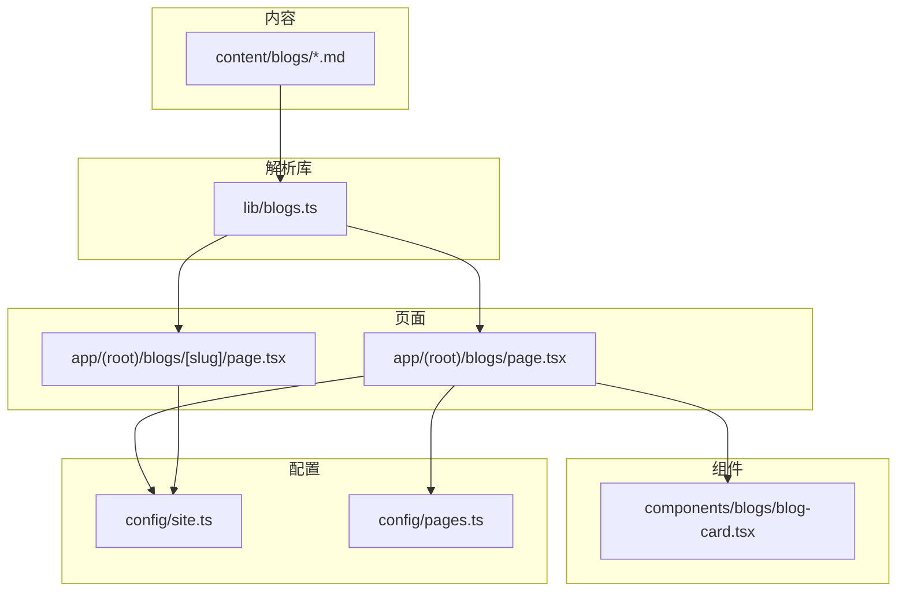
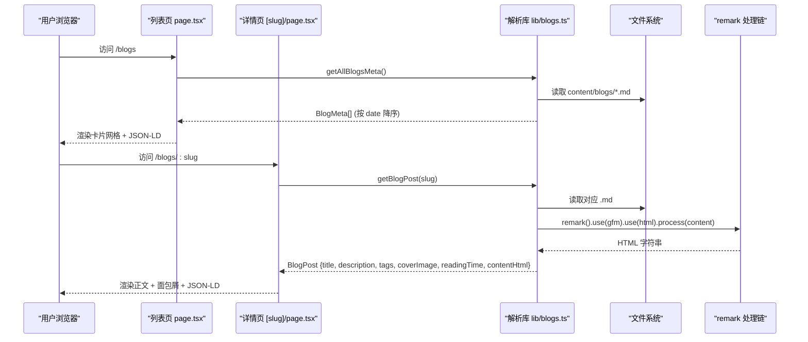
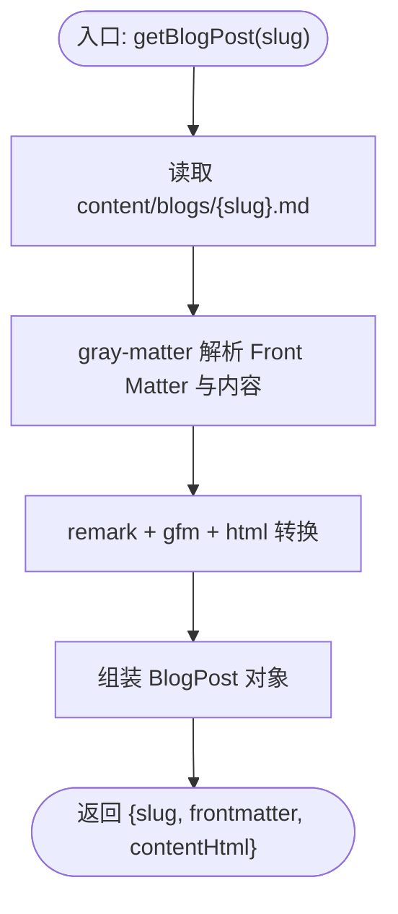
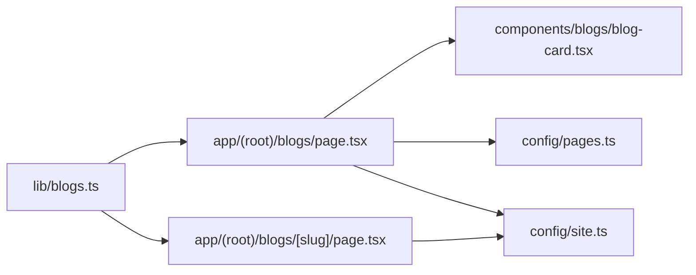

# 博客系统

<cite>
**本文引用的文件**
- [lib/blogs.ts](file://lib/blogs.ts)
- [components/blogs/blog-card.tsx](file://components/blogs/blog-card.tsx)
- [app/(root)/blogs/page.tsx](file://app/(root)/blogs/page.tsx)
- [app/(root)/blogs/[slug]/page.tsx](file://app/(root)/blogs/[slug]/page.tsx)
- [config/site.ts](file://config/site.ts)
- [config/pages.ts](file://config/pages.ts)
- [content/blogs/3d-card-threejs-blender.md](file://content/blogs/3d-card-threejs-blender.md)
- [package.json](file://package.json)
</cite>

## 目录
1. [简介](#简介)
2. [项目结构](#项目结构)
3. [核心组件](#核心组件)
4. [架构总览](#架构总览)
5. [详细组件分析](#详细组件分析)
6. [依赖关系分析](#依赖关系分析)
7. [性能考量](#性能考量)
8. [故障排查指南](#故障排查指南)
9. [结论](#结论)
10. [附录](#附录)

## 简介
本仓库实现了一个基于 Next.js 的博客模块，采用“Markdown + Front Matter”的内容管理方式。内容位于 content/blogs 目录，通过 gray-matter 解析元数据，使用 remark 生态将 Markdown 转换为 HTML，并在列表页与详情页进行渲染。列表页提供文章卡片展示（标题、摘要、标签、日期、阅读时长），详情页负责文章内容渲染、SEO 结构化数据注入、社交媒体预览图设置等。本文档面向初学者与高级开发者，既解释基本概念，也给出深入实现细节与扩展建议。

## 项目结构
- 内容层：content/blogs/*.md，每篇文章一个 Markdown 文件，包含 YAML Front Matter 元数据。
- 解析层：lib/blogs.ts，负责读取、解析、排序、HTML 转换与工具函数。
- 页面层：
  - app/(root)/blogs/page.tsx：博客列表页，渲染卡片网格与 SEO JSON-LD。
  - app/(root)/blogs/[slug]/page.tsx：博客详情页，渲染正文、面包屑、SEO 与社交分享信息。
- 组件层：components/blogs/blog-card.tsx，用于展示单篇文章的卡片视图。
- 配置层：config/site.ts、config/pages.ts，集中站点信息与页面文案。
- 依赖：gray-matter、remark、remark-gfm、remark-html 等。

图表来源
- [lib/blogs.ts:1-97](file://lib/blogs.ts#L1-L97)
- [app/(root)/blogs/page.tsx:1-153](file://app/(root)/blogs/page.tsx#L1-L153)
- [app/(root)/blogs/[slug]/page.tsx:1-325](file://app/(root)/blogs/[slug]/page.tsx#L1-L325)
- [components/blogs/blog-card.tsx:1-96](file://components/blogs/blog-card.tsx#L1-L96)
- [config/site.ts:1-41](file://config/site.ts#L1-L41)
- [config/pages.ts:1-86](file://config/pages.ts#L1-L86)

章节来源
- [lib/blogs.ts:1-97](file://lib/blogs.ts#L1-L97)
- [app/(root)/blogs/page.tsx:1-153](file://app/(root)/blogs/page.tsx#L1-L153)
- [app/(root)/blogs/[slug]/page.tsx:1-325](file://app/(root)/blogs/[slug]/page.tsx#L1-L325)
- [components/blogs/blog-card.tsx:1-96](file://components/blogs/blog-card.tsx#L1-L96)
- [config/site.ts:1-41](file://config/site.ts#L1-L41)
- [config/pages.ts:1-86](file://config/pages.ts#L1-L86)

## 核心组件
- 博客解析库（lib/blogs.ts）
  - 定义接口：BlogFrontmatter、BlogMeta、BlogPost。
  - 能力：获取所有 slug、获取全部元数据并排序、按 slug 获取完整文章（含 HTML）、精选文章筛选、阅读时长估算。
  - 技术栈：fs/path 读取文件；gray-matter 解析 Front Matter；remark + remark-gfm + remark-html 将 Markdown 转为 HTML。
- 博客卡片（components/blogs/blog-card.tsx）
  - 展示封面图、标签（最多显示前三个，其余以“+N”提示）、标题、描述、格式化日期、阅读时长、箭头指示。
  - 链接到 /blogs/[slug]。
- 博客列表页（app/(root)/blogs/page.tsx）
  - 调用 getAllBlogsMeta() 获取并按时间倒序排列的文章元数据。
  - 注入 CollectionPage 与 BreadcrumbList 的 JSON-LD。
  - 渲染卡片网格，空状态占位。
- 博客详情页（app/(root)/blogs/[slug]/page.tsx）
  - generateStaticParams 静态生成所有文章路由。
  - generateMetadata 动态生成页面元信息（标题、描述、关键词、OG/Twitter、robots）。
  - 渲染面包屑、标签、标题、作者、日期、阅读时长、封面图、正文 HTML。
  - 注入 BlogPosting 与 BreadcrumbList 的 JSON-LD。

章节来源
- [lib/blogs.ts:11-27](file://lib/blogs.ts#L11-L27)
- [lib/blogs.ts:35-97](file://lib/blogs.ts#L35-L97)
- [components/blogs/blog-card.tsx:1-96](file://components/blogs/blog-card.tsx#L1-L96)
- [app/(root)/blogs/page.tsx:11-153](file://app/(root)/blogs/page.tsx#L11-L153)
- [app/(root)/blogs/[slug]/page.tsx:20-325](file://app/(root)/blogs/[slug]/page.tsx#L20-L325)

## 架构总览
下图展示了从 Markdown 文件到页面渲染的关键流程，包括解析、转换与 SEO 注入。

图表来源
- [app/(root)/blogs/page.tsx:41-153](file://app/(root)/blogs/page.tsx#L41-L153)
- [app/(root)/blogs/[slug]/page.tsx:20-325](file://app/(root)/blogs/[slug]/page.tsx#L20-L325)
- [lib/blogs.ts:35-97](file://lib/blogs.ts#L35-L97)

## 详细组件分析

### 博客解析库（lib/blogs.ts）
- 数据结构
  - BlogFrontmatter：title、date、description、tags、coverImage、readingTime、featured。
  - BlogMeta：在 Frontmatter 基础上增加 slug。
  - BlogPost：在 Meta 基础上增加 contentHtml。
- 关键函数
  - ensureBlogsDir：确保 content/blogs 目录存在。
  - getAllBlogSlugs：列出所有 .md 文件名（不含扩展名）。
  - getAllBlogsMeta：读取每个文件的 Front Matter，返回按 date 倒序的元数据数组。
  - getBlogPost：读取单个文件，解析 Front Matter 与内容，remark 转 HTML，返回完整文章对象。
  - getFeaturedBlogs：优先返回 featured=true 的文章，否则取最新 3 篇。
  - estimateReadingTime：按词数估算阅读时长（默认每分钟 200 词）。
- 复杂度
  - getAllBlogsMeta：O(N) 读取 N 个文件，排序 O(N log N)。
  - getBlogPost：I/O 一次文件读取 + 解析，remark 处理时间与内容长度线性相关。
- 错误处理
  - 若目录不存在则自动创建；读取失败会在调用方捕获（详情页使用 try/catch 后 notFound）。
- 优化点
  - 可引入缓存（如内存 Map 或文件系统缓存）避免重复 I/O。
  - 对 remark 管道可考虑并行化（多文件场景）或增量构建。

图表来源
- [lib/blogs.ts:64-82](file://lib/blogs.ts#L64-L82)

章节来源
- [lib/blogs.ts:11-27](file://lib/blogs.ts#L11-L27)
- [lib/blogs.ts:29-97](file://lib/blogs.ts#L29-L97)

### 博客卡片组件（components/blogs/blog-card.tsx）
- 输入：BlogMeta。
- 展示要点
  - 封面图：可选，带渐变遮罩与悬停缩放效果。
  - 标签：最多显示前 3 个，超出以 “+N” 表示。
  - 标题与描述：截断显示，提升卡片一致性。
  - 日期与阅读时长：格式化日期，ISO time 属性便于语义化。
  - 交互：整卡为 Link，指向 /blogs/[slug]。
- 可访问性
  - aria-label 标注标签区域；time 元素提供机器可读时间。
- 性能
  - 图片使用 next/image 的 fill 模式，配合容器高度控制布局。

章节来源
- [components/blogs/blog-card.tsx:1-96](file://components/blogs/blog-card.tsx#L1-L96)

### 博客列表页（app/(root)/blogs/page.tsx）
- 功能
  - 获取并渲染所有文章元数据（按 date 倒序）。
  - 注入 CollectionPage 与 BreadcrumbList 的 JSON-LD，利于搜索引擎理解站点结构。
  - 空状态友好提示。
- SEO
  - Metadata 中设置 canonical、Open Graph、Twitter Card。
- 可扩展
  - 可在该页添加搜索框与标签过滤逻辑（见“搜索、分类与标签”扩展方案）。

章节来源
- [app/(root)/blogs/page.tsx:11-153](file://app/(root)/blogs/page.tsx#L11-L153)

### 博客详情页（app/(root)/blogs/[slug]/page.tsx）
- 功能
  - generateStaticParams：根据所有 slug 预生成静态路由。
  - generateMetadata：动态生成标题、描述、关键词、OG/Twitter、robots 等。
  - 渲染面包屑导航、标签、标题、作者、日期、阅读时长、封面图、正文 HTML。
  - 注入 BlogPosting 与 BreadcrumbList 的 JSON-LD。
- 错误处理
  - 若文章不存在，调用 notFound() 返回 404。
- 图片优化
  - 封面图使用 next/image，设置 width/height 与 priority，提升首屏加载体验。

章节来源
- [app/(root)/blogs/[slug]/page.tsx:20-325](file://app/(root)/blogs/[slug]/page.tsx#L20-L325)

### 内容与元数据格式
- 位置：content/blogs/*.md
- Front Matter 字段
  - title：文章标题
  - date：发布日期（用于排序与 SEO）
  - description：文章摘要（用于卡片与 SEO）
  - tags：标签数组（用于展示与关键词）
  - coverImage：封面图路径（相对站点根）
  - readingTime：阅读时长（分钟，可选）
  - featured：是否精选（可选）
- 示例参考
  - 参见示例文章的 Front Matter 与正文结构。

章节来源
- [content/blogs/3d-card-threejs-blender.md:1-9](file://content/blogs/3d-card-threejs-blender.md#L1-L9)

## 依赖关系分析
- 运行时依赖
  - gray-matter：解析 Markdown 的 Front Matter。
  - remark、remark-gfm、remark-html：Markdown 到 HTML 的转换，支持 GFM 语法。
- 页面与组件
  - 列表页与详情页均依赖 lib/blogs.ts 提供的数据与转换能力。
  - 列表页依赖 blog-card 组件统一展示风格。
- 配置
  - config/site.ts：站点名称、作者、URL、OG 图片、社交链接等。
  - config/pages.ts：各页面标题与描述文案。

图表来源
- [lib/blogs.ts:1-97](file://lib/blogs.ts#L1-L97)
- [app/(root)/blogs/page.tsx:1-153](file://app/(root)/blogs/page.tsx#L1-L153)
- [app/(root)/blogs/[slug]/page.tsx:1-325](file://app/(root)/blogs/[slug]/page.tsx#L1-L325)
- [components/blogs/blog-card.tsx:1-96](file://components/blogs/blog-card.tsx#L1-L96)
- [config/site.ts:1-41](file://config/site.ts#L1-L41)
- [config/pages.ts:1-86](file://config/pages.ts#L1-L86)

章节来源
- [package.json:11-44](file://package.json#L11-L44)
- [lib/blogs.ts:1-97](file://lib/blogs.ts#L1-L97)

## 性能考量
- 静态生成
  - 详情页使用 generateStaticParams 预生成路由，减少请求时延迟。
- 文件 I/O
  - 列表页一次性读取所有 .md 文件，适合中小规模内容；内容量大时可考虑缓存或增量构建。
- 内容转换
  - remark 管道轻量高效；如需复杂插件（如代码高亮、表格增强）可按需接入。
- 图片优化
  - 使用 next/image 的 fill/priority 与尺寸约束，降低 CLS 并提升 LCP。
- 可访问性与 SEO
  - 合理使用 JSON-LD、canonical、OG/Twitter 卡片，有助于索引与分享质量。

[本节为通用指导，不直接分析具体文件]

## 故障排查指南
- 常见问题
  - 找不到文章：检查 slug 是否与文件名一致；详情页在异常时会触发 notFound。
  - 列表为空：确认 content/blogs 目录下存在 .md 文件且 Front Matter 字段完整。
  - 日期排序异常：确保 date 字段为有效日期字符串。
  - 图片不显示：确认 coverImage 路径相对于站点根正确。
- 定位方法
  - 在 getBlogPost 处加日志，观察 raw 内容与 matter 解析结果。
  - 在列表页打印 getAllBlogsMeta 的结果，验证元数据是否正确。
  - 检查 remark 输出 HTML 是否符合预期。

章节来源
- [app/(root)/blogs/[slug]/page.tsx:81-89](file://app/(root)/blogs/[slug]/page.tsx#L81-L89)
- [lib/blogs.ts:29-82](file://lib/blogs.ts#L29-L82)

## 结论
该博客系统以“Markdown + Front Matter”为核心，结合 Next.js 的静态生成与强大的 SEO 能力，提供了简洁而可扩展的博客解决方案。列表页与详情页职责清晰，解析库封装了 I/O 与转换逻辑，组件层专注于展示。对于初学者，可直接新增 Markdown 文件发布文章；对于高级开发者，可在列表页扩展搜索与标签过滤、在详情页接入代码高亮与图片懒加载等能力。

[本节为总结性内容，不直接分析具体文件]

## 附录

### 如何创建新文章
- 在 content/blogs 下新建 .md 文件，命名即为 slug。
- 在文件顶部添加 Front Matter，至少包含 title、date、description、tags。
- 可选：coverImage、readingTime、featured。
- 编写正文内容，支持 Markdown 与 GFM。

章节来源
- [content/blogs/3d-card-threejs-blender.md:1-9](file://content/blogs/3d-card-threejs-blender.md#L1-L9)

### 编辑现有内容
- 直接修改对应 .md 文件即可，无需重启服务（开发模式下）。
- 如需调整阅读时长，更新 readingTime 或在解析库中调整估算策略。

章节来源
- [lib/blogs.ts:91-97](file://lib/blogs.ts#L91-L97)

### 自定义文章格式
- 扩展 Front Matter：在 lib/blogs.ts 的接口中添加新字段，并在 getBlogPost 中透传。
- 扩展渲染：在 remark 管道中加入插件（例如 remark-toc、remark-math、remark-code-highlight 等）。
- 注意：保持向后兼容，未提供的字段应允许缺失。

章节来源
- [lib/blogs.ts:11-27](file://lib/blogs.ts#L11-L27)
- [lib/blogs.ts:64-82](file://lib/blogs.ts#L64-L82)

### 实现搜索、分类与标签功能（扩展方案）
- 目标
  - 在列表页提供文本搜索、按标签筛选、按日期范围筛选。
- 思路
  - 客户端搜索：在列表页维护本地 blogs 数组，监听输入变化，按 title/description/tags 过滤。
  - 服务端过滤：在 getAllBlogsMeta 基础上增加 filter 参数，返回过滤后的元数据。
  - URL 同步：将筛选条件写入 URL 查询参数，便于分享与刷新保持状态。
- 步骤概览
  - 在列表页添加搜索框与标签选择器。
  - 使用 React state 保存当前筛选条件。
  - 计算过滤结果并渲染。
  - 可选：将过滤逻辑下沉至 lib/blogs.ts，以便 SSR/SSG 阶段也可用。
- 注意事项
  - 大集合时考虑分页或虚拟滚动。
  - 标签去重与排序，提升用户体验。

[本节为概念性扩展说明，不直接分析具体文件]

### SEO 与社交媒体预览集成
- 列表页
  - 设置 canonical、Open Graph、Twitter Card。
  - 注入 CollectionPage 与 BreadcrumbList JSON-LD。
- 详情页
  - 动态生成标题、描述、关键词、OG/Twitter 图片。
  - 注入 BlogPosting 与 BreadcrumbList JSON-LD。
- 站点配置
  - 在 config/site.ts 中集中管理站点名称、作者、URL、OG 图片、社交链接等。

章节来源
- [app/(root)/blogs/page.tsx:11-120](file://app/(root)/blogs/page.tsx#L11-L120)
- [app/(root)/blogs/[slug]/page.tsx:25-79](file://app/(root)/blogs/[slug]/page.tsx#L25-L79)
- [config/site.ts:1-41](file://config/site.ts#L1-L41)

### 代码高亮与图片优化（扩展建议）
- 代码高亮
  - 在 remark 管道中加入 remark-rehype 与 rehype-pretty-code 或类似插件，实现语法高亮。
  - 注意样式与主题切换的兼容性。
- 图片优化
  - 使用 next/image 的 width/height、placeholder、loading="lazy" 等属性。
  - 对封面图使用 priority，正文图片按需懒加载。

[本节为通用建议，不直接分析具体文件]