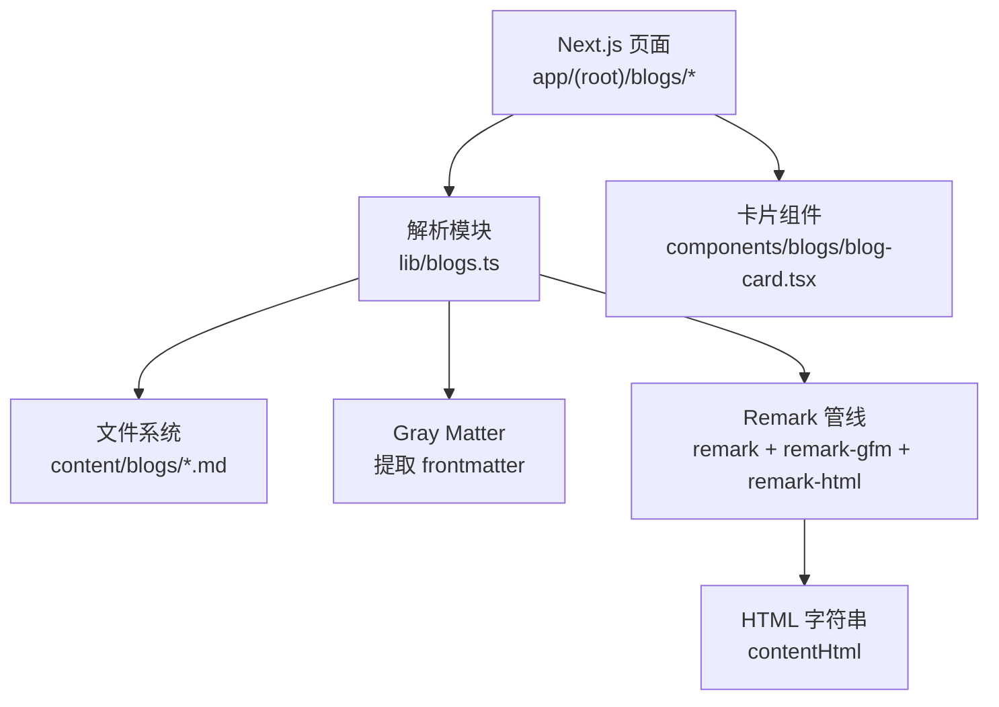
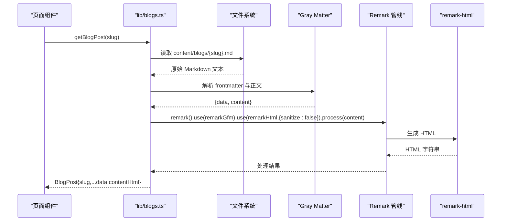
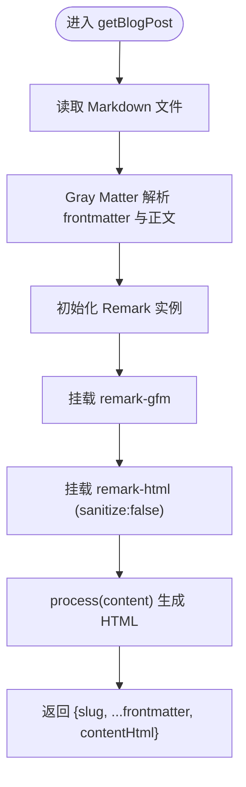
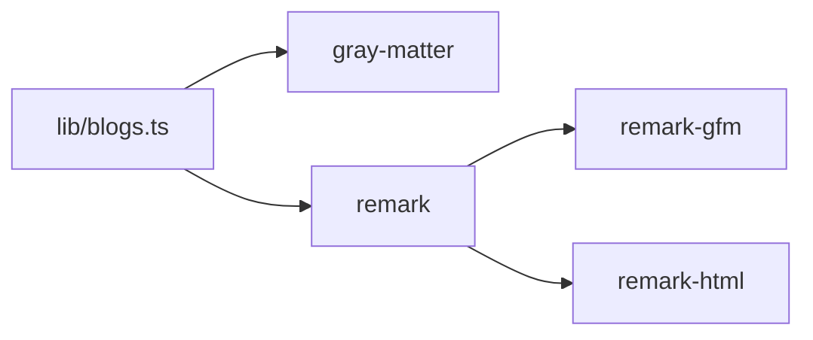

# 博客解析与渲染

<cite>
**本文引用的文件**
- [lib/blogs.ts](file://lib/blogs.ts)
- [package.json](file://package.json)
- [app/(root)/blogs/[slug]/page.tsx](file://app/(root)/blogs/[slug]/page.tsx)
- [app/(root)/blogs/page.tsx](file://app/(root)/blogs/page.tsx)
- [app/(root)/page.tsx](file://app/(root)/page.tsx)
- [components/blogs/blog-card.tsx](file://components/blogs/blog-card.tsx)
- [content/blogs/3d-card-threejs-blender.md](file://content/blogs/3d-card-threejs-blender.md)
</cite>

## 目录
1. [简介](#简介)
2. [项目结构](#项目结构)
3. [核心组件](#核心组件)
4. [架构总览](#架构总览)
5. [详细组件分析](#详细组件分析)
6. [依赖关系分析](#依赖关系分析)
7. [性能考量](#性能考量)
8. [故障排查指南](#故障排查指南)
9. [结论](#结论)
10. [附录](#附录)

## 简介
本文件面向“基于 Gray Matter 与 Remark 的博客解析与渲染系统”的完整技术说明。内容覆盖：
- Markdown 解析流程：frontmatter 提取、内容处理、HTML 转换
- getBlogPost 函数实现原理，remark-gfm 支持 GitHub 风格语法，remark-html 渲染配置
- sanitize: false 的安全考量与自定义渲染需求
- estimateReadingTime 阅读时间估算算法（单词计数与每分钟阅读速度）
- featured 博客筛选机制（getFeaturedBlogs）
- 扩展方法：添加新 Remark 插件、自定义 HTML 处理器与安全过滤器
- 复杂 Markdown 处理示例与渲染性能优化建议

## 项目结构
本项目采用 Next.js App Router 组织页面，博客内容以 Markdown 文件存放于 content/blogs，解析与渲染逻辑集中在 lib/blogs.ts，页面层负责调用并展示结果。

图表来源
- [lib/blogs.ts:1-96](file://lib/blogs.ts#L1-L96)
- [app/(root)/blogs/[slug]/page.tsx:84-138](file://app/(root)/blogs/[slug]/page.tsx#L84-L138)
- [components/blogs/blog-card.tsx:1-96](file://components/blogs/blog-card.tsx#L1-L96)

章节来源
- [lib/blogs.ts:1-96](file://lib/blogs.ts#L1-L96)
- [package.json:1-73](file://package.json#L1-L73)

## 核心组件
- 数据模型
  - BlogFrontmatter：标题、日期、描述、标签、封面图、可选阅读时间与是否精选
  - BlogMeta：在 Frontmatter 基础上增加 slug
  - BlogPost：在 Meta 基础上增加 contentHtml
- 关键函数
  - getAllBlogSlugs：列出所有 .md 文件的 slug
  - getAllBlogsMeta：读取每个 .md 的 frontmatter，按日期倒序排序
  - getBlogPost：读取单个 .md，提取 frontmatter 与正文，通过 Remark 管线转换为 HTML
  - getFeaturedBlogs：优先返回 marked featured: true 的文章，最多 3 篇；否则返回最新 3 篇
  - estimateReadingTime：基于单词数与每分钟阅读速度估算阅读时间

章节来源
- [lib/blogs.ts:11-27](file://lib/blogs.ts#L11-L27)
- [lib/blogs.ts:35-96](file://lib/blogs.ts#L35-L96)

## 架构总览
下图展示了从页面请求到最终渲染的关键调用链：页面调用解析模块，解析模块读取 Markdown，使用 Gray Matter 提取元数据，使用 Remark 管线将 Markdown 转为 HTML，最后由页面或组件渲染。

图表来源
- [lib/blogs.ts:64-82](file://lib/blogs.ts#L64-L82)
- [package.json:26-38](file://package.json#L26-L38)

## 详细组件分析

### 解析与渲染管线（getBlogPost）
- 输入：文章 slug
- 步骤
  1) 构建文件路径并读取原始 Markdown
  2) Gray Matter 提取 frontmatter 与正文
  3) Remark 初始化并挂载插件：
     - remark-gfm：启用表格、删除线、任务列表等 GitHub 风格语法
     - remark-html：将 AST 转换为 HTML 字符串，配置 sanitize: false
  4) 合并 frontmatter 与 contentHtml 返回
- 输出：BlogPost

图表来源
- [lib/blogs.ts:64-82](file://lib/blogs.ts#L64-L82)

章节来源
- [lib/blogs.ts:64-82](file://lib/blogs.ts#L64-L82)

### 安全与 sanitize: false
- 默认行为：remark-html 内置 sanitization，会移除不安全的标签/属性，防止 XSS
- 当前配置：sanitize: false 关闭了默认过滤，允许保留更多 HTML（例如内联脚本、样式等）
- 适用场景：当需要完全控制输出 HTML（如嵌入第三方组件、富文本编辑器产物）且对内容来源有强信任时
- 风险与建议：
  - 若内容来自用户生成，应引入白名单过滤（如 DOMPurify）或自定义 remark 处理器进行二次清洗
  - 可结合服务端渲染策略与 CSP 头进一步降低风险
  - 对于仅展示受控内容的博客，可在发布前人工审核或使用 CI 校验

章节来源
- [lib/blogs.ts:70-73](file://lib/blogs.ts#L70-L73)

### 阅读时间估算（estimateReadingTime）
- 算法
  - 定义每分钟阅读速度 wordsPerMinute = 200
  - 对原始 Markdown 正文去除首尾空白后按空白分割统计词数
  - 向上取整得到分钟数
- 复杂度
  - 时间 O(N)，N 为字符数（trim/split 遍历一次）
  - 空间 O(N)，用于存储分割后的数组
- 扩展点
  - 可按语言调整 wordsPerMinute
  - 可忽略代码块、图片 alt 等不计入的词段
  - 可结合段落/标题权重加权计算

章节来源
- [lib/blogs.ts:91-96](file://lib/blogs.ts#L91-L96)

### 精选博客筛选（getFeaturedBlogs）
- 逻辑
  - 获取全部博客元信息并按日期倒序
  - 过滤出 featured: true 的文章
  - 若有精选文章，返回前 3 篇；否则返回最新 3 篇
- 用途
  - 首页推荐区、博客列表顶部展示
  - 配合 UI 组件展示封面、标签、摘要、阅读时长

章节来源
- [lib/blogs.ts:84-89](file://lib/blogs.ts#L84-L89)
- [app/(root)/page.tsx:289-326](file://app/(root)/page.tsx#L289-L326)
- [components/blogs/blog-card.tsx:1-96](file://components/blogs/blog-card.tsx#L1-L96)

### 页面集成与 SEO
- 详情页
  - 调用 getBlogPost 获取单篇文章
  - 构造 JSON-LD（BlogPosting），包含标题、描述、发布时间、作者、关键词、字数、预计阅读时间等
- 列表页
  - 展示所有文章卡片，支持空状态提示
- 首页
  - 展示精选文章卡片网格

章节来源
- [app/(root)/blogs/[slug]/page.tsx:84-138](file://app/(root)/blogs/[slug]/page.tsx#L84-L138)
- [app/(root)/blogs/page.tsx:109-152](file://app/(root)/blogs/page.tsx#L109-L152)
- [app/(root)/page.tsx:289-326](file://app/(root)/page.tsx#L289-L326)

### 复杂 Markdown 内容与示例
- 示例文件：content/blogs/3d-card-threejs-blender.md
  - 包含 frontmatter（title、date、description、tags、coverImage、featured、readingTime）
  - 包含多级标题、链接、代码块、分隔线、列表等
- 解析效果
  - gray-matter 正确提取 frontmatter
  - remark-gfm 支持常见 GitHub 风格语法
  - remark-html 输出 HTML 供前端渲染

章节来源
- [content/blogs/3d-card-threejs-blender.md:1-305](file://content/blogs/3d-card-threejs-blender.md#L1-L305)

## 依赖关系分析
- 运行时依赖
  - gray-matter：解析 frontmatter
  - remark：Markdown 解析与转换核心
  - remark-gfm：GitHub 风格扩展
  - remark-html：AST 转 HTML
- 版本与兼容性
  - package.json 中声明了上述依赖的版本范围，确保稳定运行环境

图表来源
- [lib/blogs.ts:1-8](file://lib/blogs.ts#L1-L8)
- [package.json:26-38](file://package.json#L26-L38)

章节来源
- [package.json:1-73](file://package.json#L1-L73)

## 性能考量
- I/O 与缓存
  - 当前实现每次请求同步读取文件，适合小体量博客；生产环境可考虑构建期预渲染或内存缓存
- 解析开销
  - 大文档下 split/trim 与 AST 转换可能成为瓶颈，可考虑分块处理或增量更新
- 渲染优化
  - 避免重复解析：对同一 slug 的结果做短期缓存
  - 按需加载：仅在详情页解析 HTML，列表页仅使用 meta
  - 静态化：对热门文章使用 SSG/ISR 提前生成 HTML

[本节提供通用指导，不直接分析具体文件]

## 故障排查指南
- 常见问题
  - 找不到 content/blogs 目录：ensureBlogsDir 会自动创建，但需确认写入权限
  - 文件编码问题：确保 .md 使用 UTF-8
  - 解析失败：检查 frontmatter 格式是否正确（YAML 语法）
  - 渲染异常：sanitize: false 可能导致不安全 HTML，必要时引入过滤
- 定位方法
  - 在 getBlogPost 前后打印日志，确认 raw、data、content 与 contentHtml
  - 使用浏览器开发者工具查看最终 HTML 结构
  - 检查 package.json 中依赖版本是否与预期一致

章节来源
- [lib/blogs.ts:29-33](file://lib/blogs.ts#L29-L33)
- [lib/blogs.ts:64-82](file://lib/blogs.ts#L64-L82)

## 结论
本系统以 Gray Matter 与 Remark 为核心，实现了从 Markdown 到 HTML 的端到端解析与渲染。通过 remark-gfm 支持 GitHub 风格语法，通过 remark-html 完成 HTML 输出，并提供 sanitize: false 的灵活选项以满足富文本需求。阅读时间估算与精选文章筛选增强了用户体验。后续可扩展为缓存、SSG/ISR、安全过滤与自定义处理器，进一步提升性能与安全性。

[本节总结性内容，不直接分析具体文件]

## 附录

### 自定义解析器扩展方法
- 添加新的 Remark 插件
  - 在 getBlogPost 的 remark 链中插入 use(你的插件)
  - 适用于：代码高亮、数学公式、脚注、自定义节点转换等
- 自定义 HTML 处理器
  - 通过 remark 的 visit/transform 修改 AST，再交由 remark-html 输出
  - 可用于：重写链接目标、注入 data-* 属性、替换特定节点为 React 组件占位符
- 安全过滤器
  - 方案一：在 remark-html 之前接入 sanitizer（如 DOMPurify 的 AST 版本）
  - 方案二：自定义 remark 插件，基于白名单规则清理节点
  - 方案三：在服务端对最终 HTML 进行二次清洗后再返回

[本节为概念性指导，不直接分析具体文件]

### 复杂 Markdown 处理示例与优化
- 示例参考
  - content/blogs/3d-card-threejs-blender.md：包含 frontmatter、多级别标题、代码块、链接、分隔线等
- 优化建议
  - 列表页仅读取 meta，详情页再解析 HTML，减少不必要开销
  - 对长文进行分页或懒加载
  - 对常用片段（如目录、TOC）进行缓存
  - 使用构建期预渲染热门文章，提升首屏性能

章节来源
- [content/blogs/3d-card-threejs-blender.md:1-305](file://content/blogs/3d-card-threejs-blender.md#L1-L305)