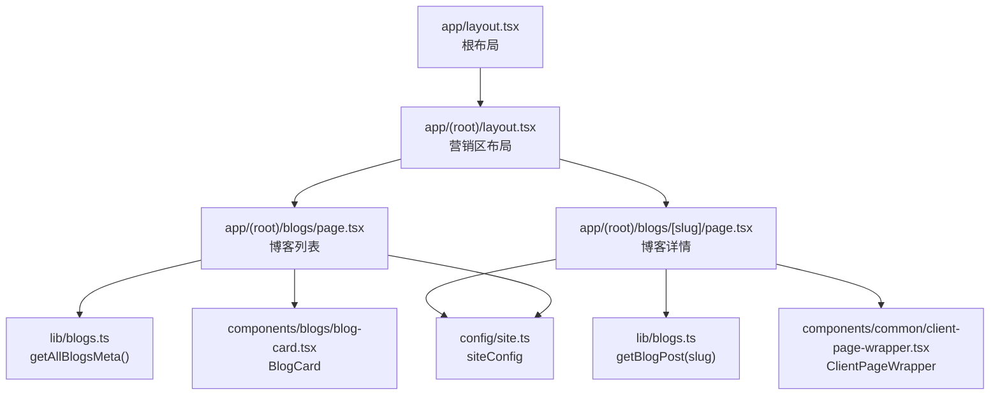
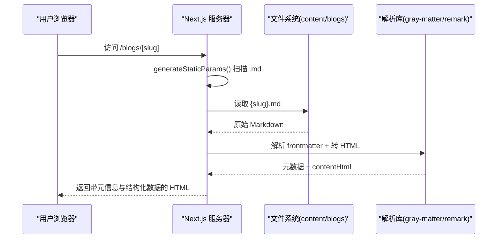
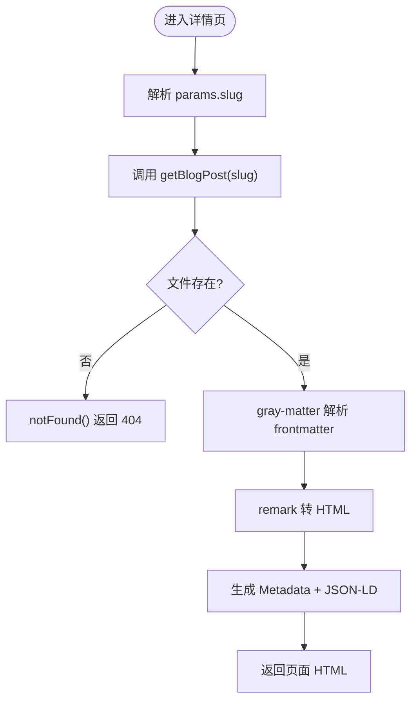
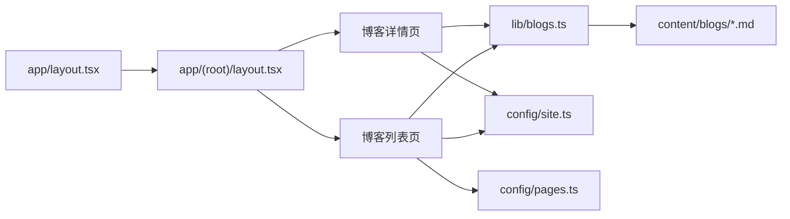

# 博客页面与路由

<cite>
**本文引用的文件**
- [app/(root)/blogs/page.tsx](file://app/(root)/blogs/page.tsx)
- [app/(root)/blogs/[slug]/page.tsx](file://app/(root)/blogs/[slug]/page.tsx)
- [lib/blogs.ts](file://lib/blogs.ts)
- [components/blogs/blog-card.tsx](file://components/blogs/blog-card.tsx)
- [components/common/client-page-wrapper.tsx](file://components/common/client-page-wrapper.tsx)
- [config/site.ts](file://config/site.ts)
- [config/pages.ts](file://config/pages.ts)
- [app/layout.tsx](file://app/layout.tsx)
- [app/(root)/layout.tsx](file://app/(root)/layout.tsx)
- [next.config.js](file://next.config.js)
</cite>

## 目录
1. [简介](#简介)
2. [项目结构](#项目结构)
3. [核心组件](#核心组件)
4. [架构总览](#架构总览)
5. [详细组件分析](#详细组件分析)
6. [依赖关系分析](#依赖关系分析)
7. [性能考量](#性能考量)
8. [故障排查指南](#故障排查指南)
9. [结论](#结论)
10. [附录](#附录)

## 简介
本文件围绕 Next.js App Router 下的博客模块，系统性说明动态路由、数据获取、SEO 优化、错误处理与性能策略。重点覆盖：
- 动态路由 [slug] 的工作原理与静态参数生成
- 博客列表页的数据聚合、排序与展示
- 博客详情页的内容渲染、结构化数据注入与导航
- 服务端/客户端组件职责分离与 SSR/SSG 优势
- SEO：动态元信息、JSON-LD、社交媒体预览
- 错误处理：404、网络/文件系统异常与友好提示
- 性能：静态生成、缓存与图片优化等实践

## 项目结构
博客功能位于 app/(root)/blogs 目录下，采用 Next.js App Router 的目录即路由约定：
- /blogs：博客列表页（服务端组件）
- /blogs/[slug]：博客详情动态路由（服务端组件 + 静态参数生成）
- lib/blogs.ts：Markdown 文件读取、解析、HTML 转换与元数据提取
- components/blogs/blog-card.tsx：文章卡片组件
- config/*：站点配置、页面文案与元信息
- app/layout.tsx 与 app/(root)/layout.tsx：全局布局与区域布局

图表来源
- [app/(root)/blogs/page.tsx:1-153](file://app/(root)/blogs/page.tsx#L1-L153)
- [app/(root)/blogs/[slug]/page.tsx:1-325](file://app/(root)/blogs/[slug]/page.tsx#L1-L325)
- [lib/blogs.ts:1-97](file://lib/blogs.ts#L1-L97)
- [components/blogs/blog-card.tsx:1-96](file://components/blogs/blog-card.tsx#L1-L96)
- [components/common/client-page-wrapper.tsx:1-37](file://components/common/client-page-wrapper.tsx#L1-L37)
- [config/site.ts:1-41](file://config/site.ts#L1-L41)
- [app/layout.tsx:1-145](file://app/layout.tsx#L1-L145)
- [app/(root)/layout.tsx:1-33](file://app/(root)/layout.tsx#L1-L33)

章节来源
- [app/(root)/blogs/page.tsx:1-153](file://app/(root)/blogs/page.tsx#L1-L153)
- [app/(root)/blogs/[slug]/page.tsx:1-325](file://app/(root)/blogs/[slug]/page.tsx#L1-L325)
- [lib/blogs.ts:1-97](file://lib/blogs.ts#L1-L97)
- [config/site.ts:1-41](file://config/site.ts#L1-L41)
- [config/pages.ts:1-86](file://config/pages.ts#L1-L86)
- [app/layout.tsx:1-145](file://app/layout.tsx#L1-L145)
- [app/(root)/layout.tsx:1-33](file://app/(root)/layout.tsx#L1-L33)

## 核心组件
- 博客列表页（服务端组件）：负责从 Markdown 源文件收集元数据、构建 SEO 元信息与 JSON-LD、渲染文章卡片网格。
- 博客详情页（服务端组件）：根据动态 slug 读取并解析 Markdown，生成文章 HTML，注入结构化数据，提供面包屑与导航。
- 数据层（lib/blogs.ts）：封装文件读取、frontmatter 解析、remark 转 HTML、排序与工具函数。
- 卡片组件（BlogCard）：展示封面图、标签、标题、摘要、日期与阅读时长，链接到详情。
- 客户端包装器（ClientPageWrapper）：为详情页提供客户端动画包裹。

章节来源
- [app/(root)/blogs/page.tsx:1-153](file://app/(root)/blogs/page.tsx#L1-L153)
- [app/(root)/blogs/[slug]/page.tsx:1-325](file://app/(root)/blogs/[slug]/page.tsx#L1-L325)
- [lib/blogs.ts:1-97](file://lib/blogs.ts#L1-L97)
- [components/blogs/blog-card.tsx:1-96](file://components/blogs/blog-card.tsx#L1-L96)
- [components/common/client-page-wrapper.tsx:1-37](file://components/common/client-page-wrapper.tsx#L1-L37)

## 架构总览
Next.js App Router 将路由映射到目录结构，博客模块通过以下流程工作：
- 构建期：generateStaticParams 扫描所有 .md 文件，预生成每个 slug 对应的静态页面。
- 请求期：列表页与服务端组件在服务器端读取 Markdown 并转换为 HTML，减少客户端负担。
- SEO：页面级 metadata 与 Script(JSON-LD) 注入结构化数据，提升搜索引擎与社交分享效果。
- 交互：详情页使用客户端包装器实现入场动画，不影响首屏内容加载。

图表来源
- [app/(root)/blogs/[slug]/page.tsx:20-23](file://app/(root)/blogs/[slug]/page.tsx#L20-L23)
- [lib/blogs.ts:35-82](file://lib/blogs.ts#L35-L82)

## 详细组件分析

### 动态路由 [slug] 与数据获取机制
- 动态路由：app/(root)/blogs/[slug]/page.tsx 定义动态段 slug，并通过 Promise params 接收参数。
- 静态参数生成：generateStaticParams 调用 getAllBlogSlugs 遍历 content/blogs 下所有 .md 文件名，生成对应路由参数，使每个文章在构建时即可被静态化。
- 数据获取：getBlogPost 读取对应 .md 文件，使用 gray-matter 解析 frontmatter，再用 remark 系列插件将 Markdown 转为 HTML。
- 错误处理：若文件不存在或解析失败，调用 notFound() 触发 404。

图表来源
- [app/(root)/blogs/[slug]/page.tsx:20-23](file://app/(root)/blogs/[slug]/page.tsx#L20-L23)
- [app/(root)/blogs/[slug]/page.tsx:81-89](file://app/(root)/blogs/[slug]/page.tsx#L81-L89)
- [lib/blogs.ts:35-82](file://lib/blogs.ts#L35-L82)

章节来源
- [app/(root)/blogs/[slug]/page.tsx:1-325](file://app/(root)/blogs/[slug]/page.tsx#L1-L325)
- [lib/blogs.ts:1-97](file://lib/blogs.ts#L1-L97)

### 博客列表页：排序、分页、搜索与标签筛选
- 当前实现：
  - 数据：getAllBlogsMeta 读取所有 .md 文件的 frontmatter，并按 date 倒序排列。
  - 展示：以网格形式渲染 BlogCard，支持空状态提示。
  - SEO：设置页面元信息、Open Graph、Twitter Card 以及 CollectionPage/BreadcrumbList 的 JSON-LD。
- 可扩展点（建议）：
  - 分页：可在列表页增加 page 查询参数，结合后端或本地切片进行分页；或在构建期按固定页数生成多页。
  - 搜索过滤：可引入客户端状态管理，基于 tags/title/description 在前端过滤已加载数据；或扩展 API 在服务端过滤。
  - 标签筛选：可通过 URL 查询参数 ?tags=xxx 驱动过滤逻辑，并在列表页顶部展示活跃标签。

章节来源
- [app/(root)/blogs/page.tsx:1-153](file://app/(root)/blogs/page.tsx#L1-L153)
- [lib/blogs.ts:44-62](file://lib/blogs.ts#L44-L62)
- [components/blogs/blog-card.tsx:1-96](file://components/blogs/blog-card.tsx#L1-L96)

### 博客详情页：内容渲染、代码高亮、图片优化与导航
- 内容渲染：contentHtml 通过 dangerouslySetInnerHTML 直接注入，便于保留 Markdown 生成的语义化 HTML。
- 代码高亮：当前未内置语法高亮，可在 remark 管道中接入 remark-rehype-highlight 或 rehype-pretty-code 等插件实现。
- 图片优化：封面图使用 next/image，设置 width/height/priority，启用自动优化与懒加载。
- 导航：面包屑与“回到全部文章”按钮，统一使用 Link 组件，保持客户端路由切换体验。
- 结构化数据：注入 BlogPosting 与 BreadcrumbList JSON-LD，增强搜索结果展示。

章节来源
- [app/(root)/blogs/[slug]/page.tsx:166-325](file://app/(root)/blogs/[slug]/page.tsx#L166-L325)
- [lib/blogs.ts:64-82](file://lib/blogs.ts#L64-L82)

### 服务端组件与客户端组件的职责分离
- 服务端组件（默认）：
  - 列表页与详情页均为服务端组件，直接在服务器端读取文件系统并生成 HTML，降低客户端体积与首屏时间。
  - 数据获取在服务器端执行，避免客户端暴露路径与敏感信息，同时可利用构建期静态生成。
- 客户端组件：
  - ClientPageWrapper 用于详情页的入场动画，仅在需要交互或动效时启用客户端能力。
- 优势：
  - 更快的首屏渲染与更好的 SEO。
  - 更小的包体积与更少的运行时开销。

章节来源
- [app/(root)/blogs/page.tsx:1-153](file://app/(root)/blogs/page.tsx#L1-L153)
- [app/(root)/blogs/[slug]/page.tsx:1-325](file://app/(root)/blogs/[slug]/page.tsx#L1-L325)
- [components/common/client-page-wrapper.tsx:1-37](file://components/common/client-page-wrapper.tsx#L1-L37)

### SEO 优化措施
- 动态元标签：
  - 列表页：设置 title、description、canonical、Open Graph、Twitter Card。
  - 详情页：根据文章元数据生成 article 类型 OG、作者、发布时间、标签等。
- 结构化数据：
  - 列表页：CollectionPage + Blog 的 JSON-LD，包含文章集合与作者信息。
  - 详情页：BlogPosting + BreadcrumbList JSON-LD，提供文章标题、描述、作者、图片、语言、所属博客等。
- 社交媒体预览：
  - 使用 siteConfig.ogImage 作为默认封面，详情页优先使用文章封面图。
- Robots 与索引：
  - 详情页开启 index/follow，并允许大图片预览以提升分享效果。

章节来源
- [app/(root)/blogs/page.tsx:11-39](file://app/(root)/blogs/page.tsx#L11-L39)
- [app/(root)/blogs/page.tsx:44-120](file://app/(root)/blogs/page.tsx#L44-L120)
- [app/(root)/blogs/[slug]/page.tsx:25-79](file://app/(root)/blogs/[slug]/page.tsx#L25-L79)
- [app/(root)/blogs/[slug]/page.tsx:102-177](file://app/(root)/blogs/[slug]/page.tsx#L102-L177)
- [config/site.ts:1-41](file://config/site.ts#L1-L41)

### 错误处理机制
- 404 处理：当 getBlogPost 抛出异常（如文件不存在），调用 notFound() 触发 Next.js 的 404 页面。
- 元信息降级：generateMetadata 捕获异常时返回通用标题，避免空白页。
- 列表页空状态：当无文章时显示友好的占位提示。

章节来源
- [app/(root)/blogs/[slug]/page.tsx:81-89](file://app/(root)/blogs/[slug]/page.tsx#L81-L89)
- [app/(root)/blogs/[slug]/page.tsx:25-79](file://app/(root)/blogs/[slug]/page.tsx#L25-L79)
- [app/(root)/blogs/page.tsx:125-135](file://app/(root)/blogs/page.tsx#L125-L135)

### 性能优化技巧
- 静态生成：
  - generateStaticParams 在构建期生成所有文章路由，提升访问速度与缓存命中。
- 服务端数据获取：
  - 列表与详情均在服务器端读取与解析 Markdown，减少客户端计算与传输。
- 图片优化：
  - 使用 next/image 并指定尺寸与优先级，减少布局偏移与 LCP 影响。
- 缓存策略：
  - 构建产物可被 CDN 缓存；如需增量更新，可结合 ISR（增量静态再生成）对详情页设置 revalidate。
- 资源加载：
  - 客户端动画仅包裹必要区域，避免阻塞首屏。

章节来源
- [app/(root)/blogs/[slug]/page.tsx:20-23](file://app/(root)/blogs/[slug]/page.tsx#L20-L23)
- [app/(root)/blogs/[slug]/page.tsx:267-280](file://app/(root)/blogs/[slug]/page.tsx#L267-L280)
- [components/common/client-page-wrapper.tsx:1-37](file://components/common/client-page-wrapper.tsx#L1-L37)

## 依赖关系分析
- 页面与数据层：
  - 列表页依赖 getAllBlogsMeta 获取文章元数据。
  - 详情页依赖 getBlogPost 获取完整文章内容。
- 配置与主题：
  - siteConfig 提供站点名称、URL、OG 图片、社交链接等。
  - pagesConfig 提供页面标题与描述。
- 布局：
  - 根布局设置全局字体、主题、分析与脚本。
  - 营销区布局提供导航、页脚与主内容容器。

图表来源
- [app/(root)/blogs/page.tsx:1-153](file://app/(root)/blogs/page.tsx#L1-L153)
- [app/(root)/blogs/[slug]/page.tsx:1-325](file://app/(root)/blogs/[slug]/page.tsx#L1-L325)
- [lib/blogs.ts:1-97](file://lib/blogs.ts#L1-L97)
- [config/site.ts:1-41](file://config/site.ts#L1-L41)
- [config/pages.ts:1-86](file://config/pages.ts#L1-L86)
- [app/layout.tsx:1-145](file://app/layout.tsx#L1-L145)
- [app/(root)/layout.tsx:1-33](file://app/(root)/layout.tsx#L1-L33)

章节来源
- [app/(root)/blogs/page.tsx:1-153](file://app/(root)/blogs/page.tsx#L1-L153)
- [app/(root)/blogs/[slug]/page.tsx:1-325](file://app/(root)/blogs/[slug]/page.tsx#L1-L325)
- [lib/blogs.ts:1-97](file://lib/blogs.ts#L1-L97)
- [config/site.ts:1-41](file://config/site.ts#L1-L41)
- [config/pages.ts:1-86](file://config/pages.ts#L1-L86)
- [app/layout.tsx:1-145](file://app/layout.tsx#L1-L145)
- [app/(root)/layout.tsx:1-33](file://app/(root)/layout.tsx#L1-L33)

## 性能考量
- 构建期静态化：通过 generateStaticParams 预生成所有文章路由，提高响应速度。
- 服务端渲染：列表与详情在服务端完成数据读取与 HTML 生成，减少客户端负载。
- 图片优化：使用 next/image 并设置尺寸与优先级，改善 LCP 与布局稳定性。
- 缓存策略：
  - 构建产物可被 CDN 缓存。
  - 如需增量更新，可为详情页添加 revalidate 实现 ISR。
- 客户端动画：仅在必要时启用，避免阻塞首屏。

[本节为通用指导，不直接分析具体文件]

## 故障排查指南
- 404 问题：
  - 检查 content/blogs 下是否存在对应 slug 的 .md 文件。
  - 确认文件名与路由 slug 一致（不含 .md）。
- 内容未渲染：
  - 检查 remark 管道是否成功将 Markdown 转为 HTML。
  - 确认 contentHtml 非空且未被安全策略拦截。
- 图片不显示：
  - 确保 coverImage 路径正确，且在 public 目录或可访问的 CDN。
  - 检查 next/image 的 src 是否为相对或绝对有效路径。
- 元信息缺失：
  - 检查 frontmatter 字段是否齐全（title、date、description、tags）。
  - 确认 siteConfig 中的 url 与 ogImage 配置正确。

章节来源
- [app/(root)/blogs/[slug]/page.tsx:81-89](file://app/(root)/blogs/[slug]/page.tsx#L81-L89)
- [lib/blogs.ts:64-82](file://lib/blogs.ts#L64-L82)
- [config/site.ts:1-41](file://config/site.ts#L1-L41)

## 结论
本项目基于 Next.js App Router 实现了完整的博客系统：
- 动态路由通过 generateStaticParams 实现静态化，提升性能与 SEO。
- 服务端组件负责数据获取与 HTML 生成，客户端组件仅承担必要的交互与动画。
- 完善的 SEO 策略包括动态元信息、结构化数据与社交媒体预览。
- 错误处理与空状态提示提升了用户体验。
- 未来可扩展分页、搜索与标签筛选等功能，进一步提升可用性。

[本节为总结性内容，不直接分析具体文件]

## 附录
- 相关配置文件：
  - next.config.js：自定义头部跨域策略（与博客模块无直接耦合）。
- 示例 Markdown 结构：
  - frontmatter 包含 title、date、description、tags、coverImage、readingTime、featured 等字段。

章节来源
- [next.config.js:1-25](file://next.config.js#L1-L25)
- [content/blogs/3d-card-threejs-blender.md:1-9](file://content/blogs/3d-card-threejs-blender.md#L1-L9)