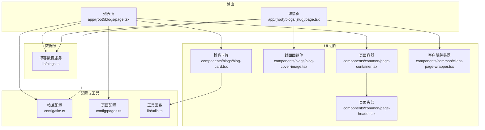
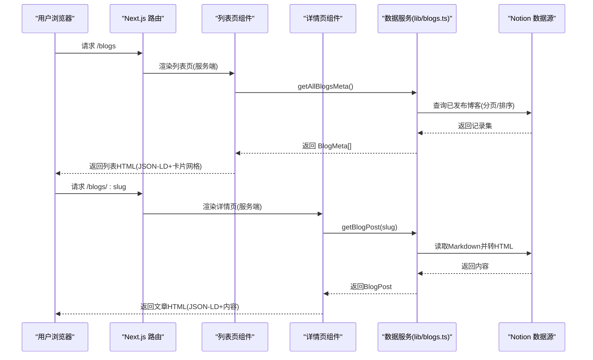
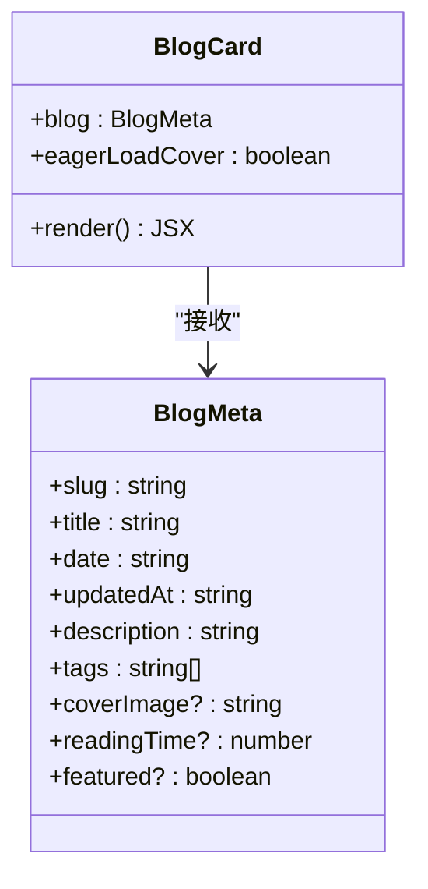
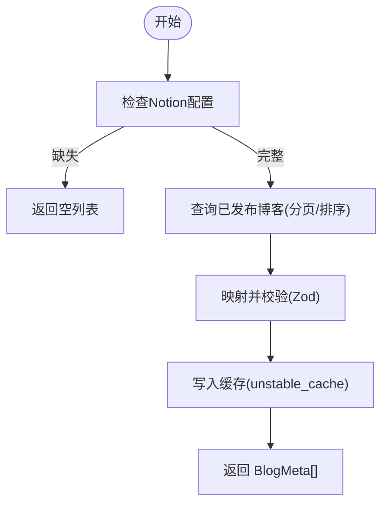
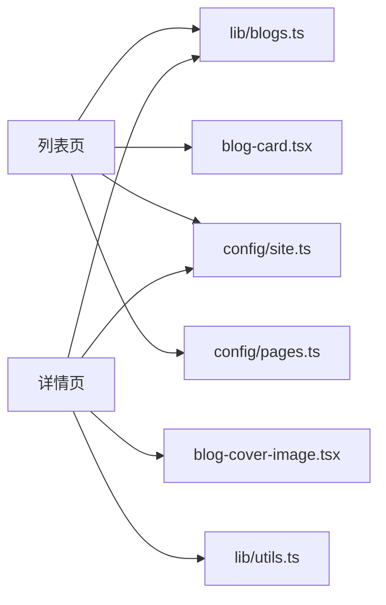

# 博客页面组件

<cite>
**本文引用的文件**
- [app/(root)/blogs/page.tsx](file://app/(root)/blogs/page.tsx)
- [app/(root)/blogs/[slug]/page.tsx](file://app/(root)/blogs/[slug]/page.tsx)
- [components/blogs/blog-card.tsx](file://components/blogs/blog-card.tsx)
- [components/blogs/blog-cover-image.tsx](file://components/blogs/blog-cover-image.tsx)
- [lib/blogs.ts](file://lib/blogs.ts)
- [lib/utils.ts](file://lib/utils.ts)
- [config/site.ts](file://config/site.ts)
- [config/pages.ts](file://config/pages.ts)
- [components/common/page-container.tsx](file://components/common/page-container.tsx)
- [components/common/client-page-wrapper.tsx](file://components/common/client-page-wrapper.tsx)
- [components/common/page-header.tsx](file://components/common/page-header.tsx)
</cite>

## 目录
1. [简介](#简介)
2. [项目结构](#项目结构)
3. [核心组件](#核心组件)
4. [架构总览](#架构总览)
5. [详细组件分析](#详细组件分析)
6. [依赖关系分析](#依赖关系分析)
7. [性能考量](#性能考量)
8. [故障排查指南](#故障排查指南)
9. [结论](#结论)
10. [附录：扩展与定制示例](#附录：扩展与定制示例)

## 简介
本文件面向博客模块的页面与组件，系统性说明列表页与详情页的架构、数据获取策略、渲染流程、服务端/客户端职责分离、SEO 与可访问性实践，以及性能优化要点。同时提供如何创建新博客页面、自定义卡片布局、实现搜索筛选与社交分享的实践指引。

## 项目结构
博客功能围绕 Next.js App Router 的路由组织：
- 列表页路由：app/(root)/blogs/page.tsx
- 详情路由：app/(root)/blogs/[slug]/page.tsx
- 数据层：lib/blogs.ts（从 Notion 数据源拉取并缓存）
- UI 组件：components/blogs/blog-card.tsx、components/blogs/blog-cover-image.tsx
- 通用容器与动画：components/common/page-container.tsx、client-page-wrapper.tsx、page-header.tsx
- 站点配置：config/site.ts、config/pages.ts
- 工具函数：lib/utils.ts（日期格式化等）

图表来源
- [app/(root)/blogs/page.tsx:1-152](file://app/(root)/blogs/page.tsx#L1-L152)
- [app/(root)/blogs/[slug]/page.tsx:1-322](file://app/(root)/blogs/[slug]/page.tsx#L1-L322)
- [lib/blogs.ts:1-550](file://lib/blogs.ts#L1-L550)
- [components/blogs/blog-card.tsx:1-98](file://components/blogs/blog-card.tsx#L1-L98)
- [components/blogs/blog-cover-image.tsx:1-69](file://components/blogs/blog-cover-image.tsx#L1-L69)
- [components/common/page-container.tsx:1-27](file://components/common/page-container.tsx#L1-L27)
- [components/common/client-page-wrapper.tsx:1-37](file://components/common/client-page-wrapper.tsx#L1-L37)
- [components/common/page-header.tsx:1-21](file://components/common/page-header.tsx#L1-L21)
- [config/site.ts:1-39](file://config/site.ts#L1-L39)
- [config/pages.ts:1-81](file://config/pages.ts#L1-L81)
- [lib/utils.ts:1-29](file://lib/utils.ts#L1-L29)

章节来源
- [app/(root)/blogs/page.tsx:1-152](file://app/(root)/blogs/page.tsx#L1-L152)
- [app/(root)/blogs/[slug]/page.tsx:1-322](file://app/(root)/blogs/[slug]/page.tsx#L1-L322)
- [lib/blogs.ts:1-550](file://lib/blogs.ts#L1-L550)

## 核心组件
- 列表页（服务端组件）：负责元信息、JSON-LD、数据预取与网格渲染。
- 详情页（服务端组件 + 客户端包装）：负责文章元信息、结构化数据、面包屑、内容渲染与交互包装。
- BlogCard：展示单篇博客摘要，支持封面图懒加载/优先加载、标签截断、阅读时长显示。
- BlogCoverImage：统一封面图渲染，自动区分外部链接与本地资源，支持 fill/尺寸/sizes/loading。
- PageContainer/PageHeader：统一的页面标题与描述区域。
- ClientPageWrapper：为页面添加入场动画（客户端）。

章节来源
- [components/blogs/blog-card.tsx:1-98](file://components/blogs/blog-card.tsx#L1-L98)
- [components/blogs/blog-cover-image.tsx:1-69](file://components/blogs/blog-cover-image.tsx#L1-L69)
- [components/common/page-container.tsx:1-27](file://components/common/page-container.tsx#L1-L27)
- [components/common/page-header.tsx:1-21](file://components/common/page-header.tsx#L1-L21)
- [components/common/client-page-wrapper.tsx:1-37](file://components/common/client-page-wrapper.tsx#L1-L37)

## 架构总览
博客模块采用“服务端数据预取 + 客户端增强”的模式：
- 列表页在服务端调用 getAllBlogsMeta() 获取所有已发布博客元数据，生成 CollectionPage/Blog JSON-LD，并以响应式网格渲染 BlogCard。
- 详情页在服务端通过 getBlogPost(slug) 获取文章内容 HTML，生成 BlogPosting/BreadcrumbList JSON-LD，并使用 ClientPageWrapper 包裹以启用客户端动画。
- 数据层 lib/blogs.ts 使用 Notion Data Sources API 查询已发布条目，结合 unstable_cache 进行缓存与按 tag 失效，确保高并发下的性能与一致性。

图表来源
- [app/(root)/blogs/page.tsx:42-148](file://app/(root)/blogs/page.tsx#L42-L148)
- [app/(root)/blogs/[slug]/page.tsx:21-322](file://app/(root)/blogs/[slug]/page.tsx#L21-L322)
- [lib/blogs.ts:337-530](file://lib/blogs.ts#L337-L530)

## 详细组件分析

### 列表页（app/(root)/blogs/page.tsx）
- 数据获取：在组件内 await getAllBlogsMeta()，服务端直接拉取并缓存。
- SEO：设置 Metadata（title/description/canonical/OpenGraph/Twitter），注入 CollectionPage 与 Blog JSON-LD，以及 BreadcrumbList。
- 渲染：空状态提示；非空时使用响应式网格（移动端1列、平板2列、桌面3列）渲染 AnimatedSection + BlogCard，首张卡片封面图 eager 加载以提升感知性能。
- 可访问性：语义化结构、时间元素使用 time 标签、图片 alt 文本。

章节来源
- [app/(root)/blogs/page.tsx:12-148](file://app/(root)/blogs/page.tsx#L12-L148)

### 详情页（app/(root)/blogs/[slug]/page.tsx）
- 静态参数与元信息：generateStaticParams 基于 getAllBlogSlugs() 预构建路由；generateMetadata 根据文章生成 OG/Twitter/Robots 等元信息。
- 数据获取：getBlogPost(slug) 获取 contentHtml、readingTime、tags 等；不存在时 notFound()。
- SEO：注入 BlogPosting 与 BreadcrumbList JSON-LD；canonical、authors、keywords、images 等字段完善。
- 渲染：包含面包屑导航、标签、H1 标题、作者/日期/阅读时长、可选封面图、正文 section、底部“回到全部文章”按钮。
- 客户端增强：整体用 ClientPageWrapper 包裹，启用页面级淡入动画。

章节来源
- [app/(root)/blogs/[slug]/page.tsx:21-322](file://app/(root)/blogs/[slug]/page.tsx#L21-L322)

### BlogCard 组件（components/blogs/blog-card.tsx）
- 属性接口
  - blog: BlogMeta（来自 lib/blogs.ts）
  - eagerLoadCover?: boolean（是否对首屏封面图进行 eager 加载）
- 行为
  - 整卡为 Link，点击跳转至 /blogs/:slug
  - 封面图：支持 fill 模式与 sizes 自适应；首屏可 eager，其余 lazy
  - 标签：最多显示前3个，超出显示“+N”
  - 标题/描述：限制行数，悬停高亮
  - 底部：显示日期、阅读时长、箭头指示
- 样式定制
  - 边框、圆角、阴影、悬停位移与缩放
  - 颜色与字体通过主题变量（foreground/muted-foreground 等）继承
- 可访问性
  - 图片 alt 文本、aria-hidden 装饰图标、语义化 article/h3/time

图表来源
- [components/blogs/blog-card.tsx:8-98](file://components/blogs/blog-card.tsx#L8-L98)
- [lib/blogs.ts:35-52](file://lib/blogs.ts#L35-L52)

章节来源
- [components/blogs/blog-card.tsx:1-98](file://components/blogs/blog-card.tsx#L1-L98)
- [lib/blogs.ts:35-52](file://lib/blogs.ts#L35-L52)

### 封面图组件（components/blogs/blog-cover-image.tsx）
- 能力
  - 自动识别外部 URL：使用原生 img，避免跨域与打包问题
  - 本地资源：使用 next/image，支持 fill/宽高/sizes/loading
  - 首屏关键图可通过 loading="eager" 与 fetchPriority="high" 提升 LCP
- 使用场景
  - 列表卡片：fill + sizes 自适应
  - 详情页：固定宽高或 fill，按需 eager

章节来源
- [components/blogs/blog-cover-image.tsx:1-69](file://components/blogs/blog-cover-image.tsx#L1-L69)

### 数据服务（lib/blogs.ts）
- 数据模型
  - BlogFrontmatter/BlogMeta/BlogPost：定义前端可见字段
  - NotionBlogRecord：内部映射类型
- 校验与安全
  - 使用 Zod 严格校验字段类型与范围
  - Slug 正则校验、URL 稳定性校验、长度限制
- 数据源
  - Notion Data Sources API：查询已发布条目，支持分页与排序
  - 动态检测 Status 属性类型（status/select）
- 缓存与失效
  - unstable_cache 缓存列表与单篇文章内容，支持 revalidate 与 tags 失效
- 错误处理
  - 缺失配置、不完整的页面响应、截断内容、重复 slug、对象未找到等
- 辅助
  - estimateReadingTime：估算阅读时长（拉丁词与中日韩字符分别计算）

图表来源
- [lib/blogs.ts:92-121](file://lib/blogs.ts#L92-L121)
- [lib/blogs.ts:337-420](file://lib/blogs.ts#L337-L420)
- [lib/blogs.ts:404-420](file://lib/blogs.ts#L404-L420)

章节来源
- [lib/blogs.ts:1-550](file://lib/blogs.ts#L1-L550)

### 页面容器与头部（components/common/page-container.tsx, page-header.tsx）
- PageContainer：组合 ClientPageWrapper 与 PageHeader，提供统一的标题与描述区域，并对内容区做边距与溢出控制。
- PageHeader：响应式标题与描述排版，分隔线。

章节来源
- [components/common/page-container.tsx:1-27](file://components/common/page-container.tsx#L1-L27)
- [components/common/page-header.tsx:1-21](file://components/common/page-header.tsx#L1-L21)

### 客户端包装器（components/common/client-page-wrapper.tsx）
- 使用 motion/react 实现页面级淡入上移动画，提升首屏体验。
- 作为详情页的根容器，不影响服务端渲染的 SEO 内容。

章节来源
- [components/common/client-page-wrapper.tsx:1-37](file://components/common/client-page-wrapper.tsx#L1-L37)

## 依赖关系分析
- 列表页依赖：
  - 数据：getAllBlogsMeta()
  - 组件：BlogCard、AnimatedSection、PageContainer
  - 配置：siteConfig、pagesConfig
  - 工具：toAbsoluteUrl、serializeJsonLd
- 详情页依赖：
  - 数据：getBlogPost()、getAllBlogSlugs()
  - 组件：BlogCoverImage、ClientPageWrapper、AnimatedSection/Text
  - 配置：siteConfig
  - 工具：formatDate、cn、serializeJsonLd、toAbsoluteUrl
- 数据层依赖：
  - Notion SDK、unstable_cache、Zod、Markdown 渲染、URL 校验

图表来源
- [app/(root)/blogs/page.tsx:1-152](file://app/(root)/blogs/page.tsx#L1-L152)
- [app/(root)/blogs/[slug]/page.tsx:1-322](file://app/(root)/blogs/[slug]/page.tsx#L1-L322)
- [lib/blogs.ts:1-550](file://lib/blogs.ts#L1-L550)

章节来源
- [app/(root)/blogs/page.tsx:1-152](file://app/(root)/blogs/page.tsx#L1-L152)
- [app/(root)/blogs/[slug]/page.tsx:1-322](file://app/(root)/blogs/[slug]/page.tsx#L1-L322)
- [lib/blogs.ts:1-550](file://lib/blogs.ts#L1-L550)

## 性能考量
- 服务端数据预取与缓存
  - 列表与文章均通过 unstable_cache 缓存，revalidate 秒数可由环境变量控制，降低重复请求与 Notion 限流风险。
- 图片优化
  - 列表首张卡片封面图 eager 加载，其他 lazy；详情页封面图可按需 eager。
  - 使用 next/image 与 sizes 适配不同屏幕，减少带宽与重排。
- 首屏与交互
  - 列表使用响应式网格，避免不必要的 DOM 节点。
  - 详情页使用 ClientPageWrapper 仅用于动画，不影响首屏 HTML。
- 渲染体积
  - Markdown 转 HTML 在服务端完成，避免客户端解析开销。
  - 阅读时长估算在服务端完成，减少运行时计算。

[本节为通用性能建议，无需特定文件引用]

## 故障排查指南
- 列表为空
  - 检查 Notion 数据源配置（NOTION_TOKEN、NOTION_DATA_SOURCE_ID）是否齐全且匹配。
  - 确认数据源中 Status 包含 “Published” 选项，且条目状态正确。
  - 查看日志中的警告与错误（如截断、不支持块、结果限制）。
- 详情页 404
  - 检查 slug 是否符合正则与长度限制。
  - 确认对应 Notion 页面存在且未被删除。
- 图片不显示
  - 外部链接需 HTTPS；本地路径需稳定且可访问。
  - 确认 coverImage 字段格式正确。
- 缓存未更新
  - 调整 NOTION_BLOG_REVALIDATE_SECONDS 或触发 tag 失效（若集成部署钩子）。

章节来源
- [lib/blogs.ts:92-121](file://lib/blogs.ts#L92-L121)
- [lib/blogs.ts:337-420](file://lib/blogs.ts#L337-L420)
- [lib/blogs.ts:422-530](file://lib/blogs.ts#L422-L530)

## 结论
该博客模块以服务端数据预取为核心，结合严格的类型校验与缓存策略，保证了良好的性能与可靠性。列表页与详情页分别承担聚合与详情的职责，配合 JSON-LD 与完善的元信息，实现了优秀的 SEO。组件层面通过可复用的卡片与封面图组件，兼顾了样式一致性与可扩展性。后续可在搜索筛选、社交分享等方面进一步扩展。

[本节为总结，无需特定文件引用]

## 附录：扩展与定制示例

- 创建新的博客页面
  - 在 Notion 数据源新增页面，填写 Title、Slug、Status=Published、PublishedAt、Description、Tags、CoverImage、ReadingTime 等字段。
  - 部署后，列表页会自动抓取；详情页路由由 generateStaticParams 自动生成。
  - 参考：[app/(root)/blogs/page.tsx:42-148](file://app/(root)/blogs/page.tsx#L42-L148)、[app/(root)/blogs/[slug]/page.tsx:21-322](file://app/(root)/blogs/[slug]/page.tsx#L21-L322)、[lib/blogs.ts:337-530](file://lib/blogs.ts#L337-L530)

- 自定义卡片布局
  - 修改 BlogCard 的样式类名与结构，例如增加封面图比例、标签位置、阅读时长显示逻辑。
  - 可复用 BlogCoverImage 以保持一致的图片行为。
  - 参考：[components/blogs/blog-card.tsx:1-98](file://components/blogs/blog-card.tsx#L1-L98)、[components/blogs/blog-cover-image.tsx:1-69](file://components/blogs/blog-cover-image.tsx#L1-L69)

- 实现搜索与筛选
  - 在列表页引入客户端状态管理（如 React useState/useEffect），对 blogs 数组进行本地过滤（按 tags/title）。
  - 可结合输入框与防抖，提升交互体验。
  - 参考：[app/(root)/blogs/page.tsx:120-148](file://app/(root)/blogs/page.tsx#L120-L148)

- 添加社交分享
  - 在详情页底部或侧边添加分享按钮，调用 Web Share API 或生成分享链接（Twitter/X、LinkedIn、微信等）。
  - 可复用 siteConfig.links 中的社交地址。
  - 参考：[config/site.ts:1-39](file://config/site.ts#L1-L39)、[app/(root)/blogs/[slug]/page.tsx:288-317](file://app/(root)/blogs/[slug]/page.tsx#L288-L317)

- 响应式设计
  - 列表网格使用 Tailwind 响应式类（sm/md/lg）实现多列布局。
  - 封面图使用 sizes 与 object-cover 适配不同屏幕。
  - 参考：[app/(root)/blogs/page.tsx:135-145](file://app/(root)/blogs/page.tsx#L135-L145)、[components/blogs/blog-card.tsx:27-39](file://components/blogs/blog-card.tsx#L27-L39)

- 可访问性支持
  - 语义化标签（article、section、nav、time）、alt 文本、aria-label、aria-current。
  - 键盘可达的链接与按钮，焦点样式清晰。
  - 参考：[app/(root)/blogs/[slug]/page.tsx:176-211](file://app/(root)/blogs/[slug]/page.tsx#L176-L211)、[components/blogs/blog-card.tsx:44-91](file://components/blogs/blog-card.tsx#L44-L91)

- SEO 优化实践
  - 列表页：CollectionPage + Blog JSON-LD、canonical、OpenGraph、Twitter Card。
  - 详情页：BlogPosting + BreadcrumbList JSON-LD、robots、author、keywords、images。
  - 参考：[app/(root)/blogs/page.tsx:12-119](file://app/(root)/blogs/page.tsx#L12-L119)、[app/(root)/blogs/[slug]/page.tsx:26-174](file://app/(root)/blogs/[slug]/page.tsx#L26-L174)