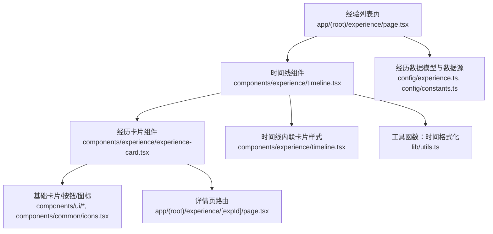
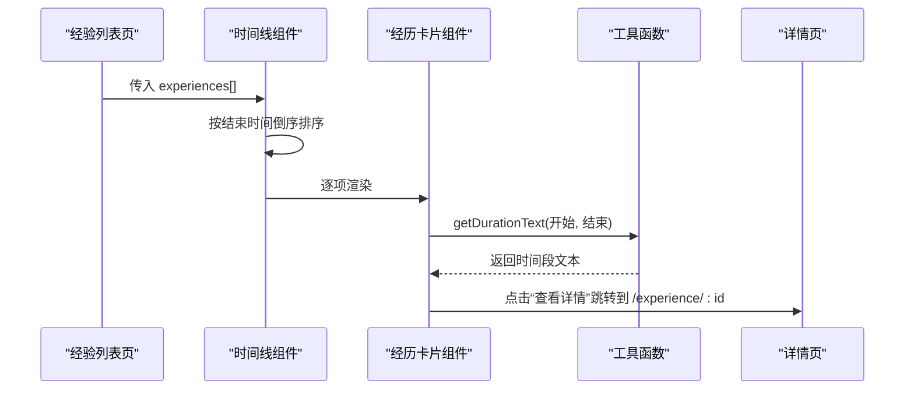
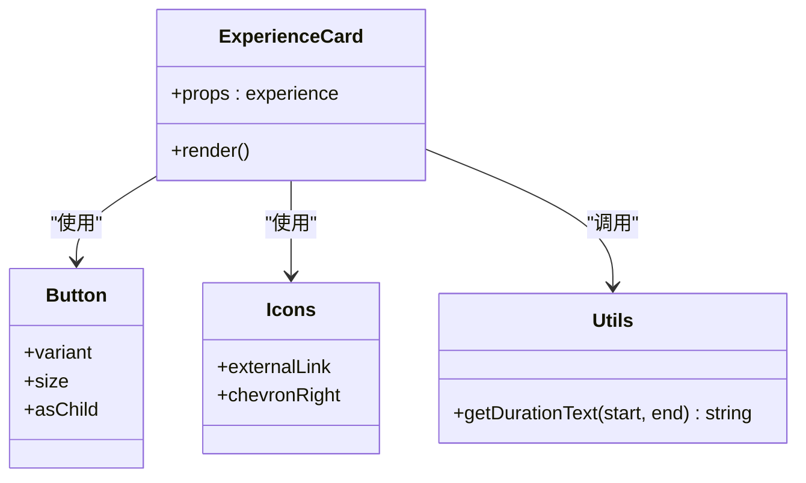
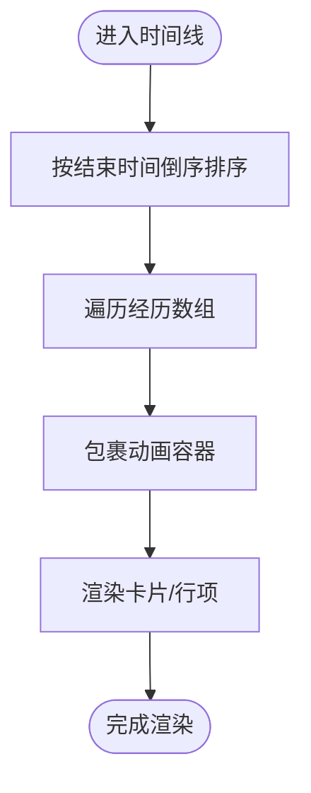
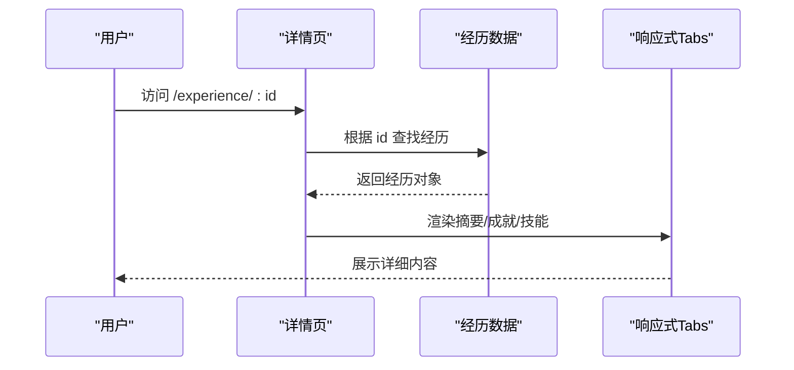
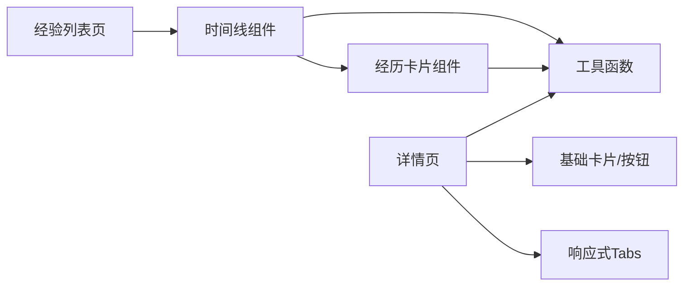

# 工作经历卡片组件

<cite>
**本文引用的文件**
- [experience-card.tsx](file://components/experience/experience-card.tsx)
- [timeline.tsx](file://components/experience/timeline.tsx)
- [experience/page.tsx](file://app/(root)/experience/page.tsx)
- [experience/[expId]/page.tsx](file://app/(root)/experience/[expId]/page.tsx)
- [card.tsx](file://components/ui/card.tsx)
- [chip.tsx](file://components/ui/chip.tsx)
- [utils.ts](file://lib/utils.ts)
- [constants.ts](file://config/constants.ts)
- [experience.ts](file://config/experience.ts)
</cite>

## 目录
1. [简介](#简介)
2. [项目结构](#项目结构)
3. [核心组件](#核心组件)
4. [架构总览](#架构总览)
5. [详细组件分析](#详细组件分析)
6. [依赖关系分析](#依赖关系分析)
7. [性能考量](#性能考量)
8. [故障排查指南](#故障排查指南)
9. [结论](#结论)
10. [附录：属性接口与使用示例](#附录属性接口与使用示例)

## 简介
本组件文档聚焦“工作经历卡片”在作品集中的应用，涵盖 UI 结构设计（公司信息、职位信息、时间显示、技能标签）、交互行为（悬停、点击、状态切换）、响应式布局、可访问性支持、样式定制与主题扩展，并提供属性接口定义与使用示例路径。该组件用于在经验列表页中展示每条工作经历的摘要信息，并引导用户进入详情页查看完整内容。

## 项目结构
- 页面入口：经验列表页渲染时间线容器，传入经历数据数组。
- 时间线组件：对数据进行排序并按条目渲染卡片或行项，提供动画入场效果。
- 卡片组件：单条经历的摘要卡片，包含公司 Logo、职位、公司名、地点、时间段、描述摘要、技能标签和详情按钮。
- 详情页：根据 id 渲染详细视图，包含角色摘要、成就、技能等 Tab 内容。
- 通用 UI：基础 Card、Chip 等原子组件，以及工具函数格式化时间。

图表来源
- [experience/page.tsx:24-31](file://app/(root)/experience/page.tsx#L24-L31)
- [timeline.tsx:15-95](file://components/experience/timeline.tsx#L15-L95)
- [experience-card.tsx:14-91](file://components/experience/experience-card.tsx#L14-L91)
- [utils.ts:17-28](file://lib/utils.ts#L17-L28)
- [experience.ts:3-68](file://config/experience.ts#L3-L68)
- [experience/[expId]/page.tsx:48-209](file://app/(root)/experience/[expId]/page.tsx#L48-L209)

章节来源
- [experience/page.tsx:24-31](file://app/(root)/experience/page.tsx#L24-L31)
- [timeline.tsx:15-95](file://components/experience/timeline.tsx#L15-L95)
- [experience-card.tsx:14-91](file://components/experience/experience-card.tsx#L14-L91)

## 核心组件
- 经历卡片组件：负责单条经历的摘要展示，包括公司 Logo、职位、公司名、地点、时间段、描述摘要、技能标签（最多展示两个并显示剩余数量）和“查看详情”按钮。
- 时间线组件：接收经历数组，按结束时间倒序排列，逐条渲染为卡片或行项，并添加滚动入场动画。
- 详情页：通过路由参数获取具体经历，展示角色摘要、关键成就与技术栈，并以响应式 Tabs 组织内容。

章节来源
- [experience-card.tsx:14-91](file://components/experience/experience-card.tsx#L14-L91)
- [timeline.tsx:15-95](file://components/experience/timeline.tsx#L15-L95)
- [experience/[expId]/page.tsx:48-209](file://app/(root)/experience/[expId]/page.tsx#L48-L209)

## 架构总览
从数据到视图的调用链如下：
- 列表页将经历数据传递给时间线组件。
- 时间线组件对数据进行排序，并为每项包裹动画容器后渲染。
- 卡片组件读取经历数据，渲染基本信息、技能标签与跳转链接。
- 详情页根据 id 渲染详细内容，复用工具函数进行时间格式化。

图表来源
- [experience/page.tsx:24-31](file://app/(root)/experience/page.tsx#L24-L31)
- [timeline.tsx:15-21](file://components/experience/timeline.tsx#L15-L21)
- [experience-card.tsx:77-89](file://components/experience/experience-card.tsx#L77-L89)
- [utils.ts:17-28](file://lib/utils.ts#L17-L28)
- [experience/[expId]/page.tsx:48-56](file://app/(root)/experience/[expId]/page.tsx#L48-L56)

## 详细组件分析

### 工作经历卡片组件（ExperienceCard）
- UI 结构
  - 头部区域：左侧为公司 Logo（可选），右侧为职位标题与公司外链（可选）。
  - 元信息区：公司名称与地点并列显示；时间段以胶囊形式呈现。
  - 描述摘要：首段描述，限制行数避免过长。
  - 技能标签：最多展示前两项，其余以“+N more”提示。
  - 操作区：底部右侧“查看详情”按钮，点击跳转至详情页。
- 交互功能
  - 悬停效果：外层容器具备过渡动画，提升交互反馈。
  - 点击行为：按钮作为 Link 导航到 /experience/:id。
  - 外链行为：公司网站在新窗口打开，并设置安全属性。
- 响应式布局
  - 移动端优先：小屏紧凑布局，大屏增加间距与字号。
  - 多列转单列：在小屏幕下采用纵向堆叠，在大屏幕横向对齐。
  - 图片尺寸：Logo 在小屏与大屏分别适配不同尺寸。
- 可访问性
  - 语义化标题：职位使用 h3 层级，利于屏幕阅读器识别。
  - 图片 alt：Logo 使用公司名作为替代文本。
  - 键盘导航：按钮与链接天然支持键盘焦点与回车跳转。
- 样式定制与主题扩展
  - 颜色：使用主题色变量（如 primary、background、border、foreground），便于全局主题切换。
  - 尺寸：通过 Tailwind 断点控制间距与字号，适配不同设备。
  - 可扩展：如需更多技能标签展示，可在组件内调整切片逻辑或引入 Chip 组件。

图表来源
- [experience-card.tsx:14-91](file://components/experience/experience-card.tsx#L14-L91)
- [utils.ts:17-28](file://lib/utils.ts#L17-L28)

章节来源
- [experience-card.tsx:14-91](file://components/experience/experience-card.tsx#L14-L91)

### 时间线组件（Timeline）
- 数据处理
  - 排序：按结束时间倒序，当前仍在任的经历视为“Present”，取当前时间参与排序。
  - 动画：每个条目使用动画容器，延迟递增实现交错入场。
- 布局与交互
  - 响应式：小屏纵向布局，大屏横向布局，Logo、信息、按钮合理分布。
  - 外链：公司网站在新窗口打开，带安全属性。
  - 跳转：按钮链接至详情页。
- 可访问性
  - 语义化标题：职位使用 h3。
  - 图片 alt：Logo 使用公司名。
  - 键盘友好：按钮与链接支持键盘操作。

图表来源
- [timeline.tsx:15-21](file://components/experience/timeline.tsx#L15-L21)
- [timeline.tsx:23-95](file://components/experience/timeline.tsx#L23-L95)

章节来源
- [timeline.tsx:15-95](file://components/experience/timeline.tsx#L15-L95)

### 详情页（Experience Detail）
- 数据获取与校验
  - 通过路由参数 expId 查找对应经历，未找到则重定向到列表页。
- 内容组织
  - 顶部：Logo、职位、公司、地点、时间段。
  - 中部：Tabs 包含“角色摘要”、“关键成就”、“技术栈”。
  - 底部：返回列表按钮。
- 可访问性与响应式
  - 标题层级清晰，图片 alt 完善。
  - 响应式 Tabs 在不同设备上良好展示。

图表来源
- [experience/[expId]/page.tsx:48-56](file://app/(root)/experience/[expId]/page.tsx#L48-L56)
- [experience/[expId]/page.tsx:58-125](file://app/(root)/experience/[expId]/page.tsx#L58-L125)
- [experience/[expId]/page.tsx:139-196](file://app/(root)/experience/[expId]/page.tsx#L139-L196)

章节来源
- [experience/[expId]/page.tsx:48-209](file://app/(root)/experience/[expId]/page.tsx#L48-L209)

## 依赖关系分析
- 组件耦合
  - 时间线与卡片组件均依赖经历数据模型与工具函数。
  - 详情页依赖基础 UI 组件与响应式 Tabs。
- 外部依赖
  - Next.js 的 Image、Link、Metadata。
  - 工具库 clsx、tailwind-merge 用于类名合并。
- 潜在循环依赖
  - 当前无循环引用，组件间单向依赖清晰。

图表来源
- [experience/page.tsx:24-31](file://app/(root)/experience/page.tsx#L24-L31)
- [timeline.tsx:15-95](file://components/experience/timeline.tsx#L15-L95)
- [experience-card.tsx:14-91](file://components/experience/experience-card.tsx#L14-L91)
- [experience/[expId]/page.tsx:48-209](file://app/(root)/experience/[expId]/page.tsx#L48-L209)
- [utils.ts:17-28](file://lib/utils.ts#L17-L28)

章节来源
- [experience/page.tsx:24-31](file://app/(root)/experience/page.tsx#L24-L31)
- [timeline.tsx:15-95](file://components/experience/timeline.tsx#L15-L95)
- [experience-card.tsx:14-91](file://components/experience/experience-card.tsx#L14-L91)
- [experience/[expId]/page.tsx:48-209](file://app/(root)/experience/[expId]/page.tsx#L48-L209)
- [utils.ts:17-28](file://lib/utils.ts#L17-L28)

## 性能考量
- 图片优化：使用 Next.js Image 组件，指定宽高与 object-contain，减少布局抖动。
- 列表排序：在客户端对经历数组进行排序，数据量较小时无明显开销。
- 动画性能：使用轻量级动画容器，避免复杂计算。
- 懒加载与静态生成：详情页使用静态参数生成，提升首屏性能。

[本节为通用指导，不直接分析具体文件]

## 故障排查指南
- 详情页 404 或重定向
  - 现象：访问不存在 id 时重定向到列表页。
  - 排查：检查路由参数与数据源是否匹配。
  - 参考路径：[experience/[expId]/page.tsx:48-56](file://app/(root)/experience/[expId]/page.tsx#L48-L56)
- 时间显示异常
  - 现象：时间段格式不正确或“Present”未生效。
  - 排查：确认传入的开始与结束日期类型，检查工具函数处理逻辑。
  - 参考路径：[utils.ts:17-28](file://lib/utils.ts#L17-L28)
- 技能标签过多导致溢出
  - 现象：技能标签超出容器宽度。
  - 排查：调整卡片内 flex-wrap 与标签样式，或增加省略提示。
  - 参考路径：[experience-card.tsx:60-74](file://components/experience/experience-card.tsx#L60-L74)
- 外链安全性
  - 现象：外链未在新窗口打开或缺少安全属性。
  - 排查：确保 target="_blank" 与 rel="noopener noreferrer" 同时存在。
  - 参考路径：[timeline.tsx:61-70](file://components/experience/timeline.tsx#L61-L70), [experience-card.tsx:35-44](file://components/experience/experience-card.tsx#L35-L44)

章节来源
- [experience/[expId]/page.tsx:48-56](file://app/(root)/experience/[expId]/page.tsx#L48-L56)
- [utils.ts:17-28](file://lib/utils.ts#L17-L28)
- [experience-card.tsx:60-74](file://components/experience/experience-card.tsx#L60-L74)
- [timeline.tsx:61-70](file://components/experience/timeline.tsx#L61-L70)
- [experience-card.tsx:35-44](file://components/experience/experience-card.tsx#L35-L44)

## 结论
工作经历卡片组件以清晰的层次结构与响应式布局，提供了良好的用户体验与信息密度。通过工具函数统一时间格式、基础 UI 组件保证一致性、以及详情页的深度展示，形成完整的体验闭环。建议在后续迭代中关注可访问性增强（如更丰富的 aria 属性）、性能优化（如虚拟列表）与主题扩展能力（如自定义技能标签样式）。

[本节为总结性内容，不直接分析具体文件]

## 附录：属性接口与使用示例

- 数据模型与类型
  - 经历接口字段包括：id、position、company、location、startDate、endDate、description、achievements、skills、companyUrl、logo。
  - 技能类型为预定义的技能联合类型，确保类型安全。
  - 参考路径：
    - [experience.ts:3-15](file://config/experience.ts#L3-L15)
    - [constants.ts:1-69](file://config/constants.ts#L1-L69)

- 组件属性接口
  - 经历卡片组件属性：experience（类型为 ExperienceInterface）。
  - 时间线组件属性：experiences（类型为 ExperienceInterface 数组）。
  - 参考路径：
    - [experience-card.tsx:10-12](file://components/experience/experience-card.tsx#L10-L12)
    - [timeline.tsx:11-13](file://components/experience/timeline.tsx#L11-L13)

- 使用示例（路径指引）
  - 列表页使用：将经历数据传入时间线组件。
    - 参考路径：[experience/page.tsx:24-31](file://app/(root)/experience/page.tsx#L24-L31)
  - 时间线渲染：遍历经历数组并渲染卡片或行项。
    - 参考路径：[timeline.tsx:23-95](file://components/experience/timeline.tsx#L23-L95)
  - 卡片渲染：展示摘要信息与技能标签。
    - 参考路径：[experience-card.tsx:14-91](file://components/experience/experience-card.tsx#L14-L91)
  - 详情页渲染：根据 id 展示详细内容。
    - 参考路径：[experience/[expId]/page.tsx:48-209](file://app/(root)/experience/[expId]/page.tsx#L48-L209)

- 样式定制与主题扩展
  - 颜色与主题：通过主题变量（primary、background、border、foreground）实现一键换肤。
  - 尺寸与间距：使用 Tailwind 断点控制不同设备的布局与间距。
  - 技能标签：可替换为统一的 Chip 组件以获得一致的视觉风格。
  - 参考路径：
    - [card.tsx:5-17](file://components/ui/card.tsx#L5-L17)
    - [chip.tsx:1-12](file://components/ui/chip.tsx#L1-L12)

章节来源
- [experience.ts:3-68](file://config/experience.ts#L3-L68)
- [constants.ts:1-91](file://config/constants.ts#L1-L91)
- [experience-card.tsx:10-12](file://components/experience/experience-card.tsx#L10-L12)
- [timeline.tsx:11-13](file://components/experience/timeline.tsx#L11-L13)
- [experience/page.tsx:24-31](file://app/(root)/experience/page.tsx#L24-L31)
- [timeline.tsx:23-95](file://components/experience/timeline.tsx#L23-L95)
- [experience-card.tsx:14-91](file://components/experience/experience-card.tsx#L14-L91)
- [experience/[expId]/page.tsx:48-209](file://app/(root)/experience/[expId]/page.tsx#L48-L209)
- [card.tsx:5-17](file://components/ui/card.tsx#L5-L17)
- [chip.tsx:1-12](file://components/ui/chip.tsx#L1-L12)