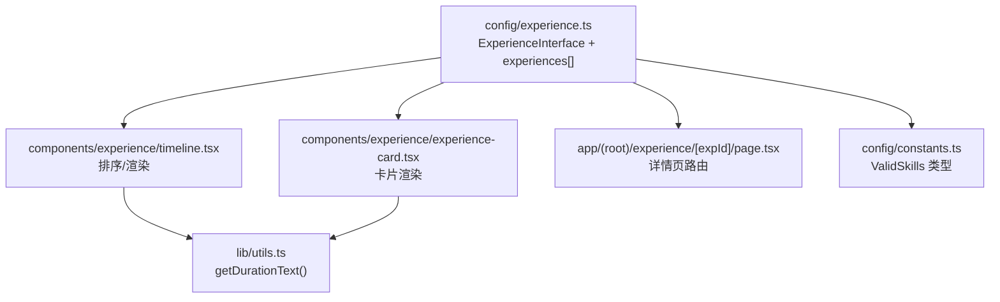
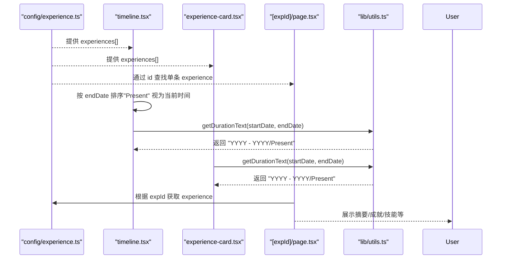
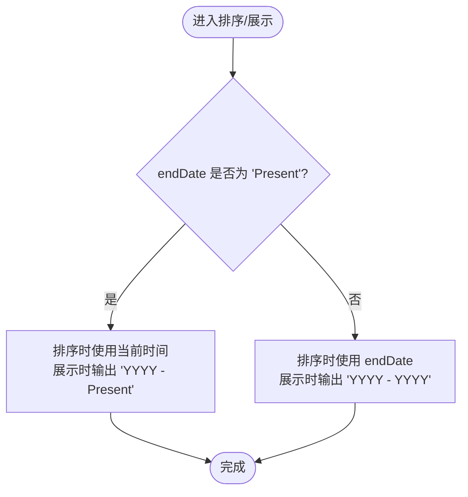
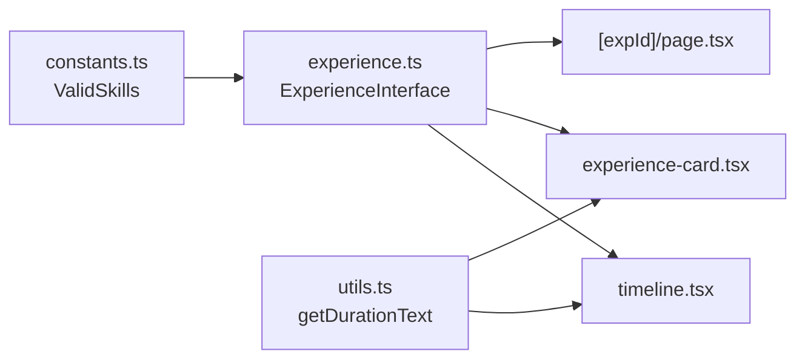

# 工作经历数据模型

<cite>
**本文引用的文件**
- [config/experience.ts](file://config/experience.ts)
- [config/constants.ts](file://config/constants.ts)
- [lib/utils.ts](file://lib/utils.ts)
- [components/experience/timeline.tsx](file://components/experience/timeline.tsx)
- [components/experience/experience-card.tsx](file://components/experience/experience-card.tsx)
- [app/(root)/experience/[expId]/page.tsx](file://app/(root)/experience/[expId]/page.tsx)
</cite>

## 目录
1. [简介](#简介)
2. [项目结构](#项目结构)
3. [核心组件](#核心组件)
4. [架构总览](#架构总览)
5. [详细组件分析](#详细组件分析)
6. [依赖关系分析](#依赖关系分析)
7. [性能考量](#性能考量)
8. [故障排查指南](#故障排查指南)
9. [结论](#结论)
10. [附录：配置示例与最佳实践](#附录：配置示例与最佳实践)

## 简介
本文件为“工作经历”数据模型的权威文档，聚焦 ExperienceInterface 接口的字段定义、数据类型与用途；说明日期处理逻辑（特别是 endDate 的 "Present" 字符串）；解释技能验证机制与 ValidSkills 类型的使用；并提供完整的数据配置示例、验证规则、必填字段说明与最佳实践建议。目标是帮助开发者正确添加与维护工作经历条目，确保前后端一致性与可维护性。

## 项目结构
围绕工作经历数据的核心文件分布如下：
- 数据模型与数据源：config/experience.ts
- 技能白名单类型：config/constants.ts
- 日期格式化与时长计算：lib/utils.ts
- 列表与详情展示：components/experience/timeline.tsx、components/experience/experience-card.tsx、app/(root)/experience/[expId]/page.tsx



图表来源
- [config/experience.ts:1-69](file://config/experience.ts#L1-L69)
- [components/experience/timeline.tsx:1-100](file://components/experience/timeline.tsx#L1-L100)
- [components/experience/experience-card.tsx:41-94](file://components/experience/experience-card.tsx#L41-L94)
- [app/(root)/experience/[expId]/page.tsx:48-125](file://app/(root)/experience/[expId]/page.tsx#L48-L125)
- [lib/utils.ts:17-28](file://lib/utils.ts#L17-L28)
- [config/constants.ts:1-69](file://config/constants.ts#L1-L69)

章节来源
- [config/experience.ts:1-69](file://config/experience.ts#L1-L69)
- [lib/utils.ts:17-28](file://lib/utils.ts#L17-L28)
- [components/experience/timeline.tsx:15-21](file://components/experience/timeline.tsx#L15-L21)
- [components/experience/experience-card.tsx:41-94](file://components/experience/experience-card.tsx#L41-L94)
- [app/(root)/experience/[expId]/page.tsx:48-125](file://app/(root)/experience/[expId]/page.tsx#L48-L125)
- [config/constants.ts:1-69](file://config/constants.ts#L1-L69)

## 核心组件
- ExperienceInterface：定义工作经历的数据结构，包含标识、职位、公司、地点、起止时间、描述、成就、技能及可选的公司链接与 Logo。
- ValidSkills：严格限定的技能字面量联合类型，用于经验条目的 skills 字段，确保技能名称一致性。
- getDurationText：将 startDate 与 endDate（可为 Date 或 "Present"）格式化为“起始年 - 结束年/ Present”的文本。
- Timeline/ExperienceCard/详情页：消费 ExperienceInterface 进行排序、展示与导航。

章节来源
- [config/experience.ts:3-15](file://config/experience.ts#L3-L15)
- [config/constants.ts:1-69](file://config/constants.ts#L1-L69)
- [lib/utils.ts:17-28](file://lib/utils.ts#L17-L28)
- [components/experience/timeline.tsx:15-21](file://components/experience/timeline.tsx#L15-L21)
- [components/experience/experience-card.tsx:41-94](file://components/experience/experience-card.tsx#L41-L94)
- [app/(root)/experience/[expId]/page.tsx:48-125](file://app/(root)/experience/[expId]/page.tsx#L48-L125)

## 架构总览
下图展示了从数据定义到前端展示的调用链路与数据处理流程：



图表来源
- [config/experience.ts:17-69](file://config/experience.ts#L17-L69)
- [components/experience/timeline.tsx:15-21](file://components/experience/timeline.tsx#L15-L21)
- [components/experience/experience-card.tsx:41-94](file://components/experience/experience-card.tsx#L41-L94)
- [app/(root)/experience/[expId]/page.tsx:48-125](file://app/(root)/experience/[expId]/page.tsx#L48-L125)
- [lib/utils.ts:17-28](file://lib/utils.ts#L17-L28)

## 详细组件分析

### ExperienceInterface 字段定义与用途
- id: string — 唯一标识，用于路由与定位具体经历条目。
- position: string — 职位名称。
- company: string — 公司或机构名称。
- location: string — 工作城市/地区。
- startDate: Date — 开始日期，必须为 Date 对象。
- endDate: Date | "Present" — 结束日期；若仍在该公司任职，使用字符串 "Present"。
- description: string[] — 职责与工作内容要点数组。
- achievements: string[] — 关键成果与量化指标数组。
- skills: ValidSkills[] — 使用的技术栈/技能集合，受 ValidSkills 白名单约束。
- companyUrl?: string — 公司官网链接（可选）。
- logo?: string — 公司 Logo 路径（可选）。

章节来源
- [config/experience.ts:3-15](file://config/experience.ts#L3-L15)

### 日期处理逻辑与 "Present" 的处理
- 排序逻辑：在 timeline 中，对 experiences 按 endDate 降序排序。当 endDate 为 "Present" 时，将其视为当前时间参与比较，从而保证当前在职经历排在最前。
- 展示逻辑：getDurationText 接收 startDate 与 endDate，若 endDate 为 "Present"，则输出“起始年 - Present”，否则输出“起始年 - 结束年”。



图表来源
- [components/experience/timeline.tsx:15-21](file://components/experience/timeline.tsx#L15-L21)
- [lib/utils.ts:17-28](file://lib/utils.ts#L17-L28)

章节来源
- [components/experience/timeline.tsx:15-21](file://components/experience/timeline.tsx#L15-L21)
- [lib/utils.ts:17-28](file://lib/utils.ts#L17-L28)

### 技能验证机制与 ValidSkills 类型
- ValidSkills 是一个严格的字面量联合类型，限定所有允许的技能名称。
- ExperienceInterface.skills 类型为 ValidSkills[]，因此任何不在白名单中的技能都会在编译期报错，避免不一致的拼写与无效技能名。
- 如需新增技能，必须在 config/constants.ts 中扩展 ValidSkills 类型，并在相应位置引用。

```mermaid
classDiagram
class ExperienceInterface {
+string id
+string position
+string company
+string location
+Date startDate
+Date|"Present" endDate
+string[] description
+string[] achievements
+ValidSkills[] skills
+string? companyUrl
+string? logo
}
class ValidSkills {
<<union>>
"Next.js"|"React"|...|"Framer Motion"
}
ExperienceInterface --> ValidSkills : "skills 字段约束"
```

图表来源
- [config/experience.ts:3-15](file://config/experience.ts#L3-L15)
- [config/constants.ts:1-69](file://config/constants.ts#L1-L69)

章节来源
- [config/constants.ts:1-69](file://config/constants.ts#L1-L69)
- [config/experience.ts:3-15](file://config/experience.ts#L3-L15)

### 数据消费与展示
- 列表页（Timeline）：读取 experiences 并排序，渲染每条经历的标题、公司、地点、时间段与摘要，支持跳转到详情页。
- 卡片（ExperienceCard）：展示公司、地点、时间段、部分技能标签，以及“查看详情”按钮。
- 详情页（[expId]/page.tsx）：根据 id 查找对应经历，展示摘要、成就、技能等分栏内容。

章节来源
- [components/experience/timeline.tsx:15-94](file://components/experience/timeline.tsx#L15-L94)
- [components/experience/experience-card.tsx:41-94](file://components/experience/experience-card.tsx#L41-L94)
- [app/(root)/experience/[expId]/page.tsx:48-125](file://app/(root)/experience/[expId]/page.tsx#L48-L125)

## 依赖关系分析
- config/experience.ts 依赖 config/constants.ts 的 ValidSkills 类型，确保技能白名单统一。
- components/experience/* 与 app/(root)/experience/* 消费 config/experience.ts 的接口与数据。
- lib/utils.ts 被 timeline 与 card 复用，提供统一的日期格式化能力。



图表来源
- [config/constants.ts:1-69](file://config/constants.ts#L1-L69)
- [config/experience.ts:1-69](file://config/experience.ts#L1-L69)
- [components/experience/timeline.tsx:1-100](file://components/experience/timeline.tsx#L1-L100)
- [components/experience/experience-card.tsx:41-94](file://components/experience/experience-card.tsx#L41-L94)
- [app/(root)/experience/[expId]/page.tsx:48-125](file://app/(root)/experience/[expId]/page.tsx#L48-L125)
- [lib/utils.ts:17-28](file://lib/utils.ts#L17-L28)

章节来源
- [config/constants.ts:1-69](file://config/constants.ts#L1-L69)
- [config/experience.ts:1-69](file://config/experience.ts#L1-L69)
- [lib/utils.ts:17-28](file://lib/utils.ts#L17-L28)
- [components/experience/timeline.tsx:1-100](file://components/experience/timeline.tsx#L1-L100)
- [components/experience/experience-card.tsx:41-94](file://components/experience/experience-card.tsx#L41-L94)
- [app/(root)/experience/[expId]/page.tsx:48-125](file://app/(root)/experience/[expId]/page.tsx#L48-L125)

## 性能考量
- 排序仅在列表渲染时执行，数据规模较小，复杂度 O(n log n)，影响可忽略。
- 当 endDate 为 "Present" 时，排序会转换为当前时间进行比较，避免额外计算。
- 技能标签仅在前两个展示，其余以“+N more”形式显示，减少 DOM 节点数量。

## 故障排查指南
- 新增技能不生效：请确认已在 config/constants.ts 的 ValidSkills 中添加该技能字面量，并确保在经验条目中使用完全一致的字符串。
- 日期显示异常：检查 startDate 是否为有效 Date；endDate 若为 "Present"，需确保未误传其他字符串。
- 排序不符合预期：确认 endDate 为 "Present" 时会被视为当前时间参与排序；如仍异常，检查是否存在非法日期导致 getTime() 返回 NaN。
- 详情页无法找到经历：确认 id 唯一且与路由参数匹配；如无匹配，页面会重定向回体验列表。

章节来源
- [config/constants.ts:1-69](file://config/constants.ts#L1-L69)
- [lib/utils.ts:17-28](file://lib/utils.ts#L17-L28)
- [components/experience/timeline.tsx:15-21](file://components/experience/timeline.tsx#L15-L21)
- [app/(root)/experience/[expId]/page.tsx:48-56](file://app/(root)/experience/[expId]/page.tsx#L48-L56)

## 结论
ExperienceInterface 提供了清晰、强类型的工作经历数据结构，结合 ValidSkills 白名单与统一的日期处理函数，确保了数据的一致性与展示的正确性。遵循本文的字段规范、验证规则与最佳实践，可以安全地扩展与维护工作经历数据。

## 附录：配置示例与最佳实践

### 字段说明与必填项
- 必填字段：id、position、company、location、startDate、endDate、description、achievements、skills
- 可选字段：companyUrl、logo
- 日期类型：startDate 必须为 Date；endDate 可为 Date 或 "Present"
- 技能类型：skills 必须为 ValidSkills[] 中的元素

章节来源
- [config/experience.ts:3-15](file://config/experience.ts#L3-L15)
- [config/constants.ts:1-69](file://config/constants.ts#L1-L69)

### 添加新工作经历的步骤
1. 打开 config/experience.ts，在 experiences 数组末尾追加新条目，确保所有必填字段齐全。
2. 若涉及未在 ValidSkills 中登记的技术，先在 config/constants.ts 中扩展 ValidSkills 类型。
3. 若当前仍在该公司任职，endDate 设置为 "Present"；否则设置为结束日期的 Date 对象。
4. 保存后，列表与详情页会自动渲染新条目。

章节来源
- [config/experience.ts:17-69](file://config/experience.ts#L17-L69)
- [config/constants.ts:1-69](file://config/constants.ts#L1-L69)

### 数据验证规则与建议
- 使用 TypeScript 编译期校验：利用 ValidSkills 与 ExperienceInterface 的类型约束，提前发现错误。
- 保持技能命名一致：严格使用 ValidSkills 中定义的字符串，避免大小写或空格差异。
- 日期规范化：startDate 与 endDate 建议使用 ISO 格式的字符串构造 Date，确保跨平台一致性。
- 文案简洁明确：description 与 achievements 建议采用短句与量化结果，便于阅读与检索。
- 可选信息完善：尽量补充 companyUrl 与 logo，提升品牌识别度与用户体验。

章节来源
- [config/constants.ts:1-69](file://config/constants.ts#L1-L69)
- [config/experience.ts:17-69](file://config/experience.ts#L17-L69)