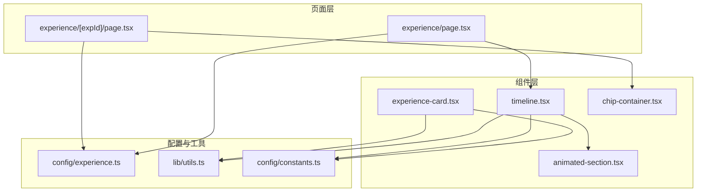
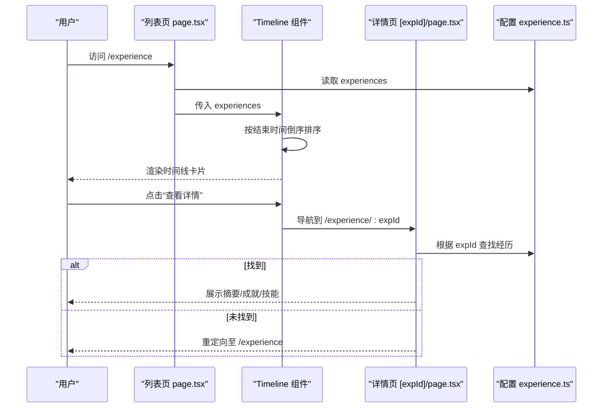
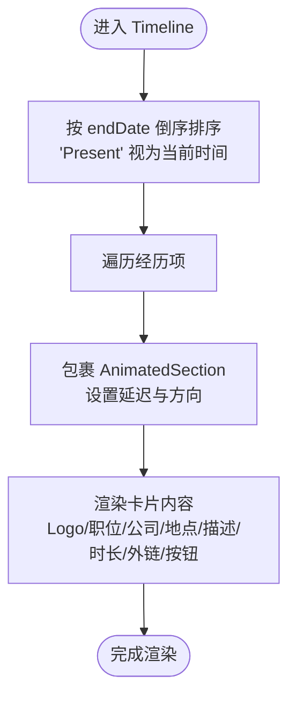
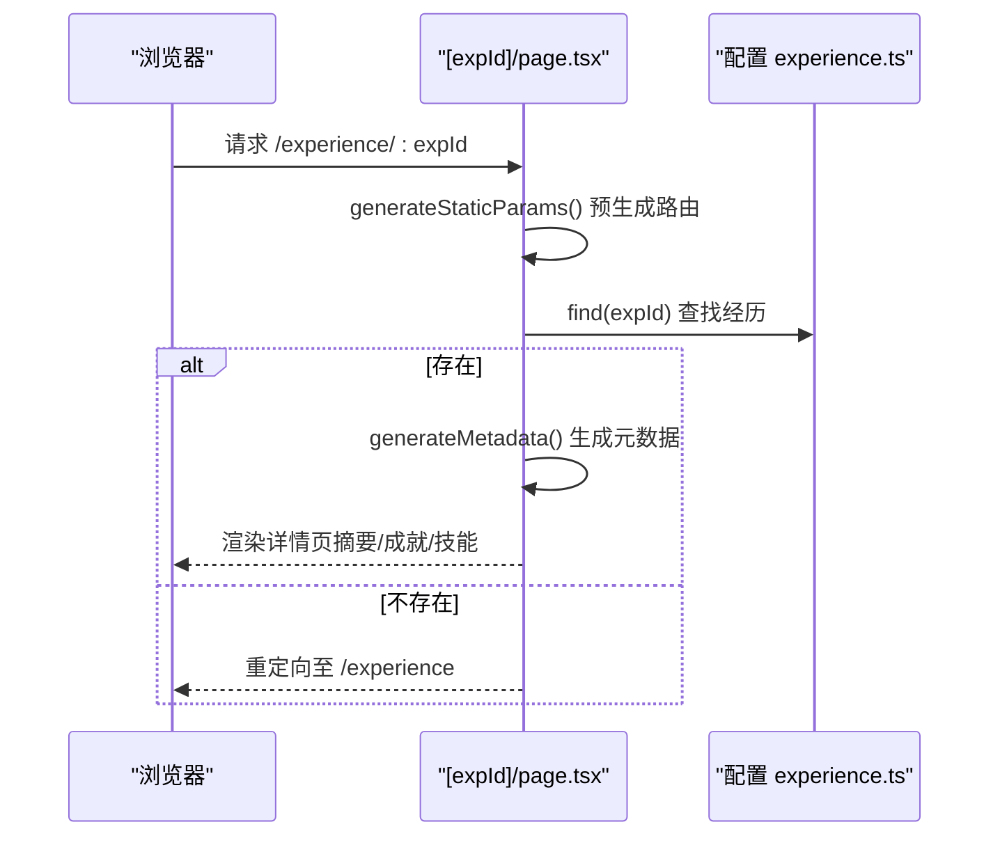
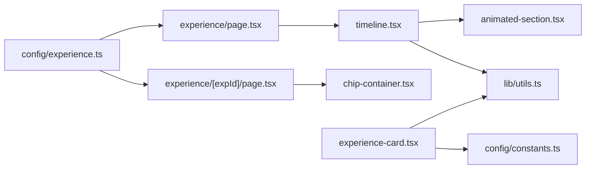

# 工作经历时间线

<cite>
**本文引用的文件**
- [config/experience.ts](file://config/experience.ts)
- [components/experience/timeline.tsx](file://components/experience/timeline.tsx)
- [components/experience/experience-card.tsx](file://components/experience/experience-card.tsx)
- [app/(root)/experience/page.tsx](file://app/(root)/experience/page.tsx)
- [app/(root)/experience/[expId]/page.tsx](file://app/(root)/experience/[expId]/page.tsx)
- [lib/utils.ts](file://lib/utils.ts)
- [components/common/animated-section.tsx](file://components/common/animated-section.tsx)
- [config/constants.ts](file://config/constants.ts)
- [components/ui/chip-container.tsx](file://components/ui/chip-container.tsx)
</cite>

## 目录
1. [简介](#简介)
2. [项目结构](#项目结构)
3. [核心组件](#核心组件)
4. [架构总览](#架构总览)
5. [详细组件分析](#详细组件分析)
6. [依赖关系分析](#依赖关系分析)
7. [性能考量](#性能考量)
8. [故障排查指南](#故障排查指南)
9. [结论](#结论)
10. [附录](#附录)

## 简介
本文件为 Next.js 投资组合中的“工作经历时间线”系统提供完整文档。内容涵盖：
- 工作经历数据模型（ExperienceInterface）字段说明与类型约束
- 时间线渲染算法与排序逻辑
- 卡片组件状态与交互
- 详情页的数据传递与展示
- 配置示例、样式定制、移动端适配方案与性能优化策略
- 如何添加工作经历、自定义时间线样式与扩展交互功能的具体指引

## 项目结构
工作经历模块由“列表页 + 详情页 + 通用组件 + 配置”构成，遵循 Next.js App Router 的页面组织方式：
- 列表页：app/(root)/experience/page.tsx
- 详情页：app/(root)/experience/[expId]/page.tsx
- 时间线组件：components/experience/timeline.tsx
- 经验卡片组件：components/experience/experience-card.tsx
- 数据模型与数据源：config/experience.ts
- 工具函数：lib/utils.ts
- 动画组件：components/common/animated-section.tsx
- 技能标签容器：components/ui/chip-container.tsx
- 技能白名单类型：config/constants.ts

图表来源
- [app/(root)/experience/page.tsx:1-34](file://app/(root)/experience/page.tsx#L1-L34)
- [app/(root)/experience/[expId]/page.tsx:1-210](file://app/(root)/experience/[expId]/page.tsx#L1-L210)
- [components/experience/timeline.tsx:1-100](file://components/experience/timeline.tsx#L1-L100)
- [components/experience/experience-card.tsx:1-95](file://components/experience/experience-card.tsx#L1-L95)
- [config/experience.ts:1-69](file://config/experience.ts#L1-L69)
- [lib/utils.ts:1-29](file://lib/utils.ts#L1-L29)
- [components/common/animated-section.tsx:1-51](file://components/common/animated-section.tsx#L1-L51)
- [components/ui/chip-container.tsx:1-16](file://components/ui/chip-container.tsx#L1-L16)
- [config/constants.ts:1-91](file://config/constants.ts#L1-L91)

章节来源
- [app/(root)/experience/page.tsx:1-34](file://app/(root)/experience/page.tsx#L1-L34)
- [app/(root)/experience/[expId]/page.tsx:1-210](file://app/(root)/experience/[expId]/page.tsx#L1-L210)
- [components/experience/timeline.tsx:1-100](file://components/experience/timeline.tsx#L1-L100)
- [components/experience/experience-card.tsx:1-95](file://components/experience/experience-card.tsx#L1-L95)
- [config/experience.ts:1-69](file://config/experience.ts#L1-L69)
- [lib/utils.ts:1-29](file://lib/utils.ts#L1-L29)
- [components/common/animated-section.tsx:1-51](file://components/common/animated-section.tsx#L1-L51)
- [components/ui/chip-container.tsx:1-16](file://components/ui/chip-container.tsx#L1-L16)
- [config/constants.ts:1-91](file://config/constants.ts#L1-L91)

## 核心组件
- 时间线组件（Timeline）：接收工作经历数组，按结束时间倒序排列，逐条渲染为卡片并包裹滚动入场动画。
- 经验卡片（ExperienceCard）：单条工作经历的紧凑卡片，展示职位、公司、地点、时长、部分描述与技能标签，并提供跳转详情按钮。
- 详情页（[expId]）：根据 expId 查找对应经历，使用响应式标签页展示摘要、成就、技能等详细信息。
- 工具函数（getDurationText）：将起止日期格式化为“起始年 - 结束年/Present”。
- 动画组件（AnimatedSection）：基于滚动视口触发的入场动画，支持方向与延迟控制。
- 技能标签容器（ChipContainer）：将技能数组渲染为可复用的标签集合。

章节来源
- [components/experience/timeline.tsx:1-100](file://components/experience/timeline.tsx#L1-L100)
- [components/experience/experience-card.tsx:1-95](file://components/experience/experience-card.tsx#L1-L95)
- [app/(root)/experience/[expId]/page.tsx:1-210](file://app/(root)/experience/[expId]/page.tsx#L1-L210)
- [lib/utils.ts:1-29](file://lib/utils.ts#L1-L29)
- [components/common/animated-section.tsx:1-51](file://components/common/animated-section.tsx#L1-L51)
- [components/ui/chip-container.tsx:1-16](file://components/ui/chip-container.tsx#L1-L16)

## 架构总览
整体流程：
- 列表页从配置中读取 experiences，传递给 Timeline 进行排序与渲染。
- Timeline 对每条经历使用 AnimatedSection 包裹，实现滚动入场动画；卡片内包含公司 Logo、职位、公司名、地点、首段描述、时长标签与“查看详情”按钮。
- 点击“查看详情”跳转到 /experience/[expId]，详情页通过 generateStaticParams 预生成静态路由参数，并在服务端根据 expId 查询数据，若不存在则重定向回列表页。
- 详情页使用响应式标签页展示摘要、成就、技能等信息，并使用 ChipContainer 渲染技能标签。

图表来源
- [app/(root)/experience/page.tsx:1-34](file://app/(root)/experience/page.tsx#L1-L34)
- [components/experience/timeline.tsx:1-100](file://components/experience/timeline.tsx#L1-L100)
- [app/(root)/experience/[expId]/page.tsx:1-210](file://app/(root)/experience/[expId]/page.tsx#L1-L210)
- [config/experience.ts:1-69](file://config/experience.ts#L1-L69)

## 详细组件分析

### 数据模型：ExperienceInterface
- id：唯一标识，用于路由与静态参数生成
- position：职位名称
- company：公司名称
- location：工作地点
- startDate：开始日期
- endDate：结束日期或字符串 "Present"
- description：职责描述数组
- achievements：成就列表数组
- skills：技能数组，类型为 ValidSkills 联合类型
- companyUrl：可选的公司外链
- logo：可选的公司 Logo 路径

该接口确保数据一致性，并通过 ValidSkills 限制技能取值范围，便于后续统一渲染与校验。

章节来源
- [config/experience.ts:1-69](file://config/experience.ts#L1-L69)
- [config/constants.ts:1-91](file://config/constants.ts#L1-L91)

### 时间线渲染算法与排序
- 排序规则：以 endDate 为准，若为 "Present" 则视为当前时间；按结束时间降序排列，最新经历优先。
- 渲染流程：遍历排序后的数组，为每项包裹 AnimatedSection，设置递增延迟以实现交错入场效果。
- 卡片信息：Logo、职位、公司、地点、首段描述、时长标签（调用 getDurationText）、外部链接图标、跳转按钮。

图表来源
- [components/experience/timeline.tsx:15-21](file://components/experience/timeline.tsx#L15-L21)
- [components/experience/timeline.tsx:23-95](file://components/experience/timeline.tsx#L23-L95)
- [lib/utils.ts:17-28](file://lib/utils.ts#L17-L28)

章节来源
- [components/experience/timeline.tsx:1-100](file://components/experience/timeline.tsx#L1-L100)
- [lib/utils.ts:17-28](file://lib/utils.ts#L17-L28)

### 卡片组件 ExperienceCard
- 展示字段：Logo、职位、公司、地点、时长、首段描述、前两项技能及“更多”提示、外链图标、跳转按钮。
- 交互：点击“查看详情”跳转至 /experience/[expId]。
- 样式：响应式布局，移动端堆叠，桌面端横向排列；悬停与过渡动效由 Tailwind 类驱动。

章节来源
- [components/experience/experience-card.tsx:1-95](file://components/experience/experience-card.tsx#L1-L95)

### 详情页数据传递与展示
- 静态参数：generateStaticParams 基于 experiences 生成所有 expId 的路由参数，利于 SEO 与预渲染。
- 元数据：generateMetadata 根据 expId 动态生成标题、描述与 canonical 链接。
- 数据获取：服务端根据 expId 在 experiences 中查找，未找到则重定向至列表页。
- 展示结构：顶部返回按钮、头部信息（Logo、职位、公司、地点、时长），下方响应式标签页包含摘要、成就、技能三个 Tab。
- 技能展示：使用 ChipContainer 将 skills 数组渲染为标签集合。

图表来源
- [app/(root)/experience/[expId]/page.tsx:23-56](file://app/(root)/experience/[expId]/page.tsx#L23-L56)
- [app/(root)/experience/[expId]/page.tsx:58-125](file://app/(root)/experience/[expId]/page.tsx#L58-L125)
- [app/(root)/experience/[expId]/page.tsx:127-209](file://app/(root)/experience/[expId]/page.tsx#L127-L209)
- [config/experience.ts:17-68](file://config/experience.ts#L17-L68)

章节来源
- [app/(root)/experience/[expId]/page.tsx:1-210](file://app/(root)/experience/[expId]/page.tsx#L1-L210)
- [config/experience.ts:17-68](file://config/experience.ts#L17-L68)

### 动画与交互
- 滚动入场：AnimatedSection 基于 motion/react 的 whileInView 触发，支持 up/down/left/right 方向与 delay 延迟，viewport 阈值与 once 行为保证仅播放一次。
- 时间线交错：Timeline 为每个条目设置递增延迟，形成瀑布式入场效果。
- 交互元素：外链图标在新标签打开；“查看详情”按钮使用 Next.js Link 进行客户端导航。

章节来源
- [components/common/animated-section.tsx:1-51](file://components/common/animated-section.tsx#L1-L51)
- [components/experience/timeline.tsx:26-30](file://components/experience/timeline.tsx#L26-L30)

### 样式定制与移动端适配
- 响应式断点：大量使用 sm: 前缀实现小屏堆叠、大屏横排；图片尺寸与间距随屏幕自适应。
- 主题与配色：通过 bg-background、border-border、text-foreground 等语义化类名适配明暗主题。
- 卡片样式：圆角、边框、阴影与过渡由 Tailwind 组合；Logo 区域固定宽高并 object-contain 保持比例。
- 标签与徽章：时长标签使用主色背景与边框，技能标签使用中性色背景。

章节来源
- [components/experience/timeline.tsx:31-93](file://components/experience/timeline.tsx#L31-L93)
- [components/experience/experience-card.tsx:16-89](file://components/experience/experience-card.tsx#L16-L89)

### 配置示例与扩展
- 新增工作经历：在 config/experience.ts 的 experiences 数组中添加新对象，确保 id 唯一且符合 ExperienceInterface 字段要求。
- 自定义技能：如需新增技能，需在 config/constants.ts 的 ValidSkills 联合类型中添加对应字符串，以保证类型安全。
- 外链与 Logo：可为公司添加 companyUrl 与 logo 字段，组件会自动渲染外链图标与 Logo 图片。

章节来源
- [config/experience.ts:17-68](file://config/experience.ts#L17-L68)
- [config/constants.ts:1-69](file://config/constants.ts#L1-L69)

## 依赖关系分析
- 列表页依赖 Timeline 与 experiences 配置，负责页面元数据与容器包装。
- Timeline 依赖 AnimatedSection、Icons、Button、ExperienceInterface、getDurationText。
- 详情页依赖 experiences 配置、AnimatedSection、ClientPageWrapper、UI 组件（Card、ResponsiveTabs、ChipContainer）。
- 工具函数与常量被多处复用，保证一致性与可维护性。

图表来源
- [app/(root)/experience/page.tsx:1-34](file://app/(root)/experience/page.tsx#L1-L34)
- [app/(root)/experience/[expId]/page.tsx:1-210](file://app/(root)/experience/[expId]/page.tsx#L1-L210)
- [components/experience/timeline.tsx:1-100](file://components/experience/timeline.tsx#L1-L100)
- [components/experience/experience-card.tsx:1-95](file://components/experience/experience-card.tsx#L1-L95)
- [lib/utils.ts:1-29](file://lib/utils.ts#L1-L29)
- [components/common/animated-section.tsx:1-51](file://components/common/animated-section.tsx#L1-L51)
- [components/ui/chip-container.tsx:1-16](file://components/ui/chip-container.tsx#L1-L16)
- [config/constants.ts:1-91](file://config/constants.ts#L1-L91)

章节来源
- [app/(root)/experience/page.tsx:1-34](file://app/(root)/experience/page.tsx#L1-L34)
- [app/(root)/experience/[expId]/page.tsx:1-210](file://app/(root)/experience/[expId]/page.tsx#L1-L210)
- [components/experience/timeline.tsx:1-100](file://components/experience/timeline.tsx#L1-L100)
- [components/experience/experience-card.tsx:1-95](file://components/experience/experience-card.tsx#L1-L95)
- [lib/utils.ts:1-29](file://lib/utils.ts#L1-L29)
- [components/common/animated-section.tsx:1-51](file://components/common/animated-section.tsx#L1-L51)
- [components/ui/chip-container.tsx:1-16](file://components/ui/chip-container.tsx#L1-L16)
- [config/constants.ts:1-91](file://config/constants.ts#L1-L91)

## 性能考量
- 静态参数生成：详情页使用 generateStaticParams 预生成路由，减少运行时查找成本并提升 SEO。
- 排序复杂度：时间线排序为 O(n log n)，n 为经历数量，通常较小，影响可忽略。
- 动画开销：AnimatedSection 仅在滚动进入视口时触发，且 once 避免重复播放，降低重绘压力。
- 图片加载：Logo 使用固定宽高与 object-contain，建议在生产环境提供合适尺寸的图片资源以提升加载速度。
- 组件拆分：列表与详情分离，按需加载，减少首屏体积。

[本节为通用性能讨论，不直接分析具体文件]

## 故障排查指南
- 详情页 404：当 expId 不存在时会重定向至列表页，检查 config/experience.ts 中是否存在对应 id。
- 外链无效：确认 companyUrl 字段是否为有效 URL，并确保目标站点允许外链。
- 动画不生效：确保 AnimatedSection 所在页面已启用客户端渲染（如使用 ClientPageWrapper），并检查滚动容器是否可滚动。
- 技能类型错误：新增技能需同步更新 config/constants.ts 的 ValidSkills 联合类型，否则 TypeScript 会报错。
- 时间显示异常：确认 startDate 与 endDate 为 Date 对象或 "Present"，getDurationText 会据此格式化。

章节来源
- [app/(root)/experience/[expId]/page.tsx:23-56](file://app/(root)/experience/[expId]/page.tsx#L23-L56)
- [config/experience.ts:17-68](file://config/experience.ts#L17-L68)
- [lib/utils.ts:17-28](file://lib/utils.ts#L17-L28)
- [config/constants.ts:1-69](file://config/constants.ts#L1-L69)

## 结论
该工作经历时间线系统以清晰的数据模型与组件分层为基础，结合 Next.js 的静态参数与元数据能力，实现了高效、可维护且体验良好的时间线展示。通过合理的排序、动画与响应式布局，既保证了可读性，也提升了交互体验。未来可按需扩展更多交互与可视化能力。

[本节为总结性内容，不直接分析具体文件]

## 附录

### 如何添加工作经历
- 在 config/experience.ts 的 experiences 数组中添加新对象，确保 id 唯一，并按 ExperienceInterface 填写字段。
- 如需新增技能，请在 config/constants.ts 的 ValidSkills 联合类型中添加对应字符串。

章节来源
- [config/experience.ts:17-68](file://config/experience.ts#L17-L68)
- [config/constants.ts:1-69](file://config/constants.ts#L1-L69)

### 自定义时间线样式
- 调整 Timeline 中的 Tailwind 类名以改变卡片外观（如边框、圆角、间距、颜色）。
- 修改 AnimatedSection 的方向与延迟，以获得不同的入场效果。
- 在详情页中使用 ResponsiveTabs 与 ChipContainer 定制标签页与技能标签样式。

章节来源
- [components/experience/timeline.tsx:31-93](file://components/experience/timeline.tsx#L31-L93)
- [components/common/animated-section.tsx:14-49](file://components/common/animated-section.tsx#L14-L49)
- [app/(root)/experience/[expId]/page.tsx:127-209](file://app/(root)/experience/[expId]/page.tsx#L127-L209)

### 扩展交互功能
- 在 Timeline 或 ExperienceCard 中添加更多交互（如展开收起、筛选、搜索），可通过状态管理或本地状态实现。
- 在详情页增加分享、收藏等功能，结合后端 API 或第三方服务实现。

[本节为概念性扩展建议，不直接分析具体文件]