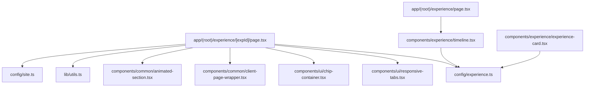
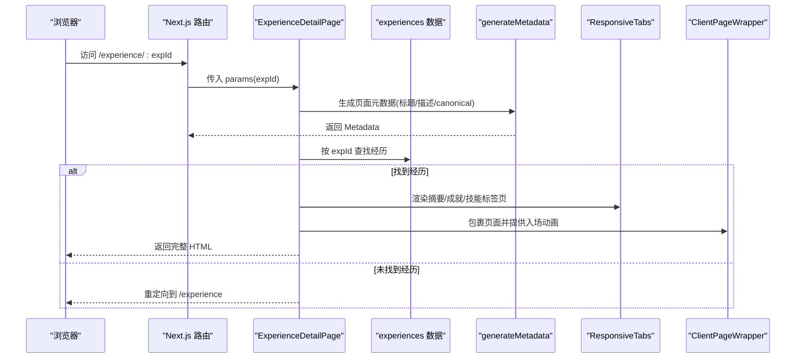
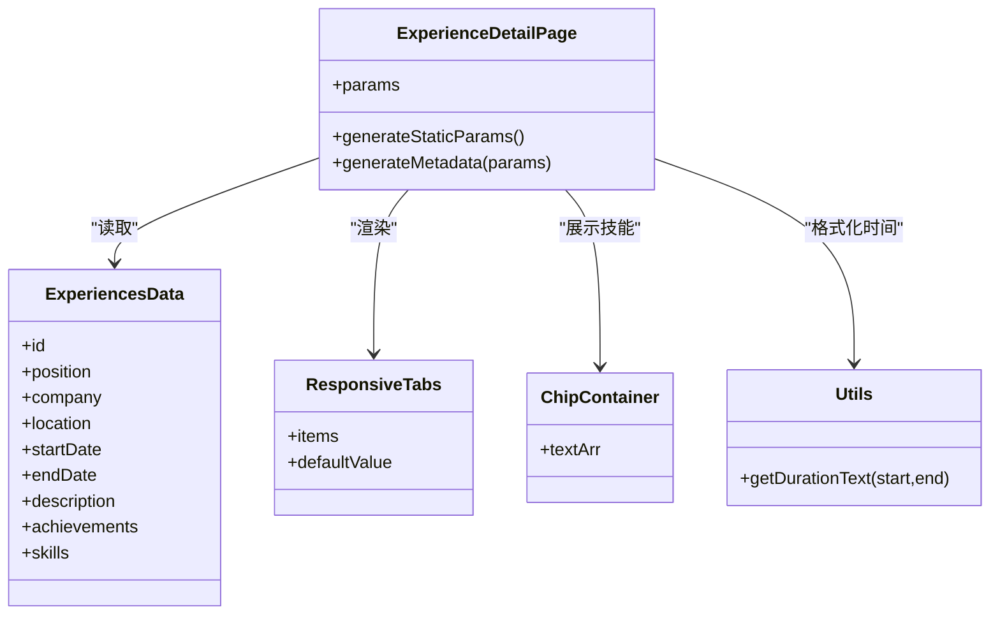

# 工作经历详情页

<cite>
**本文引用的文件**
- [app/(root)/experience/[expId]/page.tsx](file://app/(root)/experience/[expId]/page.tsx)
- [config/experience.ts](file://config/experience.ts)
- [components/experience/experience-card.tsx](file://components/experience/experience-card.tsx)
- [components/experience/timeline.tsx](file://components/experience/timeline.tsx)
- [app/(root)/experience/page.tsx](file://app/(root)/experience/page.tsx)
- [components/ui/responsive-tabs.tsx](file://components/ui/responsive-tabs.tsx)
- [components/ui/chip-container.tsx](file://components/ui/chip-container.tsx)
- [components/ui/chip.tsx](file://components/ui/chip.tsx)
- [lib/utils.ts](file://lib/utils.ts)
- [config/site.ts](file://config/site.ts)
- [app/layout.tsx](file://app/layout.tsx)
- [components/common/animated-section.tsx](file://components/common/animated-section.tsx)
- [components/common/client-page-wrapper.tsx](file://components/common/client-page-wrapper.tsx)
</cite>

## 目录
1. [简介](#简介)
2. [项目结构](#项目结构)
3. [核心组件](#核心组件)
4. [架构总览](#架构总览)
5. [详细组件分析](#详细组件分析)
6. [依赖关系分析](#依赖关系分析)
7. [性能考虑](#性能考虑)
8. [故障排查指南](#故障排查指南)
9. [结论](#结论)
10. [附录](#附录)

## 简介
本文件为“工作经历详情页”的完整技术文档，覆盖以下主题：
- 路由参数获取与工作经验数据的动态加载机制
- 页面布局结构（头部信息、详细描述、成就列表、技术栈）
- SEO 优化策略（元数据、结构化数据标记）
- 性能优化（静态生成、缓存策略、代码分割）
- 内容格式化方法（Markdown 支持与富文本渲染建议）
- 错误边界处理与用户反馈机制

## 项目结构
工作经历详情页位于 Next.js App Router 的动态路由下，通过路径参数 expId 定位具体经历条目。页面由服务端组件负责数据获取与 SEO 元信息设置，并通过客户端包装器与动画组件增强交互体验。

图表来源
- [app/(root)/experience/[expId]/page.tsx:1-210](file://app/(root)/experience/[expId]/page.tsx#L1-L210)
- [config/experience.ts:1-69](file://config/experience.ts#L1-L69)
- [components/ui/responsive-tabs.tsx:1-89](file://components/ui/responsive-tabs.tsx#L1-L89)
- [components/ui/chip-container.tsx:1-16](file://components/ui/chip-container.tsx#L1-L16)
- [components/common/client-page-wrapper.tsx:1-37](file://components/common/client-page-wrapper.tsx#L1-L37)
- [components/common/animated-section.tsx:1-51](file://components/common/animated-section.tsx#L1-L51)
- [lib/utils.ts:1-29](file://lib/utils.ts#L1-L29)
- [config/site.ts:1-39](file://config/site.ts#L1-L39)
- [app/(root)/experience/page.tsx:1-34](file://app/(root)/experience/page.tsx#L1-L34)
- [components/experience/timeline.tsx:1-100](file://components/experience/timeline.tsx#L1-L100)
- [components/experience/experience-card.tsx:1-95](file://components/experience/experience-card.tsx#L1-L95)

章节来源
- [app/(root)/experience/[expId]/page.tsx:1-210](file://app/(root)/experience/[expId]/page.tsx#L1-L210)
- [config/experience.ts:1-69](file://config/experience.ts#L1-L69)
- [app/(root)/experience/page.tsx:1-34](file://app/(root)/experience/page.tsx#L1-L34)

## 核心组件
- 详情页入口组件：负责解析路由参数、查找对应经历数据、构建 SEO 元数据、组织页面布局与标签页内容。
- 数据源：集中配置的经验数组，包含职位、公司、时间、描述、成就、技能等字段。
- 展示组件：
  - 响应式标签页：移动端下拉菜单，桌面端 Tab 切换，承载摘要、成就、技能三个区域。
  - 技能芯片容器：将技能数组渲染为可复用的 Chip 标签。
  - 动画与页面包装：提供滚动入场动画与页面级过渡效果。
- 工具函数：日期范围格式化、样式合并等。

章节来源
- [app/(root)/experience/[expId]/page.tsx:17-210](file://app/(root)/experience/[expId]/page.tsx#L17-L210)
- [config/experience.ts:3-69](file://config/experience.ts#L3-L69)
- [components/ui/responsive-tabs.tsx:16-89](file://components/ui/responsive-tabs.tsx#L16-L89)
- [components/ui/chip-container.tsx:3-16](file://components/ui/chip-container.tsx#L3-L16)
- [components/common/animated-section.tsx:6-51](file://components/common/animated-section.tsx#L6-L51)
- [components/common/client-page-wrapper.tsx:6-37](file://components/common/client-page-wrapper.tsx#L6-L37)
- [lib/utils.ts:8-29](file://lib/utils.ts#L8-L29)

## 架构总览
详情页采用服务端优先的数据流：在构建期或请求期根据动态路由参数生成静态参数并渲染页面；同时通过 generateMetadata 注入 SEO 元信息。页面内部使用客户端组件进行交互（标签切换、动画）。

图表来源
- [app/(root)/experience/[expId]/page.tsx:23-56](file://app/(root)/experience/[expId]/page.tsx#L23-L56)
- [app/(root)/experience/[expId]/page.tsx:58-194](file://app/(root)/experience/[expId]/page.tsx#L58-L194)
- [config/experience.ts:17-69](file://config/experience.ts#L17-L69)

## 详细组件分析

### 路由参数获取与数据加载
- 动态路由参数：通过 Promise 形式的 params 解构 expId，并在服务端组件中 await 获取。
- 数据查找：从集中配置的经验数组中按 id 匹配，若不存在则重定向至经验列表页。
- 静态参数生成：通过 generateStaticParams 基于全部经历 id 预生成静态路由，提升首屏性能与 SEO。

章节来源
- [app/(root)/experience/[expId]/page.tsx:17-56](file://app/(root)/experience/[expId]/page.tsx#L17-L56)
- [config/experience.ts:17-69](file://config/experience.ts#L17-L69)

### 页面布局结构
- 头部信息区：展示公司 Logo、职位名称、公司名称（含外链）、地点、任职时长（起止年份或 Present）。
- 详情内容区：使用响应式标签页分为三部分：
  - 摘要：以列表形式展示职责描述。
  - 成就：以列表形式展示关键成果。
  - 技能：以芯片容器展示技术栈。
- 导航与回退：顶部“返回经验列表”按钮与底部“查看全部经验”按钮。

章节来源
- [app/(root)/experience/[expId]/page.tsx:127-206](file://app/(root)/experience/[expId]/page.tsx#L127-L206)
- [components/ui/responsive-tabs.tsx:28-89](file://components/ui/responsive-tabs.tsx#L28-L89)
- [components/ui/chip-container.tsx:7-16](file://components/ui/chip-container.tsx#L7-L16)

### SEO 优化策略
- 页面级元数据：通过 generateMetadata 设置 title、description、canonical URL，确保每个经历页拥有独立且语义化的 SEO 信息。
- 站点级元数据：根布局统一设置 metadataBase、Open Graph、Twitter Card、robots、验证信息等。
- 结构化数据标记：当前实现未包含 JSON-LD 等结构化数据脚本；可在根布局或详情页引入结构化数据以提升搜索引擎理解度。

章节来源
- [app/(root)/experience/[expId]/page.tsx:27-46](file://app/(root)/experience/[expId]/page.tsx#L27-L46)
- [app/layout.tsx:18-85](file://app/layout.tsx#L18-L85)

### 性能优化
- 静态生成：通过 generateStaticParams 为所有经历生成静态路由，减少运行时计算，提高首屏速度。
- 客户端组件拆分：动画与交互逻辑封装在客户端组件中，避免在服务端执行不必要的状态管理。
- 图片优化：使用 next/image 对 Logo 进行尺寸与格式优化。
- 代码分割：UI 组件与动画库按需导入，减少主包体积。

章节来源
- [app/(root)/experience/[expId]/page.tsx:23-25](file://app/(root)/experience/[expId]/page.tsx#L23-L25)
- [components/common/client-page-wrapper.tsx:1-37](file://components/common/client-page-wrapper.tsx#L1-L37)
- [components/common/animated-section.tsx:1-51](file://components/common/animated-section.tsx#L1-L51)

### 内容格式化方法
- 当前实现：描述与成就以字符串数组直接渲染，未启用 Markdown 或富文本解析。
- 扩展建议：
  - 引入 Markdown 解析器（如 remark/rehype）将 Markdown 字符串转换为 HTML。
  - 使用安全渲染方案（如 DOMPurify）过滤潜在危险脚本。
  - 对表格、代码块、链接等进行样式定制，提升可读性。

[本节为概念性说明，不直接分析具体文件]

### 错误边界处理与用户反馈
- 数据缺失处理：当 expId 未匹配到任何经历时，服务端组件直接重定向至经验列表页，避免空白或错误页面。
- 用户反馈：当前未集成 Toast 或 Modal 提示；如需增强，可在重定向前添加短暂提示或使用全局通知组件。
- 建议：
  - 增加错误边界组件捕获渲染异常。
  - 在网络或数据异常时显示友好提示，并提供重试或返回首页操作。

章节来源
- [app/(root)/experience/[expId]/page.tsx:52-56](file://app/(root)/experience/[expId]/page.tsx#L52-L56)

## 依赖关系分析
- 详情页依赖：
  - 数据层：config/experience.ts 提供经历数据结构与实例。
  - UI 层：响应式标签页、芯片容器、按钮、卡片等基础组件。
  - 工具层：日期格式化、样式合并等。
  - 站点配置：URL、SEO 元信息。
- 列表页与卡片：
  - 列表页通过 Timeline 组件展示经历并按结束时间倒序排列。
  - 卡片组件提供简要信息与跳转链接。

图表来源
- [app/(root)/experience/[expId]/page.tsx:17-210](file://app/(root)/experience/[expId]/page.tsx#L17-L210)
- [config/experience.ts:3-69](file://config/experience.ts#L3-L69)
- [components/ui/responsive-tabs.tsx:16-89](file://components/ui/responsive-tabs.tsx#L16-L89)
- [components/ui/chip-container.tsx:3-16](file://components/ui/chip-container.tsx#L3-L16)
- [lib/utils.ts:17-29](file://lib/utils.ts#L17-L29)

章节来源
- [app/(root)/experience/page.tsx:24-31](file://app/(root)/experience/page.tsx#L24-L31)
- [components/experience/timeline.tsx:15-95](file://components/experience/timeline.tsx#L15-L95)
- [components/experience/experience-card.tsx:14-90](file://components/experience/experience-card.tsx#L14-L90)

## 性能考虑
- 静态生成：为所有经历生成静态路由，减少服务器负载与首屏延迟。
- 客户端组件最小化：仅将需要状态的交互部分（标签切换、动画）放在客户端组件中。
- 资源优化：使用 next/image 优化图片；按需导入 UI 组件与动画库。
- 缓存策略：利用 Next.js 内置缓存与 CDN 缓存静态资源；可为未来 API 接入添加 HTTP 缓存头。
- 代码分割：通过组件级拆分与懒加载进一步降低初始包体。

[本节提供通用指导，不直接分析具体文件]

## 故障排查指南
- 404 或重定向问题：检查 expId 是否存在于 experiences 数据源；确认 generateStaticParams 已正确生成所有路由。
- 元数据不正确：核对 generateMetadata 中的 title、description、canonical 是否随 expId 变化。
- 标签页内容不显示：确认 items 数组结构与 content 节点有效；检查客户端组件是否正确挂载。
- 图片加载失败：确认 logo 路径与 public 目录资源一致；检查 next/image 配置。
- 动画不生效：确认客户端组件包裹与 motion 库可用；检查视口与触发条件。

章节来源
- [app/(root)/experience/[expId]/page.tsx:23-56](file://app/(root)/experience/[expId]/page.tsx#L23-L56)
- [app/(root)/experience/[expId]/page.tsx:58-194](file://app/(root)/experience/[expId]/page.tsx#L58-L194)
- [components/common/animated-section.tsx:14-51](file://components/common/animated-section.tsx#L14-L51)
- [components/common/client-page-wrapper.tsx:25-37](file://components/common/client-page-wrapper.tsx#L25-L37)

## 结论
工作经历详情页通过 Next.js App Router 的动态路由与服务端渲染，结合静态生成与客户端交互组件，实现了高效、可维护且用户体验友好的页面。SEO 方面已具备完善的元数据设置，建议在后续迭代中加入结构化数据以提升搜索表现。性能上通过静态生成、图片优化与客户端组件拆分达到良好平衡。内容格式化可按需引入 Markdown 与富文本支持，错误边界与用户反馈机制可进一步增强健壮性与可用性。

[本节总结性内容，不直接分析具体文件]

## 附录
- 相关页面与组件路径参考：
  - 详情页入口：[app/(root)/experience/[expId]/page.tsx](file://app/(root)/experience/[expId]/page.tsx)
  - 数据源：[config/experience.ts](file://config/experience.ts)
  - 列表页：[app/(root)/experience/page.tsx](file://app/(root)/experience/page.tsx)
  - 时间线组件：[components/experience/timeline.tsx](file://components/experience/timeline.tsx)
  - 卡片组件：[components/experience/experience-card.tsx](file://components/experience/experience-card.tsx)
  - 标签页组件：[components/ui/responsive-tabs.tsx](file://components/ui/responsive-tabs.tsx)
  - 技能芯片：[components/ui/chip-container.tsx](file://components/ui/chip-container.tsx)、[components/ui/chip.tsx](file://components/ui/chip.tsx)
  - 工具函数：[lib/utils.ts](file://lib/utils.ts)
  - 站点配置：[config/site.ts](file://config/site.ts)
  - 根布局：[app/layout.tsx](file://app/layout.tsx)
  - 动画与包装：[components/common/animated-section.tsx](file://components/common/animated-section.tsx)、[components/common/client-page-wrapper.tsx](file://components/common/client-page-wrapper.tsx)