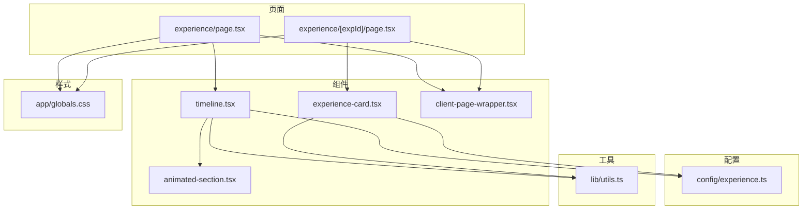
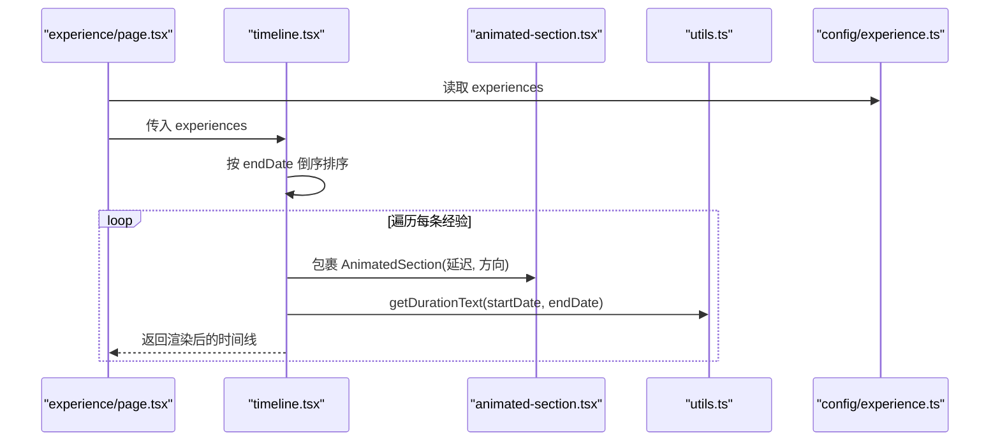
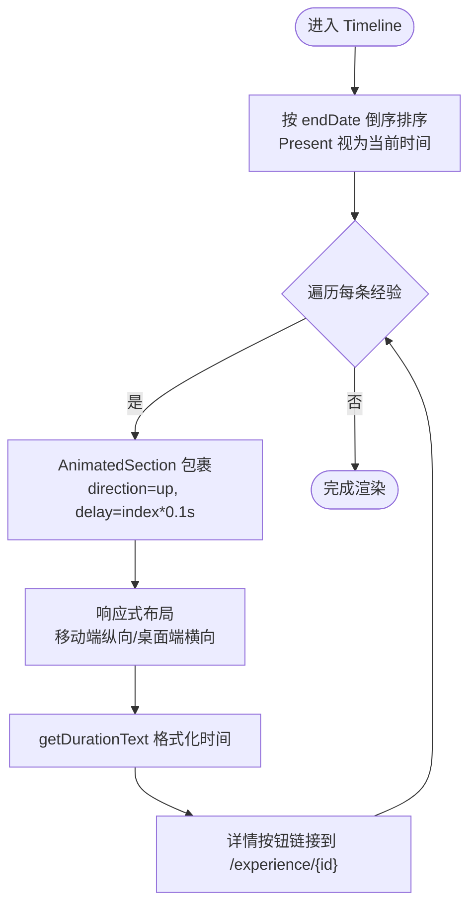
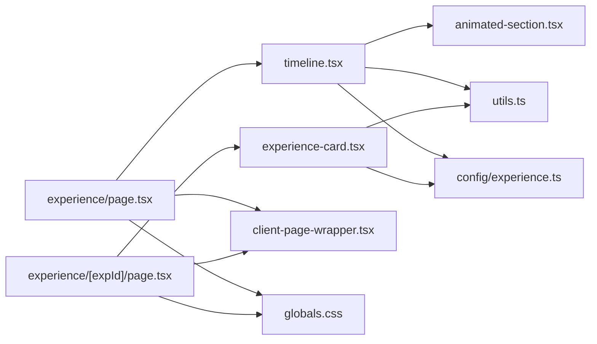

# 时间线组件实现

<cite>
**本文引用的文件**
- [timeline.tsx](file://components/experience/timeline.tsx)
- [experience-card.tsx](file://components/experience/experience-card.tsx)
- [experience.ts](file://config/experience.ts)
- [page.tsx](file://app/(root)/experience/page.tsx)
- [animated-section.tsx](file://components/common/animated-section.tsx)
- [client-page-wrapper.tsx](file://components/common/client-page-wrapper.tsx)
- [utils.ts](file://lib/utils.ts)
- [globals.css](file://app/globals.css)
- [use-lock-body.ts](file://hooks/use-lock-body.ts)
</cite>

## 目录
1. [简介](#简介)
2. [项目结构](#项目结构)
3. [核心组件](#核心组件)
4. [架构总览](#架构总览)
5. [详细组件分析](#详细组件分析)
6. [依赖关系分析](#依赖关系分析)
7. [性能考量](#性能考量)
8. [故障排查指南](#故障排查指南)
9. [结论](#结论)
10. [附录](#附录)

## 简介
本技术文档围绕“时间线组件”的实现，系统阐述以下方面：
- 渲染算法与排序逻辑：工作经历按结束时间倒序排列，当前仍在任的条目使用“Present”处理。
- 时间间隔计算：起止年份格式化输出，支持“Present”语义。
- 视觉布局策略：响应式卡片布局、移动端适配、间距与层级控制。
- 动画效果：滚动触发淡入、方向性入场、页面级过渡。
- 性能优化：静态生成、客户端动画边界、图片尺寸与懒加载策略建议。
- 自定义样式与主题：基于 Tailwind 的设计令牌与类名组合。
- 错误处理与数据加载状态：路由参数校验、缺失数据重定向、通用错误提示模式。

## 项目结构
时间线功能由页面、组件、配置与工具函数组成，整体位于 Next.js App Router 中：
- 页面层：经验列表页与详情页
- 组件层：时间线容器、经验卡片、通用动画与页面包装
- 配置层：经验数据结构与示例数据
- 工具层：日期格式化与工具函数
- 样式层：全局 CSS 与 Tailwind 类名

图表来源
- [page.tsx:1-34](file://app/(root)/experience/page.tsx#L1-L34)
- [timeline.tsx:1-100](file://components/experience/timeline.tsx#L1-L100)
- [experience-card.tsx:1-95](file://components/experience/experience-card.tsx#L1-L95)
- [experience.ts:1-69](file://config/experience.ts#L1-L69)
- [animated-section.tsx:1-51](file://components/common/animated-section.tsx#L1-L51)
- [client-page-wrapper.tsx:1-36](file://components/common/client-page-wrapper.tsx#L1-L36)
- [utils.ts:1-29](file://lib/utils.ts#L1-L29)
- [globals.css:374-572](file://app/globals.css#L374-L572)

章节来源
- [page.tsx:1-34](file://app/(root)/experience/page.tsx#L1-L34)
- [timeline.tsx:1-100](file://components/experience/timeline.tsx#L1-L100)
- [experience-card.tsx:1-95](file://components/experience/experience-card.tsx#L1-L95)
- [experience.ts:1-69](file://config/experience.ts#L1-L69)
- [animated-section.tsx:1-51](file://components/common/animated-section.tsx#L1-L51)
- [client-page-wrapper.tsx:1-36](file://components/common/client-page-wrapper.tsx#L1-L36)
- [utils.ts:1-29](file://lib/utils.ts#L1-L29)
- [globals.css:374-572](file://app/globals.css#L374-L572)

## 核心组件
- 时间线容器（Timeline）：接收经验数组，执行排序并逐项渲染为带动画的卡片。
- 经验卡片（ExperienceCard）：展示单条经验的摘要信息、技能标签与详情入口。
- 动画区块（AnimatedSection）：基于滚动触发的淡入与位移动画。
- 页面包装（ClientPageWrapper）：页面级淡入过渡，统一客户端动画上下文。
- 工具函数（getDurationText）：将起止日期格式化为“起始年 - 结束年/ Present”。

章节来源
- [timeline.tsx:1-100](file://components/experience/timeline.tsx#L1-L100)
- [experience-card.tsx:1-95](file://components/experience/experience-card.tsx#L1-L95)
- [animated-section.tsx:1-51](file://components/common/animated-section.tsx#L1-L51)
- [client-page-wrapper.tsx:1-36](file://components/common/client-page-wrapper.tsx#L1-L36)
- [utils.ts:1-29](file://lib/utils.ts#L1-L29)

## 架构总览
时间线渲染流程从页面到组件再到数据与工具：
- 页面提供元信息与标题描述，并将数据源注入时间线组件。
- 时间线组件对数据进行排序，循环渲染每个经验项，包裹动画区块。
- 经验卡片负责具体字段展示与交互按钮。
- 工具函数负责时间文本格式化。
- 动画组件通过视口检测触发入场动画。

图表来源
- [page.tsx:1-34](file://app/(root)/experience/page.tsx#L1-L34)
- [timeline.tsx:1-100](file://components/experience/timeline.tsx#L1-L100)
- [animated-section.tsx:1-51](file://components/common/animated-section.tsx#L1-L51)
- [utils.ts:1-29](file://lib/utils.ts#L1-L29)
- [experience.ts:1-69](file://config/experience.ts#L1-L69)

## 详细组件分析

### 时间线容器（Timeline）
- 排序逻辑：
  - 将“Present”视为当前时间，参与比较；否则使用 endDate 时间戳。
  - 按结束时间降序排列，确保最新经历置顶。
- 渲染策略：
  - 每项使用 AnimatedSection 包裹，设置递增延迟与向上入场方向。
  - 卡片内部采用响应式布局：移动端纵向堆叠，桌面端横向分栏。
  - 图片固定宽高并使用 object-contain，避免变形。
  - 时间区间通过工具函数格式化显示。
  - 详情按钮链接至动态路由 /experience/[expId]。
- 可访问性与健壮性：
  - 外链使用 target="_blank" 与 rel="noopener noreferrer"。
  - 图片 alt 使用公司名提升可读性。

图表来源
- [timeline.tsx:15-21](file://components/experience/timeline.tsx#L15-L21)
- [timeline.tsx:23-95](file://components/experience/timeline.tsx#L23-L95)
- [utils.ts:17-28](file://lib/utils.ts#L17-L28)

章节来源
- [timeline.tsx:15-21](file://components/experience/timeline.tsx#L15-L21)
- [timeline.tsx:23-95](file://components/experience/timeline.tsx#L23-L95)
- [utils.ts:17-28](file://lib/utils.ts#L17-L28)

### 经验卡片（ExperienceCard）
- 展示内容：职位、公司、地点、时间区间、前两条技能标签、描述摘要。
- 交互：点击“查看详情”跳转至详情页。
- 响应式：小屏幕隐藏分隔符，技能标签自动换行。

章节来源
- [experience-card.tsx:14-90](file://components/experience/experience-card.tsx#L14-L90)

### 动画区块（AnimatedSection）
- 基于 motion/react 的 whileInView 触发：
  - 初始状态：透明度 0，沿方向偏移。
  - 进入视口：透明度 1，回到原位，持续 0.8s，easeOut。
  - viewport.once=true 保证仅触发一次，减少重复计算。
  - margin="-100px" 提前触发，提升观感。
- 支持方向与延迟，便于列表交错动画。

章节来源
- [animated-section.tsx:14-49](file://components/common/animated-section.tsx#L14-L49)

### 页面包装（ClientPageWrapper）
- 页面级淡入过渡：初始 y 下移与透明，进入后恢复。
- 统一客户端动画上下文，避免 SSR/CSR 闪烁。

章节来源
- [client-page-wrapper.tsx:10-34](file://components/common/client-page-wrapper.tsx#L10-L34)

### 工具函数（getDurationText）
- 输入：开始日期与结束日期或字符串“Present”。
- 输出：格式化字符串“起始年 - 结束年/ Present”。
- 复杂度：O(1)。

章节来源
- [utils.ts:17-28](file://lib/utils.ts#L17-L28)

### 数据模型（ExperienceInterface）
- 字段包括 id、position、company、location、startDate、endDate、description、achievements、skills、可选 companyUrl 与 logo。
- 用于类型约束与静态生成参数。

章节来源
- [experience.ts:3-15](file://config/experience.ts#L3-L15)

## 依赖关系分析
- 页面依赖：
  - experience/page.tsx 依赖 Timeline、PageContainer、站点与页面配置。
  - experience/[expId]/page.tsx 依赖 ExperienceCard、ResponsiveTabs、动画与工具函数。
- 组件依赖：
  - Timeline 依赖 AnimatedSection、Icons、Button、ExperienceInterface、getDurationText。
  - ExperienceCard 依赖 Icons、Button、ExperienceInterface、getDurationText。
- 工具与样式：
  - utils.ts 提供 cn、formatDate、getDurationText。
  - globals.css 包含媒体查询与动画关键帧，配合 Tailwind 类名实现响应式与动效。

图表来源
- [page.tsx:1-34](file://app/(root)/experience/page.tsx#L1-L34)
- [timeline.tsx:1-100](file://components/experience/timeline.tsx#L1-L100)
- [experience-card.tsx:1-95](file://components/experience/experience-card.tsx#L1-L95)
- [animated-section.tsx:1-51](file://components/common/animated-section.tsx#L1-L51)
- [utils.ts:1-29](file://lib/utils.ts#L1-L29)
- [experience.ts:1-69](file://config/experience.ts#L1-L69)
- [client-page-wrapper.tsx:1-36](file://components/common/client-page-wrapper.tsx#L1-L36)
- [globals.css:374-572](file://app/globals.css#L374-L572)

章节来源
- [page.tsx:1-34](file://app/(root)/experience/page.tsx#L1-L34)
- [timeline.tsx:1-100](file://components/experience/timeline.tsx#L1-L100)
- [experience-card.tsx:1-95](file://components/experience/experience-card.tsx#L1-L95)
- [animated-section.tsx:1-51](file://components/common/animated-section.tsx#L1-L51)
- [utils.ts:1-29](file://lib/utils.ts#L1-L29)
- [experience.ts:1-69](file://config/experience.ts#L1-L69)
- [client-page-wrapper.tsx:1-36](file://components/common/client-page-wrapper.tsx#L1-L36)
- [globals.css:374-572](file://app/globals.css#L374-L572)

## 性能考量
- 静态生成与预渲染：
  - 详情页使用 generateStaticParams 生成静态路由参数，减少运行时查找成本。
- 客户端动画边界：
  - 动画组件标记为 "use client"，仅在客户端执行，避免 SSR 开销。
  - whileInView 的 once=true 与 viewport.margin 减少重复触发与计算。
- 图片优化：
  - 使用 Next/Image 并指定 width/height，结合 object-contain 避免重排。
  - 建议在更多场景启用 next/image 的占位与懒加载策略（如 loading="lazy"）。
- 内存与重绘：
  - 列表项动画使用 transform 与 opacity，利于 GPU 加速。
  - 避免在高频滚动回调中进行昂贵计算。
- 虚拟滚动与懒加载（建议）：
  - 当经验条目数量较大时，可引入虚拟滚动（如 react-window）仅渲染可视区域。
  - 对长描述与图片进行懒加载，按需请求与解码。
- 首屏性能：
  - 将非关键动画延迟或降级（如 prefers-reduced-motion），减少主线程阻塞。

[本节为通用性能指导，不直接分析具体代码文件]

## 故障排查指南
- 详情页不存在：
  - 若根据 expId 未找到对应经验，页面会重定向到 /experience，避免白屏。
- 数据缺失或异常：
  - 经验数据来自本地配置，若新增条目需确保字段完整（尤其是 startDate、endDate、id）。
- 动画不触发：
  - 检查父容器是否限制高度导致视口检测失效；确认 AnimatedSection 的 viewport 配置未被覆盖。
- 外链安全：
  - 所有外部链接均添加 rel="noopener noreferrer"，防止安全风险。
- 通用错误提示模式：
  - 项目中存在统一的模态框存储（use-modal-store）与 Toast 组件，可用于展示成功/失败反馈。

章节来源
- [experience/[expId]/page.tsx:23-56](file://app/(root)/experience/[expId]/page.tsx#L23-L56)
- [experience.ts:3-15](file://config/experience.ts#L3-L15)
- [animated-section.tsx:30-49](file://components/common/animated-section.tsx#L30-L49)
- [timeline.tsx:61-70](file://components/experience/timeline.tsx#L61-L70)

## 结论
时间线组件以清晰的职责划分实现了：
- 可靠的排序与时间格式化逻辑
- 响应式且美观的卡片布局
- 流畅的滚动触发动画与页面过渡
- 良好的可扩展性与可维护性
同时，提供了进一步优化的空间，如虚拟滚动、更细粒度的懒加载与无障碍增强。

[本节为总结性内容，不直接分析具体代码文件]

## 附录

### 响应式设计实现要点
- 使用 Tailwind 断点（sm/md/lg）切换布局：
  - 移动端：纵向堆叠、隐藏分隔符、全宽按钮。
  - 桌面端：横向分栏、紧凑间距、自适应宽度。
- 图片与容器：
  - 固定宽高与 object-contain 保持比例。
  - 外层容器使用 overflow-x-hidden 避免横向滚动。
- 媒体查询与动画：
  - 全局 CSS 中包含媒体查询与关键帧，配合类名实现不同屏幕下的表现。

章节来源
- [timeline.tsx:31-91](file://components/experience/timeline.tsx#L31-L91)
- [experience-card.tsx:16-75](file://components/experience/experience-card.tsx#L16-L75)
- [globals.css:374-572](file://app/globals.css#L374-L572)

### 动画效果实现清单
- 滚动触发：whileInView + viewport.once + margin 提前触发。
- 淡入与位移：opacity 与 x/y 变换，duration 与 ease 控制节奏。
- 页面过渡：ClientPageWrapper 的 initial/animate 变体。
- 交互反馈：按钮 hover/active 状态由 Tailwind 与 UI 组件提供。

章节来源
- [animated-section.tsx:30-49](file://components/common/animated-section.tsx#L30-L49)
- [client-page-wrapper.tsx:10-34](file://components/common/client-page-wrapper.tsx#L10-L34)

### 自定义样式与主题定制
- 设计令牌：
  - 使用 bg-background、text-foreground、border-border、bg-primary 等语义化类名，便于主题切换。
- 组合工具：
  - 使用 cn 工具合并类名，避免冲突。
- 扩展建议：
  - 在 Tailwind 配置中扩展颜色与断点，统一全站风格。
  - 通过 CSS 变量与 @layer 组织样式层次。

章节来源
- [utils.ts:1-6](file://lib/utils.ts#L1-L6)
- [timeline.tsx:31-91](file://components/experience/timeline.tsx#L31-L91)
- [experience-card.tsx:16-75](file://components/experience/experience-card.tsx#L16-L75)

### 错误处理与数据加载状态管理
- 路由级错误：
  - 详情页找不到数据时重定向，避免无效状态。
- 用户反馈：
  - 使用模态框与 Toast 组件展示成功/失败消息，提升用户体验。
- 数据一致性：
  - 经验数据集中管理，新增条目需遵循接口定义，避免运行时错误。

章节来源
- [experience/[expId]/page.tsx:23-56](file://app/(root)/experience/[expId]/page.tsx#L23-L56)
- [experience.ts:3-15](file://config/experience.ts#L3-L15)