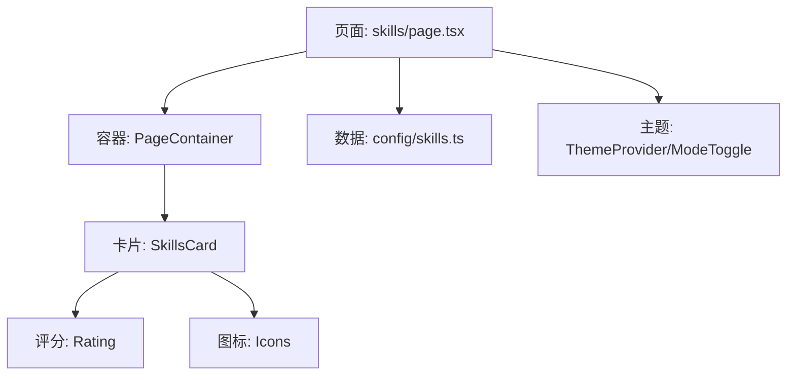
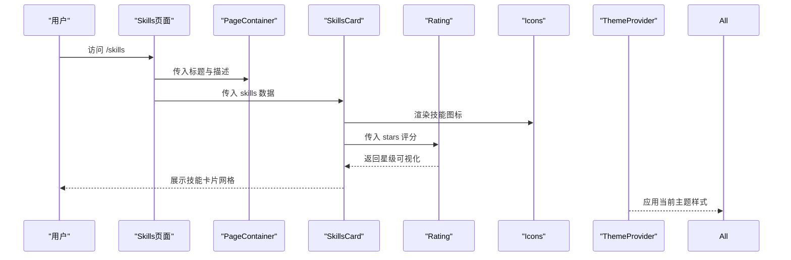
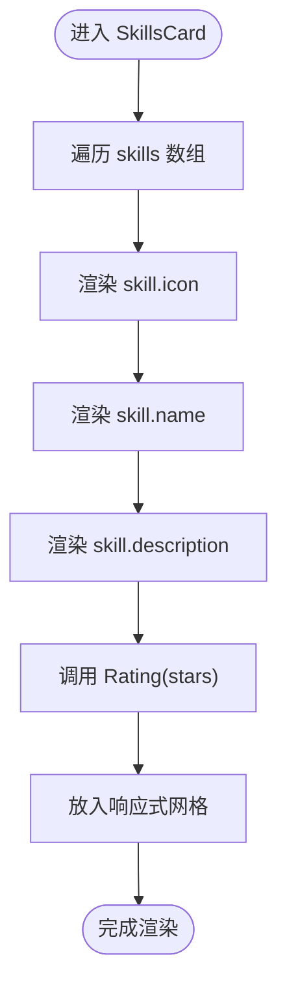
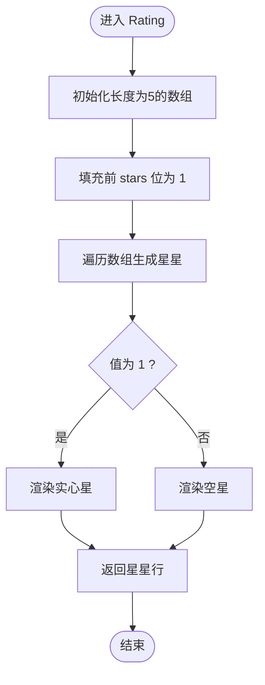
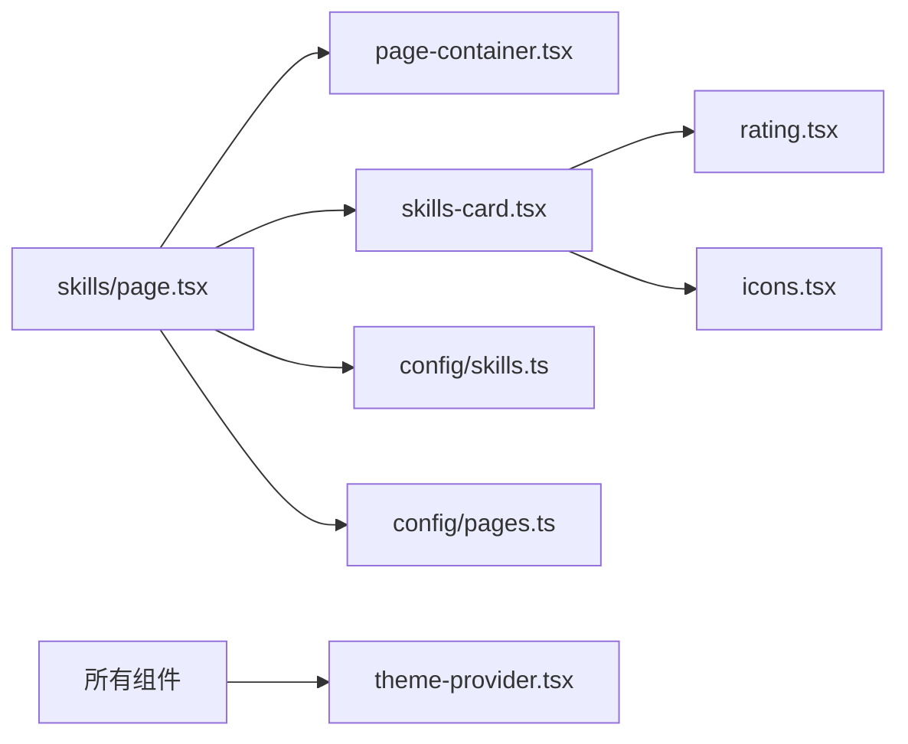

# 技能展示模块

<cite>
**本文引用的文件**
- [config/skills.ts](file://config/skills.ts)
- [components/skills/skills-card.tsx](file://components/skills/skills-card.tsx)
- [components/skills/rating.tsx](file://components/skills/rating.tsx)
- [app/(root)/skills/page.tsx](file://app/(root)/skills/page.tsx)
- [components/common/icons.tsx](file://components/common/icons.tsx)
- [components/common/theme-provider.tsx](file://components/common/theme-provider.tsx)
- [components/common/mode-toggle.tsx](file://components/common/mode-toggle.tsx)
- [config/pages.ts](file://config/pages.ts)
- [components/ui/chip.tsx](file://components/ui/chip.tsx)
- [components/ui/chip-container.tsx](file://components/ui/chip-container.tsx)
- [components/common/page-container.tsx](file://components/common/page-container.tsx)
</cite>

## 目录
1. [简介](#简介)
2. [项目结构](#项目结构)
3. [核心组件](#核心组件)
4. [架构总览](#架构总览)
5. [详细组件分析](#详细组件分析)
6. [依赖关系分析](#依赖关系分析)
7. [性能考量](#性能考量)
8. [故障排查指南](#故障排查指南)
9. [结论](#结论)
10. [附录：配置与扩展指南](#附录：配置与扩展指南)

## 简介
本模块为 Next.js 投资组合中的“技能展示”功能，负责以卡片形式呈现技能名称、描述、图标与等级评分。它通过集中化的数据配置管理技能条目，使用响应式网格布局进行分组展示，并以星级可视化直观表达技能水平。同时，模块与主题系统深度集成，支持明暗模式及多种风格主题下的统一展示效果。

## 项目结构
技能展示模块由以下关键部分组成：
- 数据层：集中定义技能数据结构与排序后的数据导出
- 页面层：Next.js 路由页面，承载标题、描述与技能卡片容器
- 组件层：技能卡片与评分组件，负责渲染与交互
- 资源层：图标集合，提供各技能的视觉标识
- 主题层：主题提供者与切换器，确保多主题一致体验

图表来源
- [app/(root)/skills/page.tsx:1-23](file://app/(root)/skills/page.tsx#L1-L23)
- [components/common/page-container.tsx:1-27](file://components/common/page-container.tsx#L1-L27)
- [components/skills/skills-card.tsx:1-31](file://components/skills/skills-card.tsx#L1-L31)
- [components/skills/rating.tsx:1-41](file://components/skills/rating.tsx#L1-L41)
- [components/common/icons.tsx:1-180](file://components/common/icons.tsx#L1-L180)
- [config/skills.ts:1-166](file://config/skills.ts#L1-L166)

章节来源
- [app/(root)/skills/page.tsx:1-23](file://app/(root)/skills/page.tsx#L1-L23)
- [config/skills.ts:1-166](file://config/skills.ts#L1-L166)
- [components/skills/skills-card.tsx:1-31](file://components/skills/skills-card.tsx#L1-L31)
- [components/skills/rating.tsx:1-41](file://components/skills/rating.tsx#L1-L41)
- [components/common/icons.tsx:1-180](file://components/common/icons.tsx#L1-L180)
- [components/common/page-container.tsx:1-27](file://components/common/page-container.tsx#L1-L27)

## 核心组件
- 技能数据模型与导出：定义技能字段（名称、描述、评分、图标），并提供排序后的技能列表与精选技能切片。
- 技能卡片：接收技能数组，按响应式网格渲染每个技能卡片，包含图标、标题、描述与评分。
- 评分组件：根据传入的星级数值渲染对应数量的实心星与空心星，形成直观的等级可视化。
- 页面容器：包裹页面头部与内容区域，提供统一的布局与边距控制。
- 主题系统：通过主题提供者与切换器实现多主题切换，影响卡片背景、边框、文字颜色等显示效果。

章节来源
- [config/skills.ts:1-166](file://config/skills.ts#L1-L166)
- [components/skills/skills-card.tsx:1-31](file://components/skills/skills-card.tsx#L1-L31)
- [components/skills/rating.tsx:1-41](file://components/skills/rating.tsx#L1-L41)
- [components/common/page-container.tsx:1-27](file://components/common/page-container.tsx#L1-L27)
- [components/common/theme-provider.tsx:1-8](file://components/common/theme-provider.tsx#L1-L8)
- [components/common/mode-toggle.tsx:1-70](file://components/common/mode-toggle.tsx#L1-L70)

## 架构总览
技能展示模块采用“数据驱动 + 组件化渲染”的架构：
- 数据层在配置文件中维护技能条目，并对外暴露排序后的列表与精选子集。
- 页面层从配置中读取数据，并通过容器组件组织页面结构与元信息。
- 组件层将数据映射到 UI，使用响应式网格与可复用评分组件完成展示。
- 主题系统通过上下文注入样式变量，使所有组件在不同主题下保持一致的视觉表现。

图表来源
- [app/(root)/skills/page.tsx:1-23](file://app/(root)/skills/page.tsx#L1-L23)
- [components/common/page-container.tsx:1-27](file://components/common/page-container.tsx#L1-L27)
- [components/skills/skills-card.tsx:1-31](file://components/skills/skills-card.tsx#L1-L31)
- [components/skills/rating.tsx:1-41](file://components/skills/rating.tsx#L1-L41)
- [components/common/icons.tsx:1-180](file://components/common/icons.tsx#L1-L180)
- [components/common/theme-provider.tsx:1-8](file://components/common/theme-provider.tsx#L1-L8)

## 详细组件分析

### 技能数据模型与组织方式
- 数据结构：每条技能包含名称、描述、评分（1-5）、图标引用。
- 分类与筛选：当前未内置分类字段；可通过扩展接口增加 category 字段，并在页面层基于该字段进行分组或过滤。
- 排序与精选：默认按评分降序排列，并提供前 N 项作为精选技能用于首页或其他位置展示。
- 图标资源：通过统一图标集合导出，便于集中管理与替换。

章节来源
- [config/skills.ts:1-166](file://config/skills.ts#L1-L166)
- [components/common/icons.tsx:1-180](file://components/common/icons.tsx#L1-L180)

### 技能卡片组件实现原理
- 分组展示：使用响应式网格布局，在小屏显示两列，大屏显示三列，自动换行与间距控制。
- 卡片内容：顶部为技能图标，中部为名称与描述，底部为评分组件。
- 高度与对齐：固定高度容器保证卡片整齐划一，内部元素垂直分布。
- 可扩展点：可在卡片内添加标签（如技术栈标签）或链接跳转详情。

图表来源
- [components/skills/skills-card.tsx:1-31](file://components/skills/skills-card.tsx#L1-L31)

章节来源
- [components/skills/skills-card.tsx:1-31](file://components/skills/skills-card.tsx#L1-L31)

### 评分组件实现原理
- 输入：stars 为 1-5 的整数。
- 逻辑：创建长度为 5 的数组，将前 stars 个位置标记为实心星，其余为空星。
- 输出：一行星星图标，实心星高亮，空星弱化，形成直观的等级可视化。
- 主题兼容：颜色类名与主题变量结合，确保明暗模式下均清晰可见。

图表来源
- [components/skills/rating.tsx:1-41](file://components/skills/rating.tsx#L1-L41)

章节来源
- [components/skills/rating.tsx:1-41](file://components/skills/rating.tsx#L1-L41)

### 页面与容器
- 页面职责：设置元信息（标题、描述），加载技能数据，并将数据传递给卡片组件。
- 容器职责：包裹页面头部与内容区域，提供统一的边距与滚动处理。
- 主题集成：页面与容器均在主题上下文中渲染，确保样式一致性。

章节来源
- [app/(root)/skills/page.tsx:1-23](file://app/(root)/skills/page.tsx#L1-L23)
- [components/common/page-container.tsx:1-27](file://components/common/page-container.tsx#L1-L27)
- [config/pages.ts:1-86](file://config/pages.ts#L1-L86)

### 主题系统与技能展示
- 主题提供者：通过客户端组件提供主题上下文，支持明暗模式与多种风格主题。
- 切换器：下拉菜单选择主题，动态更新全局样式变量。
- 技能展示适配：卡片背景、边框、文字颜色等通过主题变量控制，确保不同主题下可读性与美观性。

章节来源
- [components/common/theme-provider.tsx:1-8](file://components/common/theme-provider.tsx#L1-L8)
- [components/common/mode-toggle.tsx:1-70](file://components/common/mode-toggle.tsx#L1-L70)

## 依赖关系分析
- 页面依赖：
  - 页面组件依赖容器组件与技能卡片组件。
  - 页面组件从配置中导入技能数据与页面元信息。
- 卡片组件依赖：
  - 评分组件用于展示等级。
  - 图标集合用于渲染技能图标。
- 主题依赖：
  - 所有组件在主题上下文中渲染，受主题切换影响。

图表来源
- [app/(root)/skills/page.tsx:1-23](file://app/(root)/skills/page.tsx#L1-L23)
- [components/common/page-container.tsx:1-27](file://components/common/page-container.tsx#L1-L27)
- [components/skills/skills-card.tsx:1-31](file://components/skills/skills-card.tsx#L1-L31)
- [components/skills/rating.tsx:1-41](file://components/skills/rating.tsx#L1-L41)
- [components/common/icons.tsx:1-180](file://components/common/icons.tsx#L1-L180)
- [config/skills.ts:1-166](file://config/skills.ts#L1-L166)
- [config/pages.ts:1-86](file://config/pages.ts#L1-L86)
- [components/common/theme-provider.tsx:1-8](file://components/common/theme-provider.tsx#L1-L8)

章节来源
- [app/(root)/skills/page.tsx:1-23](file://app/(root)/skills/page.tsx#L1-L23)
- [components/skills/skills-card.tsx:1-31](file://components/skills/skills-card.tsx#L1-L31)
- [components/skills/rating.tsx:1-41](file://components/skills/rating.tsx#L1-L41)
- [config/skills.ts:1-166](file://config/skills.ts#L1-L166)
- [config/pages.ts:1-86](file://config/pages.ts#L1-L86)
- [components/common/theme-provider.tsx:1-8](file://components/common/theme-provider.tsx#L1-L8)

## 性能考量
- 数据量与渲染：当前为静态配置数据，无分页或虚拟列表需求；若未来技能数量增长，建议引入分页或懒加载。
- 图标体积：图标来自第三方库，按需引入可减少打包体积；避免重复导入相同图标。
- 评分计算：评分组件每次渲染都会构建数组，复杂度 O(5)，开销极小；若需更复杂可视化（进度条/百分比），应缓存结果或使用 memo 优化。
- 主题切换：主题切换会触发重渲染，注意减少不必要的状态更新。

[本节为通用性能指导，不直接分析具体文件]

## 故障排查指南
- 图标缺失或显示异常：
  - 检查图标是否在图标集合中正确导出。
  - 确认技能数据中的 icon 引用指向正确的图标键。
- 评分显示不正确：
  - 确认传入的 stars 值范围在 1-5 之间。
  - 检查评分组件是否被正确调用并接收 props。
- 主题样式错乱：
  - 确认页面与组件在主题提供者上下文中渲染。
  - 检查主题切换器是否正确调用 setTheme。
- 布局错位：
  - 检查响应式网格类名是否生效。
  - 确认容器边距与最大宽度设置合理。

章节来源
- [components/common/icons.tsx:1-180](file://components/common/icons.tsx#L1-L180)
- [components/skills/rating.tsx:1-41](file://components/skills/rating.tsx#L1-L41)
- [components/common/mode-toggle.tsx:1-70](file://components/common/mode-toggle.tsx#L1-L70)
- [components/skills/skills-card.tsx:1-31](file://components/skills/skills-card.tsx#L1-L31)

## 结论
技能展示模块以简洁的数据结构与清晰的组件划分实现了技能的高效展示与良好的用户体验。通过集中化配置与响应式布局，开发者可以便捷地扩展技能条目与展示样式；借助主题系统，模块在不同主题下保持一致的视觉效果。未来可在此基础上增加分类、搜索、筛选与更多可视化形式，以满足更丰富的展示需求。

[本节为总结性内容，不直接分析具体文件]

## 附录：配置与扩展指南

### 如何添加新技能
- 在技能配置文件中新增一条记录，包含名称、描述、评分与图标引用。
- 如需分类，可在接口中增加 category 字段，并在页面层按分类进行分组或过滤。
- 图标需在图标集合中导出，并确保名称一致。

章节来源
- [config/skills.ts:1-166](file://config/skills.ts#L1-L166)
- [components/common/icons.tsx:1-180](file://components/common/icons.tsx#L1-L180)

### 如何调整等级评分
- 修改对应技能的 rating 字段（1-5）。
- 评分组件会根据该值渲染对应数量的实心星。
- 如需更细粒度（如 0.5 星），可扩展评分组件逻辑与样式。

章节来源
- [components/skills/rating.tsx:1-41](file://components/skills/rating.tsx#L1-L41)

### 如何自定义显示样式
- 卡片样式：通过 Tailwind 类名调整边框、背景、圆角、间距等。
- 评分样式：修改星星图标的颜色与尺寸，或替换为进度条/百分比组件。
- 主题样式：通过主题变量统一控制颜色与对比度，确保多主题一致性。

章节来源
- [components/skills/skills-card.tsx:1-31](file://components/skills/skills-card.tsx#L1-L31)
- [components/skills/rating.tsx:1-41](file://components/skills/rating.tsx#L1-L41)
- [components/common/theme-provider.tsx:1-8](file://components/common/theme-provider.tsx#L1-L8)

### 如何实现动态加载、筛选过滤与响应式布局
- 动态加载：可将技能数据迁移至 API 或 CMS，页面通过异步请求获取并渲染。
- 筛选过滤：在页面层增加搜索框与分类选择器，基于 name、category 等字段进行过滤。
- 响应式布局：已使用响应式网格；可根据需要调整列数与间距，适配不同屏幕尺寸。

章节来源
- [app/(root)/skills/page.tsx:1-23](file://app/(root)/skills/page.tsx#L1-L23)
- [components/skills/skills-card.tsx:1-31](file://components/skills/skills-card.tsx#L1-L31)

### 与主题系统的集成
- 确保页面与组件在主题提供者上下文中渲染。
- 使用主题切换器切换主题，验证卡片背景、边框、文字颜色是否符合预期。
- 如需新增主题，扩展主题提供者与切换器选项，并定义对应的样式变量。

章节来源
- [components/common/theme-provider.tsx:1-8](file://components/common/theme-provider.tsx#L1-L8)
- [components/common/mode-toggle.tsx:1-70](file://components/common/mode-toggle.tsx#L1-L70)