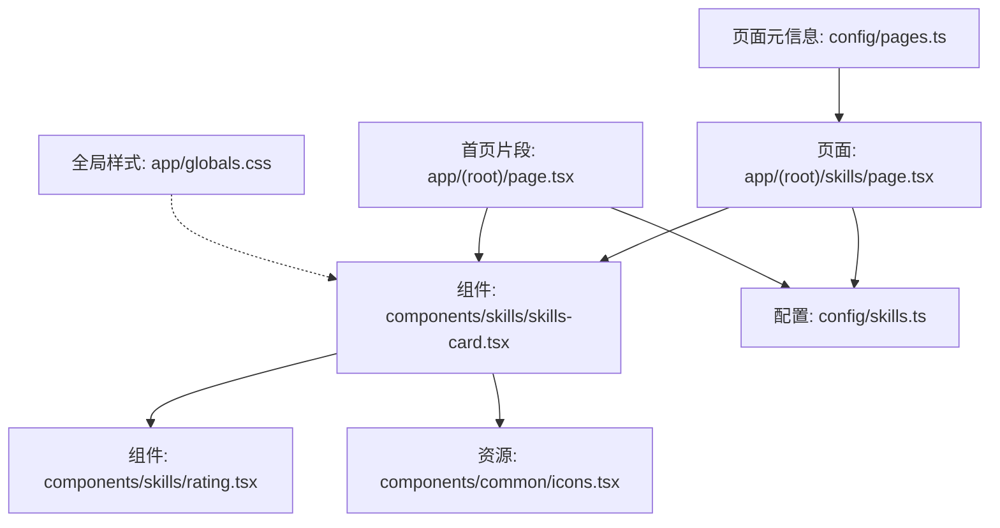
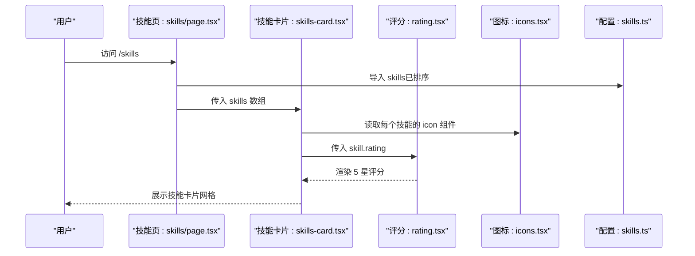
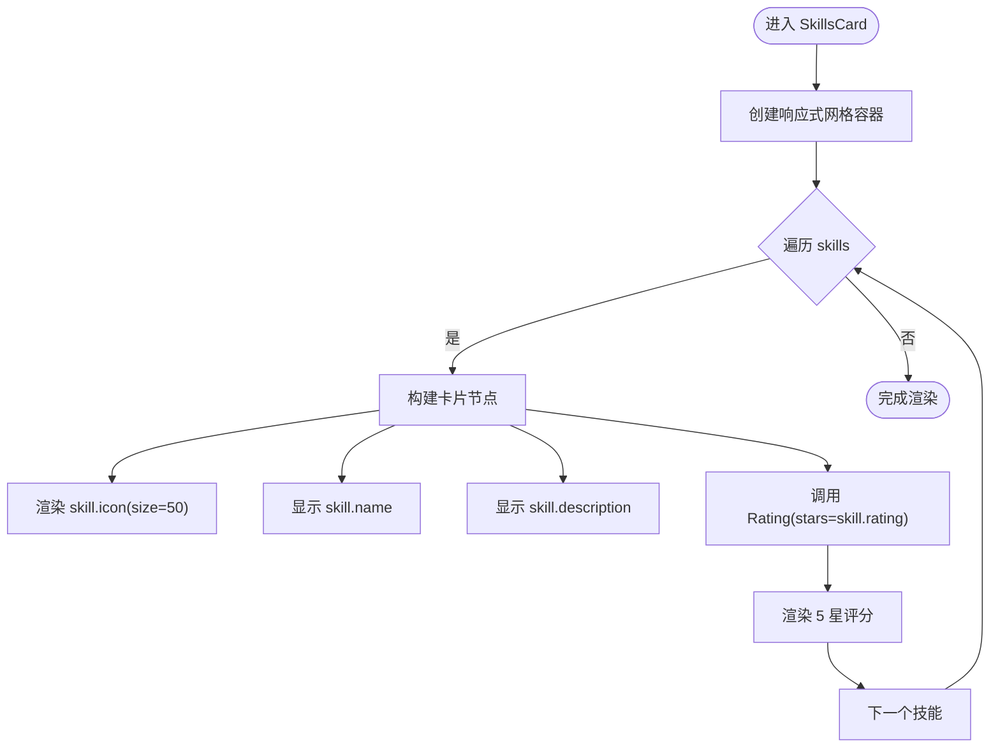
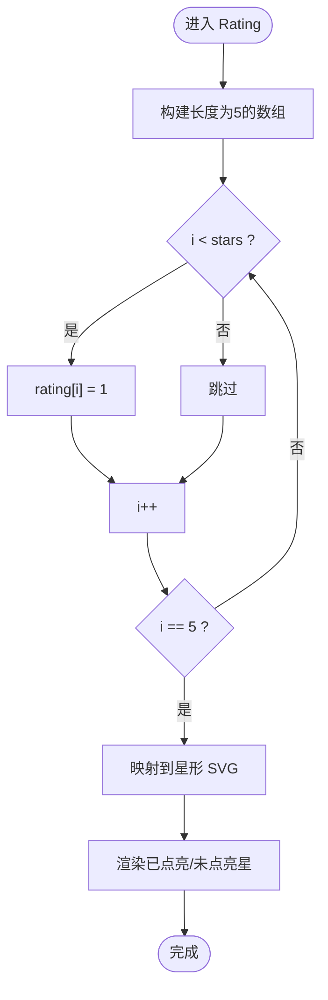
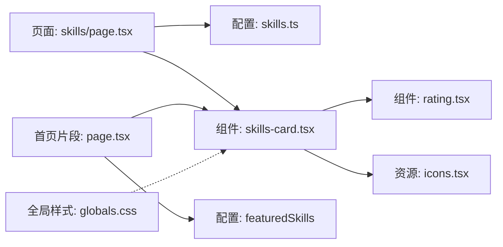

# 技能展示系统

<cite>
**本文引用的文件**
- [config/skills.ts](file://config/skills.ts)
- [components/skills/skills-card.tsx](file://components/skills/skills-card.tsx)
- [components/skills/rating.tsx](file://components/skills/rating.tsx)
- [app/(root)/skills/page.tsx](file://app/(root)/skills/page.tsx)
- [app/(root)/page.tsx](file://app/(root)/page.tsx)
- [components/common/icons.tsx](file://components/common/icons.tsx)
- [config/pages.ts](file://config/pages.ts)
- [app/globals.css](file://app/globals.css)
</cite>

## 目录
1. [简介](#简介)
2. [项目结构](#项目结构)
3. [核心组件](#核心组件)
4. [架构总览](#架构总览)
5. [详细组件分析](#详细组件分析)
6. [依赖关系分析](#依赖关系分析)
7. [性能考量](#性能考量)
8. [故障排查指南](#故障排查指南)
9. [结论](#结论)
10. [附录：配置与扩展示例](#附录：配置与扩展示例)

## 简介
本文件为 Next.js 投资组合中的“技能展示系统”提供完整、深入的技术文档。内容涵盖：
- 技能数据模型设计（Skill 接口）
- 技能卡片组件实现与响应式布局
- 评分组件的可视化效果与动画
- 分类与排序逻辑、Featured 精选技能
- 如何添加新技能、自定义评分样式、扩展展示功能
- 性能优化建议与常见问题排查

## 项目结构
技能展示系统由以下关键部分组成：
- 数据层：技能配置与类型定义，位于配置文件中
- 视图层：技能卡片与评分组件，负责渲染 UI
- 页面层：技能页与首页片段，负责组织内容与导航
- 资源层：图标集合，用于技能图标展示
- 样式层：全局样式与动画过渡

图表来源
- [app/(root)/skills/page.tsx:1-23](file://app/(root)/skills/page.tsx#L1-L23)
- [components/skills/skills-card.tsx:1-31](file://components/skills/skills-card.tsx#L1-L31)
- [components/skills/rating.tsx:1-41](file://components/skills/rating.tsx#L1-L41)
- [config/skills.ts:1-154](file://config/skills.ts#L1-L154)
- [components/common/icons.tsx:90-169](file://components/common/icons.tsx#L90-L169)
- [config/pages.ts:15-31](file://config/pages.ts#L15-L31)
- [app/globals.css:374-525](file://app/globals.css#L374-L525)

章节来源
- [app/(root)/skills/page.tsx:1-23](file://app/(root)/skills/page.tsx#L1-L23)
- [config/skills.ts:1-154](file://config/skills.ts#L1-L154)
- [components/skills/skills-card.tsx:1-31](file://components/skills/skills-card.tsx#L1-L31)
- [components/skills/rating.tsx:1-41](file://components/skills/rating.tsx#L1-L41)
- [components/common/icons.tsx:90-169](file://components/common/icons.tsx#L90-L169)
- [config/pages.ts:15-31](file://config/pages.ts#L15-L31)
- [app/globals.css:374-525](file://app/globals.css#L374-L525)

## 核心组件
- 技能数据模型与配置
  - 定义了技能的统一数据结构，包含名称、描述、等级和图标引用
  - 提供未排序列表、按等级排序后的列表以及精选技能切片
- 技能卡片组件
  - 接收技能数组，使用响应式网格布局渲染卡片
  - 每张卡片包含图标、标题、描述与评分
- 评分组件
  - 根据传入的星级数值渲染 5 颗星，已点亮与未点亮状态分别着色
- 页面集成
  - 技能页直接展示全部技能；首页展示精选技能并引导至全量页面

章节来源
- [config/skills.ts:3-154](file://config/skills.ts#L3-L154)
- [components/skills/skills-card.tsx:4-30](file://components/skills/skills-card.tsx#L4-L30)
- [components/skills/rating.tsx:1-41](file://components/skills/rating.tsx#L1-L41)
- [app/(root)/skills/page.tsx:1-23](file://app/(root)/skills/page.tsx#L1-L23)
- [app/(root)/page.tsx:253-281](file://app/(root)/page.tsx#L253-L281)

## 架构总览
技能展示系统采用“配置驱动 + 组件化渲染”的架构：
- 配置层集中管理技能数据与导出排序结果
- 组件层解耦展示逻辑，复用性强
- 页面层组合组件并注入元信息与导航

图表来源
- [app/(root)/skills/page.tsx:1-23](file://app/(root)/skills/page.tsx#L1-L23)
- [components/skills/skills-card.tsx:1-31](file://components/skills/skills-card.tsx#L1-L31)
- [components/skills/rating.tsx:1-41](file://components/skills/rating.tsx#L1-L41)
- [components/common/icons.tsx:90-169](file://components/common/icons.tsx#L90-L169)
- [config/skills.ts:149-154](file://config/skills.ts#L149-L154)

## 详细组件分析

### 技能数据模型与配置（SkillsInterface）
- 字段定义
  - name：技能名称
  - description：技能描述
  - rating：技能等级（整数，范围通常为 1-5）
  - icon：React 组件类型，用于渲染技能图标
- 数据导出
  - skillsUnsorted：原始技能列表
  - skills：按 rating 降序排序后的列表
  - featuredSkills：前 N 个技能作为精选展示

复杂度分析
- 排序操作时间复杂度 O(n log n)，n 为技能数量
- 切片操作时间复杂度 O(k)，k 为精选数量

章节来源
- [config/skills.ts:3-8](file://config/skills.ts#L3-L8)
- [config/skills.ts:10-147](file://config/skills.ts#L10-L147)
- [config/skills.ts:149-154](file://config/skills.ts#L149-L154)

### 技能卡片组件（SkillsCard）
- 输入属性
  - skills：SkillsInterface 数组
- 布局与交互
  - 使用响应式网格：移动端单列，平板双列，桌面三列
  - 固定高度容器，保证卡片对齐一致
  - 每张卡片包含图标、标题、描述与评分
- 可访问性
  - 通过 aria-hidden 控制辅助元素的可访问性

图表来源
- [components/skills/skills-card.tsx:8-30](file://components/skills/skills-card.tsx#L8-L30)
- [components/skills/rating.tsx:5-40](file://components/skills/rating.tsx#L5-L40)

章节来源
- [components/skills/skills-card.tsx:4-30](file://components/skills/skills-card.tsx#L4-L30)

### 评分组件（Rating）
- 输入属性
  - stars：当前技能等级（整数）
- 渲染逻辑
  - 生成长度为 5 的数组，将前 stars 项标记为已点亮
  - 已点亮星使用高亮色，未点亮星使用中性色
- 视觉效果
  - 无额外动画，保持轻量与稳定
  - 可通过主题变量或 Tailwind 类名调整颜色

图表来源
- [components/skills/rating.tsx:5-40](file://components/skills/rating.tsx#L5-L40)

章节来源
- [components/skills/rating.tsx:1-41](file://components/skills/rating.tsx#L1-L41)

### 页面集成与导航
- 技能页
  - 设置页面元信息（标题、描述）
  - 使用 PageContainer 包裹内容
  - 传入全部 skills 进行展示
- 首页片段
  - 展示精选技能（featuredSkills）
  - 提供“查看全部”按钮跳转到 /skills

章节来源
- [app/(root)/skills/page.tsx:1-23](file://app/(root)/skills/page.tsx#L1-L23)
- [app/(root)/page.tsx:253-281](file://app/(root)/page.tsx#L253-L281)
- [config/pages.ts:15-31](file://config/pages.ts#L15-L31)

### 图标资源
- 图标集合统一管理，技能通过引用图标组件来显示
- 支持多种技术栈图标（Java、Spring、MySQL、Redis、Kafka 等）

章节来源
- [components/common/icons.tsx:90-169](file://components/common/icons.tsx#L90-L169)

## 依赖关系分析
- 页面依赖
  - 技能页依赖配置中的 skills 与页面元信息
  - 首页片段依赖 featuredSkills 与页面元信息
- 组件依赖
  - 技能卡片依赖评分组件与图标资源
  - 评分组件无外部依赖，仅基于 props 渲染
- 样式依赖
  - 全局样式提供卡片悬停与内容渐显效果（适用于通用卡片场景）

图表来源
- [app/(root)/skills/page.tsx:1-23](file://app/(root)/skills/page.tsx#L1-L23)
- [components/skills/skills-card.tsx:1-31](file://components/skills/skills-card.tsx#L1-L31)
- [components/skills/rating.tsx:1-41](file://components/skills/rating.tsx#L1-L41)
- [components/common/icons.tsx:90-169](file://components/common/icons.tsx#L90-L169)
- [app/(root)/page.tsx:253-281](file://app/(root)/page.tsx#L253-L281)
- [app/globals.css:374-525](file://app/globals.css#L374-L525)

章节来源
- [app/(root)/skills/page.tsx:1-23](file://app/(root)/skills/page.tsx#L1-L23)
- [components/skills/skills-card.tsx:1-31](file://components/skills/skills-card.tsx#L1-L31)
- [components/skills/rating.tsx:1-41](file://components/skills/rating.tsx#L1-L41)
- [components/common/icons.tsx:90-169](file://components/common/icons.tsx#L90-L169)
- [app/(root)/page.tsx:253-281](file://app/(root)/page.tsx#L253-L281)
- [app/globals.css:374-525](file://app/globals.css#L374-L525)

## 性能考量
- 数据层面
  - 排序在模块加载时执行一次，避免重复计算
  - 精选技能使用切片，减少首屏渲染压力
- 渲染层面
  - 评分组件使用简单数组映射，无复杂状态与副作用
  - 卡片使用静态尺寸与网格布局，减少重排
- 样式层面
  - 悬停与内容渐显使用 CSS 过渡，GPU 友好
  - 避免过度动画，确保低端设备流畅度

[本节为通用性能指导，不直接分析具体代码文件]

## 故障排查指南
- 评分显示异常
  - 检查传入的 stars 是否为有效数字且在合理范围内
  - 确认评分组件是否正确渲染 5 颗星
- 图标不显示
  - 确认技能配置中引用的图标是否存在于图标集合
  - 检查图标组件是否被正确导入与导出
- 布局错乱
  - 检查响应式网格类名是否正确应用
  - 确认卡片容器高度与间距设置是否符合预期
- 页面元信息缺失
  - 确认页面元信息来自页面配置且键名匹配

章节来源
- [components/skills/rating.tsx:5-40](file://components/skills/rating.tsx#L5-L40)
- [components/common/icons.tsx:90-169](file://components/common/icons.tsx#L90-L169)
- [components/skills/skills-card.tsx:8-30](file://components/skills/skills-card.tsx#L8-L30)
- [config/pages.ts:15-31](file://config/pages.ts#L15-L31)

## 结论
该技能展示系统以配置为中心、组件化为手段，实现了清晰的数据流与可扩展的展示能力。通过统一的 Skill 接口、响应式卡片布局与简洁的评分组件，既保证了开发效率，也兼顾了用户体验与性能。后续可按需扩展分类、筛选、搜索与动画效果。

[本节为总结性内容，不直接分析具体代码文件]

## 附录：配置与扩展示例

### 添加新技能
- 步骤
  - 在技能配置中添加新的技能对象，包含 name、description、rating 与 icon
  - 如需加入精选，调整精选切片数量或顺序
- 参考路径
  - [config/skills.ts:10-147](file://config/skills.ts#L10-L147)
  - [config/skills.ts:149-154](file://config/skills.ts#L149-L154)

### 自定义评分样式
- 方式
  - 修改评分组件中已点亮与未点亮星的类名或颜色
  - 可引入主题变量或 Tailwind 类名进行适配
- 参考路径
  - [components/skills/rating.tsx:11-38](file://components/skills/rating.tsx#L11-L38)

### 扩展技能展示功能
- 分类与筛选
  - 在配置中增加 category 字段，并在卡片组件中实现分组与过滤
- 动画增强
  - 结合全局样式与动画库，为卡片或评分添加入场与交互动画
- 参考路径
  - [components/skills/skills-card.tsx:8-30](file://components/skills/skills-card.tsx#L8-L30)
  - [app/globals.css:374-525](file://app/globals.css#L374-L525)

### 首页与技能页的使用
- 首页展示精选技能并提供跳转
- 技能页展示全部技能
- 参考路径
  - [app/(root)/page.tsx:253-281](file://app/(root)/page.tsx#L253-L281)
  - [app/(root)/skills/page.tsx:1-23](file://app/(root)/skills/page.tsx#L1-L23)