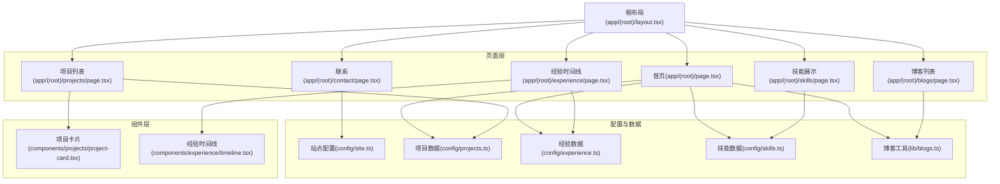
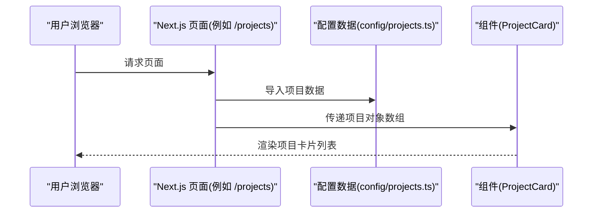
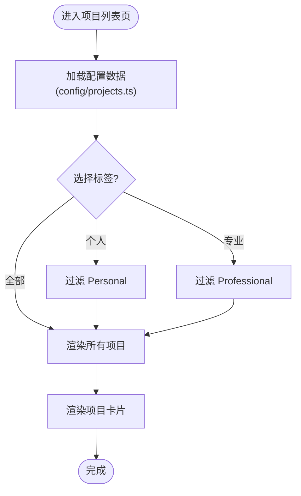
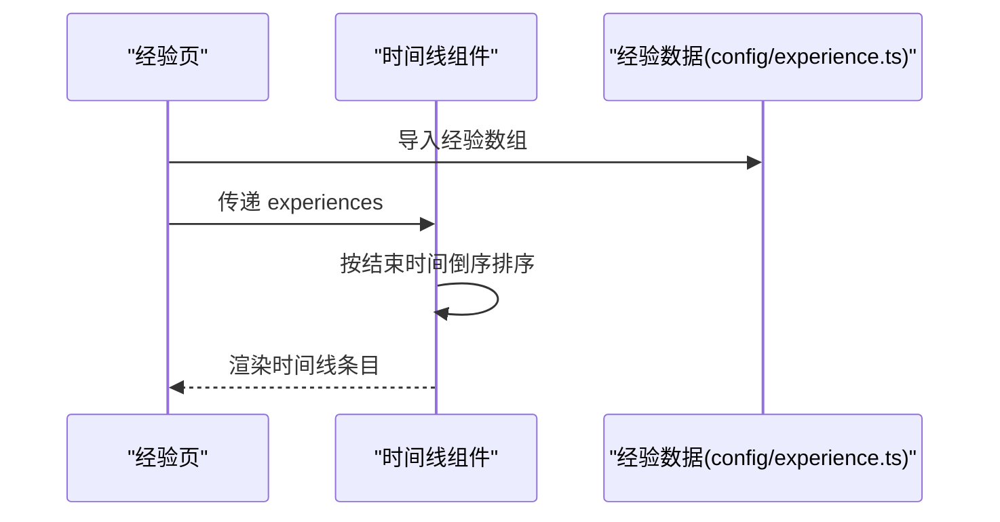
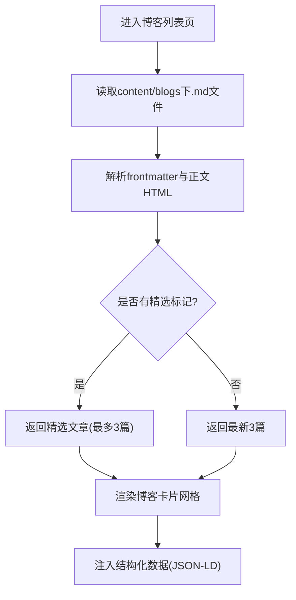
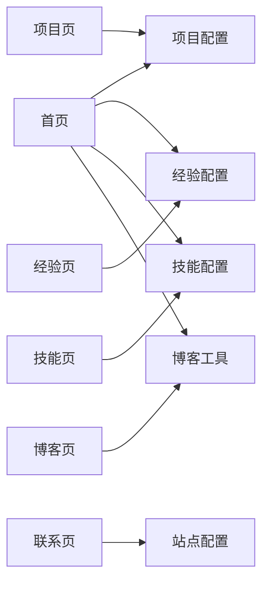

# 核心功能模块

<cite>
**本文引用的文件**
- [README.md](file://README.md)
- [package.json](file://package.json)
- [app/(root)/layout.tsx](file://app/(root)/layout.tsx)
- [app/(root)/page.tsx](file://app/(root)/page.tsx)
- [app/(root)/projects/page.tsx](file://app/(root)/projects/page.tsx)
- [app/(root)/experience/page.tsx](file://app/(root)/experience/page.tsx)
- [app/(root)/skills/page.tsx](file://app/(root)/skills/page.tsx)
- [app/(root)/blogs/page.tsx](file://app/(root)/blogs/page.tsx)
- [app/(root)/contact/page.tsx](file://app/(root)/contact/page.tsx)
- [config/site.ts](file://config/site.ts)
- [config/projects.ts](file://config/projects.ts)
- [config/experience.ts](file://config/experience.ts)
- [config/skills.ts](file://config/skills.ts)
- [lib/blogs.ts](file://lib/blogs.ts)
- [components/projects/project-card.tsx](file://components/projects/project-card.tsx)
- [components/experience/timeline.tsx](file://components/experience/timeline.tsx)
</cite>

## 目录
1. [简介](#简介)
2. [项目结构](#项目结构)
3. [核心组件](#核心组件)
4. [架构总览](#架构总览)
5. [详细组件分析](#详细组件分析)
6. [依赖关系分析](#依赖关系分析)
7. [性能考量](#性能考量)
8. [故障排查指南](#故障排查指南)
9. [结论](#结论)
10. [附录](#附录)

## 简介
本文件面向 Next.js 投资组合项目的“核心功能模块”，聚焦以下能力：项目展示、经验时间线、技能展示、博客系统、联系表单。文档从数据结构、组件实现、配置与扩展方式入手，解释各模块之间的交互和数据流转，并提供最佳实践与定制指导，既适合初学者理解概念，也为高级开发者提供深入技术细节。

## 项目结构
本项目采用 Next.js App Router 组织页面与路由，数据通过集中式配置文件与本地 Markdown 内容管理，UI 由可复用组件构成，并通过布局组件统一导航、主题切换与页脚。

图表来源
- [app/(root)/layout.tsx:1-33](file://app/(root)/layout.tsx#L1-L33)
- [app/(root)/page.tsx:1-357](file://app/(root)/page.tsx#L1-L357)
- [app/(root)/projects/page.tsx:1-59](file://app/(root)/projects/page.tsx#L1-L59)
- [app/(root)/experience/page.tsx:1-34](file://app/(root)/experience/page.tsx#L1-L34)
- [app/(root)/skills/page.tsx:1-23](file://app/(root)/skills/page.tsx#L1-L23)
- [app/(root)/blogs/page.tsx:1-153](file://app/(root)/blogs/page.tsx#L1-L153)
- [app/(root)/contact/page.tsx:1-30](file://app/(root)/contact/page.tsx#L1-L30)
- [config/site.ts:1-41](file://config/site.ts#L1-L41)
- [config/projects.ts:1-596](file://config/projects.ts#L1-L596)
- [config/experience.ts:1-93](file://config/experience.ts#L1-L93)
- [config/skills.ts:1-166](file://config/skills.ts#L1-L166)
- [lib/blogs.ts:1-97](file://lib/blogs.ts#L1-L97)
- [components/projects/project-card.tsx:1-51](file://components/projects/project-card.tsx#L1-L51)
- [components/experience/timeline.tsx:1-117](file://components/experience/timeline.tsx#L1-L117)

章节来源
- [app/(root)/layout.tsx:1-33](file://app/(root)/layout.tsx#L1-L33)
- [app/(root)/page.tsx:1-357](file://app/(root)/page.tsx#L1-L357)

## 核心组件
- 项目卡片：接收项目数据对象，渲染封面图、标题、摘要、分类标签与“阅读更多”按钮，并链接到详情页。
- 经验时间线：接收经验数组，按结束时间倒序排序，渲染公司 Logo、职位、时间段、地点、简介与详情入口。
- 博客工具：读取 content/blogs 下的 Markdown 文件，解析 frontmatter 与正文 HTML，支持获取全部元信息、精选文章与阅读时长估算。
- 站点配置：集中维护站点名称、作者、社交链接、SEO 关键词等全局信息。
- 项目/经验/技能配置：以 TypeScript 接口定义的数据结构，作为页面与组件的数据源。

章节来源
- [components/projects/project-card.tsx:1-51](file://components/projects/project-card.tsx#L1-L51)
- [components/experience/timeline.tsx:1-117](file://components/experience/timeline.tsx#L1-L117)
- [lib/blogs.ts:1-97](file://lib/blogs.ts#L1-L97)
- [config/site.ts:1-41](file://config/site.ts#L1-L41)
- [config/projects.ts:1-596](file://config/projects.ts#L1-L596)
- [config/experience.ts:1-93](file://config/experience.ts#L1-L93)
- [config/skills.ts:1-166](file://config/skills.ts#L1-L166)

## 架构总览
整体采用“配置驱动 + 组件渲染”的架构：
- 数据层：config/* 与 lib/blogs.ts 提供结构化数据与内容解析。
- 页面层：app/(root)/* 负责路由、元信息与 SEO 结构化数据注入。
- 组件层：通用 UI 与业务组件（如项目卡片、时间线）负责呈现。
- 布局层：统一导航、主题切换、页脚与容器布局。

图表来源
- [app/(root)/projects/page.tsx:1-59](file://app/(root)/projects/page.tsx#L1-L59)
- [config/projects.ts:1-596](file://config/projects.ts#L1-L596)
- [components/projects/project-card.tsx:1-51](file://components/projects/project-card.tsx#L1-L51)

## 详细组件分析

### 项目展示模块
- 数据模型
  - 项目对象包含标识、类型、公司名、分类、短描述、网站/GitHub 链接、技术栈、起止时间、Logo、详细描述段落与要点、多页信息数组等。
  - 导出精选项目用于首页展示。
- 页面实现
  - 项目列表页使用响应式标签切换“全部/个人/专业”三类项目，渲染项目卡片网格。
  - 首页嵌入精选项目卡片，并提供“查看全部”跳转。
- 组件实现
  - 项目卡片接收单个项目对象，渲染图片、标题、摘要、分类标签与“阅读更多”按钮，并根据类型显示不同图标。
- 配置与扩展
  - 在配置文件中新增项目条目即可自动出现在列表与筛选中；可通过调整 type/category 控制展示逻辑。
- 最佳实践
  - 保持 shortDescription 简洁有力；techStack 使用统一命名以便后续过滤或标签化；为每个项目提供高质量封面图以提升视觉吸引力。

图表来源
- [app/(root)/projects/page.tsx:14-29](file://app/(root)/projects/page.tsx#L14-L29)
- [config/projects.ts:30-596](file://config/projects.ts#L30-L596)
- [components/projects/project-card.tsx:13-50](file://components/projects/project-card.tsx#L13-L50)

章节来源
- [app/(root)/projects/page.tsx:1-59](file://app/(root)/projects/page.tsx#L1-L59)
- [config/projects.ts:1-596](file://config/projects.ts#L1-L596)
- [components/projects/project-card.tsx:1-51](file://components/projects/project-card.tsx#L1-L51)

### 经验时间线模块
- 数据模型
  - 经验对象包含标识、职位、公司、地点、起止时间、描述数组、成就数组、技能列表、公司链接与 Logo。
- 页面实现
  - 经验页将经验数组传入时间线组件进行渲染。
- 组件实现
  - 时间线组件对经验按结束时间倒序排序，计算时间段文本，渲染公司 Logo、职位、时间段、地点、首条描述与详情入口。
- 配置与扩展
  - 在配置文件中添加新经验条目；若当前在职可将结束时间设为字符串表示“至今”。
- 最佳实践
  - 描述数组建议包含职责与成果；成就数组突出量化结果；技能列表与所用技术保持一致，便于后续筛选或标签化。

图表来源
- [app/(root)/experience/page.tsx:24-31](file://app/(root)/experience/page.tsx#L24-L31)
- [config/experience.ts:17-93](file://config/experience.ts#L17-L93)
- [components/experience/timeline.tsx:32-113](file://components/experience/timeline.tsx#L32-L113)

章节来源
- [app/(root)/experience/page.tsx:1-34](file://app/(root)/experience/page.tsx#L1-L34)
- [config/experience.ts:1-93](file://config/experience.ts#L1-L93)
- [components/experience/timeline.tsx:1-117](file://components/experience/timeline.tsx#L1-L117)

### 技能展示模块
- 数据模型
  - 技能对象包含名称、描述、评分与图标引用。
- 页面实现
  - 技能页接收完整技能列表并渲染。
- 组件实现
  - 技能卡片根据评分与图标展示技能等级与说明。
- 配置与扩展
  - 在配置文件中新增技能项；可通过调整 rating 影响排序与展示。
- 最佳实践
  - 描述应简明扼要；图标需与技能匹配；评分建议采用统一量表（如 1-5）。

章节来源
- [app/(root)/skills/page.tsx:1-23](file://app/(root)/skills/page.tsx#L1-L23)
- [config/skills.ts:1-166](file://config/skills.ts#L1-L166)

### 博客系统模块
- 数据模型
  - 博客元信息包含标题、日期、描述、标签、封面图、阅读时长、是否精选；全文包含解析后的 HTML。
- 数据读取
  - 工具函数读取 content/blogs 下的 Markdown 文件，解析 frontmatter 与正文，支持获取全部元信息、精选文章与阅读时长估算。
- 页面实现
  - 博客列表页调用工具函数获取元信息，渲染卡片网格，并注入集合页与面包屑的结构化数据。
- 扩展与定制
  - 新增 Markdown 文件即自动纳入列表；通过 frontmatter 的 featured 字段控制精选展示；可在工具函数中自定义阅读时长算法或过滤规则。
- 最佳实践
  - 为每篇文章提供清晰的标题、描述与标签；封面图尺寸一致；合理使用 GFM 语法提升可读性。

图表来源
- [lib/blogs.ts:35-89](file://lib/blogs.ts#L35-L89)
- [app/(root)/blogs/page.tsx:41-150](file://app/(root)/blogs/page.tsx#L41-L150)

章节来源
- [lib/blogs.ts:1-97](file://lib/blogs.ts#L1-L97)
- [app/(root)/blogs/page.tsx:1-153](file://app/(root)/blogs/page.tsx#L1-L153)

### 联系表单模块
- 页面实现
  - 联系页包含表单与 GitHub 重定向卡片两部分，布局为左右分栏。
- 数据与集成点
  - 表单组件负责前端校验与提交；后端 API 路由位于 app/api/contact/route.ts（未在本文档展开），用于处理消息投递。
- 配置与扩展
  - 可在表单组件中接入第三方服务（如邮件服务、表单后端）；GitHub 重定向卡片可替换为其他社交平台入口。
- 最佳实践
  - 确保表单具备输入校验与错误提示；提交后给予明确反馈；保护隐私与敏感信息。

章节来源
- [app/(root)/contact/page.tsx:1-30](file://app/(root)/contact/page.tsx#L1-L30)

## 依赖关系分析
- 页面与配置
  - 首页聚合项目、经验、技能、博客与联系入口，分别依赖对应配置与工具。
  - 项目/经验/技能页直接导入各自配置数据。
- 组件与数据
  - 项目卡片依赖项目数据接口；时间线组件依赖经验数据接口。
- 博客工具
  - 博客列表与首页均依赖博客工具函数进行内容读取与解析。
- 站点配置
  - 全站多处引用站点配置，用于 SEO、元信息与社交链接。

图表来源
- [app/(root)/page.tsx:18-24](file://app/(root)/page.tsx#L18-L24)
- [app/(root)/projects/page.tsx:6-7](file://app/(root)/projects/page.tsx#L6-L7)
- [app/(root)/experience/page.tsx:5-7](file://app/(root)/experience/page.tsx#L5-L7)
- [app/(root)/skills/page.tsx:5-6](file://app/(root)/skills/page.tsx#L5-L6)
- [app/(root)/blogs/page.tsx:7-9](file://app/(root)/blogs/page.tsx#L7-L9)
- [app/(root)/contact/page.tsx:6-6](file://app/(root)/contact/page.tsx#L6-L6)
- [config/site.ts:1-41](file://config/site.ts#L1-L41)

章节来源
- [app/(root)/page.tsx:18-24](file://app/(root)/page.tsx#L18-L24)
- [app/(root)/projects/page.tsx:6-7](file://app/(root)/projects/page.tsx#L6-L7)
- [app/(root)/experience/page.tsx:5-7](file://app/(root)/experience/page.tsx#L5-L7)
- [app/(root)/skills/page.tsx:5-6](file://app/(root)/skills/page.tsx#L5-L6)
- [app/(root)/blogs/page.tsx:7-9](file://app/(root)/blogs/page.tsx#L7-L9)
- [config/site.ts:1-41](file://config/site.ts#L1-L41)

## 性能考量
- 构建与运行时
  - 使用 Next.js 16、React 19、TypeScript 与 Tailwind CSS，配合 Motion 动画与 shadcn/ui 组件，兼顾性能与可访问性。
- 内容优化
  - 博客内容通过静态读取与解析，减少运行时开销；列表页仅渲染元信息，详情页按需加载。
- 资源优化
  - 图片使用 Next Image 优化；结构化数据与元信息提升 SEO 与分享效果。
- 可维护性
  - 配置集中化管理，便于扩展与主题定制；组件粒度清晰，利于复用与测试。

[本节为通用性能讨论，不直接分析具体文件]

## 故障排查指南
- 博客列表为空
  - 检查 content/blogs 目录下是否存在 .md 文件；确认文件名与 slug 一致；验证 frontmatter 字段是否齐全。
- 项目/经验/技能未显示
  - 检查对应配置文件中的数组是否包含有效数据；确认页面是否正确导入并传递数据至组件。
- 时间线排序异常
  - 确认经验对象的结束时间格式正确；当前在职时使用字符串表示“至今”。
- 样式或主题问题
  - 检查主题切换组件与 Tailwind 配置；确保全局样式已引入。
- 表单提交无反馈
  - 检查表单组件的校验逻辑与提交回调；确认后端 API 路由可用且返回正确状态码。

章节来源
- [lib/blogs.ts:29-42](file://lib/blogs.ts#L29-L42)
- [components/experience/timeline.tsx:32-38](file://components/experience/timeline.tsx#L32-L38)
- [app/(root)/blogs/page.tsx:125-134](file://app/(root)/blogs/page.tsx#L125-L134)

## 结论
本项目通过“配置驱动 + 组件渲染”的架构，实现了项目展示、经验时间线、技能展示、博客系统与联系表单等核心功能。各模块职责清晰、数据流可控、扩展性强。遵循本文的最佳实践与定制指导，可快速搭建个性化投资组合网站，并在性能、SEO 与可维护性方面达到较高水准。

[本节为总结性内容，不直接分析具体文件]

## 附录
- 技术栈概览
  - 框架与语言：Next.js 16、React 19、TypeScript
  - 样式与 UI：Tailwind CSS、shadcn/ui、Motion
  - 表单与校验：react-hook-form、zod
  - 内容处理：gray-matter、remark、remark-gfm、remark-html
  - 分析与部署：Google Analytics、Vercel Analytics、Vercel 部署
- 快速开始
  - 克隆仓库、安装依赖、启动开发服务器、访问本地端口查看效果。
- 自定义指引
  - 站点信息：编辑站点配置
  - 技能/项目/经验：编辑对应配置文件
  - 博客：在 content/blogs 新增 Markdown 文件并设置 frontmatter

章节来源
- [package.json:1-73](file://package.json#L1-L73)
- [README.md:32-92](file://README.md#L32-L92)