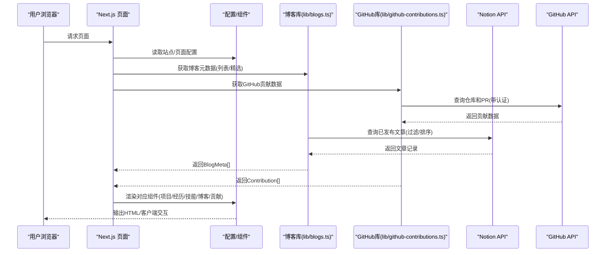
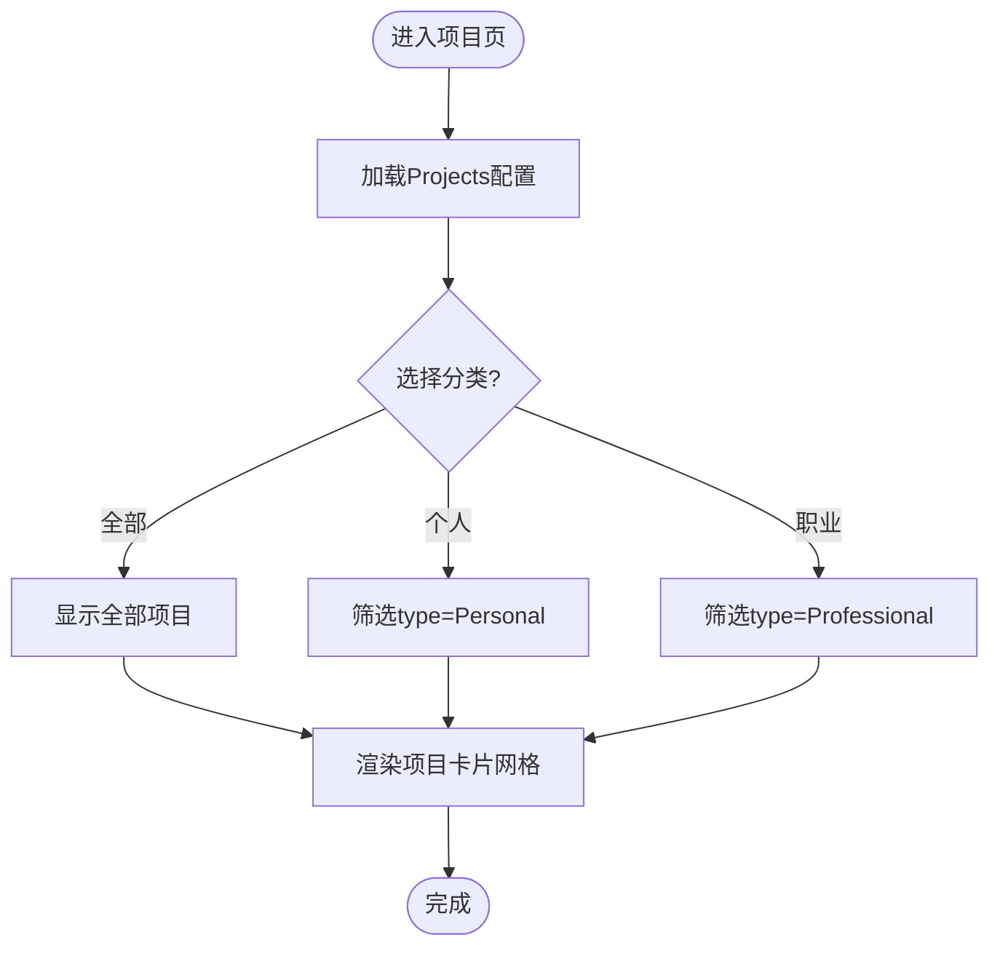
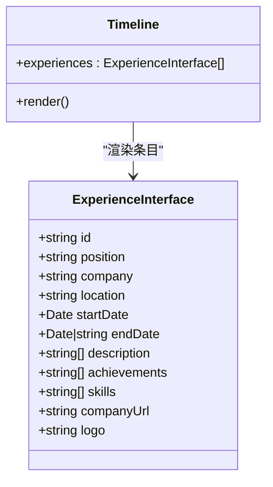
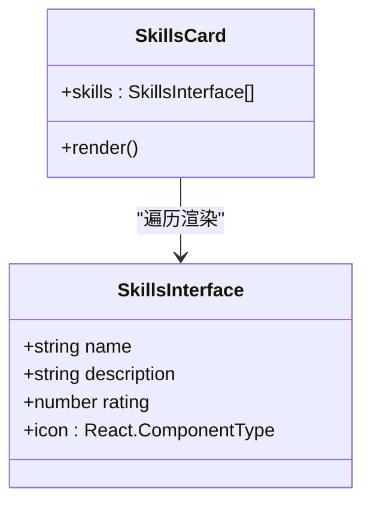
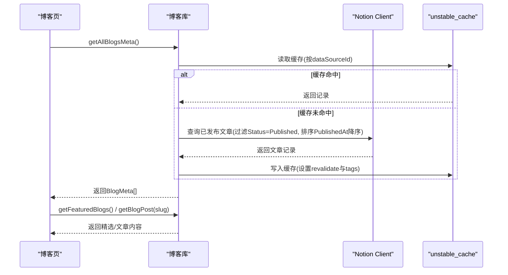
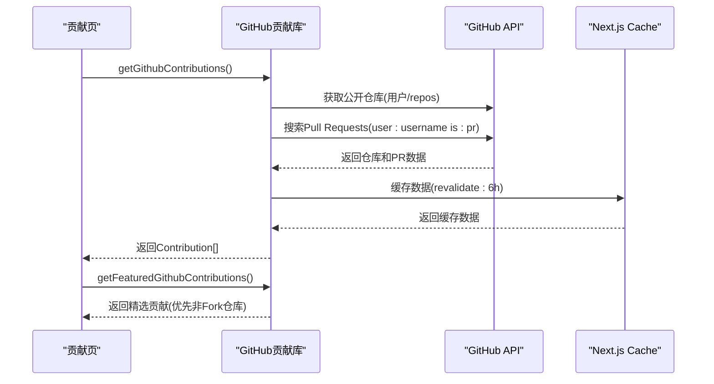
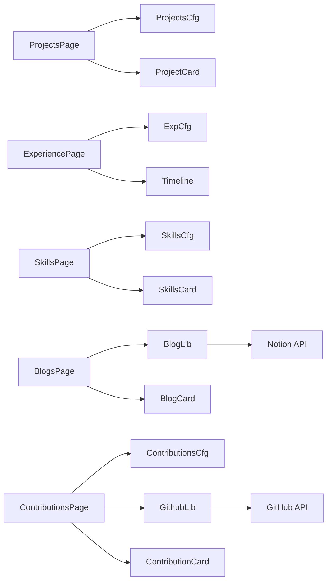

# 核心功能模块

<cite>
**本文引用的文件**
- [app/(root)/page.tsx](file://app/(root)/page.tsx)
- [app/(root)/projects/page.tsx](file://app/(root)/projects/page.tsx)
- [app/(root)/experience/page.tsx](file://app/(root)/experience/page.tsx)
- [app/(root)/skills/page.tsx](file://app/(root)/skills/page.tsx)
- [app/(root)/blogs/page.tsx](file://app/(root)/blogs/page.tsx)
- [app/(root)/contributions/page.tsx](file://app/(root)/contributions/page.tsx)
- [config/site.ts](file://config/site.ts)
- [config/projects.ts](file://config/projects.ts)
- [config/experience.ts](file://config/experience.ts)
- [config/skills.ts](file://config/skills.ts)
- [config/pages.ts](file://config/pages.ts)
- [config/contributions.ts](file://config/contributions.ts)
- [lib/blogs.ts](file://lib/blogs.ts)
- [lib/github-contributions.ts](file://lib/github-contributions.ts)
- [components/projects/project-card.tsx](file://components/projects/project-card.tsx)
- [components/experience/timeline.tsx](file://components/experience/timeline.tsx)
- [components/skills/skills-card.tsx](file://components/skills/skills-card.tsx)
- [components/blogs/blog-card.tsx](file://components/blogs/blog-card.tsx)
- [components/contributions/contribution-card.tsx](file://components/contributions/contribution-card.tsx)
- [components/forms/contact-form.tsx](file://components/forms/contact-form.tsx)
</cite>

## 更新摘要
**所做更改**
- 新增GitHub贡献同步功能模块，支持动态获取仓库和Pull Request数据
- 更新了首页聚合展示，集成GitHub贡献数据
- 添加了新的配置类型和数据模型定义
- 增强了项目的实时数据集成能力

## 目录
1. [简介](#简介)
2. [项目结构](#项目结构)
3. [核心组件](#核心组件)
4. [架构总览](#架构总览)
5. [详细组件分析](#详细组件分析)
6. [依赖关系分析](#依赖关系分析)
7. [性能考虑](#性能考虑)
8. [故障排查指南](#故障排查指南)
9. [结论](#结论)
10. [附录：配置与扩展](#附录：配置与扩展)

## 简介
本文件面向开发者，系统化梳理 Next.js 投资组合的核心功能模块：项目展示、工作经历时间线、技能展示、博客系统以及新增的GitHub贡献同步功能。文档从数据模型、组件结构与业务逻辑出发，解释各模块如何协作完成内容渲染、筛选与展示；并提供配置选项说明、自定义方法与扩展指南，帮助快速理解与定制。

## 项目结构
本项目采用 Next.js App Router 组织页面与路由，核心入口位于 app/(root) 下的页面组件；配置集中在 config 目录，按模块拆分（站点信息、项目、经历、技能、页面文案等）；通用 UI 与业务组件位于 components；博客数据通过 lib/blogs.ts 拉取并缓存，GitHub贡献数据通过 lib/github-contributions.ts 动态获取。

```mermaid
graph TB
subgraph "页面层"
Home["首页 page.tsx"]
ProjectsPage["项目页 projects/page.tsx"]
ExperiencePage["经历页 experience/page.tsx"]
SkillsPage["技能页 skills/page.tsx"]
BlogsPage["博客页 blogs/page.tsx"]
ContributionsPage["贡献页 contributions/page.tsx"]
end
subgraph "配置层"
SiteCfg["site.ts"]
PagesCfg["pages.ts"]
ProjectsCfg["projects.ts"]
ExpCfg["experience.ts"]
SkillsCfg["skills.ts"]
ContributionsCfg["contributions.ts"]
end
subgraph "数据层"
BlogLib["lib/blogs.ts"]
GithubLib["lib/github-contributions.ts"]
end
subgraph "组件层"
ProjectCard["project-card.tsx"]
Timeline["timeline.tsx"]
SkillsCard["skills-card.tsx"]
BlogCard["blog-card.tsx"]
ContributionCard["contribution-card.tsx"]
end
Home --> ProjectsCfg
Home --> ExpCfg
Home --> SkillsCfg
Home --> BlogLib
Home --> GithubLib
ProjectsPage --> ProjectsCfg
ExperiencePage --> ExpCfg
SkillsPage --> SkillsCfg
BlogsPage --> BlogLib
ContributionsPage --> ContributionsCfg
ContributionsPage --> GithubLib
ProjectsPage --> ProjectCard
ExperiencePage --> Timeline
SkillsPage --> SkillsCard
BlogsPage --> BlogCard
ContributionsPage --> ContributionCard
Home --> SiteCfg
Home --> PagesCfg
ProjectsPage --> PagesCfg
ExperiencePage --> PagesCfg
SkillsPage --> PagesCfg
BlogsPage --> PagesCfg
ContributionsPage --> PagesCfg
```

**图表来源**
- [app/(root)/page.tsx:36-351](file://app/(root)/page.tsx#L36-L351)
- [app/(root)/projects/page.tsx:14-56](file://app/(root)/projects/page.tsx#L14-L56)
- [app/(root)/experience/page.tsx:24-31](file://app/(root)/experience/page.tsx#L24-L31)
- [app/(root)/skills/page.tsx:13-20](file://app/(root)/skills/page.tsx#L13-L20)
- [app/(root)/blogs/page.tsx:42-149](file://app/(root)/blogs/page.tsx#L42-L149)
- [app/(root)/contributions/page.tsx:13-24](file://app/(root)/contributions/page.tsx#L13-L24)
- [config/site.ts:1-39](file://config/site.ts#L1-L39)
- [config/pages.ts:15-81](file://config/pages.ts#L15-L81)
- [config/projects.ts:50-422](file://config/projects.ts#L50-L422)
- [config/experience.ts:17-69](file://config/experience.ts#L17-L69)
- [config/skills.ts:10-154](file://config/skills.ts#L10-L154)
- [config/contributions.ts:1-35](file://config/contributions.ts#L1-L35)
- [lib/blogs.ts:492-536](file://lib/blogs.ts#L492-L536)
- [lib/github-contributions.ts:178-228](file://lib/github-contributions.ts#L178-L228)
- [components/projects/project-card.tsx:13-50](file://components/projects/project-card.tsx#L13-L50)
- [components/experience/timeline.tsx:15-96](file://components/experience/timeline.tsx#L15-L96)
- [components/skills/skills-card.tsx:8-29](file://components/skills/skills-card.tsx#L8-L29)
- [components/blogs/blog-card.tsx:13-95](file://components/blogs/blog-card.tsx#L13-L95)
- [components/contributions/contribution-card.tsx:16-98](file://components/contributions/contribution-card.tsx#L16-L98)

章节来源
- [app/(root)/page.tsx:36-351](file://app/(root)/page.tsx#L36-L351)
- [config/site.ts:1-39](file://config/site.ts#L1-L39)
- [config/pages.ts:15-81](file://config/pages.ts#L15-L81)

## 核心组件
- 项目卡片：接收项目配置对象，渲染封面图、标题、描述、分类标签与"查看详情"链接。
- 经历时间线：对经历按结束时间倒序排序，展示公司 Logo、职位、时长、地点与摘要，并提供详情跳转。
- 技能卡片：展示技能图标、名称、描述与星级评分。
- 博客卡片：展示封面图、标签、标题、摘要、发布日期与阅读时长，支持首图优先加载优化。
- **新增** GitHub贡献卡片：展示仓库或Pull Request信息，包括状态标签、Star数、编程语言等元数据。

章节来源
- [components/projects/project-card.tsx:13-50](file://components/projects/project-card.tsx#L13-L50)
- [components/experience/timeline.tsx:15-96](file://components/experience/timeline.tsx#L15-L96)
- [components/skills/skills-card.tsx:8-29](file://components/skills/skills-card.tsx#L8-L29)
- [components/blogs/blog-card.tsx:13-95](file://components/blogs/blog-card.tsx#L13-L95)
- [components/contributions/contribution-card.tsx:16-98](file://components/contributions/contribution-card.tsx#L16-L98)

## 架构总览
- 数据源
  - 项目、经历、技能：TypeScript 配置文件集中管理，类型化强约束，便于维护与复用。
  - 博客：通过 Notion Data Source 查询已发布文章，使用 Next.js unstable_cache 进行服务端缓存，并按标签刷新。
  - **新增** GitHub贡献：通过 GitHub API 动态获取公开仓库和Pull Request，支持认证令牌和缓存策略。
- 页面层
  - 首页聚合展示精选项目、经历、贡献、技能与博客，并注入结构化数据（Person、SoftwareApplication）。
  - 列表页提供筛选与分页/分组展示（如项目按个人/职业分类）。
- 组件层
  - 通用 UI 与业务组件解耦，页面仅负责编排与数据传递。
- SEO 与可访问性
  - 统一站点元信息、Open Graph/Twitter 卡片、JSON-LD 结构化数据、canonical 与 sitemap。

**图表来源**
- [app/(root)/page.tsx:36-351](file://app/(root)/page.tsx#L36-L351)
- [app/(root)/blogs/page.tsx:42-149](file://app/(root)/blogs/page.tsx#L42-L149)
- [app/(root)/contributions/page.tsx:13-24](file://app/(root)/contributions/page.tsx#L13-L24)
- [lib/blogs.ts:337-420](file://lib/blogs.ts#L337-L420)
- [lib/blogs.ts:492-536](file://lib/blogs.ts#L492-L536)
- [lib/github-contributions.ts:178-228](file://lib/github-contributions.ts#L178-L228)

## 详细组件分析

### 项目展示模块
- 数据模型
  - 项目接口包含标识、类型、类别、简述、网站/GitHub 链接、技术栈、起止时间、公司 Logo、多段描述与多页图片集。
  - 列表页根据 type 字段进行"全部/个人/职业"筛选。
- 组件结构
  - 项目卡片：封面图、标题、简述、分类标签、详情按钮。
  - 项目列表页：响应式网格布局 + 分类标签切换。
- 业务逻辑
  - 首页展示精选项目（前四个），项目页支持全量与分类浏览。
  - 详情页由动态路由生成，承载多图画廊与详细说明。

**图表来源**
- [app/(root)/projects/page.tsx:14-56](file://app/(root)/projects/page.tsx#L14-L56)
- [config/projects.ts:50-422](file://config/projects.ts#L50-L422)
- [components/projects/project-card.tsx:13-50](file://components/projects/project-card.tsx#L13-L50)

章节来源
- [config/projects.ts:50-422](file://config/projects.ts#L50-L422)
- [app/(root)/projects/page.tsx:14-56](file://app/(root)/projects/page.tsx#L14-L56)
- [components/projects/project-card.tsx:13-50](file://components/projects/project-card.tsx#L13-L50)

### 工作经历时间线模块
- 数据模型
  - 经历接口包含职位、公司、地点、起止时间、描述数组、成就数组、技能标签、公司链接与 Logo。
- 组件结构
  - 时间线组件：按结束时间倒序排列，展示 Logo、职位、时长、地点、摘要与详情按钮。
- 业务逻辑
  - 经历页传入完整经历列表，时间线内部排序并渲染。
  - "Present"作为当前在职处理，用于时长计算与排序。

**图表来源**
- [config/experience.ts:3-15](file://config/experience.ts#L3-L15)
- [components/experience/timeline.tsx:15-96](file://components/experience/timeline.tsx#L15-L96)

章节来源
- [config/experience.ts:17-69](file://config/experience.ts#L17-L69)
- [app/(root)/experience/page.tsx:24-31](file://app/(root)/experience/page.tsx#L24-L31)
- [components/experience/timeline.tsx:15-96](file://components/experience/timeline.tsx#L15-L96)

### 技能展示模块
- 数据模型
  - 技能接口包含名称、描述、星级评分与图标组件引用。
  - 导出排序后的技能列表与精选技能（前六个）。
- 组件结构
  - 技能卡片：图标、名称、描述、星级评分。
- 业务逻辑
  - 技能页直接渲染全部技能；首页展示精选技能。

**图表来源**
- [config/skills.ts:3-8](file://config/skills.ts#L3-L8)
- [components/skills/skills-card.tsx:8-29](file://components/skills/skills-card.tsx#L8-L29)

章节来源
- [config/skills.ts:10-154](file://config/skills.ts#L10-L154)
- [app/(root)/skills/page.tsx:13-20](file://app/(root)/skills/page.tsx#L13-L20)
- [components/skills/skills-card.tsx:8-29](file://components/skills/skills-card.tsx#L8-L29)

### 博客系统模块
- 数据模型
  - 博客元数据包含标题、日期、描述、标签、封面图、阅读时长、是否精选；正文为 Markdown 转 HTML。
  - 通过 Zod 校验 Notion 属性，确保字段类型与取值合法。
- 数据流
  - 列表页调用 getAllBlogsMeta 获取所有已发布文章元数据。
  - 精选文章通过 getFeaturedBlogs 获取（优先 featured=true，否则取前三）。
  - 单篇文章通过 getBlogPost 获取内容与阅读时长，并使用缓存键避免重复请求。
- 组件结构
  - 博客卡片：封面图、标签、标题、摘要、日期与阅读时长；首张卡片封面优先加载以提升 LCP。
- 缓存与失效
  - 使用 unstable_cache 缓存查询结果，支持基于 tags 的按需失效。
  - 可通过环境变量控制重新验证间隔。

**图表来源**
- [lib/blogs.ts:337-420](file://lib/blogs.ts#L337-L420)
- [lib/blogs.ts:492-536](file://lib/blogs.ts#L492-L536)
- [app/(root)/blogs/page.tsx:42-149](file://app/(root)/blogs/page.tsx#L42-L149)

章节来源
- [lib/blogs.ts:35-550](file://lib/blogs.ts#L35-L550)
- [app/(root)/blogs/page.tsx:42-149](file://app/(root)/blogs/page.tsx#L42-L149)
- [components/blogs/blog-card.tsx:13-95](file://components/blogs/blog-card.tsx#L13-L95)

### GitHub贡献同步模块
- 数据模型
  - 贡献基础接口包含标识、类型、仓库名、描述、所有者、链接、更新时间。
  - 仓库贡献扩展接口包含Star数、编程语言、是否Fork、是否归档。
  - Pull Request贡献扩展接口包含PR编号、状态（开放/关闭/已合并）。
- 数据流
  - 通过 GitHub API 获取用户的公开仓库，按Star数和更新时间排序。
  - 搜索用户的公开Pull Request，排除用户自己的仓库。
  - 合并两类贡献数据，支持精选展示（优先非Fork和非归档的仓库）。
- 组件结构
  - 贡献卡片：展示仓库或PR信息，包括状态标签、Star数、编程语言、作者信息等。
  - 空状态处理：当没有贡献时显示友好的提示信息。
- 认证与缓存
  - 支持可选的GitHub Token认证，提升API限制。
  - 使用Next.js revalidate机制缓存数据，默认6小时刷新一次。

**图表来源**
- [app/(root)/contributions/page.tsx:13-24](file://app/(root)/contributions/page.tsx#L13-L24)
- [lib/github-contributions.ts:178-228](file://lib/github-contributions.ts#L178-L228)
- [lib/github-contributions.ts:128-164](file://lib/github-contributions.ts#L128-L164)

章节来源
- [config/contributions.ts:1-35](file://config/contributions.ts#L1-L35)
- [app/(root)/contributions/page.tsx:13-24](file://app/(root)/contributions/page.tsx#L13-L24)
- [lib/github-contributions.ts:178-228](file://lib/github-contributions.ts#L178-L228)
- [components/contributions/contribution-card.tsx:16-98](file://components/contributions/contribution-card.tsx#L16-L98)

### 首页聚合与结构化数据
- 首页聚合展示项目、经历、贡献、技能与博客精选，并注入 Person 与 SoftwareApplication 的 JSON-LD。
- 使用 pagesConfig 统一管理页面标题与描述，siteConfig 管理站点级元信息。
- **新增** 首页集成GitHub贡献数据，展示精选的开源贡献。

章节来源
- [app/(root)/page.tsx:36-351](file://app/(root)/page.tsx#L36-L351)
- [config/site.ts:1-39](file://config/site.ts#L1-L39)
- [config/pages.ts:15-81](file://config/pages.ts#L15-L81)

## 依赖关系分析
- 页面到配置
  - 项目页依赖 projects.ts；经历页依赖 experience.ts；技能页依赖 skills.ts；博客页依赖 lib/blogs.ts；**新增** 贡献页依赖 contributions.ts 和 lib/github-contributions.ts。
- 页面到组件
  - 项目页 -> project-card；经历页 -> timeline；技能页 -> skills-card；博客页 -> blog-card；**新增** 贡献页 -> contribution-card。
- 配置间耦合
  - projects.ts 与 constants 中的 ValidSkills/ValidExpType/ValidCategory 形成类型约束。
  - skills.ts 依赖 icons 组件以渲染技能图标。
  - **新增** contributions.ts 定义了贡献数据的类型系统和配置常量。
- 外部依赖
  - 博客模块依赖 @notionhq/client 与 next/cache；表单提交通过 Next.js Route Handler；**新增** GitHub贡献模块依赖 GitHub API。

**图表来源**
- [app/(root)/projects/page.tsx:14-56](file://app/(root)/projects/page.tsx#L14-L56)
- [app/(root)/experience/page.tsx:24-31](file://app/(root)/experience/page.tsx#L24-L31)
- [app/(root)/skills/page.tsx:13-20](file://app/(root)/skills/page.tsx#L13-L20)
- [app/(root)/blogs/page.tsx:42-149](file://app/(root)/blogs/page.tsx#L42-L149)
- [app/(root)/contributions/page.tsx:13-24](file://app/(root)/contributions/page.tsx#L13-L24)
- [lib/blogs.ts:337-420](file://lib/blogs.ts#L337-L420)
- [lib/github-contributions.ts:178-228](file://lib/github-contributions.ts#L178-L228)

章节来源
- [config/projects.ts:50-422](file://config/projects.ts#L50-L422)
- [config/experience.ts:17-69](file://config/experience.ts#L17-L69)
- [config/skills.ts:10-154](file://config/skills.ts#L10-L154)
- [config/contributions.ts:1-35](file://config/contributions.ts#L1-L35)
- [lib/blogs.ts:337-420](file://lib/blogs.ts#L337-L420)
- [lib/github-contributions.ts:178-228](file://lib/github-contributions.ts#L178-L228)

## 性能考虑
- 图片优化
  - 项目与博客封面使用 Next Image 的 fill/sizes，减少主线程阻塞；首张博客封面启用 eager 加载以降低 LCP。
- 缓存策略
  - 博客数据通过 unstable_cache 缓存，按 dataSourceId 区分，支持 revalidate 与 tags 失效，降低 Notion API 压力。
  - **新增** GitHub贡献数据通过 Next.js revalidate机制缓存，默认6小时刷新一次，减少API调用频率。
- 渲染优化
  - 列表页使用响应式网格与懒加载动画，避免一次性重排；首屏只渲染精选内容。
- 网络与错误
  - 博客查询具备分页游标处理与不完整结果保护；缺失或非法字段会抛出明确错误，便于定位。
  - **新增** GitHub贡献查询具备错误处理和降级机制，API失败时返回空数组而不影响页面渲染。

## 故障排查指南
- 博客相关
  - 若博客列表为空，检查环境变量 NOTION_TOKEN 与 NOTION_DATA_SOURCE_ID 是否同时配置；缺少任一将导致禁用或报错。
  - 若出现"数据源配置变更"错误，确认 dataSourceId 与运行时一致。
  - 若文章被截断或包含未知块，减少文章体积或移除不支持的块。
  - 若 slug 重复或不合法，修正 Notion 中的 Slug 字段。
- **新增** GitHub贡献相关
  - 若贡献数据为空，检查 GITHUB_USERNAME 环境变量是否正确配置。
  - 若API限制错误，配置 GITHUB_TOKEN 环境变量以获得更高的API配额。
  - 若数据不更新，检查 revalidateSeconds 配置（默认6小时）。
  - 若认证失败，确认GitHub Token权限正确且有效。
- 表单相关
  - 提交失败时，检查后端路由返回状态码；前端会在失败时弹出提示框。
- 项目/经历/技能
  - 若列表不显示，检查对应配置数组是否为空或类型不匹配；确保必填字段存在且类型正确。

章节来源
- [lib/blogs.ts:92-121](file://lib/blogs.ts#L92-L121)
- [lib/blogs.ts:255-285](file://lib/blogs.ts#L255-L285)
- [lib/blogs.ts:422-467](file://lib/blogs.ts#L422-L467)
- [lib/github-contributions.ts:53-82](file://lib/github-contributions.ts#L53-L82)
- [lib/github-contributions.ts:166-176](file://lib/github-contributions.ts#L166-L176)
- [components/forms/contact-form.tsx:45-75](file://components/forms/contact-form.tsx#L45-L75)

## 结论
该投资组合通过"配置驱动 + 组件化 + 服务端缓存"的架构，实现了项目、经历、技能、博客以及GitHub贡献的稳定展示与高效加载。各模块职责清晰、类型安全、易于扩展。新增的GitHub贡献同步功能提供了实时的开源活动展示，增强了个人品牌的技术影响力。开发者可按需替换数据源、调整主题与动效、扩展筛选与搜索能力，以满足不同品牌与业务需求。

## 附录：配置与扩展
- 站点配置
  - 站点名、作者、URL、社交链接、OG 图片、关键词等集中在 siteConfig。
- 页面文案
  - 各页面标题与描述在 pagesConfig 中统一管理，便于多语言与 SEO 优化。
- 项目配置
  - 新增项目：在 projects.ts 中添加一项，填写 id、type、category、techStack、起止时间、描述与图片集；列表页自动展示。
  - 分类筛选：通过 type 字段实现"个人/职业"切换。
- 经历配置
  - 新增经历：在 experience.ts 中添加一项，包含职位、公司、时间、描述与成就；时间线会自动排序。
- 技能配置
  - 新增技能：在 skills.ts 中添加一项，设置名称、描述、星级与图标；列表页自动排序展示。
- **新增** GitHub贡献配置
  - 环境变量：GITHUB_USERNAME（用户名）、GITHUB_TOKEN（可选，提升API限制）。
  - 配置常量：featuredLimit（精选数量）、featuredRepositoryLimit（仓库精选数）、pullRequestLimit（PR数量）、revalidateSeconds（缓存时间）。
  - 数据源：自动从GitHub API获取公开仓库和Pull Request，无需手动维护。
- 博客配置
  - 在 Notion 中维护文章元数据（Title、Slug、Status、PublishedAt、Description、Tags、CoverImage、ReadingTime、Featured），并确保 Status 包含"Published"。
  - 环境变量：NOTION_TOKEN、NOTION_DATA_SOURCE_ID、NOTION_BLOG_REVALIDATE_SECONDS。
  - 缓存失效：通过 tags 与 revalidate 控制；可在部署后触发重建。
- 自定义方法
  - 列表筛选：参考项目页的 renderContent 函数，按字段过滤数据。
  - 排序规则：参考时间线的排序逻辑，支持"Present"作为当前值。
  - 阅读时长估算：参考 estimateReadingTime 的实现，适配中英文混合内容。
  - **新增** GitHub贡献筛选：参考 getFeaturedGithubContributions 的实现，支持按仓库类型、状态等条件筛选。

章节来源
- [config/site.ts:1-39](file://config/site.ts#L1-L39)
- [config/pages.ts:15-81](file://config/pages.ts#L15-L81)
- [config/projects.ts:50-422](file://config/projects.ts#L50-L422)
- [config/experience.ts:17-69](file://config/experience.ts#L17-L69)
- [config/skills.ts:10-154](file://config/skills.ts#L10-L154)
- [config/contributions.ts:1-35](file://config/contributions.ts#L1-L35)
- [lib/blogs.ts:92-121](file://lib/blogs.ts#L92-L121)
- [lib/blogs.ts:538-550](file://lib/blogs.ts#L538-L550)
- [lib/github-contributions.ts:178-228](file://lib/github-contributions.ts#L178-L228)
- [app/(root)/projects/page.tsx:14-56](file://app/(root)/projects/page.tsx#L14-L56)
- [components/experience/timeline.tsx:15-21](file://components/experience/timeline.tsx#L15-L21)