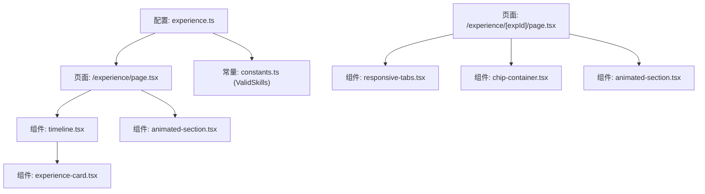
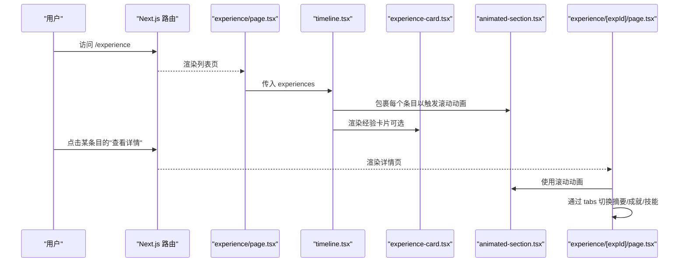
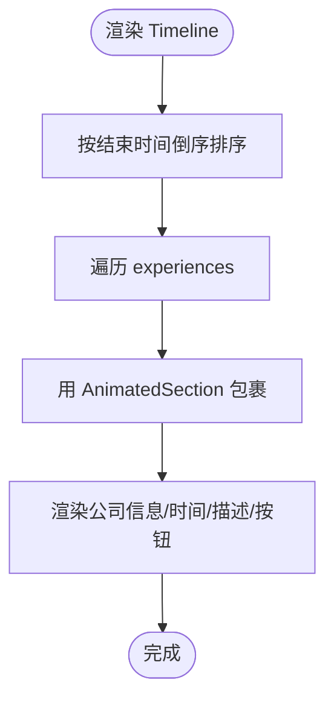
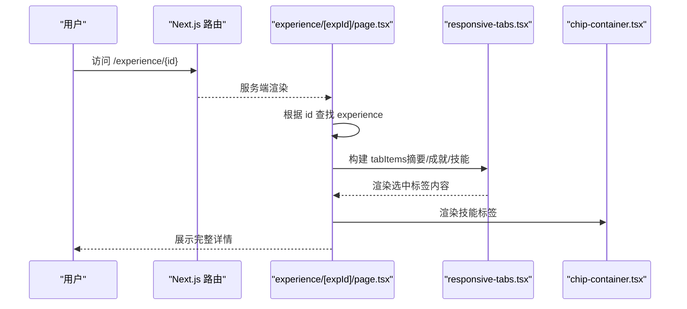
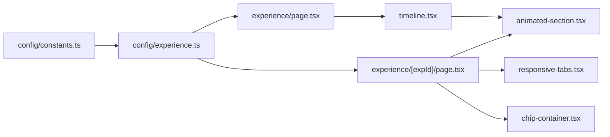

# 经验时间线模块

<cite>
**本文引用的文件**
- [config/experience.ts](file://config/experience.ts)
- [components/experience/timeline.tsx](file://components/experience/timeline.tsx)
- [components/experience/experience-card.tsx](file://components/experience/experience-card.tsx)
- [app/(root)/experience/page.tsx](file://app/(root)/experience/page.tsx)
- [app/(root)/experience/[expId]/page.tsx](file://app/(root)/experience/[expId]/page.tsx)
- [components/common/animated-section.tsx](file://components/common/animated-section.tsx)
- [components/ui/responsive-tabs.tsx](file://components/ui/responsive-tabs.tsx)
- [components/ui/chip-container.tsx](file://components/ui/chip-container.tsx)
- [config/constants.ts](file://config/constants.ts)
- [config/pages.ts](file://config/pages.ts)
</cite>

## 更新摘要
**所做更改**
- 完全本地化用户体验界面为中文
- 更新工作经历内容为泰安东信智联信息科技有限公司的实际工作经验
- 添加智能停车系统和AI应用开发相关技术栈
- 优化页面元数据和SEO配置
- 增强响应式设计和交互体验

## 目录
1. [简介](#简介)
2. [项目结构](#项目结构)
3. [核心组件](#核心组件)
4. [架构总览](#架构总览)
5. [详细组件分析](#详细组件分析)
6. [依赖关系分析](#依赖关系分析)
7. [性能与可访问性](#性能与可访问性)
8. [故障排查指南](#故障排查指南)
9. [结论](#结论)
10. [附录：配置与扩展](#附录：配置与扩展)

## 简介
本模块用于展示个人职业经历的时间线，包括工作经验、教育背景、认证等结构化信息。经过本地化更新后，现在专注于展示在泰安东信智联信息科技有限公司的实际工作经验，涵盖智能停车系统、AI应用开发等核心技术领域。它提供：
- 数据驱动的经验条目管理（类型安全、可扩展）
- 响应式垂直时间线与卡片布局
- 详情页面（摘要、成就、技能标签）
- 动画滚动入场与交互体验
- 与其他模块的集成点（如技能标签复用、链接跳转）

该文档既帮助初学者理解时间线的基本概念，也为高级开发者提供深入实现细节和定制指导。

## 项目结构
经验时间线模块由"配置层 + 页面层 + 组件层"组成：
- 配置层：集中定义经验数据结构与示例数据
- 页面层：列表页与详情页路由
- 组件层：时间线容器、经验卡片、动画、标签、标签页等

**图表来源**
- [config/experience.ts:1-69](file://config/experience.ts#L1-L69)
- [app/(root)/experience/page.tsx:1-34](file://app/(root)/experience/page.tsx#L1-L34)
- [components/experience/timeline.tsx:1-117](file://components/experience/timeline.tsx#L1-L117)
- [components/experience/experience-card.tsx:1-112](file://components/experience/experience-card.tsx#L1-L112)
- [components/common/animated-section.tsx:1-51](file://components/common/animated-section.tsx#L1-L51)
- [components/ui/responsive-tabs.tsx:1-89](file://components/ui/responsive-tabs.tsx#L1-L89)
- [components/ui/chip-container.tsx:1-16](file://components/ui/chip-container.tsx#L1-L16)
- [config/constants.ts:1-91](file://config/constants.ts#L1-L91)

**章节来源**
- [config/experience.ts:1-69](file://config/experience.ts#L1-L69)
- [app/(root)/experience/page.tsx:1-34](file://app/(root)/experience/page.tsx#L1-L34)
- [app/(root)/experience/[expId]/page.tsx:1-221](file://app/(root)/experience/[expId]/page.tsx#L1-L221)

## 核心组件
- 经验数据模型与示例数据：ExperienceInterface 与 experiences 数组
- 时间线组件 Timeline：排序、渲染、动画、响应式布局
- 经验卡片 ExperienceCard：紧凑展示关键信息（公司、职位、时间、技能标签）
- 详情页 ExperienceDetailPage：摘要、成就、技能标签三栏内容
- 通用能力：AnimatedSection（滚动动画）、ResponsiveTabs（移动端下拉/桌面标签）、ChipContainer（技能标签容器）

**章节来源**
- [config/experience.ts:1-69](file://config/experience.ts#L1-L69)
- [components/experience/timeline.tsx:1-117](file://components/experience/timeline.tsx#L1-L117)
- [components/experience/experience-card.tsx:1-112](file://components/experience/experience-card.tsx#L1-L112)
- [app/(root)/experience/[expId]/page.tsx:1-221](file://app/(root)/experience/[expId]/page.tsx#L1-L221)
- [components/common/animated-section.tsx:1-51](file://components/common/animated-section.tsx#L1-L51)
- [components/ui/responsive-tabs.tsx:1-89](file://components/ui/responsive-tabs.tsx#L1-L89)
- [components/ui/chip-container.tsx:1-16](file://components/ui/chip-container.tsx#L1-L16)

## 架构总览
从路由到组件的数据流如下：

**图表来源**
- [app/(root)/experience/page.tsx:1-34](file://app/(root)/experience/page.tsx#L1-L34)
- [components/experience/timeline.tsx:1-117](file://components/experience/timeline.tsx#L1-L117)
- [components/experience/experience-card.tsx:1-112](file://components/experience/experience-card.tsx#L1-L112)
- [components/common/animated-section.tsx:1-51](file://components/common/animated-section.tsx#L1-L51)
- [app/(root)/experience/[expId]/page.tsx:1-221](file://app/(root)/experience/[expId]/page.tsx#L1-L221)

## 详细组件分析

### 经验数据模型与配置
- 数据结构
  - id：唯一标识，用于路由跳转与元数据生成
  - position/company/location：基础信息
  - startDate/endDate：支持 Date 或字符串 "Present"
  - description/achievements：数组形式，便于多行描述与成就列举
  - skills：受 ValidSkills 约束的类型化技能集合
  - companyUrl/logo：可选的公司链接与 Logo
- 数据来源
  - config/experience.ts 中导出 experiences 数组，供列表页与详情页消费
- 类型安全
  - 通过 ValidSkills 限制技能值，避免拼写错误
  - 在详情页根据 expId 查找对应条目，未找到时重定向

**更新** 工作经历现已完全本地化，主要展示在泰安东信智联信息科技有限公司的工作经历，包括智能停车系统、AI应用开发等核心技术。

**章节来源**
- [config/experience.ts:1-69](file://config/experience.ts#L1-L69)
- [config/constants.ts:1-91](file://config/constants.ts#L1-L91)
- [app/(root)/experience/[expId]/page.tsx:38-67](file://app/(root)/experience/[expId]/page.tsx#L38-L67)

### 列表页与时间线组件
- 列表页
  - app/(root)/experience/page.tsx 负责页面标题、描述与 SEO 元信息
  - 将 experiences 传递给 Timeline 组件
- 时间线组件
  - 按结束时间倒序排列（当前工作优先）
  - 每条记录使用 AnimatedSection 包裹，实现滚动进入时的淡入与位移动画
  - 展示公司 Logo、职位、时间范围、地点、首段描述
  - 提供"查看详情"按钮跳转到 /experience/[expId]
  - 响应式布局：移动端纵向堆叠，桌面端左右分栏

**图表来源**
- [components/experience/timeline.tsx:1-117](file://components/experience/timeline.tsx#L1-L117)
- [components/common/animated-section.tsx:1-51](file://components/common/animated-section.tsx#L1-L51)

**章节来源**
- [app/(root)/experience/page.tsx:1-34](file://app/(root)/experience/page.tsx#L1-L34)
- [components/experience/timeline.tsx:1-117](file://components/experience/timeline.tsx#L1-L117)

### 经验卡片组件
- 用途：在列表或其他区域快速展示单条经历的关键信息
- 展示字段：Logo、职位、公司、地点、时间范围、首段描述、前两项技能标签及"更多"计数
- 交互：点击"查看详情"跳转到详情页
- 设计要点：紧凑、可读性强，适合网格或列表场景

**章节来源**
- [components/experience/experience-card.tsx:1-112](file://components/experience/experience-card.tsx#L1-L112)

### 详情页（摘要/成就/技能）
- 动态元数据：根据 expId 生成页面标题与描述
- 内容组织：使用 ResponsiveTabs 在移动端以下拉菜单呈现，在桌面端以标签页呈现
- 三个标签：
  - 摘要：展示 description 数组中的每段职责/描述
  - 成就：展示 achievements 数组中的关键成果
  - 技能：使用 ChipContainer 渲染技能标签
- 导航：返回"全部经历"与"返回列表"

**图表来源**
- [app/(root)/experience/[expId]/page.tsx:1-221](file://app/(root)/experience/[expId]/page.tsx#L1-L221)
- [components/ui/responsive-tabs.tsx:1-89](file://components/ui/responsive-tabs.tsx#L1-L89)
- [components/ui/chip-container.tsx:1-16](file://components/ui/chip-container.tsx#L1-L16)

**章节来源**
- [app/(root)/experience/[expId]/page.tsx:1-221](file://app/(root)/experience/[expId]/page.tsx#L1-L221)
- [components/ui/responsive-tabs.tsx:1-89](file://components/ui/responsive-tabs.tsx#L1-L89)
- [components/ui/chip-container.tsx:1-16](file://components/ui/chip-container.tsx#L1-L16)

### 动画与交互
- 滚动动画：AnimatedSection 基于 motion/react，支持方向与延迟控制，viewport 触发一次动画
- 时间线动画：每个条目按索引设置递增延迟，形成阶梯式入场效果
- 详情页动画：各标签内容同样使用 AnimatedSection 包裹，提升阅读节奏感

**章节来源**
- [components/common/animated-section.tsx:1-51](file://components/common/animated-section.tsx#L1-L51)
- [components/experience/timeline.tsx:40-112](file://components/experience/timeline.tsx#L40-L112)
- [app/(root)/experience/[expId]/page.tsx:69-136](file://app/(root)/experience/[expId]/page.tsx#L69-L136)

### 响应式设计
- 列表与卡片：移动端纵向布局，桌面端横向信息排布
- 详情页：移动端使用下拉菜单选择标签，桌面端使用标签页
- 图片与图标：自适应尺寸，保持清晰与一致性

**章节来源**
- [components/experience/timeline.tsx:40-112](file://components/experience/timeline.tsx#L40-L112)
- [components/experience/experience-card.tsx:31-112](file://components/experience/experience-card.tsx#L31-L112)
- [components/ui/responsive-tabs.tsx:28-89](file://components/ui/responsive-tabs.tsx#L28-L89)

## 依赖关系分析
- 数据源
  - config/experience.ts 提供 experiences 与 ExperienceInterface
  - config/constants.ts 提供 ValidSkills 类型约束
- 页面与组件
  - 列表页依赖 Timeline、AnimatedSection
  - 详情页依赖 ResponsiveTabs、ChipContainer、AnimatedSection
- 外部库
  - motion/react 用于滚动动画
  - Next.js Image/Link 用于图片优化与客户端导航
  - lucide-react 图标（通过 Icons 封装）

**图表来源**
- [config/experience.ts:1-69](file://config/experience.ts#L1-L69)
- [config/constants.ts:1-91](file://config/constants.ts#L1-L91)
- [app/(root)/experience/page.tsx:1-34](file://app/(root)/experience/page.tsx#L1-L34)
- [app/(root)/experience/[expId]/page.tsx:1-221](file://app/(root)/experience/[expId]/page.tsx#L1-L221)
- [components/experience/timeline.tsx:1-117](file://components/experience/timeline.tsx#L1-L117)
- [components/common/animated-section.tsx:1-51](file://components/common/animated-section.tsx#L1-L51)
- [components/ui/responsive-tabs.tsx:1-89](file://components/ui/responsive-tabs.tsx#L1-L89)
- [components/ui/chip-container.tsx:1-16](file://components/ui/chip-container.tsx#L1-L16)

**章节来源**
- [config/experience.ts:1-69](file://config/experience.ts#L1-L69)
- [config/constants.ts:1-91](file://config/constants.ts#L1-L91)
- [app/(root)/experience/page.tsx:1-34](file://app/(root)/experience/page.tsx#L1-L34)
- [app/(root)/experience/[expId]/page.tsx:1-221](file://app/(root)/experience/[expId]/page.tsx#L1-L221)

## 性能与可访问性
- 性能
  - 列表排序在客户端进行，数据量较小时开销可忽略；如需更大规模，建议后端排序或缓存
  - 图片使用 Next.js Image 优化加载
  - 动画仅在视口内触发且仅执行一次，减少重复计算
- 可访问性
  - 外链使用 target="_blank" 并配合 rel="noopener noreferrer" 提升安全性
  - 按钮与链接具备语义化结构，利于屏幕阅读器识别
  - 颜色对比度遵循主题变量，确保可读性

## 故障排查指南
- 详情页无法打开或重定向
  - 检查 URL 中的 expId 是否在 experiences 中存在
  - 若不存在，会重定向回 /experience
- 技能标签显示异常
  - 确认 skills 数组中的值属于 ValidSkills 枚举
  - 若新增技能，需在 constants.ts 中添加对应类型
- 动画不生效
  - 确认组件位于可视区域内，且使用了 AnimatedSection 包裹
  - 检查 motion/react 是否已正确安装与引入
- 链接跳转无效
  - 确认 Link 的 href 指向正确的路由路径
  - 检查是否存在路由冲突或命名错误

**章节来源**
- [app/(root)/experience/[expId]/page.tsx:38-67](file://app/(root)/experience/[expId]/page.tsx#L38-L67)
- [config/constants.ts:1-91](file://config/constants.ts#L1-L91)
- [components/common/animated-section.tsx:1-51](file://components/common/animated-section.tsx#L1-L51)

## 结论
经验时间线模块通过类型化的数据模型、清晰的页面分层与可复用的 UI 组件，实现了专业、美观且易维护的职业经历展示。经过本地化更新后，现在专注于展示在泰安东信智联信息科技有限公司的实际工作经验，涵盖智能停车系统、AI应用开发等核心技术领域。其响应式设计与动画增强了用户体验，同时提供了灵活的扩展点以满足不同展示需求。

## 附录：配置与扩展

### 如何添加新的经历条目
- 在 config/experience.ts 中向 experiences 数组追加新对象，确保包含必填字段（id、position、company、location、startDate、endDate、description、achievements、skills）
- 如需公司链接与 Logo，可设置 companyUrl 与 logo
- 技能需来自 ValidSkills 类型，避免类型错误

**更新** 当前主要工作经历为泰安东信智联信息科技有限公司的Java开发工程师职位，涉及智能停车系统、AI应用开发等技术栈。

**章节来源**
- [config/experience.ts:17-68](file://config/experience.ts#L17-L68)
- [config/constants.ts:1-91](file://config/constants.ts#L1-L91)

### 如何修改现有信息与自定义显示格式
- 修改 experiences 中对应对象的字段即可更新展示内容
- 如需调整时间范围文本格式，可在时间线或卡片组件中调整 getDurationText 逻辑
- 如需在卡片中展示更多技能标签，可调整 slice(0, N) 的阈值

**章节来源**
- [components/experience/timeline.tsx:17-26](file://components/experience/timeline.tsx#L17-L26)
- [components/experience/experience-card.tsx:11-25](file://components/experience/experience-card.tsx#L11-L25)
- [components/experience/experience-card.tsx:77-91](file://components/experience/experience-card.tsx#L77-L91)

### 如何实现时间线的动画效果
- 使用 AnimatedSection 包裹每个条目，并通过 delay 参数实现交错入场
- 可通过 direction 控制动画方向（上/下/左/右）
- 详情页的各标签内容同样可使用 AnimatedSection 包裹以获得一致的动效

**章节来源**
- [components/experience/timeline.tsx:40-112](file://components/experience/timeline.tsx#L40-L112)
- [components/common/animated-section.tsx:1-51](file://components/common/animated-section.tsx#L1-L51)
- [app/(root)/experience/[expId]/page.tsx:69-136](file://app/(root)/experience/[expId]/page.tsx#L69-L136)

### 如何实现点击展开详情
- 在时间线与卡片组件中使用 Link 跳转到 /experience/[expId]
- 详情页根据 expId 查找并渲染对应条目，未找到则重定向
- 详情页使用 ResponsiveTabs 组织摘要、成就、技能等内容

**章节来源**
- [components/experience/timeline.tsx:97-108](file://components/experience/timeline.tsx#L97-L108)
- [components/experience/experience-card.tsx:94-106](file://components/experience/experience-card.tsx#L94-L106)
- [app/(root)/experience/[expId]/page.tsx:38-67](file://app/(root)/experience/[expId]/page.tsx#L38-L67)
- [components/ui/responsive-tabs.tsx:28-89](file://components/ui/responsive-tabs.tsx#L28-L89)

### 与其他模块的集成方式
- 技能标签复用：详情页使用 ChipContainer 统一渲染技能标签，保证风格一致
- 链接跳转处理：所有外链均使用 a 标签并设置安全属性；内部路由使用 Next.js Link
- 页面元信息：通过 pagesConfig 统一管理页面标题与描述，保持全站一致

**更新** 页面配置已完全本地化为中文，包括"工作经历"、"职业历程与发展轨迹"等中文描述。

**章节来源**
- [components/ui/chip-container.tsx:1-16](file://components/ui/chip-container.tsx#L1-L16)
- [app/(root)/experience/[expId]/page.tsx:150-206](file://app/(root)/experience/[expId]/page.tsx#L150-L206)
- [config/pages.ts:76-84](file://config/pages.ts#L76-L84)