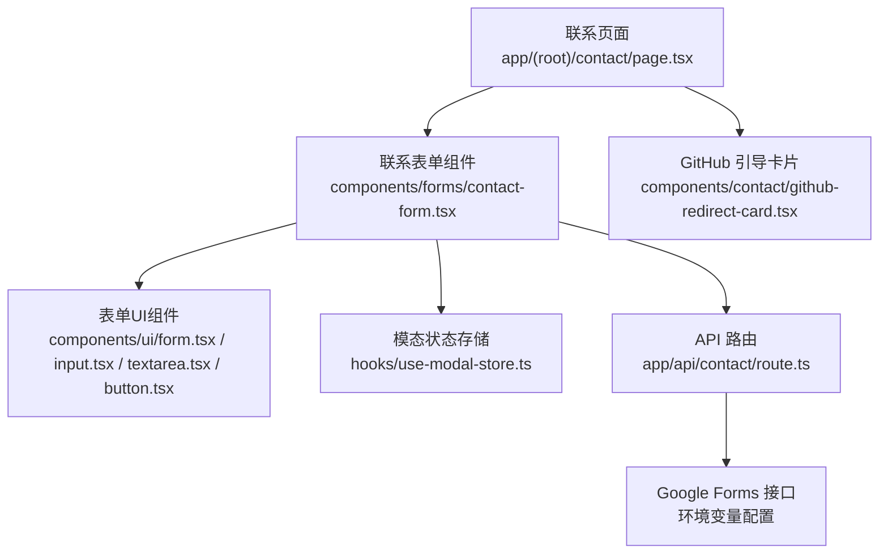
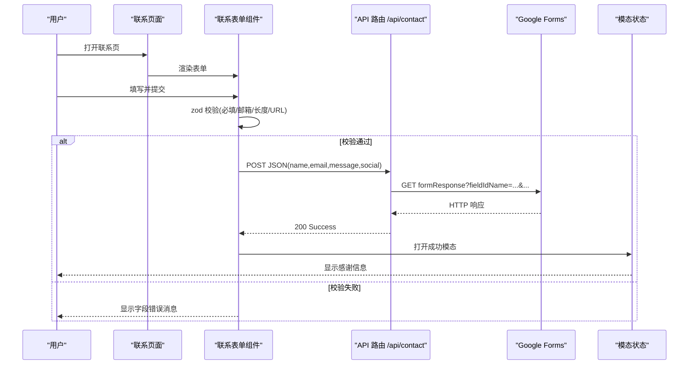
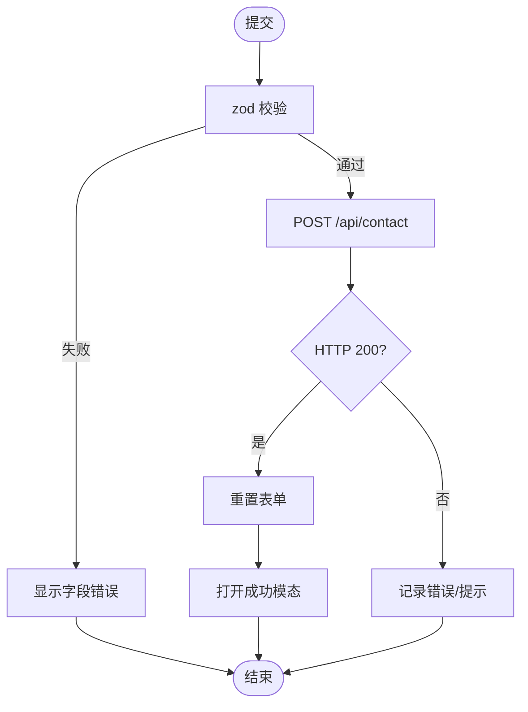
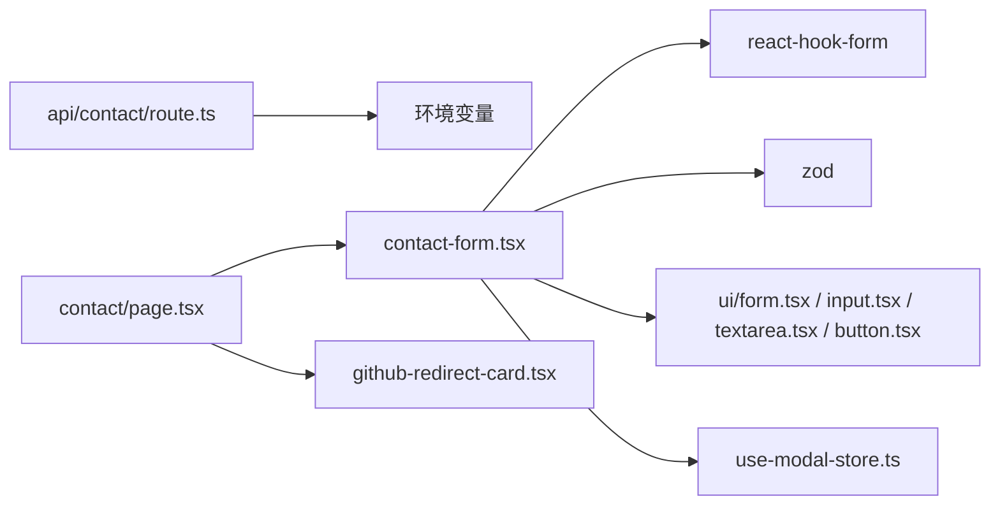

# 联系表单模块

<cite>
**本文引用的文件**
- [app/(root)/contact/page.tsx](file://app/(root)/contact/page.tsx)
- [components/forms/contact-form.tsx](file://components/forms/contact-form.tsx)
- [app/api/contact/route.ts](file://app/api/contact/route.ts)
- [components/ui/form.tsx](file://components/ui/form.tsx)
- [components/ui/input.tsx](file://components/ui/input.tsx)
- [components/ui/textarea.tsx](file://components/ui/textarea.tsx)
- [components/ui/button.tsx](file://components/ui/button.tsx)
- [hooks/use-modal-store.ts](file://hooks/use-modal-store.ts)
- [config/pages.ts](file://config/pages.ts)
- [components/contact/github-redirect-card.tsx](file://components/contact/github-redirect-card.tsx)
</cite>

## 目录
1. [简介](#简介)
2. [项目结构](#项目结构)
3. [核心组件](#核心组件)
4. [架构总览](#架构总览)
5. [详细组件分析](#详细组件分析)
6. [依赖关系分析](#依赖关系分析)
7. [性能与可用性考虑](#性能与可用性考虑)
8. [故障排查指南](#故障排查指南)
9. [结论](#结论)
10. [附录：配置与扩展](#附录：配置与扩展)

## 简介
本模块实现了一个基于 Next.js App Router 的“联系表单”功能，包含前端表单、客户端校验、API 路由转发到 Google Forms，以及成功后的用户反馈。它同时提供响应式布局、可访问性支持（通过 Radix UI 基础）和可扩展的验证规则。

## 项目结构
联系表单相关代码分布在页面、表单组件、UI 基础组件、状态存储与 API 路由中：
- 页面层：展示联系表单与侧边卡片
- 表单层：使用 react-hook-form + zod 进行声明式校验与提交
- UI 层：基于 shadcn/ui 风格的 Form/Input/Textarea/Button 等
- 服务端：Next.js API Route 接收数据并转发至 Google Forms
- 状态层：Zustand 模态框用于成功提示

图表来源
- [app/(root)/contact/page.tsx:13-27](file://app/(root)/contact/page.tsx#L13-L27)
- [components/forms/contact-form.tsx:32-71](file://components/forms/contact-form.tsx#L32-L71)
- [components/ui/form.tsx:16-178](file://components/ui/form.tsx#L16-L178)
- [components/ui/input.tsx:8-23](file://components/ui/input.tsx#L8-L23)
- [components/ui/textarea.tsx:8-22](file://components/ui/textarea.tsx#L8-L22)
- [components/ui/button.tsx:42-54](file://components/ui/button.tsx#L42-L54)
- [hooks/use-modal-store.ts:22-35](file://hooks/use-modal-store.ts#L22-L35)
- [app/api/contact/route.ts:3-30](file://app/api/contact/route.ts#L3-L30)
- [components/contact/github-redirect-card.tsx:11-55](file://components/contact/github-redirect-card.tsx#L11-L55)

章节来源
- [app/(root)/contact/page.tsx:1-30](file://app/(root)/contact/page.tsx#L1-L30)
- [components/forms/contact-form.tsx:1-142](file://components/forms/contact-form.tsx#L1-L142)
- [app/api/contact/route.ts:1-31](file://app/api/contact/route.ts#L1-L31)

## 核心组件
- 联系页面：组合表单与右侧卡片，设置页面元信息
- 联系表单：使用 react-hook-form + zod 定义字段与校验；提交时调用 /api/contact；成功后打开模态提示
- 表单 UI：Form/FormField/FormItem/FormLabel/FormControl/FormMessage 封装了受控输入与错误消息显示
- API 路由：读取环境变量中的 Google Forms 链接与字段 ID，将表单数据拼接为查询参数发送
- 模态存储：Zustand 全局状态控制成功弹窗的打开与内容

章节来源
- [components/forms/contact-form.tsx:21-71](file://components/forms/contact-form.tsx#L21-L71)
- [components/ui/form.tsx:16-178](file://components/ui/form.tsx#L16-L178)
- [app/api/contact/route.ts:3-30](file://app/api/contact/route.ts#L3-L30)
- [hooks/use-modal-store.ts:22-35](file://hooks/use-modal-store.ts#L22-L35)

## 架构总览
下图展示了从用户交互到第三方服务的数据流与关键节点。

图表来源
- [components/forms/contact-form.tsx:37-71](file://components/forms/contact-form.tsx#L37-L71)
- [app/api/contact/route.ts:3-30](file://app/api/contact/route.ts#L3-L30)
- [hooks/use-modal-store.ts:22-35](file://hooks/use-modal-store.ts#L22-L35)

## 详细组件分析

### 联系页面（app/(root)/contact/page.tsx）
- 职责：组织页面布局，注入页面标题与描述，嵌入 ContactForm 与 GitHub 引导卡片
- 关键点：使用 PageContainer 统一容器；左右分栏在移动端堆叠、桌面端并排

章节来源
- [app/(root)/contact/page.tsx:8-27](file://app/(root)/contact/page.tsx#L8-L27)
- [config/pages.ts:41-48](file://config/pages.ts#L41-L48)

### 联系表单（components/forms/contact-form.tsx）
- 表单库：react-hook-form 管理状态与生命周期；zod 负责 schema 校验
- 字段与校验：
  - name：字符串且最小长度限制
  - email：邮箱格式校验
  - message：字符串且最小长度限制
  - social：可选 URL 或空字符串
- 提交流程：
  - 提交时以 JSON 方式 POST 到 /api/contact
  - 成功后重置表单并打开成功模态
- 错误提示：通过 FormMessage 自动显示 zod 错误信息
- 可访问性：FormLabel 与 FormControl 通过 id 关联，提升屏幕阅读器体验

图表来源
- [components/forms/contact-form.tsx:21-71](file://components/forms/contact-form.tsx#L21-L71)

章节来源
- [components/forms/contact-form.tsx:21-142](file://components/forms/contact-form.tsx#L21-L142)

### 表单 UI 组件（components/ui/form.tsx, input.tsx, textarea.tsx, button.tsx）
- Form/FormField/FormItem/FormLabel/FormControl/FormMessage：封装 react-hook-form 的 Controller，提供统一的错误消息与可访问性属性
- Input/Textarea：基础输入控件，具备焦点环、禁用态、占位符样式
- Button：多 variant/size 的可复用按钮，用于提交

章节来源
- [components/ui/form.tsx:16-178](file://components/ui/form.tsx#L16-L178)
- [components/ui/input.tsx:8-23](file://components/ui/input.tsx#L8-L23)
- [components/ui/textarea.tsx:8-22](file://components/ui/textarea.tsx#L8-L22)
- [components/ui/button.tsx:42-54](file://components/ui/button.tsx#L42-L54)

### API 路由（app/api/contact/route.ts）
- 环境变量：
  - GOOGLE_FORM_LINK：Google Forms 的表单链接
  - GOOGLE_FORM_FIELD_ID_NAME / EMAIL / MESSAGE / SOCIAL：对应表单字段的 field ID
- 处理逻辑：
  - 解析请求体 JSON，解构 name/email/message/social
  - 拼接 formResponse 查询参数并发起 fetch
  - 返回统一的成功响应；异常时返回 500
- 安全注意：
  - 未配置环境变量时直接返回 500
  - 建议在生产环境增加速率限制、CORS 白名单与输入二次校验

章节来源
- [app/api/contact/route.ts:3-30](file://app/api/contact/route.ts#L3-L30)

### 模态状态（hooks/use-modal-store.ts）
- 使用 Zustand 维护 isOpen/title/description/icon
- 表单提交成功后调用 onOpen 打开成功提示

章节来源
- [hooks/use-modal-store.ts:22-35](file://hooks/use-modal-store.ts#L22-L35)

### 侧边卡片（components/contact/github-redirect-card.tsx）
- 展示开源模板引导，点击跳转至 GitHub
- 与表单并列展示，增强互动与传播

章节来源
- [components/contact/github-redirect-card.tsx:11-55](file://components/contact/github-redirect-card.tsx#L11-L55)

## 依赖关系分析
- 表单组件依赖：
  - react-hook-form + zod：表单状态与校验
  - UI 组件：Form 系列、Input、Textarea、Button
  - 模态存储：useModalStore
- API 路由依赖：
  - NextResponse：构建响应
  - 环境变量：Google Forms 链接与字段 ID
- 页面依赖：
  - 页面容器与配置：PageContainer、pagesConfig

图表来源
- [components/forms/contact-form.tsx:3-19](file://components/forms/contact-form.tsx#L3-L19)
- [app/api/contact/route.ts:1-15](file://app/api/contact/route.ts#L1-L15)
- [app/(root)/contact/page.tsx:3-6](file://app/(root)/contact/page.tsx#L3-L6)

章节来源
- [components/forms/contact-form.tsx:1-142](file://components/forms/contact-form.tsx#L1-L142)
- [app/api/contact/route.ts:1-31](file://app/api/contact/route.ts#L1-L31)
- [app/(root)/contact/page.tsx:1-30](file://app/(root)/contact/page.tsx#L1-L30)

## 性能与可用性考虑
- 性能
  - 表单校验在前端完成，减少无效请求
  - API 路由仅做转发，避免在服务端重复复杂计算
  - 建议在 API 路由加入速率限制与缓存策略（如 Redis）防止滥用
- 可用性
  - 使用 FormLabel/FormControl 建立 label-for 关系，提升可访问性
  - 错误消息即时显示，帮助用户快速修正
  - 成功反馈通过模态提示，明确告知结果
- 安全性
  - 服务端再次校验输入（尤其是邮箱与 URL）
  - 对 Google Forms 链接与字段 ID 进行严格的环境变量管理
  - 建议启用 HTTPS 与 CORS 白名单

[本节为通用指导，不直接分析具体文件]

## 故障排查指南
- 无法提交或报 500
  - 检查环境变量是否配置完整：GOOGLE_FORM_LINK 与各字段 ID
  - 确认 Google Forms 已开启“允许收集回复”
  - 查看 API 路由日志输出，定位网络或参数问题
- 校验不生效
  - 确认 zod schema 与表单字段名一致
  - 检查 FormField 的 name 是否正确绑定
- 无成功提示
  - 确认 API 返回 200，且前端分支逻辑正确触发 onOpen
- 邮箱格式错误
  - 检查 zod 的 email 规则与自定义提示信息
- 社交链接无效
  - 确保 social 字段接受空字符串或有效 URL

章节来源
- [app/api/contact/route.ts:3-30](file://app/api/contact/route.ts#L3-L30)
- [components/forms/contact-form.tsx:21-71](file://components/forms/contact-form.tsx#L21-L71)

## 结论
该联系表单模块采用清晰的分层设计：前端表单负责校验与交互，API 路由负责与第三方服务集成，UI 组件保证一致的视觉与可访问性。通过环境变量驱动 Google Forms 映射，便于在不同环境中灵活配置。整体实现简洁、可扩展，适合初学者理解并与高级开发者进一步定制。

[本节为总结，不直接分析具体文件]

## 附录：配置与扩展

### 如何修改表单字段
- 在表单组件中更新 zod schema 与默认值，并在 FormField 中添加/移除字段
- 如需新增字段，请在 API 路由中同步解构并拼接到 Google Forms 查询参数

章节来源
- [components/forms/contact-form.tsx:21-45](file://components/forms/contact-form.tsx#L21-L45)
- [app/api/contact/route.ts:17-23](file://app/api/contact/route.ts#L17-L23)

### 如何设置验证规则
- 使用 zod 添加 min/max、email、url、regex 等规则
- 为每个规则提供友好的错误消息，并通过 FormMessage 显示

章节来源
- [components/forms/contact-form.tsx:21-30](file://components/forms/contact-form.tsx#L21-L30)

### 如何自定义提交行为
- 在 onSubmit 中替换 fetch 调用，接入其他后端服务
- 可增加 loading 状态、重试机制与更丰富的错误提示

章节来源
- [components/forms/contact-form.tsx:47-71](file://components/forms/contact-form.tsx#L47-L71)

### 如何实现响应式设计
- 页面使用 flex 布局，移动端纵向堆叠，桌面端横向排列
- 表单宽度与间距通过 Tailwind 类名控制

章节来源
- [app/(root)/contact/page.tsx:19-26](file://app/(root)/contact/page.tsx#L19-L26)

### 如何添加加载状态与用户反馈
- 在提交期间禁用按钮并显示加载指示
- 失败时通过模态或 Toast 提示错误原因
- 成功时保持现有模态提示

章节来源
- [components/ui/button.tsx:42-54](file://components/ui/button.tsx#L42-L54)
- [hooks/use-modal-store.ts:22-35](file://hooks/use-modal-store.ts#L22-L35)

### 如何集成 Google Forms
- 在环境变量中配置：
  - GOOGLE_FORM_LINK：Google Forms 的表单链接
  - GOOGLE_FORM_FIELD_ID_*：各字段的 field ID
- 在 API 路由中将表单字段映射到对应 field ID 并发起请求

章节来源
- [app/api/contact/route.ts:4-23](file://app/api/contact/route.ts#L4-L23)