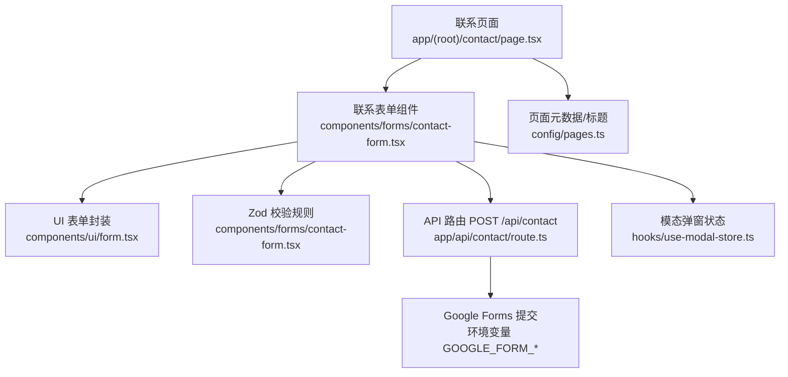
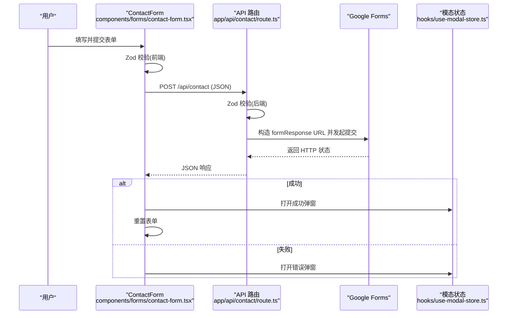
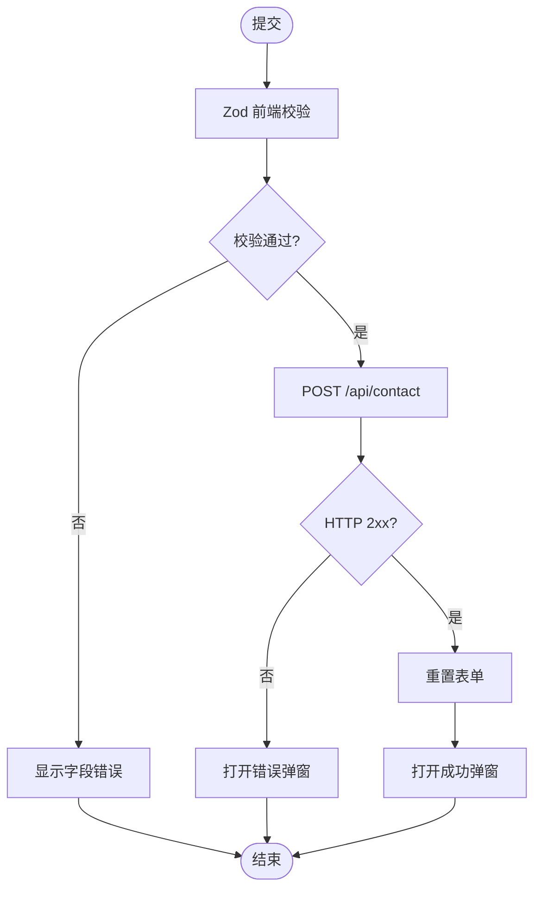
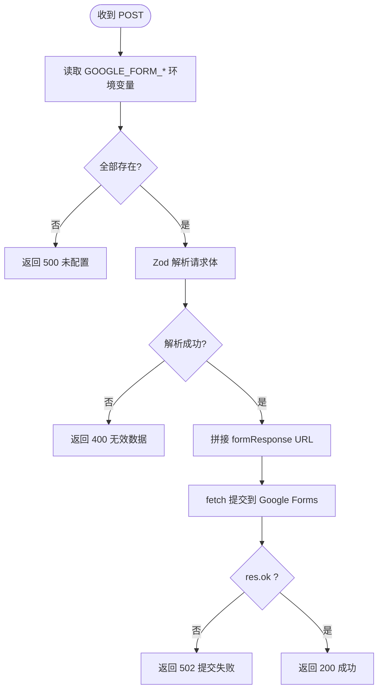
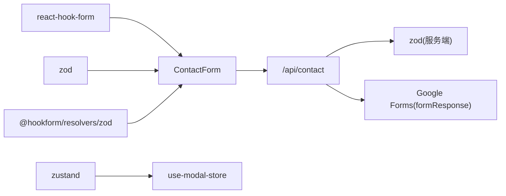

# 联系表单系统

<cite>
**本文引用的文件**
- [app/(root)/contact/page.tsx](file://app/(root)/contact/page.tsx)
- [components/forms/contact-form.tsx](file://components/forms/contact-form.tsx)
- [app/api/contact/route.ts](file://app/api/contact/route.ts)
- [components/ui/form.tsx](file://components/ui/form.tsx)
- [hooks/use-modal-store.ts](file://hooks/use-modal-store.ts)
- [config/pages.ts](file://config/pages.ts)
- [package.json](file://package.json)
</cite>

## 目录
1. [简介](#简介)
2. [项目结构](#项目结构)
3. [核心组件](#核心组件)
4. [架构总览](#架构总览)
5. [详细组件分析](#详细组件分析)
6. [依赖关系分析](#依赖关系分析)
7. [性能考虑](#性能考虑)
8. [故障排查指南](#故障排查指南)
9. [结论](#结论)
10. [附录](#附录)

## 简介
本文件为 Next.js 投资组合中的“联系表单系统”提供完整技术文档。内容涵盖：
- 前端表单验证机制（React Hook Form + Zod）
- Google Forms 集成流程与配置
- API 路由处理与错误策略
- 表单状态管理与用户体验优化
- 安全与防护措施
- 扩展指南：自定义字段、接入其他后端、添加验证码、优化提交体验

## 项目结构
联系表单由页面容器、表单组件、UI 表单封装、服务端 API 路由以及全局模态弹窗状态组成，整体遵循前后端分离的 Next.js App Router 模式。

图表来源
- [app/(root)/contact/page.tsx:1-30](file://app/(root)/contact/page.tsx#L1-L30)
- [components/forms/contact-form.tsx:1-140](file://components/forms/contact-form.tsx#L1-L140)
- [components/ui/form.tsx:1-178](file://components/ui/form.tsx#L1-L178)
- [app/api/contact/route.ts:1-57](file://app/api/contact/route.ts#L1-L57)
- [hooks/use-modal-store.ts:1-33](file://hooks/use-modal-store.ts#L1-L33)
- [config/pages.ts:1-81](file://config/pages.ts#L1-L81)

章节来源
- [app/(root)/contact/page.tsx:1-30](file://app/(root)/contact/page.tsx#L1-L30)
- [config/pages.ts:15-47](file://config/pages.ts#L15-L47)

## 核心组件
- 联系表单组件：基于 React Hook Form 管理表单状态，使用 Zod 进行前后端一致的校验；提交时调用 /api/contact。
- UI 表单封装：对 react-hook-form 的 Controller 进行封装，提供 Form、FormField、FormItem、FormLabel、FormControl、FormMessage 等原子组件，统一错误提示与可访问性。
- API 路由：接收并校验请求体，将数据转发到 Google Forms，返回统一响应。
- 模态弹窗状态：使用 Zustand 管理成功/失败弹窗的打开与关闭。

章节来源
- [components/forms/contact-form.tsx:1-140](file://components/forms/contact-form.tsx#L1-L140)
- [components/ui/form.tsx:1-178](file://components/ui/form.tsx#L1-L178)
- [app/api/contact/route.ts:1-57](file://app/api/contact/route.ts#L1-L57)
- [hooks/use-modal-store.ts:1-33](file://hooks/use-modal-store.ts#L1-L33)

## 架构总览
下图展示了从用户填写表单到最终结果反馈的完整时序。

图表来源
- [components/forms/contact-form.tsx:21-75](file://components/forms/contact-form.tsx#L21-L75)
- [app/api/contact/route.ts:11-55](file://app/api/contact/route.ts#L11-L55)
- [hooks/use-modal-store.ts:19-31](file://hooks/use-modal-store.ts#L19-L31)

## 详细组件分析

### 前端表单组件（ContactForm）
- 表单库与校验：使用 React Hook Form 的 useForm，并通过 @hookform/resolvers/zod 接入 Zod 校验器，实现类型安全的表单数据模型。
- 字段定义：包含 name、email、message、social（可选），分别对应姓名、邮箱、消息和社交链接。
- 提交流程：
  - 提交时通过 fetch 调用 /api/contact。
  - 成功后重置表单并打开成功模态。
  - 失败时记录错误并打开错误模态。
- 可访问性与错误展示：借助 UI 表单封装的 FormMessage 显示校验错误信息。

图表来源
- [components/forms/contact-form.tsx:21-75](file://components/forms/contact-form.tsx#L21-L75)

章节来源
- [components/forms/contact-form.tsx:21-75](file://components/forms/contact-form.tsx#L21-L75)

### UI 表单封装（Form 系列）
- 基于 react-hook-form 的 Controller 封装，提供统一的上下文与错误 ID 管理。
- 关键能力：
  - FormProvider 包裹表单上下文。
  - FormField 绑定字段名与控制器。
  - FormItem/FormLabel/FormControl 组合渲染输入控件。
  - FormMessage 根据错误状态显示消息。
  - 自动注入 aria-* 属性提升可访问性。

章节来源
- [components/ui/form.tsx:16-178](file://components/ui/form.tsx#L16-L178)

### API 路由（/api/contact）
- 职责：
  - 读取环境变量以获取 Google Forms 目标地址与各字段 ID。
  - 使用 Zod 校验请求体。
  - 构建查询参数并调用 Google Forms 的 formResponse 接口。
  - 根据响应状态返回统一结果。
- 错误处理：
  - 缺少环境变量：返回 500。
  - 请求体验证失败：返回 400。
  - Google Forms 提交失败：返回 502。
  - 其他异常：返回 500 并记录日志。

图表来源
- [app/api/contact/route.ts:11-55](file://app/api/contact/route.ts#L11-L55)

章节来源
- [app/api/contact/route.ts:11-55](file://app/api/contact/route.ts#L11-L55)

### 模态弹窗状态管理
- 使用 Zustand 创建全局模态状态，包含 isOpen、title、description、icon 等字段。
- 表单组件在提交成功或失败时调用 onOpen 打开对应弹窗，并在需要时关闭。

章节来源
- [hooks/use-modal-store.ts:1-33](file://hooks/use-modal-store.ts#L1-L33)

### 页面与元数据
- 联系页负责组装布局，引入 ContactForm 与辅助卡片，并使用 pagesConfig 提供标题与描述等元数据。

章节来源
- [app/(root)/contact/page.tsx:1-30](file://app/(root)/contact/page.tsx#L1-L30)
- [config/pages.ts:15-47](file://config/pages.ts#L15-L47)

## 依赖关系分析
- 前端依赖：
  - react-hook-form：表单状态与生命周期管理。
  - zod：结构化数据校验。
  - @hookform/resolvers/zod：桥接 RHF 与 Zod。
  - zustand：轻量级全局状态（模态）。
- 后端依赖：
  - next/server：Next.js API 路由响应。
  - zod：服务端请求体验证。
- 外部服务：
  - Google Forms：通过 formResponse 接口接收表单数据。

图表来源
- [package.json:13-49](file://package.json#L13-L49)
- [components/forms/contact-form.tsx:1-75](file://components/forms/contact-form.tsx#L1-L75)
- [app/api/contact/route.ts:1-55](file://app/api/contact/route.ts#L1-L55)
- [hooks/use-modal-store.ts:1-33](file://hooks/use-modal-store.ts#L1-L33)

章节来源
- [package.json:13-49](file://package.json#L13-L49)

## 性能考虑
- 前端校验即时反馈：Zod 在前端立即校验，减少无效请求。
- 最小化重渲染：RHF 的 Controller 仅更新受控字段，避免整表重渲染。
- 网络层优化：
  - 在后端集中校验，避免重复逻辑。
  - 对 Google Forms 的请求失败快速返回，降低前端等待时间。
- 可访问性：表单元素具备正确的标签与错误关联，有助于屏幕阅读器与键盘导航。

[本节为通用指导，不直接分析具体文件]

## 故障排查指南
- 现象：提交后始终提示“请配置环境变量”
  - 检查是否已设置 GOOGLE_FORM_LINK、GOOGLE_FORM_FIELD_ID_NAME、GOOGLE_FORM_FIELD_ID_EMAIL、GOOGLE_FORM_FIELD_ID_MESSAGE、GOOGLE_FORM_FIELD_ID_SOCIAL。
  - 确认这些变量在服务端运行时可用（仅在服务器端读取）。
- 现象：返回 400 无效数据
  - 检查前端提交的字段是否与后端 schema 一致（name、email、message、social）。
  - 确保 Content-Type 为 application/json。
- 现象：返回 502 提交失败
  - 检查 Google Forms 的 formResponse 链接是否正确。
  - 核对各字段 ID 是否与 Google Forms 中实际字段 ID 一致。
- 现象：返回 500 内部错误
  - 查看服务端日志定位异常堆栈。
  - 确认网络连通性与域名解析正常。

章节来源
- [app/api/contact/route.ts:11-55](file://app/api/contact/route.ts#L11-L55)
- [components/forms/contact-form.tsx:45-75](file://components/forms/contact-form.tsx#L45-L75)

## 结论
该联系表单系统采用 React Hook Form + Zod 的前后端一致校验方案，结合 Next.js API 路由与 Google Forms 集成，实现了简洁、可扩展且易于维护的表单流程。通过统一的错误处理和模态反馈，提升了用户体验。后续可按需扩展验证码、多语言、限流与审计等功能。

[本节为总结性内容，不直接分析具体文件]

## 附录

### 表单配置示例（字段与校验）
- 字段说明：
  - name：必填，字符串，最小长度限制。
  - email：必填，邮箱格式校验。
  - message：必填，字符串，最小长度限制。
  - social：可选，URL 格式或空字符串。
- 参考位置：
  - 前端 schema 与字段映射：[components/forms/contact-form.tsx:21-43](file://components/forms/contact-form.tsx#L21-L43)
  - 后端 schema：[app/api/contact/route.ts:4-9](file://app/api/contact/route.ts#L4-L9)

章节来源
- [components/forms/contact-form.tsx:21-43](file://components/forms/contact-form.tsx#L21-L43)
- [app/api/contact/route.ts:4-9](file://app/api/contact/route.ts#L4-L9)

### Google Forms 设置指南
- 步骤概览：
  - 在 Google Forms 中创建新表单，添加与 name、email、message、social 对应的题目。
  - 获取每个题目的“问题 ID”，用于环境变量 GOOGLE_FORM_FIELD_ID_*。
  - 启用“允许匿名提交”或按需求调整权限。
  - 复制表单的“响应链接”作为 GOOGLE_FORM_LINK。
- 环境变量清单：
  - GOOGLE_FORM_LINK：Google Forms 的响应链接前缀。
  - GOOGLE_FORM_FIELD_ID_NAME：姓名字段 ID。
  - GOOGLE_FORM_FIELD_ID_EMAIL：邮箱字段 ID。
  - GOOGLE_FORM_FIELD_ID_MESSAGE：消息字段 ID。
  - GOOGLE_FORM_FIELD_ID_SOCIAL：社交链接字段 ID。
- 参考位置：
  - 环境变量读取与校验：[app/api/contact/route.ts:12-30](file://app/api/contact/route.ts#L12-L30)

章节来源
- [app/api/contact/route.ts:12-30](file://app/api/contact/route.ts#L12-L30)

### 邮件通知配置
- 当前实现通过 Google Forms 收集数据，如需邮件通知，可在 Google Forms 中开启“收到回复时发送电子邮件通知”。
- 若需更灵活的邮件服务（如 SendGrid、Resend 等），可在 API 路由中增加发送邮件的逻辑，并在此处加入速率限制与重试策略。

[本节为概念性说明，不直接分析具体文件]

### 安全防护措施
- 输入校验：前后端均使用 Zod 进行严格校验，防止非法数据进入下游。
- 环境变量隔离：敏感配置仅存在于服务端环境变量，不暴露给客户端。
- 错误输出最小化：对外仅返回必要错误信息，避免泄露内部细节。
- 建议增强：
  - 添加 CSRF 防护（如 SameSite Cookie、Referer 校验）。
  - 添加速率限制（IP/用户维度）。
  - 添加人机验证（如 reCAPTCHA、hCaptcha）。
  - 对敏感字段进行脱敏与日志过滤。

[本节为通用安全建议，不直接分析具体文件]

### 自定义表单字段
- 新增字段步骤：
  - 在 Zod schema 中添加字段与校验规则。
  - 在表单组件中添加 FormField 与对应 UI 控件。
  - 在 API 路由的 schema 中同步新增字段。
  - 在 Google Forms 中新增题目并获取字段 ID，配置环境变量。
- 参考位置：
  - 前端字段与校验：[components/forms/contact-form.tsx:21-43](file://components/forms/contact-form.tsx#L21-L43)
  - 后端字段校验：[app/api/contact/route.ts:4-9](file://app/api/contact/route.ts#L4-L9)

章节来源
- [components/forms/contact-form.tsx:21-43](file://components/forms/contact-form.tsx#L21-L43)
- [app/api/contact/route.ts:4-9](file://app/api/contact/route.ts#L4-L9)

### 集成其他后端服务
- 替换 Google Forms：
  - 在 API 路由中将 fetch 目标改为自有后端接口。
  - 保持请求体结构与后端契约一致。
  - 根据后端响应码映射为统一的成功/失败响应。
- 参考位置：
  - 后端调用与响应处理：[app/api/contact/route.ts:38-51](file://app/api/contact/route.ts#L38-L51)

章节来源
- [app/api/contact/route.ts:38-51](file://app/api/contact/route.ts#L38-L51)

### 添加验证码功能
- 推荐方案：
  - 服务端生成一次性 token 并缓存（Redis/内存）。
  - 前端在提交前请求验证码并展示。
  - 提交时将验证码与表单数据一并发送至后端校验。
- 注意事项：
  - 验证码有效期与防重放。
  - 失败次数限制与封禁策略。
  - 无障碍支持（如语音验证码）。

[本节为概念性说明，不直接分析具体文件]

### 优化表单提交体验
- 交互优化：
  - 提交期间禁用按钮并显示加载状态。
  - 实时校验与即时错误提示。
  - 成功/失败后清晰反馈（模态或 Toast）。
- 网络优化：
  - 合并多次请求为一次批量提交。
  - 超时与重试策略。
- 参考位置：
  - 提交与反馈流程：[components/forms/contact-form.tsx:45-75](file://components/forms/contact-form.tsx#L45-L75)

章节来源
- [components/forms/contact-form.tsx:45-75](file://components/forms/contact-form.tsx#L45-L75)