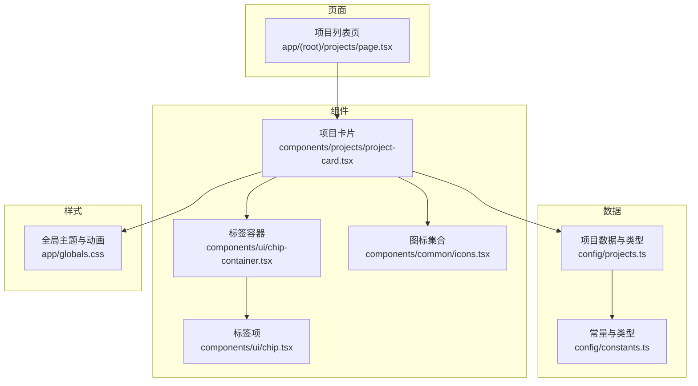
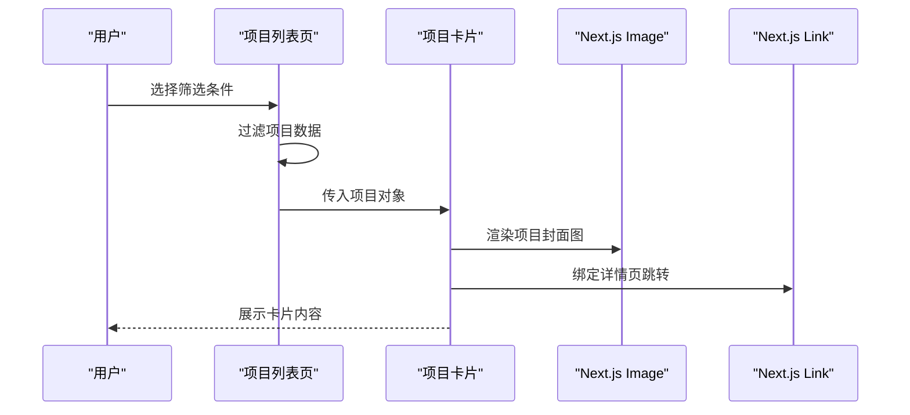
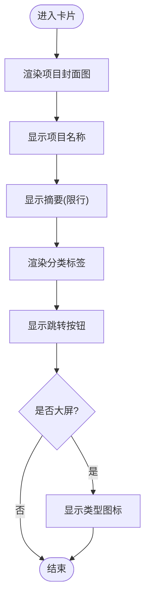
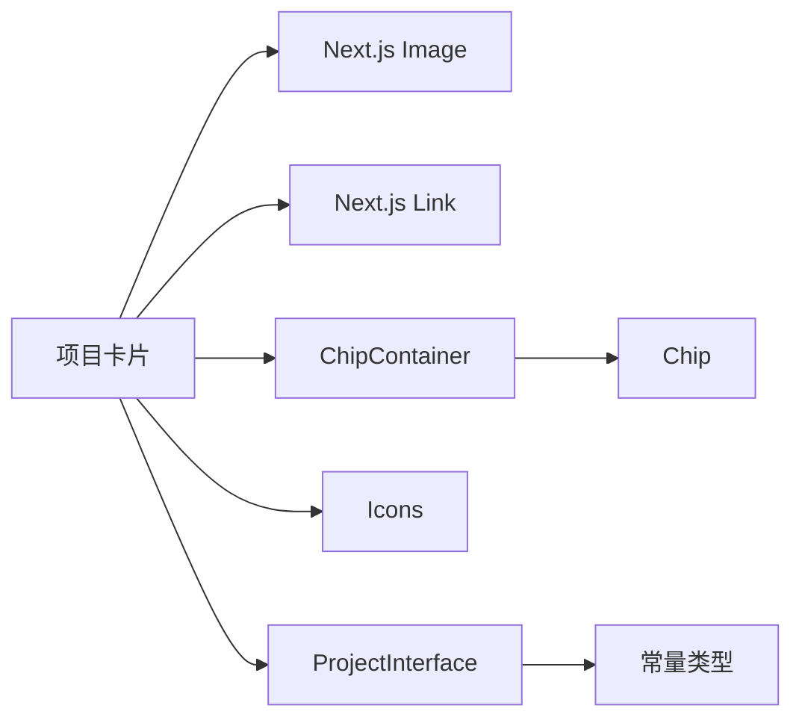

# 项目卡片组件

<cite>
**本文引用的文件**
- [components/projects/project-card.tsx](file://components/projects/project-card.tsx)
- [config/projects.ts](file://config/projects.ts)
- [app/(root)/projects/page.tsx](file://app/(root)/projects/page.tsx)
- [components/ui/chip.tsx](file://components/ui/chip.tsx)
- [components/ui/chip-container.tsx](file://components/ui/chip-container.tsx)
- [components/common/icons.tsx](file://components/common/icons.tsx)
- [config/constants.ts](file://config/constants.ts)
- [app/globals.css](file://app/globals.css)
</cite>

## 目录
1. [简介](#简介)
2. [项目结构](#项目结构)
3. [核心组件与数据模型](#核心组件与数据模型)
4. [架构总览](#架构总览)
5. [详细组件分析](#详细组件分析)
6. [依赖关系分析](#依赖关系分析)
7. [性能考量](#性能考量)
8. [故障排查指南](#故障排查指南)
9. [结论](#结论)
10. [附录：使用示例与定制指南](#附录：使用示例与定制指南)

## 简介
本项目卡片组件用于在“项目”页面中展示每个项目的关键信息，包括项目名称、简短描述、技术栈标签、项目图片以及跳转链接。组件采用响应式布局，适配不同屏幕尺寸；通过主题变量支持多套视觉主题；并通过 Next.js Image 组件优化图片渲染。

## 项目结构
- 组件层：项目卡片位于 components/projects 下，依赖 UI 层的 Chip/ChipContainer、图标库 Icons、以及 Next.js 的 Image 和 Link。
- 数据层：项目数据定义于 config/projects.ts，包含类型约束与示例数据。
- 页面层：项目列表页 app/(root)/projects/page.tsx 负责按类型筛选并渲染多个 ProjectCard。
- 样式层：全局主题变量与动画定义在 app/globals.css，提供多套主题（默认、暗色、复古、赛博朋克、极光、合成波、纸张）。

图表来源
- [app/(root)/projects/page.tsx:14-28](file://app/(root)/projects/page.tsx#L14-L28)
- [components/projects/project-card.tsx:1-51](file://components/projects/project-card.tsx#L1-L51)
- [components/ui/chip-container.tsx:1-16](file://components/ui/chip-container.tsx#L1-L16)
- [components/ui/chip.tsx:1-12](file://components/ui/chip.tsx#L1-L12)
- [config/projects.ts:14-28](file://config/projects.ts#L14-L28)
- [config/constants.ts:65-74](file://config/constants.ts#L65-L74)
- [app/globals.css:28-333](file://app/globals.css#L28-L333)

章节来源
- [app/(root)/projects/page.tsx:1-59](file://app/(root)/projects/page.tsx#L1-L59)
- [components/projects/project-card.tsx:1-51](file://components/projects/project-card.tsx#L1-L51)
- [config/projects.ts:14-28](file://config/projects.ts#L14-L28)
- [config/constants.ts:65-74](file://config/constants.ts#L65-L74)
- [app/globals.css:28-333](file://app/globals.css#L28-L333)

## 核心组件与数据模型
- 项目卡片组件
  - 输入：接收一个项目对象，类型为 ProjectInterface。
  - 输出：渲染项目封面图、标题、摘要、技术栈标签、跳转按钮与类型标识图标。
- 项目数据模型
  - id: 唯一标识
  - type: 项目类型（个人/专业）
  - companyName: 项目名称
  - category: 分类数组（用于标签显示）
  - shortDescription: 简短描述
  - websiteLink/githubLink: 可选的外部链接
  - techStack: 技术栈数组（当前卡片未直接渲染该字段）
  - startDate/endDate: 起止时间（当前卡片未直接渲染）
  - companyLogoImg: 项目封面图路径
  - descriptionDetails/pagesInfoArr: 详情与页面信息（当前卡片未直接渲染）

章节来源
- [components/projects/project-card.tsx:9-11](file://components/projects/project-card.tsx#L9-L11)
- [config/projects.ts:14-28](file://config/projects.ts#L14-L28)
- [config/constants.ts:65-74](file://config/constants.ts#L65-L74)

## 架构总览
项目列表页根据用户选择的标签（全部/个人/专业）过滤项目数据，并将每个项目作为 props 传递给 ProjectCard。ProjectCard 内部组合 Next.js Image、Link、自定义 Chip 组件与图标，完成信息展示与交互。

图表来源
- [app/(root)/projects/page.tsx:14-28](file://app/(root)/projects/page.tsx#L14-L28)
- [components/projects/project-card.tsx:13-49](file://components/projects/project-card.tsx#L13-L49)

## 详细组件分析

### 项目卡片实现原理
- 图片渲染机制
  - 使用 Next.js Image 组件进行图片渲染，设置固定高度与圆角边框，确保在不同设备上保持一致的视觉比例。
- 项目信息展示逻辑
  - 标题：显示项目名称。
  - 摘要：限制行数显示，避免过长文本破坏布局。
  - 技术栈标签：通过 ChipContainer 将项目分类数组渲染为可换行的标签集合。
  - 跳转按钮：使用 Link 包裹 Button，跳转到项目详情页。
  - 类型标识：根据项目类型显示不同的图标（个人/专业），在大屏上可见。
- 响应式设计
  - 使用 Tailwind 断点控制按钮宽度与图标显隐，保证移动端与桌面端体验一致。

图表来源
- [components/projects/project-card.tsx:13-49](file://components/projects/project-card.tsx#L13-L49)

章节来源
- [components/projects/project-card.tsx:13-49](file://components/projects/project-card.tsx#L13-L49)

### 标签系统（Chip/ChipContainer）
- Chip：单个标签项，具备基础样式与可读性优化。
- ChipContainer：接收字符串数组，循环渲染多个 Chip，支持自动换行与间距。

章节来源
- [components/ui/chip.tsx:1-12](file://components/ui/chip.tsx#L1-L12)
- [components/ui/chip-container.tsx:1-16](file://components/ui/chip-container.tsx#L1-L16)

### 图标系统
- 图标集合集中管理，卡片根据项目类型动态选择对应图标，保持界面一致性。

章节来源
- [components/common/icons.tsx:71-131](file://components/common/icons.tsx#L71-L131)

### 数据模型与类型约束
- ProjectInterface 定义了项目卡片的完整数据结构，确保类型安全与可维护性。
- ValidCategory/ValidExpType 等类型来自常量配置，便于统一管理与扩展。

章节来源
- [config/projects.ts:14-28](file://config/projects.ts#L14-L28)
- [config/constants.ts:65-74](file://config/constants.ts#L65-L74)

## 依赖关系分析
- 组件耦合
  - ProjectCard 依赖 Next.js 的 Image/Link、UI 层的 Chip/ChipContainer、图标库、以及项目数据类型。
- 外部依赖
  - Tailwind CSS 提供样式与响应式能力。
  - 主题变量由全局样式注入，支持多主题切换。

图表来源
- [components/projects/project-card.tsx:1-51](file://components/projects/project-card.tsx#L1-L51)
- [components/ui/chip-container.tsx:1-16](file://components/ui/chip-container.tsx#L1-L16)
- [components/ui/chip.tsx:1-12](file://components/ui/chip.tsx#L1-L12)
- [config/projects.ts:14-28](file://config/projects.ts#L14-L28)
- [config/constants.ts:65-74](file://config/constants.ts#L65-L74)

章节来源
- [components/projects/project-card.tsx:1-51](file://components/projects/project-card.tsx#L1-L51)
- [components/ui/chip-container.tsx:1-16](file://components/ui/chip-container.tsx#L1-L16)
- [components/ui/chip.tsx:1-12](file://components/ui/chip.tsx#L1-L12)
- [config/projects.ts:14-28](file://config/projects.ts#L14-L28)
- [config/constants.ts:65-74](file://config/constants.ts#L65-L74)

## 性能考量
- 图片优化
  - 使用 Next.js Image 组件，结合固定高度与 object-cover，减少重排与抖动，提升首屏加载体验。
- 内存管理
  - 列表渲染时以项目 id 作为 key，有助于 React 高效更新与复用节点。
- 渲染策略
  - 当前卡片未对 techStack 字段进行渲染，避免不必要的 DOM 开销；如需展示，建议按需懒加载或分页。
- 主题与样式
  - 通过 CSS 变量与 Tailwind 断点实现响应式与主题切换，减少运行时计算成本。

[本节为通用性能指导，不直接分析具体代码片段]

## 故障排查指南
- 图片无法显示
  - 检查项目数据中的公司 Logo 路径是否正确，确认 public 目录下资源存在。
- 标签显示异常
  - 确认 category 数组是否为字符串数组，且值符合 ValidCategory 类型约束。
- 按钮无响应
  - 检查项目 id 是否存在，并确保路由 /projects/[projectId] 已正确配置。
- 主题颜色不正确
  - 确认根元素是否应用了对应主题类名，检查全局样式中的主题变量定义。

章节来源
- [config/projects.ts:14-28](file://config/projects.ts#L14-L28)
- [config/constants.ts:65-74](file://config/constants.ts#L65-L74)
- [app/globals.css:28-333](file://app/globals.css#L28-L333)

## 结论
项目卡片组件以简洁的数据驱动方式实现了项目信息的清晰展示，结合 Next.js 生态与 Tailwind 的响应式能力，提供了良好的跨设备体验。通过类型约束与模块化设计，组件具备良好的可维护性与扩展性。

[本节为总结性内容，不直接分析具体代码片段]

## 附录：使用示例与定制指南

### 在项目列表页面集成
- 步骤
  - 引入项目数据与 ProjectCard 组件。
  - 根据筛选条件过滤项目数组。
  - 遍历渲染 ProjectCard，并传入项目对象。
- 参考路径
  - [项目列表页](file://app/(root)/projects/page.tsx#L14-L28)

章节来源
- [app/(root)/projects/page.tsx:14-28](file://app/(root)/projects/page.tsx#L14-L28)

### Props 接口说明
- 接受的项目数据格式
  - 遵循 ProjectInterface 定义，包含 id、type、companyName、category、shortDescription、techStack、companyLogoImg 等字段。
- 可选配置选项
  - 当前组件未暴露额外配置 prop；如需扩展（如显示更多字段、自定义按钮文案），可在组件内新增 prop 并在模板中使用。
- 事件处理函数
  - 当前组件未定义回调事件；跳转行为通过 Link 完成。如需埋点或拦截跳转，可在外层包裹事件处理器。

章节来源
- [components/projects/project-card.tsx:9-11](file://components/projects/project-card.tsx#L9-L11)
- [config/projects.ts:14-28](file://config/projects.ts#L14-L28)

### 响应式设计实现
- 布局适配
  - 使用 Tailwind 断点控制按钮宽度与图标显隐，确保移动端友好。
- 图片适配
  - 固定高度与 object-cover 保证图片在不同尺寸下的裁剪一致性。
- 参考路径
  - [项目卡片样式:13-49](file://components/projects/project-card.tsx#L13-L49)

章节来源
- [components/projects/project-card.tsx:13-49](file://components/projects/project-card.tsx#L13-L49)

### 样式定制选项
- 修改视觉外观
  - 通过 Tailwind 类名调整卡片背景、边框、圆角与阴影。
- 颜色主题
  - 基于全局 CSS 变量切换主题（默认、暗色、复古、赛博朋克、极光、合成波、纸张）。
- 动画效果
  - 可利用全局定义的动画变量与过渡属性增强交互反馈。
- 参考路径
  - [全局主题与动画:28-333](file://app/globals.css#L28-L333)

章节来源
- [app/globals.css:28-333](file://app/globals.css#L28-L333)

### 性能优化建议
- 图片懒加载
  - Next.js Image 默认启用懒加载；如需进一步优化，可考虑预加载关键图片或合并小图。
- 内存管理
  - 合理使用 key 与避免重复渲染；对大数据集可采用虚拟滚动或分页。
- 渲染优化
  - 若需展示 techStack，可按需渲染或使用 memo 缓存子组件。

[本节为通用优化建议，不直接分析具体代码片段]