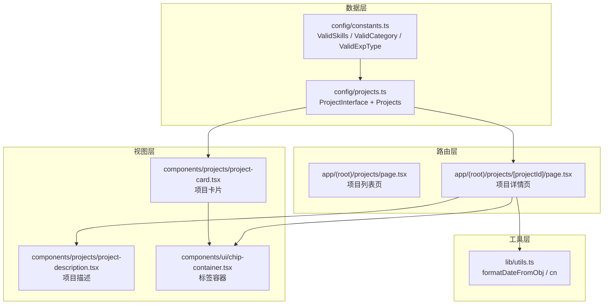
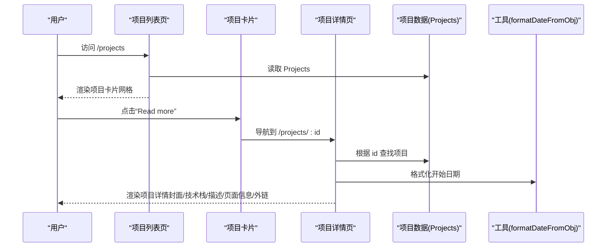
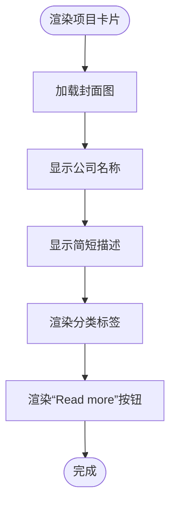
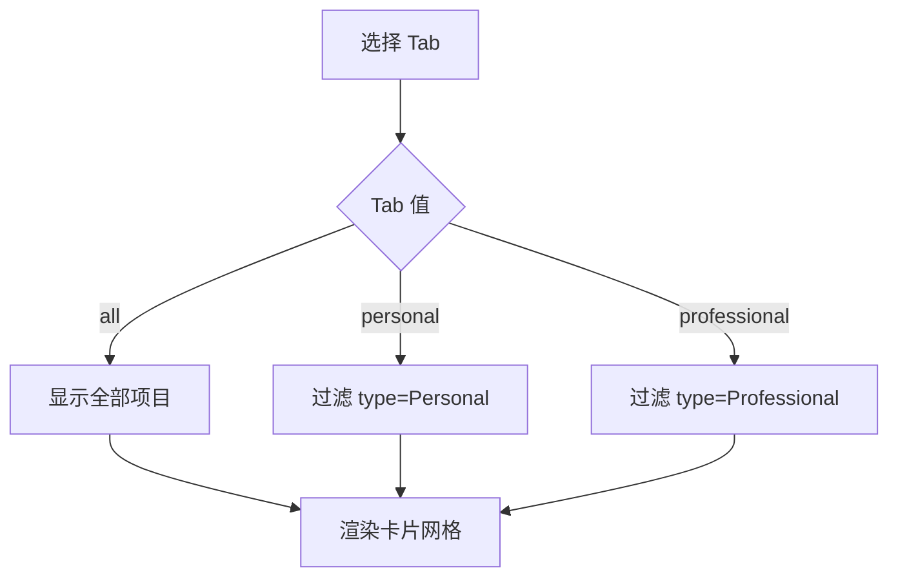
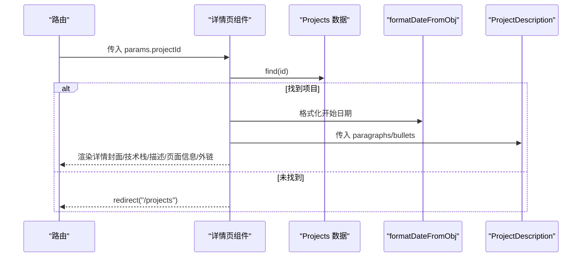
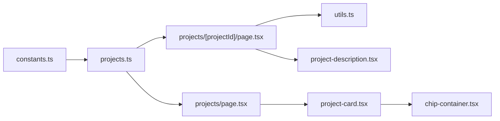

# 项目展示模块

<cite>
**本文引用的文件**
- [config/projects.ts](file://config/projects.ts)
- [components/projects/project-card.tsx](file://components/projects/project-card.tsx)
- [components/projects/project-description.tsx](file://components/projects/project-description.tsx)
- [app/(root)/projects/page.tsx](file://app/(root)/projects/page.tsx)
- [app/(root)/projects/[projectId]/page.tsx](file://app/(root)/projects/[projectId]/page.tsx)
- [config/constants.ts](file://config/constants.ts)
- [components/ui/chip-container.tsx](file://components/ui/chip-container.tsx)
- [lib/utils.ts](file://lib/utils.ts)
- [README.md](file://README.md)
</cite>

## 目录
1. [简介](#简介)
2. [项目结构](#项目结构)
3. [核心组件与数据模型](#核心组件与数据模型)
4. [架构总览](#架构总览)
5. [详细组件分析](#详细组件分析)
6. [依赖关系分析](#依赖关系分析)
7. [性能考虑](#性能考虑)
8. [故障排查指南](#故障排查指南)
9. [结论](#结论)
10. [附录：配置与扩展实践](#附录：配置与扩展实践)

## 简介
本模块负责在 Next.js 投资组合中展示“项目”内容，包括项目列表、项目详情、筛选与跳转等。它通过集中式的项目数据配置（config/projects.ts）驱动 UI 渲染，提供类型安全的字段定义与可扩展的页面信息展示能力。该模块既适合初学者快速上手，也为高级开发者提供了深入定制与扩展的空间。

## 项目结构
项目展示模块由以下关键部分组成：
- 数据层：项目数据结构与示例数据集中在配置文件
- 视图层：项目卡片、项目描述、标签容器等可复用组件
- 路由层：项目列表页与项目详情页（Next.js App Router）
- 工具层：日期格式化、样式合并等通用工具

图表来源
- [config/projects.ts:14-28](file://config/projects.ts#L14-L28)
- [config/constants.ts:1-85](file://config/constants.ts#L1-L85)
- [components/projects/project-card.tsx:1-51](file://components/projects/project-card.tsx#L1-L51)
- [components/projects/project-description.tsx:1-24](file://components/projects/project-description.tsx#L1-L24)
- [components/ui/chip-container.tsx:1-16](file://components/ui/chip-container.tsx#L1-L16)
- [app/(root)/projects/page.tsx:1-59](file://app/(root)/projects/page.tsx#L1-L59)
- [app/(root)/projects/[projectId]/page.tsx:1-159](file://app/(root)/projects/[projectId]/page.tsx#L1-L159)
- [lib/utils.ts:1-25](file://lib/utils.ts#L1-L25)

章节来源
- [config/projects.ts:14-28](file://config/projects.ts#L14-L28)
- [app/(root)/projects/page.tsx:14-29](file://app/(root)/projects/page.tsx#L14-L29)
- [app/(root)/projects/[projectId]/page.tsx:23-159](file://app/(root)/projects/[projectId]/page.tsx#L23-L159)

## 核心组件与数据模型
- ProjectInterface：定义项目的完整数据结构，包含标识、类型、分类、技术栈、起止时间、图片、描述段落与要点、多页面信息等字段，确保类型安全与一致性。
- 项目卡片（ProjectCard）：展示项目缩略图、标题、简短描述、分类标签，并提供跳转到详情的入口。
- 项目描述（ProjectDescription）：渲染项目的详细描述段落与要点列表。
- 项目列表页：基于 tab 切换实现按类型（个人/专业）筛选，并渲染项目卡片网格。
- 项目详情页：根据 URL 参数加载对应项目，展示封面图、技术栈、描述、多页面信息与外链。

章节来源
- [config/projects.ts:14-28](file://config/projects.ts#L14-L28)
- [components/projects/project-card.tsx:9-51](file://components/projects/project-card.tsx#L9-L51)
- [components/projects/project-description.tsx:3-24](file://components/projects/project-description.tsx#L3-L24)
- [app/(root)/projects/page.tsx:14-59](file://app/(root)/projects/page.tsx#L14-L59)
- [app/(root)/projects/[projectId]/page.tsx:15-159](file://app/(root)/projects/[projectId]/page.tsx#L15-L159)

## 架构总览
项目展示模块采用“配置驱动 + 组件化渲染”的架构：
- 配置驱动：所有项目数据集中在单一配置文件，便于维护与扩展。
- 组件化渲染：UI 拆分为卡片、描述、标签等小颗粒组件，提高复用性与可测试性。
- 路由驱动：使用 Next.js App Router 的静态/动态路由组织页面，详情页通过 params 获取 projectId。

图表来源
- [app/(root)/projects/page.tsx:14-59](file://app/(root)/projects/page.tsx#L14-L59)
- [components/projects/project-card.tsx:34-39](file://components/projects/project-card.tsx#L34-L39)
- [app/(root)/projects/[projectId]/page.tsx:23-159](file://app/(root)/projects/[projectId]/page.tsx#L23-L159)
- [lib/utils.ts:17-24](file://lib/utils.ts#L17-L24)

## 详细组件分析

### 数据模型：ProjectInterface
- id：唯一标识，用于路由定位与数据检索。
- type：项目类型（Personal/Professional），用于列表筛选与图标展示。
- companyName：项目名称或公司名，作为卡片与详情页标题。
- category：分类数组（如 Web Dev、Frontend、UI/UX），用于标签展示与潜在筛选维度。
- shortDescription：简短介绍，用于卡片摘要显示。
- websiteLink/githubLink：可选的外部链接，详情页以图标形式呈现并支持新窗口打开。
- techStack：技术栈数组，详情页以标签形式展示。
- startDate/endDate：起止时间，详情页用于展示项目周期。
- companyLogoImg：项目封面图路径，用于卡片与详情页的图片展示。
- descriptionDetails：包含 paragraphs（段落）与 bullets（要点），用于详细描述渲染。
- pagesInfoArr：多页面信息数组，每个元素包含 title、description、imgArr，用于分屏/分块展示项目不同页面或功能截图。

章节来源
- [config/projects.ts:3-28](file://config/projects.ts#L3-L28)
- [config/constants.ts:65-74](file://config/constants.ts#L65-L74)

### 项目卡片组件：ProjectCard
- 图片展示：使用 Next.js Image 组件进行自适应尺寸与优化。
- 标题与摘要：显示公司名称与简短描述，限制行数避免溢出。
- 分类标签：通过 ChipContainer 渲染 category 数组为标签。
- 链接跳转：按钮链接至 /projects/:id，进入详情页。
- 类型标识：右下角图标根据 type 显示个人/职业标识。

图表来源
- [components/projects/project-card.tsx:13-51](file://components/projects/project-card.tsx#L13-L51)

章节来源
- [components/projects/project-card.tsx:13-51](file://components/projects/project-card.tsx#L13-L51)

### 项目描述组件：ProjectDescription
- 段落渲染：将 paragraphs 数组逐项渲染为段落。
- 要点列表：将 bullets 数组渲染为有序列表项。
- 样式：使用基础排版样式，保证可读性。

章节来源
- [components/projects/project-description.tsx:3-24](file://components/projects/project-description.tsx#L3-L24)

### 项目列表页：/projects
- 数据来源：从 Projects 数组读取全部项目。
- 筛选逻辑：根据当前 tab（all/personal/professional）过滤 type 字段。
- 布局：响应式网格，每列在不同屏幕下自适应。
- 交互：点击卡片进入详情页。

图表来源
- [app/(root)/projects/page.tsx:14-29](file://app/(root)/projects/page.tsx#L14-L29)

章节来源
- [app/(root)/projects/page.tsx:14-59](file://app/(root)/projects/page.tsx#L14-L59)

### 项目详情页：/projects/[projectId]
- 参数解析：异步获取 params.projectId。
- 数据查找：在 Projects 中按 id 查找，未找到则重定向到列表页。
- 展示内容：
  - 开始日期：使用 formatDateFromObj 格式化。
  - 标题与外链：GitHub 与网站链接，带 Tooltip 提示。
  - 分类与技术栈：通过 ChipContainer 渲染。
  - 描述：调用 ProjectDescription 渲染段落与要点。
  - 多页面信息：遍历 pagesInfoArr，渲染标题、描述与图片集合。
- 返回导航：提供回到“所有项目”的链接。

图表来源
- [app/(root)/projects/[projectId]/page.tsx:23-159](file://app/(root)/projects/[projectId]/page.tsx#L23-L159)
- [lib/utils.ts:17-24](file://lib/utils.ts#L17-L24)
- [components/projects/project-description.tsx:3-24](file://components/projects/project-description.tsx#L3-L24)

章节来源
- [app/(root)/projects/[projectId]/page.tsx:23-159](file://app/(root)/projects/[projectId]/page.tsx#L23-L159)

## 依赖关系分析
- 数据依赖：
  - ProjectInterface 依赖 constants 中的 ValidSkills、ValidCategory、ValidExpType，确保类型一致。
  - 列表页与详情页均依赖 Projects 数组。
- 组件依赖：
  - ProjectCard 依赖 ChipContainer 与 Icons。
  - 详情页依赖 ProjectDescription、ChipContainer、工具函数与站点配置。
- 工具依赖：
  - 日期格式化使用 lib/utils.ts 的 formatDateFromObj。
  - 样式合并使用 cn 工具函数。

图表来源
- [config/constants.ts:1-85](file://config/constants.ts#L1-L85)
- [config/projects.ts:14-28](file://config/projects.ts#L14-L28)
- [app/(root)/projects/page.tsx:1-59](file://app/(root)/projects/page.tsx#L1-59)
- [app/(root)/projects/[projectId]/page.tsx:1-159](file://app/(root)/projects/[projectId]/page.tsx#L1-159)
- [components/projects/project-card.tsx:1-51](file://components/projects/project-card.tsx#L1-51)
- [components/projects/project-description.tsx:1-24](file://components/projects/project-description.tsx#L1-24)
- [components/ui/chip-container.tsx:1-16](file://components/ui/chip-container.tsx#L1-16)
- [lib/utils.ts:1-25](file://lib/utils.ts#L1-25)

章节来源
- [config/constants.ts:1-85](file://config/constants.ts#L1-L85)
- [config/projects.ts:14-28](file://config/projects.ts#L14-L28)
- [components/projects/project-card.tsx:1-51](file://components/projects/project-card.tsx#L1-51)
- [components/projects/project-description.tsx:1-24](file://components/projects/project-description.tsx#L1-24)
- [app/(root)/projects/page.tsx:1-59](file://app/(root)/projects/page.tsx#L1-59)
- [app/(root)/projects/[projectId]/page.tsx:1-159](file://app/(root)/projects/[projectId]/page.tsx#L1-159)
- [lib/utils.ts:1-25](file://lib/utils.ts#L1-25)

## 性能考虑
- 图片优化：使用 Next.js Image 组件，设置合适的尺寸与优先级，减少首屏负载。
- 服务端渲染：详情页为异步组件，利于 SEO 与首屏性能。
- 数据集中：项目数据集中管理，减少重复请求与状态同步成本。
- 标签渲染：ChipContainer 轻量且无额外状态，适合大量标签场景。
- 路由懒加载：详情页按需加载，避免不必要的资源消耗。

[本节为通用性能建议，不直接分析具体代码文件]

## 故障排查指南
- 详情页 404 或重定向：
  - 检查项目中是否存在对应 id，若不存在会重定向到列表页。
  - 确认路由参数 projectId 是否正确传递。
- 图片不显示：
  - 确认 companyLogoImg 与 pagesInfoArr.imgArr 的路径正确且资源存在。
- 日期格式异常：
  - 检查 startDate 是否为 Date 对象，并使用 formatDateFromObj 格式化。
- 筛选无效：
  - 确认 type 字段值为 Personal 或 Professional，且与 tab 值匹配。
- 链接不可用：
  - websiteLink/githubLink 可能暂时不可用，建议在部署前验证外部链接有效性。

章节来源
- [app/(root)/projects/[projectId]/page.tsx:23-28](file://app/(root)/projects/[projectId]/page.tsx#L23-L28)
- [lib/utils.ts:17-24](file://lib/utils.ts#L17-L24)
- [app/(root)/projects/page.tsx:14-29](file://app/(root)/projects/page.tsx#L14-L29)

## 结论
项目展示模块通过类型化的数据模型与组件化渲染，实现了清晰、可维护且高性能的项目展示能力。其配置驱动的设计使得新增与修改项目变得简单直观；同时，列表页的筛选与详情页的多页面信息展示为高级定制提供了良好基础。结合工具函数与 Next.js 生态，该模块在易用性与扩展性之间取得了平衡。

[本节为总结性内容，不直接分析具体代码文件]

## 附录：配置与扩展实践

### 如何添加新项目
- 在 config/projects.ts 中添加一个 ProjectInterface 对象，填写必要字段（id、companyName、type、category、shortDescription、techStack、startDate、endDate、companyLogoImg、descriptionDetails、pagesInfoArr）。
- 如需外链，补充 websiteLink 与 githubLink。
- 保存后，列表页会自动渲染新卡片，详情页可通过 /projects/:id 访问。

章节来源
- [config/projects.ts:30-596](file://config/projects.ts#L30-L596)

### 如何修改现有项目信息
- 直接编辑对应项目的字段，例如更新短描述、技术栈、起止时间或多页面信息。
- 若需调整分类或类型，请确保与常量定义一致（ValidCategory、ValidExpType）。

章节来源
- [config/constants.ts:65-74](file://config/constants.ts#L65-L74)
- [config/projects.ts:30-596](file://config/projects.ts#L30-L596)

### 自定义显示格式
- 卡片样式：可在 project-card.tsx 中调整布局、间距与样式类。
- 标签样式：可在 chip-container.tsx 与 chip 组件中统一调整标签外观。
- 详情页排版：可在详情页中调整标题层级、图片尺寸与间距。
- 日期格式：通过 lib/utils.ts 的 formatDateFromObj 自定义输出格式。

章节来源
- [components/projects/project-card.tsx:13-51](file://components/projects/project-card.tsx#L13-L51)
- [components/ui/chip-container.tsx:1-16](file://components/ui/chip-container.tsx#L1-16)
- [app/(root)/projects/[projectId]/page.tsx:42-106](file://app/(root)/projects/[projectId]/page.tsx#L42-L106)
- [lib/utils.ts:17-24](file://lib/utils.ts#L17-L24)

### 实现筛选、搜索与排序（扩展指导）
- 筛选：
  - 当前已实现按 type 筛选（Personal/Professional）。
  - 可扩展为按 category 多选筛选，或在列表页增加更多 tab。
- 搜索：
  - 可在列表页增加输入框，对 companyName、shortDescription、techStack 进行模糊匹配。
  - 注意防抖与性能优化，避免频繁重渲染。
- 排序：
  - 可按 startDate、endDate 或字母序对项目进行排序。
  - 在 renderContent 中引入排序逻辑，保持与筛选组合时的稳定性。

[本节为扩展指导，不直接分析具体代码文件]

### 最佳实践
- 保持数据与视图分离：所有项目元数据集中在配置文件，UI 仅负责渲染。
- 类型安全：严格使用 TypeScript 类型，避免运行时错误。
- 可访问性：为图片提供 alt 文本，外链提供 Tooltip 说明。
- 性能优先：合理使用 Next.js Image、服务端渲染与懒加载。
- 可维护性：模块化拆分组件，遵循单一职责原则。

[本节为最佳实践建议，不直接分析具体代码文件]