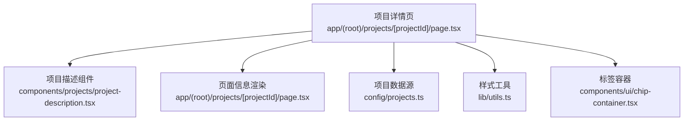
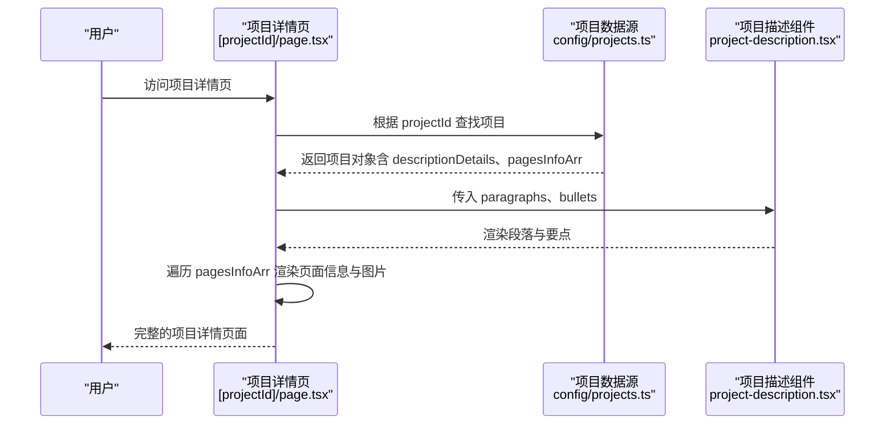
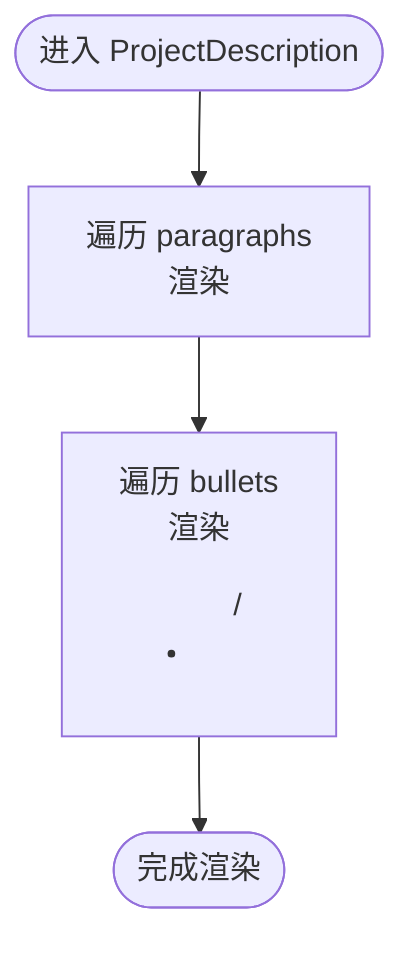
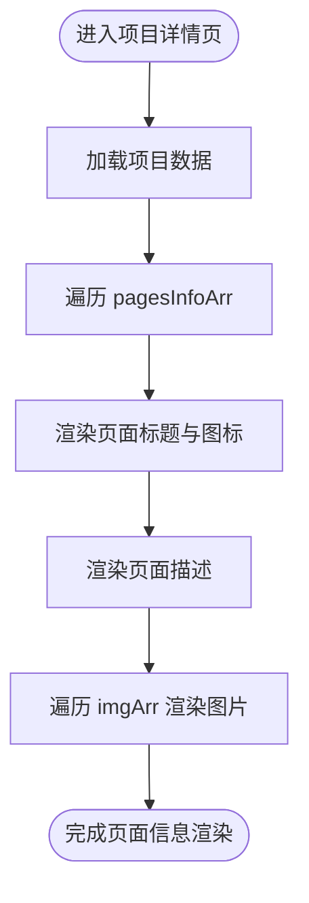
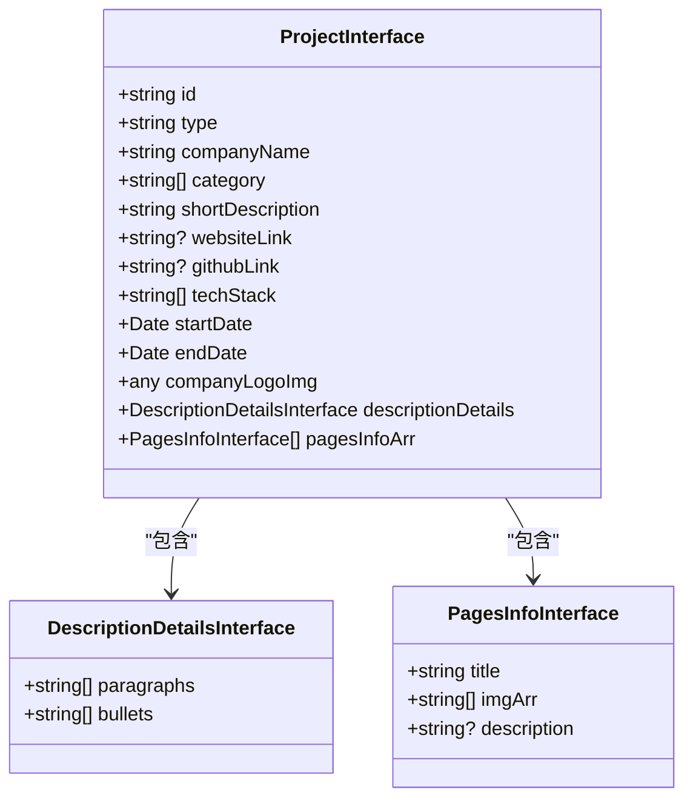
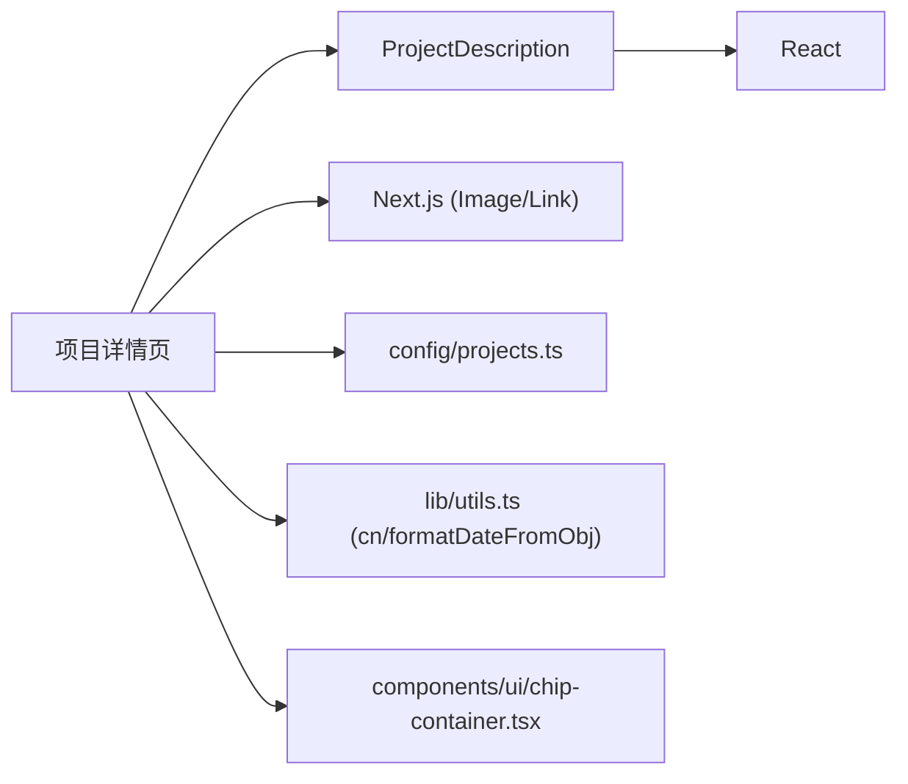

# 项目描述组件

<cite>
**本文引用的文件**
- [components/projects/project-description.tsx](file://components/projects/project-description.tsx)
- [app/(root)/projects/[projectId]/page.tsx](file://app/(root)/projects/[projectId]/page.tsx)
- [config/projects.ts](file://config/projects.ts)
- [components/ui/chip-container.tsx](file://components/ui/chip-container.tsx)
- [lib/utils.ts](file://lib/utils.ts)
</cite>

## 目录
1. [简介](#简介)
2. [项目结构](#项目结构)
3. [核心组件](#核心组件)
4. [架构总览](#架构总览)
5. [详细组件分析](#详细组件分析)
6. [依赖关系分析](#依赖关系分析)
7. [性能考量](#性能考量)
8. [故障排查指南](#故障排查指南)
9. [结论](#结论)
10. [附录](#附录)

## 简介
本项目描述组件用于在项目详情页中渲染项目的多段落描述、要点列表以及页面信息数组。它通过接收纯文本的段落与要点数据，以语义化标签进行展示；同时，项目页面对 pagesInfoArr 进行遍历渲染，展示每个页面的标题、描述与图片集合。该组件设计简洁、可组合性强，便于在不同项目中复用。

## 项目结构
- 组件层：项目描述组件位于 components/projects/project-description.tsx，负责渲染 paragraphs 与 bullets。
- 页面层：项目详情页面位于 app/(root)/projects/[projectId]/page.tsx，负责从配置中获取项目数据并传递给描述组件及渲染页面信息。
- 数据层：项目数据结构定义在 config/projects.ts，包含 DescriptionDetailsInterface（paragraphs、bullets）与 PagesInfoInterface[]（pagesInfoArr）。
- 辅助层：样式工具类 cn 来自 lib/utils.ts，UI 标签容器 ChipContainer 来自 components/ui/chip-container.tsx。

图表来源
- [app/(root)/projects/[projectId]/page.tsx:113-143](file://app/(root)/projects/[projectId]/page.tsx#L113-L143)
- [components/projects/project-description.tsx:3-21](file://components/projects/project-description.tsx#L3-L21)
- [config/projects.ts:3-28](file://config/projects.ts#L3-L28)
- [lib/utils.ts:4-6](file://lib/utils.ts#L4-L6)
- [components/ui/chip-container.tsx:7-13](file://components/ui/chip-container.tsx#L7-L13)

章节来源
- [app/(root)/projects/[projectId]/page.tsx:113-143](file://app/(root)/projects/[projectId]/page.tsx#L113-L143)
- [components/projects/project-description.tsx:3-21](file://components/projects/project-description.tsx#L3-L21)
- [config/projects.ts:3-28](file://config/projects.ts#L3-L28)
- [lib/utils.ts:4-6](file://lib/utils.ts#L4-L6)
- [components/ui/chip-container.tsx:7-13](file://components/ui/chip-container.tsx#L7-L13)

## 核心组件
- ProjectDescription：接收 paragraphs（字符串数组）和 bullets（字符串数组），分别以 
 与 <ul>/<li> 渲染。
- 项目详情页：从 Projects 配置中查找对应项目，将 descriptionDetails.paragraphs 与 descriptionDetails.bullets 传入 ProjectDescription，并将 pagesInfoArr 逐项渲染为标题、描述与图片。

章节来源
- [components/projects/project-description.tsx:3-21](file://components/projects/project-description.tsx#L3-L21)
- [app/(root)/projects/[projectId]/page.tsx:113-143](file://app/(root)/projects/[projectId]/page.tsx#L113-L143)
- [config/projects.ts:9-28](file://config/projects.ts#L9-L28)

## 架构总览
项目详情页作为入口，负责数据装配与布局组织；ProjectDescription 专注于描述内容的呈现；配置模块提供强类型的数据结构，确保前后端一致性与可维护性。

图表来源
- [app/(root)/projects/[projectId]/page.tsx:23-28](file://app/(root)/projects/[projectId]/page.tsx#L23-L28)
- [app/(root)/projects/[projectId]/page.tsx:113-143](file://app/(root)/projects/[projectId]/page.tsx#L113-L143)
- [config/projects.ts:30-70](file://config/projects.ts#L30-L70)

## 详细组件分析

### ProjectDescription 组件
- 输入参数
  - paragraphs: string[]，段落内容数组
  - bullets: string[]，要点内容数组
- 渲染逻辑
  - 使用 map 遍历 paragraphs，生成多个 
 元素，设置段间距
  - 使用 map 遍历 bullets，生成 <ul> 与多个 <li> 元素，设置列表缩进与上边距
- 可访问性
  - 使用语义化标签 
 与 <ul>/<li>，利于屏幕阅读器识别结构与层级
  - 当前未添加 aria-* 属性或 role，但语义标签已满足基础无障碍需求
- 样式与主题
  - 基于 Tailwind CSS 类名控制间距与列表样式，可通过覆盖类名或扩展主题调整视觉参数
- 安全处理
  - 当前直接渲染字符串，不解析 HTML；如需支持富文本，应引入安全的 HTML 渲染方案并进行清洗

图表来源
- [components/projects/project-description.tsx:8-19](file://components/projects/project-description.tsx#L8-L19)

章节来源
- [components/projects/project-description.tsx:3-21](file://components/projects/project-description.tsx#L3-L21)

### 项目详情页对 pagesInfoArr 的处理
- 数据来源：Projects 配置中的 pagesInfoArr，类型为 PagesInfoInterface[]
- 渲染流程
  - 遍历 pagesInfoArr，为每个页面项渲染标题（带图标）、描述与图片数组
  - 图片使用 Next.js Image 组件，设置宽高与优先级以提升加载体验
- 可访问性
  - 图片 alt 使用 img 路径作为替代文本，建议优化为更具描述性的文本以提升可访问性
- 样式与主题
  - 使用 Tailwind 类名控制边框、圆角、背景色与过渡效果

图表来源
- [app/(root)/projects/[projectId]/page.tsx:119-143](file://app/(root)/projects/[projectId]/page.tsx#L119-L143)
- [config/projects.ts:3-7](file://config/projects.ts#L3-L7)

章节来源
- [app/(root)/projects/[projectId]/page.tsx:119-143](file://app/(root)/projects/[projectId]/page.tsx#L119-L143)
- [config/projects.ts:3-7](file://config/projects.ts#L3-L7)

### 数据类型与数据结构
- DescriptionDetailsInterface
  - paragraphs: string[]，段落数组
  - bullets: string[]，要点数组
- PagesInfoInterface
  - title: string，页面标题
  - imgArr: string[]，图片路径数组
  - description?: string，可选的页面描述
- ProjectInterface
  - 包含 id、type、companyName、category、shortDescription、websiteLink、githubLink、techStack、startDate、endDate、companyLogoImg、descriptionDetails、pagesInfoArr

图表来源
- [config/projects.ts:3-28](file://config/projects.ts#L3-L28)

章节来源
- [config/projects.ts:3-28](file://config/projects.ts#L3-L28)

### 集成示例（项目详情页）
- 在项目中引用 ProjectDescription，并传入 paragraphs 与 bullets
- 遍历 pagesInfoArr 渲染页面信息与图片
- 使用 ChipContainer 展示分类与技术栈
- 使用 formatDateFromObj 格式化日期显示

章节来源
- [app/(root)/projects/[projectId]/page.tsx:113-143](file://app/(root)/projects/[projectId]/page.tsx#L113-L143)
- [components/ui/chip-container.tsx:7-13](file://components/ui/chip-container.tsx#L7-L13)
- [lib/utils.ts:17-24](file://lib/utils.ts#L17-L24)

## 依赖关系分析
- 组件依赖
  - ProjectDescription 仅依赖 React，无外部 UI 库耦合
  - 项目详情页依赖 Next.js 的 Image、Link、导航与图标组件
- 数据依赖
  - 项目数据来源于 config/projects.ts，类型定义保证数据结构一致性
- 样式依赖
  - 使用 Tailwind CSS 类名进行样式控制，通过 lib/utils.ts 的 cn 工具合并类名
- 潜在循环依赖
  - 当前结构清晰，未发现循环依赖

图表来源
- [components/projects/project-description.tsx:1-6](file://components/projects/project-description.tsx#L1-L6)
- [app/(root)/projects/[projectId]/page.tsx:1-13](file://app/(root)/projects/[projectId]/page.tsx#L1-L13)
- [config/projects.ts:1-28](file://config/projects.ts#L1-L28)
- [lib/utils.ts:1-6](file://lib/utils.ts#L1-L6)
- [components/ui/chip-container.tsx:1-13](file://components/ui/chip-container.tsx#L1-L13)

章节来源
- [components/projects/project-description.tsx:1-6](file://components/projects/project-description.tsx#L1-L6)
- [app/(root)/projects/[projectId]/page.tsx:1-13](file://app/(root)/projects/[projectId]/page.tsx#L1-L13)
- [config/projects.ts:1-28](file://config/projects.ts#L1-L28)
- [lib/utils.ts:1-6](file://lib/utils.ts#L1-L6)
- [components/ui/chip-container.tsx:1-13](file://components/ui/chip-container.tsx#L1-L13)

## 性能考量
- 渲染效率
  - ProjectDescription 使用简单 map 渲染，时间复杂度 O(n)，适合中小规模数据
  - 若段落与要点数量较大，可考虑虚拟滚动或分页加载
- 图片加载
  - 使用 Next.js Image 组件并设置 priority，有助于首屏关键图片的优先加载
- 样式合并
  - 通过 cn 工具合并类名，避免重复样式与冲突
- 可扩展性
  - 当前组件无状态，易于测试与复用；如需复杂交互，可引入状态管理或子组件拆分

## 故障排查指南
- 常见问题
  - 空段落或要点：确保传入数组非空，或在组件内增加空值判断以避免渲染空白区域
  - 图片路径错误：检查 pagesInfoArr 中的 imgArr 路径是否正确，并确保资源存在
  - 类型不匹配：确认 config/projects.ts 中的数据结构与页面传递一致，避免运行时类型错误
- 调试建议
  - 在浏览器开发者工具中检查 DOM 结构与类名应用情况
  - 使用控制台日志输出项目数据，验证数据完整性
- 可访问性改进
  - 为图片提供更准确的 alt 文本，提升屏幕阅读器体验
  - 可为列表与段落添加适当的 aria-label 或 role，增强语义表达

章节来源
- [app/(root)/projects/[projectId]/page.tsx:119-143](file://app/(root)/projects/[projectId]/page.tsx#L119-L143)
- [config/projects.ts:3-28](file://config/projects.ts#L3-L28)

## 结论
项目描述组件以简洁的方式实现了多段落与要点的渲染，并通过项目详情页对 pagesInfoArr 的遍历展示了丰富的页面信息。整体架构清晰、依赖明确，具备良好的可维护性与扩展性。对于初学者，可直接按现有模式集成；对于高级开发者，可在安全性（HTML 渲染）、性能（大数据量渲染）与可访问性方面进行深度定制与优化。

## 附录

### 自定义选项与视觉参数
- 内容布局
  - 段落间距：通过 Tailwind 的 mb-4 控制，可调整为其他间距类
  - 列表样式：通过 list-disc 与 pl-6 控制列表符号与缩进，可替换为其他样式类
- 样式主题
  - 颜色与字体：通过全局 Tailwind 主题或组件内类名覆盖实现
  - 响应式：可使用断点类名适配不同屏幕尺寸
- 字体大小
  - 通过 text-* 类名调整段落与标题字号，或使用自定义 CSS 变量

### 富文本与安全处理
- 当前组件仅渲染纯文本，不解析 HTML
- 如需支持富文本，建议引入安全的 HTML 渲染库（如 DOMPurify 清洗后渲染），并在组件内实现安全策略

### 可访问性支持
- 语义化标签：
、<ul>、<li>、<h2>、<h3> 等，利于屏幕阅读器识别
- 键盘导航：默认链接与按钮支持键盘操作；如需自定义交互，需确保焦点管理与 Tab 顺序正确
- 屏幕阅读器兼容性：为图片提供有意义的 alt 文本，必要时添加 aria-* 属性

### 基本使用方法（项目详情页集成）
- 从 Projects 配置中获取项目数据
- 将 descriptionDetails.paragraphs 与 descriptionDetails.bullets 传入 ProjectDescription
- 遍历 pagesInfoArr 渲染页面信息与图片
- 使用 ChipContainer 展示分类与技术栈，使用 formatDateFromObj 格式化日期

章节来源
- [app/(root)/projects/[projectId]/page.tsx:113-143](file://app/(root)/projects/[projectId]/page.tsx#L113-L143)
- [components/ui/chip-container.tsx:7-13](file://components/ui/chip-container.tsx#L7-L13)
- [lib/utils.ts:17-24](file://lib/utils.ts#L17-L24)