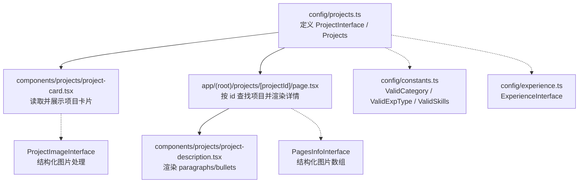
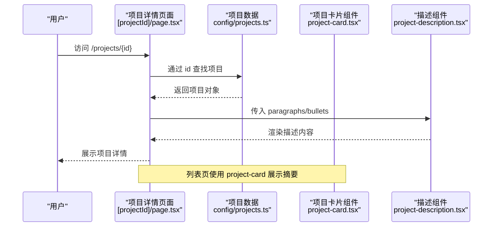
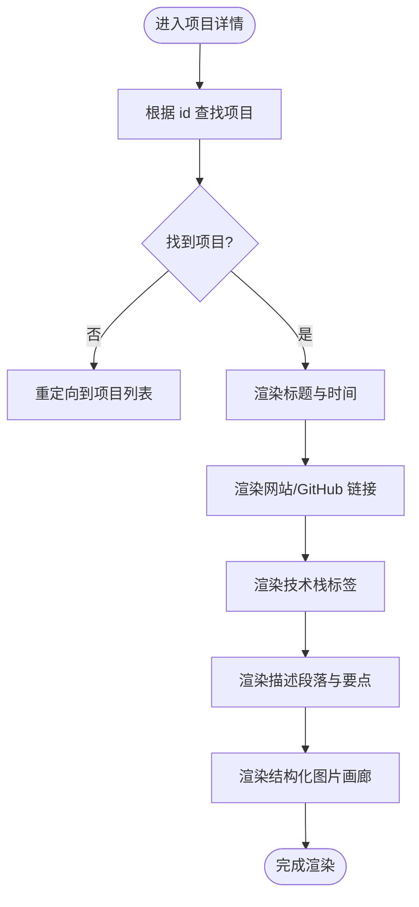
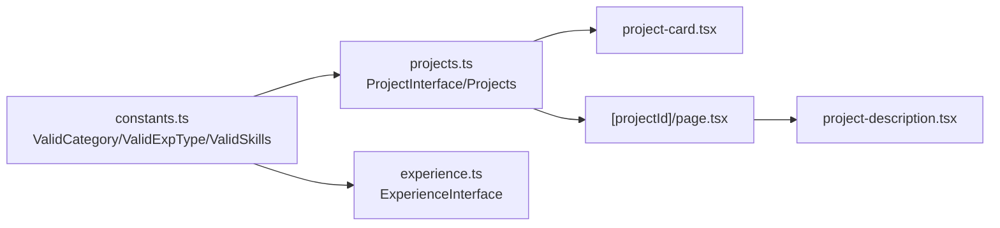

# 项目数据模型

<cite>
**本文引用的文件**
- [config/projects.ts](file://config/projects.ts)
- [config/constants.ts](file://config/constants.ts)
- [components/projects/project-card.tsx](file://components/projects/project-card.tsx)
- [app/(root)/projects/[projectId]/page.tsx](file://app/(root)/projects/[projectId]/page.tsx)
- [components/projects/project-description.tsx](file://components/projects/project-description.tsx)
- [config/experience.ts](file://config/experience.ts)
</cite>

## 更新摘要
**变更内容**
- 新增 ProjectImageInterface 接口，支持更复杂的图片处理功能
- PagesInfoInterface 从简单字符串数组升级为结构化图片数组
- 增强技术栈类型定义，支持更多专业后端技术栈
- 项目配置完全中文化，包含详细的中文项目描述
- 新增经验数据模型，支持职业经历管理

## 目录
1. [简介](#简介)
2. [项目结构](#项目结构)
3. [核心组件](#核心组件)
4. [架构总览](#架构总览)
5. [详细组件分析](#详细组件分析)
6. [依赖关系分析](#依赖关系分析)
7. [性能与可维护性](#性能与可维护性)
8. [故障排查指南](#故障排查指南)
9. [结论](#结论)
10. [附录：配置示例与最佳实践](#附录：配置示例与最佳实践)

## 简介
本文件面向Next.js投资组合项目中的"项目"数据模型，系统性说明ProjectInterface接口、PagesInfoInterface与DescriptionDetailsInterface的结构设计，以及ValidCategory、ValidExpType、ValidSkills等枚举类型的使用场景。**最新更新**包括新增的ProjectImageInterface接口，用于支持更复杂的图片处理功能，以及PagesInfoInterface的结构化升级，现在支持带元数据的图片数组而非简单字符串数组。文档同时提供添加新项目的步骤、字段校验规则与最佳实践，帮助初学者快速理解数据结构，并为高级开发者提供扩展与自定义指导。

## 项目结构
本项目将项目数据集中定义在配置层（config），并通过页面组件消费这些数据。关键路径如下：
- 数据定义与示例：config/projects.ts
- 枚举常量：config/constants.ts
- 列表展示：components/projects/project-card.tsx
- 详情页面：app/(root)/projects/[projectId]/page.tsx
- 描述渲染：components/projects/project-description.tsx
- 经验数据：config/experience.ts



**图表来源**
- [config/projects.ts:1-64](file://config/projects.ts#L1-L64)
- [config/constants.ts:1-91](file://config/constants.ts#L1-L91)
- [components/projects/project-card.tsx:1-51](file://components/projects/project-card.tsx#L1-L51)
- [app/(root)/projects/[projectId]/page.tsx:1-191](file://app/(root)/projects/[projectId]/page.tsx#L1-L191)
- [components/projects/project-description.tsx:1-24](file://components/projects/project-description.tsx#L1-L24)
- [config/experience.ts:1-69](file://config/experience.ts#L1-L69)

**章节来源**
- [config/projects.ts:1-64](file://config/projects.ts#L1-L64)
- [config/constants.ts:1-91](file://config/constants.ts#L1-L91)
- [components/projects/project-card.tsx:1-51](file://components/projects/project-card.tsx#L1-L51)
- [app/(root)/projects/[projectId]/page.tsx:1-191](file://app/(root)/projects/[projectId]/page.tsx#L1-L191)
- [components/projects/project-description.tsx:1-24](file://components/projects/project-description.tsx#L1-L24)
- [config/experience.ts:1-69](file://config/experience.ts#L1-L69)

## 核心组件
- **ProjectInterface**：项目主数据模型，包含标识、分类、技术栈、时间、图片、描述与多页信息。
- **ProjectImageInterface**：**新增** 结构化图片接口，支持src、alt、width、height及display模式控制。
- **PagesInfoInterface**：**已更新** 用于项目详情页的"分节/分页"信息，现在包含结构化图片数组、布局控制和可选描述。
- **DescriptionDetailsInterface**：项目详细描述的结构化内容，包含段落与要点列表。
- **ExperienceInterface**：**新增** 职业经验数据模型，支持职位、公司、技能、成就等信息。
- **枚举类型**：
  - ValidCategory：项目类别集合（如 Full Stack、Frontend、Backend、UI/UX、Web Dev、Mobile Dev、3D Modeling）。
  - ValidExpType：项目类型（Personal 或 Professional）。
  - ValidSkills：**已增强** 技术栈标签集合，新增Spring Cloud Alibaba、Nacos、RabbitMQ等专业后端技术。

**章节来源**
- [config/projects.ts:3-64](file://config/projects.ts#L3-L64)
- [config/constants.ts:1-91](file://config/constants.ts#L1-L91)
- [config/experience.ts:3-15](file://config/experience.ts#L3-L15)

## 架构总览
下图展示了从数据到视图的调用链：页面根据路由参数获取项目ID，在Projects中查找对应项目，再将其字段传递给子组件进行渲染。



**图表来源**
- [app/(root)/projects/[projectId]/page.tsx:21-191](file://app/(root)/projects/[projectId]/page.tsx#L21-L191)
- [config/projects.ts:66-422](file://config/projects.ts#L66-L422)
- [components/projects/project-description.tsx:3-21](file://components/projects/project-description.tsx#L3-L21)
- [components/projects/project-card.tsx:9-51](file://components/projects/project-card.tsx#L9-L51)

## 详细组件分析

### ProjectImageInterface 接口设计
**新增** 用于支持更复杂的图片处理功能：
- src: string — 图片资源路径
- alt: string — 图片替代文本，用于无障碍访问
- width: number — 图片宽度，用于响应式优化
- height: number — 图片高度，用于响应式优化
- display?: "full" | "compact" — 可选显示模式，控制图片展示样式

**章节来源**
- [config/projects.ts:3-9](file://config/projects.ts#L3-L9)

### PagesInfoInterface 接口设计
**已更新** 从简单字符串数组升级为结构化图片数组：
- title: string — 分节标题
- images: ProjectImageInterface[] — **新增** 结构化图片数组，替代原来的imgArr字符串数组
- description?: string — 可选的分节描述
- layout?: "stack" | "grid" — **新增** 布局控制，支持堆叠或网格布局
- source?: { label: string; href: string } — **新增** 图片来源标注

**章节来源**
- [config/projects.ts:11-20](file://config/projects.ts#L11-L20)

### DescriptionDetailsInterface 接口设计
- paragraphs: string[] — 段落文本数组，用于长文描述
- bullets: string[] — 要点列表，用于强调关键特性或成果

这些结构使详情页具备"图文混排 + 要点清单"的可读性布局，便于在不同项目中复用一致的展示方式。

**章节来源**
- [config/projects.ts:22-25](file://config/projects.ts#L22-L25)
- [components/projects/project-description.tsx:3-21](file://components/projects/project-description.tsx#L3-L21)

### ExperienceInterface 接口设计
**新增** 职业经验数据模型：
- id: string — 唯一标识符
- position: string — 职位名称
- company: string — 公司名称
- location: string — 工作地点
- startDate: Date — 开始日期
- endDate: Date | "Present" — 结束日期或当前在职
- description: string[] — 工作描述数组
- achievements: string[] — 成就列表
- skills: ValidSkills[] — 使用的技能
- companyUrl?: string — 公司网站链接
- logo?: string — 公司Logo

**章节来源**
- [config/experience.ts:3-15](file://config/experience.ts#L3-L15)

### 枚举类型：ValidCategory、ValidExpType、ValidSkills
- **ValidCategory**：统一项目分类，避免自由文本导致的展示不一致。
  - 典型值：Full Stack、Frontend、Backend、UI/UX、Web Dev、Mobile Dev、3D Modeling。
- **ValidExpType**：区分项目性质（个人/职业），影响图标与过滤逻辑。
  - 取值：Personal | Professional。
- **ValidSkills**：**已增强** 统一技术栈标签集合，确保前端展示一致性与可维护性。
  - 新增专业后端技术：Spring Cloud Alibaba、Nacos、RabbitMQ、Netty、Elasticsearch、InfluxDB、WebSocket、Spring AI、MCP、Canal、Qwen3、Kafka、MinIO、高德SDK、SLS、OSS等。

**章节来源**
- [config/constants.ts:1-91](file://config/constants.ts#L1-L91)

### 数据到视图的交互流程
- **列表页**：project-card.tsx 接收 ProjectInterface，展示公司名称、短描述、分类标签与类型图标。
- **详情页**：[projectId]/page.tsx 通过 id 从 Projects 中查找项目，渲染标题、时间、链接、技术栈与描述。
- **描述渲染**：project-description.tsx 将 paragraphs 渲染为段落，bullets 渲染为要点列表。
- **图片画廊**：详情页现在支持结构化图片数组，支持不同布局和显示模式。



**图表来源**
- [app/(root)/projects/[projectId]/page.tsx:21-191](file://app/(root)/projects/[projectId]/page.tsx#L21-L191)
- [components/projects/project-description.tsx:3-21](file://components/projects/project-description.tsx#L3-L21)

**章节来源**
- [components/projects/project-card.tsx:9-51](file://components/projects/project-card.tsx#L9-L51)
- [app/(root)/projects/[projectId]/page.tsx:21-191](file://app/(root)/projects/[projectId]/page.tsx#L21-L191)
- [components/projects/project-description.tsx:3-21](file://components/projects/project-description.tsx#L3-L21)

## 依赖关系分析
- config/projects.ts 依赖 config/constants.ts 中的枚举类型，保证数据一致性。
- 组件层依赖配置层的数据结构，不直接操作原始数据，降低耦合度。
- 详情页通过 id 检索项目，若不存在则重定向，体现健壮的路由处理。
- **新增** 经验模块独立于项目模块，但共享相同的技能枚举类型。



**图表来源**
- [config/constants.ts:1-91](file://config/constants.ts#L1-L91)
- [config/projects.ts:1-64](file://config/projects.ts#L1-L64)
- [config/experience.ts:1-69](file://config/experience.ts#L1-L69)
- [components/projects/project-card.tsx:1-51](file://components/projects/project-card.tsx#L1-L51)
- [app/(root)/projects/[projectId]/page.tsx:1-191](file://app/(root)/projects/[projectId]/page.tsx#L1-L191)
- [components/projects/project-description.tsx:1-24](file://components/projects/project-description.tsx#L1-L24)

**章节来源**
- [config/projects.ts:1-64](file://config/projects.ts#L1-L64)
- [config/constants.ts:1-91](file://config/constants.ts#L1-L91)
- [config/experience.ts:1-69](file://config/experience.ts#L1-L69)
- [components/projects/project-card.tsx:1-51](file://components/projects/project-card.tsx#L1-L51)
- [app/(root)/projects/[projectId]/page.tsx:1-191](file://app/(root)/projects/[projectId]/page.tsx#L1-L191)
- [components/projects/project-description.tsx:1-24](file://components/projects/project-description.tsx#L1-L24)

## 性能与可维护性
- **数据集中管理**：所有项目数据集中在配置文件，便于版本管理与批量更新。
- **类型安全**：通过 TypeScript 接口与枚举限制字段取值，减少运行时错误。
- **渲染优化**：详情页按需渲染段落与要点，避免不必要的复杂计算。
- **可扩展性**：新增技术栈只需在枚举中添加，无需修改业务逻辑；新增分类同理。
- **图片优化**：新的ProjectImageInterface支持尺寸信息和响应式布局，提升加载性能。
- **模块化设计**：项目模块和经验模块分离，提高代码可维护性。

## 故障排查指南
- **路由未找到项目**
  - 现象：访问 /projects/{id} 后重定向到项目列表。
  - 原因：Projects 中不存在对应 id。
  - 处理：检查 id 是否拼写正确，确认该项目已添加到 Projects 数组。
- **描述未显示**
  - 现象：详情页无段落或要点。
  - 原因：descriptionDetails 为空或未正确传递。
  - 处理：确保每个项目都包含 paragraphs 与 bullets 数组。
- **技术栈标签异常**
  - 现象：标签无法识别或样式错乱。
  - 原因：techStack 使用了不在 ValidSkills 中的字符串。
  - 处理：仅使用枚举中定义的技术栈名称。
- **分类标签异常**
  - 现象：分类标签显示异常或无法筛选。
  - 原因：category 使用了不在 ValidCategory 中的字符串。
  - 处理：仅使用枚举中定义的分类名称。
- **图片显示问题**
  - 现象：图片无法加载或显示不正确。
  - 原因：ProjectImageInterface 的 src 路径错误或尺寸信息不匹配。
  - 处理：检查图片路径是否正确，确保 width 和 height 与实际图片尺寸一致。
- **布局显示异常**
  - 现象：图片布局不符合预期。
  - 原因：PagesInfoInterface 的 layout 属性设置不当。
  - 处理：使用 "stack" 或 "grid" 布局，确保与期望的展示效果一致。

**章节来源**
- [app/(root)/projects/[projectId]/page.tsx:21-26](file://app/(root)/projects/[projectId]/page.tsx#L21-L26)
- [config/projects.ts:3-64](file://config/projects.ts#L3-L64)
- [config/constants.ts:1-91](file://config/constants.ts#L1-L91)

## 结论
本项目采用"配置层集中数据 + 组件层消费数据"的清晰分层，结合TypeScript接口与枚举类型，实现了强类型、高内聚、低耦合的项目数据模型。**最新更新**包括新增的ProjectImageInterface接口和增强的PagesInfoInterface，提供了更强大的图片处理能力。通过结构化图片数组、布局控制和显示模式，详情页具备良好的可读性与扩展性。新增的经验数据模型进一步完善了个人品牌展示能力。遵循本文档的校验规则与最佳实践，可以确保数据的一致性与完整性，并为后续功能扩展提供坚实基础。

## 附录：配置示例与最佳实践

### 如何添加新项目
- 在 Projects 数组中添加一个新对象，遵循 ProjectInterface 的所有必填字段。
- 设置 id 为唯一字符串，type 为 Personal 或 Professional。
- 填写 companyName、shortDescription、startDate、endDate、companyLogoImg。
- 使用 ValidCategory 数组设置 category，使用 ValidSkills 数组设置 techStack。
- 在 descriptionDetails 中提供 paragraphs 与 bullets。
- 在 pagesInfoArr 中使用新的结构化图片格式，包含 ProjectImageInterface 数组。

**章节来源**
- [config/projects.ts:66-422](file://config/projects.ts#L66-L422)

### 结构化图片配置示例
**新增** 使用 ProjectImageInterface 配置图片：
```typescript
images: [
  {
    src: "/projects/example/screenshot.png",
    alt: "项目截图描述",
    width: 1425,
    height: 891,
    display: "full" // 或 "compact"
  }
]
```

**章节来源**
- [config/projects.ts:89-143](file://config/projects.ts#L89-L143)

### 项目属性设置建议
- id：建议使用语义化命名，避免特殊字符与空格。
- type：明确区分个人与职业项目，便于展示不同图标与筛选。
- category：选择最贴近的1-3个分类，避免过多导致展示拥挤。
- techStack：仅列出核心技术栈，保持简洁与聚焦。
- 时间字段：startDate 与 endDate 使用Date对象，确保格式一致。
- 图片路径：companyLogoImg 与 pagesInfoArr.images.src 使用相对路径，确保资源可访问。
- **新增** 图片尺寸：为每张 ProjectImageInterface 指定准确的 width 和 height，提升性能。

**章节来源**
- [config/projects.ts:50-64](file://config/projects.ts#L50-L64)
- [config/constants.ts:71-80](file://config/constants.ts#L71-L80)

### 技术栈标签配置
- 仅在 ValidSkills 中存在的名称才可使用，避免自由文本。
- 如需新增技术栈，先在 constants.ts 中添加枚举值，再在项目中引用。
- 建议在多个项目中保持一致的命名风格，便于统一展示与筛选。
- **新增** 专业后端技术：Spring Cloud Alibaba、Nacos、RabbitMQ、Netty、Elasticsearch等现已可用。

**章节来源**
- [config/constants.ts:1-70](file://config/constants.ts#L1-L70)

### 数据类型验证规则
- 严格使用接口与枚举类型，禁止自由文本。
- 必填字段缺失会导致类型错误或运行时异常。
- 可选字段（websiteLink、githubLink、pagesInfoArr.description）可根据需要省略。
- 数组字段应确保非空且元素类型正确。
- **新增** 图片字段：ProjectImageInterface 要求 src、alt、width、height 全部提供。

**章节来源**
- [config/projects.ts:50-64](file://config/projects.ts#L50-L64)
- [config/constants.ts:1-91](file://config/constants.ts#L1-L91)

### 最佳实践
- **数据与视图分离**：所有项目数据集中在配置文件，组件只负责渲染。
- **类型优先**：充分利用TypeScript接口与枚举，减少运行时错误。
- **可维护性**：新增分类或技术栈时，优先扩展枚举而非修改业务逻辑。
- **可读性**：descriptionDetails 的 paragraphs 与 bullets 应保持简洁明了，突出关键信息。
- **一致性**：保持命名、结构与顺序的一致性，便于团队协作与维护。
- **图片优化**：使用 ProjectImageInterface 提供完整的图片元数据，提升性能和用户体验。
- **布局选择**：合理使用 layout 属性，在 stack 和 grid 之间选择最适合的展示方式。

**章节来源**
- [config/projects.ts:1-64](file://config/projects.ts#L1-L64)
- [config/constants.ts:1-91](file://config/constants.ts#L1-L91)