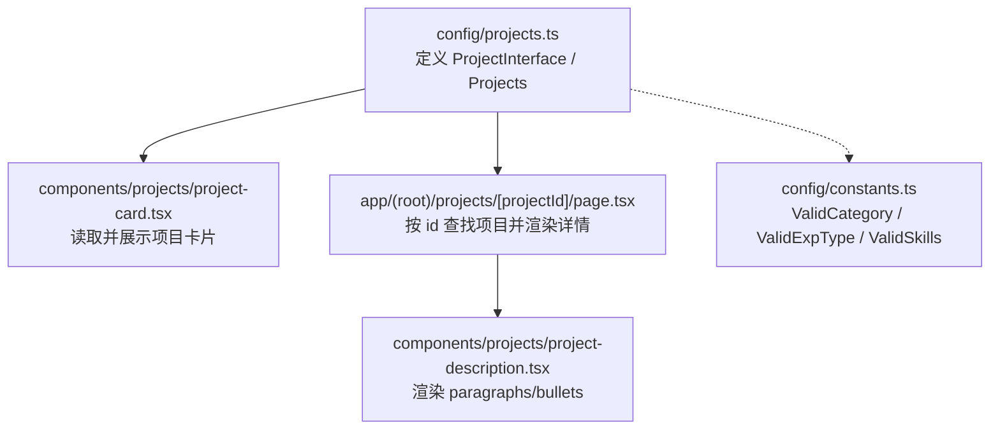
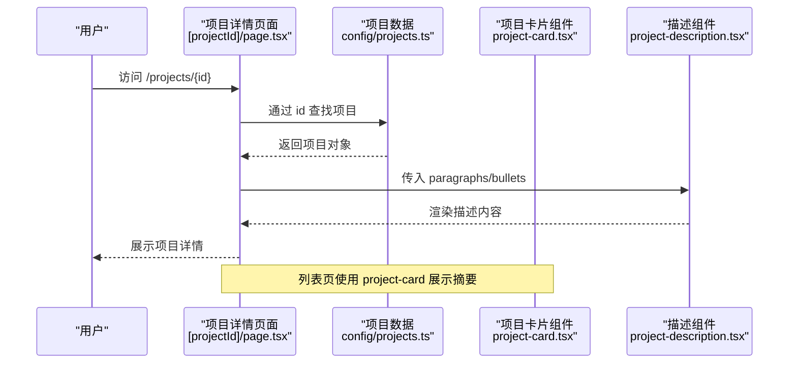
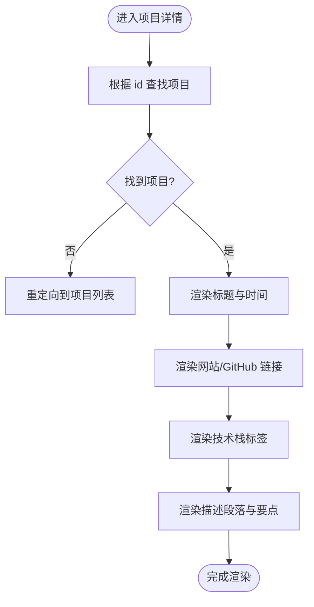
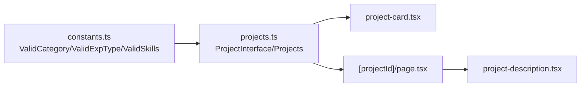

# 项目数据模型

<cite>
**本文引用的文件**
- [config/projects.ts](file://config/projects.ts)
- [config/constants.ts](file://config/constants.ts)
- [components/projects/project-card.tsx](file://components/projects/project-card.tsx)
- [app/(root)/projects/[projectId]/page.tsx](file://app/(root)/projects/[projectId]/page.tsx)
- [components/projects/project-description.tsx](file://components/projects/project-description.tsx)
</cite>

## 目录
1. [简介](#简介)
2. [项目结构](#项目结构)
3. [核心组件](#核心组件)
4. [架构总览](#架构总览)
5. [详细组件分析](#详细组件分析)
6. [依赖关系分析](#依赖关系分析)
7. [性能与可维护性](#性能与可维护性)
8. [故障排查指南](#故障排查指南)
9. [结论](#结论)
10. [附录：配置示例与最佳实践](#附录：配置示例与最佳实践)

## 简介
本文件面向Next.js投资组合项目中的“项目”数据模型，系统性说明ProjectInterface接口、PagesInfoInterface与DescriptionDetailsInterface的结构设计，以及ValidCategory、ValidExpType、ValidSkills等枚举类型的使用场景。文档同时提供添加新项目的步骤、字段校验规则与最佳实践，帮助初学者快速理解数据结构，并为高级开发者提供扩展与自定义指导。

## 项目结构
本项目将项目数据集中定义在配置层（config），并通过页面组件消费这些数据。关键路径如下：
- 数据定义与示例：config/projects.ts
- 枚举常量：config/constants.ts
- 列表展示：components/projects/project-card.tsx
- 详情页面：app/(root)/projects/[projectId]/page.tsx
- 描述渲染：components/projects/project-description.tsx

图表来源
- [config/projects.ts:1-28](file://config/projects.ts#L1-L28)
- [config/constants.ts:1-85](file://config/constants.ts#L1-L85)
- [components/projects/project-card.tsx:1-50](file://components/projects/project-card.tsx#L1-L50)
- [app/(root)/projects/[projectId]/page.tsx:1-117](file://app/(root)/projects/[projectId]/page.tsx#L1-L117)
- [components/projects/project-description.tsx:1-23](file://components/projects/project-description.tsx#L1-L23)

章节来源
- [config/projects.ts:1-28](file://config/projects.ts#L1-L28)
- [config/constants.ts:1-85](file://config/constants.ts#L1-L85)
- [components/projects/project-card.tsx:1-50](file://components/projects/project-card.tsx#L1-L50)
- [app/(root)/projects/[projectId]/page.tsx:1-117](file://app/(root)/projects/[projectId]/page.tsx#L1-L117)
- [components/projects/project-description.tsx:1-23](file://components/projects/project-description.tsx#L1-L23)

## 核心组件
- ProjectInterface：项目主数据模型，包含标识、分类、技术栈、时间、图片、描述与多页信息。
- PagesInfoInterface：用于项目详情页的“分节/分页”信息，包含标题、图片数组与可选描述。
- DescriptionDetailsInterface：项目详细描述的结构化内容，包含段落与要点列表。
- 枚举类型：
  - ValidCategory：项目类别集合（如 Full Stack、Frontend、Backend、UI/UX、Web Dev、Mobile Dev、3D Modeling）。
  - ValidExpType：项目类型（Personal 或 Professional）。
  - ValidSkills：技术栈标签集合（如 Next.js、React、Typescript、Tailwind CSS、Node.js 等）。

章节来源
- [config/projects.ts:3-28](file://config/projects.ts#L3-L28)
- [config/constants.ts:1-85](file://config/constants.ts#L1-L85)

## 架构总览
下图展示了从数据到视图的调用链：页面根据路由参数获取项目ID，在Projects中查找对应项目，再将其字段传递给子组件进行渲染。

图表来源
- [app/(root)/projects/[projectId]/page.tsx:23-117](file://app/(root)/projects/[projectId]/page.tsx#L23-L117)
- [config/projects.ts:30-596](file://config/projects.ts#L30-L596)
- [components/projects/project-description.tsx:3-21](file://components/projects/project-description.tsx#L3-L21)
- [components/projects/project-card.tsx:9-50](file://components/projects/project-card.tsx#L9-L50)

## 详细组件分析

### ProjectInterface 接口设计
- id: string
  - 用途：唯一标识项目，用于路由匹配与数据检索。
  - 约束：必须全局唯一且稳定。
- type: ValidExpType
  - 用途：区分个人项目与职业项目，影响图标与展示逻辑。
  - 取值：Personal | Professional。
- companyName: string
  - 用途：项目名称或公司名，作为标题显示。
- category: ValidCategory[]
  - 用途：项目所属分类，支持多选，用于筛选与标签展示。
  - 取值：Full Stack、Frontend、Backend、UI/UX、Web Dev、Mobile Dev、3D Modeling。
- shortDescription: string
  - 用途：简短介绍，用于卡片预览。
- websiteLink?: string
  - 用途：项目官网链接（可选）。
- githubLink?: string
  - 用途：源码仓库链接（可选）。
- techStack: ValidSkills[]
  - 用途：项目使用的技术栈标签，用于展示与筛选。
  - 取值：来自 ValidSkills 枚举。
- startDate: Date
  - 用途：项目开始时间。
- endDate: Date
  - 用途：项目结束时间。
- companyLogoImg: any
  - 用途：项目封面/Logo图片路径或资源引用。
- descriptionDetails: DescriptionDetailsInterface
  - 用途：结构化描述内容，包含段落与要点。
- pagesInfoArr: PagesInfoInterface[]
  - 用途：项目详情页的分节信息，每个元素代表一个“页面/区块”，包含标题、图片数组与可选描述。

章节来源
- [config/projects.ts:14-28](file://config/projects.ts#L14-L28)
- [config/constants.ts:65-74](file://config/constants.ts#L65-L74)

### PagesInfoInterface 与 DescriptionDetailsInterface
- PagesInfoInterface
  - title: string — 分节标题。
  - imgArr: string[] — 该分节的图片集合，用于轮播或图集展示。
  - description?: string — 可选的分节描述。
- DescriptionDetailsInterface
  - paragraphs: string[] — 段落文本数组，用于长文描述。
  - bullets: string[] — 要点列表，用于强调关键特性或成果。

这些结构使详情页具备“图文混排 + 要点清单”的可读性布局，便于在不同项目中复用一致的展示方式。

章节来源
- [config/projects.ts:3-12](file://config/projects.ts#L3-L12)
- [components/projects/project-description.tsx:3-21](file://components/projects/project-description.tsx#L3-L21)

### 枚举类型：ValidCategory、ValidExpType、ValidSkills
- ValidCategory
  - 作用：统一项目分类，避免自由文本导致的展示不一致。
  - 典型值：Full Stack、Frontend、Backend、UI/UX、Web Dev、Mobile Dev、3D Modeling。
- ValidExpType
  - 作用：区分项目性质（个人/职业），影响图标与过滤逻辑。
  - 取值：Personal | Professional。
- ValidSkills
  - 作用：统一技术栈标签集合，确保前端展示一致性与可维护性。
  - 典型值：Next.js、React、Typescript、Tailwind CSS、Node.js、MongoDB、Python、AWS、Vercel、Three.js 等。

章节来源
- [config/constants.ts:1-85](file://config/constants.ts#L1-L85)

### 数据到视图的交互流程
- 列表页：project-card.tsx 接收 ProjectInterface，展示公司名称、短描述、分类标签与类型图标。
- 详情页：[projectId]/page.tsx 通过 id 从 Projects 中查找项目，渲染标题、时间、链接、技术栈与描述。
- 描述渲染：project-description.tsx 将 paragraphs 渲染为段落，bullets 渲染为要点列表。

图表来源
- [app/(root)/projects/[projectId]/page.tsx:23-117](file://app/(root)/projects/[projectId]/page.tsx#L23-L117)
- [components/projects/project-description.tsx:3-21](file://components/projects/project-description.tsx#L3-L21)

章节来源
- [components/projects/project-card.tsx:9-50](file://components/projects/project-card.tsx#L9-L50)
- [app/(root)/projects/[projectId]/page.tsx:23-117](file://app/(root)/projects/[projectId]/page.tsx#L23-L117)
- [components/projects/project-description.tsx:3-21](file://components/projects/project-description.tsx#L3-L21)

## 依赖关系分析
- config/projects.ts 依赖 config/constants.ts 中的枚举类型，保证数据一致性。
- 组件层依赖配置层的数据结构，不直接操作原始数据，降低耦合度。
- 详情页通过 id 检索项目，若不存在则重定向，体现健壮的路由处理。

图表来源
- [config/constants.ts:1-85](file://config/constants.ts#L1-L85)
- [config/projects.ts:1-28](file://config/projects.ts#L1-L28)
- [components/projects/project-card.tsx:1-50](file://components/projects/project-card.tsx#L1-L50)
- [app/(root)/projects/[projectId]/page.tsx:1-117](file://app/(root)/projects/[projectId]/page.tsx#L1-L117)
- [components/projects/project-description.tsx:1-23](file://components/projects/project-description.tsx#L1-L23)

章节来源
- [config/projects.ts:1-28](file://config/projects.ts#L1-L28)
- [config/constants.ts:1-85](file://config/constants.ts#L1-L85)
- [components/projects/project-card.tsx:1-50](file://components/projects/project-card.tsx#L1-L50)
- [app/(root)/projects/[projectId]/page.tsx:1-117](file://app/(root)/projects/[projectId]/page.tsx#L1-L117)
- [components/projects/project-description.tsx:1-23](file://components/projects/project-description.tsx#L1-L23)

## 性能与可维护性
- 数据集中管理：所有项目数据集中在配置文件，便于版本管理与批量更新。
- 类型安全：通过 TypeScript 接口与枚举限制字段取值，减少运行时错误。
- 渲染优化：详情页按需渲染段落与要点，避免不必要的复杂计算。
- 可扩展性：新增技术栈只需在枚举中添加，无需修改业务逻辑；新增分类同理。

## 故障排查指南
- 路由未找到项目
  - 现象：访问 /projects/{id} 后重定向到项目列表。
  - 原因：Projects 中不存在对应 id。
  - 处理：检查 id 是否拼写正确，确认该项目已添加到 Projects 数组。
- 描述未显示
  - 现象：详情页无段落或要点。
  - 原因：descriptionDetails 为空或未正确传递。
  - 处理：确保每个项目都包含 paragraphs 与 bullets 数组。
- 技术栈标签异常
  - 现象：标签无法识别或样式错乱。
  - 原因：techStack 使用了不在 ValidSkills 中的字符串。
  - 处理：仅使用枚举中定义的技术栈名称。
- 分类标签异常
  - 现象：分类标签显示异常或无法筛选。
  - 原因：category 使用了不在 ValidCategory 中的字符串。
  - 处理：仅使用枚举中定义的分类名称。

章节来源
- [app/(root)/projects/[projectId]/page.tsx:23-28](file://app/(root)/projects/[projectId]/page.tsx#L23-L28)
- [config/projects.ts:14-28](file://config/projects.ts#L14-L28)
- [config/constants.ts:1-85](file://config/constants.ts#L1-L85)

## 结论
本项目采用“配置层集中数据 + 组件层消费数据”的清晰分层，结合TypeScript接口与枚举类型，实现了强类型、高内聚、低耦合的项目数据模型。通过PagesInfoInterface与DescriptionDetailsInterface的结构化设计，详情页具备良好的可读性与扩展性。遵循本文档的校验规则与最佳实践，可以确保数据的一致性与完整性，并为后续功能扩展提供坚实基础。

## 附录：配置示例与最佳实践

### 如何添加新项目
- 在 Projects 数组中添加一个新对象，遵循 ProjectInterface 的所有必填字段。
- 设置 id 为唯一字符串，type 为 Personal 或 Professional。
- 填写 companyName、shortDescription、startDate、endDate、companyLogoImg。
- 使用 ValidCategory 数组设置 category，使用 ValidSkills 数组设置 techStack。
- 在 descriptionDetails 中提供 paragraphs 与 bullets。
- 在 pagesInfoArr 中提供至少一个分节信息，包含 title 与 imgArr。

章节来源
- [config/projects.ts:30-596](file://config/projects.ts#L30-L596)

### 项目属性设置建议
- id：建议使用语义化命名，避免特殊字符与空格。
- type：明确区分个人与职业项目，便于展示不同图标与筛选。
- category：选择最贴近的1-3个分类，避免过多导致展示拥挤。
- techStack：仅列出核心技术栈，保持简洁与聚焦。
- 时间字段：startDate 与 endDate 使用Date对象，确保格式一致。
- 图片路径：companyLogoImg 与 pagesInfoArr.imgArr 使用相对路径，确保资源可访问。

章节来源
- [config/projects.ts:14-28](file://config/projects.ts#L14-L28)
- [config/constants.ts:65-74](file://config/constants.ts#L65-L74)

### 技术栈标签配置
- 仅在 ValidSkills 中存在的名称才可使用，避免自由文本。
- 如需新增技术栈，先在 constants.ts 中添加枚举值，再在项目中引用。
- 建议在多个项目中保持一致的命名风格，便于统一展示与筛选。

章节来源
- [config/constants.ts:1-63](file://config/constants.ts#L1-L63)

### 数据类型验证规则
- 严格使用接口与枚举类型，禁止自由文本。
- 必填字段缺失会导致类型错误或运行时异常。
- 可选字段（websiteLink、githubLink、pagesInfoArr.description）可根据需要省略。
- 数组字段应确保非空且元素类型正确。

章节来源
- [config/projects.ts:14-28](file://config/projects.ts#L14-L28)
- [config/constants.ts:1-85](file://config/constants.ts#L1-L85)

### 最佳实践
- 数据与视图分离：所有项目数据集中在配置文件，组件只负责渲染。
- 类型优先：充分利用TypeScript接口与枚举，减少运行时错误。
- 可维护性：新增分类或技术栈时，优先扩展枚举而非修改业务逻辑。
- 可读性：descriptionDetails 的 paragraphs 与 bullets 应保持简洁明了，突出关键信息。
- 一致性：保持命名、结构与顺序的一致性，便于团队协作与维护。