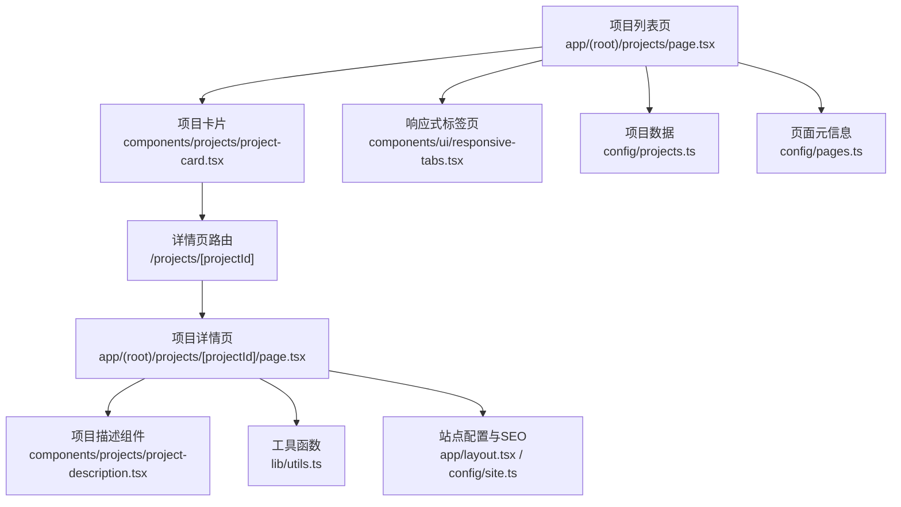
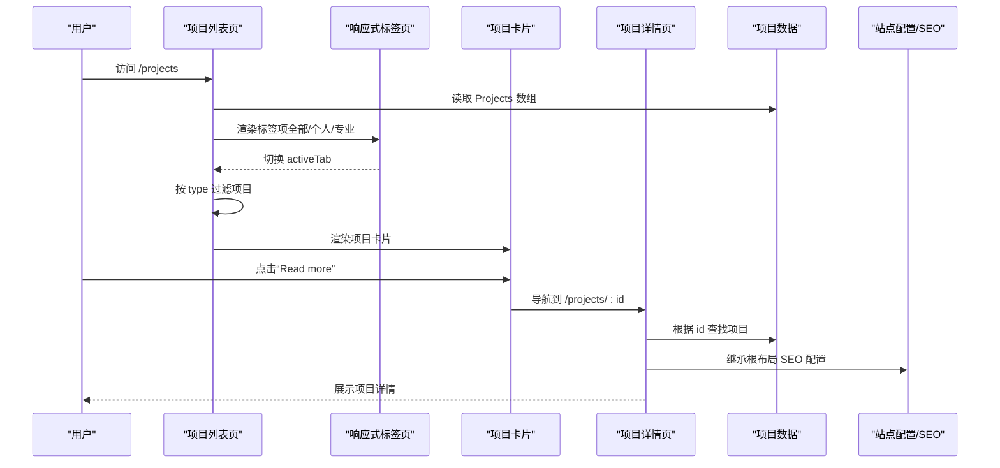
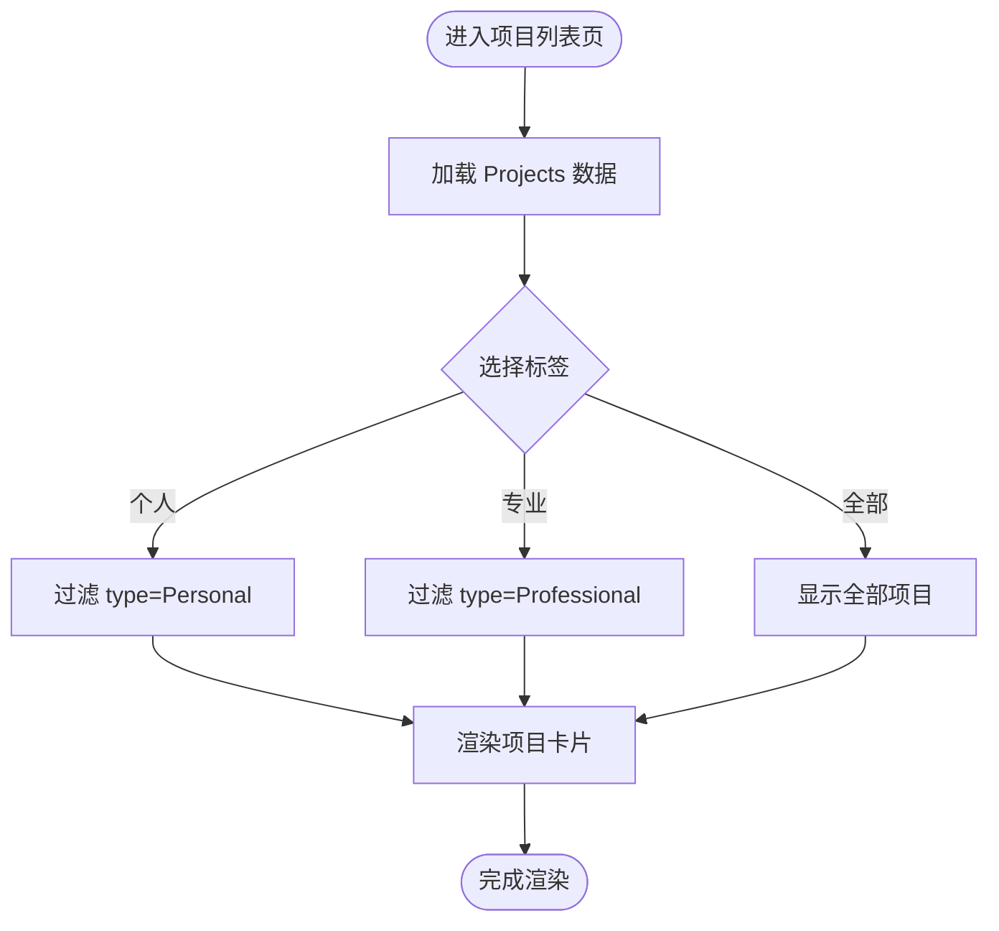
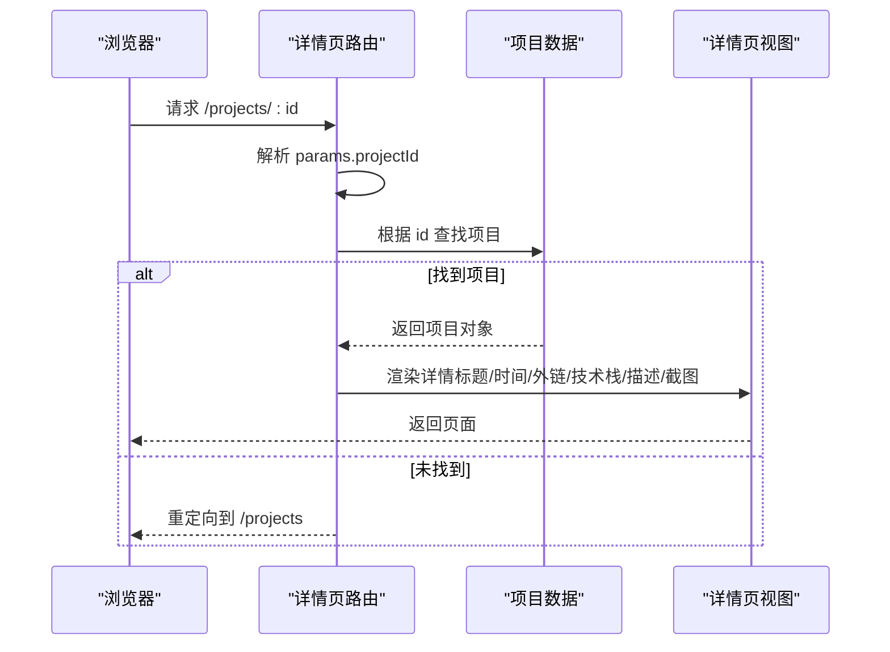
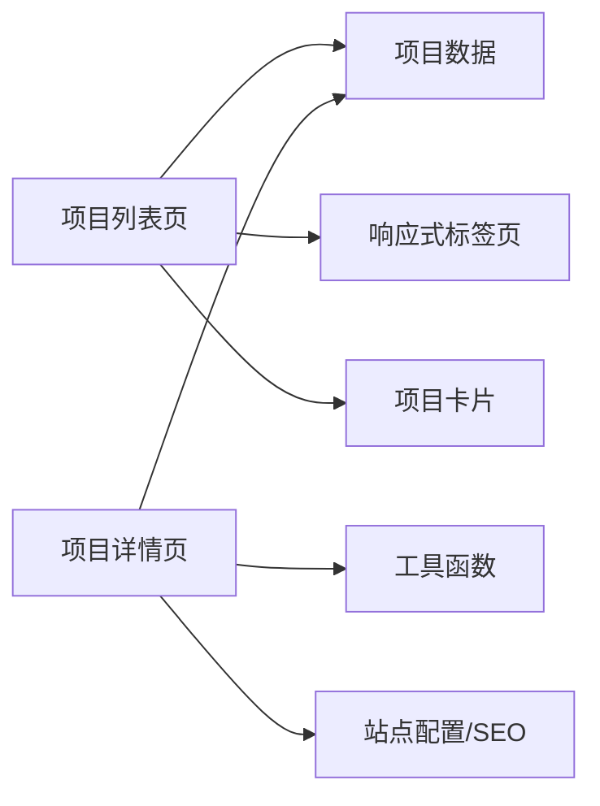

# 项目页面集成

<cite>
**本文引用的文件**
- [app/(root)/projects/page.tsx](file://app/(root)/projects/page.tsx)
- [app/(root)/projects/[projectId]/page.tsx](file://app/(root)/projects/[projectId]/page.tsx)
- [components/projects/project-card.tsx](file://components/projects/project-card.tsx)
- [components/projects/project-description.tsx](file://components/projects/project-description.tsx)
- [components/ui/responsive-tabs.tsx](file://components/ui/responsive-tabs.tsx)
- [config/projects.ts](file://config/projects.ts)
- [config/pages.ts](file://config/pages.ts)
- [lib/utils.ts](file://lib/utils.ts)
- [app/layout.tsx](file://app/layout.tsx)
- [config/site.ts](file://config/site.ts)
</cite>

## 目录
1. [简介](#简介)
2. [项目结构](#项目结构)
3. [核心组件](#核心组件)
4. [架构总览](#架构总览)
5. [详细组件分析](#详细组件分析)
6. [依赖关系分析](#依赖关系分析)
7. [性能考虑](#性能考虑)
8. [故障排查指南](#故障排查指南)
9. [结论](#结论)
10. [附录](#附录)

## 简介
本文件聚焦“项目”页面的集成与实现，覆盖以下主题：
- 页面组件的组织结构与职责划分
- 数据获取与处理流程（列表页、详情页）
- 组件间通信机制（路由参数、配置驱动）
- 项目列表的渲染逻辑（筛选、排序、搜索）
- 分页加载机制（当前实现与扩展建议）
- 项目分类与过滤的配置方法（技术栈、类型、时间范围等多维度）
- 项目详情页面的路由配置与动态路由跳转
- SEO优化策略（元数据、结构化数据、社交媒体预览图）
- 性能优化建议（代码分割、图片优化、缓存策略）
- 初学者入门步骤与高级开发者进阶指导

## 项目结构
本项目采用 Next.js App Router 组织页面，项目相关的路由与组件分布如下：
- 列表页：app/(root)/projects/page.tsx
- 详情页：app/(root)/projects/[projectId]/page.tsx
- 项目卡片：components/projects/project-card.tsx
- 项目描述：components/projects/project-description.tsx
- 响应式标签页：components/ui/responsive-tabs.tsx
- 项目数据与类型：config/projects.ts
- 页面元信息：config/pages.ts
- 工具函数：lib/utils.ts
- 根布局与全局SEO：app/layout.tsx、config/site.ts

图表来源
- [app/(root)/projects/page.tsx:1-59](file://app/(root)/projects/page.tsx#L1-L59)
- [app/(root)/projects/[projectId]/page.tsx:1-159](file://app/(root)/projects/[projectId]/page.tsx#L1-L159)
- [components/projects/project-card.tsx:1-51](file://components/projects/project-card.tsx#L1-L51)
- [components/projects/project-description.tsx:1-24](file://components/projects/project-description.tsx#L1-L24)
- [components/ui/responsive-tabs.tsx:1-89](file://components/ui/responsive-tabs.tsx#L1-L89)
- [config/projects.ts:1-596](file://config/projects.ts#L1-L596)
- [config/pages.ts:1-86](file://config/pages.ts#L1-L86)
- [lib/utils.ts:1-25](file://lib/utils.ts#L1-L25)
- [app/layout.tsx:1-145](file://app/layout.tsx#L1-L145)
- [config/site.ts:1-41](file://config/site.ts#L1-L41)

章节来源
- [app/(root)/projects/page.tsx:1-59](file://app/(root)/projects/page.tsx#L1-L59)
- [app/(root)/projects/[projectId]/page.tsx:1-159](file://app/(root)/projects/[projectId]/page.tsx#L1-L159)
- [components/projects/project-card.tsx:1-51](file://components/projects/project-card.tsx#L1-L51)
- [components/projects/project-description.tsx:1-24](file://components/projects/project-description.tsx#L1-L24)
- [components/ui/responsive-tabs.tsx:1-89](file://components/ui/responsive-tabs.tsx#L1-L89)
- [config/projects.ts:1-596](file://config/projects.ts#L1-L596)
- [config/pages.ts:1-86](file://config/pages.ts#L1-L86)
- [lib/utils.ts:1-25](file://lib/utils.ts#L1-L25)
- [app/layout.tsx:1-145](file://app/layout.tsx#L1-L145)
- [config/site.ts:1-41](file://config/site.ts#L1-L41)

## 核心组件
- 项目列表页：负责展示所有项目，并通过标签页进行基础筛选（全部、个人、专业）。使用响应式标签组件在移动端以下拉菜单形式呈现。
- 项目卡片：展示项目缩略图、标题、简短描述、分类标签，并提供跳转到详情页的链接。
- 项目详情页：根据路由参数获取项目数据，渲染标题、时间、技术栈、描述、页面截图等信息，并支持外链到源码或演示站。
- 项目描述组件：将段落与要点列表渲染为可读性强的内容区块。
- 响应式标签页：提供桌面端 Tabs 与移动端 Dropdown 两种交互模式，用于切换不同视图内容。

章节来源
- [app/(root)/projects/page.tsx:1-59](file://app/(root)/projects/page.tsx#L1-L59)
- [components/projects/project-card.tsx:1-51](file://components/projects/project-card.tsx#L1-L51)
- [app/(root)/projects/[projectId]/page.tsx:1-159](file://app/(root)/projects/[projectId]/page.tsx#L1-L159)
- [components/projects/project-description.tsx:1-24](file://components/projects/project-description.tsx#L1-L24)
- [components/ui/responsive-tabs.tsx:1-89](file://components/ui/responsive-tabs.tsx#L1-L89)

## 架构总览
项目页面采用“配置驱动 + 组件化”的架构：
- 数据层：项目数据集中定义在配置文件中，包含类型、分类、技术栈、起止时间等字段，便于统一维护与扩展。
- 表现层：列表页通过标签页控制筛选；详情页通过动态路由参数解析项目 ID 并渲染详情。
- 工具层：日期格式化、类名合并等通用能力抽取至工具模块。
- SEO层：根布局设置全局元数据与社交分享图，列表页与详情页各自导出 Metadata 以增强单页 SEO。

图表来源
- [app/(root)/projects/page.tsx:1-59](file://app/(root)/projects/page.tsx#L1-L59)
- [components/ui/responsive-tabs.tsx:1-89](file://components/ui/responsive-tabs.tsx#L1-L89)
- [components/projects/project-card.tsx:1-51](file://components/projects/project-card.tsx#L1-L51)
- [app/(root)/projects/[projectId]/page.tsx:1-159](file://app/(root)/projects/[projectId]/page.tsx#L1-L159)
- [config/projects.ts:1-596](file://config/projects.ts#L1-L596)
- [app/layout.tsx:1-145](file://app/layout.tsx#L1-L145)

## 详细组件分析

### 项目列表页（筛选与渲染）
- 数据来源：从配置中导入项目数组。
- 筛选逻辑：基于标签值对项目的 type 字段进行过滤（Personal/Professional），默认显示全部。
- 渲染方式：使用网格布局渲染项目卡片，每个卡片指向对应的项目详情页。
- 元数据：通过 pagesConfig 中的 metadata 设置页面标题与描述。

图表来源
- [app/(root)/projects/page.tsx:14-29](file://app/(root)/projects/page.tsx#L14-L29)
- [config/projects.ts:30-596](file://config/projects.ts#L30-L596)

章节来源
- [app/(root)/projects/page.tsx:1-59](file://app/(root)/projects/page.tsx#L1-L59)
- [config/pages.ts:33-40](file://config/pages.ts#L33-L40)

### 项目详情页（动态路由与展示）
- 路由参数：通过异步 params 获取 projectId。
- 数据查找：在项目配置数组中根据 id 查找项目，未找到则重定向回列表页。
- 内容渲染：展示项目标题、时间、外链图标、分类标签、技术栈、描述段落与要点、多张页面截图。
- 导航：提供返回“所有项目”的按钮。

图表来源
- [app/(root)/projects/[projectId]/page.tsx:23-28](file://app/(root)/projects/[projectId]/page.tsx#L23-L28)
- [app/(root)/projects/[projectId]/page.tsx:30-158](file://app/(root)/projects/[projectId]/page.tsx#L30-L158)
- [config/projects.ts:14-28](file://config/projects.ts#L14-L28)

章节来源
- [app/(root)/projects/[projectId]/page.tsx:1-159](file://app/(root)/projects/[projectId]/page.tsx#L1-L159)
- [lib/utils.ts:17-24](file://lib/utils.ts#L17-L24)

### 项目卡片组件
- 展示内容：封面图、项目名称、简短描述、分类标签。
- 交互行为：点击“Read more”跳转到详情页。
- 视觉标识：右下角根据项目类型显示不同图标。

章节来源
- [components/projects/project-card.tsx:1-51](file://components/projects/project-card.tsx#L1-L51)

### 项目描述组件
- 输入：段落数组与要点数组。
- 输出：段落与无序列表的组合，提升可读性与可维护性。

章节来源
- [components/projects/project-description.tsx:1-24](file://components/projects/project-description.tsx#L1-L24)

### 响应式标签页
- 桌面端：使用 Tabs 组件展示多个标签。
- 移动端：使用下拉菜单切换标签。
- 状态管理：内部维护 activeTab，并在切换时更新内容。

章节来源
- [components/ui/responsive-tabs.tsx:1-89](file://components/ui/responsive-tabs.tsx#L1-L89)

## 依赖关系分析
- 列表页依赖：
  - 项目数据：config/projects.ts
  - 页面元信息：config/pages.ts
  - 响应式标签：components/ui/responsive-tabs.tsx
  - 项目卡片：components/projects/project-card.tsx
- 详情页依赖：
  - 项目数据：config/projects.ts
  - 工具函数：lib/utils.ts（日期格式化）
  - 站点配置与SEO：app/layout.tsx、config/site.ts
- 组件内聚性：
  - 项目卡片仅关注展示与跳转，不持有业务状态。
  - 详情页承担数据查找与渲染，保持无副作用的纯展示逻辑。
  - 标签页封装了响应式交互细节，降低列表页复杂度。

图表来源
- [app/(root)/projects/page.tsx:1-59](file://app/(root)/projects/page.tsx#L1-L59)
- [app/(root)/projects/[projectId]/page.tsx:1-159](file://app/(root)/projects/[projectId]/page.tsx#L1-L159)
- [config/projects.ts:1-596](file://config/projects.ts#L1-L596)
- [lib/utils.ts:1-25](file://lib/utils.ts#L1-L25)
- [app/layout.tsx:1-145](file://app/layout.tsx#L1-L145)

章节来源
- [app/(root)/projects/page.tsx:1-59](file://app/(root)/projects/page.tsx#L1-L59)
- [app/(root)/projects/[projectId]/page.tsx:1-159](file://app/(root)/projects/[projectId]/page.tsx#L1-L159)
- [config/projects.ts:1-596](file://config/projects.ts#L1-L596)
- [lib/utils.ts:1-25](file://lib/utils.ts#L1-L25)
- [app/layout.tsx:1-145](file://app/layout.tsx#L1-L145)

## 性能考虑
- 图片优化：
  - 列表与详情页均使用 Next.js Image 组件，合理设置尺寸与优先级，减少主线程阻塞。
  - 建议使用 WebP/AVIF 格式，开启懒加载与占位符以提升首屏体验。
- 代码分割：
  - 列表页与详情页作为独立路由，天然具备按需加载优势。
  - 可将重型组件（如动画、图表）延迟加载，避免影响首屏。
- 缓存策略：
  - 项目数据为静态配置，可在构建时生成并缓存，减少运行时开销。
  - 对于外部资源（如图片），利用 CDN 缓存与合适的 Cache-Control 头。
- 渲染优化：
  - 列表页使用服务端渲染（SSR）或静态生成（SSG）结合增量静态再生（ISR）提升性能。
  - 详情页可通过并行数据获取减少关键路径长度。

[本节为通用性能建议，不直接分析具体文件]

## 故障排查指南
- 详情页无法打开或重定向：
  - 检查路由参数是否正确传递，确认项目 ID 是否存在于配置数据中。
  - 若未找到项目，会重定向到列表页，需确认重定向逻辑是否符合预期。
- 列表页筛选无效：
  - 确认标签值与项目 type 字段匹配，确保过滤逻辑正确执行。
- 日期显示异常：
  - 检查日期格式化工具函数的输入是否为有效 Date 对象。
- SEO 信息缺失：
  - 确认根布局已设置全局元数据与社交分享图，列表页与详情页是否导出了各自的 metadata。

章节来源
- [app/(root)/projects/[projectId]/page.tsx:23-28](file://app/(root)/projects/[projectId]/page.tsx#L23-L28)
- [app/(root)/projects/page.tsx:14-29](file://app/(root)/projects/page.tsx#L14-L29)
- [lib/utils.ts:17-24](file://lib/utils.ts#L17-L24)
- [app/layout.tsx:30-97](file://app/layout.tsx#L30-L97)

## 结论
该项目页面采用清晰的配置驱动与组件化设计，列表页通过标签页实现基础筛选，详情页通过动态路由展示完整信息。整体架构易于扩展与维护，具备良好的 SEO 基础与图片优化实践。针对更复杂的需求（如多维度筛选、搜索、分页/无限滚动），可在现有基础上引入客户端状态管理与数据层抽象，进一步提升用户体验与性能。

[本节为总结性内容，不直接分析具体文件]

## 附录

### 项目列表渲染逻辑（筛选、排序、搜索）
- 当前实现：
  - 筛选：基于 type 字段（Personal/Professional）进行过滤。
  - 排序：未实现默认排序或自定义排序。
  - 搜索：未实现关键词搜索功能。
- 扩展建议：
  - 增加搜索框，对项目名称、描述、技术栈进行模糊匹配。
  - 增加排序选项（按时间、名称、技术栈数量等）。
  - 将筛选与搜索状态提升到父组件或使用 URL 查询参数同步状态。

章节来源
- [app/(root)/projects/page.tsx:14-29](file://app/(root)/projects/page.tsx#L14-L29)
- [config/projects.ts:14-28](file://config/projects.ts#L14-L28)

### 分页加载机制（无限滚动或分页按钮）
- 当前实现：
  - 未实现分页或无限滚动，所有项目一次性渲染。
- 扩展建议：
  - 分页：添加页码控件，按页加载项目数据。
  - 无限滚动：监听滚动事件，当接近底部时加载更多项目。
  - 虚拟列表：对于大量项目，可使用虚拟滚动减少 DOM 节点数量。

[本节为概念性说明，不直接分析具体文件]

### 项目分类与过滤配置（技术栈、类型、时间范围）
- 当前实现：
  - 类型过滤：基于 type 字段（Personal/Professional）。
  - 分类标签：category 数组用于展示，未参与过滤。
  - 技术栈：techStack 数组用于展示，未参与过滤。
  - 时间范围：startDate/endDate 用于展示，未参与过滤。
- 扩展建议：
  - 增加分类筛选器，允许按 category 多选过滤。
  - 增加技术栈筛选器，允许按 techStack 多选过滤。
  - 增加时间范围筛选器，支持按起止时间区间过滤。
  - 将筛选条件与 URL 查询参数同步，便于分享与书签。

章节来源
- [config/projects.ts:14-28](file://config/projects.ts#L14-L28)
- [app/(root)/projects/page.tsx:14-29](file://app/(root)/projects/page.tsx#L14-L29)

### 项目详情页面路由配置与跳转
- 路由配置：
  - 使用 Next.js App Router 的动态路由 /projects/[projectId]。
  - 详情页通过异步 params 获取 projectId，并根据项目 ID 查找数据。
- 跳转方式：
  - 列表页的项目卡片通过 Link 组件跳转到详情页。
  - 详情页提供返回“所有项目”的按钮。

章节来源
- [app/(root)/projects/[projectId]/page.tsx:15-28](file://app/(root)/projects/[projectId]/page.tsx#L15-L28)
- [components/projects/project-card.tsx:34-39](file://components/projects/project-card.tsx#L34-L39)

### SEO 优化策略（元数据、结构化数据、社交媒体预览图）
- 元数据：
  - 根布局设置全局 title、description、keywords、作者、社交分享图等。
  - 列表页导出 metadata，设置页面级标题与描述。
- 结构化数据：
  - 可在详情页添加 JSON-LD 结构化数据，标注项目信息（名称、描述、图片、链接等）。
- 社交媒体预览图：
  - 根布局已配置 Open Graph 与 Twitter Card 的图片与文本。
  - 可为详情页动态设置 OG 图片与描述，提升分享效果。

章节来源
- [app/layout.tsx:30-97](file://app/layout.tsx#L30-L97)
- [config/site.ts:1-41](file://config/site.ts#L1-L41)
- [app/(root)/projects/page.tsx:9-12](file://app/(root)/projects/page.tsx#L9-L12)

### 初学者基本步骤
- 理解项目结构：
  - 列表页与详情页的路由位置与职责。
  - 项目数据集中在配置文件，便于统一管理。
- 修改项目数据：
  - 在配置文件中新增或编辑项目条目，确保字段完整。
- 调整筛选逻辑：
  - 在列表页中添加新的标签或过滤条件。
- 优化详情页：
  - 根据项目数据结构扩展详情页展示内容。

[本节为入门指导，不直接分析具体文件]

### 高级开发者技术指导
- 引入状态管理：
  - 使用 URL 查询参数同步筛选与搜索状态，提升可分享性与可索引性。
- 数据层抽象：
  - 将项目数据访问封装为服务层，便于后续替换为 API 或数据库。
- 性能优化：
  - 对大列表使用虚拟滚动或分页加载。
  - 对详情页启用增量静态再生（ISR）或缓存策略。
- 测试与可维护性：
  - 为筛选与搜索逻辑编写单元测试。
  - 为详情页的数据查找与重定向逻辑编写集成测试。

[本节为高级指导，不直接分析具体文件]