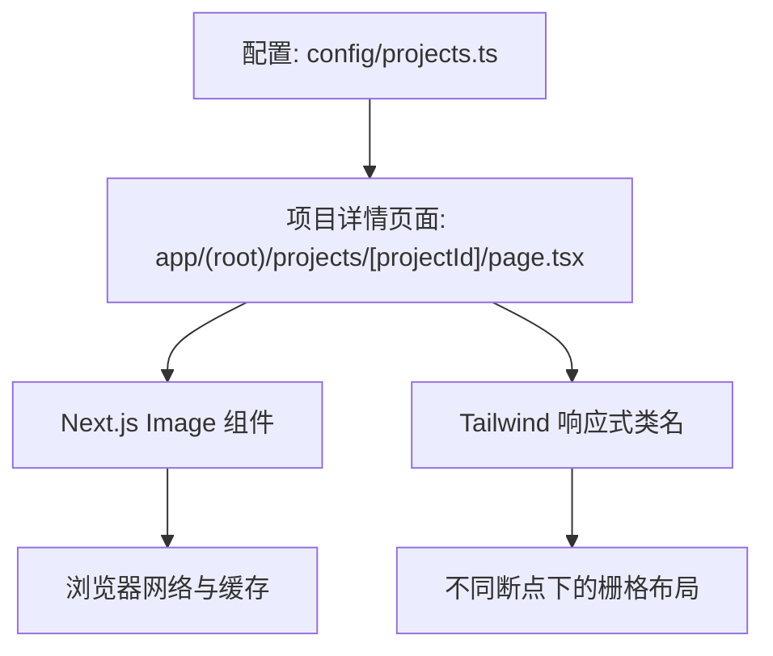
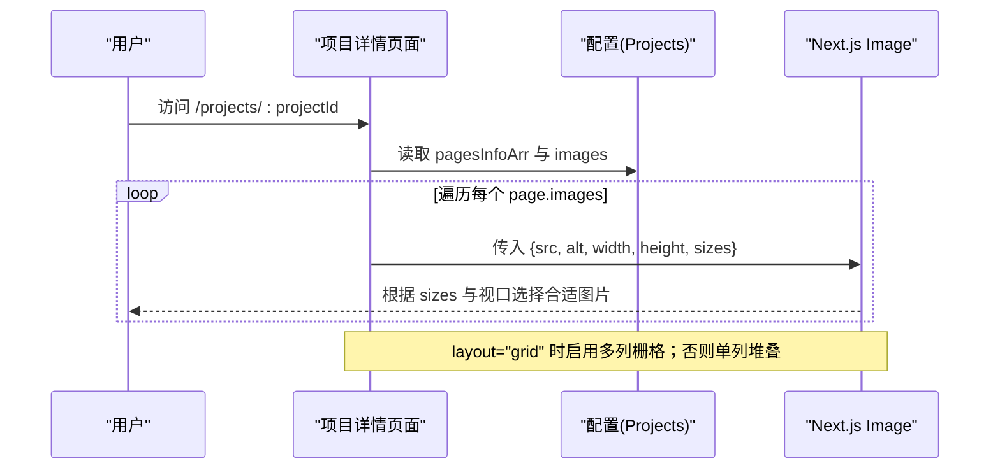
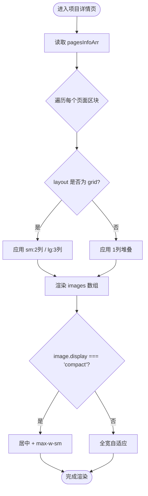
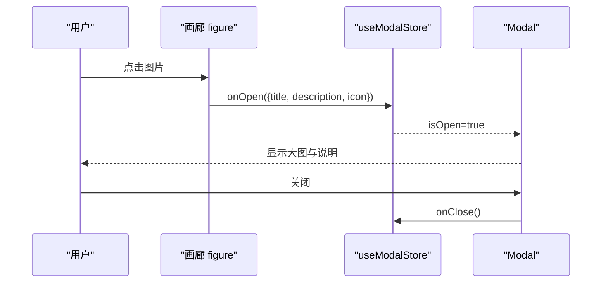
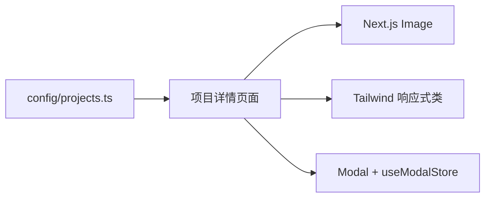

# 图片画廊功能

<cite>
**本文引用的文件**
- [config/projects.ts](file://config/projects.ts)
- [app/(root)/projects/[projectId]/page.tsx](file://app/(root)/projects/[projectId]/page.tsx)
- [components/blogs/blog-cover-image.tsx](file://components/blogs/blog-cover-image.tsx)
- [components/ui/modal.tsx](file://components/ui/modal.tsx)
- [hooks/use-modal-store.ts](file://hooks/use-modal-store.ts)
- [app/globals.css](file://app/globals.css)
</cite>

## 目录
1. [简介](#简介)
2. [项目结构](#项目结构)
3. [核心组件](#核心组件)
4. [架构总览](#架构总览)
5. [详细组件分析](#详细组件分析)
6. [依赖关系分析](#依赖关系分析)
7. [性能考量](#性能考量)
8. [故障排查指南](#故障排查指南)
9. [结论](#结论)
10. [附录](#附录)

## 简介
本文件为 Next.js 投资组合项目的“图片画廊”能力提供系统化文档。内容涵盖：
- 多图片展示系统的实现原理与数据流
- 布局模式切换（stack 与 grid）的渲染逻辑
- 图片尺寸优化策略（width/height/sizes/priority/loading）
- ProjectImageInterface 配置项说明（src、alt、width、height、display）
- display 属性 full 与 compact 的区别
- 响应式设计在不同屏幕下的排列与缩放策略
- 懒加载、预加载与缓存机制的使用方式
- 点击放大、滑动浏览等交互功能的现状与扩展建议
- 自定义画廊样式（过渡动画、边框、背景效果）的实践指导

## 项目结构
图片画廊的核心由“配置驱动 + 页面渲染”两部分组成：
- 配置层：在 TypeScript 配置中定义项目及其页面信息，包含图片数组与布局选项
- 渲染层：项目详情页根据配置动态生成“页面信息”区块，并渲染图片网格或堆叠列表

图表来源
- [config/projects.ts:3-20](file://config/projects.ts#L3-L20)
- [app/(root)/projects/[projectId]/page.tsx:140-198](file://app/(root)/projects/[projectId]/page.tsx#L140-L198)

章节来源
- [config/projects.ts:3-20](file://config/projects.ts#L3-L20)
- [app/(root)/projects/[projectId]/page.tsx:140-198](file://app/(root)/projects/[projectId]/page.tsx#L140-L198)

## 核心组件
- 配置接口
  - ProjectImageInterface：定义单张图片的数据结构，包括 src、alt、width、height、display
  - PagesInfoInterface：定义每个“页面信息”区块，包含 title、images、description、layout、source
- 项目详情页面
  - 遍历 pagesInfoArr，按 layout 决定栅格列数
  - 对每张图片使用 Next.js Image 组件进行渲染，传入 width/height/sizes 以优化加载
  - 支持 display="compact" 时限制最大宽度并居中显示

章节来源
- [config/projects.ts:3-20](file://config/projects.ts#L3-L20)
- [app/(root)/projects/[projectId]/page.tsx:140-198](file://app/(root)/projects/[projectId]/page.tsx#L140-L198)

## 架构总览
下图展示了从配置到渲染的关键流程，以及响应式布局如何影响图片尺寸选择。

图表来源
- [app/(root)/projects/[projectId]/page.tsx:140-198](file://app/(root)/projects/[projectId]/page.tsx#L140-L198)
- [config/projects.ts:3-20](file://config/projects.ts#L3-L20)

## 详细组件分析

### 配置模型：ProjectImageInterface 与 PagesInfoInterface
- ProjectImageInterface
  - src：图片路径（本地 public 目录或外部 URL）
  - alt：替代文本，用于可访问性与 SEO
  - width：原始像素宽，配合 Next.js Image 进行尺寸计算
  - height：原始像素高，避免布局偏移
  - display：可选值 "full" | "compact"
    - full：默认行为，图片占满容器宽度
    - compact：限制最大宽度并居中，适合移动端或小图预览
- PagesInfoInterface
  - title：区块标题
  - images：图片数组
  - description：描述文案
  - layout：可选 "stack" | "grid"
    - stack：单列堆叠
    - grid：多列栅格（sm:2列，lg:3列）
  - source：图片来源标注（label/href）

章节来源
- [config/projects.ts:3-20](file://config/projects.ts#L3-L20)

### 渲染逻辑：项目详情页的图片画廊
- 布局切换
  - 当 page.layout === "grid" 时，使用 sm:grid-cols-2 lg:grid-cols-3 的多列栅格
  - 否则使用 grid-cols-1 的单列堆叠
- 图片尺寸优化
  - 通过 width/height 声明原始尺寸，防止 CLS
  - 通过 sizes 指定不同断点下的目标宽度：
    - grid：小屏 100vw，中屏 50vw，大屏固定 240px
    - stack：小屏 100vw，大屏固定 720px
- 紧凑模式
  - 当 image.display === "compact" 时，figure 添加居中与最大宽度限制，使图片在小屏更友好

图表来源
- [app/(root)/projects/[projectId]/page.tsx:163-198](file://app/(root)/projects/[projectId]/page.tsx#L163-L198)

章节来源
- [app/(root)/projects/[projectId]/page.tsx:140-198](file://app/(root)/projects/[projectId]/page.tsx#L140-L198)

### 响应式设计：断点与缩放策略
- 栅格断点
  - sm：≥640px 时两列
  - lg：≥1024px 时三列
- sizes 策略
  - grid：小屏 100vw，中屏 50vw，大屏固定 240px
  - stack：小屏 100vw，大屏固定 720px
- 图片缩放
  - 使用 object-contain 保持比例，结合 w-full h-auto 自适应容器
- 紧凑模式
  - 在移动端或需要强调重点时使用 display="compact"，限制最大宽度并居中

章节来源
- [app/(root)/projects/[projectId]/page.tsx:163-198](file://app/(root)/projects/[projectId]/page.tsx#L163-L198)

### 图片懒加载、预加载与缓存
- 懒加载
  - Next.js Image 默认 lazy 加载，适合非首屏图片
  - 博客封面组件 BlogCoverImage 显式设置 loading="lazy"，可作为参考
- 预加载
  - 首屏主图可使用 priority 提升优先级（项目主图已使用）
- 缓存
  - Next.js 静态资源与图片优化会利用浏览器缓存与 CDN 缓存
  - 合理设置 width/height/sizes 有助于浏览器选择合适尺寸并复用缓存

章节来源
- [app/(root)/projects/[projectId]/page.tsx:114-121](file://app/(root)/projects/[projectId]/page.tsx#L114-L121)
- [components/blogs/blog-cover-image.tsx:17-68](file://components/blogs/blog-cover-image.tsx#L17-L68)

### 交互功能：点击放大与滑动浏览
- 当前实现
  - 项目详情页未内置点击放大或滑动浏览功能
- 可扩展方案
  - 使用现有 Modal 组件封装图片查看器
  - 使用 useModalStore 管理打开/关闭状态与图片数据
  - 在 figure 上绑定点击事件，触发 onOpen 并传入图片信息
  - 在 Modal 中全屏展示图片，并可叠加键盘导航（左右箭头）与触摸滑动

图表来源
- [hooks/use-modal-store.ts:1-32](file://hooks/use-modal-store.ts#L1-L32)
- [components/ui/modal.tsx:1-40](file://components/ui/modal.tsx#L1-L40)

章节来源
- [hooks/use-modal-store.ts:1-32](file://hooks/use-modal-store.ts#L1-L32)
- [components/ui/modal.tsx:1-40](file://components/ui/modal.tsx#L1-L40)

### 自定义画廊样式：过渡、边框与背景
- 过渡动画
  - 图片容器已使用 transition-colors，可在 figure 或 Image 外层包裹元素增加 hover 过渡
- 边框样式
  - 图片已应用 rounded-md border，可通过 Tailwind 类调整圆角与边框粗细
- 背景效果
  - 全局样式中定义了卡片阴影与渐变遮罩，可借鉴思路为图片添加背景渐变或遮罩
- 主题适配
  - 使用 bg-muted 与 text-muted-foreground 确保明暗主题下对比度一致

章节来源
- [app/(root)/projects/[projectId]/page.tsx:179-190](file://app/(root)/projects/[projectId]/page.tsx#L179-L190)
- [app/globals.css:393-423](file://app/globals.css#L393-L423)

## 依赖关系分析
- 配置到渲染
  - 项目详情页面依赖 config/projects.ts 中的 Projects 数据
  - 页面根据 pagesInfoArr 的 layout 与 images 渲染不同布局
- 组件依赖
  - 使用 Next.js Image 进行图片优化
  - 使用 Tailwind CSS 控制响应式布局与样式
  - 可复用 Modal 与 useModalStore 扩展交互

图表来源
- [config/projects.ts:3-20](file://config/projects.ts#L3-L20)
- [app/(root)/projects/[projectId]/page.tsx:140-198](file://app/(root)/projects/[projectId]/page.tsx#L140-L198)
- [hooks/use-modal-store.ts:1-32](file://hooks/use-modal-store.ts#L1-L32)
- [components/ui/modal.tsx:1-40](file://components/ui/modal.tsx#L1-L40)

章节来源
- [config/projects.ts:3-20](file://config/projects.ts#L3-L20)
- [app/(root)/projects/[projectId]/page.tsx:140-198](file://app/(root)/projects/[projectId]/page.tsx#L140-L198)

## 性能考量
- 尺寸声明
  - 始终提供 width/height，避免布局偏移与重排
- 尺寸选择
  - 合理使用 sizes 让浏览器选择合适分辨率，减少带宽消耗
- 优先级
  - 首屏主图使用 priority，其他图片使用默认 lazy
- 缓存
  - 静态资源与优化后的图片会被浏览器与 CDN 缓存，注意版本化与命名策略
- 紧凑模式
  - 在移动端使用 display="compact" 可减少视觉拥挤与渲染压力

[本节为通用性能建议，不直接分析具体文件]

## 故障排查指南
- 图片模糊或变形
  - 检查 width/height 是否与原始图片匹配
  - 确认 sizes 与实际布局一致
- 布局偏移（CLS）
  - 确保所有图片都有宽高声明
- 图片未加载
  - 检查 src 路径是否正确，是否位于 public 目录
  - 确认网络请求未被拦截
- 主题不一致
  - 检查 bg-muted 与 text-muted-foreground 是否生效
- 交互异常
  - 若扩展点击放大，检查 useModalStore 的状态管理与 Modal 的 open/close 逻辑

章节来源
- [app/(root)/projects/[projectId]/page.tsx:179-190](file://app/(root)/projects/[projectId]/page.tsx#L179-L190)
- [hooks/use-modal-store.ts:1-32](file://hooks/use-modal-store.ts#L1-L32)
- [components/ui/modal.tsx:1-40](file://components/ui/modal.tsx#L1-L40)

## 结论
本项目采用“配置驱动 + 响应式栅格 + Next.js Image 优化”的方式实现了稳定高效的图片画廊。通过 layout 与 display 的组合，可以在不同设备与场景下灵活呈现图片；通过 width/height/sizes/priority/loading 的组合，兼顾了性能与体验。未来可通过 Modal 与状态管理扩展点击放大与滑动浏览等交互，进一步提升用户体验。

[本节为总结性内容，不直接分析具体文件]

## 附录

### ProjectImageInterface 字段说明
- src：图片路径
- alt：替代文本
- width：原始像素宽
- height：原始像素高
- display：full（默认）或 compact（紧凑居中）

章节来源
- [config/projects.ts:3-9](file://config/projects.ts#L3-L9)

### 布局模式对照表
- stack：单列堆叠，适合长图或强调细节
- grid：多列栅格，适合多图对比与概览

章节来源
- [app/(root)/projects/[projectId]/page.tsx:163-169](file://app/(root)/projects/[projectId]/page.tsx#L163-L169)

### 响应式断点与 sizes 映射
- grid
  - 小屏：100vw
  - 中屏：50vw
  - 大屏：240px
- stack
  - 小屏：100vw
  - 大屏：720px

章节来源
- [app/(root)/projects/[projectId]/page.tsx:184-188](file://app/(root)/projects/[projectId]/page.tsx#L184-L188)