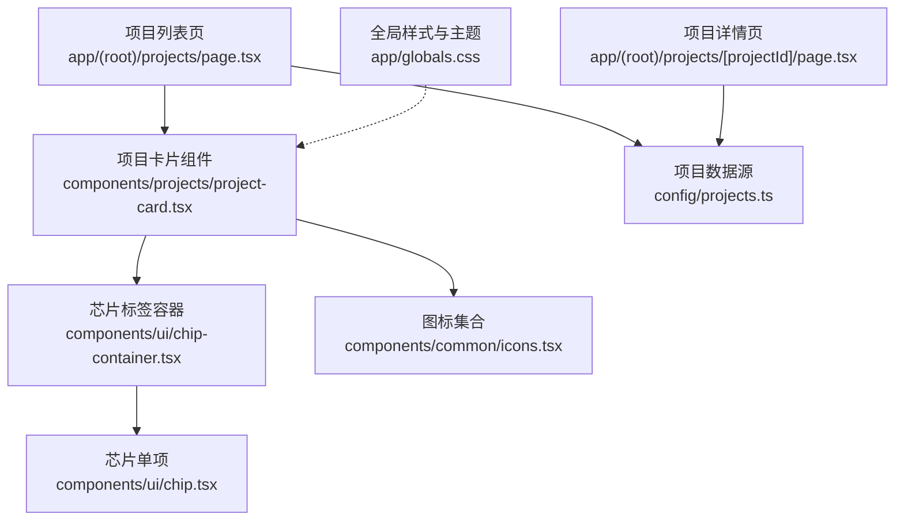
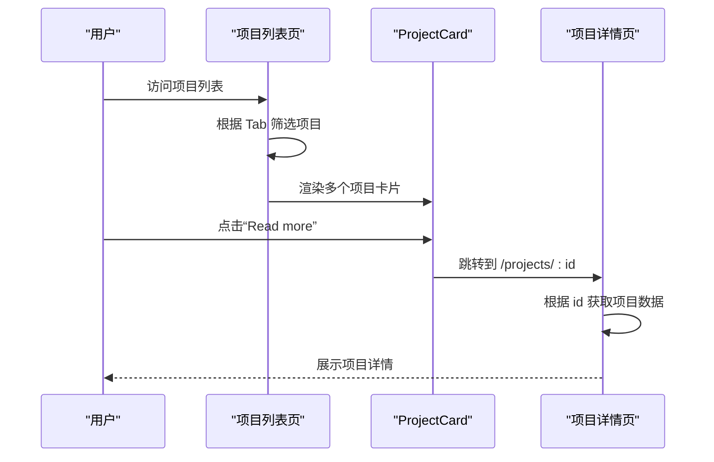
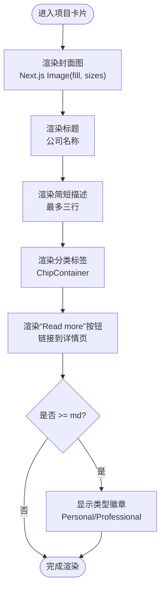
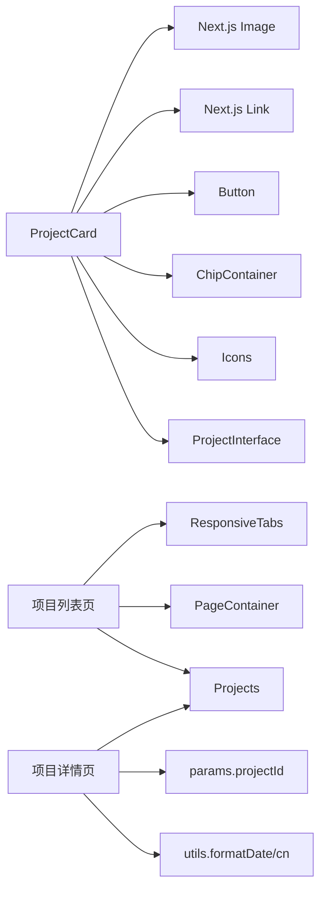

# 项目卡片组件

<cite>
**本文引用的文件**
- [project-card.tsx](file://components/projects/project-card.tsx)
- [projects.ts](file://config/projects.ts)
- [page.tsx（项目列表页）](file://app/(root)/projects/page.tsx)
- [page.tsx（项目详情页）](file://app/(root)/projects/[projectId]/page.tsx)
- [chip-container.tsx](file://components/ui/chip-container.tsx)
- [chip.tsx](file://components/ui/chip.tsx)
- [icons.tsx](file://components/common/icons.tsx)
- [constants.ts](file://config/constants.ts)
- [globals.css](file://app/globals.css)
</cite>

## 目录
1. [简介](#简介)
2. [项目结构](#项目结构)
3. [核心组件](#核心组件)
4. [架构总览](#架构总览)
5. [详细组件分析](#详细组件分析)
6. [依赖关系分析](#依赖关系分析)
7. [性能与优化](#性能与优化)
8. [故障排查](#故障排查)
9. [结论](#结论)
10. [附录：Props 接口与数据模型](#附录props-接口与数据模型)

## 简介
本项目卡片组件用于在“项目”列表中展示每个项目的关键信息，包括公司/项目名称、简短描述、技术栈标签、以及跳转至详情的交互入口。组件采用响应式布局，结合 Next.js 图片优化能力，确保在不同屏幕尺寸下具备良好的视觉与性能表现。同时，通过类型化配置驱动数据渲染，便于维护与扩展。

## 项目结构
- 组件层：项目卡片位于 components/projects 目录下，复用 UI 层的 Chip、Button、图标等基础组件。
- 数据层：项目数据集中定义在 config/projects.ts，包含项目元数据、技术栈、图片资源与页面信息。
- 路由层：项目列表页 app/(root)/projects/page.tsx 负责筛选并渲染多个 ProjectCard；项目详情页 app/(root)/projects/[projectId]/page.tsx 负责展示完整详情。
- 样式层：全局主题与动画由 app/globals.css 提供，支持多主题切换。

图表来源
- [page.tsx（项目列表页）:14-28](file://app/(root)/projects/page.tsx#L14-L28)
- [project-card.tsx:13-50](file://components/projects/project-card.tsx#L13-L50)
- [chip-container.tsx:7-14](file://components/ui/chip-container.tsx#L7-L14)
- [chip.tsx:5-10](file://components/ui/chip.tsx#L5-L10)
- [projects.ts:50-64](file://config/projects.ts#L50-L64)
- [page.tsx（项目详情页）:45-128](file://app/(root)/projects/[projectId]/page.tsx#L45-L128)
- [globals.css:28-159](file://app/globals.css#L28-L159)

章节来源
- [page.tsx（项目列表页）:1-59](file://app/(root)/projects/page.tsx#L1-L59)
- [project-card.tsx:1-52](file://components/projects/project-card.tsx#L1-L52)
- [projects.ts:1-422](file://config/projects.ts#L1-L422)

## 核心组件
- ProjectCard：接收一个项目对象，渲染封面图、标题、简短描述、分类标签、操作按钮与类型标识。
- ChipContainer / Chip：将字符串数组渲染为可换行的标签集合，用于展示分类或技术栈。
- Icons：统一封装的图标集合，用于显示“个人/职业”类型标识与导航箭头等。

章节来源
- [project-card.tsx:9-50](file://components/projects/project-card.tsx#L9-L50)
- [chip-container.tsx:3-14](file://components/ui/chip-container.tsx#L3-L14)
- [chip.tsx:1-12](file://components/ui/chip.tsx#L1-L12)
- [icons.tsx:90-170](file://components/common/icons.tsx#L90-L170)

## 架构总览
项目卡片的数据流遵循“配置驱动 + 组件渲染”的模式：
- 列表页从配置中读取 Projects 数组，按类型筛选后映射为多个 ProjectCard。
- 每个 ProjectCard 根据传入的项目对象渲染对应内容，并通过链接跳转到项目详情页。
- 详情页根据 projectId 查找对应项目，渲染更丰富的信息（技术栈、描述、图片画廊）。

图表来源
- [page.tsx（项目列表页）:14-28](file://app/(root)/projects/page.tsx#L14-L28)
- [project-card.tsx:35-40](file://components/projects/project-card.tsx#L35-L40)
- [page.tsx（项目详情页）:22-50](file://app/(root)/projects/[projectId]/page.tsx#L22-L50)

## 详细组件分析

### ProjectCard 实现要点
- 数据展示
  - 封面图：使用 Next.js Image 组件，设置 fill 与 sizes，适配不同视口宽度，提升加载性能。
  - 标题：公司名称，作为主要识别信息。
  - 简短描述：最多显示三行，超出部分省略，保持卡片整洁。
  - 分类标签：通过 ChipContainer 渲染 category 数组。
  - 操作按钮：链接到项目详情页，移动端与桌面端按钮宽度自适应。
  - 类型标识：右下角圆形徽章，根据 type 显示“个人/职业”图标。
- 响应式布局
  - 卡片高度自适应，内部使用 flex 纵向布局，保证内容对齐一致。
  - 图片区域固定高度，使用 object-contain 避免裁剪失真。
  - 标签区域支持换行，避免在小屏溢出。
- 图片优化
  - 使用 fill 模式配合 sizes 声明，让浏览器按需选择合适尺寸的图片。
  - 背景色与边框增强图片占位与可读性。
- 交互效果
  - 按钮具备默认样式与悬停态，提供明确的点击反馈。
  - 类型徽章仅在中等及以上屏幕显示，减少小屏干扰。

图表来源
- [project-card.tsx:15-48](file://components/projects/project-card.tsx#L15-L48)

章节来源
- [project-card.tsx:1-52](file://components/projects/project-card.tsx#L1-L52)

### 数据模型与 Props 接口
- ProjectInterface：定义项目数据结构，包含 id、type、companyName、category、shortDescription、websiteLink、githubLink、techStack、startDate、endDate、companyLogoImg、descriptionDetails、pagesInfoArr。
- ProjectCardProps：仅暴露 project 字段，类型为 ProjectInterface，确保类型安全。

章节来源
- [projects.ts:50-64](file://config/projects.ts#L50-L64)
- [project-card.tsx:9-11](file://components/projects/project-card.tsx#L9-L11)

### 列表页与详情页协作
- 列表页：根据当前 Tab 值过滤 Projects，渲染网格布局的卡片列表。
- 详情页：根据路由参数生成静态参数，查找项目并渲染标题、时间、链接、技术栈、描述与图片画廊。

章节来源
- [page.tsx（项目列表页）:14-28](file://app/(root)/projects/page.tsx#L14-L28)
- [page.tsx（项目详情页）:22-50](file://app/(root)/projects/[projectId]/page.tsx#L22-L50)
- [page.tsx（项目详情页）:114-198](file://app/(root)/projects/[projectId]/page.tsx#L114-L198)

### 标签与图标系统
- ChipContainer：接收字符串数组，循环渲染 Chip 组件，形成可换行的标签组。
- Chip：单个标签样式，使用圆角、边框与主题色，确保可读性与一致性。
- Icons：集中管理图标，如 chevronRight、userFill、work 等，供卡片与详情页复用。

章节来源
- [chip-container.tsx:3-14](file://components/ui/chip-container.tsx#L3-L14)
- [chip.tsx:1-12](file://components/ui/chip.tsx#L1-L12)
- [icons.tsx:90-170](file://components/common/icons.tsx#L90-L170)

## 依赖关系分析
- ProjectCard 依赖：
  - Next.js Image：图片优化与懒加载。
  - Next.js Link：客户端路由跳转。
  - UI 组件：Button、ChipContainer、Icons。
  - 配置类型：ProjectInterface。
- 列表页依赖：
  - ResponsiveTabs：响应式标签切换。
  - PageContainer：页面容器与标题描述。
  - 项目数据：Projects。
- 详情页依赖：
  - 动态路由参数：projectId。
  - 工具函数：formatDate、cn。
  - 项目数据：Projects。

图表来源
- [project-card.tsx:1-8](file://components/projects/project-card.tsx#L1-L8)
- [page.tsx（项目列表页）:1-8](file://app/(root)/projects/page.tsx#L1-L8)
- [page.tsx（项目详情页）:1-13](file://app/(root)/projects/[projectId]/page.tsx#L1-L13)

章节来源
- [project-card.tsx:1-52](file://components/projects/project-card.tsx#L1-L52)
- [page.tsx（项目列表页）:1-59](file://app/(root)/projects/page.tsx#L1-L59)
- [page.tsx（项目详情页）:1-214](file://app/(root)/projects/[projectId]/page.tsx#L1-L214)

## 性能与优化
- 图片优化
  - 使用 Next.js Image 的 fill 与 sizes 属性，使浏览器根据视口选择合适的图片尺寸，降低带宽占用。
  - 为图片设置合适的 alt 文本，提升可访问性与 SEO。
- 响应式策略
  - 列表页使用 Tailwind 断点控制网格列数，确保在手机端单列、平板双列、桌面多列。
  - 卡片内标签自动换行，避免溢出。
- 主题与样式
  - 通过 CSS 变量与主题类名（dark、retro、cyberpunk、aurora、synthwave、paper）统一管理颜色与圆角，便于全局切换。
- 交互与可访问性
  - 按钮具备焦点态与悬停态，提升键盘导航体验。
  - 链接目标明确，提供清晰的导航路径。

章节来源
- [project-card.tsx:17-23](file://components/projects/project-card.tsx#L17-L23)
- [page.tsx（项目列表页）:23-26](file://app/(root)/projects/page.tsx#L23-L26)
- [globals.css:28-159](file://app/globals.css#L28-L159)

## 故障排查
- 图片不显示或模糊
  - 检查 companyLogoImg 路径是否正确指向 public 目录下的资源。
  - 确认 sizes 与图片实际尺寸匹配，避免浏览器选择不合适的分辨率。
- 标签溢出或换行异常
  - 检查 ChipContainer 的父容器是否设置了正确的 flex-wrap。
  - 确认文本长度与字体大小，必要时调整间距。
- 链接跳转无效
  - 确认项目 id 存在且与详情页路由匹配。
  - 检查 generateStaticParams 是否返回了所有项目 id。
- 主题不生效
  - 确认根节点已应用对应的主题类名（如 dark、aurora 等）。
  - 检查 CSS 变量是否被正确覆盖。

章节来源
- [projects.ts:66-418](file://config/projects.ts#L66-L418)
- [page.tsx（项目详情页）:22-50](file://app/(root)/projects/[projectId]/page.tsx#L22-L50)
- [globals.css:28-159](file://app/globals.css#L28-L159)

## 结论
ProjectCard 组件以简洁的结构实现了项目信息的清晰展示与良好的跨设备适配。通过类型化配置与 Next.js 生态的能力，保证了可维护性、性能与用户体验。结合列表页与详情页的协作，形成了完整的项目展示链路。

## 附录：Props 接口与数据模型
- ProjectCardProps
  - project: ProjectInterface
- ProjectInterface 关键字段
  - id: 唯一标识
  - type: Personal | Professional
  - companyName: 公司/项目名称
  - category: 分类数组（如 Full Stack、Web Dev、UI/UX）
  - shortDescription: 简短描述
  - websiteLink: 可选官网链接
  - githubLink: 可选源码链接
  - techStack: 技术栈数组
  - startDate / endDate: 起止时间
  - companyLogoImg: 封面图路径
  - descriptionDetails: 详细描述段落与要点
  - pagesInfoArr: 页面信息数组（标题、描述、图片、布局等）

章节来源
- [project-card.tsx:9-11](file://components/projects/project-card.tsx#L9-L11)
- [projects.ts:50-64](file://config/projects.ts#L50-L64)
- [constants.ts:71-80](file://config/constants.ts#L71-L80)