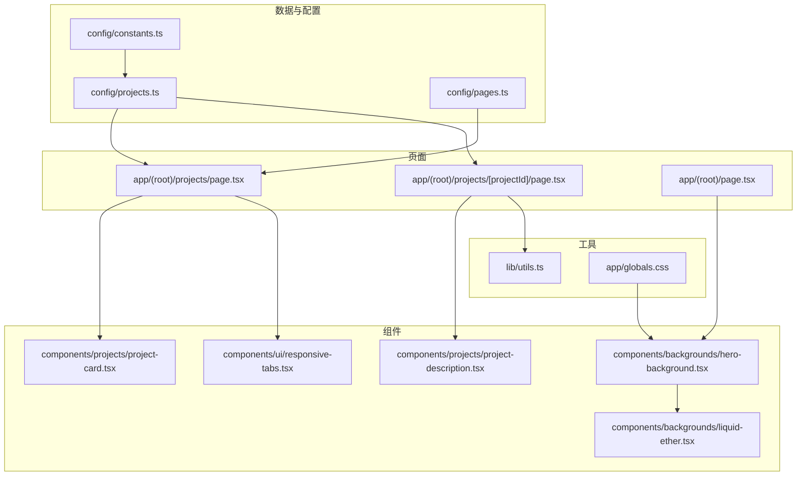
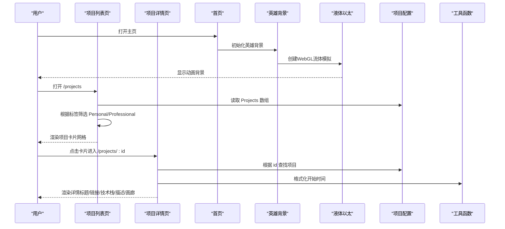
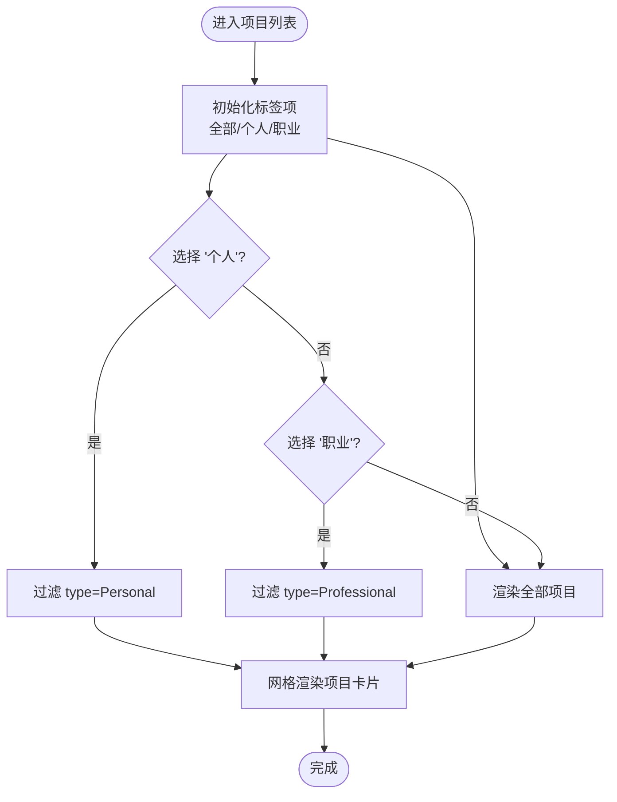
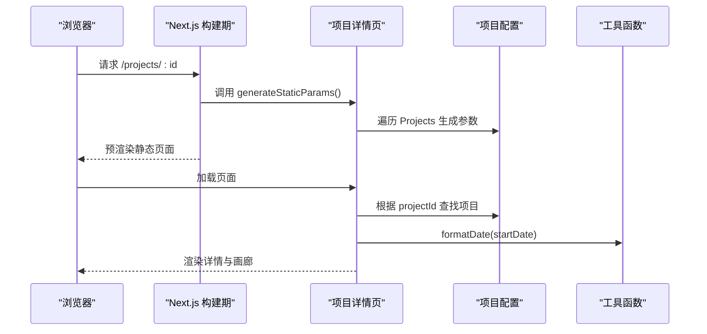
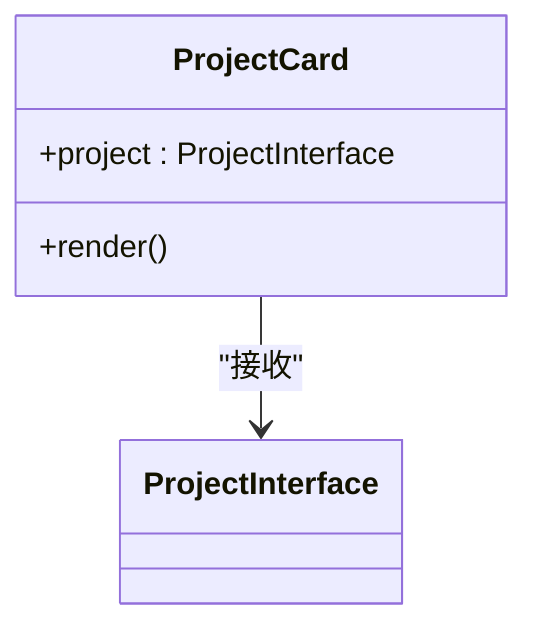
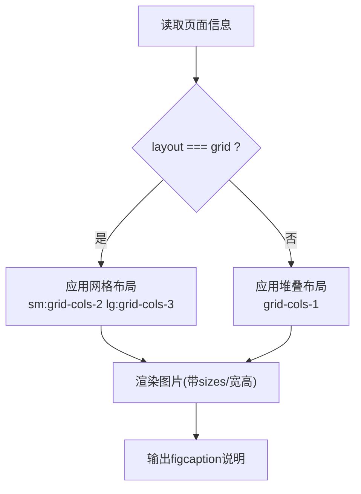
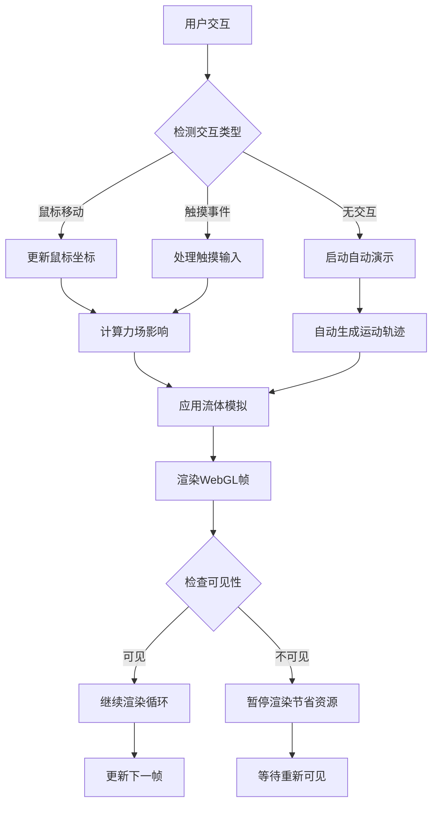
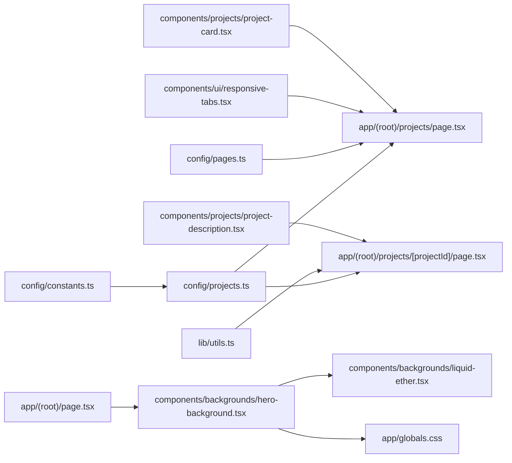

# 项目展示系统

<cite>
**本文引用的文件**
- [config/projects.ts](file://config/projects.ts)
- [app/(root)/projects/page.tsx](file://app/(root)/projects/page.tsx)
- [app/(root)/projects/[projectId]/page.tsx](file://app/(root)/projects/[projectId]/page.tsx)
- [components/projects/project-card.tsx](file://components/projects/project-card.tsx)
- [components/projects/project-description.tsx](file://components/projects/project-description.tsx)
- [components/ui/responsive-tabs.tsx](file://components/ui/responsive-tabs.tsx)
- [lib/utils.ts](file://lib/utils.ts)
- [config/constants.ts](file://config/constants.ts)
- [config/pages.ts](file://config/pages.ts)
- [components/backgrounds/liquid-ether.tsx](file://components/backgrounds/liquid-ether.tsx)
- [components/backgrounds/hero-background.tsx](file://components/backgrounds/hero-background.tsx)
- [app/(root)/page.tsx](file://app/(root)/page.tsx)
- [app/globals.css](file://app/globals.css)
</cite>

## 更新摘要
**所做更改**
- 新增英雄区域液体以太背景动画系统章节
- 更新首页集成说明，包含WebGL流体模拟效果
- 增强性能优化部分，添加3D渲染优化策略
- 扩展故障排查指南，包含WebGL相关问题的解决方案

## 目录
1. [简介](#简介)
2. [项目结构](#项目结构)
3. [核心组件](#核心组件)
4. [架构总览](#架构总览)
5. [详细组件分析](#详细组件分析)
6. [依赖关系分析](#依赖关系分析)
7. [性能与图片优化](#性能与图片优化)
8. [SEO 与可访问性](#seo-与可访问性)
9. [故障排查指南](#故障排查指南)
10. [结论](#结论)
11. [附录：配置示例与扩展实践](#附录：配置示例与扩展实践)

## 简介
本系统基于 Next.js App Router，提供"项目列表 + 项目详情"的完整展示能力。数据通过 TypeScript 配置文件集中管理，支持按类型筛选、动态路由生成、项目描述渲染与响应式图片画廊。页面包含 SEO 元信息、时间格式化、技术栈标签、来源标注与多主题适配，满足作品集网站对内容组织、视觉呈现与检索优化的综合需求。**最新更新**：增强了英雄区域，集成了基于 WebGL 和 Three.js 的液体以太背景动画系统，提供沉浸式流体模拟效果和鼠标交互体验。

## 项目结构
- 数据层：项目数据与类型定义集中在配置文件中，便于维护与扩展。
- 页面层：使用 App Router 的路由约定，实现静态参数生成与服务端渲染。
- 组件层：项目卡片、项目描述、响应式标签页等通用 UI 组件解耦业务逻辑。
- 工具层：日期格式化、类名合并等公共方法。
- **新增**：背景动画层：LiquidEther 组件提供 WebGL 流体模拟，HeroBackground 组件负责主题适配和性能优化。



**图表来源**
- [config/projects.ts:50-64](file://config/projects.ts#L50-L64)
- [app/(root)/projects/page.tsx:1-59](file://app/(root)/projects/page.tsx#L1-L59)
- [app/(root)/projects/[projectId]/page.tsx:1-214](file://app/(root)/projects/[projectId]/page.tsx#L1-L214)
- [components/projects/project-card.tsx:1-52](file://components/projects/project-card.tsx#L1-L52)
- [components/projects/project-description.tsx:1-24](file://components/projects/project-description.tsx#L1-L24)
- [components/ui/responsive-tabs.tsx:1-89](file://components/ui/responsive-tabs.tsx#L1-L89)
- [components/backgrounds/liquid-ether.tsx:1-936](file://components/backgrounds/liquid-ether.tsx#L1-L936)
- [components/backgrounds/hero-background.tsx:1-52](file://components/backgrounds/hero-background.tsx#L1-L52)
- [app/(root)/page.tsx:1-360](file://app/(root)/page.tsx#L1-L360)
- [app/globals.css:180-238](file://app/globals.css#L180-L238)

**章节来源**
- [config/projects.ts:50-64](file://config/projects.ts#L50-L64)
- [app/(root)/projects/page.tsx:1-59](file://app/(root)/projects/page.tsx#L1-L59)
- [app/(root)/projects/[projectId]/page.tsx:1-214](file://app/(root)/projects/[projectId]/page.tsx#L1-L214)
- [components/projects/project-card.tsx:1-52](file://components/projects/project-card.tsx#L1-L52)
- [components/projects/project-description.tsx:1-24](file://components/projects/project-description.tsx#L1-L24)
- [components/ui/responsive-tabs.tsx:1-89](file://components/ui/responsive-tabs.tsx#L1-L89)
- [components/backgrounds/liquid-ether.tsx:1-936](file://components/backgrounds/liquid-ether.tsx#L1-L936)
- [components/backgrounds/hero-background.tsx:1-52](file://components/backgrounds/hero-background.tsx#L1-L52)
- [app/(root)/page.tsx:1-360](file://app/(root)/page.tsx#L1-L360)
- [app/globals.css:180-238](file://app/globals.css#L180-L238)

## 核心组件
- 项目数据模型：统一的项目接口与类型约束，确保数据一致性与可扩展性。
- 项目列表页：基于响应式标签页实现"全部/个人/职业"筛选，网格布局展示项目卡片。
- 项目详情页：动态路由根据项目 ID 渲染标题、时间、链接、技术栈、描述段落与要点、以及多图画廊。
- 项目卡片：展示封面图、名称、摘要、分类标签与跳转按钮，并区分个人/职业类型标识。
- 项目描述：将段落与要点分别渲染为段落与列表，保持可读性。
- 响应式标签页：移动端下拉菜单、桌面端 Tab 切换，统一交互体验。
- **新增**：液体以太背景：基于 WebGL 和 Three.js 的流体模拟系统，支持鼠标交互、自动演示和主题感知配色。

**章节来源**
- [config/projects.ts:50-64](file://config/projects.ts#L50-L64)
- [app/(root)/projects/page.tsx:14-29](file://app/(root)/projects/page.tsx#L14-L29)
- [app/(root)/projects/[projectId]/page.tsx:22-43](file://app/(root)/projects/[projectId]/page.tsx#L22-L43)
- [components/projects/project-card.tsx:13-50](file://components/projects/project-card.tsx#L13-L50)
- [components/projects/project-description.tsx:3-21](file://components/projects/project-description.tsx#L3-L21)
- [components/ui/responsive-tabs.tsx:28-86](file://components/ui/responsive-tabs.tsx#L28-L86)
- [components/backgrounds/liquid-ether.tsx:64-936](file://components/backgrounds/liquid-ether.tsx#L64-L936)

## 架构总览
项目采用"配置驱动 + 组件化渲染"的架构：
- 配置层：集中定义项目数据结构、枚举常量与页面元信息。
- 页面层：Next.js 服务端组件负责获取数据、生成静态路由与元信息，并组合子组件。
- 组件层：UI 组件专注展示与交互，复用度高，易于定制。
- 工具层：提供日期格式化、类名合并等基础能力。
- **新增**：动画层：客户端组件提供 WebGL 流体模拟，支持性能优化和主题适配。



**图表来源**
- [app/(root)/projects/page.tsx:14-29](file://app/(root)/projects/page.tsx#L14-L29)
- [app/(root)/projects/[projectId]/page.tsx:22-43](file://app/(root)/projects/[projectId]/page.tsx#L22-L43)
- [app/(root)/page.tsx:83-84](file://app/(root)/page.tsx#L83-L84)
- [components/backgrounds/hero-background.tsx:17-51](file://components/backgrounds/hero-background.tsx#L17-L51)
- [components/backgrounds/liquid-ether.tsx:64-936](file://components/backgrounds/liquid-ether.tsx#L64-L936)
- [config/projects.ts:50-64](file://config/projects.ts#L50-L64)
- [lib/utils.ts:8-15](file://lib/utils.ts#L8-L15)

## 详细组件分析

### 项目数据模型设计
- 项目主接口包含唯一标识、类型、公司名、分类、简短描述、站点/GitHub 链接、技术栈、起止时间、公司 Logo、详细描述（段落与要点）、页面信息数组。
- 页面信息用于详情中的分节展示，包含标题、描述、图片集合、可选布局模式与图片来源标注。
- 图片对象包含源地址、替代文本、宽高与显示模式（全屏或紧凑）。
- 技术栈类型基于全局技能枚举扩展，兼容后端与前端生态。

```mermaid
classDiagram
class ProjectInterface {
+string id
+ValidExpType type
+string companyName
+ValidCategory[] category
+string shortDescription
+string websiteLink?
+string githubLink?
+ProjectTechnology[] techStack
+Date startDate
+Date endDate
+string companyLogoImg
+DescriptionDetailsInterface descriptionDetails
+PagesInfoInterface[] pagesInfoArr
}
class PagesInfoInterface {
+string title
+ProjectImageInterface[] images
+string description?
+"stack|grid" layout?
+{label : string; href : string} source?
}
class ProjectImageInterface {
+string src
+string alt
+number width
+number height
+"full|compact" display?
}
class DescriptionDetailsInterface {
+string[] paragraphs
+string[] bullets
}
ProjectInterface --> PagesInfoInterface : "包含"
PagesInfoInterface --> ProjectImageInterface : "包含"
ProjectInterface --> DescriptionDetailsInterface : "包含"
```

**图表来源**
- [config/projects.ts:3-64](file://config/projects.ts#L3-L64)

**章节来源**
- [config/projects.ts:3-64](file://config/projects.ts#L3-L64)
- [config/constants.ts:71-80](file://config/constants.ts#L71-L80)

### 项目列表与筛选机制
- 列表页通过响应式标签页提供"全部/个人/职业"三种视图。
- 筛选逻辑在渲染函数中根据当前标签值过滤 Projects 数组。
- 使用网格布局在不同屏幕尺寸下自适应列数，保证信息密度与可读性。



**图表来源**
- [app/(root)/projects/page.tsx:14-29](file://app/(root)/projects/page.tsx#L14-L29)
- [components/ui/responsive-tabs.tsx:28-86](file://components/ui/responsive-tabs.tsx#L28-L86)

**章节来源**
- [app/(root)/projects/page.tsx:14-29](file://app/(root)/projects/page.tsx#L14-L29)
- [components/ui/responsive-tabs.tsx:28-86](file://components/ui/responsive-tabs.tsx#L28-L86)

### 动态路由与详情页渲染
- 使用 generateStaticParams 基于项目配置生成所有项目的静态路由参数，提升首屏性能与 SEO。
- generateMetadata 根据项目 ID 动态设置页面标题、描述与 canonical 链接。
- 详情页渲染顺序：返回链接、时间、标题与外链图标、分类标签、作者信息、封面图、技术栈、项目描述、页面信息（含图库）。
- 图库支持两种布局：默认堆叠与网格；图片尺寸通过 sizes 属性进行响应式优化。



**图表来源**
- [app/(root)/projects/[projectId]/page.tsx:22-43](file://app/(root)/projects/[projectId]/page.tsx#L22-L43)
- [app/(root)/projects/[projectId]/page.tsx:45-214](file://app/(root)/projects/[projectId]/page.tsx#L45-L214)
- [lib/utils.ts:8-15](file://lib/utils.ts#L8-L15)

**章节来源**
- [app/(root)/projects/[projectId]/page.tsx:22-43](file://app/(root)/projects/[projectId]/page.tsx#L22-L43)
- [app/(root)/projects/[projectId]/page.tsx:45-214](file://app/(root)/projects/[projectId]/page.tsx#L45-L214)

### 项目卡片组件
- 展示封面图、项目名称、摘要、分类标签与"Read more"按钮。
- 右下角根据项目类型显示不同图标，增强识别度。
- 使用 Next/Image 的 fill 与 sizes 实现响应式图片。



**图表来源**
- [components/projects/project-card.tsx:9-50](file://components/projects/project-card.tsx#L9-L50)

**章节来源**
- [components/projects/project-card.tsx:9-50](file://components/projects/project-card.tsx#L9-L50)

### 项目描述渲染
- 将段落数组渲染为多个段落元素，要点数组渲染为有序列表。
- 结构简单清晰，便于后续扩展为富文本或 Markdown 渲染器。

**章节来源**
- [components/projects/project-description.tsx:3-21](file://components/projects/project-description.tsx#L3-L21)

### 图片画廊与响应式布局
- 详情页根据页面信息的 layout 字段决定使用单列堆叠或多列网格。
- 每张图片使用 Next/Image 并传入宽高与 sizes，结合容器宽度实现响应式加载。
- 支持 compact 显示模式以在移动端更友好地展示手机截图。



**图表来源**
- [app/(root)/projects/[projectId]/page.tsx:163-196](file://app/(root)/projects/[projectId]/page.tsx#L163-L196)

**章节来源**
- [app/(root)/projects/[projectId]/page.tsx:163-196](file://app/(root)/projects/[projectId]/page.tsx#L163-L196)

### 液体以太背景动画系统
- **WebGL 流体模拟**：基于 Three.js 实现高性能的流体动力学模拟，使用自定义着色器程序处理物理计算。
- **鼠标交互系统**：支持鼠标移动、触摸事件和自动演示模式，提供流畅的用户交互体验。
- **主题感知配色**：根据明暗主题自动切换颜色方案，确保视觉一致性。
- **性能优化**：使用 ResizeObserver、IntersectionObserver 和 requestAnimationFrame 优化渲染性能。
- **响应式设计**：支持移动端降级到 CSS 渐变背景，确保兼容性。



**图表来源**
- [components/backgrounds/liquid-ether.tsx:177-428](file://components/backgrounds/liquid-ether.tsx#L177-L428)
- [components/backgrounds/hero-background.tsx:17-51](file://components/backgrounds/hero-background.tsx#L17-L51)

**章节来源**
- [components/backgrounds/liquid-ether.tsx:64-936](file://components/backgrounds/liquid-ether.tsx#L64-L936)
- [components/backgrounds/hero-background.tsx:17-51](file://components/backgrounds/hero-background.tsx#L17-L51)
- [app/(root)/page.tsx:83-84](file://app/(root)/page.tsx#L83-L84)
- [app/globals.css:180-238](file://app/globals.css#L180-L238)

## 依赖关系分析
- 列表页依赖项目配置、响应式标签页与项目卡片组件。
- 详情页依赖项目配置、工具函数与项目描述组件。
- 常量与页面元信息被多处引用，形成稳定的配置契约。
- **新增**：首页依赖英雄背景组件，英雄背景组件依赖液体以太组件和CSS样式。



**图表来源**
- [config/projects.ts:50-64](file://config/projects.ts#L50-L64)
- [config/constants.ts:71-80](file://config/constants.ts#L71-L80)
- [config/pages.ts:32-39](file://config/pages.ts#L32-L39)
- [lib/utils.ts:8-15](file://lib/utils.ts#L8-L15)
- [components/ui/responsive-tabs.tsx:28-86](file://components/ui/responsive-tabs.tsx#L28-L86)
- [components/projects/project-card.tsx:9-50](file://components/projects/project-card.tsx#L9-L50)
- [components/projects/project-description.tsx:3-21](file://components/projects/project-description.tsx#L3-L21)
- [app/(root)/projects/page.tsx:1-59](file://app/(root)/projects/page.tsx#L1-L59)
- [app/(root)/projects/[projectId]/page.tsx:1-214](file://app/(root)/projects/[projectId]/page.tsx#L1-L214)
- [app/(root)/page.tsx:83-84](file://app/(root)/page.tsx#L83-L84)
- [components/backgrounds/hero-background.tsx:17-51](file://components/backgrounds/hero-background.tsx#L17-L51)
- [components/backgrounds/liquid-ether.tsx:64-936](file://components/backgrounds/liquid-ether.tsx#L64-L936)
- [app/globals.css:180-238](file://app/globals.css#L180-L238)

**章节来源**
- [config/projects.ts:50-64](file://config/projects.ts#L50-L64)
- [config/constants.ts:71-80](file://config/constants.ts#L71-L80)
- [config/pages.ts:32-39](file://config/pages.ts#L32-L39)
- [lib/utils.ts:8-15](file://lib/utils.ts#L8-L15)
- [components/ui/responsive-tabs.tsx:28-86](file://components/ui/responsive-tabs.tsx#L28-L86)
- [components/projects/project-card.tsx:9-50](file://components/projects/project-card.tsx#L9-L50)
- [components/projects/project-description.tsx:3-21](file://components/projects/project-description.tsx#L3-L21)
- [app/(root)/projects/page.tsx:1-59](file://app/(root)/projects/page.tsx#L1-L59)
- [app/(root)/projects/[projectId]/page.tsx:1-214](file://app/(root)/projects/[projectId]/page.tsx#L1-L214)
- [app/(root)/page.tsx:83-84](file://app/(root)/page.tsx#L83-L84)
- [components/backgrounds/hero-background.tsx:17-51](file://components/backgrounds/hero-background.tsx#L17-L51)
- [components/backgrounds/liquid-ether.tsx:64-936](file://components/backgrounds/liquid-ether.tsx#L64-L936)
- [app/globals.css:180-238](file://app/globals.css#L180-L238)

## 性能与图片优化
- 静态路由生成：通过 generateStaticParams 预先生成所有项目详情页，减少运行时开销。
- 图片优化：
  - 列表卡片使用 fill 与 sizes 实现响应式加载。
  - 详情页大图与画廊图片均提供宽高与 sizes，避免布局抖动并提升加载效率。
  - 封面图使用 priority 优先加载关键资源。
- 响应式布局：网格列数随断点变化，移动端使用紧凑模式展示手机截图，提升可读性。
- 组件拆分：将描述、卡片、标签页拆分为独立组件，利于缓存与复用。
- **新增**：WebGL 优化：
  - 使用 ResizeObserver 监听容器大小变化，避免不必要的重绘。
  - IntersectionObserver 检测组件可见性，不可见时暂停渲染节省资源。
  - 使用 requestAnimationFrame 优化动画性能，避免阻塞主线程。
  - 移动端降级到 CSS 渐变背景，确保兼容性。
  - 支持 prefers-reduced-motion 媒体查询，尊重用户偏好。

**章节来源**
- [app/(root)/projects/[projectId]/page.tsx:22-24](file://app/(root)/projects/[projectId]/page.tsx#L22-L24)
- [app/(root)/projects/[projectId]/page.tsx:114-121](file://app/(root)/projects/[projectId]/page.tsx#L114-L121)
- [app/(root)/projects/[projectId]/page.tsx:163-196](file://app/(root)/projects/[projectId]/page.tsx#L163-L196)
- [components/projects/project-card.tsx:16-23](file://components/projects/project-card.tsx#L16-L23)
- [components/backgrounds/liquid-ether.tsx:85-92](file://components/backgrounds/liquid-ether.tsx#L85-L92)
- [components/backgrounds/hero-background.tsx:18-26](file://components/backgrounds/hero-background.tsx#L18-L26)

## SEO 与可访问性
- 元信息：
  - 列表页使用页面配置中的标题与描述。
  - 详情页根据项目信息动态生成标题、描述与 canonical 链接。
- 语义化：
  - 使用 article、time、h1/h2/h3 等语义标签组织内容。
  - 图片提供 alt 文本，figcaption 补充说明。
- 链接与来源：
  - GitHub 与外部站点链接在新窗口打开，并提供 Tooltip 提示。
  - 图片来源标注可点击跳转至原始出处。
- **新增**：动画可访问性：
  - 使用 aria-hidden="true" 隐藏装饰性动画元素。
  - 支持 prefers-reduced-motion 媒体查询，尊重用户动画偏好。
  - 提供 CSS 渐变背景作为降级方案，确保无 JavaScript 环境下的基本视觉效果。

**章节来源**
- [app/(root)/projects/page.tsx:9-12](file://app/(root)/projects/page.tsx#L9-L12)
- [app/(root)/projects/[projectId]/page.tsx:26-43](file://app/(root)/projects/[projectId]/page.tsx#L26-L43)
- [app/(root)/projects/[projectId]/page.tsx:64-89](file://app/(root)/projects/[projectId]/page.tsx#L64-L89)
- [app/(root)/projects/[projectId]/page.tsx:150-162](file://app/(root)/projects/[projectId]/page.tsx#L150-L162)
- [components/backgrounds/hero-background.tsx:29-33](file://components/backgrounds/hero-background.tsx#L29-L33)

## 故障排查指南
- 项目不存在时重定向：当详情页找不到对应项目时，会重定向到项目列表页，避免 404 空白。
- 图片未显示：检查图片路径是否正确、宽高与 sizes 是否合理，确保 public 目录下存在对应资源。
- 筛选不生效：确认标签值与项目 type 字段匹配，检查响应式标签页的状态更新逻辑。
- 时间格式异常：确认 startDate 为 Date 对象或可解析字符串，使用工具函数格式化。
- **新增**：WebGL 相关问题：
  - 动画不显示：检查浏览器是否支持 WebGL，查看控制台是否有 WebGL 错误。
  - 性能问题：降低 resolution 参数或启用 isViscous 选项减少计算量。
  - 内存泄漏：确保组件卸载时正确调用 dispose 方法释放 WebGL 资源。
  - 移动端兼容：检查是否启用了硬件加速，必要时降级到 CSS 背景。
  - 主题切换：确认 next-themes 配置正确，颜色方案能正确响应主题变化。

**章节来源**
- [app/(root)/projects/[projectId]/page.tsx:45-50](file://app/(root)/projects/[projectId]/page.tsx#L45-L50)
- [app/(root)/projects/page.tsx:14-29](file://app/(root)/projects/page.tsx#L14-L29)
- [lib/utils.ts:8-15](file://lib/utils.ts#L8-L15)
- [components/backgrounds/liquid-ether.tsx:888-936](file://components/backgrounds/liquid-ether.tsx#L888-L936)

## 结论
该展示系统通过类型化的项目配置与组件化渲染，实现了灵活、可维护且高性能的项目展示能力。动态路由、响应式图片与 SEO 元信息共同保障了用户体验与搜索引擎友好性。**最新更新**：液体以太背景动画系统的引入显著提升了首页的视觉吸引力，通过 WebGL 流体模拟和智能性能优化，在提供沉浸式体验的同时确保了良好的性能和兼容性。未来可在描述渲染中引入 Markdown、增加更多筛选维度与统计指标，进一步提升内容表现力与分析能力。

## 附录：配置示例与扩展实践

### 添加新项目
- 在配置文件中新增一个项目对象，遵循 ProjectInterface 的结构，填写必填字段与可选字段。
- 如需在首页或精选区展示，调整 featuredProjects 切片范围。
- 参考路径：[config/projects.ts:66-409](file://config/projects.ts#L66-L409)

**章节来源**
- [config/projects.ts:66-409](file://config/projects.ts#L66-L409)

### 自定义项目卡片样式
- 修改项目卡片的布局、间距、边框与阴影等样式类，或在外层包裹自定义容器。
- 可通过 props 扩展显示更多字段（如技术栈预览、状态标签）。
- 参考路径：[components/projects/project-card.tsx:13-50](file://components/projects/project-card.tsx#L13-L50)

**章节来源**
- [components/projects/project-card.tsx:13-50](file://components/projects/project-card.tsx#L13-L50)

### 扩展项目详情页面功能
- 在详情页中添加新的区块（如"演示视频"、"下载资源"），复用现有布局与组件。
- 扩展页面信息数组，增加新的媒体类型或交互模块。
- 参考路径：[app/(root)/projects/[projectId]/page.tsx:140-199](file://app/(root)/projects/[projectId]/page.tsx#L140-L199)

**章节来源**
- [app/(root)/projects/[projectId]/page.tsx:140-199](file://app/(root)/projects/[projectId]/page.tsx#L140-L199)

### 液体以太背景配置
- **颜色方案**：通过 colors 属性自定义颜色数组，支持明暗主题切换。
- **交互强度**：调整 mouseForce 控制鼠标影响力，cursorSize 控制光标影响范围。
- **性能调优**：resolution 控制渲染分辨率，iterationsPoisson 控制计算精度。
- **自动演示**：启用 autoDemo 后，无人交互时自动播放预设动画。
- **参考路径**：[components/backgrounds/hero-background.tsx:12-46](file://components/backgrounds/hero-background.tsx#L12-L46)

**章节来源**
- [components/backgrounds/hero-background.tsx:12-46](file://components/backgrounds/hero-background.tsx#L12-L46)

### 项目配置示例（字段说明）
- id：唯一标识，用于路由与定位。
- type：项目类型，用于筛选（个人/职业）。
- category：分类标签，用于展示与筛选扩展。
- shortDescription：简短描述，用于卡片摘要。
- websiteLink/githubLink：外部链接，用于外链展示。
- techStack：技术栈数组，用于标签展示。
- startDate/endDate：起止时间，用于时间展示与时长计算。
- companyLogoImg：封面图路径，用于卡片与详情页展示。
- descriptionDetails：详细描述（段落与要点），用于详情页渲染。
- pagesInfoArr：页面信息数组，用于分节展示与图库。

**章节来源**
- [config/projects.ts:50-64](file://config/projects.ts#L50-L64)

### 图片优化策略
- 列表卡片：使用 fill 与 sizes 实现响应式加载，避免固定尺寸导致的浪费。
- 详情页大图：提供宽高与 sizes，必要时使用 priority 提升首屏体验。
- 图库图片：根据布局选择合适的 sizes，确保在不同视口下加载合适分辨率。
- 图片 alt 与 figcaption：提升可访问性与 SEO。

**章节来源**
- [components/projects/project-card.tsx:16-23](file://components/projects/project-card.tsx#L16-L23)
- [app/(root)/projects/[projectId]/page.tsx:114-121](file://app/(root)/projects/[projectId]/page.tsx#L114-L121)
- [app/(root)/projects/[projectId]/page.tsx:163-196](file://app/(root)/projects/[projectId]/page.tsx#L163-L196)

### 响应式布局实现
- 列表页：使用网格布局在不同断点下调整列数，保证信息密度。
- 详情页图库：根据 layout 字段切换堆叠或网格布局，移动端使用紧凑模式。
- 标签页：移动端下拉菜单，桌面端 Tab 切换，统一交互体验。

**章节来源**
- [app/(root)/projects/page.tsx:22-27](file://app/(root)/projects/page.tsx#L22-L27)
- [app/(root)/projects/[projectId]/page.tsx:163-196](file://app/(root)/projects/[projectId]/page.tsx#L163-L196)
- [components/ui/responsive-tabs.tsx:40-86](file://components/ui/responsive-tabs.tsx#L40-L86)

### SEO 优化技巧
- 列表页：使用页面配置中的标题与描述，保持一致性。
- 详情页：动态生成标题、描述与 canonical，提升索引质量。
- 语义化标签：合理使用 article、time、h1-h3，增强结构化信息。
- 外链与来源：为新窗口外链提供 Tooltip 与来源标注，提升可信度。

**章节来源**
- [app/(root)/projects/page.tsx:9-12](file://app/(root)/projects/page.tsx#L9-L12)
- [app/(root)/projects/[projectId]/page.tsx:26-43](file://app/(root)/projects/[projectId]/page.tsx#L26-L43)
- [app/(root)/projects/[projectId]/page.tsx:64-89](file://app/(root)/projects/[projectId]/page.tsx#L64-L89)
- [app/(root)/projects/[projectId]/page.tsx:150-162](file://app/(root)/projects/[projectId]/page.tsx#L150-L162)

### WebGL 流体模拟配置
- **基础参数**：mouseForce（鼠标力）、cursorSize（光标大小）、resolution（渲染分辨率）。
- **物理模拟**：isViscous（粘性模式）、viscous（粘性系数）、iterationsPoisson（泊松迭代次数）。
- **性能优化**：BFECC（双向前向欧拉修正）、dt（时间步长）、isBounce（边界反弹）。
- **自动演示**：autoDemo（自动播放）、autoSpeed（自动速度）、autoIntensity（自动强度）。
- **参考路径**：[components/backgrounds/liquid-ether.tsx:11-31](file://components/backgrounds/liquid-ether.tsx#L11-L31)

**章节来源**
- [components/backgrounds/liquid-ether.tsx:11-31](file://components/backgrounds/liquid-ether.tsx#L11-L31)

### 主题与样式定制
- **颜色方案**：light/dark 主题使用不同的渐变色板，确保视觉一致性。
- **CSS 渐变**：提供 hero-liquid-fallback 和 hero-liquid-overlay 作为降级背景。
- **文本阴影**：hero-liquid-content 类为前景内容添加合适的阴影效果。
- **参考路径**：[app/globals.css:180-238](file://app/globals.css#L180-L238)

**章节来源**
- [app/globals.css:180-238](file://app/globals.css#L180-L238)