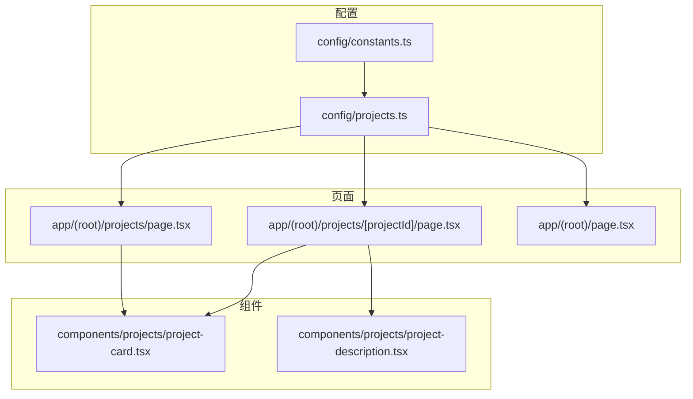
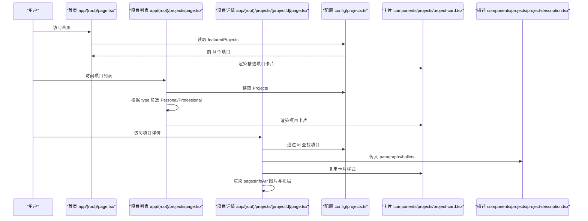
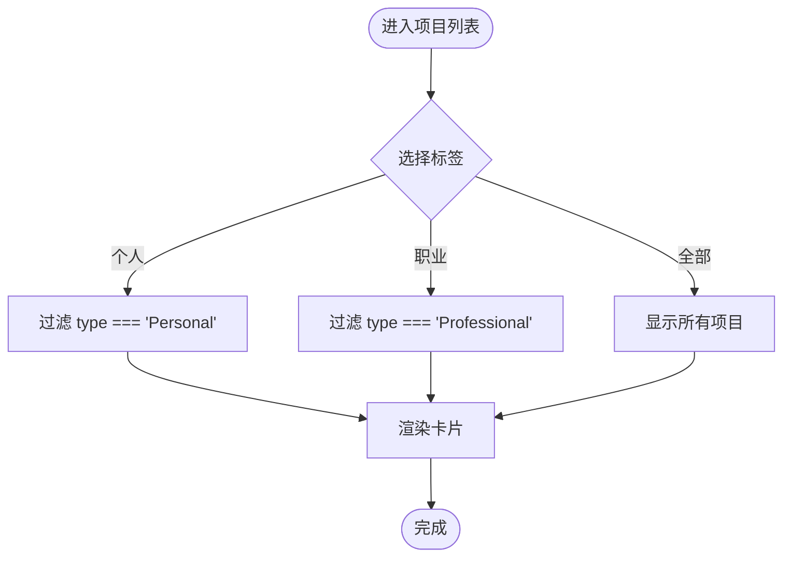
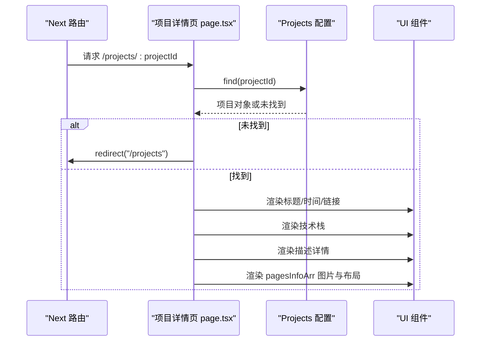
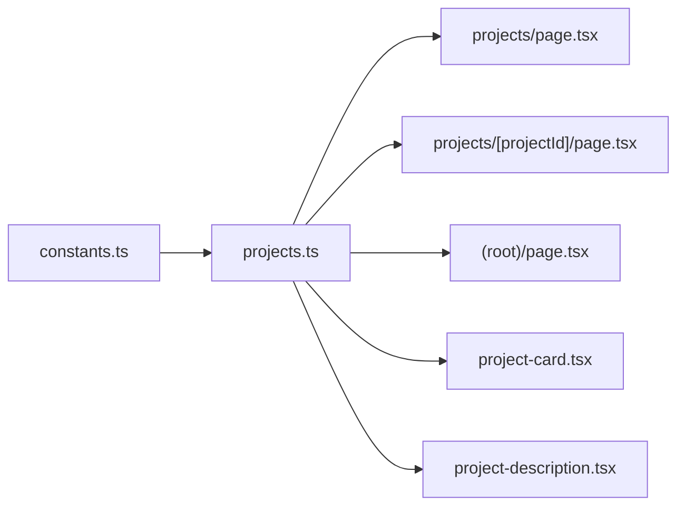

# 项目数据模型与配置

<cite>
**本文引用的文件**
- [config/projects.ts](file://config/projects.ts)
- [config/constants.ts](file://config/constants.ts)
- [app/(root)/projects/page.tsx](file://app/(root)/projects/page.tsx)
- [app/(root)/projects/[projectId]/page.tsx](file://app/(root)/projects/[projectId]/page.tsx)
- [components/projects/project-card.tsx](file://components/projects/project-card.tsx)
- [components/projects/project-description.tsx](file://components/projects/project-description.tsx)
- [app/(root)/page.tsx](file://app/(root)/page.tsx)
</cite>

## 目录
1. [简介](#简介)
2. [项目结构](#项目结构)
3. [核心组件](#核心组件)
4. [架构总览](#架构总览)
5. [详细组件分析](#详细组件分析)
6. [依赖关系分析](#依赖关系分析)
7. [性能考虑](#性能考虑)
8. [故障排查指南](#故障排查指南)
9. [结论](#结论)
10. [附录：配置示例与最佳实践](#附录配置示例与最佳实践)

## 简介
本文件聚焦 Next.js 投资组合中的“项目数据模型与配置系统”，系统性说明项目数据结构、页面信息组织方式、图片配置选项，以及首页“精选项目”的筛选逻辑。文档面向希望扩展或维护该项目的开发者，既提供类型层面的严谨说明，也给出可操作的配置建议。

## 项目结构
本项目将项目相关的数据与展示解耦：
- 数据层：集中在 config/projects.ts，定义项目接口、图片接口、页面信息接口、描述详情接口，并导出 Projects 数组与 featuredProjects。
- 常量层：config/constants.ts 定义技能、分类、经验类型等枚举，确保技术栈与分类的一致性。
- 展示层：项目列表页、详情页、卡片组件与描述组件分别消费上述数据，渲染为 UI。

图表来源
- [config/projects.ts:1-64](file://config/projects.ts#L1-L64)
- [config/constants.ts:71-80](file://config/constants.ts#L71-L80)
- [app/(root)/projects/page.tsx:14-29](file://app/(root)/projects/page.tsx#L14-L29)
- [app/(root)/projects/[projectId]/page.tsx:22-43](file://app/(root)/projects/[projectId]/page.tsx#L22-L43)
- [app/(root)/page.tsx:163-175](file://app/(root)/page.tsx#L163-L175)
- [components/projects/project-card.tsx:13-51](file://components/projects/project-card.tsx#L13-L51)
- [components/projects/project-description.tsx:3-21](file://components/projects/project-description.tsx#L3-L21)

章节来源
- [config/projects.ts:1-64](file://config/projects.ts#L1-L64)
- [config/constants.ts:71-80](file://config/constants.ts#L71-L80)
- [app/(root)/projects/page.tsx:14-29](file://app/(root)/projects/page.tsx#L14-L29)
- [app/(root)/projects/[projectId]/page.tsx:22-43](file://app/(root)/projects/[projectId]/page.tsx#L22-L43)
- [app/(root)/page.tsx:163-175](file://app/(root)/page.tsx#L163-L175)
- [components/projects/project-card.tsx:13-51](file://components/projects/project-card.tsx#L13-L51)
- [components/projects/project-description.tsx:3-21](file://components/projects/project-description.tsx#L3-L21)

## 核心组件
本节从类型与职责角度解析核心数据模型与配置项。

- ProjectInterface（项目主模型）
  - id: 唯一标识，用于路由与静态参数生成。
  - type: 经验类型，限制为 Personal 或 Professional，用于筛选与图标展示。
  - companyName: 公司/项目名称，用于标题与图片 alt。
  - category: 分类数组，来自 ValidCategory，用于标签展示与筛选。
  - shortDescription: 简短描述，用于卡片摘要与元信息。
  - websiteLink?: 可选，项目官网链接。
  - githubLink?: 可选，源码仓库链接。
  - techStack: 技术栈数组，来自 ProjectTechnology（基于 ValidSkills 扩展），用于标签展示。
  - startDate / endDate: 起止时间，用于详情页时间展示。
  - companyLogoImg: 项目封面图路径。
  - descriptionDetails: 详细描述块，包含段落与要点。
  - pagesInfoArr: 多段页面信息，每段包含标题、描述、图片集合、布局与来源标注。

- DescriptionDetailsInterface（描述详情）
  - paragraphs: 段落文本数组，按顺序渲染为多个段落。
  - bullets: 要点文本数组，渲染为无序列表。

- PagesInfoInterface（页面信息）
  - title: 小节标题。
  - images: 图片集合，使用 ProjectImageInterface。
  - description?: 可选的小节描述。
  - layout?: 可选布局，stack 或 grid，控制图片网格列数。
  - source?: 可选图片来源标注，包含 label 与 href。

- ProjectImageInterface（图片配置）
  - src: 图片路径。
  - alt: 替代文本。
  - width / height: 图片尺寸，用于响应式与占位。
  - display?: 可选显示模式，full 或 compact，compact 时在小屏居中缩窄显示。

章节来源
- [config/projects.ts:3-64](file://config/projects.ts#L3-L64)
- [config/constants.ts:71-80](file://config/constants.ts#L71-L80)

## 架构总览
下图展示了项目数据如何从配置流向页面与组件，包括列表页筛选、详情页渲染与首页精选项目展示。

图表来源
- [app/(root)/page.tsx:163-175](file://app/(root)/page.tsx#L163-L175)
- [config/projects.ts:421-422](file://config/projects.ts#L421-L422)
- [app/(root)/projects/page.tsx:14-29](file://app/(root)/projects/page.tsx#L14-L29)
- [app/(root)/projects/[projectId]/page.tsx:22-43](file://app/(root)/projects/[projectId]/page.tsx#L22-L43)
- [components/projects/project-card.tsx:13-51](file://components/projects/project-card.tsx#L13-L51)
- [components/projects/project-description.tsx:3-21](file://components/projects/project-description.tsx#L3-L21)

## 详细组件分析

### 项目主模型与字段约束
- id: 字符串，作为路由参数与静态参数生成的键值。
- type: 枚举 Personal | Professional，用于列表页筛选与卡片图标区分。
- companyName: 字符串，用于标题与图片 alt。
- category: 数组，元素来自 ValidCategory，用于标签展示与筛选。
- shortDescription: 字符串，用于卡片摘要与 SEO 描述。
- websiteLink?: 可选外链。
- githubLink?: 可选源码链接。
- techStack: 数组，元素来自 ProjectTechnology（ValidSkills 扩展），用于标签展示。
- startDate / endDate: Date 对象，用于详情页时间格式化展示。
- companyLogoImg: 字符串路径，用于封面图。
- descriptionDetails: 描述详情对象，包含 paragraphs 与 bullets。
- pagesInfoArr: 页面信息数组，每个元素包含 title、images、description、layout、source。

章节来源
- [config/projects.ts:50-64](file://config/projects.ts#L50-L64)
- [config/constants.ts:71-80](file://config/constants.ts#L71-L80)

### 描述详情 DescriptionDetailsInterface
- paragraphs: 段落数组，按顺序渲染为多个 
。
- bullets: 要点数组，渲染为 <ul><li> 列表。

章节来源
- [config/projects.ts:22-25](file://config/projects.ts#L22-L25)
- [components/projects/project-description.tsx:3-21](file://components/projects/project-description.tsx#L3-L21)

### 页面信息 PagesInfoInterface
- title: 小节标题。
- images: 图片集合，使用 ProjectImageInterface。
- description?: 可选描述。
- layout?: stack 或 grid，grid 时在中等及以上屏幕采用多列布局。
- source?: 图片来源标注，包含 label 与 href，在详情页以“图片来源：xxx”形式呈现。

章节来源
- [config/projects.ts:11-20](file://config/projects.ts#L11-L20)
- [app/(root)/projects/[projectId]/page.tsx:144-162](file://app/(root)/projects/[projectId]/page.tsx#L144-L162)

### 图片配置 ProjectImageInterface
- src: 图片路径。
- alt: 替代文本。
- width / height: 图片尺寸，用于响应式与占位。
- display?: full 或 compact，compact 时在小屏居中缩窄显示。

章节来源
- [config/projects.ts:3-9](file://config/projects.ts#L3-L9)
- [app/(root)/projects/[projectId]/page.tsx:163-176](file://app/(root)/projects/[projectId]/page.tsx#L163-L176)

### 项目列表与筛选逻辑
- 列表页支持三种视图：全部、个人（Personal）、职业（Professional）。
- 筛选依据是 project.type，类型为 Personal 或 Professional。
- 卡片组件根据 type 显示不同图标，增强视觉区分。

图表来源
- [app/(root)/projects/page.tsx:14-29](file://app/(root)/projects/page.tsx#L14-L29)
- [components/projects/project-card.tsx:42-48](file://components/projects/project-card.tsx#L42-L48)

章节来源
- [app/(root)/projects/page.tsx:14-29](file://app/(root)/projects/page.tsx#L14-L29)
- [components/projects/project-card.tsx:42-48](file://components/projects/project-card.tsx#L42-L48)

### 首页精选项目 featuredProjects
- featuredProjects 由 Projects 数组的前 N 项组成（当前为前 4 项）。
- 首页直接渲染 featuredProjects，形成“精选项目”区块。
- 点击“查看全部”跳转至项目列表页。

章节来源
- [config/projects.ts:421-422](file://config/projects.ts#L421-L422)
- [app/(root)/page.tsx:163-175](file://app/(root)/page.tsx#L163-L175)

### 项目详情页渲染流程
- 通过动态路由参数 projectId 查找对应项目。
- 若未找到则重定向到项目列表。
- 渲染项目基本信息、技术栈、描述详情与页面信息图片。
- 支持外链（网站、GitHub）与图片来源标注。

图表来源
- [app/(root)/projects/[projectId]/page.tsx:22-43](file://app/(root)/projects/[projectId]/page.tsx#L22-L43)
- [app/(root)/projects/[projectId]/page.tsx:123-176](file://app/(root)/projects/[projectId]/page.tsx#L123-L176)

章节来源
- [app/(root)/projects/[projectId]/page.tsx:22-43](file://app/(root)/projects/[projectId]/page.tsx#L22-L43)
- [app/(root)/projects/[projectId]/page.tsx:123-176](file://app/(root)/projects/[projectId]/page.tsx#L123-L176)

## 依赖关系分析
- 配置依赖常量：ProjectTechnology 基于 ValidSkills 扩展；category 使用 ValidCategory；type 使用 ValidExpType。
- 页面依赖配置：列表页与详情页均从 config/projects.ts 读取数据。
- 组件依赖配置：卡片与描述组件消费项目数据，进行 UI 渲染。
- 首页依赖配置：featuredProjects 直接从 Projects 切片得到。

图表来源
- [config/constants.ts:71-80](file://config/constants.ts#L71-L80)
- [config/projects.ts:1-64](file://config/projects.ts#L1-L64)
- [app/(root)/projects/page.tsx:14-29](file://app/(root)/projects/page.tsx#L14-L29)
- [app/(root)/projects/[projectId]/page.tsx:22-43](file://app/(root)/projects/[projectId]/page.tsx#L22-L43)
- [app/(root)/page.tsx:163-175](file://app/(root)/page.tsx#L163-L175)
- [components/projects/project-card.tsx:13-51](file://components/projects/project-card.tsx#L13-L51)
- [components/projects/project-description.tsx:3-21](file://components/projects/project-description.tsx#L3-L21)

章节来源
- [config/constants.ts:71-80](file://config/constants.ts#L71-L80)
- [config/projects.ts:1-64](file://config/projects.ts#L1-L64)
- [app/(root)/projects/page.tsx:14-29](file://app/(root)/projects/page.tsx#L14-L29)
- [app/(root)/projects/[projectId]/page.tsx:22-43](file://app/(root)/projects/[projectId]/page.tsx#L22-L43)
- [app/(root)/page.tsx:163-175](file://app/(root)/page.tsx#L163-L175)
- [components/projects/project-card.tsx:13-51](file://components/projects/project-card.tsx#L13-L51)
- [components/projects/project-description.tsx:3-21](file://components/projects/project-description.tsx#L3-L21)

## 性能考虑
- 列表页与详情页均为服务端渲染，数据来源于本地配置，无网络请求开销。
- 图片尺寸明确，有助于浏览器优化加载与布局稳定性。
- 首页精选项目仅使用前 N 项，减少首屏渲染压力。
- 建议在新增项目时保持图片宽高合理，避免过大导致首屏阻塞。

[本节为通用指导，不直接分析具体文件]

## 故障排查指南
- 详情页找不到项目：检查项目 id 是否与路由参数一致，并确保 Projects 中存在该 id。
- 列表筛选无效：确认项目 type 是否为 Personal 或 Professional，且与筛选条件匹配。
- 图片不显示：检查 src 路径是否正确，width/height 是否合理，display 是否符合预期。
- 描述不渲染：确认 descriptionDetails.paragraphs 与 bullets 是否为非空数组。
- 图片来源标注不显示：确认 pagesInfoArr 中 source 是否存在且包含 label 与 href。

章节来源
- [app/(root)/projects/[projectId]/page.tsx:22-43](file://app/(root)/projects/[projectId]/page.tsx#L22-L43)
- [app/(root)/projects/page.tsx:14-29](file://app/(root)/projects/page.tsx#L14-L29)
- [config/projects.ts:11-20](file://config/projects.ts#L11-L20)
- [config/projects.ts:3-9](file://config/projects.ts#L3-L9)
- [components/projects/project-description.tsx:3-21](file://components/projects/project-description.tsx#L3-L21)

## 结论
该项目数据模型与配置系统通过 TypeScript 接口与常量枚举，实现了强类型的项目数据管理。列表页与详情页清晰消费配置数据，首页通过 featuredProjects 提供精选展示。整体结构简洁、可扩展性强，适合持续添加新项目与丰富内容。

[本节为总结性内容，不直接分析具体文件]

## 附录：配置示例与最佳实践

- 添加新项目的步骤
  - 在 config/projects.ts 的 Projects 数组末尾追加新对象。
  - 填写必填字段：id、companyName、type、category、shortDescription、techStack、startDate、endDate、companyLogoImg、descriptionDetails、pagesInfoArr。
  - 可选字段：websiteLink、githubLink、pagesInfoArr.description、pagesInfoArr.layout、pagesInfoArr.source。

- 设置项目分类
  - category 使用 ValidCategory 枚举值，如 Full Stack、Backend、Web Dev、UI/UX 等。
  - 可在列表页通过 type 与 category 组合实现更细粒度筛选（如需扩展筛选逻辑）。

- 配置技术栈标签
  - techStack 使用 ProjectTechnology 类型，优先使用 ValidSkills 中的值，必要时可添加新的技术名称。
  - 建议保持技术名称统一，便于标签展示与后续统计。

- 配置描述内容
  - descriptionDetails.paragraphs：用于项目背景、目标与成果的多段描述。
  - descriptionDetails.bullets：用于关键贡献、技术亮点与量化成果的要点列表。

- 配置页面信息与图片
  - pagesInfoArr：每个元素代表一个展示小节，包含 title、description、images、layout、source。
  - images：使用 ProjectImageInterface，指定 src、alt、width、height，可选 display 为 full 或 compact。
  - layout：stack 为单列，grid 为多列（中等及以上屏幕）。
  - source：标注图片来源，包含 label 与 href，在详情页以链接形式展示。

- 精选项目 featuredProjects
  - 默认取 Projects 前 4 项，可通过修改切片范围调整数量。
  - 首页直接渲染 featuredProjects，形成“精选项目”区块。

章节来源
- [config/projects.ts:66-422](file://config/projects.ts#L66-L422)
- [config/constants.ts:71-80](file://config/constants.ts#L71-L80)
- [app/(root)/page.tsx:163-175](file://app/(root)/page.tsx#L163-L175)
- [app/(root)/projects/[projectId]/page.tsx:144-176](file://app/(root)/projects/[projectId]/page.tsx#L144-L176)