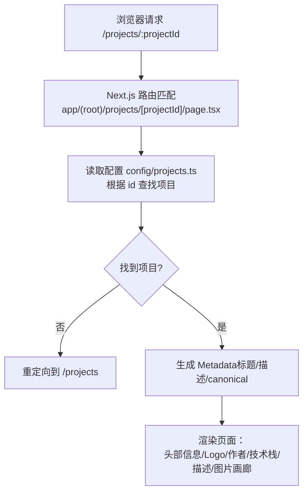
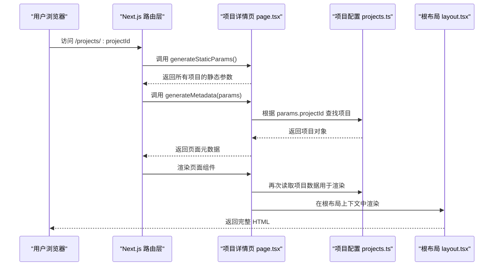
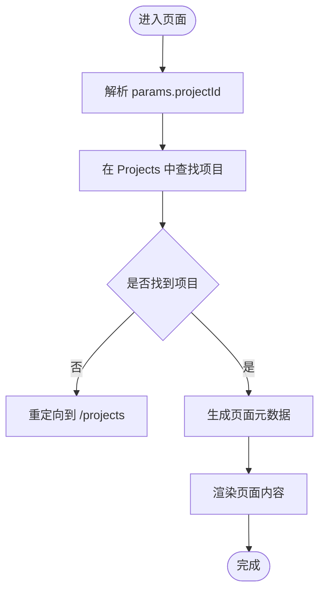
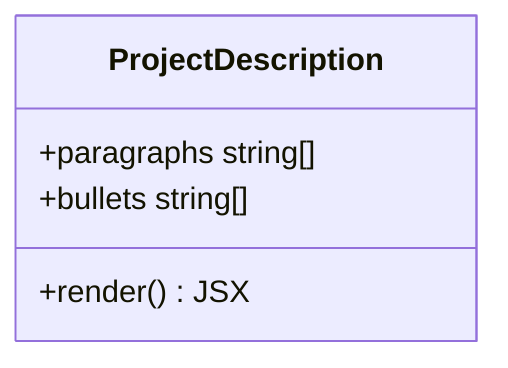
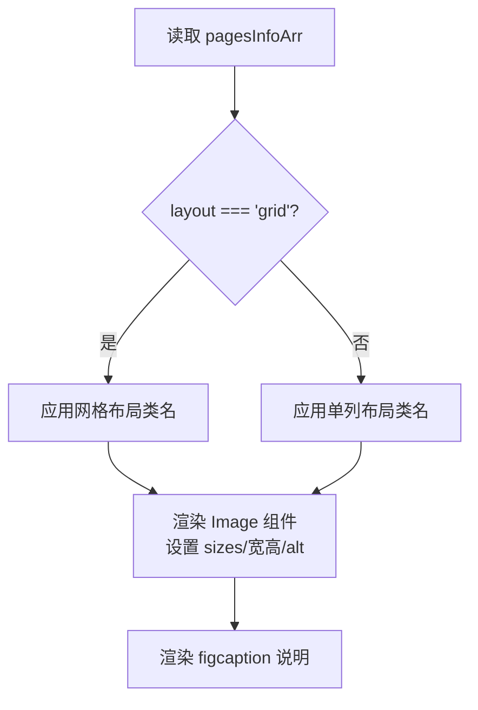
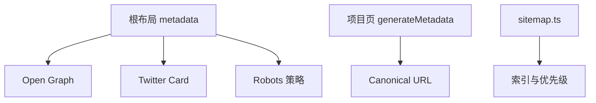
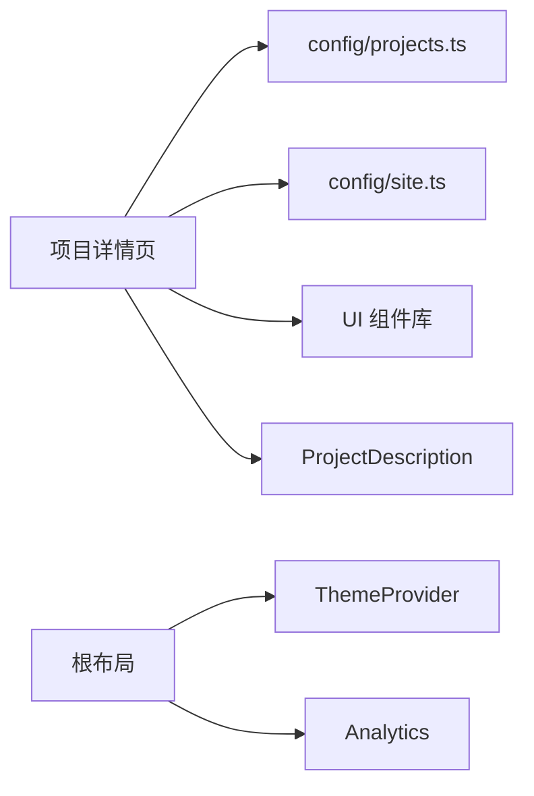

# 项目详情页

<cite>
**本文引用的文件**
- [app/(root)/projects/[projectId]/page.tsx](file://app/(root)/projects/[projectId]/page.tsx)
- [components/projects/project-description.tsx](file://components/projects/project-description.tsx)
- [config/projects.ts](file://config/projects.ts)
- [app/layout.tsx](file://app/layout.tsx)
- [config/site.ts](file://config/site.ts)
- [components/ui/chip-container.tsx](file://components/ui/chip-container.tsx)
- [app/sitemap.ts](file://app/sitemap.ts)
</cite>

## 目录
1. [简介](#简介)
2. [项目结构](#项目结构)
3. [核心组件](#核心组件)
4. [架构总览](#架构总览)
5. [详细组件分析](#详细组件分析)
6. [依赖关系分析](#依赖关系分析)
7. [性能与可访问性](#性能与可访问性)
8. [故障排查指南](#故障排查指南)
9. [结论](#结论)
10. [附录：扩展指引](#附录扩展指引)

## 简介
本文件面向 Next.js 投资组合中的“项目详情页”，围绕动态路由 [projectId] 的实现机制、项目数据加载与渲染流程、ProjectDescription 组件功能、页面布局组织、SEO 优化措施以及图片画廊实现原理进行系统化说明，并提供扩展页面功能的实践建议。

## 项目结构
项目详情页位于 App Router 的动态路由段中，通过 [projectId] 参数匹配具体项目，并从集中配置中读取项目数据，渲染头部信息、技术栈标签、项目描述与图片画廊等区块。

图表来源
- [app/(root)/projects/[projectId]/page.tsx:22-50](file://app/(root)/projects/[projectId]/page.tsx#L22-L50)
- [config/projects.ts:66-161](file://config/projects.ts#L66-L161)

章节来源
- [app/(root)/projects/[projectId]/page.tsx:1-214](file://app/(root)/projects/[projectId]/page.tsx#L1-L214)
- [config/projects.ts:1-422](file://config/projects.ts#L1-L422)

## 核心组件
- 动态路由页：负责获取 projectId、查找项目、生成元数据、渲染页面结构与内容。
- ProjectDescription：接收多段落与要点列表，渲染为可读的项目描述区块。
- ChipContainer：将技术栈或分类以标签形式展示。
- 站点根布局：提供全局 SEO 元数据、主题、分析与脚本注入。

章节来源
- [app/(root)/projects/[projectId]/page.tsx:1-214](file://app/(root)/projects/[projectId]/page.tsx#L1-L214)
- [components/projects/project-description.tsx:1-24](file://components/projects/project-description.tsx#L1-L24)
- [components/ui/chip-container.tsx:1-16](file://components/ui/chip-container.tsx#L1-L16)
- [app/layout.tsx:1-131](file://app/layout.tsx#L1-L131)

## 架构总览
下图展示了从请求到渲染的端到端流程，包括静态参数生成、元数据生成、数据加载与页面渲染。

图表来源
- [app/(root)/projects/[projectId]/page.tsx:22-50](file://app/(root)/projects/[projectId]/page.tsx#L22-L50)
- [config/projects.ts:66-161](file://config/projects.ts#L66-L161)
- [app/layout.tsx:18-85](file://app/layout.tsx#L18-L85)

## 详细组件分析

### 动态路由 [projectId] 的实现机制
- 路由参数获取：页面函数通过异步 props.params 获取 projectId。
- 静态参数预生成：generateStaticParams 遍历 Projects 配置，为每个项目生成对应的静态路由参数，便于构建期预渲染。
- 数据加载与校验：服务端渲染时根据 projectId 在 Projects 中查找对应项目；若未找到则重定向到项目列表页。
- 元数据生成：generateMetadata 基于项目信息设置 title、description 与 canonical URL，利于 SEO。

图表来源
- [app/(root)/projects/[projectId]/page.tsx:22-50](file://app/(root)/projects/[projectId]/page.tsx#L22-L50)
- [config/projects.ts:66-161](file://config/projects.ts#L66-L161)

章节来源
- [app/(root)/projects/[projectId]/page.tsx:16-50](file://app/(root)/projects/[projectId]/page.tsx#L16-L50)
- [config/projects.ts:66-161](file://config/projects.ts#L66-L161)

### ProjectDescription 组件
- 输入：paragraphs（字符串数组）、bullets（字符串数组）。
- 输出：按顺序渲染多个段落与一个无序列表，呈现项目详细描述与关键要点。
- 设计要点：结构简单、无外部依赖，适合纯文本内容的稳定展示。

图表来源
- [components/projects/project-description.tsx:1-24](file://components/projects/project-description.tsx#L1-L24)

章节来源
- [components/projects/project-description.tsx:1-24](file://components/projects/project-description.tsx#L1-L24)

### 页面结构组织
- 项目头部信息：包含时间、项目名称、GitHub/外链图标、分类标签、作者头像与用户名。
- 技术栈：使用 ChipContainer 展示 techStack 标签集合。
- 项目描述：通过 ProjectDescription 渲染 paragraphs 与 bullets。
- 图片画廊：基于 pagesInfoArr 渲染多张图片，支持 grid/stack 布局与响应式 sizes。

图表来源
- [app/(root)/projects/[projectId]/page.tsx:52-199](file://app/(root)/projects/[projectId]/page.tsx#L52-L199)
- [config/projects.ts:89-143](file://config/projects.ts#L89-L143)

章节来源
- [app/(root)/projects/[projectId]/page.tsx:52-199](file://app/(root)/projects/[projectId]/page.tsx#L52-L199)

### 图片画廊实现原理
- 数据来源：pagesInfoArr 中的 images 数组，每项包含 src、alt、width、height、display 等字段。
- 布局模式：
  - stack：单列布局。
  - grid：响应式网格布局，小屏一列，中屏两列，大屏三列。
- 响应式图片：使用 Next.js Image 组件并设置 sizes，使不同视口下加载合适尺寸的图片。
- 交互与样式：统一边框、圆角、背景色与过渡效果，figcaption 显示图片说明。

图表来源
- [app/(root)/projects/[projectId]/page.tsx:140-199](file://app/(root)/projects/[projectId]/page.tsx#L140-L199)
- [config/projects.ts:3-20](file://config/projects.ts#L3-L20)

章节来源
- [app/(root)/projects/[projectId]/page.tsx:140-199](file://app/(root)/projects/[projectId]/page.tsx#L140-L199)
- [config/projects.ts:3-20](file://config/projects.ts#L3-L20)

### SEO 优化措施
- 根级元数据：在根布局中定义 site 级别的 title、description、keywords、Open Graph、Twitter Card、icons、manifest、robots 与 Google verification。
- 页面级元数据：项目详情页通过 generateMetadata 设置页面专属 title、description 与 canonical。
- 站点地图：sitemap.ts 声明主要页面与博客文章，提升搜索引擎收录效率。
- 结构化数据：博客详情页已实现 BlogPosting 与 BreadcrumbList JSON-LD；项目详情页可按需扩展类似的结构化标记以提升搜索结果展示质量。

图表来源
- [app/layout.tsx:18-85](file://app/layout.tsx#L18-L85)
- [app/(root)/projects/[projectId]/page.tsx:26-43](file://app/(root)/projects/[projectId]/page.tsx#L26-L43)
- [app/sitemap.ts:6-70](file://app/sitemap.ts#L6-L70)

章节来源
- [app/layout.tsx:18-85](file://app/layout.tsx#L18-L85)
- [app/(root)/projects/[projectId]/page.tsx:26-43](file://app/(root)/projects/[projectId]/page.tsx#L26-L43)
- [app/sitemap.ts:6-70](file://app/sitemap.ts#L6-L70)

## 依赖关系分析
- 页面组件依赖：
  - 项目详情页依赖项目配置（Projects）与站点配置（siteConfig），并使用 UI 组件（Button、ChipContainer、Tooltip、Icons）。
  - ProjectDescription 仅依赖 React，无外部状态。
- 配置驱动：
  - 项目数据集中管理于 config/projects.ts，便于维护与扩展。
- 根布局依赖：
  - 提供主题、分析与脚本注入，影响全站行为。

图表来源
- [app/(root)/projects/[projectId]/page.tsx:1-214](file://app/(root)/projects/[projectId]/page.tsx#L1-L214)
- [config/projects.ts:66-161](file://config/projects.ts#L66-L161)
- [config/site.ts:1-39](file://config/site.ts#L1-L39)
- [app/layout.tsx:87-131](file://app/layout.tsx#L87-L131)

章节来源
- [app/(root)/projects/[projectId]/page.tsx:1-214](file://app/(root)/projects/[projectId]/page.tsx#L1-L214)
- [config/projects.ts:66-161](file://config/projects.ts#L66-L161)
- [config/site.ts:1-39](file://config/site.ts#L1-L39)
- [app/layout.tsx:87-131](file://app/layout.tsx#L87-L131)

## 性能与可访问性
- 图片性能：
  - 使用 Next.js Image 组件，配合 sizes 属性实现响应式图片加载，减少带宽占用。
  - 首图使用 priority 提升首屏加载体验。
- 构建期优化：
  - generateStaticParams 预生成静态路由，提高首屏渲染速度。
- 可访问性：
  - 图片 alt 文本完善，语义化标签（time、figure、figcaption）增强无障碍阅读。
- 主题与动效：
  - 根布局启用 next-themes 多主题，注意动效对性能的影响，按需开启。

章节来源
- [app/(root)/projects/[projectId]/page.tsx:114-199](file://app/(root)/projects/[projectId]/page.tsx#L114-L199)
- [app/(root)/projects/[projectId]/page.tsx:22-24](file://app/(root)/projects/[projectId]/page.tsx#L22-L24)
- [app/layout.tsx:100-117](file://app/layout.tsx#L100-L117)

## 故障排查指南
- 404 或重定向问题：
  - 检查项目中是否存在对应 id；不存在会重定向到 /projects。
- 图片不显示或模糊：
  - 确认图片路径正确且宽高合理；sizes 与布局匹配；优先使用高质量原图。
- SEO 元数据异常：
  - 核对 generateMetadata 返回的 title/description/canonical；检查根布局的 Open Graph/Twitter Card 配置。
- 静态参数缺失：
  - 确保 generateStaticParams 遍历 Projects 并返回完整参数列表。

章节来源
- [app/(root)/projects/[projectId]/page.tsx:22-50](file://app/(root)/projects/[projectId]/page.tsx#L22-L50)
- [app/(root)/projects/[projectId]/page.tsx:114-199](file://app/(root)/projects/[projectId]/page.tsx#L114-L199)
- [app/layout.tsx:18-85](file://app/layout.tsx#L18-L85)

## 结论
项目详情页通过动态路由与集中配置实现了高效的数据驱动渲染，具备清晰的页面结构与良好的 SEO 基础。图片画廊采用响应式布局与 Next.js Image 优化，兼顾性能与体验。建议在项目详情页补充结构化数据与社交媒体分享优化，进一步提升搜索与社交传播效果。

## 附录：扩展指引
- 添加视频展示：
  - 在 pagesInfoArr 中新增 video 字段（如 src、poster、muted、autoplay），并在画廊区域增加视频卡片组件，适配移动端播放控制。
- 代码示例集成：
  - 新增 codeBlocks 字段，使用语法高亮组件渲染代码片段，支持复制与折叠。
- 外部链接集成：
  - 在头部或描述区增加“在线演示”“文档”等按钮，使用 CustomTooltip 提示，目标新窗口打开。
- 结构化数据增强：
  - 为项目详情页添加 SoftwareApplication 或 WebPage JSON-LD，标注名称、描述、图片、作者与发布日期，提升搜索结果富摘要展示。
- 社交媒体分享优化：
  - 在 generateMetadata 中补充 openGraph.images 与 twitter.images，确保分享预览图清晰且尺寸符合平台要求。

[本节为概念性指导，不直接分析具体文件]