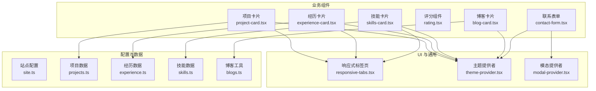
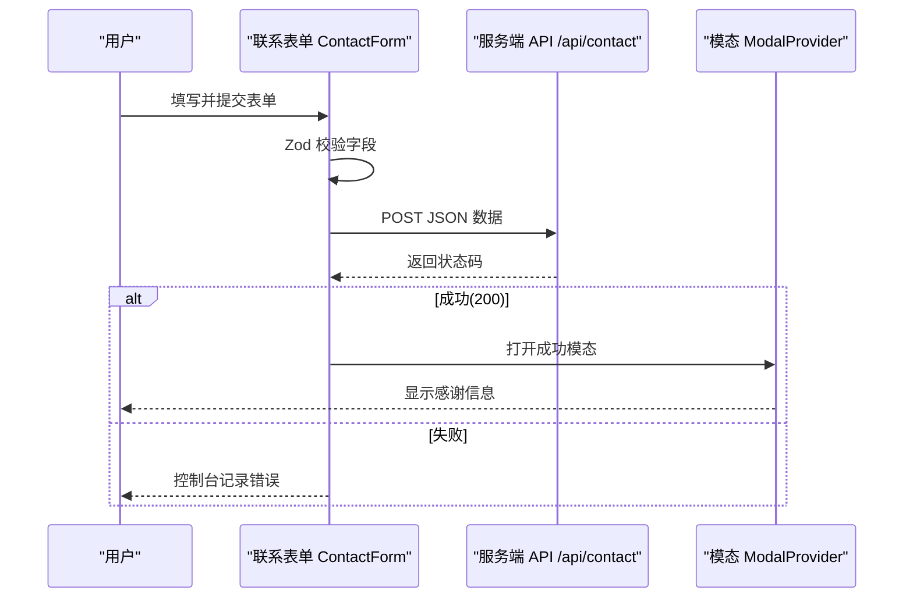
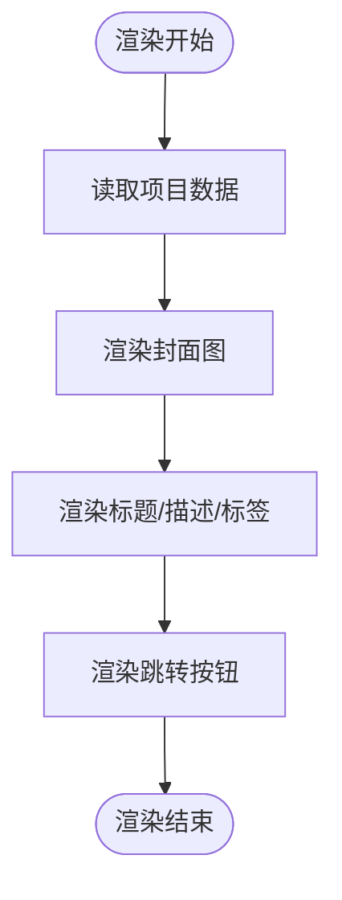
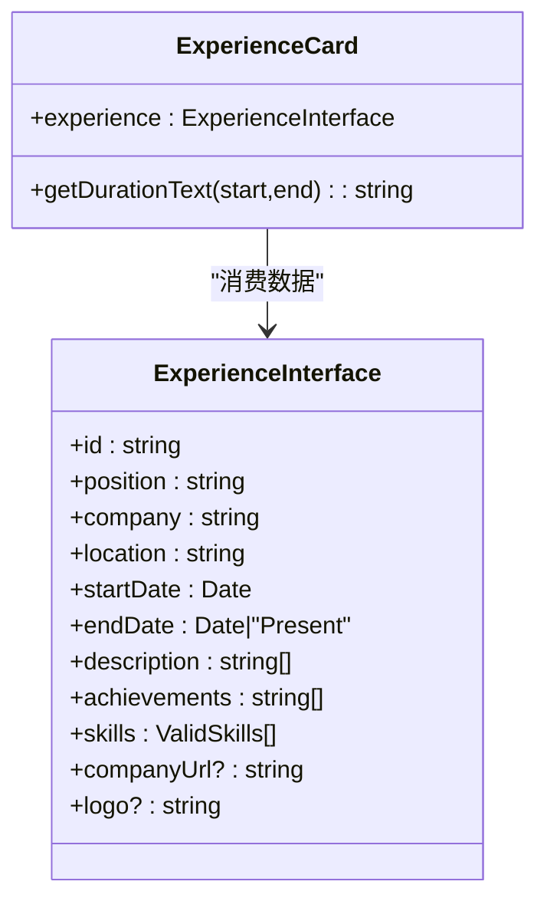
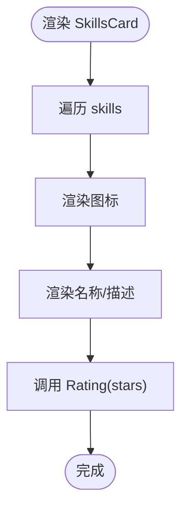
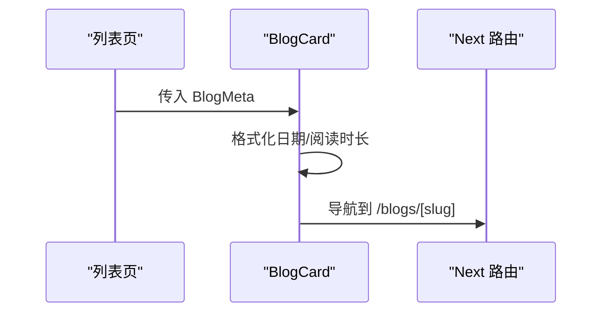
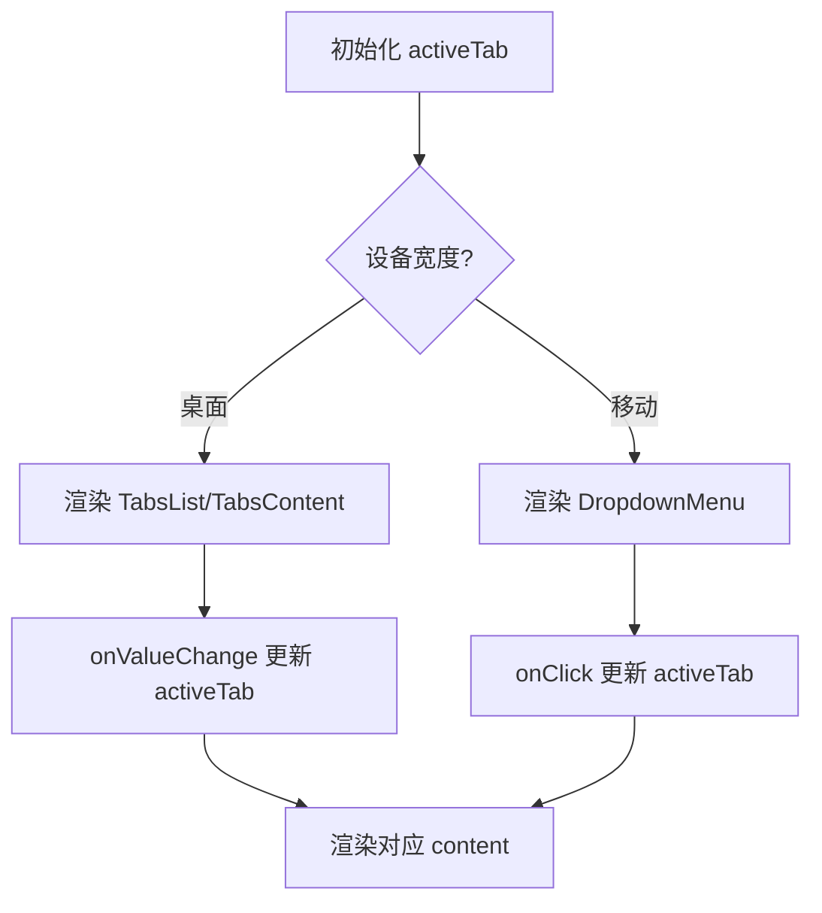
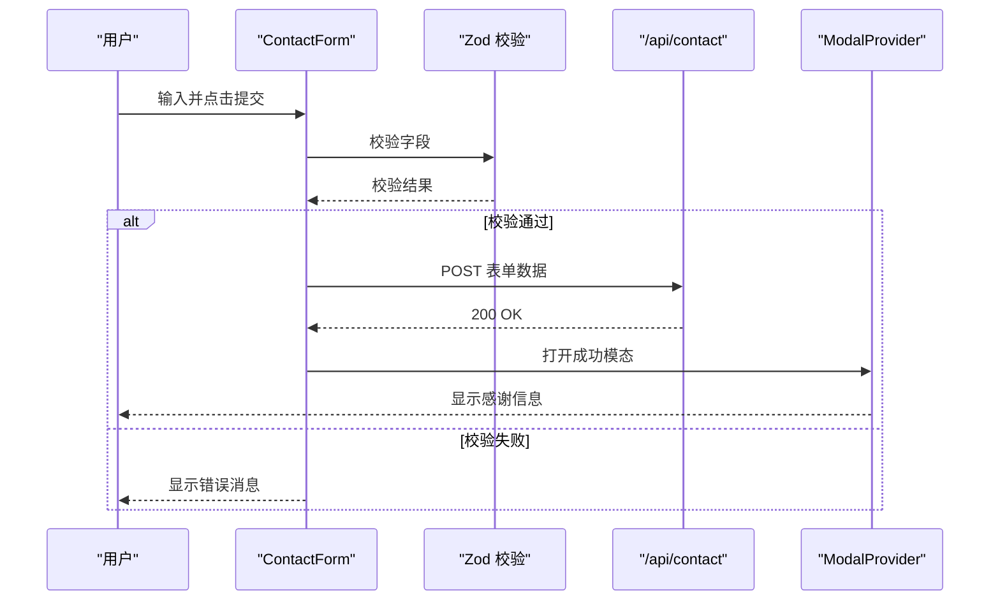
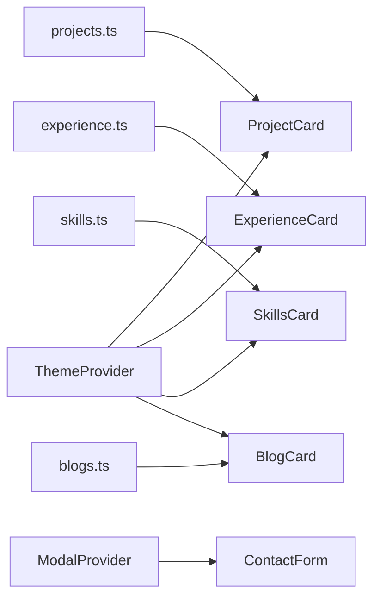

# 业务组件

<cite>
**本文引用的文件**
- [components/common/main-nav.tsx](file://components/common/main-nav.tsx)
- [components/projects/project-card.tsx](file://components/projects/project-card.tsx)
- [components/experience/experience-card.tsx](file://components/experience/experience-card.tsx)
- [components/skills/skills-card.tsx](file://components/skills/skills-card.tsx)
- [components/skills/rating.tsx](file://components/skills/rating.tsx)
- [components/blogs/blog-card.tsx](file://components/blogs/blog-card.tsx)
- [components/forms/contact-form.tsx](file://components/forms/contact-form.tsx)
- [components/ui/responsive-tabs.tsx](file://components/ui/responsive-tabs.tsx)
- [components/common/theme-provider.tsx](file://components/common/theme-provider.tsx)
- [providers/modal-provider.tsx](file://providers/modal-provider.tsx)
- [config/site.ts](file://config/site.ts)
- [config/projects.ts](file://config/projects.ts)
- [config/experience.ts](file://config/experience.ts)
- [config/skills.ts](file://config/skills.ts)
- [lib/blogs.ts](file://lib/blogs.ts)
</cite>

## 目录
1. [简介](#简介)
2. [项目结构](#项目结构)
3. [核心组件](#核心组件)
4. [架构总览](#架构总览)
5. [详细组件分析](#详细组件分析)
6. [依赖关系分析](#依赖关系分析)
7. [性能考量](#性能考量)
8. [故障排查指南](#故障排查指南)
9. [结论](#结论)
10. [附录：API 参考与配置](#附录api-参考与配置)

## 简介
本文件聚焦于本项目中的高级业务组件，系统性说明其业务逻辑、数据流处理、状态管理、与其他组件的交互关系，并提供完整的 API 参考、配置选项、使用示例、可定制性与主题支持、响应式设计实现、组合模式、性能优化建议与常见问题解决方案。目标是帮助开发者快速理解并正确使用这些封装了业务逻辑的组件。

## 项目结构
项目采用 Next.js App Router 组织页面与路由，业务组件集中在 components 目录下，按功能域划分（如 projects、experience、skills、blogs、forms），通用 UI 组件位于 components/ui，站点配置集中于 config，博客内容通过 Markdown + gray-matter 在 lib/blogs.ts 中解析提供。

图表来源
- [components/projects/project-card.tsx:1-51](file://components/projects/project-card.tsx#L1-L51)
- [components/experience/experience-card.tsx:1-112](file://components/experience/experience-card.tsx#L1-L112)
- [components/skills/skills-card.tsx:1-31](file://components/skills/skills-card.tsx#L1-L31)
- [components/skills/rating.tsx:1-41](file://components/skills/rating.tsx#L1-L41)
- [components/blogs/blog-card.tsx:1-96](file://components/blogs/blog-card.tsx#L1-L96)
- [components/forms/contact-form.tsx:1-142](file://components/forms/contact-form.tsx#L1-L142)
- [components/ui/responsive-tabs.tsx:1-89](file://components/ui/responsive-tabs.tsx#L1-L89)
- [components/common/theme-provider.tsx:1-8](file://components/common/theme-provider.tsx#L1-L8)
- [providers/modal-provider.tsx:1-24](file://providers/modal-provider.tsx#L1-L24)
- [config/projects.ts:1-596](file://config/projects.ts#L1-L596)
- [config/experience.ts:1-93](file://config/experience.ts#L1-L93)
- [config/skills.ts:1-166](file://config/skills.ts#L1-L166)
- [lib/blogs.ts:1-97](file://lib/blogs.ts#L1-L97)

章节来源
- [components/projects/project-card.tsx:1-51](file://components/projects/project-card.tsx#L1-L51)
- [components/experience/experience-card.tsx:1-112](file://components/experience/experience-card.tsx#L1-L112)
- [components/skills/skills-card.tsx:1-31](file://components/skills/skills-card.tsx#L1-L31)
- [components/blogs/blog-card.tsx:1-96](file://components/blogs/blog-card.tsx#L1-L96)
- [components/forms/contact-form.tsx:1-142](file://components/forms/contact-form.tsx#L1-L142)
- [components/ui/responsive-tabs.tsx:1-89](file://components/ui/responsive-tabs.tsx#L1-L89)
- [components/common/theme-provider.tsx:1-8](file://components/common/theme-provider.tsx#L1-L8)
- [providers/modal-provider.tsx:1-24](file://providers/modal-provider.tsx#L1-L24)
- [config/projects.ts:1-596](file://config/projects.ts#L1-L596)
- [config/experience.ts:1-93](file://config/experience.ts#L1-L93)
- [config/skills.ts:1-166](file://config/skills.ts#L1-L166)
- [lib/blogs.ts:1-97](file://lib/blogs.ts#L1-L97)

## 核心组件
- 项目卡片（ProjectCard）：展示项目封面、标题、摘要、分类标签、技术栈与跳转按钮；根据类型显示不同图标。
- 经历卡片（ExperienceCard）：展示职位、公司、地点、时间跨度、技能标签与详情入口；支持外链与公司 Logo。
- 技能卡片（SkillsCard）：以网格布局展示技能名称、描述、评分与图标；配合 Rating 组件渲染星级。
- 博客卡片（BlogCard）：展示封面图、标签、标题、摘要、日期与阅读时长；点击跳转至文章详情页。
- 响应式标签页（ResponsiveTabs）：桌面端为 Tabs，移动端为下拉选择器，统一切换内容区域。
- 联系表单（ContactForm）：基于 React Hook Form + Zod 校验，提交到 /api/contact，成功后通过全局模态提示。
- 主题提供者（ThemeProvider）：基于 next-themes 的全局主题切换能力。
- 模态提供者（ModalProvider）：挂载全局 CustomModal，供表单等触发成功/错误提示。

章节来源
- [components/projects/project-card.tsx:1-51](file://components/projects/project-card.tsx#L1-L51)
- [components/experience/experience-card.tsx:1-112](file://components/experience/experience-card.tsx#L1-L112)
- [components/skills/skills-card.tsx:1-31](file://components/skills/skills-card.tsx#L1-L31)
- [components/skills/rating.tsx:1-41](file://components/skills/rating.tsx#L1-L41)
- [components/blogs/blog-card.tsx:1-96](file://components/blogs/blog-card.tsx#L1-L96)
- [components/ui/responsive-tabs.tsx:1-89](file://components/ui/responsive-tabs.tsx#L1-L89)
- [components/forms/contact-form.tsx:1-142](file://components/forms/contact-form.tsx#L1-L142)
- [components/common/theme-provider.tsx:1-8](file://components/common/theme-provider.tsx#L1-L8)
- [providers/modal-provider.tsx:1-24](file://providers/modal-provider.tsx#L1-L24)

## 架构总览
业务组件遵循“数据驱动 + 纯展示”的模式：配置层（config/*）定义数据结构与静态数据，lib/* 提供数据读取与转换（如博客解析），组件负责渲染与交互，并通过 providers 注入全局能力（主题、模态）。

图表来源
- [components/forms/contact-form.tsx:21-71](file://components/forms/contact-form.tsx#L21-L71)
- [providers/modal-provider.tsx:1-24](file://providers/modal-provider.tsx#L1-L24)

章节来源
- [components/forms/contact-form.tsx:1-142](file://components/forms/contact-form.tsx#L1-L142)
- [providers/modal-provider.tsx:1-24](file://providers/modal-provider.tsx#L1-L24)

## 详细组件分析

### 项目卡片（ProjectCard）
- 业务逻辑：接收项目对象，渲染封面图、公司名称、短描述、分类标签、技术栈与“Read more”按钮；右下角根据项目类型显示个人/工作图标。
- 数据流：从 config/projects.ts 获取 ProjectInterface 数组，逐项渲染。
- 状态管理：无本地状态，纯展示组件。
- 交互关系：链接到 /projects/[id]；使用 Button、ChipContainer、Icons 等 UI 组件。
- 可定制性：可通过传入不同的 project 数据定制内容；样式通过 Tailwind 类名控制。
- 主题支持：继承全局主题色（foreground/background/border）。
- 响应式：图片自适应容器，移动端/桌面端布局一致。

图表来源
- [components/projects/project-card.tsx:1-51](file://components/projects/project-card.tsx#L1-L51)
- [config/projects.ts:14-28](file://config/projects.ts#L14-L28)

章节来源
- [components/projects/project-card.tsx:1-51](file://components/projects/project-card.tsx#L1-L51)
- [config/projects.ts:14-28](file://config/projects.ts#L14-L28)

### 经历卡片（ExperienceCard）
- 业务逻辑：计算起止年份区间，展示公司 Logo、职位、公司名、地点、时间跨度、前两条技能标签与“查看详情”按钮。
- 数据流：从 config/experience.ts 读取 ExperienceInterface 数组。
- 状态管理：无本地状态。
- 交互关系：链接到 /experience/[id]；外部链接在新窗口打开。
- 可定制性：通过 experience 数据定制展示；Logo 可选。
- 主题支持：使用主题色与边框。
- 响应式：小屏隐藏部分分隔符，技能标签换行。

图表来源
- [components/experience/experience-card.tsx:11-25](file://components/experience/experience-card.tsx#L11-L25)
- [config/experience.ts:3-15](file://config/experience.ts#L3-L15)

章节来源
- [components/experience/experience-card.tsx:1-112](file://components/experience/experience-card.tsx#L1-L112)
- [config/experience.ts:1-93](file://config/experience.ts#L1-L93)

### 技能卡片（SkillsCard）与评分（Rating）
- 业务逻辑：SkillsCard 将 skills 列表渲染为网格，每项包含图标、名称、描述与 Rating；Rating 根据 stars 渲染 5 星制。
- 数据流：从 config/skills.ts 读取 skillsInterface 数组。
- 状态管理：无本地状态。
- 交互关系：无直接交互，仅展示。
- 可定制性：通过 skills 数据与 icon 自定义；Rating 支持 0-5 评分。
- 主题支持：使用主题色区分填充与未填充星。
- 响应式：grid-cols-2/3 自适应。

图表来源
- [components/skills/skills-card.tsx:1-31](file://components/skills/skills-card.tsx#L1-L31)
- [components/skills/rating.tsx:1-41](file://components/skills/rating.tsx#L1-L41)
- [config/skills.ts:3-8](file://config/skills.ts#L3-L8)

章节来源
- [components/skills/skills-card.tsx:1-31](file://components/skills/skills-card.tsx#L1-L31)
- [components/skills/rating.tsx:1-41](file://components/skills/rating.tsx#L1-L41)
- [config/skills.ts:1-166](file://config/skills.ts#L1-L166)

### 博客卡片（BlogCard）
- 业务逻辑：渲染封面图、标签（最多 3 个）、标题、摘要、格式化日期与阅读时长；整体作为 Link 跳转到 /blogs/[slug]。
- 数据流：从 lib/blogs.ts 的 BlogMeta 获取元数据。
- 状态管理：无本地状态。
- 交互关系：导航到文章详情页。
- 可定制性：通过 blog 数据定制封面、标签、阅读时长等。
- 主题支持：使用主题色与边框。
- 响应式：封面高度固定，文本截断适配。

图表来源
- [components/blogs/blog-card.tsx:1-96](file://components/blogs/blog-card.tsx#L1-L96)
- [lib/blogs.ts:11-27](file://lib/blogs.ts#L11-L27)

章节来源
- [components/blogs/blog-card.tsx:1-96](file://components/blogs/blog-card.tsx#L1-L96)
- [lib/blogs.ts:1-97](file://lib/blogs.ts#L1-L97)

### 响应式标签页（ResponsiveTabs）
- 业务逻辑：桌面端使用 Tabs 组件，移动端使用 DropdownMenu 切换；维护 activeTab 状态，渲染对应 content。
- 数据流：由父组件传入 items（value/label/content）。
- 状态管理：activeTab 本地状态。
- 交互关系：点击菜单项或 Tab 触发切换。
- 可定制性：items 完全自定义；className 可覆盖样式。
- 主题支持：继承主题色与边框。
- 响应式：md:hidden/md:block 控制显隐。

图表来源
- [components/ui/responsive-tabs.tsx:16-89](file://components/ui/responsive-tabs.tsx#L16-L89)

章节来源
- [components/ui/responsive-tabs.tsx:1-89](file://components/ui/responsive-tabs.tsx#L1-L89)

### 联系表单（ContactForm）
- 业务逻辑：使用 React Hook Form + Zod 校验 name/email/message/social；提交到 /api/contact；成功后清空表单并打开全局模态。
- 数据流：前端表单值 -> fetch -> 后端 API。
- 状态管理：表单状态由 hook 管理；成功提示通过全局模态 store。
- 交互关系：提交后触发模态；错误时控制台输出。
- 可定制性：表单字段与校验规则可调整；可替换 API 路径。
- 主题支持：使用 UI 组件的主题样式。
- 响应式：表单元素全宽，适配移动端。

图表来源
- [components/forms/contact-form.tsx:21-71](file://components/forms/contact-form.tsx#L21-L71)
- [providers/modal-provider.tsx:1-24](file://providers/modal-provider.tsx#L1-L24)

章节来源
- [components/forms/contact-form.tsx:1-142](file://components/forms/contact-form.tsx#L1-L142)
- [providers/modal-provider.tsx:1-24](file://providers/modal-provider.tsx#L1-L24)

### 主题与导航
- 主题提供者（ThemeProvider）：基于 next-themes，包裹应用提供主题切换能力。
- 主导航（MainNav）：根据当前路由高亮菜单项；移动端展开/收起菜单；结合动画与图标。

章节来源
- [components/common/theme-provider.tsx:1-8](file://components/common/theme-provider.tsx#L1-L8)
- [components/common/main-nav.tsx:14-105](file://components/common/main-nav.tsx#L14-L105)
- [config/site.ts:1-41](file://config/site.ts#L1-L41)

## 依赖关系分析
- 组件对配置的依赖：ProjectCard 依赖 projects.ts；ExperienceCard 依赖 experience.ts；SkillsCard 依赖 skills.ts；BlogCard 依赖 blogs.ts。
- 组件对 UI 的依赖：均使用 Button、Icons、ChipContainer 等基础 UI 组件。
- 全局能力依赖：ContactForm 依赖 ModalProvider；所有组件受 ThemeProvider 影响。
- 路由与导航：MainNav 与 Next 路由集成，用于高亮与跳转。

图表来源
- [config/projects.ts:14-28](file://config/projects.ts#L14-L28)
- [config/experience.ts:3-15](file://config/experience.ts#L3-L15)
- [config/skills.ts:3-8](file://config/skills.ts#L3-L8)
- [lib/blogs.ts:11-27](file://lib/blogs.ts#L11-L27)
- [components/common/theme-provider.tsx:1-8](file://components/common/theme-provider.tsx#L1-L8)
- [providers/modal-provider.tsx:1-24](file://providers/modal-provider.tsx#L1-L24)

章节来源
- [config/projects.ts:14-28](file://config/projects.ts#L14-L28)
- [config/experience.ts:3-15](file://config/experience.ts#L3-L15)
- [config/skills.ts:3-8](file://config/skills.ts#L3-L8)
- [lib/blogs.ts:11-27](file://lib/blogs.ts#L11-L27)
- [components/common/theme-provider.tsx:1-8](file://components/common/theme-provider.tsx#L1-L8)
- [providers/modal-provider.tsx:1-24](file://providers/modal-provider.tsx#L1-L24)

## 性能考量
- 图片优化：使用 Next Image 的 fill 与 object-cover，减少重排；建议为封面图提供合适尺寸与占位。
- 列表渲染：项目/经历/技能列表建议使用 key 稳定标识，避免不必要的重渲染。
- 表单校验：Zod 校验在客户端即时反馈，减少无效请求；建议在服务器端再次校验。
- 主题切换：next-themes 按需加载，避免首屏阻塞。
- 路由跳转：使用 Next Link 进行预取与缓存，提升导航速度。
- 模态渲染：ModalProvider 延迟挂载，避免 SSR 不匹配问题。

[本节为通用指导，无需特定文件引用]

## 故障排查指南
- 表单提交失败
  - 检查 /api/contact 是否可用与返回状态码；确认网络请求头与 body 格式正确。
  - 查看浏览器控制台错误日志；确保 Zod 校验规则符合预期。
- 模态未显示
  - 确认 ModalProvider 已挂载在应用根层级；检查 store 是否正确触发 onOpen。
- 主题不生效
  - 确认 ThemeProvider 包裹了需要主题化的组件；检查系统/本地主题设置。
- 路由高亮异常
  - 检查 useSelectedLayoutSegment 与 href 路径是否匹配；确认导航项 disabled 状态。

章节来源
- [components/forms/contact-form.tsx:47-71](file://components/forms/contact-form.tsx#L47-L71)
- [providers/modal-provider.tsx:7-24](file://providers/modal-provider.tsx#L7-L24)
- [components/common/theme-provider.tsx:5-8](file://components/common/theme-provider.tsx#L5-L8)
- [components/common/main-nav.tsx:40-88](file://components/common/main-nav.tsx#L40-L88)

## 结论
本项目的业务组件以配置驱动、纯展示为主，结合响应式 UI 与全局主题/模态能力，形成清晰的数据流与交互边界。通过合理的组合模式与性能优化策略，开发者可以快速扩展与定制各业务模块，同时保持代码的可维护性与一致性。

[本节为总结，无需特定文件引用]

## 附录：API 参考与配置

### 项目卡片（ProjectCard）
- 属性
  - project: ProjectInterface（来自 config/projects.ts）
- 行为
  - 渲染封面、标题、描述、标签、按钮；链接到 /projects/[id]
- 使用示例
  - 在页面中导入并传入项目数据项进行渲染

章节来源
- [components/projects/project-card.tsx:9-11](file://components/projects/project-card.tsx#L9-L11)
- [config/projects.ts:14-28](file://config/projects.ts#L14-L28)

### 经历卡片（ExperienceCard）
- 属性
  - experience: ExperienceInterface（来自 config/experience.ts）
- 行为
  - 计算时间跨度；渲染公司 Logo、职位、技能标签；链接到 /experience/[id]
- 使用示例
  - 遍历 experiences 数组并逐个渲染

章节来源
- [components/experience/experience-card.tsx:27-29](file://components/experience/experience-card.tsx#L27-L29)
- [config/experience.ts:3-15](file://config/experience.ts#L3-L15)

### 技能卡片（SkillsCard）与评分（Rating）
- 属性
  - skills: skillsInterface[]（来自 config/skills.ts）
  - stars: number（Rating 内部）
- 行为
  - 网格渲染技能；Rating 渲染星级
- 使用示例
  - 传入排序后的 skills 列表

章节来源
- [components/skills/skills-card.tsx:4-6](file://components/skills/skills-card.tsx#L4-L6)
- [components/skills/rating.tsx:1-3](file://components/skills/rating.tsx#L1-L3)
- [config/skills.ts:3-8](file://config/skills.ts#L3-L8)

### 博客卡片（BlogCard）
- 属性
  - blog: BlogMeta（来自 lib/blogs.ts）
- 行为
  - 渲染封面、标签、标题、摘要、日期与阅读时长；链接到 /blogs/[slug]
- 使用示例
  - 使用 getAllBlogsMeta() 或 getFeaturedBlogs() 获取数据并渲染

章节来源
- [components/blogs/blog-card.tsx:7-9](file://components/blogs/blog-card.tsx#L7-L9)
- [lib/blogs.ts:11-27](file://lib/blogs.ts#L11-L27)
- [lib/blogs.ts:44-62](file://lib/blogs.ts#L44-L62)
- [lib/blogs.ts:84-89](file://lib/blogs.ts#L84-L89)

### 响应式标签页（ResponsiveTabs）
- 属性
  - items: TabItem[]（value/label/content）
  - defaultValue?: string
  - className?: string
- 行为
  - 桌面端 Tabs，移动端 Dropdown；切换 activeTab 渲染对应内容
- 使用示例
  - 传入多个 Tab 项，分别承载不同区块内容

章节来源
- [components/ui/responsive-tabs.tsx:16-26](file://components/ui/responsive-tabs.tsx#L16-L26)
- [components/ui/responsive-tabs.tsx:28-89](file://components/ui/responsive-tabs.tsx#L28-L89)

### 联系表单（ContactForm）
- 行为
  - 使用 React Hook Form + Zod 校验；POST 到 /api/contact；成功后清空表单并打开模态
- 配置
  - 表单字段：name、email、message、social（可选 URL）
- 使用示例
  - 在联系页面引入并渲染；确保 ModalProvider 已挂载

章节来源
- [components/forms/contact-form.tsx:21-30](file://components/forms/contact-form.tsx#L21-L30)
- [components/forms/contact-form.tsx:47-71](file://components/forms/contact-form.tsx#L47-L71)
- [providers/modal-provider.tsx:7-24](file://providers/modal-provider.tsx#L7-L24)

### 主题与站点配置
- 主题提供者
  - 基于 next-themes，提供 dark/light 切换
- 站点配置
  - siteConfig 包含作者名、链接、OG 图像等，供导航与 SEO 使用

章节来源
- [components/common/theme-provider.tsx:3-8](file://components/common/theme-provider.tsx#L3-L8)
- [config/site.ts:1-41](file://config/site.ts#L1-L41)