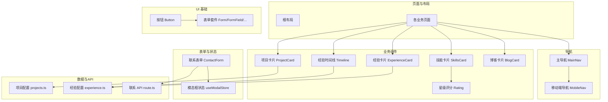
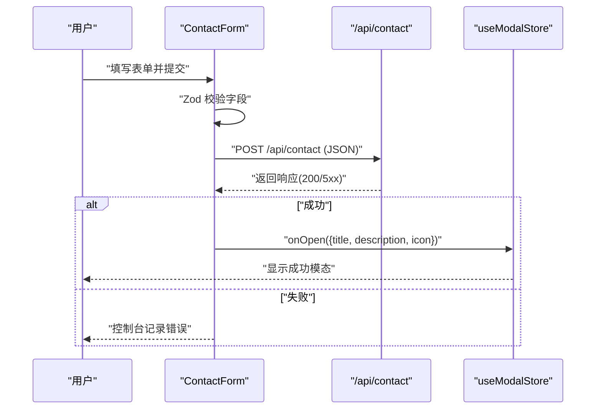
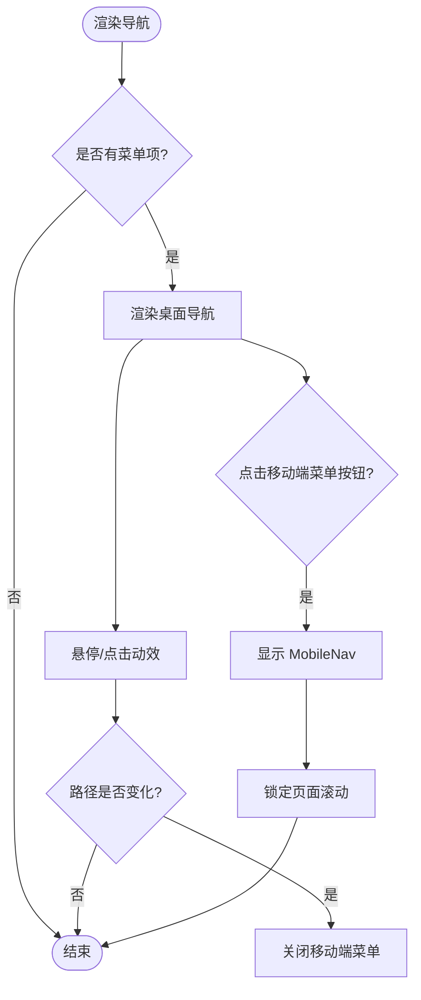
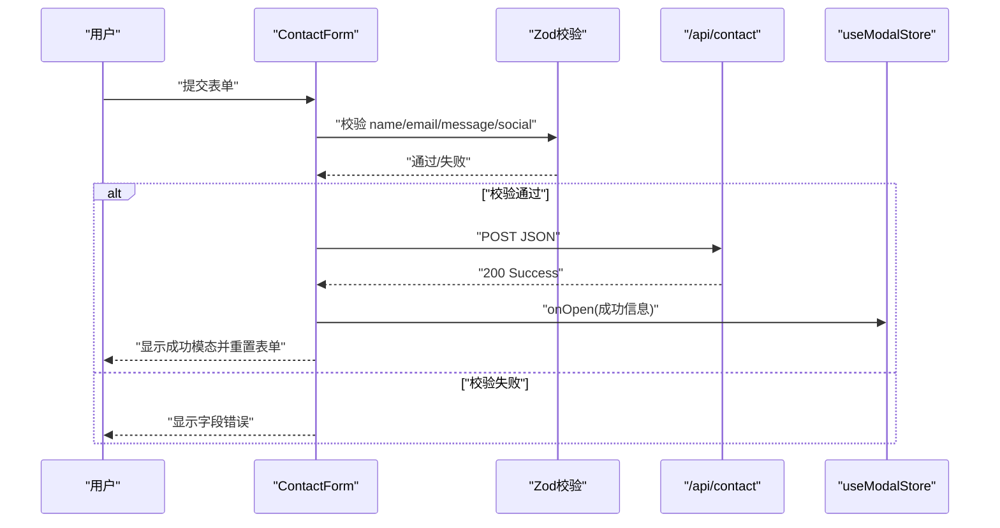
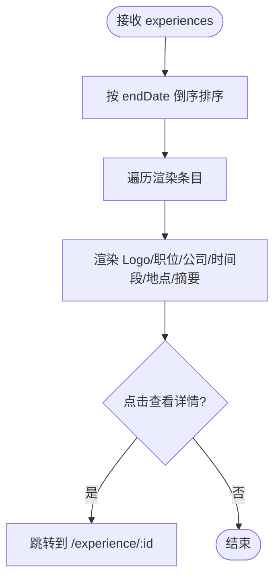
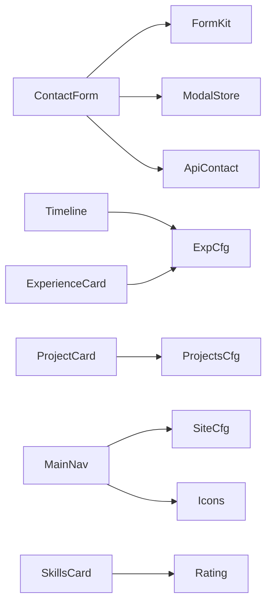

# 功能组件

<cite>
**本文引用的文件**
- [main-nav.tsx](file://components/common/main-nav.tsx)
- [mobile-nav.tsx](file://components/common/mobile-nav.tsx)
- [contact-form.tsx](file://components/forms/contact-form.tsx)
- [route.ts](file://app/api/contact/route.ts)
- [project-card.tsx](file://components/projects/project-card.tsx)
- [timeline.tsx](file://components/experience/timeline.tsx)
- [experience-card.tsx](file://components/experience/experience-card.tsx)
- [skills-card.tsx](file://components/skills/skills-card.tsx)
- [rating.tsx](file://components/skills/rating.tsx)
- [blog-card.tsx](file://components/blogs/blog-card.tsx)
- [button.tsx](file://components/ui/button.tsx)
- [form.tsx](file://components/ui/form.tsx)
- [use-modal-store.ts](file://hooks/use-modal-store.ts)
- [projects.ts](file://config/projects.ts)
- [experience.ts](file://config/experience.ts)
</cite>

## 目录
1. [简介](#简介)
2. [项目结构](#项目结构)
3. [核心组件](#核心组件)
4. [架构总览](#架构总览)
5. [详细组件分析](#详细组件分析)
6. [依赖关系分析](#依赖关系分析)
7. [性能考量](#性能考量)
8. [故障排查指南](#故障排查指南)
9. [结论](#结论)
10. [附录：集成与使用示例](#附录：集成与使用示例)

## 简介
本章节面向开发者，系统化梳理本项目中的“业务功能组件”，包括导航、表单提交、项目展示、经验时间线、技能评分、博客卡片等。文档聚焦每个组件的业务场景、数据结构、用户交互流程、状态管理、API 契约、配置参数、事件处理与错误处理机制，并提供可操作的集成指南与扩展建议，帮助快速理解与复用。

## 项目结构
- 组件按业务域组织在 components/ 下，如 forms、projects、experience、skills、blogs；通用 UI 组件集中在 components/ui；公共逻辑与样式在 components/common。
- 数据与类型定义集中于 config/ 下的配置文件（如 projects.ts、experience.ts）。
- 服务端 API 路由位于 app/api/，用于处理表单提交等后端交互。
- 全局状态通过 hooks/ 中的 store（如 use-modal-store）管理。

图表来源
- [main-nav.tsx:1-105](file://components/common/main-nav.tsx#L1-L105)
- [mobile-nav.tsx:1-55](file://components/common/mobile-nav.tsx#L1-L55)
- [project-card.tsx:1-51](file://components/projects/project-card.tsx#L1-L51)
- [timeline.tsx:1-117](file://components/experience/timeline.tsx#L1-L117)
- [experience-card.tsx:1-112](file://components/experience/experience-card.tsx#L1-L112)
- [skills-card.tsx:1-31](file://components/skills/skills-card.tsx#L1-L31)
- [rating.tsx:1-41](file://components/skills/rating.tsx#L1-L41)
- [blog-card.tsx:1-96](file://components/blogs/blog-card.tsx#L1-L96)
- [contact-form.tsx:1-142](file://components/forms/contact-form.tsx#L1-L142)
- [route.ts:1-31](file://app/api/contact/route.ts#L1-L31)
- [projects.ts:1-596](file://config/projects.ts#L1-L596)
- [experience.ts:1-93](file://config/experience.ts#L1-L93)

章节来源
- [main-nav.tsx:1-105](file://components/common/main-nav.tsx#L1-L105)
- [contact-form.tsx:1-142](file://components/forms/contact-form.tsx#L1-L142)
- [project-card.tsx:1-51](file://components/projects/project-card.tsx#L1-L51)
- [timeline.tsx:1-117](file://components/experience/timeline.tsx#L1-L117)
- [experience-card.tsx:1-112](file://components/experience/experience-card.tsx#L1-L112)
- [skills-card.tsx:1-31](file://components/skills/skills-card.tsx#L1-L31)
- [rating.tsx:1-41](file://components/skills/rating.tsx#L1-L41)
- [blog-card.tsx:1-96](file://components/blogs/blog-card.tsx#L1-L96)
- [button.tsx:1-57](file://components/ui/button.tsx#L1-L57)
- [form.tsx:1-178](file://components/ui/form.tsx#L1-L178)
- [use-modal-store.ts:1-36](file://hooks/use-modal-store.ts#L1-L36)
- [projects.ts:1-596](file://config/projects.ts#L1-L596)
- [experience.ts:1-93](file://config/experience.ts#L1-L93)

## 核心组件
本节概述项目中关键业务组件的职责与协作方式：
- 导航组件：MainNav 负责桌面端导航与动画，MobileNav 负责移动端全屏菜单与滚动锁定。
- 表单组件：ContactForm 基于 React Hook Form + Zod 校验，提交到 /api/contact，成功后通过 useModalStore 打开成功提示。
- 展示组件：ProjectCard、Timeline、ExperienceCard、SkillsCard、Rating、BlogCard 分别承载项目、经验、技能、博客的展示与交互。
- 基础 UI：Button、Form 套件提供一致的视觉与无障碍支持。

章节来源
- [main-nav.tsx:1-105](file://components/common/main-nav.tsx#L1-L105)
- [mobile-nav.tsx:1-55](file://components/common/mobile-nav.tsx#L1-L55)
- [contact-form.tsx:1-142](file://components/forms/contact-form.tsx#L1-L142)
- [project-card.tsx:1-51](file://components/projects/project-card.tsx#L1-L51)
- [timeline.tsx:1-117](file://components/experience/timeline.tsx#L1-L117)
- [experience-card.tsx:1-112](file://components/experience/experience-card.tsx#L1-L112)
- [skills-card.tsx:1-31](file://components/skills/skills-card.tsx#L1-L31)
- [rating.tsx:1-41](file://components/skills/rating.tsx#L1-L41)
- [blog-card.tsx:1-96](file://components/blogs/blog-card.tsx#L1-L96)
- [button.tsx:1-57](file://components/ui/button.tsx#L1-L57)
- [form.tsx:1-178](file://components/ui/form.tsx#L1-L178)
- [use-modal-store.ts:1-36](file://hooks/use-modal-store.ts#L1-L36)

## 架构总览
下图展示了从用户操作到数据提交与反馈的整体流程，涵盖前端组件、状态管理与后端 API 的协作。

图表来源
- [contact-form.tsx:21-71](file://components/forms/contact-form.tsx#L21-L71)
- [route.ts:1-31](file://app/api/contact/route.ts#L1-L31)
- [use-modal-store.ts:1-36](file://hooks/use-modal-store.ts#L1-L36)

## 详细组件分析

### 导航组件（MainNav / MobileNav）
- 业务场景：提供站点级导航，支持桌面端列表与移动端全屏菜单，具备当前段高亮与入场动画。
- 数据结构：items 数组包含 href、title、disabled 等字段；children 用于注入额外内容。
- 用户交互：点击链接跳转；移动端切换菜单开关；路径变化时自动关闭移动端菜单。
- 状态管理：本地 state 控制 showMobileMenu；useSelectedLayoutSegment 与 usePathname 驱动高亮与关闭。
- 可扩展性：可通过 items 配置动态菜单；支持禁用项；可与主题系统联动。
- 事件处理：onClick 切换菜单；hover/tap 微动效。
- 错误处理：无网络请求；对无效链接进行 disabled 处理。

图表来源
- [main-nav.tsx:40-101](file://components/common/main-nav.tsx#L40-L101)
- [mobile-nav.tsx:21-51](file://components/common/mobile-nav.tsx#L21-L51)

章节来源
- [main-nav.tsx:1-105](file://components/common/main-nav.tsx#L1-L105)
- [mobile-nav.tsx:1-55](file://components/common/mobile-nav.tsx#L1-L55)

### 联系表单（ContactForm）
- 业务场景：收集访客姓名、邮箱、消息与可选社交链接，提交至后端并给出成功反馈。
- 数据结构：name、email、message、social；使用 Zod 进行客户端校验。
- 用户交互：输入校验、提交、成功后重置表单并弹出成功模态。
- 状态管理：react-hook-form 管理表单状态；useModalStore 控制模态框。
- API 契约：POST /api/contact，Content-Type: application/json；成功返回 200。
- 错误处理：网络或服务器异常时记录错误；服务端缺少环境变量时返回 500。
- 可扩展性：可替换后端目标（如邮件服务）、增加验证码、多语言提示。

图表来源
- [contact-form.tsx:21-71](file://components/forms/contact-form.tsx#L21-L71)
- [route.ts:1-31](file://app/api/contact/route.ts#L1-L31)
- [use-modal-store.ts:1-36](file://hooks/use-modal-store.ts#L1-L36)

章节来源
- [contact-form.tsx:1-142](file://components/forms/contact-form.tsx#L1-L142)
- [route.ts:1-31](file://app/api/contact/route.ts#L1-L31)
- [use-modal-store.ts:1-36](file://hooks/use-modal-store.ts#L1-L36)

### 项目卡片（ProjectCard）
- 业务场景：以卡片形式展示项目封面、标题、简介、分类标签与“阅读更多”入口。
- 数据结构：ProjectInterface（id、type、companyName、category、shortDescription、techStack、图片等）。
- 用户交互：点击“阅读更多”跳转到项目详情页。
- 状态管理：无状态组件，仅接收 props。
- 可扩展性：支持不同项目类型图标；可接入外部链接或 GitHub 徽章。

章节来源
- [project-card.tsx:1-51](file://components/projects/project-card.tsx#L1-L51)
- [projects.ts:14-28](file://config/projects.ts#L14-L28)

### 经验时间线（Timeline）
- 业务场景：按时间倒序展示工作经历，支持 Logo、公司名、职位、时间段、地点与详情跳转。
- 数据结构：ExperienceInterface[]（id、position、company、location、startDate、endDate、description、skills、logo、companyUrl）。
- 用户交互：点击“查看详情”进入具体经历页。
- 状态管理：内部排序（最近优先），无外部状态。
- 可扩展性：支持空 Logo、外链、多行描述折叠。

图表来源
- [timeline.tsx:32-111](file://components/experience/timeline.tsx#L32-L111)
- [experience.ts:3-15](file://config/experience.ts#L3-L15)

章节来源
- [timeline.tsx:1-117](file://components/experience/timeline.tsx#L1-L117)
- [experience.ts:1-93](file://config/experience.ts#L1-L93)

### 经验卡片（ExperienceCard）
- 业务场景：单条经历的紧凑展示，突出职位、公司、时间段、地点、摘要与技能标签。
- 数据结构：ExperienceInterface。
- 用户交互：点击“查看详情”跳转。
- 状态管理：无状态组件。
- 可扩展性：支持外链、技能标签截断与“更多”计数。

章节来源
- [experience-card.tsx:1-112](file://components/experience/experience-card.tsx#L1-L112)
- [experience.ts:1-93](file://config/experience.ts#L1-L93)

### 技能卡片（SkillsCard）与评分（Rating）
- 业务场景：网格化展示技能卡片，包含图标、名称、描述与星级评分。
- 数据结构：skillsInterface[]（name、description、icon、rating）。
- 用户交互：静态展示，无交互。
- 状态管理：无状态。
- 可扩展性：可自定义星级数量、颜色与尺寸。

章节来源
- [skills-card.tsx:1-31](file://components/skills/skills-card.tsx#L1-L31)
- [rating.tsx:1-41](file://components/skills/rating.tsx#L1-L41)

### 博客卡片（BlogCard）
- 业务场景：展示文章封面、标签、标题、摘要、日期与阅读时长，点击跳转文章详情。
- 数据结构：BlogMeta（slug、date、coverImage、tags、title、description、readingTime）。
- 用户交互：点击整卡跳转；悬停有缩放与阴影效果。
- 状态管理：无状态。
- 可扩展性：支持更多元数据（作者、分类）与分享按钮。

章节来源
- [blog-card.tsx:1-96](file://components/blogs/blog-card.tsx#L1-L96)

### 基础 UI 组件（Button / Form 套件）
- Button：统一样式与变体（default、destructive、outline、secondary、ghost、link），支持 asChild 透传。
- Form 套件：封装 react-hook-form 的 Provider、Field、Label、Message，提供无障碍属性与错误提示。

章节来源
- [button.tsx:1-57](file://components/ui/button.tsx#L1-L57)
- [form.tsx:1-178](file://components/ui/form.tsx#L1-L178)

## 依赖关系分析
- 组件耦合：
  - ContactForm 依赖 form 套件、Zod、useModalStore 与 /api/contact。
  - Timeline/ExperienceCard 依赖 experience 配置与图标库。
  - ProjectCard 依赖 projects 配置与 UI 基础组件。
  - MainNav/MobileNav 依赖 siteConfig、icons、导航钩子。
- 外部依赖：
  - Next.js 路由与字体加载。
  - motion/react 动画。
  - Radix 与 react-hook-form 生态。
- 潜在循环：未发现直接循环依赖；组件间通过 props 与配置解耦。

图表来源
- [contact-form.tsx:1-142](file://components/forms/contact-form.tsx#L1-L142)
- [timeline.tsx:1-117](file://components/experience/timeline.tsx#L1-L117)
- [experience-card.tsx:1-112](file://components/experience/experience-card.tsx#L1-L112)
- [project-card.tsx:1-51](file://components/projects/project-card.tsx#L1-L51)
- [main-nav.tsx:1-105](file://components/common/main-nav.tsx#L1-L105)
- [skills-card.tsx:1-31](file://components/skills/skills-card.tsx#L1-L31)
- [rating.tsx:1-41](file://components/skills/rating.tsx#L1-L41)
- [route.ts:1-31](file://app/api/contact/route.ts#L1-L31)
- [projects.ts:1-596](file://config/projects.ts#L1-L596)
- [experience.ts:1-93](file://config/experience.ts#L1-L93)

章节来源
- [contact-form.tsx:1-142](file://components/forms/contact-form.tsx#L1-L142)
- [timeline.tsx:1-117](file://components/experience/timeline.tsx#L1-L117)
- [experience-card.tsx:1-112](file://components/experience/experience-card.tsx#L1-L112)
- [project-card.tsx:1-51](file://components/projects/project-card.tsx#L1-L51)
- [main-nav.tsx:1-105](file://components/common/main-nav.tsx#L1-L105)
- [skills-card.tsx:1-31](file://components/skills/skills-card.tsx#L1-L31)
- [rating.tsx:1-41](file://components/skills/rating.tsx#L1-L41)
- [route.ts:1-31](file://app/api/contact/route.ts#L1-L31)
- [projects.ts:1-596](file://config/projects.ts#L1-L596)
- [experience.ts:1-93](file://config/experience.ts#L1-L93)

## 性能考量
- 图片优化：使用 Next/Image 的 fill/固定宽高与懒加载，减少首屏体积。
- 动画开销：motion 动画仅在必要时启用，避免过度重绘。
- 列表渲染：Timeline 对数据进行本地排序，数据量较大时可考虑分页或虚拟滚动。
- 表单校验：Zod 在客户端即时校验，减少无效请求。
- 资源加载：字体与图标按需引入，避免阻塞。

[本节为通用指导，不直接分析具体文件]

## 故障排查指南
- 表单提交失败
  - 检查环境变量是否配置完整（Google Form 链接与字段 ID）。
  - 查看浏览器控制台与网络面板，确认请求体格式与响应码。
  - 若返回 500，通常为服务端环境变量缺失或上游服务不可用。
- 模态框未显示
  - 确认 useModalStore 已正确调用 onOpen，且模态容器已挂载。
- 导航异常
  - 检查 items 中 href 是否正确；disabled 项不会跳转。
  - 移动端菜单无法关闭：确认路径变化监听生效。

章节来源
- [route.ts:1-31](file://app/api/contact/route.ts#L1-L31)
- [contact-form.tsx:47-71](file://components/forms/contact-form.tsx#L47-L71)
- [main-nav.tsx:40-101](file://components/common/main-nav.tsx#L40-L101)

## 结论
本项目采用清晰的组件分层与配置驱动的数据模型，结合现代前端工具链（Next.js、React Hook Form、Zod、Radix、motion），实现了可维护、可扩展的业务功能组件。通过统一的 UI 基础组件与状态管理，开发者可以快速集成与定制导航、表单、展示类组件，满足多样化业务需求。

[本节为总结，不直接分析具体文件]

## 附录：集成与使用示例
- 在页面中引入导航
  - 将 MainNav 置于页面顶部，传入 items 配置；移动端自动切换 MobileNav。
  - 参考路径：[main-nav.tsx:1-105](file://components/common/main-nav.tsx#L1-L105)、[mobile-nav.tsx:1-55](file://components/common/mobile-nav.tsx#L1-L55)
- 集成联系表单
  - 在联系页面放置 ContactForm；确保环境变量配置正确；成功后会弹出成功模态。
  - 参考路径：[contact-form.tsx:1-142](file://components/forms/contact-form.tsx#L1-L142)、[route.ts:1-31](file://app/api/contact/route.ts#L1-L31)
- 展示项目列表
  - 使用 ProjectCard 渲染 projects.ts 中的数据；点击跳转项目详情。
  - 参考路径：[project-card.tsx:1-51](file://components/projects/project-card.tsx#L1-L51)、[projects.ts:1-596](file://config/projects.ts#L1-L596)
- 展示经验时间线
  - 使用 Timeline 渲染 experience.ts 数据；支持排序与外链。
  - 参考路径：[timeline.tsx:1-117](file://components/experience/timeline.tsx#L1-L117)、[experience.ts:1-93](file://config/experience.ts#L1-L93)
- 展示技能与评分
  - 使用 SkillsCard 与 Rating 组合展示技能卡片与星级。
  - 参考路径：[skills-card.tsx:1-31](file://components/skills/skills-card.tsx#L1-L31)、[rating.tsx:1-41](file://components/skills/rating.tsx#L1-L41)
- 展示博客卡片
  - 使用 BlogCard 展示文章摘要与元数据；点击跳转文章详情。
  - 参考路径：[blog-card.tsx:1-96](file://components/blogs/blog-card.tsx#L1-L96)
- 自定义按钮与表单
  - 使用 Button 的 variant/size 适配不同场景；使用 Form 套件构建复杂表单。
  - 参考路径：[button.tsx:1-57](file://components/ui/button.tsx#L1-L57)、[form.tsx:1-178](file://components/ui/form.tsx#L1-L178)

[本节为使用指引，不直接分析具体文件]