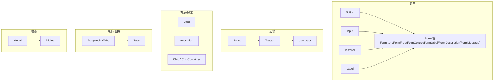
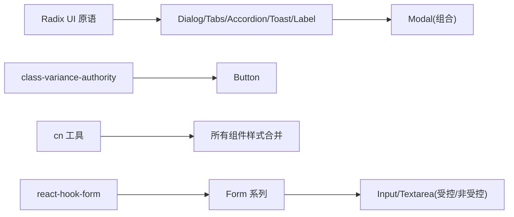
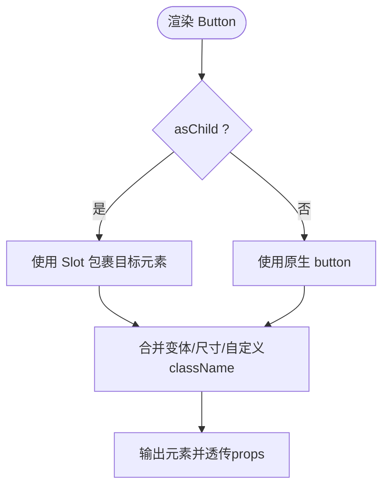
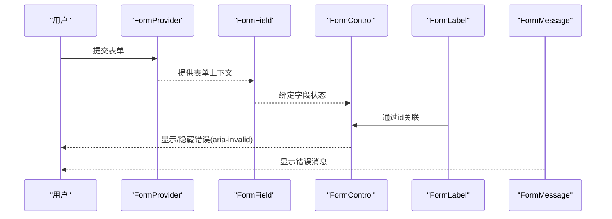
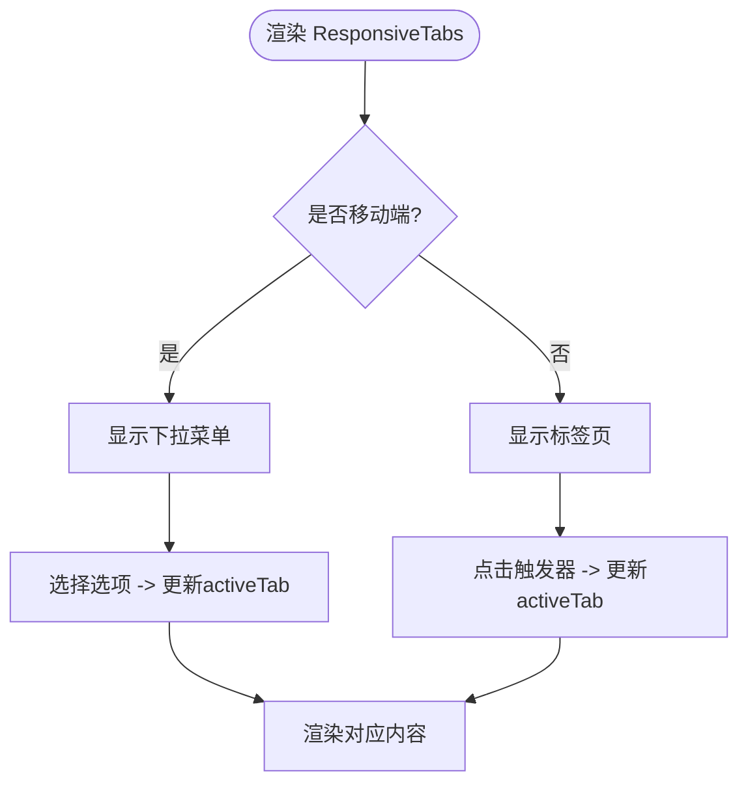
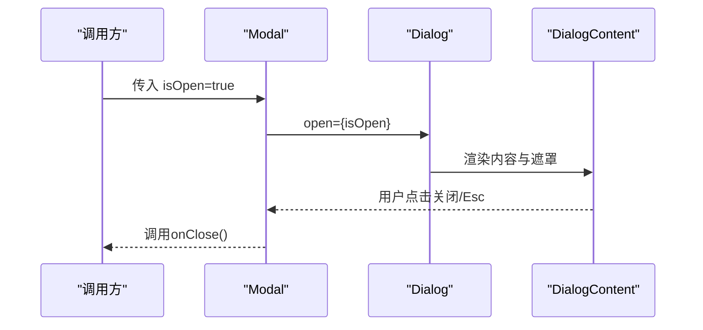
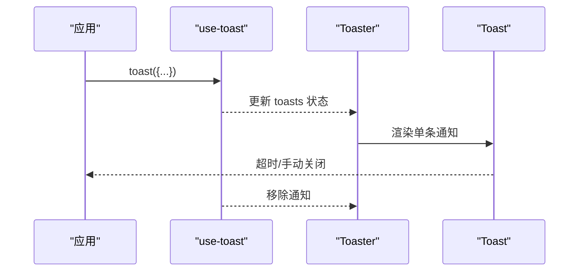
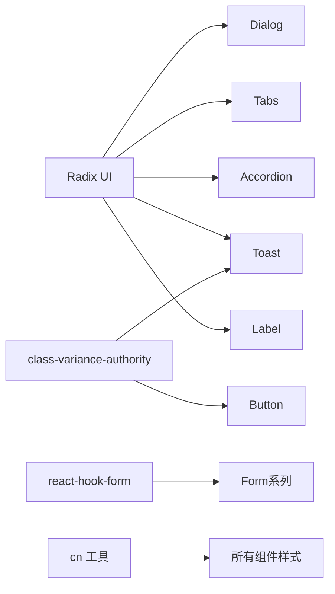

# 基础UI组件

<cite>
**本文引用的文件**
- [button.tsx](file://components/ui/button.tsx)
- [card.tsx](file://components/ui/card.tsx)
- [input.tsx](file://components/ui/input.tsx)
- [textarea.tsx](file://components/ui/textarea.tsx)
- [dialog.tsx](file://components/ui/dialog.tsx)
- [modal.tsx](file://components/ui/modal.tsx)
- [tabs.tsx](file://components/ui/tabs.tsx)
- [responsive-tabs.tsx](file://components/ui/responsive-tabs.tsx)
- [accordion.tsx](file://components/ui/accordion.tsx)
- [chip.tsx](file://components/ui/chip.tsx)
- [chip-container.tsx](file://components/ui/chip-container.tsx)
- [form.tsx](file://components/ui/form.tsx)
- [label.tsx](file://components/ui/label.tsx)
- [toast.tsx](file://components/ui/toast.tsx)
- [toaster.tsx](file://components/ui/toaster.tsx)
- [use-toast.ts](file://components/ui/use-toast.ts)
</cite>

## 目录
1. [简介](#简介)
2. [项目结构](#项目结构)
3. [核心组件](#核心组件)
4. [架构总览](#架构总览)
5. [详细组件分析](#详细组件分析)
6. [依赖关系分析](#依赖关系分析)
7. [性能考量](#性能考量)
8. [故障排查指南](#故障排查指南)
9. [结论](#结论)
10. [附录](#附录)

## 简介
本文件系统化梳理项目中可复用的基础UI原子组件，覆盖Props接口、样式定制、事件处理与可访问性支持；提供使用示例路径与最佳实践；解释设计原则、响应式行为与主题集成方式；并给出组件组合模式与扩展策略，帮助开发者高效使用这些构建块。

## 项目结构
UI组件集中在 components/ui 目录下，采用“按功能拆分”的组织方式：表单类（Button、Input、Textarea、Label、Form）、反馈类（Toast/Toaster）、数据展示与导航（Card、Tabs、ResponsiveTabs、Accordion、Chip/ChipContainer）、模态与弹出（Dialog、Modal）。各组件通过统一的工具函数 cn 合并样式，并通过 Radix UI 原语保证可访问性与状态管理。

图表来源
- [button.tsx:1-57](file://components/ui/button.tsx#L1-L57)
- [input.tsx:1-26](file://components/ui/input.tsx#L1-L26)
- [textarea.tsx:1-25](file://components/ui/textarea.tsx#L1-L25)
- [label.tsx:1-27](file://components/ui/label.tsx#L1-L27)
- [form.tsx:1-178](file://components/ui/form.tsx#L1-L178)
- [toast.tsx:1-128](file://components/ui/toast.tsx#L1-L128)
- [toaster.tsx:1-36](file://components/ui/toaster.tsx#L1-L36)
- [use-toast.ts:1-190](file://components/ui/use-toast.ts#L1-L190)
- [card.tsx:1-87](file://components/ui/card.tsx#L1-L87)
- [accordion.tsx:1-63](file://components/ui/accordion.tsx#L1-L63)
- [chip.tsx:1-12](file://components/ui/chip.tsx#L1-L12)
- [chip-container.tsx:1-16](file://components/ui/chip-container.tsx#L1-L16)
- [tabs.tsx:1-56](file://components/ui/tabs.tsx#L1-L56)
- [responsive-tabs.tsx:1-89](file://components/ui/responsive-tabs.tsx#L1-L89)
- [dialog.tsx:1-121](file://components/ui/dialog.tsx#L1-L121)
- [modal.tsx:1-40](file://components/ui/modal.tsx#L1-L40)

章节来源
- [button.tsx:1-57](file://components/ui/button.tsx#L1-L57)
- [card.tsx:1-87](file://components/ui/card.tsx#L1-L87)
- [input.tsx:1-26](file://components/ui/input.tsx#L1-L26)
- [textarea.tsx:1-25](file://components/ui/textarea.tsx#L1-L25)
- [dialog.tsx:1-121](file://components/ui/dialog.tsx#L1-L121)
- [modal.tsx:1-40](file://components/ui/modal.tsx#L1-L40)
- [tabs.tsx:1-56](file://components/ui/tabs.tsx#L1-L56)
- [responsive-tabs.tsx:1-89](file://components/ui/responsive-tabs.tsx#L1-L89)
- [accordion.tsx:1-63](file://components/ui/accordion.tsx#L1-L63)
- [chip.tsx:1-12](file://components/ui/chip.tsx#L1-L12)
- [chip-container.tsx:1-16](file://components/ui/chip-container.tsx#L1-L16)
- [form.tsx:1-178](file://components/ui/form.tsx#L1-L178)
- [label.tsx:1-27](file://components/ui/label.tsx#L1-L27)
- [toast.tsx:1-128](file://components/ui/toast.tsx#L1-L128)
- [toaster.tsx:1-36](file://components/ui/toaster.tsx#L1-L36)
- [use-toast.ts:1-190](file://components/ui/use-toast.ts#L1-L190)

## 核心组件
本节概述各组件的职责、Props、样式定制、事件与可访问性要点。

- Button
  - Props：继承原生按钮属性，额外支持 variant、size、asChild
  - 样式：基于变体与尺寸系统，支持焦点环与禁用态
  - 事件：透传所有原生事件
  - 可访问性：语义为 button，支持键盘操作；asChild 时保持目标元素语义
  - 参考实现路径：[button.tsx:7-56](file://components/ui/button.tsx#L7-L56)

- Input / Textarea
  - Props：继承原生输入框属性
  - 样式：统一边框、圆角、占位符颜色、焦点环、禁用态
  - 事件：透传原生事件
  - 可访问性：原生语义，支持 disabled、placeholder 等
  - 参考实现路径：[input.tsx:5-23](file://components/ui/input.tsx#L5-L23)、[textarea.tsx:5-22](file://components/ui/textarea.tsx#L5-L22)

- Label
  - Props：继承标签原语属性
  - 样式：字体大小、禁用态样式
  - 可访问性：关联表单控件的 htmlFor
  - 参考实现路径：[label.tsx:9-24](file://components/ui/label.tsx#L9-L24)

- Form（基于 react-hook-form）
  - 子组件：Form、FormItem、FormField、FormControl、FormLabel、FormDescription、FormMessage
  - 职责：集中管理表单状态、校验、错误提示与无障碍描述
  - 可访问性：自动注入 id、aria-describedby、aria-invalid 等
  - 参考实现路径：[form.tsx:16-177](file://components/ui/form.tsx#L16-L177)

- Card
  - 子组件：Card、CardHeader、CardTitle、CardDescription、CardContent、CardFooter
  - 职责：卡片容器与内容分节
  - 样式：阴影、边框、内边距、标题层级
  - 参考实现路径：[card.tsx:5-86](file://components/ui/card.tsx#L5-L86)

- Tabs / ResponsiveTabs
  - Tabs：列表、触发器、内容区域
  - ResponsiveTabs：移动端下拉选择 + 桌面端标签页
  - 可访问性：Radix Tabs 提供键盘与屏幕阅读器支持
  - 参考实现路径：[tabs.tsx:8-55](file://components/ui/tabs.tsx#L8-L55)、[responsive-tabs.tsx:16-88](file://components/ui/responsive-tabs.tsx#L16-L88)

- Accordion
  - 子组件：Accordion、AccordionItem、AccordionTrigger、AccordionContent
  - 可访问性：展开/收起状态由原语管理，支持键盘导航
  - 参考实现路径：[accordion.tsx:9-62](file://components/ui/accordion.tsx#L9-L62)

- Dialog / Modal
  - Dialog：根、触发器、遮罩、内容、头部、底部、标题、描述
  - Modal：封装常用场景（标题、描述、关闭回调）
  - 可访问性：焦点陷阱、Esc 关闭、ARIA 状态
  - 参考实现路径：[dialog.tsx:9-120](file://components/ui/dialog.tsx#L9-L120)、[modal.tsx:13-39](file://components/ui/modal.tsx#L13-L39)

- Toast / Toaster / use-toast
  - 职责：全局消息通知、队列与生命周期管理
  - 可访问性：viewport 定位、关闭按钮、读屏友好
  - 参考实现路径：[toast.tsx:8-127](file://components/ui/toast.tsx#L8-L127)、[toaster.tsx:13-35](file://components/ui/toaster.tsx#L13-L35)、[use-toast.ts:140-186](file://components/ui/use-toast.ts#L140-L186)

- Chip / ChipContainer
  - 职责：标签式文本展示与批量渲染
  - 参考实现路径：[chip.tsx:1-11](file://components/ui/chip.tsx#L1-L11)、[chip-container.tsx:3-15](file://components/ui/chip-container.tsx#L3-L15)

章节来源
- [button.tsx:7-56](file://components/ui/button.tsx#L7-L56)
- [input.tsx:5-23](file://components/ui/input.tsx#L5-L23)
- [textarea.tsx:5-22](file://components/ui/textarea.tsx#L5-L22)
- [label.tsx:9-24](file://components/ui/label.tsx#L9-L24)
- [form.tsx:16-177](file://components/ui/form.tsx#L16-L177)
- [card.tsx:5-86](file://components/ui/card.tsx#L5-L86)
- [tabs.tsx:8-55](file://components/ui/tabs.tsx#L8-L55)
- [responsive-tabs.tsx:16-88](file://components/ui/responsive-tabs.tsx#L16-L88)
- [accordion.tsx:9-62](file://components/ui/accordion.tsx#L9-L62)
- [dialog.tsx:9-120](file://components/ui/dialog.tsx#L9-L120)
- [modal.tsx:13-39](file://components/ui/modal.tsx#L13-L39)
- [toast.tsx:8-127](file://components/ui/toast.tsx#L8-L127)
- [toaster.tsx:13-35](file://components/ui/toaster.tsx#L13-L35)
- [use-toast.ts:140-186](file://components/ui/use-toast.ts#L140-L186)
- [chip.tsx:1-11](file://components/ui/chip.tsx#L1-L11)
- [chip-container.tsx:3-15](file://components/ui/chip-container.tsx#L3-L15)

## 架构总览
组件以 Radix UI 原语为基础，结合 class-variance-authority 进行样式变体管理，统一通过 cn 合并 className，确保主题变量与响应式断点一致生效。表单体系基于 react-hook-form 提供类型安全的校验与状态管理。

图表来源
- [button.tsx:1-57](file://components/ui/button.tsx#L1-L57)
- [dialog.tsx:1-121](file://components/ui/dialog.tsx#L1-L121)
- [tabs.tsx:1-56](file://components/ui/tabs.tsx#L1-L56)
- [accordion.tsx:1-63](file://components/ui/accordion.tsx#L1-L63)
- [toast.tsx:1-128](file://components/ui/toast.tsx#L1-L128)
- [label.tsx:1-27](file://components/ui/label.tsx#L1-L27)
- [form.tsx:1-178](file://components/ui/form.tsx#L1-L178)
- [modal.tsx:1-40](file://components/ui/modal.tsx#L1-L40)

## 详细组件分析

### Button 组件
- 设计原则
  - 通过变体与尺寸快速表达语义与层级
  - 支持 asChild 以嵌入路由或第三方组件
- Props 接口
  - variant: default | destructive | outline | secondary | ghost | link
  - size: default | sm | lg | icon
  - asChild?: boolean
  - 其余透传 HTMLButtonElement 属性
- 样式定制
  - 通过 className 叠加；焦点环、禁用态已内置
- 事件处理
  - 透传 onClick、onKeyDown 等原生事件
- 可访问性
  - 语义为 button；asChild 时保留目标元素语义；支持键盘操作
- 使用示例路径
  - 基本用法：[button.tsx:42-56](file://components/ui/button.tsx#L42-L56)
  - 变体与尺寸：[button.tsx:7-34](file://components/ui/button.tsx#L7-L34)

图表来源
- [button.tsx:7-56](file://components/ui/button.tsx#L7-L56)

章节来源
- [button.tsx:7-56](file://components/ui/button.tsx#L7-L56)

### Input / Textarea 组件
- 设计原则
  - 统一输入控件外观与交互反馈
- Props 接口
  - 继承原生 input/textarea 全部属性
- 样式定制
  - 支持 className 覆盖；内置边框、圆角、占位符、焦点环、禁用态
- 事件处理
  - 透传 onChange、onFocus、onBlur 等
- 可访问性
  - 原生语义；配合 Form 系列可自动关联 label 与错误信息
- 使用示例路径
  - Input：[input.tsx:8-23](file://components/ui/input.tsx#L8-L23)
  - Textarea：[textarea.tsx:8-22](file://components/ui/textarea.tsx#L8-L22)

章节来源
- [input.tsx:8-23](file://components/ui/input.tsx#L8-L23)
- [textarea.tsx:8-22](file://components/ui/textarea.tsx#L8-L22)

### Label 组件
- 设计原则
  - 轻量标签，适配表单控件
- Props 接口
  - 继承 Label 原语属性
- 样式定制
  - 字体大小、禁用态样式
- 可访问性
  - 与 FormControl 联动生成 htmlFor/id 关联
- 使用示例路径
  - [label.tsx:9-24](file://components/ui/label.tsx#L9-L24)

章节来源
- [label.tsx:9-24](file://components/ui/label.tsx#L9-L24)

### Form 系列（Form/FormItem/FormField/FormControl/FormLabel/FormDescription/FormMessage）
- 设计原则
  - 基于 react-hook-form 的类型安全表单
  - 通过 Context 传递字段上下文与ID，自动处理无障碍描述
- Props 接口
  - FormField 接受 ControllerProps
  - 其他子组件主要透传HTML属性
- 样式定制
  - 通过 className 控制布局与排版
- 事件处理
  - 由 react-hook-form 统一管理
- 可访问性
  - 自动设置 aria-describedby、aria-invalid；错误信息通过 FormMessage 呈现
- 使用示例路径
  - 表单结构与上下文：[form.tsx:16-177](file://components/ui/form.tsx#L16-L177)

图表来源
- [form.tsx:16-177](file://components/ui/form.tsx#L16-L177)

章节来源
- [form.tsx:16-177](file://components/ui/form.tsx#L16-L177)

### Card 组件族
- 设计原则
  - 将卡片内容结构化分节，便于复用与排版
- 子组件
  - Card、CardHeader、CardTitle、CardDescription、CardContent、CardFooter
- 样式定制
  - 通过 className 调整间距与排版
- 使用示例路径
  - [card.tsx:5-86](file://components/ui/card.tsx#L5-L86)

章节来源
- [card.tsx:5-86](file://components/ui/card.tsx#L5-L86)

### Tabs / ResponsiveTabs
- 设计原则
  - 桌面端使用标签页，移动端降级为下拉选择
- Props 接口
  - ResponsiveTabs：items(value,label,content)、defaultValue、className
- 样式定制
  - 通过 className 控制布局；移动端隐藏/显示逻辑由断点控制
- 事件处理
  - 内部维护 activeTab 状态，切换时更新
- 可访问性
  - 基于 Radix Tabs，支持键盘与屏幕阅读器
- 使用示例路径
  - Tabs：[tabs.tsx:8-55](file://components/ui/tabs.tsx#L8-L55)
  - ResponsiveTabs：[responsive-tabs.tsx:16-88](file://components/ui/responsive-tabs.tsx#L16-L88)

图表来源
- [responsive-tabs.tsx:16-88](file://components/ui/responsive-tabs.tsx#L16-L88)
- [tabs.tsx:8-55](file://components/ui/tabs.tsx#L8-L55)

章节来源
- [tabs.tsx:8-55](file://components/ui/tabs.tsx#L8-L55)
- [responsive-tabs.tsx:16-88](file://components/ui/responsive-tabs.tsx#L16-L88)

### Accordion 组件
- 设计原则
  - 折叠面板，逐项展开/收起
- 子组件
  - Accordion、AccordionItem、AccordionTrigger、AccordionContent
- 样式定制
  - 通过 className 控制边框、内边距与动画
- 可访问性
  - 由 Radix 管理状态与键盘交互
- 使用示例路径
  - [accordion.tsx:9-62](file://components/ui/accordion.tsx#L9-L62)

章节来源
- [accordion.tsx:9-62](file://components/ui/accordion.tsx#L9-L62)

### Dialog / Modal
- 设计原则
  - 通用对话框与封装后的业务弹窗
- Props 接口
  - Dialog：透传 Radix Dialog 属性
  - Modal：title、description、isOpen、onClose、children
- 样式定制
  - 通过 className 覆盖遮罩与内容区样式
- 事件处理
  - 关闭时调用 onClose；支持 Esc 关闭
- 可访问性
  - 焦点陷阱、ARIA 状态、屏幕阅读器提示
- 使用示例路径
  - Dialog：[dialog.tsx:9-120](file://components/ui/dialog.tsx#L9-L120)
  - Modal：[modal.tsx:13-39](file://components/ui/modal.tsx#L13-L39)

图表来源
- [modal.tsx:13-39](file://components/ui/modal.tsx#L13-L39)
- [dialog.tsx:9-120](file://components/ui/dialog.tsx#L9-L120)

章节来源
- [dialog.tsx:9-120](file://components/ui/dialog.tsx#L9-L120)
- [modal.tsx:13-39](file://components/ui/modal.tsx#L13-L39)

### Toast / Toaster / use-toast
- 设计原则
  - 轻量级全局通知，支持最多一条同时显示（可配置）
- API
  - toast({ title?, description?, action?, variant? })
  - useToast() 返回 toasts 列表与 dismiss
- 样式定制
  - 通过 variant 区分默认/破坏性样式；可叠加 className
- 事件处理
  - 自动计时移除；支持手动关闭
- 可访问性
  - viewport 定位、关闭按钮、读屏友好
- 使用示例路径
  - Toast 组件：[toast.tsx:8-127](file://components/ui/toast.tsx#L8-L127)
  - Toaster 渲染：[toaster.tsx:13-35](file://components/ui/toaster.tsx#L13-L35)
  - 状态管理与API：[use-toast.ts:140-186](file://components/ui/use-toast.ts#L140-L186)

图表来源
- [use-toast.ts:140-186](file://components/ui/use-toast.ts#L140-L186)
- [toaster.tsx:13-35](file://components/ui/toaster.tsx#L13-L35)
- [toast.tsx:8-127](file://components/ui/toast.tsx#L8-L127)

章节来源
- [toast.tsx:8-127](file://components/ui/toast.tsx#L8-L127)
- [toaster.tsx:13-35](file://components/ui/toaster.tsx#L13-L35)
- [use-toast.ts:140-186](file://components/ui/use-toast.ts#L140-L186)

### Chip / ChipContainer
- 设计原则
  - 简洁的标签展示与批量渲染
- Props 接口
  - Chip：content
  - ChipContainer：textArr
- 样式定制
  - 通过 className 调整外观
- 使用示例路径
  - [chip.tsx:1-11](file://components/ui/chip.tsx#L1-L11)
  - [chip-container.tsx:3-15](file://components/ui/chip-container.tsx#L3-L15)

章节来源
- [chip.tsx:1-11](file://components/ui/chip.tsx#L1-L11)
- [chip-container.tsx:3-15](file://components/ui/chip-container.tsx#L3-L15)

## 依赖关系分析
- 外部依赖
  - Radix UI：Dialog、Tabs、Accordion、Toast、Label 等原语，提供可访问性与状态管理
  - class-variance-authority：Button、Toast 等组件的样式变体
  - react-hook-form：Form 系列的表单状态与校验
  - lucide-react：图标（如 X、ChevronDown）
- 内部依赖
  - cn 工具：统一合并 className，确保主题与响应式一致性
- 耦合度
  - 组件间低耦合，主要通过 props 组合；Modal 组合 Dialog；ResponsiveTabs 组合 Tabs 与 DropdownMenu
- 循环依赖
  - 未发现循环导入

图表来源
- [button.tsx:1-57](file://components/ui/button.tsx#L1-L57)
- [dialog.tsx:1-121](file://components/ui/dialog.tsx#L1-L121)
- [tabs.tsx:1-56](file://components/ui/tabs.tsx#L1-L56)
- [accordion.tsx:1-63](file://components/ui/accordion.tsx#L1-L63)
- [toast.tsx:1-128](file://components/ui/toast.tsx#L1-L128)
- [label.tsx:1-27](file://components/ui/label.tsx#L1-L27)
- [form.tsx:1-178](file://components/ui/form.tsx#L1-L178)

章节来源
- [button.tsx:1-57](file://components/ui/button.tsx#L1-L57)
- [dialog.tsx:1-121](file://components/ui/dialog.tsx#L1-L121)
- [tabs.tsx:1-56](file://components/ui/tabs.tsx#L1-L56)
- [accordion.tsx:1-63](file://components/ui/accordion.tsx#L1-L63)
- [toast.tsx:1-128](file://components/ui/toast.tsx#L1-L128)
- [label.tsx:1-27](file://components/ui/label.tsx#L1-L27)
- [form.tsx:1-178](file://components/ui/form.tsx#L1-L178)

## 性能考量
- 避免不必要的重渲染
  - 在表单中使用 react-hook-form 的 Controller 减少重复计算
  - 对大型列表（如 Tabs 内容）考虑懒加载或虚拟滚动
- 样式合并
  - 使用 cn 合并 className，避免重复计算与冲突
- 动画与过渡
  - Dialog/Toast 的入场/出场动画已优化，注意不要叠加过多复杂动画
- 资源体积
  - 按需引入图标（lucide-react），避免全量引入

## 故障排查指南
- 表单相关
  - 错误：未在使用 FormField 上下文中调用 useFormField
    - 现象：抛出错误提示
    - 解决：确保在 Form/FormField 内部使用
    - 参考：[form.tsx:42-63](file://components/ui/form.tsx#L42-L63)
  - 问题：Label 无法关联输入框
    - 检查：FormLabel 与 FormControl 的 id 是否由上下文正确生成
    - 参考：[form.tsx:87-124](file://components/ui/form.tsx#L87-L124)
- 模态/对话框
  - 问题：关闭后状态不同步
    - 检查：Modal 的 onOpenChange 是否正确调用 onClose
    - 参考：[modal.tsx:21-39](file://components/ui/modal.tsx#L21-L39)
- Toast
  - 问题：通知不消失
    - 检查：是否设置了过长的移除延迟或手动阻止了关闭
    - 参考：[use-toast.ts:54-70](file://components/ui/use-toast.ts#L54-L70)
- 样式异常
  - 问题：主题色/暗色模式不生效
    - 检查：是否使用了 cn 合并 className，且 Tailwind 主题变量已配置
    - 参考：各组件中 cn 的使用位置

章节来源
- [form.tsx:42-63](file://components/ui/form.tsx#L42-L63)
- [form.tsx:87-124](file://components/ui/form.tsx#L87-L124)
- [modal.tsx:21-39](file://components/ui/modal.tsx#L21-L39)
- [use-toast.ts:54-70](file://components/ui/use-toast.ts#L54-L70)

## 结论
本项目的基础UI组件以 Radix UI 为核心，结合 class-variance-authority 与 react-hook-form，提供了高可用、可访问、易扩展的原子组件集合。通过统一的样式系统与清晰的组合模式，开发者可以快速搭建一致的界面，并在需要时灵活扩展。建议在实际使用中遵循组件的Props约定与可访问性最佳实践，以获得稳定且友好的用户体验。

## 附录
- 主题集成
  - 所有组件通过 CSS 变量与 Tailwind 主题色工作，建议在主题文件中定义 primary、background、muted-foreground 等变量以保持一致性
- 响应式行为
  - 多数组件使用 Tailwind 断点控制布局（如 md:hidden/md:block），可根据需求调整
- 扩展策略
  - 新增变体：在 cva 中追加 variant/size 映射
  - 新增组件：遵循现有命名与导出规范，优先复用已有子组件（如 CardHeader/CardContent）
  - 表单扩展：基于 FormField 封装更复杂的输入控件，保持无障碍属性完整