# 组件库参考

<cite>
**本文档引用的文件**
- [components/ui/button.tsx](file://components/ui/button.tsx)
- [components/ui/card.tsx](file://components/ui/card.tsx)
- [components/ui/input.tsx](file://components/ui/input.tsx)
- [components/ui/textarea.tsx](file://components/ui/textarea.tsx)
- [components/ui/dialog.tsx](file://components/ui/dialog.tsx)
- [components/ui/modal.tsx](file://components/ui/modal.tsx)
- [components/ui/tabs.tsx](file://components/ui/tabs.tsx)
- [components/ui/responsive-tabs.tsx](file://components/ui/responsive-tabs.tsx)
- [components/ui/accordion.tsx](file://components/ui/accordion.tsx)
- [components/ui/chip.tsx](file://components/ui/chip.tsx)
- [components/ui/chip-container.tsx](file://components/ui/chip-container.tsx)
- [components/ui/custom-tooltip.tsx](file://components/ui/custom-tooltip.tsx)
- [components/ui/dropdown-menu.tsx](file://components/ui/dropdown-menu.tsx)
- [components/ui/form.tsx](file://components/ui/form.tsx)
- [components/ui/label.tsx](file://components/ui/label.tsx)
- [components/ui/toast.tsx](file://components/ui/toast.tsx)
</cite>

## 目录
1. [简介](#简介)
2. [项目结构](#项目结构)
3. [核心组件](#核心组件)
4. [架构总览](#架构总览)
5. [详细组件分析](#详细组件分析)
6. [依赖关系分析](#依赖关系分析)
7. [性能与可访问性](#性能与可访问性)
8. [故障排查指南](#故障排查指南)
9. [结论](#结论)
10. [附录：使用示例与最佳实践](#附录使用示例与最佳实践)

## 简介
本参考文档系统化梳理了项目中所有 UI 与通用组件，覆盖 API、属性配置、事件处理、样式定制、可访问性与响应式实现。通过清晰的架构图、流程图和组合模式说明，帮助开发者快速定位并正确集成所需组件，同时提供复用策略与最佳实践建议。

## 项目结构
本项目采用“按功能域组织”的组件目录结构：
- ui：基础原子组件（按钮、输入、卡片、对话框、标签页、手风琴、下拉菜单、表单控件、提示、通知等）
- common：通用业务组件（导航、主题切换、页面容器、动画等）
- 业务模块：blogs、projects、experience、skills、forms、modals 等

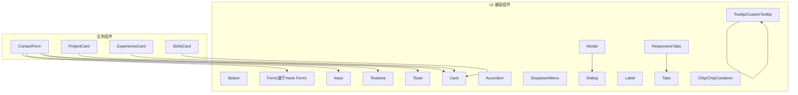

图表来源
- [components/ui/button.tsx:1-57](file://components/ui/button.tsx#L1-L57)
- [components/ui/dialog.tsx:1-121](file://components/ui/dialog.tsx#L1-L121)
- [components/ui/modal.tsx:1-40](file://components/ui/modal.tsx#L1-L40)
- [components/ui/tabs.tsx:1-56](file://components/ui/tabs.tsx#L1-L56)
- [components/ui/responsive-tabs.tsx:1-89](file://components/ui/responsive-tabs.tsx#L1-L89)
- [components/ui/accordion.tsx:1-63](file://components/ui/accordion.tsx#L1-L63)
- [components/ui/dropdown-menu.tsx:1-201](file://components/ui/dropdown-menu.tsx#L1-L201)
- [components/ui/form.tsx:1-178](file://components/ui/form.tsx#L1-L178)
- [components/ui/label.tsx:1-27](file://components/ui/label.tsx#L1-L27)
- [components/ui/toast.tsx:1-128](file://components/ui/toast.tsx#L1-L128)

章节来源
- [components/ui/button.tsx:1-57](file://components/ui/button.tsx#L1-L57)
- [components/ui/dialog.tsx:1-121](file://components/ui/dialog.tsx#L1-L121)
- [components/ui/modal.tsx:1-40](file://components/ui/modal.tsx#L1-L40)
- [components/ui/tabs.tsx:1-56](file://components/ui/tabs.tsx#L1-L56)
- [components/ui/responsive-tabs.tsx:1-89](file://components/ui/responsive-tabs.tsx#L1-L89)
- [components/ui/accordion.tsx:1-63](file://components/ui/accordion.tsx#L1-L63)
- [components/ui/dropdown-menu.tsx:1-201](file://components/ui/dropdown-menu.tsx#L1-L201)
- [components/ui/form.tsx:1-178](file://components/ui/form.tsx#L1-L178)
- [components/ui/label.tsx:1-27](file://components/ui/label.tsx#L1-L27)
- [components/ui/toast.tsx:1-128](file://components/ui/toast.tsx#L1-L128)

## 核心组件
本节概述各基础组件的职责、API 要点与样式体系。

- 按钮 Button
  - 职责：统一样式的交互按钮，支持多种变体与尺寸
  - 关键属性：variant（默认/破坏性/描边/次要/幽灵/链接）、size（默认/小/大/图标）、asChild（是否渲染为子组件）
  - 样式：基于 class-variance-authority 管理变体；焦点环与禁用态统一
  - 可访问性：原生 button 语义；asChild 时透传 props
  - 示例路径：[components/ui/button.tsx:1-57](file://components/ui/button.tsx#L1-L57)

- 输入 Input / Textarea
  - 职责：文本输入控件，遵循一致的边框、占位符、焦点环与禁用态
  - 关键属性：标准 HTML input/textarea 属性（type、placeholder、disabled 等）
  - 可访问性：focus-visible 高亮；禁用态不可操作
  - 示例路径：[components/ui/input.tsx:1-26](file://components/ui/input.tsx#L1-L26)、[components/ui/textarea.tsx:1-25](file://components/ui/textarea.tsx#L1-L25)

- 卡片 Card
  - 职责：内容容器，包含 Header/Title/Description/Content/Footer 子组件
  - 关键属性：className 扩展；子组件用于结构化布局
  - 示例路径：[components/ui/card.tsx:1-87](file://components/ui/card.tsx#L1-L87)

- 对话框 Dialog / Modal
  - 职责：模态窗口，提供遮罩、关闭按钮、标题与描述
  - 关键属性：open/onOpenChange（底层 Radix），或 Modal 的 isOpen/onClose/title/description/children
  - 可访问性：Radix 提供键盘与屏幕阅读器支持；关闭按钮含 sr-only 文本
  - 示例路径：[components/ui/dialog.tsx:1-121](file://components/ui/dialog.tsx#L1-L121)、[components/ui/modal.tsx:1-40](file://components/ui/modal.tsx#L1-L40)

- 标签页 Tabs / ResponsiveTabs
  - 职责：桌面端以标签切换内容，移动端以下拉选择切换
  - 关键属性：value/onValueChange（桌面），items/defaultValue（响应式封装）
  - 可访问性：Radix Tabs 提供键盘导航与状态同步
  - 示例路径：[components/ui/tabs.tsx:1-56](file://components/ui/tabs.tsx#L1-L56)、[components/ui/responsive-tabs.tsx:1-89](file://components/ui/responsive-tabs.tsx#L1-L89)

- 手风琴 Accordion
  - 职责：折叠面板，支持展开/收起动画
  - 关键属性：Item/Trigger/Content 组合；触发器带箭头旋转
  - 示例路径：[components/ui/accordion.tsx:1-63](file://components/ui/accordion.tsx#L1-L63)

- 下拉菜单 DropdownMenu
  - 职责：提供分组、单选、多选、分隔符、快捷键等丰富菜单能力
  - 关键属性：Group/Sub/Radio/Checkbox/Label/Separator/Shortcut 等
  - 示例路径：[components/ui/dropdown-menu.tsx:1-201](file://components/ui/dropdown-menu.tsx#L1-L201)

- 表单 Form（基于 react-hook-form）
  - 职责：封装 Hook Form 的 Provider、字段、标签、描述与错误消息
  - 关键组件：Form/FormField/FormItem/FormLabel/FormControl/FormDescription/FormMessage
  - 可访问性：自动关联 id、aria-describedby、aria-invalid
  - 示例路径：[components/ui/form.tsx:1-178](file://components/ui/form.tsx#L1-L178)、[components/ui/label.tsx:1-27](file://components/ui/label.tsx#L1-L27)

- 提示 Tooltip / CustomTooltip
  - 职责：悬浮提示，内置信息图标与文案
  - 关键属性：children、text、icon
  - 示例路径：[components/ui/custom-tooltip.tsx:1-35](file://components/ui/custom-tooltip.tsx#L1-L35)

- 通知 Toast
  - 职责：轻量反馈通知，支持成功/破坏性变体与动作按钮
  - 关键组件：Provider/Viewport/Root/Action/Close/Title/Description
  - 示例路径：[components/ui/toast.tsx:1-128](file://components/ui/toast.tsx#L1-L128)

- 标签 Chip / ChipContainer
  - 职责：展示一组短标签，支持换行与间距
  - 关键属性：content（单个）、textArr（数组）
  - 示例路径：[components/ui/chip.tsx:1-12](file://components/ui/chip.tsx#L1-L12)、[components/ui/chip-container.tsx:1-16](file://components/ui/chip-container.tsx#L1-L16)

章节来源
- [components/ui/button.tsx:1-57](file://components/ui/button.tsx#L1-L57)
- [components/ui/input.tsx:1-26](file://components/ui/input.tsx#L1-L26)
- [components/ui/textarea.tsx:1-25](file://components/ui/textarea.tsx#L1-L25)
- [components/ui/card.tsx:1-87](file://components/ui/card.tsx#L1-L87)
- [components/ui/dialog.tsx:1-121](file://components/ui/dialog.tsx#L1-L121)
- [components/ui/modal.tsx:1-40](file://components/ui/modal.tsx#L1-L40)
- [components/ui/tabs.tsx:1-56](file://components/ui/tabs.tsx#L1-L56)
- [components/ui/responsive-tabs.tsx:1-89](file://components/ui/responsive-tabs.tsx#L1-L89)
- [components/ui/accordion.tsx:1-63](file://components/ui/accordion.tsx#L1-L63)
- [components/ui/dropdown-menu.tsx:1-201](file://components/ui/dropdown-menu.tsx#L1-L201)
- [components/ui/form.tsx:1-178](file://components/ui/form.tsx#L1-L178)
- [components/ui/label.tsx:1-27](file://components/ui/label.tsx#L1-L27)
- [components/ui/custom-tooltip.tsx:1-35](file://components/ui/custom-tooltip.tsx#L1-L35)
- [components/ui/toast.tsx:1-128](file://components/ui/toast.tsx#L1-L128)
- [components/ui/chip.tsx:1-12](file://components/ui/chip.tsx#L1-L12)
- [components/ui/chip-container.tsx:1-16](file://components/ui/chip-container.tsx#L1-L16)

## 架构总览
组件之间通过明确的依赖关系协作：
- 高级组件依赖基础组件（如 Modal 依赖 Dialog，ResponsiveTabs 依赖 Tabs/Dropdown/Button）
- 表单系统围绕 Hook Form 构建，结合 Label/Input/Textarea 形成完整表单体验
- 通知与提示作为全局反馈层，独立于页面结构

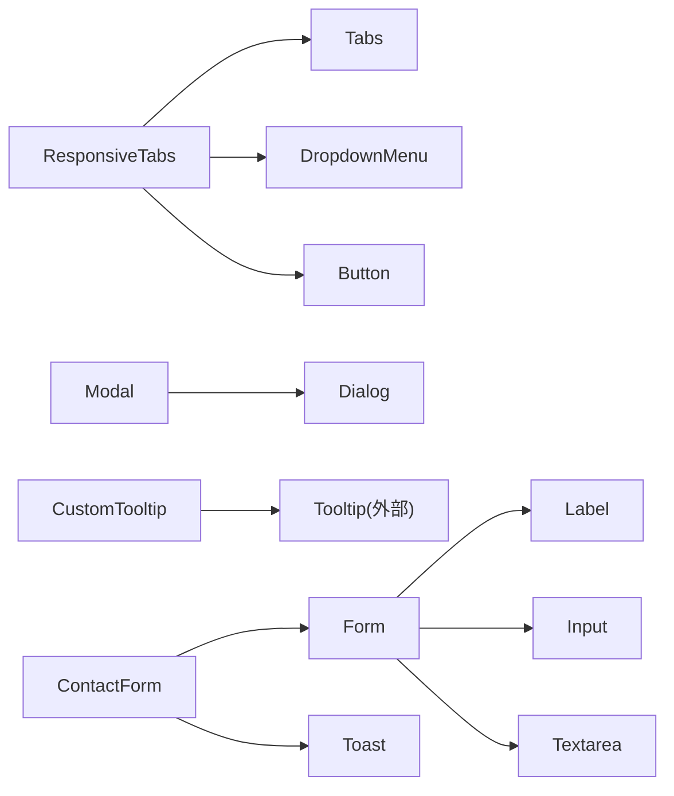

图表来源
- [components/ui/responsive-tabs.tsx:1-89](file://components/ui/responsive-tabs.tsx#L1-L89)
- [components/ui/tabs.tsx:1-56](file://components/ui/tabs.tsx#L1-L56)
- [components/ui/dropdown-menu.tsx:1-201](file://components/ui/dropdown-menu.tsx#L1-L201)
- [components/ui/button.tsx:1-57](file://components/ui/button.tsx#L1-L57)
- [components/ui/modal.tsx:1-40](file://components/ui/modal.tsx#L1-L40)
- [components/ui/dialog.tsx:1-121](file://components/ui/dialog.tsx#L1-L121)
- [components/ui/form.tsx:1-178](file://components/ui/form.tsx#L1-L178)
- [components/ui/label.tsx:1-27](file://components/ui/label.tsx#L1-L27)
- [components/ui/input.tsx:1-26](file://components/ui/input.tsx#L1-L26)
- [components/ui/textarea.tsx:1-25](file://components/ui/textarea.tsx#L1-L25)
- [components/ui/custom-tooltip.tsx:1-35](file://components/ui/custom-tooltip.tsx#L1-L35)
- [components/ui/toast.tsx:1-128](file://components/ui/toast.tsx#L1-L128)

## 详细组件分析

### 按钮 Button
- 设计原则：单一职责、变体驱动、可组合（asChild）
- 属性与事件：继承标准按钮属性；支持 variant/size/asChild
- 样式定制：通过 cva 管理变体；可通过 className 叠加
- 可访问性：原生按钮语义；焦点环与禁用态
- 复杂度：O(1) 渲染；无额外状态

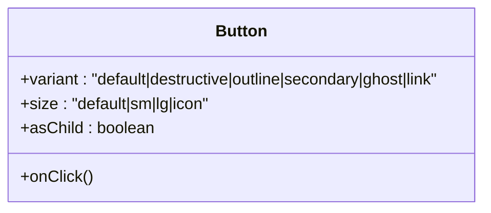

图表来源
- [components/ui/button.tsx:1-57](file://components/ui/button.tsx#L1-L57)

章节来源
- [components/ui/button.tsx:1-57](file://components/ui/button.tsx#L1-L57)

### 输入与文本域 Input / Textarea
- 设计原则：一致的外观与交互；无障碍聚焦与禁用态
- 属性与事件：标准 HTML 属性；onChange/onBlur 等由父级控制
- 样式定制：统一的边框、圆角、占位符颜色与焦点环
- 可访问性：focus-visible 高亮；禁用态不可操作

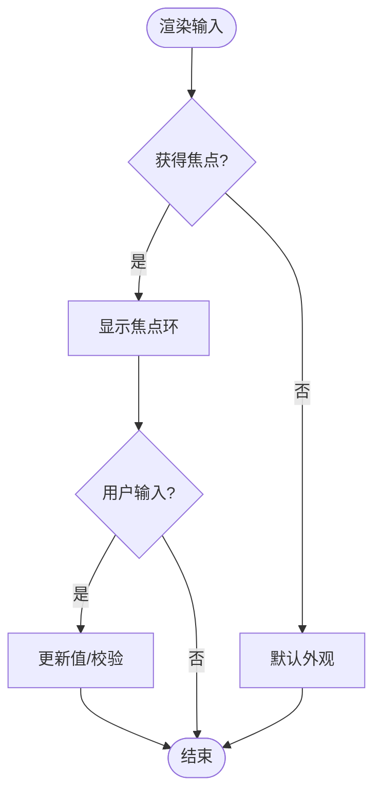

图表来源
- [components/ui/input.tsx:1-26](file://components/ui/input.tsx#L1-L26)
- [components/ui/textarea.tsx:1-25](file://components/ui/textarea.tsx#L1-L25)

章节来源
- [components/ui/input.tsx:1-26](file://components/ui/input.tsx#L1-L26)
- [components/ui/textarea.tsx:1-25](file://components/ui/textarea.tsx#L1-L25)

### 卡片 Card
- 设计原则：结构化内容容器；Header/Title/Description/Content/Footer 分工明确
- 属性与事件：className 扩展；子组件组合
- 样式定制：阴影、边框、内边距统一；可自定义背景与文字色

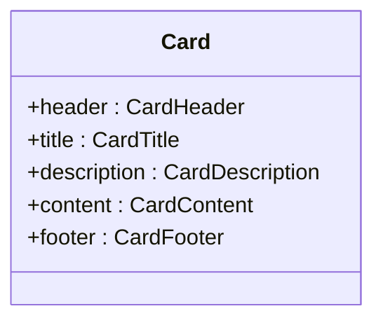

图表来源
- [components/ui/card.tsx:1-87](file://components/ui/card.tsx#L1-L87)

章节来源
- [components/ui/card.tsx:1-87](file://components/ui/card.tsx#L1-L87)

### 对话框与模态 Dialog / Modal
- 设计原则：基于 Radix 的可访问模态；Modal 提供简化 API
- 属性与事件：Dialog 使用 open/onOpenChange；Modal 暴露 isOpen/onClose/title/description/children
- 样式定制：遮罩透明度、动画、圆角、间距
- 可访问性：键盘 ESC 关闭、焦点陷阱、屏幕阅读器友好

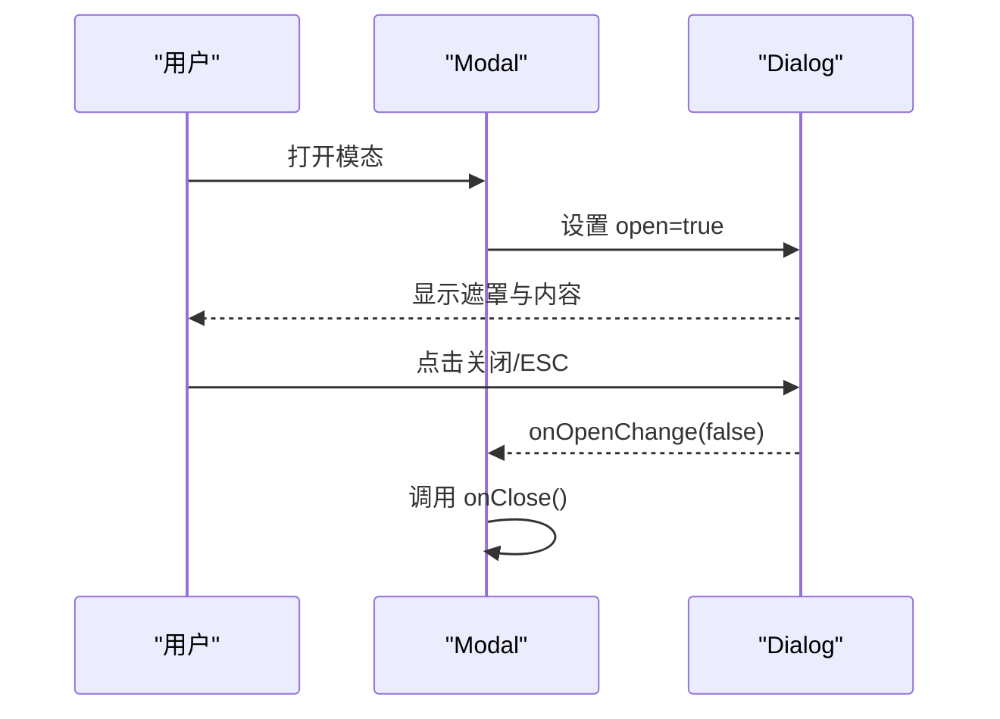

图表来源
- [components/ui/modal.tsx:1-40](file://components/ui/modal.tsx#L1-L40)
- [components/ui/dialog.tsx:1-121](file://components/ui/dialog.tsx#L1-L121)

章节来源
- [components/ui/modal.tsx:1-40](file://components/ui/modal.tsx#L1-L40)
- [components/ui/dialog.tsx:1-121](file://components/ui/dialog.tsx#L1-L121)

### 标签页 Tabs / ResponsiveTabs
- 设计原则：桌面端标签切换，移动端下拉选择；统一 value/onValueChange 控制
- 属性与事件：Tabs 使用 value/onValueChange；ResponsiveTabs 接收 items/defaultValue
- 样式定制：列表背景、激活态高亮、网格布局
- 可访问性：Radix Tabs 提供键盘导航与状态同步

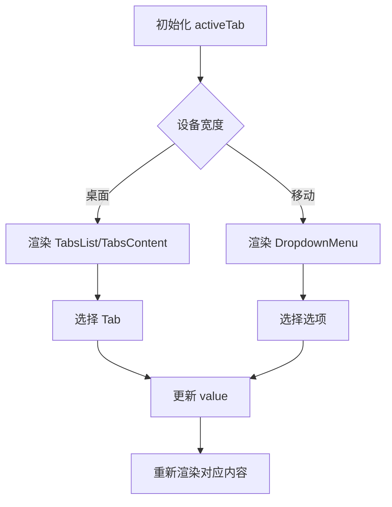

图表来源
- [components/ui/tabs.tsx:1-56](file://components/ui/tabs.tsx#L1-L56)
- [components/ui/responsive-tabs.tsx:1-89](file://components/ui/responsive-tabs.tsx#L1-L89)

章节来源
- [components/ui/tabs.tsx:1-56](file://components/ui/tabs.tsx#L1-L56)
- [components/ui/responsive-tabs.tsx:1-89](file://components/ui/responsive-tabs.tsx#L1-L89)

### 手风琴 Accordion
- 设计原则：折叠面板，触发器带箭头动画
- 属性与事件：Item/Trigger/Content 组合；展开/收起状态由底层管理
- 样式定制：边框、内边距、过渡动画

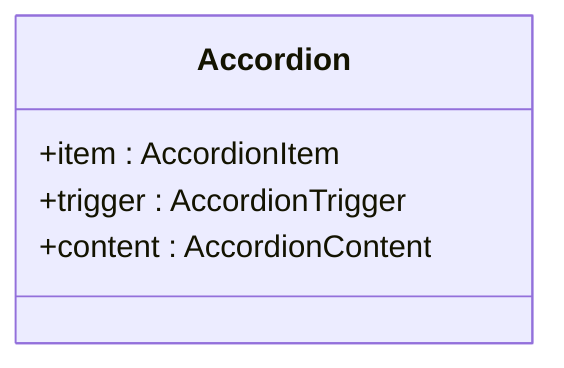

图表来源
- [components/ui/accordion.tsx:1-63](file://components/ui/accordion.tsx#L1-L63)

章节来源
- [components/ui/accordion.tsx:1-63](file://components/ui/accordion.tsx#L1-L63)

### 下拉菜单 DropdownMenu
- 设计原则：丰富的菜单项类型（分组、单选、多选、分隔符、快捷键）
- 属性与事件：Group/Sub/Radio/Checkbox/Label/Separator/Shortcut
- 样式定制：弹出位置、动画、选中指示器

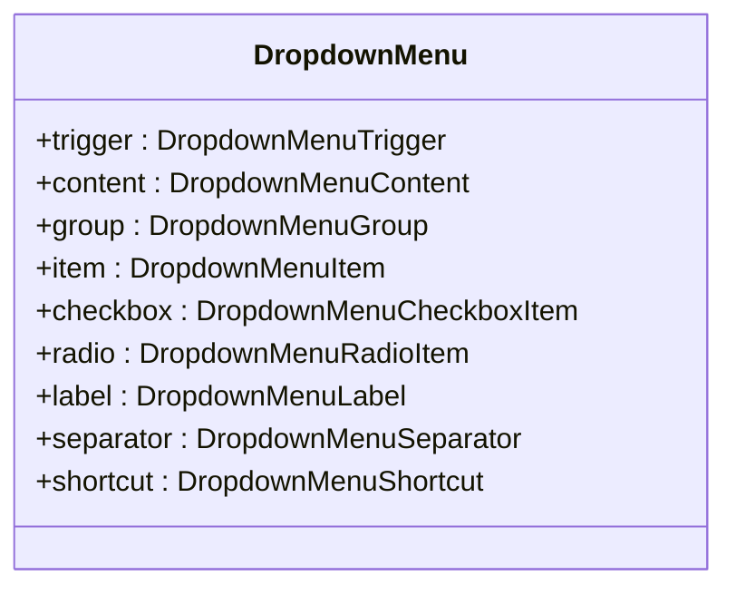

图表来源
- [components/ui/dropdown-menu.tsx:1-201](file://components/ui/dropdown-menu.tsx#L1-L201)

章节来源
- [components/ui/dropdown-menu.tsx:1-201](file://components/ui/dropdown-menu.tsx#L1-L201)

### 表单 Form（基于 react-hook-form）
- 设计原则：声明式表单结构；自动关联 label、描述与错误消息
- 属性与事件：FormField 绑定字段；FormLabel/FormControl/FormDescription/FormMessage 协同
- 可访问性：id 关联、aria-describedby、aria-invalid
- 复杂度：受控于 Hook Form；校验与提交由上层处理

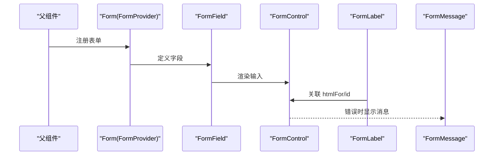

图表来源
- [components/ui/form.tsx:1-178](file://components/ui/form.tsx#L1-L178)
- [components/ui/label.tsx:1-27](file://components/ui/label.tsx#L1-L27)

章节来源
- [components/ui/form.tsx:1-178](file://components/ui/form.tsx#L1-L178)
- [components/ui/label.tsx:1-27](file://components/ui/label.tsx#L1-L27)

### 提示 Tooltip / CustomTooltip
- 设计原则：包裹任意元素显示提示；内置信息图标
- 属性与事件：children、text、icon
- 样式定制：提示框内容与图标样式

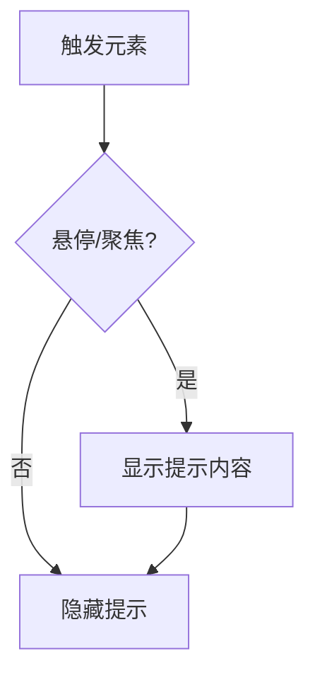

图表来源
- [components/ui/custom-tooltip.tsx:1-35](file://components/ui/custom-tooltip.tsx#L1-L35)

章节来源
- [components/ui/custom-tooltip.tsx:1-35](file://components/ui/custom-tooltip.tsx#L1-L35)

### 通知 Toast
- 设计原则：轻量反馈；支持动作与关闭
- 属性与事件：Provider/Viewport/Root/Action/Close/Title/Description
- 样式定制：变体（默认/破坏性）、滑动与淡入淡出动画

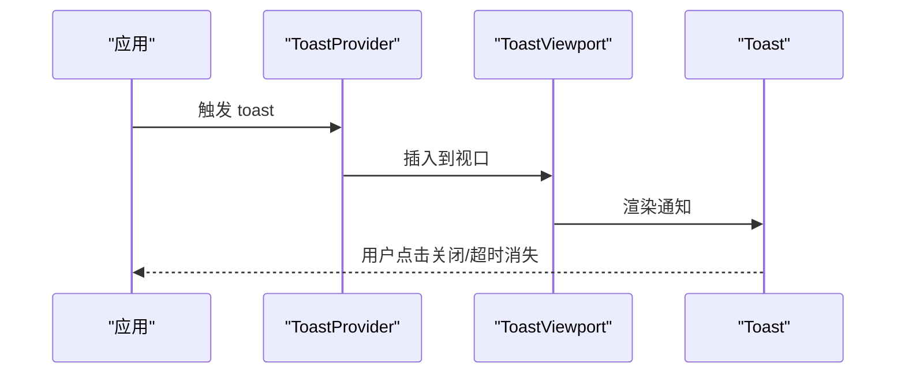

图表来源
- [components/ui/toast.tsx:1-128](file://components/ui/toast.tsx#L1-L128)

章节来源
- [components/ui/toast.tsx:1-128](file://components/ui/toast.tsx#L1-L128)

### 标签 Chip / ChipContainer
- 设计原则：紧凑展示标签；支持换行与间距
- 属性与事件：content（单条）、textArr（多条）
- 样式定制：边框、背景、字号与字重

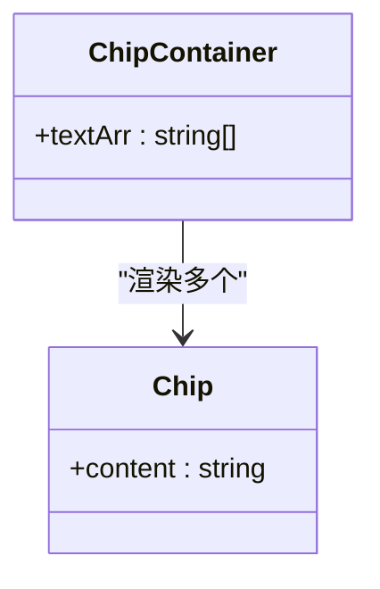

图表来源
- [components/ui/chip.tsx:1-12](file://components/ui/chip.tsx#L1-L12)
- [components/ui/chip-container.tsx:1-16](file://components/ui/chip-container.tsx#L1-L16)

章节来源
- [components/ui/chip.tsx:1-12](file://components/ui/chip.tsx#L1-L12)
- [components/ui/chip-container.tsx:1-16](file://components/ui/chip-container.tsx#L1-L16)

## 依赖关系分析
- 组件耦合度低：基础组件仅依赖工具函数与第三方 UI 库（Radix、Lucide）
- 组合模式清晰：高级组件通过组合基础组件实现复杂交互
- 外部依赖：
  - Radix UI：Dialog、Tabs、Accordion、DropdownMenu、Toast、Label
  - Lucide React：图标
  - class-variance-authority：变体样式管理
  - react-hook-form：表单状态与校验

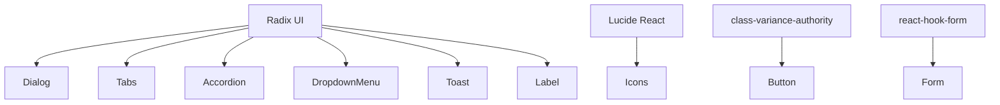

图表来源
- [components/ui/dialog.tsx:1-121](file://components/ui/dialog.tsx#L1-L121)
- [components/ui/tabs.tsx:1-56](file://components/ui/tabs.tsx#L1-L56)
- [components/ui/accordion.tsx:1-63](file://components/ui/accordion.tsx#L1-L63)
- [components/ui/dropdown-menu.tsx:1-201](file://components/ui/dropdown-menu.tsx#L1-L201)
- [components/ui/toast.tsx:1-128](file://components/ui/toast.tsx#L1-L128)
- [components/ui/label.tsx:1-27](file://components/ui/label.tsx#L1-L27)
- [components/ui/button.tsx:1-57](file://components/ui/button.tsx#L1-L57)
- [components/ui/form.tsx:1-178](file://components/ui/form.tsx#L1-L178)

章节来源
- [components/ui/dialog.tsx:1-121](file://components/ui/dialog.tsx#L1-L121)
- [components/ui/tabs.tsx:1-56](file://components/ui/tabs.tsx#L1-L56)
- [components/ui/accordion.tsx:1-63](file://components/ui/accordion.tsx#L1-L63)
- [components/ui/dropdown-menu.tsx:1-201](file://components/ui/dropdown-menu.tsx#L1-L201)
- [components/ui/toast.tsx:1-128](file://components/ui/toast.tsx#L1-L128)
- [components/ui/label.tsx:1-27](file://components/ui/label.tsx#L1-L27)
- [components/ui/button.tsx:1-57](file://components/ui/button.tsx#L1-L57)
- [components/ui/form.tsx:1-178](file://components/ui/form.tsx#L1-L178)

## 性能与可访问性
- 性能
  - 基础组件无状态或轻量状态，渲染开销低
  - 使用 Radix 的原生行为减少重复实现，提升稳定性
  - 响应式 Tabs 在移动端降级为下拉菜单，减少 DOM 节点
- 可访问性
  - 焦点管理：focus-visible 高亮、禁用态不可操作
  - 屏幕阅读器：sr-only 文本、aria-describedby、aria-invalid
  - 键盘交互：ESC 关闭模态、Tab 顺序合理、ARIA 状态同步
- 响应式设计
  - 断点切换：桌面端标签页 vs 移动端下拉
  - 弹性布局：flex/grid 自适应内容宽度

## 故障排查指南
- 表单字段未联动
  - 检查是否在 Form 上下文中使用 FormField/FormControl
  - 确认 FormLabel 的 htmlFor 与 FormControl 的 id 关联
  - 参考路径：[components/ui/form.tsx:1-178](file://components/ui/form.tsx#L1-L178)
- 模态无法关闭
  - 确保 Modal 的 isOpen 与 onOpenChange/onClose 正确传递
  - 检查 Dialog 的 open 状态是否被外部状态控制
  - 参考路径：[components/ui/modal.tsx:1-40](file://components/ui/modal.tsx#L1-L40)、[components/ui/dialog.tsx:1-121](file://components/ui/dialog.tsx#L1-L121)
- 标签页不切换
  - 确认 value/onValueChange 是否正确绑定
  - 检查 ResponsiveTabs 的 items 与 defaultValue
  - 参考路径：[components/ui/tabs.tsx:1-56](file://components/ui/tabs.tsx#L1-L56)、[components/ui/responsive-tabs.tsx:1-89](file://components/ui/responsive-tabs.tsx#L1-L89)
- 提示不显示
  - 检查 TooltipProvider 是否包裹
  - 确认 children 是否为可触发元素
  - 参考路径：[components/ui/custom-tooltip.tsx:1-35](file://components/ui/custom-tooltip.tsx#L1-L35)
- 通知未出现
  - 确保 ToastProvider 已挂载
  - 检查 ToastViewport 位置与层级
  - 参考路径：[components/ui/toast.tsx:1-128](file://components/ui/toast.tsx#L1-L128)

章节来源
- [components/ui/form.tsx:1-178](file://components/ui/form.tsx#L1-L178)
- [components/ui/modal.tsx:1-40](file://components/ui/modal.tsx#L1-L40)
- [components/ui/dialog.tsx:1-121](file://components/ui/dialog.tsx#L1-L121)
- [components/ui/tabs.tsx:1-56](file://components/ui/tabs.tsx#L1-L56)
- [components/ui/responsive-tabs.tsx:1-89](file://components/ui/responsive-tabs.tsx#L1-L89)
- [components/ui/custom-tooltip.tsx:1-35](file://components/ui/custom-tooltip.tsx#L1-L35)
- [components/ui/toast.tsx:1-128](file://components/ui/toast.tsx#L1-L128)

## 结论
本组件库以 Radix 为基础，结合 class-variance-authority 与 react-hook-form，提供了高内聚、低耦合、可访问且响应式的基础与业务组件。通过统一的样式系统与组合模式，开发者可以快速搭建一致的用户界面，并在不同设备上获得良好体验。

## 附录：使用示例与最佳实践
- 表单最佳实践
  - 使用 Form 包裹，FormField 绑定字段，FormLabel/FormControl/FormDescription/FormMessage 协同
  - 将输入与文本域作为 FormControl 的子元素，确保无障碍关联
  - 参考路径：[components/ui/form.tsx:1-178](file://components/ui/form.tsx#L1-L178)、[components/ui/input.tsx:1-26](file://components/ui/input.tsx#L1-L26)、[components/ui/textarea.tsx:1-25](file://components/ui/textarea.tsx#L1-L25)
- 模态与对话框
  - 使用 Modal 简化开闭逻辑；复杂场景直接使用 Dialog 组合
  - 注意焦点管理与 ESC 关闭行为
  - 参考路径：[components/ui/modal.tsx:1-40](file://components/ui/modal.tsx#L1-L40)、[components/ui/dialog.tsx:1-121](file://components/ui/dialog.tsx#L1-L121)
- 响应式标签页
  - 使用 ResponsiveTabs 自动适配桌面与移动端
  - 通过 items 配置标签与内容，defaultValue 指定初始项
  - 参考路径：[components/ui/responsive-tabs.tsx:1-89](file://components/ui/responsive-tabs.tsx#L1-L89)
- 通知与提示
  - 使用 Toast 进行成功/失败反馈；使用 Tooltip/CustomTooltip 提供上下文帮助
  - 参考路径：[components/ui/toast.tsx:1-128](file://components/ui/toast.tsx#L1-L128)、[components/ui/custom-tooltip.tsx:1-35](file://components/ui/custom-tooltip.tsx#L1-L35)
- 卡片与标签
  - 使用 Card 组合 Header/Title/Description/Content/Footer 组织内容
  - 使用 Chip/ChipContainer 展示技能、标签等短文本集合
  - 参考路径：[components/ui/card.tsx:1-87](file://components/ui/card.tsx#L1-L87)、[components/ui/chip.tsx:1-12](file://components/ui/chip.tsx#L1-L12)、[components/ui/chip-container.tsx:1-16](file://components/ui/chip-container.tsx#L1-L16)