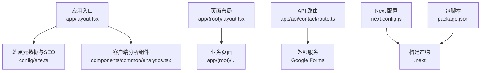
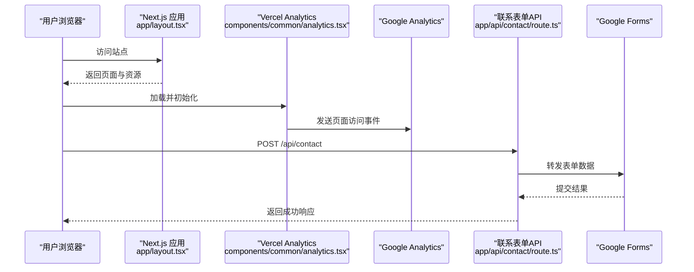
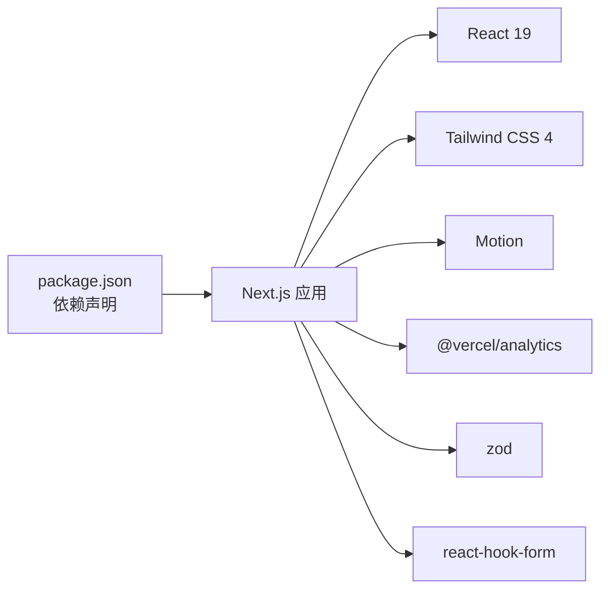

# 部署指南

<cite>
**本文引用的文件**
- [package.json](file://package.json)
- [next.config.js](file://next.config.js)
- [README.md](file://README.md)
- [app/layout.tsx](file://app/layout.tsx)
- [app/(root)/layout.tsx](file://app/(root)/layout.tsx)
- [config/site.ts](file://config/site.ts)
- [components/common/analytics.tsx](file://components/common/analytics.tsx)
- [app/api/contact/route.ts](file://app/api/contact/route.ts)
- [tsconfig.json](file://tsconfig.json)
</cite>

## 目录
1. [简介](#简介)
2. [项目结构](#项目结构)
3. [核心组件](#核心组件)
4. [架构总览](#架构总览)
5. [详细组件分析](#详细组件分析)
6. [依赖分析](#依赖分析)
7. [性能考虑](#性能考虑)
8. [故障排查指南](#故障排查指南)
9. [结论](#结论)
10. [附录](#附录)

## 简介
本指南面向将 Next.js 投资组合项目部署到生产环境的工程师与运维人员，重点覆盖 Vercel 平台的部署流程与配置选项，并补充 Netlify、AWS 等常见平台的部署方法。内容涵盖自定义域名、环境变量、SSL 证书、CI/CD 自动化、监控日志与错误追踪的最佳实践，确保生产环境稳定、可观测且易于维护。

## 项目结构
本项目采用 Next.js App Router 组织页面与 API：
- 应用根布局与元数据在 app/layout.tsx，负责站点标题、描述、OpenGraph/Twitter 卡片、Google 验证、Google Analytics 注入等。
- 业务路由位于 app/(root)/...，包含博客、项目、经验、技能、联系等页面。
- API 路由位于 app/api/...，例如联系表单提交接口。
- 站点常量与 SEO 信息集中在 config/site.ts。
- 构建与运行脚本定义在 package.json。
- Next 配置在 next.config.js（当前用于设置跨域响应头）。
- TypeScript 编译选项在 tsconfig.json。

图表来源
- [app/layout.tsx:30-97](file://app/layout.tsx#L30-L97)
- [config/site.ts:1-41](file://config/site.ts#L1-L41)
- [components/common/analytics.tsx:1-8](file://components/common/analytics.tsx#L1-L8)
- [app/(root)/layout.tsx:1-33](file://app/(root)/layout.tsx#L1-L33)
- [app/api/contact/route.ts:1-31](file://app/api/contact/route.ts#L1-L31)
- [next.config.js:1-25](file://next.config.js#L1-L25)
- [package.json:5-9](file://package.json#L5-L9)

章节来源
- [app/layout.tsx:30-97](file://app/layout.tsx#L30-L97)
- [config/site.ts:1-41](file://config/site.ts#L1-L41)
- [components/common/analytics.tsx:1-8](file://components/common/analytics.tsx#L1-L8)
- [app/(root)/layout.tsx:1-33](file://app/(root)/layout.tsx#L1-L33)
- [app/api/contact/route.ts:1-31](file://app/api/contact/route.ts#L1-L31)
- [next.config.js:1-25](file://next.config.js#L1-L25)
- [package.json:5-9](file://package.json#L5-L9)

## 核心组件
- 站点元数据与 SEO：通过 app/layout.tsx 的 metadata 对象集中管理标题、描述、关键词、作者、OpenGraph/Twitter 卡片、图标、manifest、robots、Google 站点验证等，便于统一控制搜索引擎与社交分享展示。
- 分析与埋点：根布局注入 Google Analytics；同时引入 Vercel Analytics 组件进行前端行为统计。
- 站点常量：config/site.ts 提供站点名称、描述、URL、社交链接、OG 图片等，便于多端复用与一致性。
- API 路由：app/api/contact/route.ts 接收联系表单数据并转发至 Google Forms，依赖多个环境变量完成字段映射。
- 构建与脚本：package.json 定义了 dev/build/start/lint 等常用命令，便于本地开发与 CI 流水线集成。

章节来源
- [app/layout.tsx:30-97](file://app/layout.tsx#L30-L97)
- [components/common/analytics.tsx:1-8](file://components/common/analytics.tsx#L1-L8)
- [config/site.ts:1-41](file://config/site.ts#L1-L41)
- [app/api/contact/route.ts:1-31](file://app/api/contact/route.ts#L1-L31)
- [package.json:5-9](file://package.json#L5-L9)

## 架构总览
下图展示了生产环境的关键交互：用户访问站点，Next.js 服务端渲染页面并返回静态资源；前端埋点上报至 Google Analytics 与 Vercel Analytics；联系表单通过 API 路由转发至 Google Forms；所有请求由平台自动提供 HTTPS 与 CDN 加速。

图表来源
- [app/layout.tsx:30-97](file://app/layout.tsx#L30-L97)
- [components/common/analytics.tsx:1-8](file://components/common/analytics.tsx#L1-L8)
- [app/api/contact/route.ts:1-31](file://app/api/contact/route.ts#L1-L31)

## 详细组件分析

### Vercel 部署流程与配置
- 一键部署：使用 README 中提供的 Vercel 模板链接或从 GitHub/GitLab 导入仓库后直接部署。
- 构建与运行：基于 package.json 中的脚本，Vercel 会自动执行构建与启动。
- 环境变量：在 Vercel 项目的 Settings > Environment Variables 中添加所需变量，如 Google Analytics ID、Google 站点验证、联系表单相关字段等。
- 自定义域名：在 Domains 中添加自有域名，Vercel 会分配并自动签发 SSL 证书。
- 构建输出：Next.js 默认输出为静态化与 Serverless 混合产物，Vercel 自动优化缓存与边缘分发。

章节来源
- [README.md:138-142](file://README.md#L138-L142)
- [package.json:5-9](file://package.json#L5-L9)

### 环境变量配置清单
- NEXT_PUBLIC_GOOGLE_MEASUREMENT_ID：Google Analytics 测量 ID，缺失时会在根布局抛出错误，需在生产环境配置。
- NEXT_PUBLIC_GOOGLE_VERIFICATION：Google 站点验证令牌，用于 SEO 验证。
- GOOGLE_FORM_LINK：Google Forms 提交地址。
- GOOGLE_FORM_FIELD_ID_NAME、GOOGLE_FORM_FIELD_ID_EMAIL、GOOGLE_FORM_FIELD_ID_MESSAGE、GOOGLE_FORM_FIELD_ID_SOCIAL：对应 Google Forms 各字段的 ID，用于拼接提交 URL。
- NEXT_PUBLIC_RESUME_LINK：简历跳转链接，若未配置则回退到首页。

注意：
- 以 NEXT_PUBLIC_ 开头的变量会被打包到客户端代码中，仅暴露必要信息。
- 敏感信息（如表单字段 ID）建议放在服务器端环境变量中，避免泄露。

章节来源
- [app/layout.tsx:95-103](file://app/layout.tsx#L95-L103)
- [app/api/contact/route.ts:4-15](file://app/api/contact/route.ts#L4-L15)
- [app/(root)/resume/page.tsx:7](file://app/(root)/resume/page.tsx#L7)

### 自定义域名与 SSL 证书
- 在 Vercel Domains 中添加自定义域名，平台会自动签发并续期 HTTPS 证书。
- 如需强制 HTTPS，可在 Vercel 设置中启用“Always Use HTTPS”。
- 若使用第三方 DNS，请按照 Vercel 提示添加相应的 TXT/CNAME 记录完成验证。

章节来源
- [README.md:138-142](file://README.md#L138-L142)

### 跨域与安全头
- next.config.js 中已为特定 API 路径设置了 CORS 相关响应头，便于前端跨域调用。
- 生产环境建议结合 WAF/CDN 策略限制来源与方法，最小化暴露面。

章节来源
- [next.config.js:3-21](file://next.config.js#L3-L21)

### 监控、日志与错误追踪
- Google Analytics：通过根布局注入 GA ID，实现页面访问与用户行为统计。
- Vercel Analytics：通过客户端组件自动采集前端性能与交互指标。
- 构建与运行时日志：在 Vercel 控制台查看构建日志与函数日志，定位问题。
- 错误追踪：可接入 Sentry 等工具，在客户端与服务端捕获异常并上报。

章节来源
- [app/layout.tsx:100-103](file://app/layout.tsx#L100-L103)
- [components/common/analytics.tsx:1-8](file://components/common/analytics.tsx#L1-L8)

### 其他平台部署要点

#### Netlify
- 构建命令：next build
- 发布目录：.next
- 环境变量：在 Netlify 项目设置中添加上述环境变量
- 自定义域名：在 Site settings > Domain management 中添加并配置 DNS
- 重定向与头部：可通过 netlify.toml 配置 301 重定向与响应头

#### AWS（CloudFront + S3 + Lambda@Edge 或 Amplify）
- 静态站点：构建产物上传至 S3，使用 CloudFront 分发并配置 HTTPS
- Serverless 函数：将 API 路由转换为 Lambda 函数，通过 API Gateway 暴露
- 环境变量：在 CloudFormation/Amplify/SSM 中管理
- 监控：集成 CloudWatch 日志与 X-Ray 链路追踪

#### Docker 自托管
- 构建镜像：基于官方 Node 镜像，安装依赖并执行 next build
- 运行容器：使用 next start 启动服务，配合 Nginx/HAProxy 反向代理与 TLS 终止
- 环境变量：通过 .env 文件或编排平台注入
- 监控：集成 PM2/Apache Airflow/ELK 等日志与指标收集

## 依赖分析
- 运行时依赖：Next.js 16、React 19、Tailwind CSS、Motion、Zod、React Hook Form、Vercel Analytics 等
- 开发依赖：TypeScript、ESLint、Prettier
- 构建目标：ES2017，严格模式，增量编译，模块解析为 bundler

图表来源
- [package.json:11-43](file://package.json#L11-L43)

章节来源
- [package.json:11-43](file://package.json#L11-L43)
- [tsconfig.json:1-43](file://tsconfig.json#L1-L43)

## 性能考虑
- 静态资源优化：Next.js 自动优化图片与字体，建议使用合适的尺寸与格式。
- 缓存策略：利用 Vercel 的 CDN 缓存与增量静态再生（ISR）提升首屏速度。
- 代码分割：按路由与组件粒度拆分，减少首屏体积。
- 网络优化：启用 HTTP/2、Gzip/Brotli 压缩，合理设置 Cache-Control。
- 监控指标：关注 LCP、FID、CLS 等 Core Web Vitals，持续优化。

## 故障排查指南
- 构建失败：检查 Node 版本与依赖是否匹配，确认 TypeScript 与 ESLint 配置无误。
- 环境变量缺失：根布局对 Google Analytics ID 有强校验，缺失会抛出错误；请在平台设置中补齐。
- 表单提交失败：确认 GOOGLE_FORM_LINK 与各字段 ID 正确，并在 API 路由中检查返回值与错误处理。
- 跨域问题：核对 next.config.js 中的 CORS 头是否与前端请求一致。
- 日志定位：在 Vercel 控制台查看构建日志与函数日志，逐步缩小问题范围。

章节来源
- [app/layout.tsx:100-103](file://app/layout.tsx#L100-L103)
- [app/api/contact/route.ts:4-29](file://app/api/contact/route.ts#L4-L29)
- [next.config.js:3-21](file://next.config.js#L3-L21)

## 结论
通过 Vercel 的一键部署与原生 Next.js 支持，本项目可以快速上线并享受自动化的 HTTPS、CDN 与扩展能力。配合完善的环境变量管理、监控与错误追踪，能够保障生产环境的稳定性与可观测性。对于需要更复杂架构的场景，可迁移至 Netlify 或 AWS，遵循相同的配置原则与最佳实践。

## 附录

### CI/CD 流水线最佳实践
- 触发条件：push/PR 到 main 分支触发构建与测试
- 步骤：
  - 安装依赖：npm ci
  - 类型检查：tsc --noEmit
  - 代码质量：eslint .
  - 构建：npm run build
  - 部署：推送至 Vercel/Netlify/AWS
- 缓存：缓存 node_modules 与构建产物，缩短流水线时间
- 安全：使用平台 Secrets 管理敏感信息，避免硬编码

### 环境变量参考表
- NEXT_PUBLIC_GOOGLE_MEASUREMENT_ID：Google Analytics 测量 ID
- NEXT_PUBLIC_GOOGLE_VERIFICATION：Google 站点验证令牌
- GOOGLE_FORM_LINK：Google Forms 提交地址
- GOOGLE_FORM_FIELD_ID_NAME：姓名字段 ID
- GOOGLE_FORM_FIELD_ID_EMAIL：邮箱字段 ID
- GOOGLE_FORM_FIELD_ID_MESSAGE：消息字段 ID
- GOOGLE_FORM_FIELD_ID_SOCIAL：社交链接字段 ID
- NEXT_PUBLIC_RESUME_LINK：简历跳转链接（可选）

章节来源
- [app/layout.tsx:95-103](file://app/layout.tsx#L95-L103)
- [app/api/contact/route.ts:4-15](file://app/api/contact/route.ts#L4-L15)
- [app/(root)/resume/page.tsx:7](file://app/(root)/resume/page.tsx#L7)