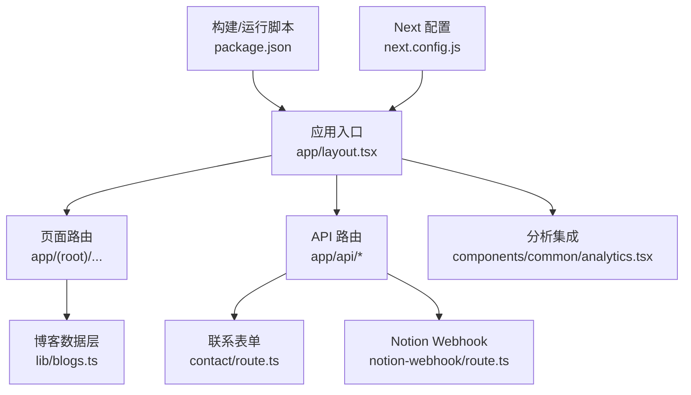
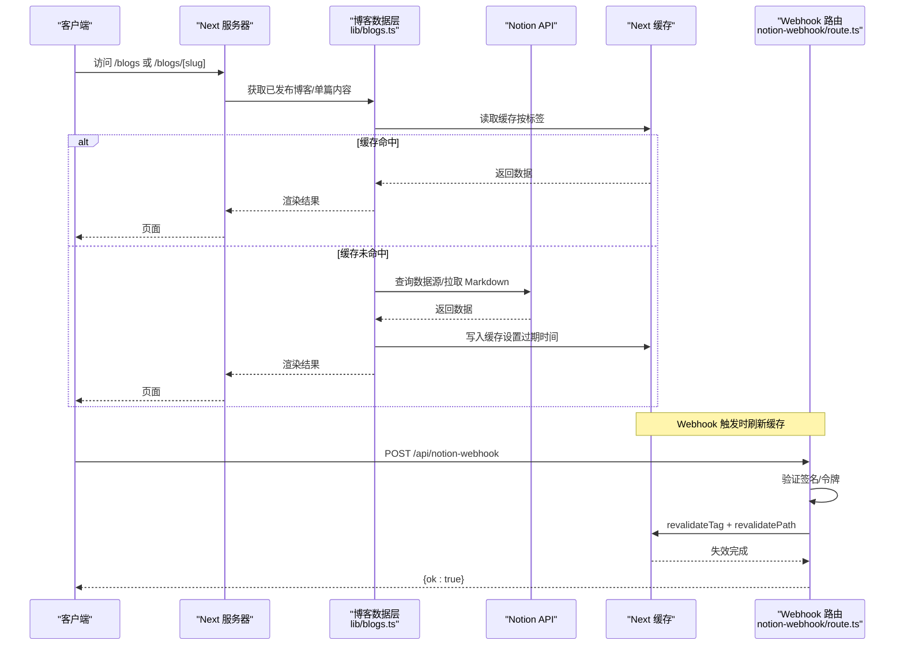
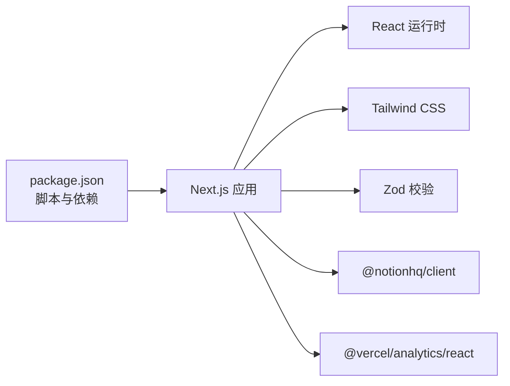

# 部署指南

<cite>
**本文引用的文件**
- [package.json](file://package.json)
- [next.config.js](file://next.config.js)
- [README.md](file://README.md)
- [app/api/contact/route.ts](file://app/api/contact/route.ts)
- [app/api/notion-webhook/route.ts](file://app/api/notion-webhook/route.ts)
- [lib/blogs.ts](file://lib/blogs.ts)
- [components/common/analytics.tsx](file://components/common/analytics.tsx)
- [AGENTS.md](file://AGENTS.md)
</cite>

## 目录
1. [简介](#简介)
2. [项目结构](#项目结构)
3. [核心组件](#核心组件)
4. [架构总览](#架构总览)
5. [详细组件分析](#详细组件分析)
6. [依赖分析](#依赖分析)
7. [性能考虑](#性能考虑)
8. [故障排查指南](#故障排查指南)
9. [结论](#结论)
10. [附录](#附录)

## 简介
本指南面向将 Next.js 投资组合项目部署到生产环境的工程师与运维人员，覆盖 Vercel 一键部署、环境变量配置、域名与 SSL、CDN 优化、其他平台适配、容器化方案、回滚策略、监控与告警、常见问题定位与性能调优。文档基于仓库中的实际代码与配置进行说明，确保可操作性和一致性。

## 项目结构
本项目采用 Next.js App Router 组织页面与 API 路由，静态资源位于 public，业务逻辑分布在 components、lib、config 等目录。构建与运行脚本在 package.json 中定义，Next 配置位于 next.config.js。博客内容通过 Notion 数据源拉取并缓存，联系表单通过服务端 API 转发至 Google Forms。

图表来源
- [package.json:6-11](file://package.json#L6-L11)
- [next.config.js:1-5](file://next.config.js#L1-L5)
- [app/api/contact/route.ts:11-56](file://app/api/contact/route.ts#L11-L56)
- [app/api/notion-webhook/route.ts:13-75](file://app/api/notion-webhook/route.ts#L13-L75)
- [lib/blogs.ts:92-131](file://lib/blogs.ts#L92-L131)
- [components/common/analytics.tsx:1-7](file://components/common/analytics.tsx#L1-L7)

章节来源
- [package.json:6-11](file://package.json#L6-L11)
- [next.config.js:1-5](file://next.config.js#L1-L5)
- [README.md:195-199](file://README.md#L195-L199)

## 核心组件
- 构建与运行：使用 pnpm 管理包，提供 dev/build/start 脚本，便于本地开发与生产启动。
- 博客数据层：通过 Notion Data Source 拉取已发布文章，使用 Next 缓存与标签失效机制实现按需更新。
- 联系表单 API：校验输入后转发至 Google Forms，返回统一响应。
- Webhook 刷新：接收 Notion Webhook，验证签名后触发指定路径与标签的缓存失效。
- 分析与埋点：集成 Vercel Analytics，支持浏览器端统计。

章节来源
- [package.json:6-11](file://package.json#L6-L11)
- [lib/blogs.ts:92-131](file://lib/blogs.ts#L92-L131)
- [app/api/contact/route.ts:11-56](file://app/api/contact/route.ts#L11-L56)
- [app/api/notion-webhook/route.ts:13-75](file://app/api/notion-webhook/route.ts#L13-L75)
- [components/common/analytics.tsx:1-7](file://components/common/analytics.tsx#L1-L7)

## 架构总览
下图展示了从请求到数据获取、缓存与失效的关键流程，包括博客列表/详情、Webhook 触发与缓存刷新。

图表来源
- [lib/blogs.ts:92-131](file://lib/blogs.ts#L92-L131)
- [lib/blogs.ts:404-420](file://lib/blogs.ts#L404-L420)
- [lib/blogs.ts:469-476](file://lib/blogs.ts#L469-L476)
- [app/api/notion-webhook/route.ts:13-75](file://app/api/notion-webhook/route.ts#L13-L75)

## 详细组件分析

### Vercel 部署流程与环境变量
- 推荐方式：通过 Vercel 一键部署，自动识别 Next.js 项目并执行构建与启动。
- 环境变量：在 Vercel 项目的 Environment Variables 中配置所有敏感与运行时变量，避免提交到代码库。
- 构建产物：Next 默认输出静态与函数混合产物，Vercel 会自动处理边缘与 Node 运行时差异。

关键环境变量清单（根据代码实际使用）
- 博客与缓存
  - NOTION_TOKEN：Notion 内部连接令牌
  - NOTION_DATA_SOURCE_ID：数据源 ID
  - NOTION_BLOG_REVALIDATE_SECONDS：缓存刷新间隔（秒），默认 900
  - NOTION_WEBHOOK_VERIFICATION_TOKEN：Webhook 验证令牌
- 联系表单
  - GOOGLE_FORM_LINK：Google Forms 链接
  - GOOGLE_FORM_FIELD_ID_NAME：姓名字段 ID
  - GOOGLE_FORM_FIELD_ID_EMAIL：邮箱字段 ID
  - GOOGLE_FORM_FIELD_ID_MESSAGE：消息字段 ID
  - GOOGLE_FORM_FIELD_ID_SOCIAL：社交字段 ID
- 分析与站点
  - NEXT_PUBLIC_GOOGLE_MEASUREMENT_ID：Google Analytics 测量 ID
  - NEXT_PUBLIC_GOOGLE_VERIFICATION：Google 站点验证标识
  - NEXT_PUBLIC_RESUME_LINK：简历跳转链接

注意
- 仅暴露安全的客户端变量（NEXT_PUBLIC_ 前缀）。
- 不要将真实密钥提交到版本库；遵循安全规范。

章节来源
- [README.md:195-199](file://README.md#L195-L199)
- [lib/blogs.ts:92-131](file://lib/blogs.ts#L92-L131)
- [app/api/notion-webhook/route.ts:23-57](file://app/api/notion-webhook/route.ts#L23-L57)
- [app/api/contact/route.ts:12-30](file://app/api/contact/route.ts#L12-L30)
- [AGENTS.md:42-47](file://AGENTS.md#L42-L47)

### 域名绑定、SSL 证书与 CDN
- 域名绑定：在 Vercel 项目设置中添加自定义域名，Vercel 会分配子域并支持重定向。
- SSL 证书：Vercel 为所有域名自动签发与管理 HTTPS 证书，无需手动配置。
- CDN：Vercel 全球边缘网络自动分发静态资源与 SSR 结果，提升首屏与交互速度。
- 建议：开启 HTTP 到 HTTPS 强制跳转；对图片等资源使用稳定 HTTPS URL 或公共对象存储以规避临时链接过期问题。

章节来源
- [README.md:130-133](file://README.md#L130-L133)
- [README.md:195-199](file://README.md#L195-L199)

### 其他部署平台适配
- Netlify：
  - 构建命令：next build
  - 输出目录：.next
  - 环境变量：在控制台配置上述环境变量
  - 重写规则：如需 SPA 回退，添加 _redirects 或 netlify.toml
- Cloudflare Pages：
  - 框架预设选择 Next.js
  - 构建命令：pnpm build
  - 输出目录：.next
  - 环境变量：在控制面板配置
- Docker（通用容器化）：
  - 基础镜像：node:20-alpine
  - 安装依赖：pnpm install --frozen-lockfile
  - 构建：pnpm build
  - 启动：pnpm start
  - 端口：3000
  - 环境变量：通过编排工具注入
- Kubernetes：
  - 使用 Deployment + Service 暴露 3000 端口
  - 使用 ConfigMap/Secret 管理环境变量
  - Ingress 配置 TLS 与域名
  - 健康检查：/healthz 或 /
  - 水平扩展：根据 QPS/CPU 指标调整副本数

章节来源
- [package.json:6-11](file://package.json#L6-L11)

### 回滚策略
- Git 回滚：恢复到上一个稳定提交，重新触发构建与部署。
- Vercel 回滚：在 Deployments 中选择历史部署进行 Rollback。
- 灰度发布：利用 Vercel Preview 分支预览，确认无误后再合并主分支。
- 数据库/外部依赖：若涉及外部数据变更，先在小流量环境验证再全量发布。

章节来源
- [README.md:195-199](file://README.md#L195-L199)

### 监控配置
- 前端分析：集成 Vercel Analytics，用于页面访问与用户行为统计。
- 日志与错误：启用 Vercel Logs 查看服务端错误与请求链路；结合 Sentry 等错误追踪服务。
- 性能监控：关注 Core Web Vitals、Lighthouse 评分与 TTFB；通过 Vercel Analytics 与第三方工具持续跟踪。
- 可用性监控：使用 UptimeRobot 或类似服务对域名进行存活检测。

章节来源
- [components/common/analytics.tsx:1-7](file://components/common/analytics.tsx#L1-L7)
- [README.md:173-184](file://README.md#L173-L184)

## 依赖分析
- 运行时依赖：Next.js、React、Tailwind CSS、Zod、Notion SDK、Vercel Analytics 等。
- 开发依赖：TypeScript、ESLint、Prettier、PostCSS 等。
- 构建与脚本：dev/build/start 由 Next 提供，配合 pnpm 工作区与锁定文件保证一致性。

图表来源
- [package.json:13-66](file://package.json#L13-L66)

章节来源
- [package.json:13-66](file://package.json#L13-L66)

## 性能考虑
- 构建优化：保持 next.config.js 简洁，按需引入插件；使用 Turbopack 加速开发体验。
- 缓存策略：合理设置 NOTION_BLOG_REVALIDATE_SECONDS，平衡新鲜度与成本；利用 revalidateTag 精准失效。
- 图片与资源：优先使用稳定 HTTPS URL 或公共对象存储；避免临时链接导致加载失败。
- 首屏优化：减少不必要的客户端脚本；合理使用字体与动画；启用压缩与缓存头。
- 监控指标：关注 LCP、FID、CLS 等核心指标；定期跑 Lighthouse 审计。

章节来源
- [lib/blogs.ts:92-131](file://lib/blogs.ts#L92-L131)
- [lib/blogs.ts:404-420](file://lib/blogs.ts#L404-L420)
- [lib/blogs.ts:469-476](file://lib/blogs.ts#L469-L476)
- [README.md:173-184](file://README.md#L173-L184)

## 故障排查指南
- 联系表单提交失败
  - 现象：返回 500/502 或提示“请配置环境变量”
  - 排查：检查 GOOGLE_FORM_* 环境变量是否齐全；确认 Google Forms 字段 ID 正确；查看网络请求状态码
  - 参考路径：[app/api/contact/route.ts:11-56](file://app/api/contact/route.ts#L11-L56)
- Notion Webhook 无效或未生效
  - 现象：返回 401/503 或无法刷新缓存
  - 排查：确认 NOTION_WEBHOOK_VERIFICATION_TOKEN 已配置；检查 x-notion-signature 头部；验证签名；确认 revalidateTag/revalidatePath 调用成功
  - 参考路径：[app/api/notion-webhook/route.ts:13-75](file://app/api/notion-webhook/route.ts#L13-L75)
- 博客数据为空或报错
  - 现象：博客列表为空或抛出配置不完整错误
  - 排查：同时设置 NOTION_TOKEN 与 NOTION_DATA_SOURCE_ID；检查数据源属性类型与必填项；确认 Status 包含 Published；查看日志中的警告信息
  - 参考路径：[lib/blogs.ts:92-131](file://lib/blogs.ts#L92-L131)
- 构建或运行异常
  - 现象：pnpm build/start 失败
  - 排查：确认 Node 与 pnpm 版本；清理缓存后重试；检查依赖锁定文件；查看构建日志
  - 参考路径：[package.json:6-11](file://package.json#L6-L11)

章节来源
- [app/api/contact/route.ts:11-56](file://app/api/contact/route.ts#L11-L56)
- [app/api/notion-webhook/route.ts:13-75](file://app/api/notion-webhook/route.ts#L13-L75)
- [lib/blogs.ts:92-131](file://lib/blogs.ts#L92-L131)
- [package.json:6-11](file://package.json#L6-L11)

## 结论
本项目基于 Next.js 现代化架构，具备完善的缓存与增量更新能力，适合快速部署到 Vercel 或其他主流平台。通过合理的变量管理、域名与 SSL 配置、CDN 优化以及完善的监控与回滚策略，可在生产环境中获得稳定、高性能的用户体验。建议在发布前严格核对环境变量与外部依赖配置，并在灰度阶段充分验证功能与性能。

## 附录

### 部署检查清单
- 环境与配置
  - 所有敏感变量已在平台侧配置，未提交到代码库
  - NEXT_PUBLIC_* 变量仅暴露必要的安全值
  - 域名与 HTTPS 已配置并生效
- 功能验证
  - 首页、博客列表、博客详情正常渲染
  - 联系表单可成功提交并到达 Google Forms
  - Notion Webhook 能触发缓存刷新
- 性能与监控
  - Lighthouse 评分达标，Core Web Vitals 良好
  - 已启用 Vercel Analytics 与日志
  - 已配置可用性监控与告警
- 回滚与发布
  - 已准备回滚方案与灰度发布流程
  - 已记录当前版本号与变更摘要

章节来源
- [README.md:195-199](file://README.md#L195-L199)
- [AGENTS.md:42-47](file://AGENTS.md#L42-L47)

### 环境变量速查表
- 博客与缓存
  - NOTION_TOKEN
  - NOTION_DATA_SOURCE_ID
  - NOTION_BLOG_REVALIDATE_SECONDS
  - NOTION_WEBHOOK_VERIFICATION_TOKEN
- 联系表单
  - GOOGLE_FORM_LINK
  - GOOGLE_FORM_FIELD_ID_NAME
  - GOOGLE_FORM_FIELD_ID_EMAIL
  - GOOGLE_FORM_FIELD_ID_MESSAGE
  - GOOGLE_FORM_FIELD_ID_SOCIAL
- 分析与站点
  - NEXT_PUBLIC_GOOGLE_MEASUREMENT_ID
  - NEXT_PUBLIC_GOOGLE_VERIFICATION
  - NEXT_PUBLIC_RESUME_LINK

章节来源
- [lib/blogs.ts:92-131](file://lib/blogs.ts#L92-L131)
- [app/api/contact/route.ts:12-30](file://app/api/contact/route.ts#L12-L30)
- [app/api/notion-webhook/route.ts:23-57](file://app/api/notion-webhook/route.ts#L23-L57)