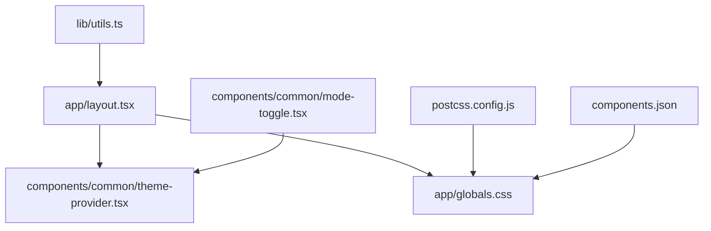
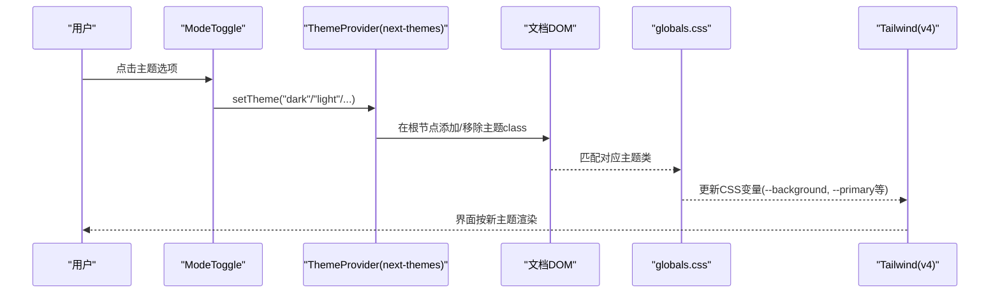
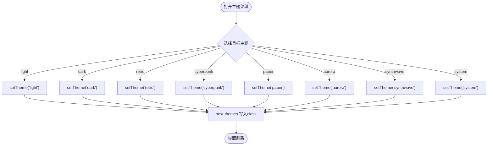
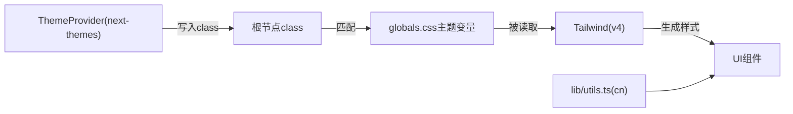

# 主题配置

<cite>
**本文引用的文件**
- [app/globals.css](file://app/globals.css)
- [app/layout.tsx](file://app/layout.tsx)
- [components/common/mode-toggle.tsx](file://components/common/mode-toggle.tsx)
- [components/common/theme-provider.tsx](file://components/common/theme-provider.tsx)
- [components/common/icons.tsx](file://components/common/icons.tsx)
- [postcss.config.js](file://postcss.config.js)
- [components.json](file://components.json)
- [lib/utils.ts](file://lib/utils.ts)
</cite>

## 目录
1. [简介](#简介)
2. [项目结构](#项目结构)
3. [核心组件](#核心组件)
4. [架构总览](#架构总览)
5. [详细组件分析](#详细组件分析)
6. [依赖关系分析](#依赖关系分析)
7. [性能考量](#性能考量)
8. [故障排查指南](#故障排查指南)
9. [结论](#结论)
10. [附录](#附录)

## 简介
本文件面向希望理解并扩展本项目“主题系统”的开发者，重点说明：
- 如何使用 CSS 变量实现多主题（亮色、暗色、复古、赛博朋克、纸张、极光、合成波等）
- 主题切换在 Next.js + Tailwind v4 环境中的工作机制
- 如何新增主题、自定义颜色方案、修改字体样式
- 如何集成暗色模式与高对比度等特殊主题

该项目采用 Tailwind v4 的 CSS 优先方式，通过 CSS 变量集中管理主题色彩、圆角、动画时长与缓动等设计令牌；使用 next-themes 提供主题状态管理与持久化；通过在全局根节点添加 class 来切换主题。

## 项目结构
主题相关的关键位置与职责：
- app/globals.css：定义 Tailwind 主题变量、断点容器、各主题的 CSS 变量集合以及基础样式层
- app/layout.tsx：引入全局样式，包裹 ThemeProvider，声明可用主题列表与默认行为
- components/common/mode-toggle.tsx：主题切换下拉菜单，调用 setTheme 切换当前主题
- components/common/theme-provider.tsx：next-themes 的轻量封装
- postcss.config.js：启用 @tailwindcss/postcss（Tailwind v4）
- components.json：Shadcn UI 配置，指明 CSS 入口与启用 CSS 变量
- lib/utils.ts：clsx + tailwind-merge 的工具函数 cn，用于合并类名

图表来源
- [app/layout.tsx:105-133](file://app/layout.tsx#L105-L133)
- [components/common/theme-provider.tsx:5-7](file://components/common/theme-provider.tsx#L5-L7)
- [app/globals.css:1-4](file://app/globals.css#L1-L4)
- [postcss.config.js:1-5](file://postcss.config.js#L1-L5)
- [components.json:6-11](file://components.json#L6-L11)
- [lib/utils.ts:4-6](file://lib/utils.ts#L4-L6)

章节来源
- [app/layout.tsx:1-145](file://app/layout.tsx#L1-L145)
- [app/globals.css:1-333](file://app/globals.css#L1-L333)
- [postcss.config.js:1-5](file://postcss.config.js#L1-L5)
- [components.json:1-17](file://components.json#L1-L17)
- [lib/utils.ts:1-25](file://lib/utils.ts#L1-L25)

## 核心组件
- 主题提供者（ThemeProvider）：基于 next-themes 的封装，负责将主题状态注入应用并提供 setTheme/getTheme 能力
- 主题切换器（ModeToggle）：下拉菜单，调用 setTheme 切换 light/dark/retro/cyberpunk/paper/aurora/synthwave/system
- 全局样式（globals.css）：定义 @theme inline 映射到 CSS 变量，并在 :root 与各主题类下设置具体变量值；同时定义断点容器与基础层样式
- PostCSS/Tailwind 配置：启用 Tailwind v4 的 @import 方式，无需传统 tailwind.config.js
- Shadcn 配置：指定 CSS 入口为 app/globals.css，并开启 CSS 变量模式

章节来源
- [components/common/theme-provider.tsx:1-8](file://components/common/theme-provider.tsx#L1-L8)
- [components/common/mode-toggle.tsx:1-71](file://components/common/mode-toggle.tsx#L1-L71)
- [app/globals.css:1-333](file://app/globals.css#L1-L333)
- [postcss.config.js:1-5](file://postcss.config.js#L1-L5)
- [components.json:1-17](file://components.json#L1-L17)

## 架构总览
主题系统的运行流程如下：
- 应用启动时，layout.tsx 包裹 ThemeProvider，并声明 themes 列表与默认 theme=system
- 用户通过 ModeToggle 选择主题，调用 setTheme("dark"|"light"|...| "system")
- next-themes 根据 attribute="class" 在 <html> 或 <body> 上添加对应 class（如 .dark、.retro、.cyberpunk 等）
- globals.css 中各主题类覆盖 CSS 变量，Tailwind 通过 @theme inline 将 --color-* 映射到这些变量，从而驱动所有使用 color-* 语义类的组件自动换肤
- 字体通过 CSS 变量 --font-inter、--font-cal-sans 注入，配合 Tailwind 的 font-sans/font-heading 使用

图表来源
- [components/common/mode-toggle.tsx:15-68](file://components/common/mode-toggle.tsx#L15-L68)
- [components/common/theme-provider.tsx:5-7](file://components/common/theme-provider.tsx#L5-L7)
- [app/layout.tsx:105-133](file://app/layout.tsx#L105-L133)
- [app/globals.css:28-333](file://app/globals.css#L28-L333)

## 详细组件分析

### 主题变量与颜色方案
- 颜色体系：通过 CSS 变量统一管理，包括背景、前景、主色、次色、强调、破坏、蒙层、弹出框、卡片、边框、输入、焦点环等
- 变量映射：@theme inline 将 --color-* 映射到 hsl(var(--xxx))，使 Tailwind 的 color-* 工具类直接读取 CSS 变量
- 主题集合：
  - :root 默认亮色主题
  - .dark 暗色主题
  - .retro 复古主题
  - .cyberpunk 赛博朋克主题
  - .paper 纸张主题
  - .aurora 极光主题
  - .synthwave 合成波主题
- 其他设计令牌：--radius 控制圆角，--d 与 --e 控制动画时长与缓动

章节来源
- [app/globals.css:28-333](file://app/globals.css#L28-L333)

### 字体配置
- 字体变量：--font-inter、--font-cal-sans 由 layout.tsx 通过 next/font 注入为 CSS 变量
- 字体族：在 @theme inline 中定义 --font-sans 与 --font-heading，引用上述变量并回退到系统字体
- 使用方式：在 body 上应用 font-sans，标题可使用 font-heading

章节来源
- [app/layout.tsx:15-24](file://app/layout.tsx#L15-L24)
- [app/globals.css:56-59](file://app/globals.css#L56-L59)

### 断点与容器
- 自定义容器：在 globals.css 中通过 @utility container 定义响应式宽度，内置多个 min-width 断点
- 断点使用：可直接在组件中使用 Tailwind 的响应式前缀（如 md:、lg:），或在自定义容器内使用媒体查询

章节来源
- [app/globals.css:6-26](file://app/globals.css#L6-L26)

### 主题切换机制
- 主题开关：ModeToggle 提供下拉菜单，调用 setTheme 切换主题
- 图标联动：按钮内的图标根据当前主题显示对应图标（利用 Tailwind 条件类）
- 主题列表：layout.tsx 中声明 themes 数组，包含 light、dark、retro、cyberpunk、paper、aurora、synthwave，并支持 system 跟随系统

图表来源
- [components/common/mode-toggle.tsx:15-68](file://components/common/mode-toggle.tsx#L15-L68)
- [app/layout.tsx:115-128](file://app/layout.tsx#L115-L128)

章节来源
- [components/common/mode-toggle.tsx:1-71](file://components/common/mode-toggle.tsx#L1-L71)
- [app/layout.tsx:105-133](file://app/layout.tsx#L105-L133)

### 特殊主题集成（暗色模式、高对比度）
- 暗色模式：已内置 .dark 主题，可通过 ModeToggle 切换；也可通过系统偏好自动跟随（defaultTheme="system"）
- 高对比度模式：可在 globals.css 中新增一个主题类（例如 .high-contrast），覆盖关键变量（如 --foreground、--border、--ring 等）以增强对比度；随后在 layout.tsx 的 themes 中添加该主题，并在 ModeToggle 中添加对应菜单项

章节来源
- [app/globals.css:124-157](file://app/globals.css#L124-L157)
- [app/layout.tsx:115-128](file://app/layout.tsx#L115-L128)
- [components/common/mode-toggle.tsx:32-67](file://components/common/mode-toggle.tsx#L32-L67)

## 依赖关系分析
- next-themes：提供主题状态与持久化，attribute="class" 模式下向根节点写入主题 class
- Tailwind v4：通过 @import "tailwindcss" 与 @theme inline 使用 CSS 变量驱动主题，不再需要 tailwind.config.js
- Shadcn UI：通过 components.json 指定 CSS 入口与启用 CSS 变量，确保组件样式与主题变量一致
- clsx + tailwind-merge：在 lib/utils.ts 中提供 cn 工具，安全合并类名，避免冲突

图表来源
- [components/common/theme-provider.tsx:5-7](file://components/common/theme-provider.tsx#L5-L7)
- [app/globals.css:28-333](file://app/globals.css#L28-L333)
- [postcss.config.js:1-5](file://postcss.config.js#L1-L5)
- [lib/utils.ts:4-6](file://lib/utils.ts#L4-L6)

章节来源
- [postcss.config.js:1-5](file://postcss.config.js#L1-L5)
- [components.json:6-11](file://components.json#L6-L11)
- [lib/utils.ts:1-25](file://lib/utils.ts#L1-L25)

## 性能考量
- 主题切换仅更新少量 CSS 变量，浏览器重绘开销低
- 使用 HSL 变量可保证明暗主题间平滑过渡
- 动画时长与缓动通过 --d 与 --e 统一控制，便于全局优化
- 避免在主题类中重复定义大量样式，尽量复用语义化颜色与字体变量

[本节为通用指导，不直接分析具体文件]

## 故障排查指南
- 主题未生效
  - 检查 layout.tsx 是否包裹了 ThemeProvider，且 themes 列表包含目标主题
  - 确认 ModeToggle 调用了正确的 setTheme 值
- 颜色异常
  - 检查 globals.css 中对应主题类是否覆盖了必要的 CSS 变量（如 --background、--foreground、--primary 等）
  - 确认 @theme inline 已将 --color-* 映射到 hsl(var(--xxx))
- 字体未加载
  - 确认 layout.tsx 中通过 next/font 注入了 --font-inter 与 --font-cal-sans 变量
  - 检查 body 是否使用了 font-sans 或相应字体类
- 构建或样式问题
  - 确认 postcss.config.js 启用了 @tailwindcss/postcss
  - 确认 components.json 的 css 指向 app/globals.css 且启用 cssVariables

章节来源
- [app/layout.tsx:105-133](file://app/layout.tsx#L105-L133)
- [components/common/mode-toggle.tsx:15-68](file://components/common/mode-toggle.tsx#L15-L68)
- [app/globals.css:28-333](file://app/globals.css#L28-L333)
- [postcss.config.js:1-5](file://postcss.config.js#L1-L5)
- [components.json:6-11](file://components.json#L6-L11)

## 结论
本项目通过 CSS 变量 + Tailwind v4 + next-themes 实现了灵活、可扩展的多主题系统。新增主题只需在 globals.css 中定义一组变量，并在 layout.tsx 的 themes 中注册即可；切换逻辑与 UI 已在 mode-toggle 中完备实现。借助统一的字体与动画变量，整体主题体验一致且易于维护。

[本节为总结性内容，不直接分析具体文件]

## 附录

### 如何添加新主题
- 在 globals.css 中新增一个主题类（例如 .ocean），覆盖所有必要变量（背景、前景、主色、次色、强调、破坏、蒙层、弹出框、卡片、边框、输入、焦点环、圆角、动画参数）
- 在 app/layout.tsx 的 themes 数组中添加新主题名称
- 在 components/common/mode-toggle.tsx 中添加对应的菜单项与图标

章节来源
- [app/globals.css:159-333](file://app/globals.css#L159-L333)
- [app/layout.tsx:115-128](file://app/layout.tsx#L115-L128)
- [components/common/mode-toggle.tsx:32-67](file://components/common/mode-toggle.tsx#L32-L67)

### 如何自定义颜色方案
- 调整 globals.css 中对应主题类的 CSS 变量值（HSL 格式）
- 如需新增语义色，可在 @theme inline 中新增 --color-* 映射，并在组件中使用新的 color-* 类

章节来源
- [app/globals.css:28-333](file://app/globals.css#L28-L333)

### 如何修改字体样式
- 在 app/layout.tsx 中通过 next/font 注入新的字体变量（例如 --font-my-font）
- 在 globals.css 的 @theme inline 中定义 --font-* 族，引用新变量
- 在组件中通过 font-* 类使用新字体

章节来源
- [app/layout.tsx:15-24](file://app/layout.tsx#L15-L24)
- [app/globals.css:56-59](file://app/globals.css#L56-L59)

### 暗色模式与高对比度模式集成要点
- 暗色模式：直接使用 .dark 主题或通过 system 跟随系统
- 高对比度模式：新增主题类，提高前景与边框对比度，降低背景亮度，确保可读性与可达性

章节来源
- [app/globals.css:124-157](file://app/globals.css#L124-L157)
- [app/layout.tsx:115-128](file://app/layout.tsx#L115-L128)