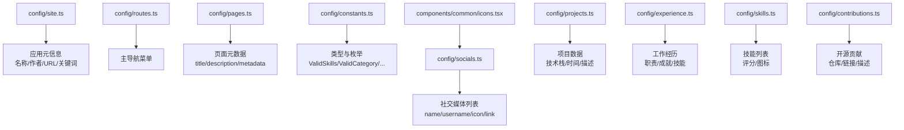
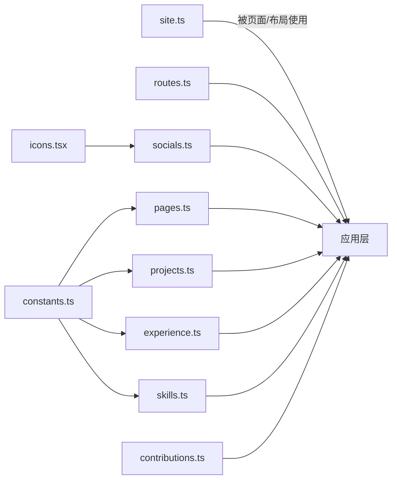
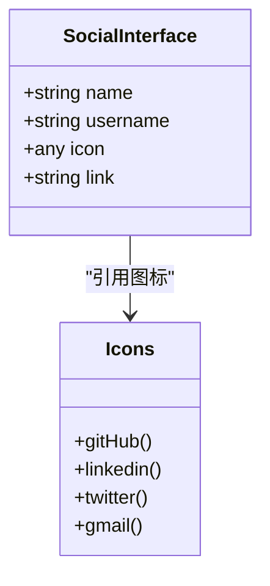
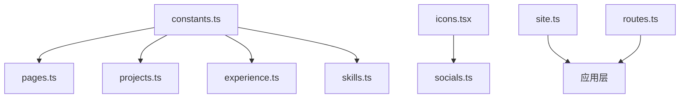

# 常量配置

<cite>
**本文引用的文件**
- [config/socials.ts](file://config/socials.ts)
- [config/constants.ts](file://config/constants.ts)
- [config/site.ts](file://config/site.ts)
- [config/routes.ts](file://config/routes.ts)
- [config/pages.ts](file://config/pages.ts)
- [config/projects.ts](file://config/projects.ts)
- [config/experience.ts](file://config/experience.ts)
- [config/skills.ts](file://config/skills.ts)
- [config/contributions.ts](file://config/contributions.ts)
- [components/common/icons.tsx](file://components/common/icons.tsx)
</cite>

## 目录
1. [简介](#简介)
2. [项目结构](#项目结构)
3. [核心组件](#核心组件)
4. [架构总览](#架构总览)
5. [详细组件分析](#详细组件分析)
6. [依赖关系分析](#依赖关系分析)
7. [性能与可维护性建议](#性能与可维护性建议)
8. [故障排查指南](#故障排查指南)
9. [结论](#结论)
10. [附录：扩展指南](#附录：扩展指南)

## 简介
本文件为项目的“常量配置”文档，聚焦于全局常量、站点元信息、路由与页面元数据、以及社交媒体的配置结构与使用方式。重点说明 socials.ts 中社交媒体配置的结构（GitHub、Twitter、LinkedIn、Gmail 等），并给出如何添加新平台、修改默认值、扩展常量结构的实践指导。同时提供类型安全的最佳实践，帮助你在不破坏现有类型约束的前提下安全地扩展配置。

## 项目结构
本项目将“配置型常量”集中在 config 目录下，按主题拆分：
- site.ts：站点基础信息与 SEO/OG 相关的全局配置
- routes.ts：主导航路由配置
- pages.ts：各页面的标题、描述与元数据
- constants.ts：全局枚举与类型（技能、分类、经验类型、页面键）
- socials.ts：社交媒体链接与图标映射
- projects.ts / experience.ts / skills.ts / contributions.ts：业务内容型常量（项目、经历、技能、开源贡献）

图表来源
- [config/site.ts:1-41](file://config/site.ts#L1-L41)
- [config/routes.ts:1-29](file://config/routes.ts#L1-L29)
- [config/pages.ts:1-86](file://config/pages.ts#L1-L86)
- [config/constants.ts:1-85](file://config/constants.ts#L1-L85)
- [config/socials.ts:1-36](file://config/socials.ts#L1-L36)
- [components/common/icons.tsx:71-180](file://components/common/icons.tsx#L71-L180)
- [config/projects.ts:1-596](file://config/projects.ts#L1-L596)
- [config/experience.ts:1-93](file://config/experience.ts#L1-L93)
- [config/skills.ts:1-166](file://config/skills.ts#L1-L166)
- [config/contributions.ts:1-48](file://config/contributions.ts#L1-L48)

章节来源
- [config/site.ts:1-41](file://config/site.ts#L1-L41)
- [config/routes.ts:1-29](file://config/routes.ts#L1-L29)
- [config/pages.ts:1-86](file://config/pages.ts#L1-L86)
- [config/constants.ts:1-85](file://config/constants.ts#L1-L85)
- [config/socials.ts:1-36](file://config/socials.ts#L1-L36)
- [components/common/icons.tsx:71-180](file://components/common/icons.tsx#L71-L180)

## 核心组件
本节概述各配置文件的作用与关键要点：
- site.ts：站点名称、作者、域名、SEO 关键词、OG 图片、图标与模板仓库链接等。用于生成页面标题、描述、Open Graph 等元信息。
- routes.ts：主导航项的标题与路由路径，集中管理顶部导航。
- pages.ts：每个页面的 title、description 与 metadata.title/description，配合 Next.js 的页面元数据能力。
- constants.ts：定义 ValidSkills、ValidCategory、ValidExpType、ValidPages 等联合类型，确保内容与展示层的一致性。
- socials.ts：统一的社交媒体数组，包含 name、username、icon、link；图标来自 icons.tsx。
- projects.ts / experience.ts / skills.ts / contributions.ts：业务内容型常量，统一数据结构，便于渲染与筛选。

章节来源
- [config/site.ts:1-41](file://config/site.ts#L1-L41)
- [config/routes.ts:1-29](file://config/routes.ts#L1-L29)
- [config/pages.ts:1-86](file://config/pages.ts#L1-L86)
- [config/constants.ts:1-85](file://config/constants.ts#L1-L85)
- [config/socials.ts:1-36](file://config/socials.ts#L1-L36)
- [config/projects.ts:1-596](file://config/projects.ts#L1-L596)
- [config/experience.ts:1-93](file://config/experience.ts#L1-L93)
- [config/skills.ts:1-166](file://config/skills.ts#L1-L166)
- [config/contributions.ts:1-48](file://config/contributions.ts#L1-L48)

## 架构总览
下图展示了“配置常量”在应用中的角色与依赖关系：socials.ts 依赖 icons.tsx 提供的图标；pages.ts 依赖 constants.ts 的 ValidPages；projects.ts/experience.ts/skills.ts 依赖 constants.ts 的 ValidSkills/ValidCategory/ValidExpType；site.ts 作为站点级元数据被多处消费。

图表来源
- [config/socials.ts:1-36](file://config/socials.ts#L1-L36)
- [components/common/icons.tsx:71-180](file://components/common/icons.tsx#L71-L180)
- [config/pages.ts:1-86](file://config/pages.ts#L1-L86)
- [config/constants.ts:1-85](file://config/constants.ts#L1-L85)
- [config/projects.ts:1-596](file://config/projects.ts#L1-L596)
- [config/experience.ts:1-93](file://config/experience.ts#L1-L93)
- [config/skills.ts:1-166](file://config/skills.ts#L1-L166)
- [config/contributions.ts:1-48](file://config/contributions.ts#L1-L48)
- [config/site.ts:1-41](file://config/site.ts#L1-L41)
- [config/routes.ts:1-29](file://config/routes.ts#L1-L29)

## 详细组件分析

### 社交媒体配置（socials.ts）
- 结构说明
  - 每条记录包含：name（平台名）、username（显示用户名或邮箱前缀）、icon（图标组件引用）、link（跳转链接）。
  - 图标来源于 components/common/icons.tsx，例如 GitHub、LinkedIn、Twitter、Gmail 等。
- 当前平台
  - GitHub、LinkedIn、Twitter、Gmail。
- 使用方式
  - 通过导出数组在 UI 层遍历渲染，统一样式与行为。
- 类型安全
  - 使用接口 SocialInterface 约束字段，避免遗漏必填属性。

图表来源
- [config/socials.ts:3-35](file://config/socials.ts#L3-L35)
- [components/common/icons.tsx:127-148](file://components/common/icons.tsx#L127-L148)

章节来源
- [config/socials.ts:1-36](file://config/socials.ts#L1-L36)
- [components/common/icons.tsx:71-180](file://components/common/icons.tsx#L71-L180)

### 站点配置（site.ts）
- 作用：集中站点名称、作者、域名、SEO 关键词、OG 图片、图标与模板仓库链接。
- 典型用途：页面标题、描述、Open Graph 标签、favicon、logo 等。
- 扩展建议：如需新增第三方平台链接，可在 links 对象下新增键值对，并在 UI 层按需渲染。

章节来源
- [config/site.ts:1-41](file://config/site.ts#L1-L41)

### 路由配置（routes.ts）
- 作用：集中主导航项的标题与 href。
- 扩展建议：新增页面时在此处添加条目，保持导航与路由一致。

章节来源
- [config/routes.ts:1-29](file://config/routes.ts#L1-L29)

### 页面元数据（pages.ts）
- 作用：为每个页面提供 title、description、metadata.title/description。
- 类型约束：基于 constants.ts 的 ValidPages，保证键名一致性。
- 扩展建议：新增页面需在 ValidPages 中添加键，并在 pagesConfig 中补充对应元数据。

章节来源
- [config/pages.ts:1-86](file://config/pages.ts#L1-L86)
- [config/constants.ts:76-85](file://config/constants.ts#L76-L85)

### 全局类型与枚举（constants.ts）
- ValidSkills：前端/后端/工具链等技术栈集合，供项目、经历、技能等模块复用。
- ValidCategory：项目分类（如 Full Stack、Frontend、Backend 等）。
- ValidExpType：经验类型（Personal/Professional）。
- ValidPages：页面键集合，约束 pages.ts 的键名。
- 扩展建议：新增技能或分类时，务必更新联合类型，以维持类型安全。

章节来源
- [config/constants.ts:1-85](file://config/constants.ts#L1-L85)

### 项目数据（projects.ts）
- 结构：id、type、companyName、category、shortDescription、websiteLink、githubLink、techStack、时间范围、公司 Logo、详细描述、页面截图信息等。
- 类型约束：使用 ValidExpType、ValidCategory、ValidSkills 保证一致性。
- 扩展建议：新增项目时遵循相同结构，并确保 techStack 中的技能属于 ValidSkills。

章节来源
- [config/projects.ts:1-596](file://config/projects.ts#L1-L596)
- [config/constants.ts:1-85](file://config/constants.ts#L1-L85)

### 工作经历（experience.ts）
- 结构：id、position、company、location、时间、描述、成就、skills、公司链接与 Logo。
- 类型约束：skills 使用 ValidSkills。
- 扩展建议：新增经历时保持字段完整，尤其是时间与技能列表。

章节来源
- [config/experience.ts:1-93](file://config/experience.ts#L1-L93)
- [config/constants.ts:1-85](file://config/constants.ts#L1-L85)

### 技能列表（skills.ts）
- 结构：name、description、rating、icon。
- 排序与精选：导出排序后的 skills 与 featuredSkills（前若干项）。
- 类型约束：icon 来自 icons.tsx。
- 扩展建议：新增技能时补充图标与描述，合理设置 rating。

章节来源
- [config/skills.ts:1-166](file://config/skills.ts#L1-L166)
- [components/common/icons.tsx:71-180](file://components/common/icons.tsx#L71-L180)

### 开源贡献（contributions.ts）
- 结构：repo、contibutionDescription、repoOwner、link。
- 精选：导出 featuredContributions（前若干项）。
- 扩展建议：新增贡献条目时保持链接有效，描述简洁明确。

章节来源
- [config/contributions.ts:1-48](file://config/contributions.ts#L1-L48)

## 依赖关系分析
- socials.ts 依赖 icons.tsx 的图标集合。
- pages.ts 依赖 constants.ts 的 ValidPages。
- projects.ts/experience.ts/skills.ts 依赖 constants.ts 的 ValidSkills/ValidCategory/ValidExpType。
- site.ts 独立提供站点级元数据，被布局/页面广泛消费。
- routes.ts 独立提供导航配置，被导航组件消费。

图表来源
- [config/constants.ts:1-85](file://config/constants.ts#L1-L85)
- [config/pages.ts:1-86](file://config/pages.ts#L1-L86)
- [config/projects.ts:1-596](file://config/projects.ts#L1-L596)
- [config/experience.ts:1-93](file://config/experience.ts#L1-L93)
- [config/skills.ts:1-166](file://config/skills.ts#L1-L166)
- [config/socials.ts:1-36](file://config/socials.ts#L1-L36)
- [components/common/icons.tsx:71-180](file://components/common/icons.tsx#L71-L180)
- [config/site.ts:1-41](file://config/site.ts#L1-L41)
- [config/routes.ts:1-29](file://config/routes.ts#L1-L29)

## 性能与可维护性建议
- 集中配置：所有静态配置集中在 config 目录，便于查找与维护。
- 类型优先：优先使用 TypeScript 联合类型与接口约束，减少运行时错误。
- 图标统一管理：通过 icons.tsx 集中管理图标，避免散落的 SVG 或字符串。
- 最小化变更：新增平台或页面时，尽量只改配置，不改业务逻辑。
- 分页与精选：对大列表（如项目、技能、贡献）提供精选切片，提升首屏性能。

[本节为通用建议，无需特定文件来源]

## 故障排查指南
- 社交媒体无法显示图标
  - 检查 socials.ts 中 icon 是否指向 icons.tsx 的有效键。
  - 确认 icons.tsx 已正确导入并导出对应图标。
- 页面标题/描述未生效
  - 检查 pages.ts 中对应 ValidPages 键是否存在且元数据完整。
  - 确认站点配置 site.ts 的 name、authorName、url、keywords 等是否正确。
- 技能/分类类型报错
  - 若新增技能或分类，需同步更新 constants.ts 的联合类型，否则会导致类型不匹配。
- 路由导航无效
  - 检查 routes.ts 中的 href 是否与页面路由一致。

章节来源
- [config/socials.ts:1-36](file://config/socials.ts#L1-L36)
- [components/common/icons.tsx:71-180](file://components/common/icons.tsx#L71-L180)
- [config/pages.ts:1-86](file://config/pages.ts#L1-L86)
- [config/site.ts:1-41](file://config/site.ts#L1-L41)
- [config/constants.ts:1-85](file://config/constants.ts#L1-L85)
- [config/routes.ts:1-29](file://config/routes.ts#L1-L29)

## 结论
本项目通过集中化的配置与严格的类型系统，实现了良好的可维护性与可扩展性。socials.ts 提供了清晰的社交媒体配置结构，结合 icons.tsx 的图标管理，使得新增平台变得简单而安全。其他全局常量（站点、路由、页面元数据、技能/分类/经验类型）共同构成了稳定的配置基座。遵循本文的扩展指南与最佳实践，可以在不破坏类型约束的前提下持续演进项目配置。

[本节为总结，无需特定文件来源]

## 附录：扩展指南

### 添加新社交媒体平台
步骤：
1. 在 icons.tsx 中新增或复用图标键（如新增一个平台图标）。
2. 在 socials.ts 中新增一条记录，包含 name、username、icon、link。
3. 确保 link 格式正确（https 或 mailto）。
4. 在 UI 层无需改动，即可自动渲染。

参考路径
- [config/socials.ts:10-35](file://config/socials.ts#L10-L35)
- [components/common/icons.tsx:71-180](file://components/common/icons.tsx#L71-L180)

### 修改默认值
- 站点信息：编辑 site.ts 中的 name、authorName、url、keywords、ogImage、iconIco、logoIcon、links 等。
- 导航与页面：编辑 routes.ts 与 pages.ts，保持键名与路由一致。
- 技能/分类/经验类型：如需新增，先更新 constants.ts 的联合类型，再在相应配置中使用。

参考路径
- [config/site.ts:1-41](file://config/site.ts#L1-L41)
- [config/routes.ts:1-29](file://config/routes.ts#L1-L29)
- [config/pages.ts:1-86](file://config/pages.ts#L1-L86)
- [config/constants.ts:1-85](file://config/constants.ts#L1-L85)

### 扩展常量结构
- 新增技能：在 constants.ts 的 ValidSkills 中添加新技能，然后在 skills.ts、projects.ts、experience.ts 中合理使用。
- 新增分类：在 constants.ts 的 ValidCategory 中添加新分类，并在 projects.ts 中引用。
- 新增页面：在 constants.ts 的 ValidPages 中添加新键，并在 pages.ts 中补充元数据。

参考路径
- [config/constants.ts:1-85](file://config/constants.ts#L1-L85)
- [config/skills.ts:1-166](file://config/skills.ts#L1-L166)
- [config/projects.ts:1-596](file://config/projects.ts#L1-L596)
- [config/experience.ts:1-93](file://config/experience.ts#L1-L93)
- [config/pages.ts:1-86](file://config/pages.ts#L1-L86)

### 类型安全的最佳实践
- 始终使用接口与联合类型约束配置，避免裸字符串或任意对象。
- 新增枚举值后，立即在所有使用处进行类型校验。
- 对外暴露的配置尽量保持不可变（const），防止运行时意外修改。
- 图标与链接分离：图标由 icons.tsx 管理，链接由配置集中管理，降低耦合。

[本节为通用实践，无需特定文件来源]