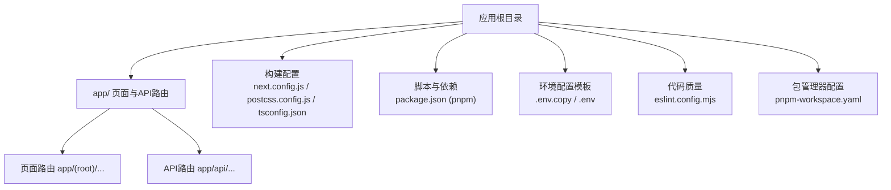
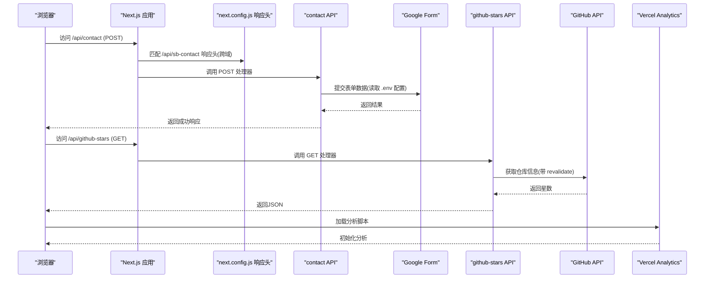
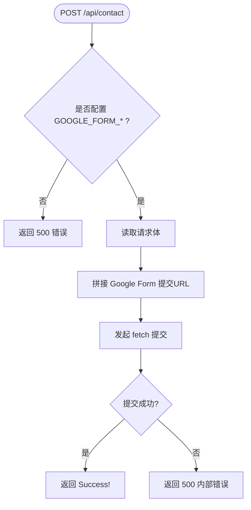
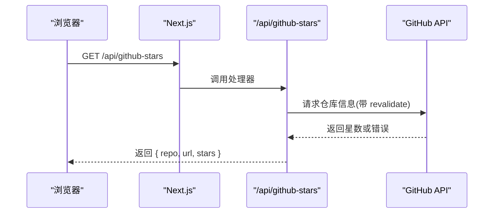
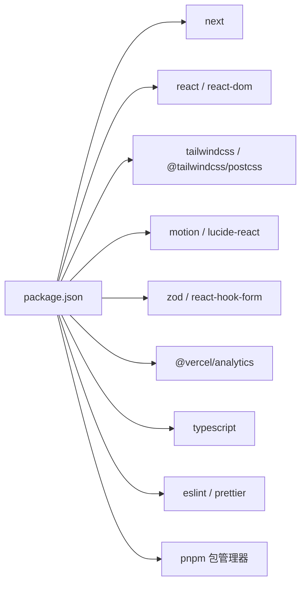

# 构建部署配置

<cite>
**本文引用的文件**
- [next.config.js](file://next.config.js)
- [package.json](file://package.json)
- [pnpm-workspace.yaml](file://pnpm-workspace.yaml)
- [pnpm-lock.yaml](file://pnpm-lock.yaml)
- [tsconfig.json](file://tsconfig.json)
- [postcss.config.js](file://postcss.config.js)
- [components.json](file://components.json)
- [app/api/contact/route.ts](file://app/api/contact/route.ts)
- [app/api/github-stars/route.ts](file://app/api/github-stars/route.ts)
- [.env.copy](file://.env.copy)
- [.env](file://.env)
- [eslint.config.mjs](file://eslint.config.mjs)
- [README.md](file://README.md)
- [components/common/analytics.tsx](file://components/common/analytics.tsx)
</cite>

## 更新摘要
**所做更改**
- 更新了包管理器从npm迁移到pnpm的配置说明
- 添加了pnpm工作区配置和依赖管理策略
- 更新了Google Analytics集成组件的说明
- 修正了环境变量配置和环境变量管理方式
- 更新了脚本命令和依赖管理最佳实践

## 目录
1. [简介](#简介)
2. [项目结构](#项目结构)
3. [核心组件](#核心组件)
4. [架构总览](#架构总览)
5. [详细组件分析](#详细组件分析)
6. [依赖分析](#依赖分析)
7. [性能考虑](#性能考虑)
8. [故障排查指南](#故障排查指南)
9. [结论](#结论)
10. [附录](#附录)

## 简介
本文件面向Next.js应用的构建与部署，聚焦以下目标：
- 解读 next.config.js 中的性能优化选项、请求头设置与环境变量使用方式。
- 说明 pnpm 包管理器配置、package.json 脚本命令与依赖管理策略。
- 梳理 TypeScript 配置、代码分割策略、静态资源处理等构建相关选项。
- 提供 Vercel 部署与自定义服务器部署的配置指南，以及环境变量设置方法。
- 结合 API 路由（Serverless）说明服务端逻辑与缓存策略。
- 介绍 Google Analytics 集成的现代化实现方案。

## 项目结构
该仓库采用 Next.js App Router 组织页面与API路由，配合 Tailwind CSS、shadcn/ui、TypeScript 与 ESLint/Prettier 工具链。关键构建与运行入口如下：
- 应用入口与路由：app/ 目录下的页面与 API 路由。
- 构建与运行时配置：next.config.js、postcss.config.js、tsconfig.json、eslint.config.mjs。
- 脚本与依赖：package.json（使用 pnpm 包管理器）。
- 环境变量模板：.env.copy 和 .env。

**图表来源**
- [next.config.js:1-25](file://next.config.js#L1-L25)
- [postcss.config.js:1-6](file://postcss.config.js#L1-L6)
- [tsconfig.json:1-43](file://tsconfig.json#L1-L43)
- [package.json:1-60](file://package.json#L1-L60)
- [pnpm-workspace.yaml:1-8](file://pnpm-workspace.yaml#L1-L8)
- [.env.copy:1-12](file://.env.copy#L1-L12)
- [eslint.config.mjs:1-24](file://eslint.config.mjs#L1-L24)

**章节来源**
- [README.md:32-43](file://README.md#L32-L43)
- [package.json:1-11](file://package.json#L1-L11)

## 核心组件
- 构建与运行时配置
  - next.config.js：定义全局响应头（CORS），用于特定API路径。
  - postcss.config.js：启用 Tailwind CSS v4 PostCSS 插件。
  - tsconfig.json：TypeScript 编译选项、模块解析、路径别名、增量编译等。
- 脚本与依赖管理
  - package.json：开发、构建、启动、Lint 脚本；生产与开发依赖；pnpm 包管理器配置。
  - pnpm-workspace.yaml：pnpm 工作区配置，允许构建规则和依赖版本管理。
- 环境变量
  - .env.copy：示例包含 Google Form 集成字段、Google Analytics 测量ID、简历链接等。
  - .env：本地环境变量配置。
- API 路由
  - app/api/contact/route.ts：接收表单数据并转发至 Google Form。
  - app/api/github-stars/route.ts：拉取 GitHub 仓库星数并启用服务端缓存。
- 分析集成
  - components/common/analytics.tsx：基于 @vercel/analytics 的现代化分析组件。

**章节来源**
- [next.config.js:3-21](file://next.config.js#L3-L21)
- [postcss.config.js:1-6](file://postcss.config.js#L1-L6)
- [tsconfig.json:1-43](file://tsconfig.json#L1-L43)
- [package.json:1-60](file://package.json#L1-L60)
- [pnpm-workspace.yaml:1-8](file://pnpm-workspace.yaml#L1-L8)
- [.env.copy:1-12](file://.env.copy#L1-L12)
- [.env:1-13](file://.env#L1-L13)
- [app/api/contact/route.ts:1-30](file://app/api/contact/route.ts#L1-L30)
- [app/api/github-stars/route.ts:1-44](file://app/api/github-stars/route.ts#L1-L44)
- [components/common/analytics.tsx:1-8](file://components/common/analytics.tsx#L1-L8)

## 架构总览
下图展示从浏览器到API路由的调用流程，以及环境变量在构建与运行时的作用点。

**图表来源**
- [next.config.js:3-21](file://next.config.js#L3-L21)
- [app/api/contact/route.ts:3-29](file://app/api/contact/route.ts#L3-L29)
- [app/api/github-stars/route.ts:17-42](file://app/api/github-stars/route.ts#L17-L42)
- [components/common/analytics.tsx:3-7](file://components/common/analytics.tsx#L3-L7)
- [.env.copy:1-12](file://.env.copy#L1-L12)

## 详细组件分析

### next.config.js 构建与请求头
- 功能要点
  - 通过 headers() 为指定路径添加 CORS 响应头，便于跨域访问受保护的API或第三方服务。
  - 当前仅对 /api/sb-contact 设置了允许的方法、头部与凭据。
- 建议
  - 若前端与后端域名不同，确保前端请求路径与此处 source 一致。
  - 如需更细粒度控制，可按需扩展 source 匹配规则。

**章节来源**
- [next.config.js:3-21](file://next.config.js#L3-L21)

### pnpm 包管理器配置与依赖管理
- 包管理器配置
  - package.json 中声明 "packageManager": "pnpm@10.34.5"，确保团队使用统一版本。
  - pnpm-workspace.yaml 配置了构建规则和依赖版本管理。
- 脚本命令
  - dev：启动开发服务器。
  - build：执行生产构建。
  - start：启动生产服务器。
  - lint：执行 ESLint 检查。
- 依赖管理
  - 生产依赖包括 Next.js、React、Tailwind、shadcn/ui 生态、动画库、表单与校验库等。
  - 开发依赖包括 TypeScript、ESLint、Prettier 及类型声明。
- 优势
  - pnpm 提供更快的安装速度和更严格的依赖管理。
  - 支持工作区模式，适合大型项目或多包管理。

**章节来源**
- [package.json:1-11](file://package.json#L1-L11)
- [package.json:12-58](file://package.json#L12-L58)
- [pnpm-workspace.yaml:1-8](file://pnpm-workspace.yaml#L1-L8)

### TypeScript 配置与路径别名
- 编译目标与模块
  - target: ES2017，lib 包含 DOM、迭代器与最新特性。
  - module: esnext，moduleResolution: bundler，适配现代打包器。
- 严格模式与增量
  - strict: true，forceConsistentCasingInFileNames: true。
  - incremental: true，提升二次构建速度。
- JSX 与插件
  - jsx: react-jsx，启用 React 17+ 的新 JSX 转换。
  - plugins: next，集成 Next.js 类型生成与编译增强。
- 路径别名
  - @/* -> ./*，简化导入路径。
- 建议
  - 保持 noEmit: true，由 Next.js 负责输出。
  - 在大型项目中开启 isolatedModules 以加速类型检查。

**章节来源**
- [tsconfig.json:1-43](file://tsconfig.json#L1-L43)

### PostCSS 与样式构建
- 使用 @tailwindcss/postcss 插件，适配 Tailwind CSS v4。
- 建议
  - 将全局样式放入 app/globals.css，并在 components.json 中正确配置。
  - 按需引入样式，避免未用样式进入产物。

**章节来源**
- [postcss.config.js:1-6](file://postcss.config.js#L1-L6)
- [components.json:6-15](file://components.json#L6-L15)

### API 路由：联系表单
- 行为
  - 读取 .env 中的 Google Form 链接与各字段ID，将前端提交的 name、email、message、social 拼接后提交。
  - 未配置环境变量时返回 500 错误提示。
  - 异常捕获并返回 500。
- 安全与可用性
  - 敏感信息必须通过环境变量注入，不要硬编码。
  - 建议在外部增加限流与验证码，防止滥用。

**图表来源**
- [app/api/contact/route.ts:3-29](file://app/api/contact/route.ts#L3-L29)
- [.env.copy:1-6](file://.env.copy#L1-L6)

**章节来源**
- [app/api/contact/route.ts:1-30](file://app/api/contact/route.ts#L1-L30)
- [.env.copy:1-6](file://.env.copy#L1-L6)

### API 路由：GitHub 星数
- 行为
  - 从站点配置解析模板仓库地址，调用 GitHub API 获取 stargazers_count。
  - 使用 next.revalidate 实现服务端缓存（6小时）。
  - 失败或不可用时返回空值，保证接口健壮性。
- 建议
  - 如需更高并发或更低延迟，可在边缘节点缓存或使用 CDN。
  - 对 GitHub API 限制进行监控与降级处理。

**图表来源**
- [app/api/github-stars/route.ts:17-42](file://app/api/github-stars/route.ts#L17-L42)

**章节来源**
- [app/api/github-stars/route.ts:1-44](file://app/api/github-stars/route.ts#L1-L44)

### Google Analytics 集成
- 现代化实现
  - 使用 @vercel/analytics 包提供现代化的分析集成。
  - 通过 components/common/analytics.tsx 组件封装分析逻辑。
  - 支持客户端组件模式，确保分析脚本的正确加载。
- 配置管理
  - 通过 NEXT_PUBLIC_GOOGLE_MEASUREMENT_ID 环境变量配置测量ID。
  - 支持多环境配置，区分开发、预览和生产环境。
- 优势
  - 自动处理分析脚本的加载和优化。
  - 提供更好的性能和隐私保护。
  - 与 Vercel 平台深度集成。

**章节来源**
- [components/common/analytics.tsx:1-8](file://components/common/analytics.tsx#L1-L8)
- [.env.copy:8-9](file://.env.copy#L8-L9)
- [.env:8-9](file://.env#L8-L9)

### 环境变量配置
- 用途
  - 后端API密钥与端点（如 Google Form 链接与字段ID）。
  - 前端公开变量（NEXT_PUBLIC_ 前缀）用于客户端读取（如 Google Analytics 测量ID、简历链接）。
- 管理建议
  - 使用 .env.local 本地覆盖，.env 不入库。
  - 在 Vercel 等平台的环境变量面板中配置，区分开发/预览/生产。
  - 对 NEXT_PUBLIC_* 变量保持最小化暴露。
- 安全最佳实践
  - 敏感信息必须通过环境变量注入，不要硬编码。
  - 定期轮换API密钥和凭证。

**章节来源**
- [.env.copy:1-12](file://.env.copy#L1-L12)
- [.env:1-13](file://.env#L1-L13)
- [app/api/contact/route.ts:3-15](file://app/api/contact/route.ts#L3-L15)

### 代码分割与静态资源
- 代码分割
  - Next.js 默认按页面与组件自动进行代码分割与懒加载。
  - 合理使用动态导入与客户端组件（'use client'）可减少首屏体积。
- 静态资源
  - public/ 目录下的资源会被原样复制到构建产物，适合图片、字体、图标等。
  - 建议对大图片使用 Next Image 优化（如有需要）。
- 样式与主题
  - Tailwind CSS v4 + shadcn/ui 通过 PostCSS 处理，按需生成样式。

[本节为通用指导，不直接分析具体文件]

### 构建产物与忽略规则
- .gitignore 排除了 .next、out、build、node_modules、.env* 等，避免将构建产物与敏感信息提交到仓库。
- 特别注意包含了 pnpm 相关的忽略规则：.pnp、.pnp.js、pnpm-debug.log*。
- 建议在 CI 中清理缓存目录，确保干净构建。

**章节来源**
- [.gitignore:1-38](file://.gitignore#L1-L38)

## 依赖分析
- 运行时依赖
  - next、react、react-dom 为核心框架与UI运行时。
  - tailwindcss、@tailwindcss/postcss 负责样式构建。
  - motion、lucide-react 等提供动画与图标。
  - zod、react-hook-form 用于表单与校验。
  - @vercel/analytics 提供现代化的分析集成。
- 开发依赖
  - typescript、eslint、prettier 保障代码质量与一致性。
- 包管理器优势
  - pnpm 提供更快的安装速度和更严格的依赖管理。
  - 支持工作区模式和依赖版本锁定。
  - 减少磁盘空间占用和提高构建性能。

**图表来源**
- [package.json:12-58](file://package.json#L12-L58)

**章节来源**
- [package.json:12-58](file://package.json#L12-L58)

## 性能考虑
- 构建与渲染
  - 使用 Next.js 默认的增量构建与 Turbopack（开发体验更快）。
  - 合理拆分组件与页面，利用动态导入减少首屏体积。
  - pnpm 包管理器提供更快的依赖安装和构建速度。
- 缓存策略
  - API 路由中使用 next.revalidate 对上游数据进行缓存，降低外部依赖压力。
- 样式与资源
  - 使用 Tailwind 按需生成样式，避免冗余。
  - 静态资源尽量使用压缩格式与合适的尺寸。
- 网络与安全
  - 通过 next.config.js 精确配置CORS，避免过度放行。
  - 对敏感API增加鉴权与限流。
- 分析优化
  - 使用 @vercel/analytics 提供优化的分析脚本加载。
  - 支持客户端组件模式，避免阻塞主线程。

[本节为通用指导，不直接分析具体文件]

## 故障排查指南
- 联系表单无法提交
  - 检查 .env 中 GOOGLE_FORM_LINK 与各字段ID是否正确。
  - 确认 next.config.js 中 /api/sb-contact 的CORS 配置与前端请求路径一致。
  - 查看控制台与服务端日志，定位网络或参数问题。
- GitHub 星数为空
  - 检查网络连通性与 GitHub API 限流。
  - 确认站点配置的模板仓库地址有效。
- 构建失败或类型错误
  - 使用 npm run lint 检查代码规范与潜在错误。
  - 检查 tsconfig.json 的严格模式与路径别名是否正确。
  - 确认 pnpm 版本与 package.json 中声明的版本一致。
- 环境变量未生效
  - 确认变量名大小写与前缀（NEXT_PUBLIC_*）使用正确。
  - 在 Vercel 等平台的环境变量面板中核对配置。
  - 重启开发服务器以确保环境变量重新加载。
- pnpm 相关问题
  - 确保使用正确的 pnpm 版本（10.34.5）。
  - 清理 node_modules 和 pnpm store 后重新安装依赖。
  - 检查 pnpm-workspace.yaml 配置是否正确。

**章节来源**
- [app/api/contact/route.ts:3-29](file://app/api/contact/route.ts#L3-L29)
- [next.config.js:3-21](file://next.config.js#L3-L21)
- [app/api/github-stars/route.ts:17-42](file://app/api/github-stars/route.ts#L17-L42)
- [eslint.config.mjs:1-24](file://eslint.config.mjs#L1-L24)
- [package.json:1-11](file://package.json#L1-L11)
- [pnpm-workspace.yaml:1-8](file://pnpm-workspace.yaml#L1-L8)

## 结论
本项目基于 Next.js 16 与现代化前端工具链，具备清晰的构建与部署配置。通过迁移到 pnpm 包管理器，获得了更好的依赖管理和构建性能。next.config.js 的响应头设置、API 路由的服务端缓存、TypeScript 与 Tailwind 的构建优化、现代化的 Google Analytics 集成，以及环境变量管理，能够在 Vercel 或自定义服务器上稳定运行。建议在生产环境中完善安全策略、监控与缓存策略，以获得更好的性能与可靠性。

## 附录

### 脚本命令速查
- 开发：pnpm dev
- 构建：pnpm build
- 启动：pnpm start
- 检查：pnpm lint

**章节来源**
- [package.json:6-10](file://package.json#L6-L10)

### 环境变量清单
- 后端（仅服务端可用）
  - GOOGLE_FORM_LINK：Google Form 预填链接
  - GOOGLE_FORM_FIELD_ID_NAME：姓名字段ID
  - GOOGLE_FORM_FIELD_ID_EMAIL：邮箱字段ID
  - GOOGLE_FORM_FIELD_ID_MESSAGE：消息字段ID
  - GOOGLE_FORM_FIELD_ID_SOCIAL：社交字段ID
- 前端（NEXT_PUBLIC_ 前缀，客户端可读）
  - NEXT_PUBLIC_GOOGLE_MEASUREMENT_ID：Google Analytics 测量ID
  - NEXT_PUBLIC_RESUME_LINK：简历链接

**章节来源**
- [.env.copy:1-12](file://.env.copy#L1-L12)
- [.env:1-13](file://.env#L1-L13)

### 部署指南

#### Vercel 部署
- 一键部署
  - 推荐通过 Vercel 平台导入仓库，自动识别 Next.js 项目。
  - Vercel 会自动检测并使用 pnpm 作为包管理器。
- 环境变量
  - 在 Vercel 项目的 Environment Variables 中配置上述环境变量，区分 Development、Preview、Production。
- 构建与发布
  - 使用默认构建命令（Next.js 自动识别）。
  - 可通过分支保护与预览部署进行多环境验证。
- 性能优化
  - Vercel 自动启用 Edge Runtime 和智能缓存。
  - 支持增量构建和全局CDN加速。

[本节为通用指导，不直接分析具体文件]

#### 自定义服务器部署
- 构建产物
  - 运行 pnpm build 生成 .next 与静态资源。
  - 使用 pnpm start 启动生产服务器。
- 反向代理
  - 建议使用 Nginx/Caddy 等反向代理，配置HTTPS与静态资源缓存。
- 环境变量
  - 在服务器环境中注入 .env 变量，或通过进程管理器注入。
- 健康检查与重启
  - 配置进程守护（如 PM2）与健康检查，确保高可用。
- 包管理器要求
  - 确保服务器安装了 pnpm 10.34.5 版本。
  - 使用 pnpm install --frozen-lockfile 确保依赖一致性。

[本节为通用指导，不直接分析具体文件]

### pnpm 配置详解
- 工作区配置
  - allowBuilds.unrs-resolver：允许 unrs-resolver 包的构建。
  - peerDependencyRules.allowedVersions：允许特定 ESLint 插件使用 eslint 10 版本。
- 最佳实践
  - 使用 pnpm@10.34.5 确保团队一致性。
  - 通过 pnpm-lock.yaml 锁定依赖版本。
  - 利用 pnpm 的工作区功能管理复杂项目结构。

**章节来源**
- [pnpm-workspace.yaml:1-8](file://pnpm-workspace.yaml#L1-L8)
- [package.json:4](file://package.json#L4)