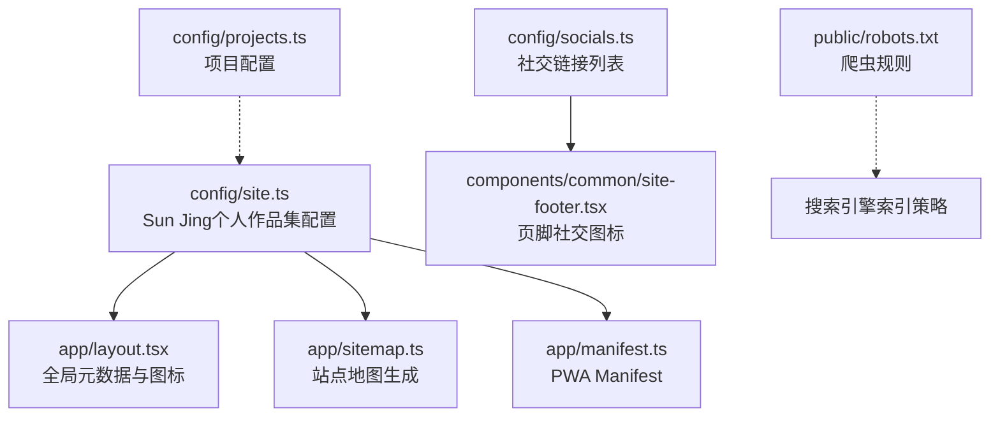
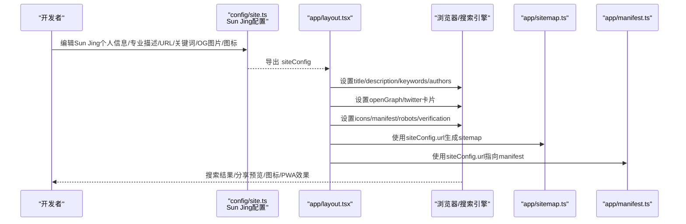
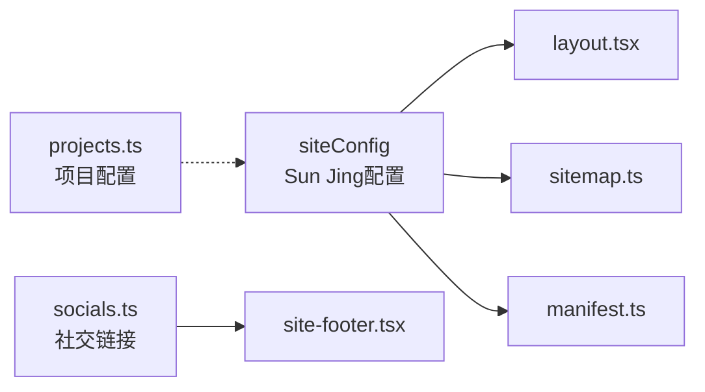

# 站点配置

<cite>
**本文引用的文件**
- [config/site.ts](file://config/site.ts)
- [app/layout.tsx](file://app/layout.tsx)
- [app/manifest.ts](file://app/manifest.ts)
- [app/sitemap.ts](file://app/sitemap.ts)
- [config/socials.ts](file://config/socials.ts)
- [components/common/site-footer.tsx](file://components/common/site-footer.tsx)
- [public/robots.txt](file://public/robots.txt)
- [config/projects.ts](file://config/projects.ts)
- [package.json](file://package.json)
</cite>

## 更新摘要
**所做更改**
- 更新了项目标识符从'portfolio-template'到'next-portfolio'
- 更新了公司名称为'next-portfolio'
- 项目描述重写为中文描述开源Next.js个人网站
- GitHub链接更新为新仓库地址https://github.com/florianjsun/next-portfolio
- 项目时间线调整为2026年8月12日至8月31日
- 保持了Sun Jing个人作品集的完整配置信息

## 目录
1. [简介](#简介)
2. [项目结构](#项目结构)
3. [核心组件](#核心组件)
4. [架构总览](#架构总览)
5. [详细组件分析](#详细组件分析)
6. [依赖关系分析](#依赖关系分析)
7. [性能与SEO建议](#性能与seo建议)
8. [故障排查指南](#故障排查指南)
9. [结论](#结论)
10. [附录：配置项清单与修改指引](#附录配置项清单与修改指引)

## 简介
本文件面向希望定制个人作品集网站的开发者，系统化说明站点配置文件 site.ts 的所有选项及其作用，并给出如何修改站点名称、作者信息、描述、URL、社交媒体链接、SEO 元数据（关键词、Open Graph、Twitter Card）、图标与 PWA manifest、站点地图等关键配置的实践方法。文档同时提供流程图与时序图，帮助理解配置在 Next.js 应用中的生效路径。

**已更新** 站点配置现已完全本地化为Sun Jing的个人作品集，包括中文描述、个人品牌信息和社交链接，项目标识符已更新为next-portfolio。

## 项目结构
站点配置集中在 config/site.ts，并在根布局中注入到浏览器元数据、Open Graph/Twitter 卡片、图标与 Manifest、Sitemap 生成等位置。社交链接由独立的 socials.ts 管理，页脚组件渲染这些链接。

**图表来源**
- [config/site.ts:1-39](file://config/site.ts#L1-L39)
- [app/layout.tsx:30-97](file://app/layout.tsx#L30-L97)
- [app/sitemap.ts:1-72](file://app/sitemap.ts#L1-L72)
- [app/manifest.ts:1-39](file://app/manifest.ts#L1-L39)
- [config/socials.ts:1-36](file://config/socials.ts#L1-L36)
- [components/common/site-footer.tsx:1-34](file://components/common/site-footer.tsx#L1-L34)
- [public/robots.txt:1-6](file://public/robots.txt#L1-L6)
- [config/projects.ts:30-70](file://config/projects.ts#L30-L70)

**章节来源**
- [config/site.ts:1-39](file://config/site.ts#L1-L39)
- [app/layout.tsx:30-97](file://app/layout.tsx#L30-L97)
- [app/sitemap.ts:1-72](file://app/sitemap.ts#L1-L72)
- [app/manifest.ts:1-39](file://app/manifest.ts#L1-L39)
- [config/socials.ts:1-36](file://config/socials.ts#L1-L36)
- [components/common/site-footer.tsx:1-34](file://components/common/site-footer.tsx#L1-L34)
- [public/robots.txt:1-6](file://public/robots.txt#L1-L6)

## 核心组件
- **站点配置中心**：site.ts 集中定义Sun Jing的个人作品集信息，包括Java & AI应用工程师的专业定位、全栈开发技能和个人品牌信息。
- **全局元数据**：layout.tsx 将 siteConfig 注入到 title、description、keywords、authors、openGraph、twitter、icons、manifest、alternates、robots、verification 等。
- **社交链接**：socials.ts 维护Sun Jing的GitHub、LinkedIn、Twitter和Gmail社交平台条目，供页脚展示。
- **站点地图**：sitemap.ts 基于 siteConfig.url 生成各页面与博客的 sitemap。
- **PWA Manifest**：manifest.ts 定义应用名称、描述、主题色、图标等，体现Sun Jing的个人品牌。
- **爬虫规则**：robots.txt 控制爬虫访问与 sitemap 位置。
- **项目配置**：projects.ts 包含next-portfolio项目的详细信息，包括新的项目标识符和时间线。

**章节来源**
- [config/site.ts:1-39](file://config/site.ts#L1-L39)
- [app/layout.tsx:30-97](file://app/layout.tsx#L30-L97)
- [config/socials.ts:1-36](file://config/socials.ts#L1-L36)
- [app/sitemap.ts:1-72](file://app/sitemap.ts#L1-L72)
- [app/manifest.ts:1-39](file://app/manifest.ts#L1-L39)
- [public/robots.txt:1-6](file://public/robots.txt#L1-L6)
- [config/projects.ts:30-70](file://config/projects.ts#L30-L70)

## 架构总览
站点配置通过单一入口 site.ts 驱动全站 SEO 与品牌信息一致性。构建时 Next.js 读取 siteConfig，输出到 HTML head、Open Graph/Twitter 卡片、图标、Manifest 与 Sitemap。

**图表来源**
- [config/site.ts:1-39](file://config/site.ts#L1-L39)
- [app/layout.tsx:30-97](file://app/layout.tsx#L30-L97)
- [app/sitemap.ts:1-72](file://app/sitemap.ts#L1-L72)
- [app/manifest.ts:1-39](file://app/manifest.ts#L1-L39)

## 详细组件分析

### 站点配置 site.ts
**已更新** 站点配置现已完全本地化为Sun Jing的个人作品集信息。

- **name**：站点名称 "Sun Jing - Java & AI应用工程师"，用于标题模板与 OG/Twitter 站点名。
- **authorName**：作者显示名 "Sun Jing"，用于 authors 与 JSON-LD 作者信息。
- **username**：平台用户名 "florianjsun"，用于 Twitter creator 与链接标识。
- **description**：站点描述 "Sun Jing - 全栈 & AI应用工程师，正在探索如何用AI为传统业务提速。欢迎浏览我的项目、经历与贡献"，用于 meta description 与 OG/Twitter 描述。
- **url**：站点根地址 "https://nbarkiya.xyz"，作为 metadataBase、canonical、OG/Twitter 图片基址、sitemap 前缀。
- **links**：常用外链集合（如 twitter、github、templateRepo），便于统一管理与引用。其中 templateRepo 已更新为 https://github.com/florianjsun/next-portfolio.git。
- **ogImage**：Open Graph 共享图片，影响社交平台分享预览。
- **iconIco**：favicon 图标。
- **logoIcon**：快捷方式图标与 Apple 图标。
- **keywords**：搜索关键词数组，包含 "Sun Jing"、"Applied AI Engineer"、"AI Engineer"、"Software Engineer"、"Full Stack Developer"、"Machine Learning"、"Data Engineering"、"Python Developer"、"React Developer"、"Next.js Developer"、"TypeScript"、"AI Startups"、"Software Development"、"Web Developer"、"Backend Developer"、"Frontend Developer"、"Tech Portfolio" 等专业技能标签。

**修改建议**
- 保持 name、authorName、username 一致且简洁。
- description 控制在 120–160 字符，突出核心价值与技术栈。
- url 必须为最终发布域名，避免本地调试域名混入生产。
- ogImage 建议使用 1200×630 的 PNG/JPG，确保跨平台清晰。
- keywords 聚焦真实技能与领域，避免堆砌无关词。

**章节来源**
- [config/site.ts:1-39](file://config/site.ts#L1-L39)

### 全局元数据 layout.tsx
- **标题**：默认标题与模板，自动拼接子页面标题。
- **描述与关键词**：直接复用 siteConfig。
- **作者与创建者**：绑定 authorName、url 与 username。
- **Open Graph**：type、locale、url、title、description、siteName、images（含尺寸与 alt）。
- **Twitter Card**：summary_large_image，复用 OG 图片与 creator。
- **图标**：icon、shortcut、apple 三处统一指向 logoIcon；favicon 指向 iconIco。
- **Manifest**：指向 /site.webmanifest。
- **规范链接**：canonical 指向站点根。
- **Robots**：允许索引与抓取，GoogleBot 开启大图预览与大片段。
- **验证**：Google Search Console 验证令牌来自环境变量。

**最佳实践**
- 确保 ogImage 可被公网访问且无跨域限制。
- 若部署到多环境，务必保证 url 始终指向当前环境域名。
- 如需自定义每页标题，可在页面级覆盖 metadata.title。

**章节来源**
- [app/layout.tsx:30-97](file://app/layout.tsx#L30-L97)

### 社交链接 socials.ts 与页脚 site-footer.tsx
**已更新** 社交链接现已完全本地化为Sun Jing的个人社交平台信息。

- **SocialLinks 数组**包含以下平台：
  - **Github**：用户名 "@florianjsun"，链接到 https://github.com/florianjsun
  - **LinkedIn**：用户名 "Sun Jing"，链接到 https://www.linkedin.com/in/sun-jing/
  - **Twitter**：用户名 "@florianjsun"，链接到 https://twitter.com/florianjsun
  - **Gmail**：用户名 "florianjsun"，邮箱地址 florianjsun@gmail.com
- **页脚循环渲染**每个社交平台按钮，支持 tooltip 显示用户名。
- **新增或移除社交平台**只需编辑该数组。

**注意事项**
- 链接需以 https 开头，邮箱使用 mailto:。
- 图标组件需已实现，否则渲染异常。

**章节来源**
- [config/socials.ts:1-36](file://config/socials.ts#L1-L36)
- [components/common/site-footer.tsx:1-34](file://components/common/site-footer.tsx#L1-L34)

### 站点地图 sitemap.ts
- 基于 siteConfig.url 生成主页与各功能页的 sitemap 条目。
- 动态导入博客元数据，为每篇博客生成独立条目，包含 lastModified、changeFrequency、priority。
- 所有条目统一使用站点根 URL 前缀，避免硬编码。

**优化建议**
- 当新增页面路由时，同步在 routes 数组中添加条目。
- 对频繁更新的内容提高 changeFrequency 与 priority。

**章节来源**
- [app/sitemap.ts:1-72](file://app/sitemap.ts#L1-L72)

### PWA Manifest manifest.ts
**已更新** PWA配置现已完全本地化为Sun Jing的个人作品集信息。

- **应用名称**："Sun Jing | 全栈 & AI应用工程师"
- **短名称**："Sun Jing"
- **描述**："Sun Jing - 全栈 & AI应用工程师，正在探索如何用AI为传统业务提速。欢迎浏览我的项目、经历与贡献"
- **启动路径**："/"
- **显示模式**："standalone"
- **背景与主题色**：白色背景 #ffffff，黑色主题 #000000
- **图标资源**：64x64尺寸的PNG格式图标，支持maskable用途
- **分类标签**：portfolio、ai、software engineering、machine learning、developer、web development
- **语言与方向**：英语语言，从左到右显示
- **作用域**："/"

**注意**
- 图标路径需与部署路径一致。
- 若更换品牌色，请同步调整 theme_color 与 background_color。

**章节来源**
- [app/manifest.ts:1-39](file://app/manifest.ts#L1-L39)

### 爬虫规则 robots.txt
- **允许所有爬虫访问**根路径。
- **指定 sitemap 位置**：https://nbarkiya.xyz/sitemap.xml，便于搜索引擎发现。

**章节来源**
- [public/robots.txt:1-6](file://public/robots.txt#L1-L6)

### 项目配置 projects.ts
**已更新** 项目配置已反映最新的next-portfolio项目信息。

- **项目标识符**：id 字段已更新为 "next-portfolio"
- **公司名称**：companyName 字段已更新为 "next-portfolio"
- **项目描述**：shortDescription 已重写为中文 "开源 Next.js 个人网站，基于 namanbarkiya 的 minimal-next-portfolio 进行二次开发，针对 SEO/AEO 与性能进行了优化"
- **GitHub链接**：githubLink 已更新为 https://github.com/florianjsun/next-portfolio
- **项目时间线**：startDate 设置为 2026-08-12，endDate 设置为 2026-08-31
- **技术栈**：包含 Next.js、React、Typescript、Tailwind CSS、Framer Motion、Vercel 等现代前端技术

**章节来源**
- [config/projects.ts:30-70](file://config/projects.ts#L30-L70)

## 依赖关系分析
- **siteConfig** 是全站 SEO 与品牌信息的唯一事实源。
- **layout.tsx** 消费 siteConfig 生成浏览器可见的元数据与图标。
- **sitemap.ts** 消费 siteConfig.url 生成站点地图。
- **manifest.ts** 消费站点根 URL 与品牌信息。
- **socials.ts** 与 site-footer.tsx** 解耦社交展示逻辑，便于扩展。
- **projects.ts** 提供项目配置信息，与站点配置形成互补。

**图表来源**
- [config/site.ts:1-39](file://config/site.ts#L1-L39)
- [app/layout.tsx:30-97](file://app/layout.tsx#L30-L97)
- [app/sitemap.ts:1-72](file://app/sitemap.ts#L1-L72)
- [app/manifest.ts:1-39](file://app/manifest.ts#L1-L39)
- [config/socials.ts:1-36](file://config/socials.ts#L1-L36)
- [components/common/site-footer.tsx:1-34](file://components/common/site-footer.tsx#L1-L34)
- [config/projects.ts:30-70](file://config/projects.ts#L30-L70)

**章节来源**
- [config/site.ts:1-39](file://config/site.ts#L1-L39)
- [app/layout.tsx:30-97](file://app/layout.tsx#L30-L97)
- [app/sitemap.ts:1-72](file://app/sitemap.ts#L1-L72)
- [app/manifest.ts:1-39](file://app/manifest.ts#L1-L39)
- [config/socials.ts:1-36](file://config/socials.ts#L1-L36)
- [components/common/site-footer.tsx:1-34](file://components/common/site-footer.tsx#L1-L34)
- [config/projects.ts:30-70](file://config/projects.ts#L30-L70)

## 性能与SEO建议
- **图片优化**：ogImage 建议使用现代格式（WebP/AVIF）并提供回退，尺寸 1200×630，压缩至合理体积。
- **缓存与CDN**：将 ogImage 托管于 CDN 以提升加载速度。
- **关键词策略**：keywords 应精准反映技术栈与业务领域，避免过度堆砌。
- **描述质量**：description 要准确概括站点价值，提升点击率。
- **结构化数据**：博客页面已内置 BlogPosting 与 BreadcrumbList JSON-LD，利于富摘要展示。
- **站点地图**：新增页面后及时更新 sitemap，加速收录。
- **移动端体验**：确保图标与 manifest 适配不同设备。
- **项目信息一致性**：确保项目配置中的信息与站点配置保持一致，特别是GitHub链接和项目描述。

## 故障排查指南
- **分享预览不正确**
  - 检查 ogImage 是否可公开访问，尺寸是否为 1200×630。
  - 确认 layout.tsx 中 openGraph.images 正确引用 siteConfig.ogImage。
- **图标未显示**
  - 检查 iconIco 与 logoIcon 路径是否正确，浏览器控制台是否有 404。
  - 确认 manifest.ts 中图标路径与部署路径一致。
- **搜索引擎未收录**
  - 检查 robots.txt 是否允许抓取，sitemap.xml 是否可达。
  - 确认 layout.tsx 中 robots 配置为 index/follow。
- **Google Search Console 验证失败**
  - 检查环境变量 NEXT_PUBLIC_GOOGLE_VERIFICATION 是否已设置且值正确。
- **博客分享预览缺失**
  - 检查博客封面图 coverImage 是否存在，若不存在则回退到 siteConfig.ogImage。
- **项目链接失效**
  - 确认 projects.ts 中的 GitHub 链接已更新为正确的 next-portfolio 仓库地址。
  - 检查 templateRepo 链接是否与站点配置中的 links.templateRepo 保持一致。

**章节来源**
- [app/layout.tsx:30-97](file://app/layout.tsx#L30-L97)
- [public/robots.txt:1-6](file://public/robots.txt#L1-L6)
- [config/projects.ts:30-70](file://config/projects.ts#L30-L70)

## 结论
通过将站点基础信息与 SEO 元数据集中到 site.ts，并在 layout.tsx 中统一注入，本项目实现了"一处配置，全站生效"的可维护方案。配合 socials.ts、sitemap.ts、manifest.ts 与 robots.txt，能够高效完成Sun Jing个人作品集网站的品牌化与 SEO 优化。随着项目标识符更新为next-portfolio以及项目描述的本地化，该配置系统更好地反映了项目的实际状态和品牌定位。遵循本文档的配置方法与最佳实践，可以快速定制符合个人定位的专业站点。

## 附录：配置项清单与修改指引

### 站点名称与作者
- **字段**：name、authorName、username
- **作用**：标题、作者信息、Twitter creator、JSON-LD 作者
- **修改位置**：config/site.ts
- **影响范围**：layout.tsx 的 title、authors、creator；博客 JSON-LD
- **当前配置**：Sun Jing - Java & AI应用工程师 / Sun Jing / florianjsun

### 站点描述与关键词
- **字段**：description、keywords
- **作用**：meta description、Open Graph/Twitter 描述、搜索引擎关键词
- **修改位置**：config/site.ts
- **影响范围**：layout.tsx 的 description、keywords、openGraph、twitter
- **当前配置**：专注于AI应用工程、全栈开发的个人描述和专业技能标签

### 站点 URL 与常用链接
- **字段**：url、links
- **作用**：metadataBase、canonical、sitemap 前缀、外部链接
- **修改位置**：config/site.ts
- **影响范围**：layout.tsx、sitemap.ts、manifest.ts、博客 JSON-LD
- **当前配置**：https://nbarkiya.xyz 及相关的GitHub、Twitter链接，其中 templateRepo 已更新为 https://github.com/florianjsun/next-portfolio.git

### Open Graph 图片
- **字段**：ogImage
- **作用**：社交平台分享预览图
- **修改位置**：config/site.ts
- **影响范围**：layout.tsx 的 openGraph.images、twitter.images

### 图标设置
- **字段**：iconIco、logoIcon
- **作用**：favicon、快捷方式、Apple 图标
- **修改位置**：config/site.ts
- **影响范围**：layout.tsx 的 icons；manifest.ts 的图标

### 社交媒体链接
- **字段**：SocialLinks（name、username、icon、link）
- **作用**：页脚社交按钮与提示文本
- **修改位置**：config/socials.ts
- **影响范围**：components/common/site-footer.tsx
- **当前配置**：GitHub、LinkedIn、Twitter、Gmail四个社交平台

### 站点地图
- **字段**：routes（静态页面）与 blogs（动态博客）
- **作用**：告知搜索引擎站点结构与更新频率
- **修改位置**：app/sitemap.ts
- **影响范围**：搜索引擎收录

### PWA Manifest
- **字段**：name、short_name、description、start_url、display、background_color、theme_color、icons、categories、lang、dir、scope
- **作用**：PWA 安装与行为控制
- **修改位置**：app/manifest.ts
- **影响范围**：浏览器 PWA 体验
- **当前配置**：Sun Jing个人作品集的完整PWA配置

### 爬虫规则
- **字段**：User-agent、Allow、Sitemap
- **作用**：控制爬虫访问与站点地图位置
- **修改位置**：public/robots.txt
- **影响范围**：搜索引擎抓取策略

### 项目配置
- **字段**：id、companyName、shortDescription、githubLink、startDate、endDate
- **作用**：项目基本信息展示与时间线管理
- **修改位置**：config/projects.ts
- **影响范围**：项目展示页面、GitHub 链接、项目时间线
- **当前配置**：next-portfolio项目，标识符已更新，时间线为2026年8月12日至8月31日

**章节来源**
- [config/site.ts:1-39](file://config/site.ts#L1-L39)
- [config/socials.ts:1-36](file://config/socials.ts#L1-L36)
- [app/layout.tsx:30-97](file://app/layout.tsx#L30-L97)
- [app/sitemap.ts:1-72](file://app/sitemap.ts#L1-L72)
- [app/manifest.ts:1-39](file://app/manifest.ts#L1-L39)
- [components/common/site-footer.tsx:1-34](file://components/common/site-footer.tsx#L1-L34)
- [public/robots.txt:1-6](file://public/robots.txt#L1-L6)
- [config/projects.ts:30-70](file://config/projects.ts#L30-L70)