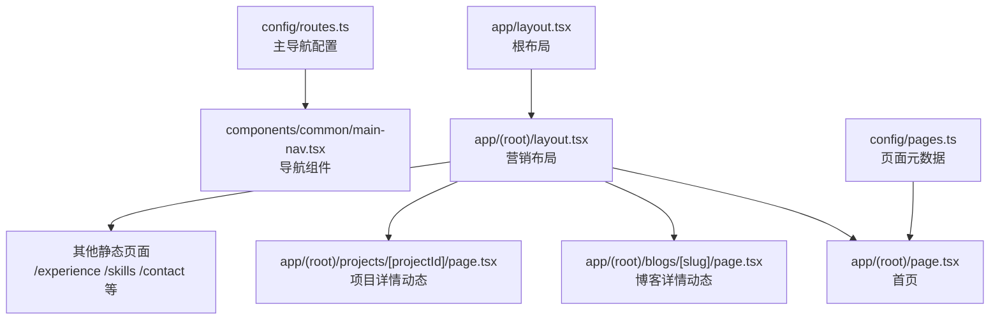
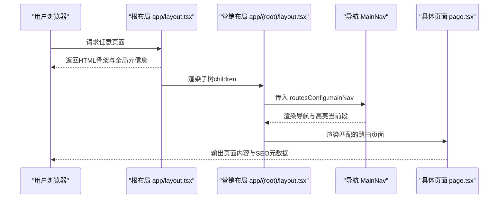
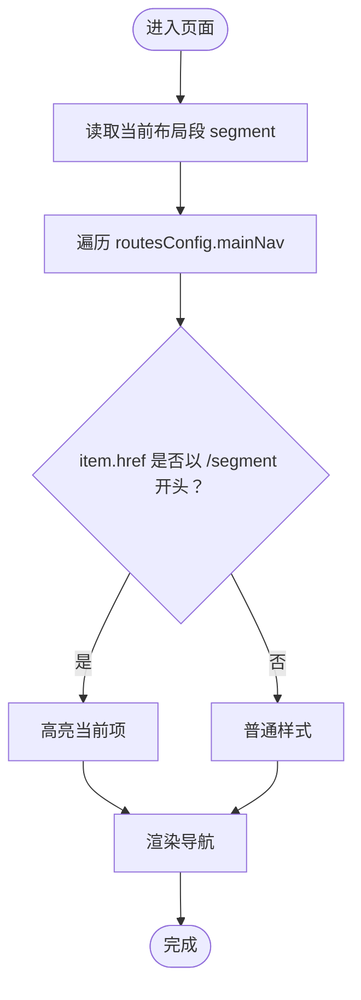
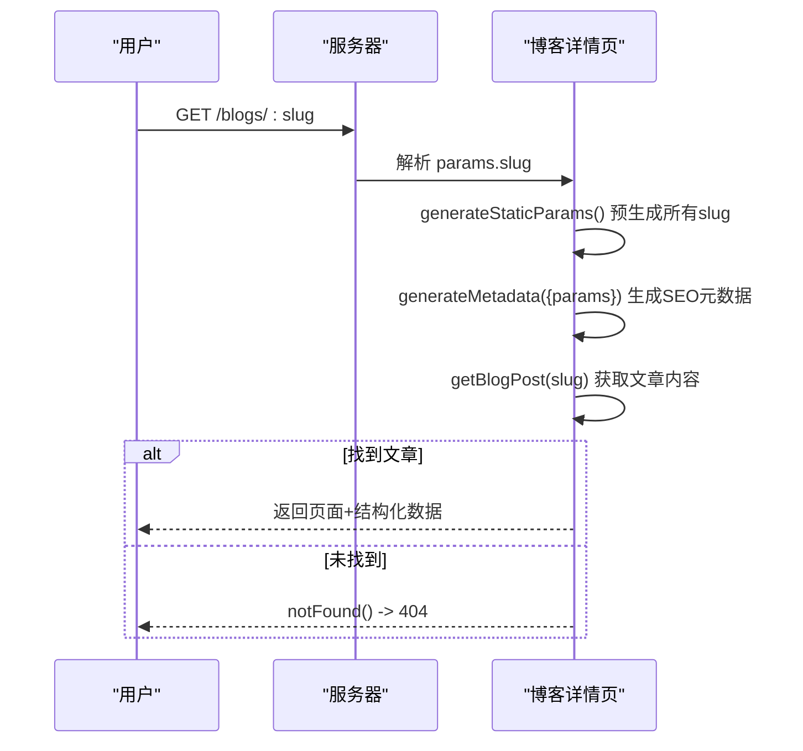
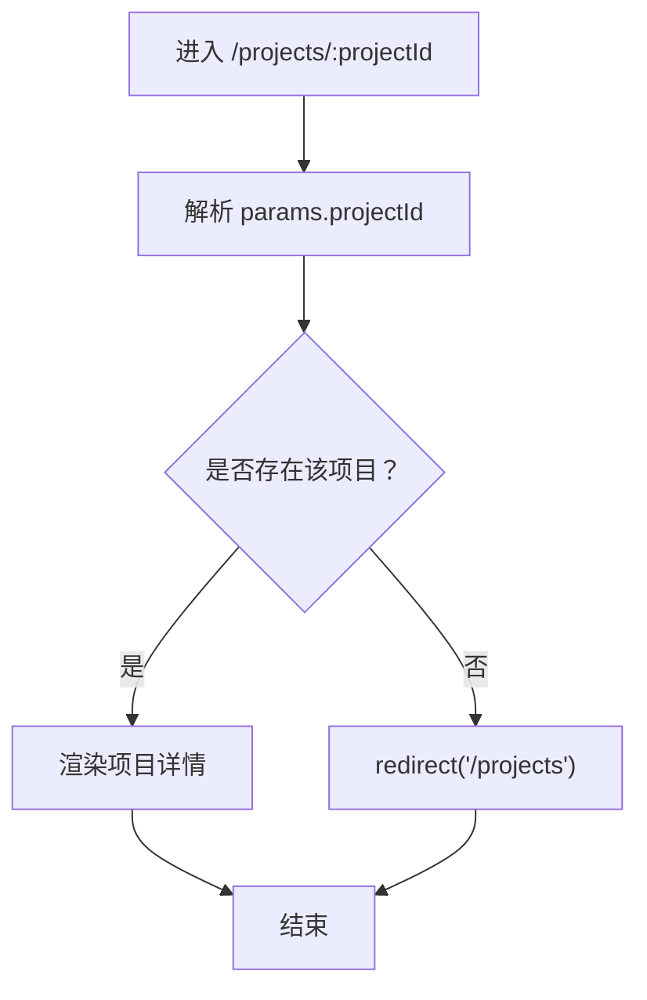
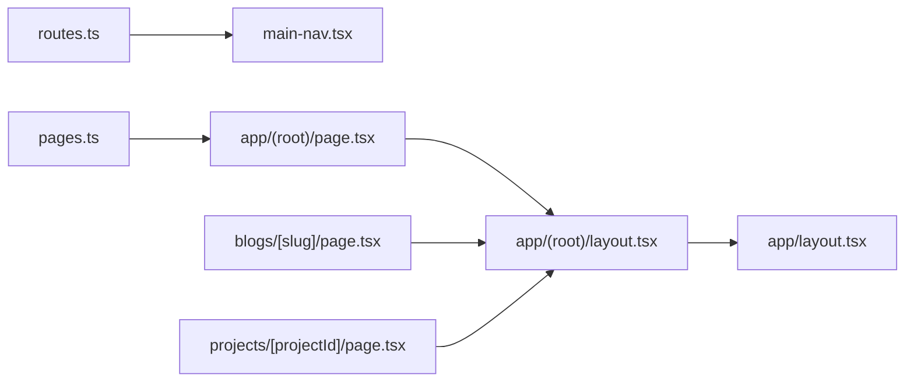

# 路由配置

<cite>
**本文引用的文件**
- [config/routes.ts](file://config/routes.ts)
- [config/pages.ts](file://config/pages.ts)
- [config/constants.ts](file://config/constants.ts)
- [app/layout.tsx](file://app/layout.tsx)
- [app/(root)/layout.tsx](file://app/(root)/layout.tsx)
- [components/common/main-nav.tsx](file://components/common/main-nav.tsx)
- [app/(root)/page.tsx](file://app/(root)/page.tsx)
- [app/(root)/blogs/[slug]/page.tsx](file://app/(root)/blogs/[slug]/page.tsx)
- [app/(root)/projects/[projectId]/page.tsx](file://app/(root)/projects/[projectId]/page.tsx)
- [next.config.js](file://next.config.js)
</cite>

## 目录
1. [简介](#简介)
2. [项目结构](#项目结构)
3. [核心组件](#核心组件)
4. [架构总览](#架构总览)
5. [详细组件分析](#详细组件分析)
6. [依赖关系分析](#依赖关系分析)
7. [性能与SEO考量](#性能与seo考量)
8. [故障排查指南](#故障排查指南)
9. [结论](#结论)
10. [附录：高级路由实践](#附录：高级路由实践)

## 简介
本文件面向Next.js应用的路由配置，聚焦以下目标：
- 解释 routes.ts 中定义的主导航菜单与路由规则
- 说明 pages.ts 中的页面元数据与路由映射关系
- 梳理动态路由、嵌套路由的实现方式
- 提供路由守卫与自定义中间件的实现思路
- 给出可操作的配置建议与常见问题排查方法

## 项目结构
本项目采用App Router组织页面与布局：
- 根布局 app/layout.tsx 负责全局元信息、主题、第三方脚本等
- 营销型布局 app/(root)/layout.tsx 包裹主导航、页脚与内容区域
- 页面位于 app/(root)/ 下，静态页面与动态页面通过文件夹命名约定自动映射为URL路径
- 导航菜单集中配置在 config/routes.ts，供头部导航复用
- 页面元信息与标题/描述统一在 config/pages.ts 管理

图表来源
- [app/layout.tsx:30-97](file://app/layout.tsx#L30-L97)
- [app/(root)/layout.tsx:11-31](file://app/(root)/layout.tsx#L11-L31)
- [config/routes.ts:1-28](file://config/routes.ts#L1-L28)
- [config/pages.ts:15-85](file://config/pages.ts#L15-L85)

章节来源
- [app/layout.tsx:30-97](file://app/layout.tsx#L30-L97)
- [app/(root)/layout.tsx:11-31](file://app/(root)/layout.tsx#L11-L31)
- [config/routes.ts:1-28](file://config/routes.ts#L1-L28)
- [config/pages.ts:15-85](file://config/pages.ts#L15-L85)

## 核心组件
- 主导航配置：routes.ts 定义了 mainNav 数组，包含标题与链接，用于构建顶部导航栏。
- 页面元数据：pages.ts 以类型化对象统一管理各页面的 title/description/metadata，便于SEO与一致性。
- 导航渲染：main-nav.tsx 使用 Next Navigation API 获取当前段并高亮对应菜单项，同时支持移动端菜单。
- 布局组合：根布局与营销布局共同构成页面骨架，承载主题、分析、模态等全局能力。

章节来源
- [config/routes.ts:1-28](file://config/routes.ts#L1-L28)
- [config/pages.ts:15-85](file://config/pages.ts#L15-L85)
- [components/common/main-nav.tsx:40-101](file://components/common/main-nav.tsx#L40-L101)
- [app/layout.tsx:99-143](file://app/layout.tsx#L99-L143)
- [app/(root)/layout.tsx:11-31](file://app/(root)/layout.tsx#L11-L31)

## 架构总览
下图展示从用户访问到页面渲染的关键流程，包括导航、布局与页面渲染的协作关系。

图表来源
- [app/layout.tsx:30-97](file://app/layout.tsx#L30-L97)
- [app/(root)/layout.tsx:11-31](file://app/(root)/layout.tsx#L11-L31)
- [components/common/main-nav.tsx:40-101](file://components/common/main-nav.tsx#L40-L101)

## 详细组件分析

### 导航与路由规则（routes.ts + main-nav.tsx）
- routes.ts 维护主导航项，每项包含标题与href，作为单一事实源驱动所有导航入口。
- main-nav.tsx 通过 useSelectedLayoutSegment/usePathname 判断当前段，结合 href 前缀匹配实现“当前路由高亮”。
- 导航项支持 disabled 状态（当存在时），点击无效且样式降级。

图表来源
- [components/common/main-nav.tsx:40-101](file://components/common/main-nav.tsx#L40-L101)
- [config/routes.ts:1-28](file://config/routes.ts#L1-L28)

章节来源
- [config/routes.ts:1-28](file://config/routes.ts#L1-L28)
- [components/common/main-nav.tsx:40-101](file://components/common/main-nav.tsx#L40-L101)

### 页面元数据与路由映射（pages.ts）
- pages.ts 以 ValidPages 类型约束键名，确保新增页面必须声明元数据，避免遗漏SEO信息。
- 每个页面条目包含 title、description、metadata.title/description，便于在页面或布局中引用。
- 该文件不直接参与路由映射，但为页面提供统一的元数据源，配合 app/(root)/page.tsx 等页面使用。

章节来源
- [config/pages.ts:1-85](file://config/pages.ts#L1-L85)
- [config/constants.ts:76-84](file://config/constants.ts#L76-L84)
- [app/(root)/page.tsx:28-35](file://app/(root)/page.tsx#L28-L35)

### 动态路由：博客详情（[slug]）
- 路由模式：app/(root)/blogs/[slug]/page.tsx
- 预生成参数：generateStaticParams 基于 getAllBlogSlugs 生成所有 slug 列表，提升构建期性能与SEO。
- 元数据：generateMetadata 根据 slug 获取文章并设置标题、描述、OpenGraph、Twitter Card、canonical 等。
- 错误处理：找不到文章时调用 notFound()，触发Next内置404处理。
- SEO增强：注入 BlogPosting 与 BreadcrumbList JSON-LD，提升搜索引擎理解。

图表来源
- [app/(root)/blogs/[slug]/page.tsx:20-79](file://app/(root)/blogs/[slug]/page.tsx#L20-L79)
- [app/(root)/blogs/[slug]/page.tsx:81-166](file://app/(root)/blogs/[slug]/page.tsx#L81-L166)

章节来源
- [app/(root)/blogs/[slug]/page.tsx:20-79](file://app/(root)/blogs/[slug]/page.tsx#L20-L79)
- [app/(root)/blogs/[slug]/page.tsx:81-166](file://app/(root)/blogs/[slug]/page.tsx#L81-L166)

### 动态路由：项目详情（[projectId]）
- 路由模式：app/(root)/projects/[projectId]/page.tsx
- 数据校验：根据 projectId 查找项目，若不存在则 redirect("/projects")，避免无效页面。
- 展示内容：项目封面、技术栈、描述、页面截图等。

图表来源
- [app/(root)/projects/[projectId]/page.tsx:23-28](file://app/(root)/projects/[projectId]/page.tsx#L23-L28)

章节来源
- [app/(root)/projects/[projectId]/page.tsx:23-28](file://app/(root)/projects/[projectId]/page.tsx#L23-L28)

### 嵌套路由与布局
- 营销布局 app/(root)/layout.tsx 作为一组页面的共享外壳，包含头部导航、主体与页脚。
- 所有位于 app/(root)/ 下的页面都会自动套用该布局，形成“嵌套路由”效果。
- 根布局 app/layout.tsx 提供全局字体、主题、分析、Toaster、ModalProvider 等。

章节来源
- [app/(root)/layout.tsx:11-31](file://app/(root)/layout.tsx#L11-L31)
- [app/layout.tsx:99-143](file://app/layout.tsx#L99-L143)

## 依赖关系分析
- 导航依赖 routesConfig 与 siteConfig，渲染时依赖 Next Navigation API。
- 页面依赖各自的数据源（如 blogs、projects、experience、skills、contributions）。
- 元数据依赖 pagesConfig 与 siteConfig，保证全站一致。
- 构建期依赖 generateStaticParams 预生成动态路由参数，减少运行时开销。

图表来源
- [config/routes.ts:1-28](file://config/routes.ts#L1-L28)
- [config/pages.ts:15-85](file://config/pages.ts#L15-L85)
- [app/(root)/layout.tsx:11-31](file://app/(root)/layout.tsx#L11-L31)
- [app/layout.tsx:99-143](file://app/layout.tsx#L99-L143)
- [app/(root)/blogs/[slug]/page.tsx:20-79](file://app/(root)/blogs/[slug]/page.tsx#L20-L79)
- [app/(root)/projects/[projectId]/page.tsx:23-28](file://app/(root)/projects/[projectId]/page.tsx#L23-L28)

章节来源
- [config/routes.ts:1-28](file://config/routes.ts#L1-L28)
- [config/pages.ts:15-85](file://config/pages.ts#L15-L85)
- [app/(root)/layout.tsx:11-31](file://app/(root)/layout.tsx#L11-L31)
- [app/layout.tsx:99-143](file://app/layout.tsx#L99-L143)
- [app/(root)/blogs/[slug]/page.tsx:20-79](file://app/(root)/blogs/[slug]/page.tsx#L20-L79)
- [app/(root)/projects/[projectId]/page.tsx:23-28](file://app/(root)/projects/[projectId]/page.tsx#L23-L28)

## 性能与SEO考量
- 构建期参数预生成：博客详情通过 generateStaticParams 提前生成所有 slug，显著降低首屏加载与缓存压力。
- 元数据集中管理：pages.ts 统一标题与描述，利于SEO一致性与批量维护。
- OpenGraph/Twitter Card：博客详情页在 generateMetadata 中设置社交分享卡片，提高传播效果。
- 结构化数据：博客详情页注入 BlogPosting 与 BreadcrumbList JSON-LD，提升搜索引擎理解度。
- 响应式与可访问性：导航与页面结构遵循语义化标签，利于爬虫与辅助技术。

章节来源
- [app/(root)/blogs/[slug]/page.tsx:20-79](file://app/(root)/blogs/[slug]/page.tsx#L20-L79)
- [app/(root)/blogs/[slug]/page.tsx:102-166](file://app/(root)/blogs/[slug]/page.tsx#L102-L166)
- [config/pages.ts:15-85](file://config/pages.ts#L15-L85)

## 故障排查指南
- 缺少Google Analytics ID：根布局会抛出缺失ID的错误，需检查环境变量配置。
- 动态路由404：博客详情未找到时会调用 notFound()；项目详情未找到会重定向至列表页。
- 导航高亮异常：确认 useSelectedLayoutSegment 返回值与 routesConfig 中 href 的前缀匹配逻辑一致。
- 元数据不一致：新增页面需在 pages.ts 补充元数据，并在页面中使用。

章节来源
- [app/layout.tsx:99-103](file://app/layout.tsx#L99-L103)
- [app/(root)/blogs/[slug]/page.tsx:81-89](file://app/(root)/blogs/[slug]/page.tsx#L81-L89)
- [app/(root)/projects/[projectId]/page.tsx:23-28](file://app/(root)/projects/[projectId]/page.tsx#L23-L28)
- [components/common/main-nav.tsx:40-101](file://components/common/main-nav.tsx#L40-L101)

## 结论
本项目通过 App Router 的目录约定实现了清晰的路由结构，结合集中化的导航与页面元数据配置，保证了可扩展性与一致性。动态路由通过 generateStaticParams 与合理的错误处理策略，兼顾了性能与用户体验。未来可在需要时引入路由中间件与权限控制，进一步增强访问控制能力。

## 附录：高级路由实践

### 动态路由与嵌套路由
- 动态路由：使用方括号命名文件夹（如 [slug]、[projectId]），Next会自动将参数注入到页面组件的 props.params。
- 嵌套路由：通过分组目录（如 (root)）共享布局，所有子页面自动继承布局结构。

章节来源
- [app/(root)/blogs/[slug]/page.tsx:20-79](file://app/(root)/blogs/[slug]/page.tsx#L20-L79)
- [app/(root)/projects/[projectId]/page.tsx:23-28](file://app/(root)/projects/[projectId]/page.tsx#L23-L28)
- [app/(root)/layout.tsx:11-31](file://app/(root)/layout.tsx#L11-L31)

### 路由守卫与访问控制（推荐方案）
当前仓库未实现服务端路由守卫。建议在需要保护的页面或布局内：
- 在服务端组件中校验会话/权限，未授权时 redirect 到登录页或拒绝访问。
- 对于API路由，可在 next.config.js 的 headers 中配置CORS与安全头，或在 route handler 中鉴权。

章节来源
- [app/(root)/projects/[projectId]/page.tsx:23-28](file://app/(root)/projects/[projectId]/page.tsx#L23-L28)
- [next.config.js:1-24](file://next.config.js#L1-L24)

### 自定义路由规则与中间件（参考示例）
- 在 next.config.js 中可通过 headers 为特定路径添加跨域或安全头，适合API网关场景。
- 如需更细粒度的路由拦截，可创建 middleware.ts（Next.js App Router 支持），在请求到达页面之前进行鉴权、重定向或改写。

章节来源
- [next.config.js:1-24](file://next.config.js#L1-L24)