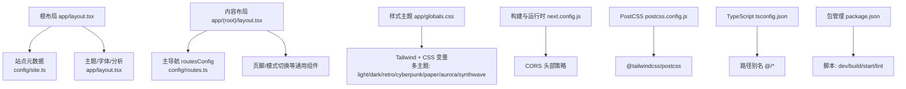
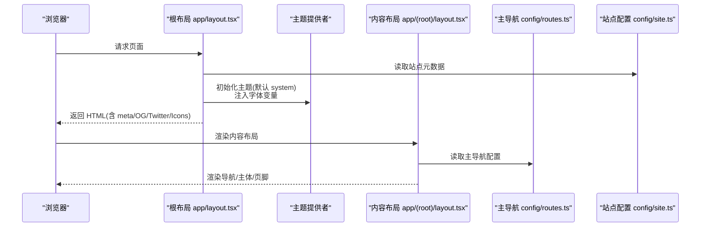
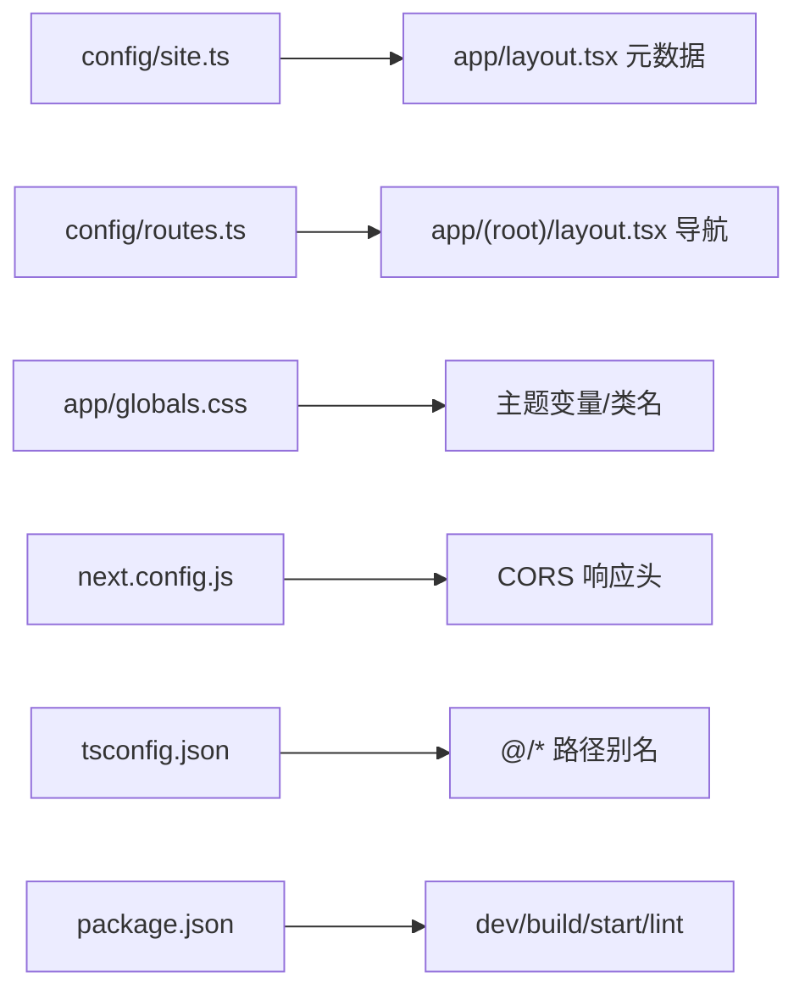

# 配置指南

<cite>
**本文引用的文件**
- [app/layout.tsx](file://app/layout.tsx)
- [app/(root)/layout.tsx](file://app/(root)/layout.tsx)
- [next.config.js](file://next.config.js)
- [postcss.config.js](file://postcss.config.js)
- [components.json](file://components.json)
- [tsconfig.json](file://tsconfig.json)
- [package.json](file://package.json)
- [app/globals.css](file://app/globals.css)
- [config/site.ts](file://config/site.ts)
- [config/routes.ts](file://config/routes.ts)
- [config/constants.ts](file://config/constants.ts)
- [config/socials.ts](file://config/socials.ts)
- [config/projects.ts](file://config/projects.ts)
- [config/experience.ts](file://config/experience.ts)
- [config/skills.ts](file://config/skills.ts)
</cite>

## 目录
1. [简介](#简介)
2. [项目结构](#项目结构)
3. [核心配置项](#核心配置项)
4. [架构总览](#架构总览)
5. [详细组件与配置分析](#详细组件与配置分析)
6. [依赖关系分析](#依赖关系分析)
7. [性能与构建优化](#性能与构建优化)
8. [故障排查](#故障排查)
9. [结论](#结论)
10. [附录：环境变量清单](#附录环境变量清单)

## 简介
本指南面向希望定制 Next.js 投资组合项目的开发者，系统说明站点配置、路由配置、常量定义、页面配置、主题与外观、环境变量、构建与部署等关键配置点。通过集中式配置文件与样式变量体系，你可以快速调整品牌信息、导航菜单、SEO 元数据、主题色板、字体、以及 API 头策略等，满足个性化需求。

## 项目结构
本项目采用 Next.js App Router 组织页面与布局，使用集中式 config 目录管理站点信息与业务数据，样式基于 Tailwind CSS 并通过全局 CSS 变量实现多主题切换。

图表来源
- [app/layout.tsx:30-97](file://app/layout.tsx#L30-L97)
- [config/site.ts:1-41](file://config/site.ts#L1-L41)
- [app/(root)/layout.tsx:1-33](file://app/(root)/layout.tsx#L1-L33)
- [config/routes.ts:1-29](file://config/routes.ts#L1-L29)
- [app/globals.css:28-333](file://app/globals.css#L28-L333)
- [next.config.js:1-25](file://next.config.js#L1-L25)
- [postcss.config.js:1-6](file://postcss.config.js#L1-L6)
- [tsconfig.json:26-30](file://tsconfig.json#L26-L30)
- [package.json:5-9](file://package.json#L5-L9)

章节来源
- [app/layout.tsx:30-97](file://app/layout.tsx#L30-L97)
- [app/(root)/layout.tsx:1-33](file://app/(root)/layout.tsx#L1-L33)
- [config/site.ts:1-41](file://config/site.ts#L1-L41)
- [config/routes.ts:1-29](file://config/routes.ts#L1-L29)
- [app/globals.css:28-333](file://app/globals.css#L28-L333)
- [next.config.js:1-25](file://next.config.js#L1-L25)
- [postcss.config.js:1-6](file://postcss.config.js#L1-L6)
- [tsconfig.json:26-30](file://tsconfig.json#L26-L30)
- [package.json:5-9](file://package.json#L5-L9)

## 核心配置项
- 站点信息（名称、描述、关键词、社交链接、图标与 OG 图片）：在站点配置中集中维护，供 SEO、Open Graph、Twitter Card 与图标引用。
- 路由与导航：主导航由集中式路由配置驱动，便于统一增删改。
- 类型与常量：技能、分类、经验类型、页面枚举等类型约束，确保数据一致性。
- 主题与外观：通过全局 CSS 变量与主题类名切换，支持多种预设主题。
- 字体设置：Google Fonts 与本地字体注入，提供 Sans 与 Heading 两套字体变量。
- 构建与运行时：Next.js 配置用于设置响应头（如 CORS），PostCSS 启用 Tailwind v4 插件。
- TypeScript 路径别名：统一以 @/ 作为项目根路径导入。
- 脚本命令：开发、构建、启动与代码检查命令。

章节来源
- [config/site.ts:1-41](file://config/site.ts#L1-L41)
- [config/routes.ts:1-29](file://config/routes.ts#L1-L29)
- [config/constants.ts:1-85](file://config/constants.ts#L1-L85)
- [app/globals.css:28-333](file://app/globals.css#L28-L333)
- [app/layout.tsx:15-24](file://app/layout.tsx#L15-L24)
- [next.config.js:1-25](file://next.config.js#L1-L25)
- [postcss.config.js:1-6](file://postcss.config.js#L1-L6)
- [tsconfig.json:26-30](file://tsconfig.json#L26-L30)
- [package.json:5-9](file://package.json#L5-L9)

## 架构总览
站点渲染流程从根布局开始，注入全局样式、主题提供者、分析与第三方脚本；内容布局负责顶部导航、主体区域与页脚。所有站点文案、导航与业务数据均通过集中配置导出，保证一致性与可维护性。

图表来源
- [app/layout.tsx:30-97](file://app/layout.tsx#L30-L97)
- [app/layout.tsx:115-133](file://app/layout.tsx#L115-L133)
- [app/(root)/layout.tsx:1-33](file://app/(root)/layout.tsx#L1-L33)
- [config/routes.ts:1-29](file://config/routes.ts#L1-L29)
- [config/site.ts:1-41](file://config/site.ts#L1-L41)

## 详细组件与配置分析

### 站点配置（SEO、社交与图标）
- 站点名称、作者、用户名、描述、URL、关键词、社交链接、OG 图片与图标均在站点配置中定义。
- 根布局将这些值映射到 metadata、Open Graph、Twitter Card、验证与图标字段，确保搜索引擎与社交平台展示正确。
- 修改建议：更新名称、描述、关键词与社交链接即可全局生效；如需更换 OG 图片或图标，直接替换对应字段。

章节来源
- [config/site.ts:1-41](file://config/site.ts#L1-L41)
- [app/layout.tsx:30-97](file://app/layout.tsx#L30-L97)

### 路由与导航配置
- 主导航由集中式路由配置提供，包含标题与链接。内容布局将导航项传递给导航组件，并显示 GitHub Star 徽章与主题切换按钮。
- 修改建议：新增或调整导航项只需编辑路由配置；若需新增页面，请在 app/(root) 下创建对应路由并在导航中添加条目。

章节来源
- [config/routes.ts:1-29](file://config/routes.ts#L1-L29)
- [app/(root)/layout.tsx:1-33](file://app/(root)/layout.tsx#L1-L33)

### 常量与类型约束
- 定义了技能、分类、经验类型与页面枚举等类型，用于项目和经验数据的强类型校验。
- 修改建议：新增技能或分类时，同步扩展类型联合，避免类型错误。

章节来源
- [config/constants.ts:1-85](file://config/constants.ts#L1-L85)

### 页面与业务数据配置
- 项目列表、经验履历、技能列表、社交链接均为集中式数据配置，便于统一管理与展示。
- 修改建议：在项目、经验、技能等模块中按接口规范添加或修改条目；保持字段完整以确保渲染正确。

章节来源
- [config/projects.ts:1-596](file://config/projects.ts#L1-L596)
- [config/experience.ts:1-93](file://config/experience.ts#L1-L93)
- [config/skills.ts:1-166](file://config/skills.ts#L1-L166)
- [config/socials.ts:1-36](file://config/socials.ts#L1-L36)

### 主题与外观定制
- 主题系统基于 CSS 变量与主题类名，支持 light、dark、retro、cyberpunk、paper、aurora、synthwave 等多套主题。
- 根布局的主题提供者允许选择默认主题与启用系统主题跟随。
- 修改建议：
  - 切换主题：在主题提供者中调整 themes 数组顺序或默认主题。
  - 自定义颜色：在全局 CSS 的 :root 与 .dark 等块中修改变量值。
  - 新增主题：复制现有主题块并命名新类名，同时在主题提供者中注册。
  - 字体：通过 Google Fonts 与本地字体注入变量，可在根布局中调整 subsets 与变量名。

章节来源
- [app/layout.tsx:15-24](file://app/layout.tsx#L15-L24)
- [app/layout.tsx:115-133](file://app/layout.tsx#L115-L133)
- [app/globals.css:28-333](file://app/globals.css#L28-L333)

### 构建与运行时配置
- Next.js 配置：为特定 API 路径设置 CORS 响应头，便于跨域调用。
- PostCSS：启用 Tailwind v4 插件，配合全局样式中的 @theme 与 @layer。
- TypeScript：启用严格模式与路径别名，提升开发体验与类型安全。
- 脚本命令：提供开发、构建、启动与 lint 命令。

章节来源
- [next.config.js:1-25](file://next.config.js#L1-L25)
- [postcss.config.js:1-6](file://postcss.config.js#L1-L6)
- [tsconfig.json:1-43](file://tsconfig.json#L1-L43)
- [package.json:5-9](file://package.json#L5-L9)

### 页面级配置（Sitemap、Manifest）
- Sitemap 与 Manifest 位于 app 目录下，用于生成站点地图与 PWA 清单。可根据站点域名与页面结构调整。
- 修改建议：按需更新 sitemap 与 manifest 的 URL 与资源路径。

章节来源
- [app/sitemap.ts](file://app/sitemap.ts)
- [app/manifest.ts](file://app/manifest.ts)

## 依赖关系分析
- 根布局依赖站点配置与主题提供者，注入 SEO 元数据与字体。
- 内容布局依赖路由配置，渲染导航与通用 UI。
- 样式层依赖 Tailwind 与 CSS 变量，主题类名控制全局外观。
- 构建层依赖 Next.js 与 PostCSS，运行期通过 headers 控制跨域。

图表来源
- [config/site.ts:1-41](file://config/site.ts#L1-L41)
- [app/layout.tsx:30-97](file://app/layout.tsx#L30-L97)
- [config/routes.ts:1-29](file://config/routes.ts#L1-L29)
- [app/(root)/layout.tsx:1-33](file://app/(root)/layout.tsx#L1-L33)
- [app/globals.css:28-333](file://app/globals.css#L28-L333)
- [next.config.js:1-25](file://next.config.js#L1-L25)
- [tsconfig.json:26-30](file://tsconfig.json#L26-L30)
- [package.json:5-9](file://package.json#L5-L9)

## 性能与构建优化
- 使用 Next.js 内置优化与静态资源托管，结合 Tailwind 原子化样式减少冗余。
- 通过主题变量与 CSS 变量复用，降低重复样式开销。
- 合理设置 SEO 与 OG 图片尺寸，提升分享与加载体验。
- 在需要时通过 Next.js headers 精确控制跨域，避免不必要的预检请求。

[本节为通用指导，不直接分析具体文件]

## 故障排查
- 缺少 Google Analytics ID：根布局会抛出缺失分析 ID 的错误，需在环境变量中配置正确的测量 ID。
- 导航未显示：检查路由配置是否包含对应条目，并确保内容布局正确传递导航项。
- 主题不生效：确认主题提供者已注册所需主题类名，且全局 CSS 中存在对应变量定义。
- 构建失败：检查 TypeScript 严格模式下的类型错误，确保新增技能或分类已更新类型联合。

章节来源
- [app/layout.tsx:100-103](file://app/layout.tsx#L100-L103)
- [config/routes.ts:1-29](file://config/routes.ts#L1-L29)
- [app/globals.css:28-333](file://app/globals.css#L28-L333)
- [config/constants.ts:1-85](file://config/constants.ts#L1-L85)

## 结论
通过集中式站点配置、路由配置与主题变量体系，本项目提供了高度可定制的 Next.js 投资组合模板。你可以通过少量修改完成品牌信息、导航、SEO、主题与字体的全面定制，同时借助构建与运行时配置保障性能与兼容性。建议在团队内统一维护 config 目录，遵循类型约束，确保长期可维护性。

[本节为总结，不直接分析具体文件]

## 附录：环境变量清单
- NEXT_PUBLIC_GOOGLE_MEASUREMENT_ID：Google Analytics 测量 ID，根布局必需。
- NEXT_PUBLIC_GOOGLE_VERIFICATION：Google 站点验证令牌，用于 SEO 验证。

章节来源
- [app/layout.tsx:94-103](file://app/layout.tsx#L94-L103)