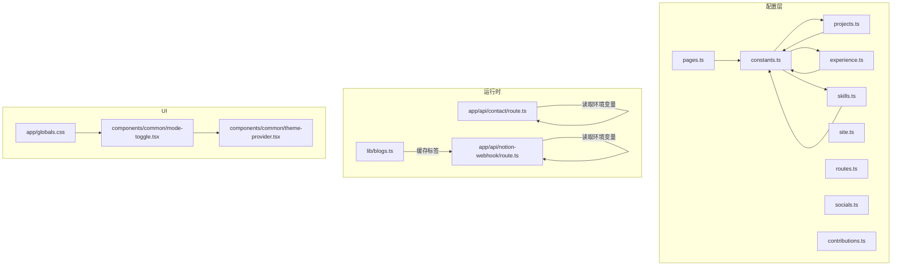
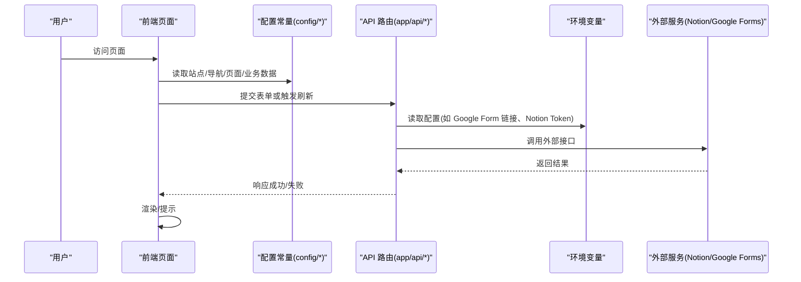
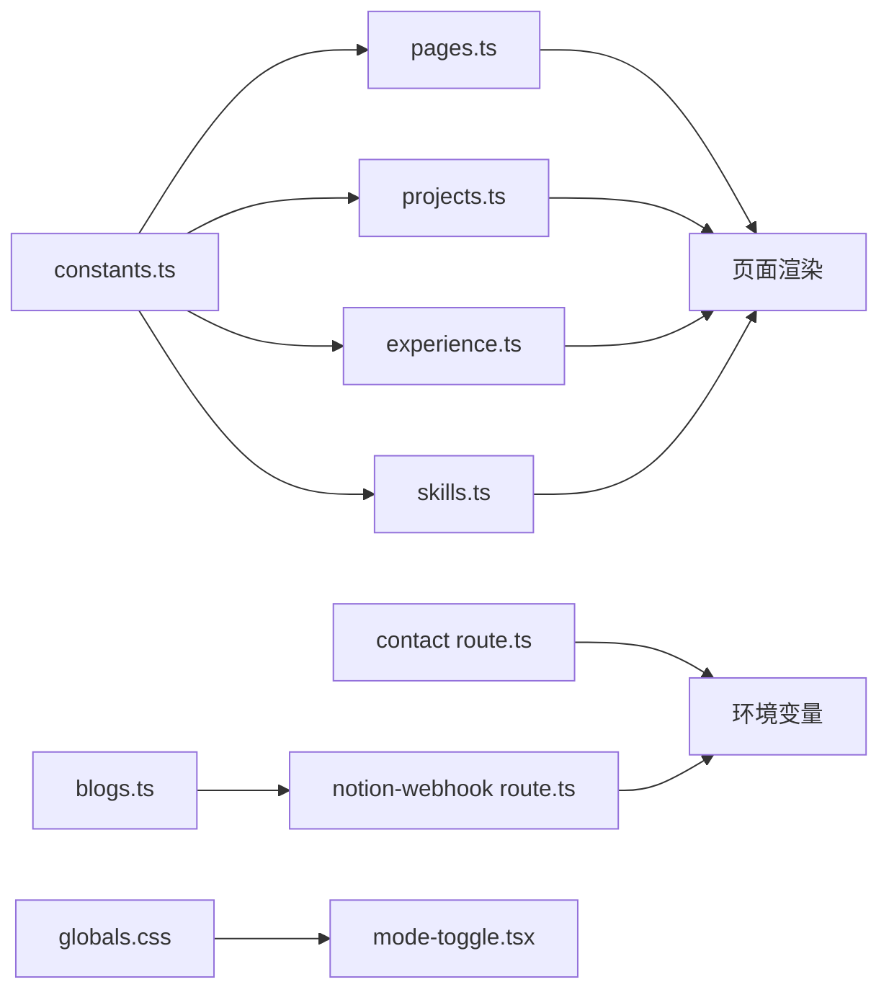

# 常量管理

<cite>
**本文引用的文件**
- [constants.ts](file://config/constants.ts)
- [site.ts](file://config/site.ts)
- [routes.ts](file://config/routes.ts)
- [pages.ts](file://config/pages.ts)
- [socials.ts](file://config/socials.ts)
- [projects.ts](file://config/projects.ts)
- [experience.ts](file://config/experience.ts)
- [skills.ts](file://config/skills.ts)
- [contributions.ts](file://config/contributions.ts)
- [blogs.ts](file://lib/blogs.ts)
- [contact route.ts](file://app/api/contact/route.ts)
- [notion-webhook route.ts](file://app/api/notion-webhook/route.ts)
- [globals.css](file://app/globals.css)
- [mode-toggle.tsx](file://components/common/mode-toggle.tsx)
- [theme-provider.tsx](file://components/common/theme-provider.tsx)
</cite>

## 目录
1. [简介](#简介)
2. [项目结构](#项目结构)
3. [核心组件](#核心组件)
4. [架构总览](#架构总览)
5. [详细组件分析](#详细组件分析)
6. [依赖关系分析](#依赖关系分析)
7. [性能考量](#性能考量)
8. [故障排查指南](#故障排查指南)
9. [结论](#结论)
10. [附录](#附录)

## 简介
本文件聚焦 Next.js 投资组合项目的“常量管理系统”，围绕 config 目录下的类型与配置常量，系统说明常量的分类组织、命名规范、类型定义与使用方式。内容涵盖：
- 领域常量（技能、类别、经验类型、页面标识）
- 站点与导航常量（站点信息、路由、社交链接）
- 业务数据常量（项目、经历、技能列表、开源贡献）
- API 端点与环境变量（联系表单、Notion Webhook、博客缓存标签）
- UI 主题常量（CSS 变量与主题切换）
并提供最佳实践、扩展方法与维护指南，帮助你在不破坏类型安全的前提下持续演进常量体系。

## 项目结构
常量与配置集中在 config 目录，按职责拆分：
- 类型常量：constants.ts
- 站点元信息：site.ts
- 导航与路由：routes.ts
- 页面元信息：pages.ts
- 社交链接：socials.ts
- 业务数据：projects.ts、experience.ts、skills.ts、contributions.ts
- 运行时配置：API 路由与环境变量（见下文）
- UI 主题：全局 CSS 变量与主题切换组件

图表来源
- [constants.ts:1-91](file://config/constants.ts#L1-L91)
- [site.ts:1-39](file://config/site.ts#L1-L39)
- [routes.ts:1-39](file://config/routes.ts#L1-L39)
- [pages.ts:1-81](file://config/pages.ts#L1-L81)
- [socials.ts:1-36](file://config/socials.ts#L1-L36)
- [projects.ts:1-422](file://config/projects.ts#L1-L422)
- [experience.ts:1-69](file://config/experience.ts#L1-L69)
- [skills.ts:1-154](file://config/skills.ts#L1-L154)
- [contributions.ts:1-48](file://config/contributions.ts#L1-L48)
- [contact route.ts:1-56](file://app/api/contact/route.ts#L1-L56)
- [notion-webhook route.ts:1-75](file://app/api/notion-webhook/route.ts#L1-L75)
- [blogs.ts:1-550](file://lib/blogs.ts#L1-L550)
- [globals.css:90-306](file://app/globals.css#L90-L306)
- [mode-toggle.tsx:34-70](file://components/common/mode-toggle.tsx#L34-L70)
- [theme-provider.tsx:1-11](file://components/common/theme-provider.tsx#L1-L11)

章节来源
- [constants.ts:1-91](file://config/constants.ts#L1-L91)
- [site.ts:1-39](file://config/site.ts#L1-L39)
- [routes.ts:1-39](file://config/routes.ts#L1-L39)
- [pages.ts:1-81](file://config/pages.ts#L1-L81)
- [socials.ts:1-36](file://config/socials.ts#L1-L36)
- [projects.ts:1-422](file://config/projects.ts#L1-L422)
- [experience.ts:1-69](file://config/experience.ts#L1-L69)
- [skills.ts:1-154](file://config/skills.ts#L1-L154)
- [contributions.ts:1-48](file://config/contributions.ts#L1-L48)

## 核心组件
- 类型常量（constants.ts）
  - 技能联合类型：ValidSkills，用于技能展示、项目技术栈、经历技能等字段约束。
  - 类别联合类型：ValidCategory，用于项目分类。
  - 经验类型：ValidExpType，区分个人/职业项目。
  - 页面标识：ValidPages，用于页面元信息映射键名。
- 站点配置（site.ts）
  - 站点名称、作者、描述、URL、社交链接、SEO 关键词、图标与封面图。
- 导航与路由（routes.ts）
  - 主导航项数组，包含标题与路径，支持禁用标记。
- 页面元信息（pages.ts）
  - 以 ValidPages 为键的页面标题、描述与 SEO 元数据集中管理。
- 社交链接（socials.ts）
  - 平台名称、用户名、图标组件、跳转链接的统一配置。
- 业务数据常量
  - 项目（projects.ts）、经历（experience.ts）、技能（skills.ts）、开源贡献（contributions.ts），均基于类型常量进行强约束。

章节来源
- [constants.ts:1-91](file://config/constants.ts#L1-L91)
- [site.ts:1-39](file://config/site.ts#L1-L39)
- [routes.ts:1-39](file://config/routes.ts#L1-L39)
- [pages.ts:1-81](file://config/pages.ts#L1-L81)
- [socials.ts:1-36](file://config/socials.ts#L1-L36)
- [projects.ts:1-422](file://config/projects.ts#L1-L422)
- [experience.ts:1-69](file://config/experience.ts#L1-L69)
- [skills.ts:1-154](file://config/skills.ts#L1-L154)
- [contributions.ts:1-48](file://config/contributions.ts#L1-L48)

## 架构总览
常量体系贯穿“类型约束 + 数据配置 + 运行时环境”三层：
- 类型层：constants.ts 提供联合类型，确保业务数据一致性与可维护性。
- 配置层：site、routes、pages、socials、projects、experience、skills、contributions 将易变内容与代码解耦。
- 运行层：API 路由通过环境变量接入第三方服务；博客模块通过缓存标签与 Webhook 实现增量更新；UI 主题通过 CSS 变量与主题切换组件驱动。

图表来源
- [routes.ts:1-39](file://config/routes.ts#L1-L39)
- [pages.ts:1-81](file://config/pages.ts#L1-L81)
- [projects.ts:1-422](file://config/projects.ts#L1-L422)
- [contact route.ts:1-56](file://app/api/contact/route.ts#L1-L56)
- [notion-webhook route.ts:1-75](file://app/api/notion-webhook/route.ts#L1-L75)
- [blogs.ts:1-550](file://lib/blogs.ts#L1-L550)

## 详细组件分析

### 类型常量（constants.ts）
- 设计要点
  - 使用 TypeScript 联合类型表达有限集合，避免魔法字符串。
  - 覆盖技能、项目类别、经验类型、页面标识四大维度。
- 复杂度与影响
  - 联合类型在编译期检查，降低运行时错误成本。
  - 新增技能/类别时，需同步更新相关配置与展示逻辑。
- 使用示例（路径引用）
  - 项目技术栈字段引用 ValidSkills。
  - 项目分类字段引用 ValidCategory。
  - 经历技能字段引用 ValidSkills。
  - 页面元信息键名引用 ValidPages。

章节来源
- [constants.ts:1-91](file://config/constants.ts#L1-L91)
- [projects.ts:1-422](file://config/projects.ts#L1-L422)
- [experience.ts:1-69](file://config/experience.ts#L1-L69)
- [pages.ts:1-81](file://config/pages.ts#L1-L81)

### 站点与导航常量（site.ts、routes.ts）
- 站点信息
  - 站点名称、作者、描述、URL、社交链接、SEO 关键词、图标与封面图集中管理，便于统一修改与 SEO 优化。
- 导航配置
  - 主导航项以数组形式声明，便于动态生成菜单与路由高亮。
- 使用建议
  - 新增站点属性时，保持命名一致并补充类型注释。
  - 导航项增加 disabled 标记可实现灰度发布或维护态控制。

章节来源
- [site.ts:1-39](file://config/site.ts#L1-L39)
- [routes.ts:1-39](file://config/routes.ts#L1-L39)

### 页面元信息（pages.ts）
- 设计要点
  - 以 ValidPages 为键，集中管理各页面的标题、描述与 SEO 元数据。
  - 保证页面元信息与路由键严格对应，避免不一致。
- 使用建议
  - 新增页面需在 constants.ts 中扩展 ValidPages，并在 pages.ts 中补齐元信息。

章节来源
- [pages.ts:1-81](file://config/pages.ts#L1-L81)
- [constants.ts:82-91](file://config/constants.ts#L82-L91)

### 社交链接（socials.ts）
- 设计要点
  - 每个社交平台一条记录，包含名称、用户名、图标组件与链接。
  - 图标来自统一图标库，便于风格一致。
- 使用建议
  - 新增平台时，遵循相同结构，并确保图标可用。

章节来源
- [socials.ts:1-36](file://config/socials.ts#L1-L36)

### 业务数据常量（projects.ts、experience.ts、skills.ts、contributions.ts）
- 项目（projects.ts）
  - 使用 ValidCategory、ValidExpType、ValidSkills 对分类、类型与技术栈进行强约束。
  - 支持多页图片与布局配置，便于详情页展示。
- 经历（experience.ts）
  - 使用 ValidSkills 约束技能列表，时间范围与成就描述结构化。
- 技能（skills.ts）
  - 技能条目包含名称、描述、评分与图标，导出排序后列表与精选列表。
- 开源贡献（contributions.ts）
  - 仓库、贡献描述、所有者与链接集中管理，支持精选展示。
- 使用建议
  - 新增项目/经历/技能时，优先复用现有类型常量，避免引入新字符串。

章节来源
- [projects.ts:1-422](file://config/projects.ts#L1-L422)
- [experience.ts:1-69](file://config/experience.ts#L1-L69)
- [skills.ts:1-154](file://config/skills.ts#L1-L154)
- [contributions.ts:1-48](file://config/contributions.ts#L1-L48)

### API 端点与环境变量
- 联系表单（app/api/contact/route.ts）
  - 从环境变量读取 Google Form 链接与各字段 ID，校验表单数据后转发提交。
  - 未配置环境变量时返回明确错误状态码。
- Notion Webhook（app/api/notion-webhook/route.ts）
  - 验证签名或接收初始 verification_token，成功后触发缓存失效与路径重验证。
- 博客缓存标签（lib/blogs.ts）
  - 定义博客缓存标签常量，供 Webhook 与缓存策略使用，确保内容更新及时生效。
- 使用建议
  - 所有敏感配置一律通过环境变量注入，不在代码中硬编码。
  - 新增第三方服务时，遵循“环境变量 + 校验 + 错误处理”的模式。

章节来源
- [contact route.ts:1-56](file://app/api/contact/route.ts#L1-L56)
- [notion-webhook route.ts:1-75](file://app/api/notion-webhook/route.ts#L1-L75)
- [blogs.ts:17-17](file://lib/blogs.ts#L17-L17)

### UI 主题常量（globals.css、mode-toggle.tsx、theme-provider.tsx）
- 主题变量（globals.css）
  - 通过 CSS 自定义属性定义多套主题（默认、暗色、复古、赛博朋克、极光、合成波、纸张等）。
  - 每套主题覆盖背景、前景、强调、边框、圆角、动画时长与缓动函数等。
- 主题切换（mode-toggle.tsx）
  - 提供主题选择菜单，调用 next-themes 设置当前主题。
- 主题提供者（theme-provider.tsx）
  - 封装 next-themes 的 ThemeProvider，作为应用根上下文。
- 使用建议
  - 新增主题时，在 globals.css 中定义完整变量集，并在切换菜单中添加入口。
  - 组件样式应通过 CSS 变量引用，而非硬编码颜色值。

章节来源
- [globals.css:90-306](file://app/globals.css#L90-L306)
- [mode-toggle.tsx:34-70](file://components/common/mode-toggle.tsx#L34-L70)
- [theme-provider.tsx:1-11](file://components/common/theme-provider.tsx#L1-L11)

## 依赖关系分析
- 类型依赖
  - projects.ts、experience.ts、skills.ts 依赖 constants.ts 中的联合类型，确保数据一致性。
  - pages.ts 依赖 ValidPages，保证页面元信息与路由键一致。
- 运行时依赖
  - API 路由依赖环境变量，连接外部服务（Google Form、Notion）。
  - 博客模块依赖缓存标签常量，配合 Webhook 实现增量更新。
- UI 依赖
  - 主题切换依赖 CSS 变量与 next-themes，组件通过主题变量获取样式。

图表来源
- [constants.ts:1-91](file://config/constants.ts#L1-L91)
- [projects.ts:1-422](file://config/projects.ts#L1-L422)
- [experience.ts:1-69](file://config/experience.ts#L1-L69)
- [skills.ts:1-154](file://config/skills.ts#L1-L154)
- [pages.ts:1-81](file://config/pages.ts#L1-L81)
- [contact route.ts:1-56](file://app/api/contact/route.ts#L1-L56)
- [notion-webhook route.ts:1-75](file://app/api/notion-webhook/route.ts#L1-L75)
- [blogs.ts:1-550](file://lib/blogs.ts#L1-L550)
- [globals.css:90-306](file://app/globals.css#L90-L306)
- [mode-toggle.tsx:34-70](file://components/common/mode-toggle.tsx#L34-L70)

## 性能考量
- 缓存与刷新
  - 博客数据通过 unstable_cache 与标签化缓存，Webhook 触发时精准失效，减少全量重建。
- 配置加载
  - 配置常量在构建期静态导入，无运行时开销；环境变量仅在服务端读取，避免泄露到客户端。
- 主题切换
  - 主题通过 CSS 变量切换，几乎零开销；next-themes 负责持久化与系统主题同步。

[本节为通用指导，无需具体文件分析]

## 故障排查指南
- 联系表单无法提交
  - 检查环境变量是否配置完整（Google Form 链接与各字段 ID）。
  - 查看 API 返回状态码与日志，定位网络或参数问题。
- Notion Webhook 无效
  - 确认已正确设置 NOTION_WEBHOOK_VERIFICATION_TOKEN。
  - 检查 x-notion-signature 头与签名验证流程。
- 博客未更新
  - 确认 Webhook 成功触发并执行了缓存标签失效。
  - 检查 NOTION_TOKEN 与 NOTION_DATA_SOURCE_ID 是否同时配置。
- 主题不生效
  - 确认 CSS 变量已定义且被主题类绑定。
  - 检查 theme-provider 是否正确包裹应用根节点。

章节来源
- [contact route.ts:1-56](file://app/api/contact/route.ts#L1-L56)
- [notion-webhook route.ts:1-75](file://app/api/notion-webhook/route.ts#L1-L75)
- [blogs.ts:1-550](file://lib/blogs.ts#L1-L550)
- [globals.css:90-306](file://app/globals.css#L90-L306)
- [theme-provider.tsx:1-11](file://components/common/theme-provider.tsx#L1-L11)

## 结论
该项目的常量管理体系以类型为核心，将易变内容与代码解耦，并通过环境变量与 API 路由对接外部服务。类型常量确保数据一致性，配置常量提升可维护性，运行时常量保障性能与可靠性。遵循本文的最佳实践，可在不破坏类型安全的前提下持续扩展与迭代。

## 附录
- 最佳实践
  - 新增领域常量时，优先扩展联合类型，避免新增字符串字面量。
  - 配置项集中管理，避免散落在组件中。
  - 环境变量仅在服务端读取，必要时暴露安全的 NEXT_PUBLIC_ 变量。
- 扩展方法
  - 新增技能/类别：在 constants.ts 扩展联合类型，并在相关业务配置中引用。
  - 新增页面：在 constants.ts 扩展 ValidPages，在 pages.ts 添加元信息。
  - 新增主题：在 globals.css 定义完整变量集，并在 mode-toggle.tsx 添加切换入口。
- 维护指南
  - 定期审查配置项的时效性与准确性。
  - 保持类型与配置的同步更新，避免漂移。
  - 对第三方服务变更（如 Notion 字段、Google Form 字段）及时适配。