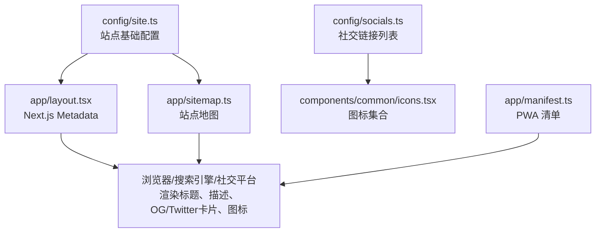
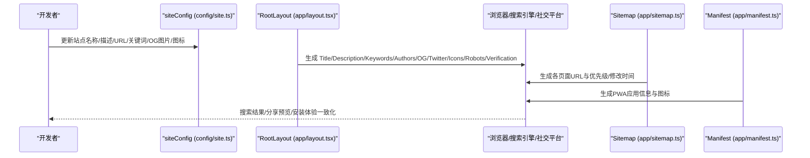
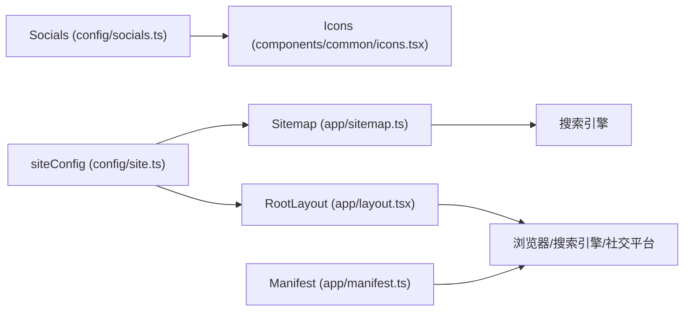

# 站点配置

<cite>
**本文引用的文件**
- [config/site.ts](file://config/site.ts)
- [app/layout.tsx](file://app/layout.tsx)
- [config/socials.ts](file://config/socials.ts)
- [components/common/icons.tsx](file://components/common/icons.tsx)
- [app/manifest.ts](file://app/manifest.ts)
- [app/sitemap.ts](file://app/sitemap.ts)
</cite>

## 目录
1. [简介](#简介)
2. [项目结构](#项目结构)
3. [核心组件](#核心组件)
4. [架构总览](#架构总览)
5. [详细组件分析](#详细组件分析)
6. [依赖关系分析](#依赖关系分析)
7. [性能与SEO建议](#性能与seo建议)
8. [故障排查指南](#故障排查指南)
9. [结论](#结论)
10. [附录：字段说明与最佳实践](#附录字段说明与最佳实践)

## 简介
本文件为 Next.js 投资组合项目的“站点配置系统”提供完整文档，聚焦于 site.ts 配置文件中的站点基本信息、社交媒体链接、SEO 优化设置与元数据配置。内容涵盖每个配置字段的作用、如何影响搜索引擎与社交分享效果、常见配置场景与最佳实践，帮助你在不改动业务代码的前提下，快速调整站点对外展示信息。

## 项目结构
站点配置由多个文件协同完成：
- config/site.ts：集中管理站点名称、作者、描述、URL、关键词、Open Graph 图片、图标等基础信息。
- app/layout.tsx：将 siteConfig 注入到 Next.js 的 Metadata 中，生成标题、描述、Open Graph、Twitter Card、图标、robots、验证信息等。
- config/socials.ts：定义站点展示的社交链接列表（名称、用户名、图标、链接），用于页面展示。
- components/common/icons.tsx：统一导出社交与功能图标，供 socials.ts 引用。
- app/manifest.ts：PWA 清单，定义应用名、描述、主题色、图标等。
- app/sitemap.ts：动态生成站点地图，基于 siteConfig.url 构建各页面 URL。

图表来源
- [config/site.ts:1-39](file://config/site.ts#L1-L39)
- [app/layout.tsx:18-85](file://app/layout.tsx#L18-L85)
- [config/socials.ts:1-36](file://config/socials.ts#L1-L36)
- [components/common/icons.tsx:90-186](file://components/common/icons.tsx#L90-L186)
- [app/manifest.ts:3-38](file://app/manifest.ts#L3-L38)
- [app/sitemap.ts:6-71](file://app/sitemap.ts#L6-L71)

章节来源
- [config/site.ts:1-39](file://config/site.ts#L1-L39)
- [app/layout.tsx:18-85](file://app/layout.tsx#L18-L85)
- [config/socials.ts:1-36](file://config/socials.ts#L1-L36)
- [components/common/icons.tsx:90-186](file://components/common/icons.tsx#L90-L186)
- [app/manifest.ts:3-38](file://app/manifest.ts#L3-L38)
- [app/sitemap.ts:6-71](file://app/sitemap.ts#L6-L71)

## 核心组件
- 站点基础配置（siteConfig）：集中维护站点名称、作者、用户名、描述、URL、社交链接、Open Graph 图片、图标、关键词等。
- 根布局元数据（layout.tsx）：将 siteConfig 映射为 Next.js Metadata，输出 title、description、keywords、authors、openGraph、twitter、icons、manifest、alternates、robots、verification 等。
- 社交链接展示（socials.ts + icons.tsx）：以结构化数组形式维护社交账号信息，并引用统一图标。
- PWA 清单（manifest.ts）：定义应用名称、短名称、描述、启动路径、显示模式、主题色、图标、分类、语言、方向、作用域等。
- 站点地图（sitemap.ts）：基于 siteConfig.url 生成首页与各子页、博客文章的 sitemap 条目。

章节来源
- [config/site.ts:1-39](file://config/site.ts#L1-L39)
- [app/layout.tsx:18-85](file://app/layout.tsx#L18-L85)
- [config/socials.ts:1-36](file://config/socials.ts#L1-L36)
- [components/common/icons.tsx:90-186](file://components/common/icons.tsx#L90-L186)
- [app/manifest.ts:3-38](file://app/manifest.ts#L3-L38)
- [app/sitemap.ts:6-71](file://app/sitemap.ts#L6-L71)

## 架构总览
站点配置通过单一事实源（siteConfig）驱动全站 SEO 与社交分享表现。根布局在构建时读取 siteConfig 并生成全局元数据；站点地图与 PWA 清单也复用同一 URL 与站点信息，确保一致性。

图表来源
- [config/site.ts:1-39](file://config/site.ts#L1-L39)
- [app/layout.tsx:18-85](file://app/layout.tsx#L18-L85)
- [app/sitemap.ts:6-71](file://app/sitemap.ts#L6-L71)
- [app/manifest.ts:3-38](file://app/manifest.ts#L3-L38)

## 详细组件分析

### 站点基础配置（config/site.ts）
- name：站点名称，作为默认标题与 OG/Twitter 标题使用。
- authorName：作者姓名，写入 authors 元信息，利于品牌归属。
- username：创作者标识，用于 Twitter creator 等。
- description：站点描述，用于 meta description 与 OG/Twitter 描述。
- url：站点根地址，作为 metadataBase、canonical、OG/Twitter 图片相对路径基准。
- links：常用外链（如 Twitter、GitHub、模板仓库），便于在 UI 或文档中引用。
- ogImage：Open Graph 分享图，建议尺寸 1200x630，提升社交分享点击率。
- iconIco / logoIcon：网站图标与快捷方式图标，影响浏览器标签页与桌面快捷方式显示。
- keywords：关键词数组，辅助搜索引擎理解站点主题。

章节来源
- [config/site.ts:1-39](file://config/site.ts#L1-L39)

### 根布局元数据（app/layout.tsx）
- metadataBase：基于 siteConfig.url 设置基础 URL，所有相对资源解析均以此为基准。
- title：默认标题与模板，保证多页面标题一致性。
- description / keywords：直接取自 siteConfig，影响搜索摘要与关键词匹配。
- authors / creator：作者与创作者信息，增强品牌与来源可信度。
- openGraph：类型、语言、URL、标题、描述、站点名、图片，决定 Facebook/微信/LinkedIn 等平台的分享预览。
- twitter：卡片类型、标题、描述、图片、创作者，决定 Twitter/X 分享样式。
- icons：icon/shortcut/apple 图标，影响浏览器标签与 iOS 主屏图标。
- manifest：指向站点 webmanifest，启用 PWA 能力。
- alternates.canonical：规范 URL，避免重复收录。
- robots：控制索引与抓取策略，支持 GoogleBot 高级指令。
- verification.google：Google 站点验证令牌，来自环境变量。

章节来源
- [app/layout.tsx:18-85](file://app/layout.tsx#L18-L85)

### 社交链接展示（config/socials.ts + components/common/icons.tsx）
- SocialLinks：结构化数组，包含 name、username、icon、link，便于统一渲染社交入口。
- Icons：集中导出社交与功能图标，socials.ts 通过 Icons 引用具体图标组件，保持 UI 一致性。

章节来源
- [config/socials.ts:1-36](file://config/socials.ts#L1-L36)
- [components/common/icons.tsx:90-186](file://components/common/icons.tsx#L90-L186)

### PWA 清单（app/manifest.ts）
- name / short_name / description：应用名称与描述，影响安装提示与商店展示。
- start_url / display / background_color / theme_color：控制启动路径、显示模式与主题色。
- icons：定义不同尺寸的图标，支持 maskable 以提升适配性。
- categories / lang / dir / scope：分类、语言、书写方向与作用域，利于平台识别与应用归类。

章节来源
- [app/manifest.ts:3-38](file://app/manifest.ts#L3-L38)

### 站点地图（app/sitemap.ts）
- 基于 siteConfig.url 构建各页面 URL，包括首页、技能、项目、经历、贡献、博客、联系、简历等。
- 博客文章通过 getAllBlogsMeta 动态获取 slug 与更新时间，生成对应 sitemap 条目。
- changeFrequency 与 priority 指导搜索引擎抓取频率与重要性。

章节来源
- [app/sitemap.ts:6-71](file://app/sitemap.ts#L6-L71)

## 依赖关系分析
- layout.tsx 依赖 siteConfig 生成全局元数据。
- sitemap.ts 依赖 siteConfig 的 url 与 blogs 元数据。
- socials.ts 依赖 icons.tsx 的图标组件。
- manifest.ts 独立定义 PWA 信息，但应与 siteConfig 保持一致的品牌与描述。

图表来源
- [config/site.ts:1-39](file://config/site.ts#L1-L39)
- [app/layout.tsx:18-85](file://app/layout.tsx#L18-L85)
- [config/socials.ts:1-36](file://config/socials.ts#L1-L36)
- [components/common/icons.tsx:90-186](file://components/common/icons.tsx#L90-L186)
- [app/manifest.ts:3-38](file://app/manifest.ts#L3-L38)
- [app/sitemap.ts:6-71](file://app/sitemap.ts#L6-L71)

章节来源
- [config/site.ts:1-39](file://config/site.ts#L1-L39)
- [app/layout.tsx:18-85](file://app/layout.tsx#L18-L85)
- [config/socials.ts:1-36](file://config/socials.ts#L1-L36)
- [components/common/icons.tsx:90-186](file://components/common/icons.tsx#L90-L186)
- [app/manifest.ts:3-38](file://app/manifest.ts#L3-L38)
- [app/sitemap.ts:6-71](file://app/sitemap.ts#L6-L71)

## 性能与SEO建议
- Open Graph 图片：建议使用 1200x630 的 PNG/JPG，压缩体积，提升加载速度与分享预览质量。
- 标题与描述：保持简洁明确，突出核心价值与关键词，避免过长导致截断。
- 关键词：精选与业务强相关的词，避免堆砌。
- robots：根据站点阶段开启/关闭索引，配合 canonical 避免重复收录。
- PWA：确保图标多尺寸与 maskable 支持，提升安装体验。
- 站点地图：及时更新博客与新增页面的 lastModified 与优先级，提高抓取效率。

[本节为通用建议，不直接分析具体文件]

## 故障排查指南
- 分享预览异常：检查 ogImage 是否可访问、尺寸是否符合推荐、alt 是否填写；确认 openGraph 与 twitter 配置正确。
- 图标不显示：确认 iconIco/logoIcon 路径有效且可被 CDN/服务器返回；检查 manifest 中图标路径与尺寸。
- 搜索引擎未收录：检查 robots 是否允许索引、canonical 是否正确、sitemap 是否包含目标页面。
- 站点验证失败：确认 NEXT_PUBLIC_GOOGLE_VERIFICATION 环境变量已正确配置并在 layout.tsx 中生效。
- 多语言/区域问题：确认 openGraph.locale 与 manifest.lang/dir 与实际站点一致。

章节来源
- [app/layout.tsx:18-85](file://app/layout.tsx#L18-L85)
- [app/manifest.ts:3-38](file://app/manifest.ts#L3-L38)
- [app/sitemap.ts:6-71](file://app/sitemap.ts#L6-L71)

## 结论
通过将站点基础信息集中在 site.ts，并在 layout.tsx 中统一注入到 Next.js Metadata，本项目实现了“一处配置、全站生效”的站点配置体系。配合 socials.ts、manifest.ts 与 sitemap.ts，确保了 SEO、社交分享与 PWA 体验的一致性。遵循本文的最佳实践与常见问题排查方法，可快速优化站点的搜索引擎可见性与社交传播效果。

[本节为总结，不直接分析具体文件]

## 附录：字段说明与最佳实践

- 站点名称（name）
  - 作用：默认标题、OG/Twitter 标题、站点名。
  - 建议：简短有力，体现个人品牌与定位。
  - 示例路径：[config/site.ts:1-39](file://config/site.ts#L1-L39)

- 作者信息（authorName）
  - 作用：写入 authors 元信息，增强来源可信度。
  - 建议：与署名一致，便于版权与品牌识别。
  - 示例路径：[config/site.ts:1-39](file://config/site.ts#L1-L39)

- 用户名（username）
  - 作用：Twitter creator、社交账号标识。
  - 建议：与主要社交平台一致，便于跨平台引流。
  - 示例路径：[config/site.ts:1-39](file://config/site.ts#L1-L39)

- 描述（description）
  - 作用：meta description、OG/Twitter 描述。
  - 建议：控制在合理长度，突出价值主张与关键词。
  - 示例路径：[config/site.ts:1-39](file://config/site.ts#L1-L39)

- URL（url）
  - 作用：metadataBase、canonical、OG/Twitter 图片基准。
  - 建议：使用正式域名，避免带 www 或不必要的参数。
  - 示例路径：[config/site.ts:1-39](file://config/site.ts#L1-L39)

- 社交链接（links）
  - 作用：常用外链（Twitter/GitHub/模板仓库）。
  - 建议：仅保留必要且活跃的平台链接。
  - 示例路径：[config/site.ts:1-39](file://config/site.ts#L1-L39)

- Open Graph 图片（ogImage）
  - 作用：社交平台分享预览图。
  - 建议：1200x630，PNG/JPG，压缩体积，alt 填写站点名。
  - 示例路径：[config/site.ts:1-39](file://config/site.ts#L1-L39)

- 图标（iconIco / logoIcon）
  - 作用：浏览器标签、桌面快捷方式、iOS 主屏图标。
  - 建议：提供多种尺寸与格式，确保清晰可辨。
  - 示例路径：[config/site.ts:1-39](file://config/site.ts#L1-L39)

- 关键词（keywords）
  - 作用：辅助搜索引擎理解站点主题。
  - 建议：精选与业务强相关词，避免堆砌。
  - 示例路径：[config/site.ts:1-39](file://config/site.ts#L1-L39)

- 根布局元数据（layout.tsx）
  - 作用：将 siteConfig 映射为全局 SEO 与社交分享元信息。
  - 建议：保持与 siteConfig 同步更新，避免不一致。
  - 示例路径：[app/layout.tsx:18-85](file://app/layout.tsx#L18-L85)

- 社交链接展示（socials.ts + icons.tsx）
  - 作用：统一渲染社交入口，提升可发现性。
  - 建议：定期校验链接有效性，保持图标与文案一致。
  - 示例路径：[config/socials.ts:1-36](file://config/socials.ts#L1-L36), [components/common/icons.tsx:90-186](file://components/common/icons.tsx#L90-L186)

- PWA 清单（manifest.ts）
  - 作用：定义应用名称、描述、主题色、图标等。
  - 建议：与站点品牌一致，提供多尺寸图标与 maskable。
  - 示例路径：[app/manifest.ts:3-38](file://app/manifest.ts#L3-L38)

- 站点地图（sitemap.ts）
  - 作用：告知搜索引擎站点结构与更新频率。
  - 建议：及时更新 lastModified，合理设置优先级。
  - 示例路径：[app/sitemap.ts:6-71](file://app/sitemap.ts#L6-L71)