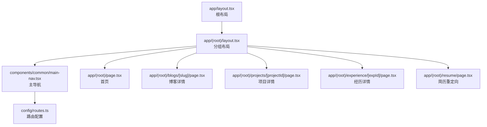
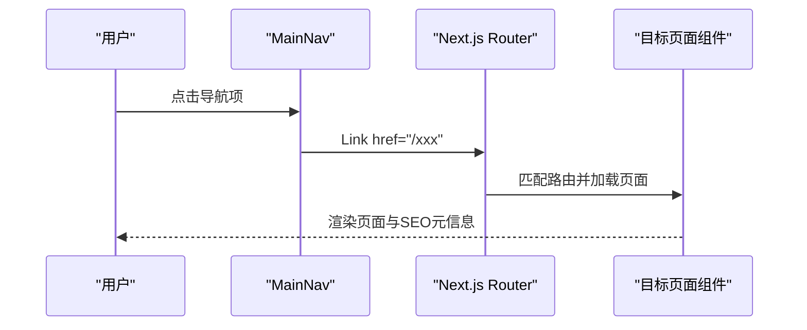
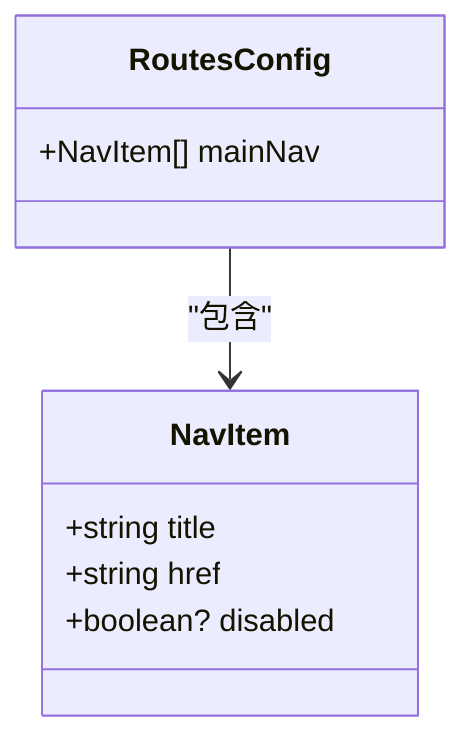
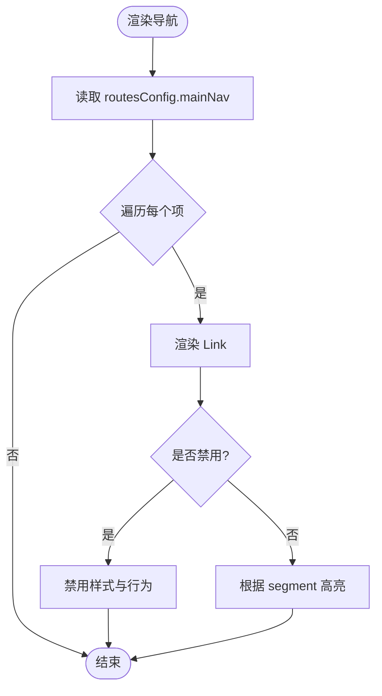
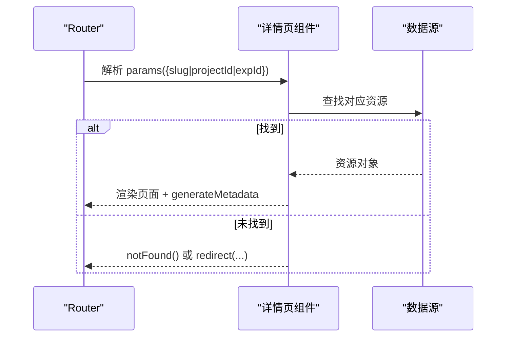
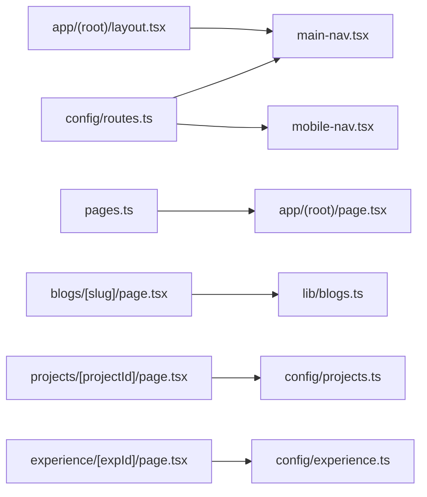

# 路由配置

<cite>
**本文引用的文件**
- [config/routes.ts](file://config/routes.ts)
- [app/(root)/layout.tsx](file://app/(root)/layout.tsx)
- [components/common/main-nav.tsx](file://components/common/main-nav.tsx)
- [components/common/mobile-nav.tsx](file://components/common/mobile-nav.tsx)
- [config/pages.ts](file://config/pages.ts)
- [config/constants.ts](file://config/constants.ts)
- [app/layout.tsx](file://app/layout.tsx)
- [app/(root)/page.tsx](file://app/(root)/page.tsx)
- [app/(root)/blogs/[slug]/page.tsx](file://app/(root)/blogs/[slug]/page.tsx)
- [app/(root)/projects/[projectId]/page.tsx](file://app/(root)/projects/[projectId]/page.tsx)
- [app/(root)/experience/[expId]/page.tsx](file://app/(root)/experience/[expId]/page.tsx)
- [app/(root)/resume/page.tsx](file://app/(root)/resume/page.tsx)
</cite>

## 目录
1. [简介](#简介)
2. [项目结构](#项目结构)
3. [核心组件](#核心组件)
4. [架构总览](#架构总览)
5. [详细组件分析](#详细组件分析)
6. [依赖关系分析](#依赖关系分析)
7. [性能考虑](#性能考虑)
8. [故障排除指南](#故障排除指南)
9. [结论](#结论)
10. [附录](#附录)

## 简介
本文件为 Next.js App Router 投资组合项目的“路由配置”文档，聚焦于 routes.ts 中的路由定义、导航结构与页面组织方式。内容涵盖：
- 路由配置的语法与数据模型
- 路由参数传递（动态路由）与嵌套路由的组织
- 重定向逻辑与基础权限控制思路
- 与 Next.js App Router 的集成方式
- 最佳实践、性能优化建议与常见问题排查

## 项目结构
本项目采用 Next.js App Router 的目录式路由约定：
- 根布局位于 app/layout.tsx，提供全局主题、元信息、分析与脚本注入
- 营销/作品集区域使用分组路由 (root)，其布局在 app/(root)/layout.tsx，集中渲染头部导航、主体内容与页脚
- 静态页面与动态页面分别以 page.tsx 实现；动态段通过文件夹命名如 [slug]、[projectId]、[expId] 声明
- 导航项与路由配置集中在 config/routes.ts，供布局与导航组件复用
- 页面元信息与文案集中在 config/pages.ts，配合常量类型约束

图表来源
- [app/layout.tsx:1-131](file://app/layout.tsx#L1-L131)
- [app/(root)/layout.tsx:1-33](file://app/(root)/layout.tsx#L1-L33)
- [components/common/main-nav.tsx:1-99](file://components/common/main-nav.tsx#L1-L99)
- [config/routes.ts:1-39](file://config/routes.ts#L1-L39)
- [app/(root)/page.tsx:1-354](file://app/(root)/page.tsx#L1-L354)
- [app/(root)/blogs/[slug]/page.tsx:1-322](file://app/(root)/blogs/[slug]/page.tsx#L1-L322)
- [app/(root)/projects/[projectId]/page.tsx:1-214](file://app/(root)/projects/[projectId]/page.tsx#L1-L214)
- [app/(root)/experience/[expId]/page.tsx:1-210](file://app/(root)/experience/[expId]/page.tsx#L1-L210)
- [app/(root)/resume/page.tsx:1-5](file://app/(root)/resume/page.tsx#L1-L5)

章节来源
- [app/layout.tsx:1-131](file://app/layout.tsx#L1-L131)
- [app/(root)/layout.tsx:1-33](file://app/(root)/layout.tsx#L1-L33)
- [config/routes.ts:1-39](file://config/routes.ts#L1-L39)

## 核心组件
- 路由配置中心：config/routes.ts
  - 定义 NavItem 与 RoutesConfig 接口，维护 mainNav 列表，统一入口到各页面
  - 支持 title、href、disabled 字段，便于禁用或占位
- 导航组件：components/common/main-nav.tsx 与 components/common/mobile-nav.tsx
  - 桌面端与移动端共用同一套 items，基于 Next.js Link 进行客户端导航
  - 使用 useSelectedLayoutSegment 与 usePathname 高亮当前段并关闭移动端菜单
- 分组布局：app/(root)/layout.tsx
  - 将 routesConfig.mainNav 注入 MainNav，形成统一的顶部导航
- 页面元信息：config/pages.ts
  - 集中管理页面标题与描述，配合各页面的 Metadata 输出

章节来源
- [config/routes.ts:1-39](file://config/routes.ts#L1-L39)
- [components/common/main-nav.tsx:1-99](file://components/common/main-nav.tsx#L1-L99)
- [components/common/mobile-nav.tsx:1-49](file://components/common/mobile-nav.tsx#L1-L49)
- [app/(root)/layout.tsx:1-33](file://app/(root)/layout.tsx#L1-L33)
- [config/pages.ts:1-81](file://config/pages.ts#L1-L81)

## 架构总览
Next.js App Router 通过文件系统映射 URL 到页面组件。本项目将“可配置的主导航”与“页面路由”解耦：
- 路由配置（routes.ts）仅关注“有哪些导航项”，不关心具体实现
- 布局（(root)/layout.tsx）负责装配导航与内容区
- 页面（page.tsx）负责渲染与 SEO 元信息
- 动态路由通过方括号段声明，服务端组件中通过 params 获取参数

图表来源
- [components/common/main-nav.tsx:34-83](file://components/common/main-nav.tsx#L34-L83)
- [app/(root)/layout.tsx:11-31](file://app/(root)/layout.tsx#L11-L31)
- [app/(root)/blogs/[slug]/page.tsx:21-84](file://app/(root)/blogs/[slug]/page.tsx#L21-L84)
- [app/(root)/projects/[projectId]/page.tsx:22-43](file://app/(root)/projects/[projectId]/page.tsx#L22-L43)
- [app/(root)/experience/[expId]/page.tsx:23-46](file://app/(root)/experience/[expId]/page.tsx#L23-L46)

## 详细组件分析

### 路由配置与导航数据结构
- 数据结构
  - NavItem：包含 title、href、可选 disabled
  - RoutesConfig：包含 mainNav 数组
- 用途
  - 作为单一事实源，驱动桌面与移动端导航
  - 便于统一修改、扩展与测试

图表来源
- [config/routes.ts:1-39](file://config/routes.ts#L1-L39)

章节来源
- [config/routes.ts:1-39](file://config/routes.ts#L1-L39)

### 导航组件与高亮逻辑
- 桌面导航 MainNav
  - 接收 items 并渲染 Link
  - 使用 useSelectedLayoutSegment 判断当前段，结合 item.href.startsWith(`/${segment}`) 高亮
  - 支持 disabled 状态禁用链接
- 移动端导航 MobileNav
  - 复用同一 items，固定全屏覆盖层，滚动锁定
  - 同样支持 disabled 状态

图表来源
- [components/common/main-nav.tsx:34-83](file://components/common/main-nav.tsx#L34-L83)
- [components/common/mobile-nav.tsx:15-45](file://components/common/mobile-nav.tsx#L15-L45)

章节来源
- [components/common/main-nav.tsx:1-99](file://components/common/main-nav.tsx#L1-L99)
- [components/common/mobile-nav.tsx:1-49](file://components/common/mobile-nav.tsx#L1-L49)

### 分组布局与页面组织
- 根布局 app/layout.tsx
  - 设置全局字体、主题、分析与脚本
- 分组布局 app/(root)/layout.tsx
  - 注入 routesConfig.mainNav 到 MainNav
  - 包裹 <main>{children}</main>，承载所有 (root) 下的页面

章节来源
- [app/layout.tsx:1-131](file://app/layout.tsx#L1-L131)
- [app/(root)/layout.tsx:1-33](file://app/(root)/layout.tsx#L1-L33)

### 动态路由与参数传递
- 博客详情 /blogs/[slug]
  - 使用 generateStaticParams 预生成 slugs
  - 服务端组件通过 params 获取 slug，查询文章并返回 Metadata
  - 未找到时调用 notFound()
- 项目详情 /projects/[projectId]
  - generateStaticParams 基于 Projects 列表生成
  - 未找到时 redirect 到 /projects
- 经历详情 /experience/[expId]
  - generateStaticParams 基于 experiences 列表生成
  - 未找到时 redirect 到 /experience

图表来源
- [app/(root)/blogs/[slug]/page.tsx:21-92](file://app/(root)/blogs/[slug]/page.tsx#L21-L92)
- [app/(root)/projects/[projectId]/page.tsx:22-50](file://app/(root)/projects/[projectId]/page.tsx#L22-L50)
- [app/(root)/experience/[expId]/page.tsx:23-56](file://app/(root)/experience/[expId]/page.tsx#L23-L56)

章节来源
- [app/(root)/blogs/[slug]/page.tsx:1-322](file://app/(root)/blogs/[slug]/page.tsx#L1-L322)
- [app/(root)/projects/[projectId]/page.tsx:1-214](file://app/(root)/projects/[projectId]/page.tsx#L1-L214)
- [app/(root)/experience/[expId]/page.tsx:1-210](file://app/(root)/experience/[expId]/page.tsx#L1-L210)

### 重定向与基础权限控制
- 简历重定向：app/(root)/resume/page.tsx
  - 直接 redirect 到环境变量指定的外部链接或回退路径
- 动态路由未命中时的处理
  - 博客：notFound()
  - 项目/经历：redirect 到列表页
- 权限控制建议（通用方案）
  - 在服务端组件中校验登录态或角色后，使用 redirect/notFound
  - 或使用中间件 next-intl/next-auth 等框架提供的鉴权能力
  - 注意：本项目未内置鉴权中间件，可按需添加

章节来源
- [app/(root)/resume/page.tsx:1-5](file://app/(root)/resume/page.tsx#L1-L5)
- [app/(root)/blogs/[slug]/page.tsx:86-92](file://app/(root)/blogs/[slug]/page.tsx#L86-L92)
- [app/(root)/projects/[projectId]/page.tsx:45-50](file://app/(root)/projects/[projectId]/page.tsx#L45-L50)
- [app/(root)/experience/[expId]/page.tsx:48-56](file://app/(root)/experience/[expId]/page.tsx#L48-L56)

### 路由与 SEO 元信息
- 根布局与站点级元信息：app/layout.tsx
  - 设置 metadataBase、title、description、OpenGraph、Twitter、robots、验证等
- 页面级元信息：各 page.tsx 导出 generateMetadata
  - 动态路由根据 params 生成个性化标题、描述、canonical、OG 图片等
- 结构化数据：部分页面注入 JSON-LD（如博客文章、面包屑）

章节来源
- [app/layout.tsx:18-85](file://app/layout.tsx#L18-L85)
- [app/(root)/blogs/[slug]/page.tsx:26-84](file://app/(root)/blogs/[slug]/page.tsx#L26-L84)
- [app/(root)/projects/[projectId]/page.tsx:26-43](file://app/(root)/projects/[projectId]/page.tsx#L26-L43)
- [app/(root)/experience/[expId]/page.tsx:27-46](file://app/(root)/experience/[expId]/page.tsx#L27-L46)

## 依赖关系分析
- 导航依赖路由配置：MainNav/MobileNav 依赖 config/routes.ts 的 NavItem/RoutesConfig
- 布局依赖导航与配置：(root)/layout.tsx 注入 routesConfig.mainNav
- 页面依赖数据与工具：各动态页面依赖各自的数据源与工具函数
- 类型约束：config/constants.ts 提供 ValidPages 等类型，用于 pages.ts 的类型安全

图表来源
- [config/routes.ts:1-39](file://config/routes.ts#L1-L39)
- [components/common/main-nav.tsx:1-99](file://components/common/main-nav.tsx#L1-L99)
- [components/common/mobile-nav.tsx:1-49](file://components/common/mobile-nav.tsx#L1-L49)
- [app/(root)/layout.tsx:1-33](file://app/(root)/layout.tsx#L1-L33)
- [config/pages.ts:1-81](file://config/pages.ts#L1-L81)
- [app/(root)/page.tsx:1-354](file://app/(root)/page.tsx#L1-L354)
- [app/(root)/blogs/[slug]/page.tsx:1-322](file://app/(root)/blogs/[slug]/page.tsx#L1-L322)
- [app/(root)/projects/[projectId]/page.tsx:1-214](file://app/(root)/projects/[projectId]/page.tsx#L1-L214)
- [app/(root)/experience/[expId]/page.tsx:1-210](file://app/(root)/experience/[expId]/page.tsx#L1-L210)

章节来源
- [config/constants.ts:1-91](file://config/constants.ts#L1-L91)
- [config/pages.ts:1-81](file://config/pages.ts#L1-L81)

## 性能考虑
- 预生成静态参数
  - 动态路由使用 generateStaticParams 预构建，减少首屏请求与运行时开销
  - 适用于项目、经历、博客等数据量可控的场景
- 元信息与服务端渲染
  - 利用服务端组件与 generateMetadata 在构建期或请求期生成 SEO 元信息，提升首屏质量
- 导航交互
  - 使用 Next.js Link 进行客户端导航，避免整页刷新
  - 移动端菜单在路由变化时自动关闭，减少多余渲染
- 资源与样式
  - 根布局集中注入主题与脚本，减少重复加载
  - 合理使用优先级与懒加载策略（如图片）

## 故障排除指南
- 动态路由 404
  - 检查 generateStaticParams 是否正确返回参数集合
  - 检查页面内数据查找逻辑，未找到时调用 notFound() 或 redirect
- 导航高亮异常
  - 确认 useSelectedLayoutSegment 返回值与 item.href 前缀匹配逻辑一致
  - 确保路由层级与分组路由一致
- 重定向循环
  - 检查 resume 或其他重定向页面是否指向了自身或错误路径
- SEO 元信息缺失
  - 确认 generateMetadata 正确导出且能访问 params
  - 检查 canonical、OG、Twitter 卡片配置

章节来源
- [app/(root)/blogs/[slug]/page.tsx:21-92](file://app/(root)/blogs/[slug]/page.tsx#L21-L92)
- [app/(root)/projects/[projectId]/page.tsx:22-50](file://app/(root)/projects/[projectId]/page.tsx#L22-L50)
- [app/(root)/experience/[expId]/page.tsx:23-56](file://app/(root)/experience/[expId]/page.tsx#L23-L56)
- [components/common/main-nav.tsx:34-83](file://components/common/main-nav.tsx#L34-L83)
- [app/(root)/resume/page.tsx:1-5](file://app/(root)/resume/page.tsx#L1-L5)

## 结论
本项目通过集中化的路由配置与 App Router 的文件系统路由约定，实现了清晰的路由组织与可扩展的导航体系。动态路由借助 generateStaticParams 与 params 完成参数传递与 SEO 元信息生成，并在未命中时提供合理的重定向或 404 处理。建议在后续迭代中引入服务端鉴权中间件以实现更完善的权限控制，同时持续优化静态参数生成范围与资源加载策略以提升性能。

## 附录
- 路由最佳实践
  - 将导航与路由配置解耦，保持单一事实源
  - 使用 generateStaticParams 预构建动态路由，提高性能与 SEO
  - 在服务端组件中进行数据获取与权限校验，减少客户端负担
  - 为每个页面提供准确的 generateMetadata，包括 canonical、OG、Twitter 卡片
- 与 Next.js App Router 的集成要点
  - 使用分组路由 (root) 隔离不同业务区域的布局
  - 使用方括号段声明动态路由，并通过 Promise<params> 异步获取参数
  - 使用 redirect/notFound 处理无效路径与权限不足场景