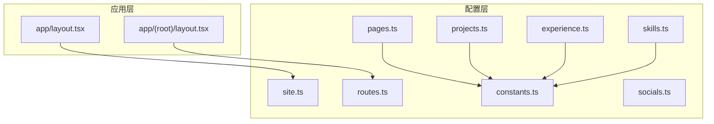
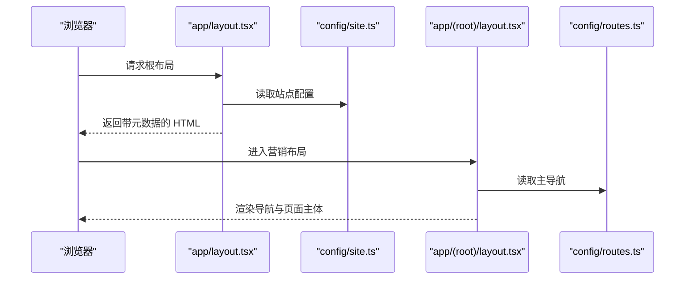
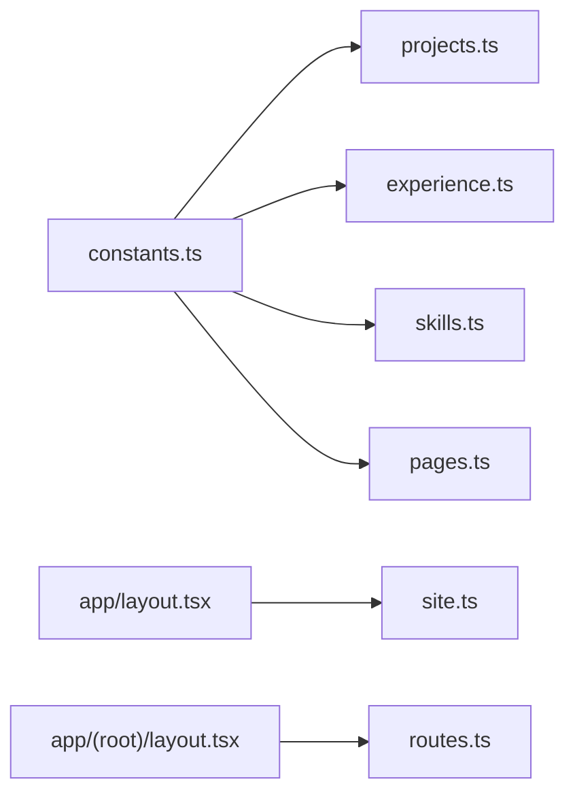

# 配置管理

<cite>
**本文引用的文件**
- [config/site.ts](file://config/site.ts)
- [config/routes.ts](file://config/routes.ts)
- [config/pages.ts](file://config/pages.ts)
- [config/constants.ts](file://config/constants.ts)
- [config/projects.ts](file://config/projects.ts)
- [config/experience.ts](file://config/experience.ts)
- [config/skills.ts](file://config/skills.ts)
- [config/socials.ts](file://config/socials.ts)
- [app/layout.tsx](file://app/layout.tsx)
- [app/(root)/layout.tsx](file://app/(root)/layout.tsx)
</cite>

## 目录
1. [简介](#简介)
2. [项目结构](#项目结构)
3. [核心组件](#核心组件)
4. [架构总览](#架构总览)
5. [详细组件分析](#详细组件分析)
6. [依赖关系分析](#依赖关系分析)
7. [性能与可维护性建议](#性能与可维护性建议)
8. [故障排除指南](#故障排除指南)
9. [结论](#结论)
10. [附录：字段说明与修改指引](#附录字段说明与修改指引)

## 简介
本仓库采用“配置即数据”的方式组织站点内容，所有页面文案、导航、项目、经历、技能、社交链接等均以 TypeScript 配置文件集中管理。通过类型约束与结构化数据，降低页面与内容的耦合度，提升可维护性与扩展性。本文档聚焦配置管理系统，覆盖站点配置、路由配置、页面配置与常量管理的结构与用途，并提供字段含义、默认值、可选值、验证规则、最佳实践、常见场景与排错指南。

## 项目结构
配置集中在 config 目录下，按领域拆分：
- 站点基础信息与 SEO：site.ts
- 全局元数据与主题：app/layout.tsx（引用 site.ts）
- 导航与路由：routes.ts
- 页面级标题与描述：pages.ts
- 业务数据：projects.ts、experience.ts、skills.ts、contributions.ts、socials.ts
- 类型常量：constants.ts（用于校验技能、分类、经验类型、页面键名）

图表来源
- [config/site.ts:1-39](file://config/site.ts#L1-L39)
- [config/routes.ts:1-39](file://config/routes.ts#L1-L39)
- [config/pages.ts:1-81](file://config/pages.ts#L1-L81)
- [config/constants.ts:1-91](file://config/constants.ts#L1-L91)
- [config/projects.ts:1-422](file://config/projects.ts#L1-L422)
- [config/experience.ts:1-69](file://config/experience.ts#L1-L69)
- [config/skills.ts:1-154](file://config/skills.ts#L1-L154)
- [config/socials.ts:1-36](file://config/socials.ts#L1-L36)
- [app/layout.tsx:1-131](file://app/layout.tsx#L1-L131)
- [app/(root)/layout.tsx:1-33](file://app/(root)/layout.tsx#L1-L33)

章节来源
- [config/site.ts:1-39](file://config/site.ts#L1-L39)
- [config/routes.ts:1-39](file://config/routes.ts#L1-L39)
- [config/pages.ts:1-81](file://config/pages.ts#L1-L81)
- [config/constants.ts:1-91](file://config/constants.ts#L1-L91)
- [config/projects.ts:1-422](file://config/projects.ts#L1-L422)
- [config/experience.ts:1-69](file://config/experience.ts#L1-L69)
- [config/skills.ts:1-154](file://config/skills.ts#L1-L154)
- [config/socials.ts:1-36](file://config/socials.ts#L1-L36)
- [app/layout.tsx:1-131](file://app/layout.tsx#L1-L131)
- [app/(root)/layout.tsx:1-33](file://app/(root)/layout.tsx#L1-L33)

## 核心组件
- 站点配置（site.ts）：定义站点名称、作者、域名、SEO 关键词、Open Graph/Twitter 图片、图标等，被根布局用于生成全局元数据。
- 路由配置（routes.ts）：定义主导航项，供根布局渲染导航栏。
- 页面配置（pages.ts）：为每个页面提供标题、描述与元信息，配合常量 ValidPages 进行键名校验。
- 常量（constants.ts）：统一技能、分类、经验类型、页面键名的字面量类型，确保配置一致性。
- 业务数据配置：
  - 项目（projects.ts）：项目列表、技术栈、时间、图片画廊、详细描述等。
  - 经历（experience.ts）：工作经历/教育经历，包含职责、成就、技能等。
  - 技能（skills.ts）：技能清单、评分、图标与描述。
  - 社交（socials.ts）：社交平台链接与用户名。
  - 贡献（contributions.ts）：开源贡献记录。

章节来源
- [config/site.ts:1-39](file://config/site.ts#L1-L39)
- [config/routes.ts:1-39](file://config/routes.ts#L1-L39)
- [config/pages.ts:1-81](file://config/pages.ts#L1-L81)
- [config/constants.ts:1-91](file://config/constants.ts#L1-L91)
- [config/projects.ts:1-422](file://config/projects.ts#L1-L422)
- [config/experience.ts:1-69](file://config/experience.ts#L1-L69)
- [config/skills.ts:1-154](file://config/skills.ts#L1-L154)
- [config/socials.ts:1-36](file://config/socials.ts#L1-L36)

## 架构总览
配置数据自上而下驱动 UI：
- 根布局 app/layout.tsx 读取 siteConfig 生成 metadata（标题、描述、OG、Twitter、图标、robots、canonical 等）。
- 根组布局 app/(root)/layout.tsx 读取 routesConfig.mainNav 渲染导航。
- 各页面根据 pagesConfig 的键名获取标题与描述。
- 业务模块（项目、经历、技能、社交、贡献）由各自配置文件提供数据，受 constants.ts 的类型约束。

图表来源
- [app/layout.tsx:18-85](file://app/layout.tsx#L18-L85)
- [config/site.ts:1-39](file://config/site.ts#L1-L39)
- [app/(root)/layout.tsx:11-31](file://app/(root)/layout.tsx#L11-L31)
- [config/routes.ts:11-38](file://config/routes.ts#L11-L38)

## 详细组件分析

### 站点配置（site.ts）
- 作用：集中站点品牌与 SEO 相关的基础信息，被根布局用于构建全局元数据。
- 关键字段与含义
  - name：站点名称，用作默认标题与 OG/Twitter 标题。
  - authorName：作者名，用于 authors 元信息。
  - username：创建者标识，用于 Twitter creator。
  - description：站点描述，用于 meta description 与 OG/Twitter 描述。
  - url：站点基址，用于 metadataBase、OG URL、manifest 路径、canonical。
  - links：社交与模板仓库链接（如 twitter、github、templateRepo）。
  - ogImage：Open Graph 分享图。
  - iconIco / logoIcon：网站图标与快捷方式图标。
  - keywords：SEO 关键词数组。
- 默认值与可选值
  - 上述字段均为必需；若缺失将影响 SEO 或展示异常。
- 验证规则
  - 无运行时校验；建议在部署前人工核对关键 URL 与图片地址。
- 修改方法
  - 在 config/site.ts 中更新对应字段；如需新增社交链接，可在 links 对象中添加新键。
- 使用位置
  - app/layout.tsx 中通过 siteConfig 设置 metadata 与 manifest、canonical、icons 等。

章节来源
- [config/site.ts:1-39](file://config/site.ts#L1-L39)
- [app/layout.tsx:18-85](file://app/layout.tsx#L18-L85)

### 路由配置（routes.ts）
- 作用：定义主导航项，供营销布局渲染顶部导航。
- 数据结构
  - NavItem：title（显示文本）、href（路由路径）、disabled（可选，禁用状态）。
  - RoutesConfig：mainNav（NavItem[]）。
- 默认值与可选值
  - mainNav 为必填；NavItem.disabled 为可选。
- 验证规则
  - href 需与 Next.js App Router 路由匹配，否则点击无效。
- 修改方法
  - 在 routesConfig.mainNav 中增删改项；保持顺序以控制导航顺序。
- 使用位置
  - app/(root)/layout.tsx 中将 items={routesConfig.mainNav} 传递给 MainNav。

章节来源
- [config/routes.ts:1-39](file://config/routes.ts#L1-L39)
- [app/(root)/layout.tsx:11-31](file://app/(root)/layout.tsx#L11-L31)

### 页面配置（pages.ts）
- 作用：为每个页面提供标题、描述与元信息，便于 SEO 与页面头部展示。
- 数据结构
  - PagesConfig：键名为 ValidPages（home、skills、projects、experience、contact、contributions、resume、blogs），值为 { title, description, metadata }。
- 默认值与可选值
  - 每个页面必须提供 title、description、metadata.title、metadata.description。
- 验证规则
  - 键名受 ValidPages 限制；新增页面需在 constants.ts 中扩展 ValidPages，并在 pages.ts 添加对应条目。
- 修改方法
  - 在 pagesConfig 中更新对应页面的文案；保持键名与路由一致。
- 使用位置
  - 页面组件可根据当前路由从 pagesConfig 读取标题与描述。

章节来源
- [config/pages.ts:1-81](file://config/pages.ts#L1-L81)
- [config/constants.ts:82-91](file://config/constants.ts#L82-L91)

### 常量（constants.ts）
- 作用：集中定义技能、分类、经验类型、页面键名的字面量类型，保证配置一致性。
- 主要类型
  - ValidSkills：技能白名单，用于 skills.ts、projects.ts、experience.ts。
  - ValidCategory：项目分类，用于 projects.ts。
  - ValidExpType：经验类型（Personal/Professional），用于 projects.ts、experience.ts。
  - ValidPages：页面键名，用于 pages.ts。
- 默认值与可选值
  - 类型为枚举式字面量，不允许超出范围的值。
- 验证规则
  - TypeScript 编译期检查；新增技能/分类/页面需在相应类型中追加。
- 修改方法
  - 在对应类型末尾追加新的字面量；注意大小写与空格保持一致。

章节来源
- [config/constants.ts:1-91](file://config/constants.ts#L1-L91)

### 项目配置（projects.ts）
- 作用：集中项目数据，包括基本信息、技术栈、时间线、公司 Logo、多段描述与多图画廊。
- 关键接口与字段
  - ProjectInterface：id、type、companyName、category、shortDescription、websiteLink、githubLink、techStack、startDate、endDate、companyLogoImg、descriptionDetails（paragraphs、bullets）、pagesInfoArr（title、images、description、layout、source）。
  - ProjectImageInterface：src、alt、width、height、display（full/compact）。
  - ProjectTechnology：基于 ValidSkills 并扩展若干后端/云原生/工具链技能。
- 默认值与可选值
  - websiteLink、githubLink、description、layout、source、display 等为可选。
- 验证规则
  - type 必须为 ValidExpType；category 为 ValidCategory[]；techStack 元素必须在允许集合内。
- 修改方法
  - 在 Projects 数组中新增或编辑项目；gallery 图片路径需位于 public 下。
  - 新增技术栈需在 ProjectTechnology 联合类型中补充。
- 使用位置
  - 项目列表页与详情页读取该配置渲染卡片与详情画廊。

章节来源
- [config/projects.ts:1-422](file://config/projects.ts#L1-L422)
- [config/constants.ts:1-91](file://config/constants.ts#L1-L91)

### 经历配置（experience.ts）
- 作用：集中个人经历（工作/教育），包含职责、成就、技能与公司信息。
- 关键接口与字段
  - ExperienceInterface：id、position、company、location、startDate、endDate（可为 Date|"Present"）、description、achievements、skills、companyUrl、logo。
- 默认值与可选值
  - companyUrl、logo 为可选；endDate 支持字符串 "Present"。
- 验证规则
  - skills 元素必须属于 ValidSkills。
- 修改方法
  - 在 experiences 数组中新增或编辑条目；日期格式需符合 ISO 字符串。
- 使用位置
  - 经历页面渲染时间线与卡片。

章节来源
- [config/experience.ts:1-69](file://config/experience.ts#L1-L69)
- [config/constants.ts:1-91](file://config/constants.ts#L1-L91)

### 技能配置（skills.ts）
- 作用：集中技能清单，包含名称、描述、评分与图标。
- 关键接口与字段
  - SkillsInterface：name、description、rating、icon（React 组件）。
- 默认值与可选值
  - rating 为数字；icon 来自统一图标库。
- 验证规则
  - name 建议与 ValidSkills 保持一致，便于跨模块复用。
- 修改方法
  - 在 skillsUnsorted 中新增/调整条目；最终 skills 会按 rating 降序排序，featuredSkills 取前 6。
- 使用位置
  - 技能页面展示评分与图标。

章节来源
- [config/skills.ts:1-154](file://config/skills.ts#L1-L154)
- [config/constants.ts:1-91](file://config/constants.ts#L1-L91)

### 社交配置（socials.ts）
- 作用：集中社交账号与联系方式，便于在页脚或侧边展示。
- 关键接口与字段
  - SocialInterface：name、username、icon、link。
- 默认值与可选值
  - 全部为必填；link 可为 https 或 mailto。
- 验证规则
  - 无运行时校验；请确保链接有效。
- 修改方法
  - 在 SocialLinks 数组中增删改；图标来自统一 Icons。
- 使用位置
  - 页脚或联系区域渲染社交图标与链接。

章节来源
- [config/socials.ts:1-36](file://config/socials.ts#L1-L36)

### 贡献配置（contributions.ts）
- 作用：集中开源贡献记录，便于展示社区参与。
- 关键接口与字段
  - ContributionsInterface：repo、contributionDescription、repoOwner、link。
- 默认值与可选值
  - 全部为必填。
- 修改方法
  - 在 contributionsUnsorted 中新增条目；featuredContributions 自动取前 3。
- 使用位置
  - 贡献页面展示贡献列表。

章节来源
- [config/contributions.ts:1-48](file://config/contributions.ts#L1-L48)

## 依赖关系分析
- 类型依赖
  - projects.ts、experience.ts、skills.ts 均依赖 constants.ts 中的 ValidSkills、ValidCategory、ValidExpType。
  - pages.ts 依赖 constants.ts 的 ValidPages 作为键名校验。
- 运行时依赖
  - app/layout.tsx 依赖 site.ts 生成全局元数据。
  - app/(root)/layout.tsx 依赖 routes.ts 渲染导航。
- 潜在循环依赖
  - 当前配置之间无循环导入；保持单向依赖有利于维护。

图表来源
- [config/constants.ts:1-91](file://config/constants.ts#L1-L91)
- [config/projects.ts:1-422](file://config/projects.ts#L1-L422)
- [config/experience.ts:1-69](file://config/experience.ts#L1-L69)
- [config/skills.ts:1-154](file://config/skills.ts#L1-L154)
- [config/pages.ts:1-81](file://config/pages.ts#L1-L81)
- [config/site.ts:1-39](file://config/site.ts#L1-L39)
- [config/routes.ts:1-39](file://config/routes.ts#L1-L39)
- [app/layout.tsx:18-85](file://app/layout.tsx#L18-L85)
- [app/(root)/layout.tsx:11-31](file://app/(root)/layout.tsx#L11-L31)

章节来源
- [config/constants.ts:1-91](file://config/constants.ts#L1-L91)
- [config/projects.ts:1-422](file://config/projects.ts#L1-L422)
- [config/experience.ts:1-69](file://config/experience.ts#L1-L69)
- [config/skills.ts:1-154](file://config/skills.ts#L1-L154)
- [config/pages.ts:1-81](file://config/pages.ts#L1-L81)
- [config/site.ts:1-39](file://config/site.ts#L1-L39)
- [config/routes.ts:1-39](file://config/routes.ts#L1-L39)
- [app/layout.tsx:18-85](file://app/layout.tsx#L18-L85)
- [app/(root)/layout.tsx:11-31](file://app/(root)/layout.tsx#L11-L31)

## 性能与可维护性建议
- 配置分块与命名
  - 已按领域拆分，建议保持单一职责；避免在单个文件中堆砌无关配置。
- 类型优先
  - 新增字段时优先定义类型，再填充数据，减少运行时错误。
- 资源路径
  - 图片等资源放在 public 下，并通过相对路径引用，便于静态托管。
- 元数据一致性
  - 站点名称、描述、关键词在 site.ts 中维护，避免多处重复。
- 导航与路由一致性
  - routes.ts 的 href 需与实际路由一致；新增路由后同步更新导航。
- 分页与展示
  - featuredProjects、featuredSkills、featuredContributions 用于精选展示，避免首屏过大。

[本节为通用建议，不直接分析具体文件]

## 故障排除指南
- 导航点击无效
  - 检查 routes.ts 中 href 是否与 Next.js 路由匹配；确认 app 目录下存在对应路由文件。
- 页面标题/描述未生效
  - 检查 pages.ts 中对应键是否存在于 ValidPages；确保键名与路由一致。
- SEO 元信息不正确
  - 检查 site.ts 中 name、description、url、ogImage、keywords 是否填写正确；确认 app/layout.tsx 是否正确引用。
- 项目/经历/技能类型报错
  - 检查 constants.ts 中 ValidSkills、ValidCategory、ValidExpType、ValidPages 是否包含所需值；必要时扩展类型。
- 图片无法加载
  - 确认图片路径位于 public 下且路径正确；检查 width/height 是否合理。
- 社交链接无效
  - 检查 socials.ts 中 link 是否为合法 URL 或 mailto；确保目标平台可用。

章节来源
- [config/routes.ts:11-38](file://config/routes.ts#L11-L38)
- [config/pages.ts:15-80](file://config/pages.ts#L15-L80)
- [config/constants.ts:82-91](file://config/constants.ts#L82-L91)
- [config/site.ts:1-39](file://config/site.ts#L1-L39)
- [app/layout.tsx:18-85](file://app/layout.tsx#L18-L85)
- [config/projects.ts:50-64](file://config/projects.ts#L50-L64)
- [config/experience.ts:3-15](file://config/experience.ts#L3-L15)
- [config/skills.ts:3-8](file://config/skills.ts#L3-L8)
- [config/socials.ts:3-8](file://config/socials.ts#L3-L8)

## 结论
本项目通过集中化、类型化的配置管理，实现了内容与展示的解耦。站点配置、路由配置、页面配置与常量管理共同构成稳定的数据层，支撑导航、SEO、项目、经历、技能与社交等模块的统一渲染与维护。遵循本文档的字段规范与最佳实践，可高效扩展站点能力并保持长期可维护性。

## 附录：字段说明与修改指引

- 站点配置（site.ts）
  - 字段：name、authorName、username、description、url、links、ogImage、iconIco、logoIcon、keywords
  - 修改：直接编辑对应字段；URL 与图片需有效。
  - 参考：[config/site.ts:1-39](file://config/site.ts#L1-L39)

- 路由配置（routes.ts）
  - 字段：mainNav[].title、href、disabled
  - 修改：增删改导航项；确保 href 与路由一致。
  - 参考：[config/routes.ts:1-39](file://config/routes.ts#L1-L39)

- 页面配置（pages.ts）
  - 字段：每个页面的 title、description、metadata.title、metadata.description
  - 修改：按 ValidPages 键名维护；新增页面需扩展常量。
  - 参考：[config/pages.ts:1-81](file://config/pages.ts#L1-L81)、[config/constants.ts:82-91](file://config/constants.ts#L82-L91)

- 常量（constants.ts）
  - 类型：ValidSkills、ValidCategory、ValidExpType、ValidPages
  - 修改：在对应类型末尾追加字面量；保持大小写与空格一致。
  - 参考：[config/constants.ts:1-91](file://config/constants.ts#L1-L91)

- 项目配置（projects.ts）
  - 字段：id、type、companyName、category、shortDescription、websiteLink、githubLink、techStack、startDate、endDate、companyLogoImg、descriptionDetails、pagesInfoArr
  - 修改：在 Projects 数组中维护；gallery 图片放 public。
  - 参考：[config/projects.ts:1-422](file://config/projects.ts#L1-L422)

- 经历配置（experience.ts）
  - 字段：id、position、company、location、startDate、endDate、description、achievements、skills、companyUrl、logo
  - 修改：在 experiences 数组中维护；endDate 可为 "Present"。
  - 参考：[config/experience.ts:1-69](file://config/experience.ts#L1-L69)

- 技能配置（skills.ts）
  - 字段：name、description、rating、icon
  - 修改：在 skillsUnsorted 中维护；最终按评分排序。
  - 参考：[config/skills.ts:1-154](file://config/skills.ts#L1-L154)

- 社交配置（socials.ts）
  - 字段：name、username、icon、link
  - 修改：在 SocialLinks 数组中维护；确保链接有效。
  - 参考：[config/socials.ts:1-36](file://config/socials.ts#L1-L36)

- 贡献配置（contributions.ts）
  - 字段：repo、contributionDescription、repoOwner、link
  - 修改：在 contributionsUnsorted 中维护；featuredContributions 自动取前 3。
  - 参考：[config/contributions.ts:1-48](file://config/contributions.ts#L1-L48)

- 根布局元数据（app/layout.tsx）
  - 作用：读取 siteConfig 生成 metadata（标题、描述、OG、Twitter、图标、canonical、robots、manifest 等）。
  - 参考：[app/layout.tsx:18-85](file://app/layout.tsx#L18-L85)

- 营销布局导航（app/(root)/layout.tsx）
  - 作用：读取 routesConfig.mainNav 渲染导航。
  - 参考：[app/(root)/layout.tsx:11-31](file://app/(root)/layout.tsx#L11-L31)