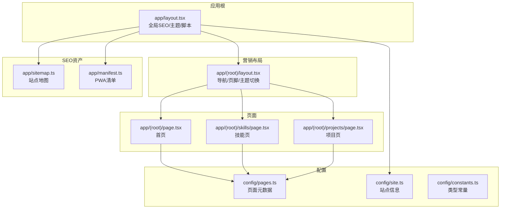
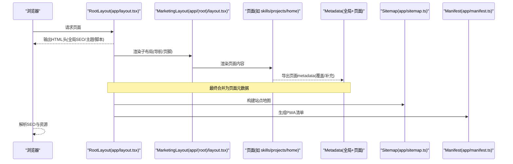
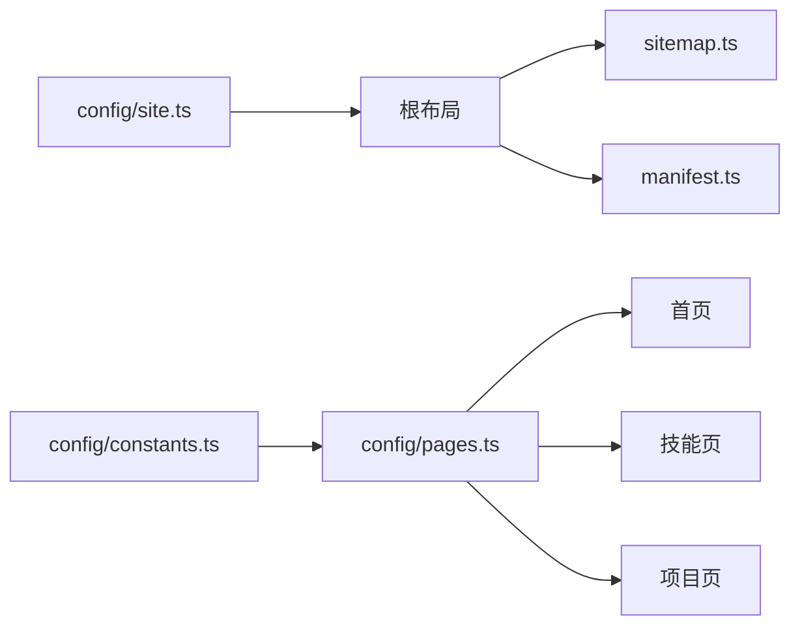

# 页面配置

<cite>
**本文引用的文件**
- [config/pages.ts](file://config/pages.ts)
- [config/site.ts](file://config/site.ts)
- [config/constants.ts](file://config/constants.ts)
- [app/layout.tsx](file://app/layout.tsx)
- [app/(root)/layout.tsx](file://app/(root)/layout.tsx)
- [app/(root)/page.tsx](file://app/(root)/page.tsx)
- [app/(root)/skills/page.tsx](file://app/(root)/skills/page.tsx)
- [app/(root)/projects/page.tsx](file://app/(root)/projects/page.tsx)
- [app/sitemap.ts](file://app/sitemap.ts)
- [app/manifest.ts](file://app/manifest.ts)
- [next.config.js](file://next.config.js)
</cite>

## 目录
1. [简介](#简介)
2. [项目结构](#项目结构)
3. [核心组件](#核心组件)
4. [架构总览](#架构总览)
5. [详细组件分析](#详细组件分析)
6. [依赖关系分析](#依赖关系分析)
7. [性能与缓存策略](#性能与缓存策略)
8. [故障排查指南](#故障排查指南)
9. [结论](#结论)
10. [附录](#附录)

## 简介
本文件面向 Next.js App Router 的项目，系统化说明“页面配置系统”的设计与实践。重点覆盖：
- 页面元数据（标题、描述、关键词、作者等）的集中式管理
- 布局配置与主题设置
- 响应式与展示层组织
- SEO 增强（Open Graph、Twitter Card、结构化数据、站点地图、Web Manifest）
- 预渲染与动态生成页面的方法
- 页面级缓存策略与性能优化建议

## 项目结构
本项目采用 Next.js App Router，根布局负责全局 SEO、主题与脚本注入；业务路由位于 app/(root) 下，各页面通过统一的 PageContainer 组织内容，并通过 config/pages.ts 集中维护页面文案与元信息。

图表来源
- [app/layout.tsx:18-85](file://app/layout.tsx#L18-L85)
- [app/(root)/layout.tsx:11-32](file://app/(root)/layout.tsx#L11-L32)
- [config/pages.ts:15-80](file://config/pages.ts#L15-L80)
- [config/site.ts:1-39](file://config/site.ts#L1-L39)
- [app/sitemap.ts:6-71](file://app/sitemap.ts#L6-L71)
- [app/manifest.ts:3-37](file://app/manifest.ts#L3-L37)

章节来源
- [app/layout.tsx:18-85](file://app/layout.tsx#L18-L85)
- [app/(root)/layout.tsx:11-32](file://app/(root)/layout.tsx#L11-L32)
- [config/pages.ts:15-80](file://config/pages.ts#L15-L80)
- [config/site.ts:1-39](file://config/site.ts#L1-L39)
- [app/sitemap.ts:6-71](file://app/sitemap.ts#L6-L71)
- [app/manifest.ts:3-37](file://app/manifest.ts#L3-L37)

## 核心组件
- 页面元数据集中配置：config/pages.ts 为每个页面提供 title、description 与 metadata.title/description，便于统一管理与复用。
- 站点级 SEO：app/layout.tsx 定义全局 Metadata（标题模板、描述、关键词、作者、Open Graph、Twitter、图标、robots、验证信息等）。
- 页面级 SEO：各页面通过导出 metadata 对象覆盖或补充全局 SEO。
- 布局与主题：根布局使用 ThemeProvider 启用多主题；营销布局提供导航、页脚与模式切换。
- SEO 资产：sitemap.ts 生成站点地图；manifest.ts 生成 PWA 清单。

章节来源
- [config/pages.ts:15-80](file://config/pages.ts#L15-L80)
- [app/layout.tsx:18-85](file://app/layout.tsx#L18-L85)
- [app/(root)/layout.tsx:11-32](file://app/(root)/layout.tsx#L11-L32)
- [app/sitemap.ts:6-71](file://app/sitemap.ts#L6-L71)
- [app/manifest.ts:3-37](file://app/manifest.ts#L3-L37)

## 架构总览
下图展示了从根布局到具体页面的元数据与布局装配流程，以及 SEO 资产的生成路径。

图表来源
- [app/layout.tsx:18-85](file://app/layout.tsx#L18-L85)
- [app/(root)/layout.tsx:11-32](file://app/(root)/layout.tsx#L11-L32)
- [app/sitemap.ts:6-71](file://app/sitemap.ts#L6-L71)
- [app/manifest.ts:3-37](file://app/manifest.ts#L3-L37)

## 详细组件分析

### 页面元数据与SEO配置
- 全局 SEO（app/layout.tsx）
  - 标题模板：默认站点名，页面标题以“页面名 | 站点名”呈现
  - 描述、关键词、作者、创建者
  - Open Graph 与 Twitter Card 完整配置（含图片尺寸与语言）
  - 图标与 Web Manifest 引用
  - robots 指令与 Google 站点验证
- 页面级 SEO（各页面）
  - 首页、技能页、项目页等通过导出 metadata 指定 title/description，并引用 pagesConfig 中的统一文案
  - 首页还注入结构化数据（Person、SoftwareApplication）以提升搜索引擎理解
- 站点地图（app/sitemap.ts）
  - 列出主要页面与博客列表，包含 lastModified、changeFrequency、priority
- PWA 清单（app/manifest.ts）
  - 名称、描述、启动地址、显示模式、主题色、图标、分类、语言与方向

章节来源
- [app/layout.tsx:18-85](file://app/layout.tsx#L18-L85)
- [app/(root)/page.tsx:28-77](file://app/(root)/page.tsx#L28-L77)
- [app/(root)/skills/page.tsx:8-11](file://app/(root)/skills/page.tsx#L8-L11)
- [app/(root)/projects/page.tsx:9-12](file://app/(root)/projects/page.tsx#L9-L12)
- [app/sitemap.ts:6-71](file://app/sitemap.ts#L6-L71)
- [app/manifest.ts:3-37](file://app/manifest.ts#L3-L37)

### 页面布局与主题
- 根布局（app/layout.tsx）
  - 引入全局样式、字体变量、ThemeProvider（支持 light/dark/retro/cyberpunk/paper/aurora/synthwave）
  - 注入第三方脚本与分析工具
- 营销布局（app/(root)/layout.tsx）
  - 顶部导航（MainNav）、GitHub Star 徽章、主题切换（ModeToggle）
  - 主内容区容器与页脚（SiteFooter）
- 页面容器
  - 页面通过 PageContainer 传入 title 与 description，用于页面内头部展示与一致性

章节来源
- [app/layout.tsx:87-130](file://app/layout.tsx#L87-L130)
- [app/(root)/layout.tsx:11-32](file://app/(root)/layout.tsx#L11-L32)
- [app/(root)/skills/page.tsx:13-21](file://app/(root)/skills/page.tsx#L13-L21)
- [app/(root)/projects/page.tsx:50-56](file://app/(root)/projects/page.tsx#L50-L56)

### 响应式与展示组织
- 使用 Tailwind 类实现响应式网格与间距（如 sm/md/lg/xl 断点）
- 首页按区块组织：项目、经历、贡献、技能、博客、联系
- 项目页使用 ResponsiveTabs 对“全部/个人/专业”进行筛选展示

章节来源
- [app/(root)/page.tsx:79-350](file://app/(root)/page.tsx#L79-L350)
- [app/(root)/projects/page.tsx:14-56](file://app/(root)/projects/page.tsx#L14-L56)

### 预渲染与动态生成
- 静态页面
  - 大多数页面为静态导出（无服务端数据），由 Next.js 在构建时生成
- 动态页面
  - 博客详情使用动态路由参数，结合异步获取文章数据与 notFound 处理
  - 列表页可基于异步数据生成（如首页精选博客）
- 站点地图与清单
  - sitemap.ts 与 manifest.ts 作为元数据入口，参与构建期生成

章节来源
- [app/(root)/page.tsx:36-77](file://app/(root)/page.tsx#L36-L77)
- [app/sitemap.ts:6-71](file://app/sitemap.ts#L6-L71)
- [app/manifest.ts:3-37](file://app/manifest.ts#L3-L37)

### 页面配置最佳实践
- 将页面文案与元数据集中在 config/pages.ts，避免散落在页面中
- 使用全局 metadata 模板统一标题格式，页面仅覆盖必要字段
- 为每页配置 canonical 与 alternates，避免重复内容问题
- 为博客等长文配置 Open Graph/Twitter 图片与发布时间，提升分享体验
- 使用 sitemap 明确页面优先级与更新频率，辅助爬虫抓取
- 保持主题一致性与可访问性（aria-label、alt 文本）

章节来源
- [config/pages.ts:15-80](file://config/pages.ts#L15-L80)
- [app/layout.tsx:18-85](file://app/layout.tsx#L18-L85)
- [app/(root)/page.tsx:28-77](file://app/(root)/page.tsx#L28-L77)
- [app/sitemap.ts:6-71](file://app/sitemap.ts#L6-L71)

## 依赖关系分析
- 页面与配置
  - 页面通过 pagesConfig 获取标题与描述，保证文案一致性
  - 站点信息来自 siteConfig，贯穿 SEO、OG、Manifest 等
- 类型约束
  - constants.ts 定义了 ValidPages 等类型，确保配置键名安全
- 布局与组件
  - 根布局与营销布局组合形成页面外壳
  - 页面内部通过通用 UI 组件与动画组件组织内容

图表来源
- [config/pages.ts:15-80](file://config/pages.ts#L15-L80)
- [config/site.ts:1-39](file://config/site.ts#L1-L39)
- [config/constants.ts:82-90](file://config/constants.ts#L82-L90)
- [app/layout.tsx:18-85](file://app/layout.tsx#L18-L85)
- [app/sitemap.ts:6-71](file://app/sitemap.ts#L6-L71)
- [app/manifest.ts:3-37](file://app/manifest.ts#L3-L37)

章节来源
- [config/pages.ts:15-80](file://config/pages.ts#L15-L80)
- [config/site.ts:1-39](file://config/site.ts#L1-L39)
- [config/constants.ts:82-90](file://config/constants.ts#L82-L90)
- [app/layout.tsx:18-85](file://app/layout.tsx#L18-L85)
- [app/sitemap.ts:6-71](file://app/sitemap.ts#L6-L71)
- [app/manifest.ts:3-37](file://app/manifest.ts#L3-L37)

## 性能与缓存策略
- 构建期生成
  - 站点地图与 PWA 清单在构建时生成，减少运行时开销
- 资源加载
  - 根布局按需注入第三方脚本与分析代码，避免阻塞首屏
- 图片优化
  - 首页头像使用 next/image，并设置 priority 与 sizes，提升 LCP
- 主题与字体
  - 使用 CSS 变量与字体变量，减少重绘与回流
- 路由与数据
  - 静态页面优先；需要数据的页面采用异步函数，必要时配合 revalidate 或 ISR（当前未显式配置）
- 缓存建议
  - 对频繁更新的列表页考虑增量静态再生成（ISR）
  - 对 API 调用添加合理的缓存策略（如 fetch 缓存或后端缓存头）

章节来源
- [app/layout.tsx:87-130](file://app/layout.tsx#L87-L130)
- [app/(root)/page.tsx:81-89](file://app/(root)/page.tsx#L81-L89)
- [app/sitemap.ts:6-71](file://app/sitemap.ts#L6-L71)
- [app/manifest.ts:3-37](file://app/manifest.ts#L3-L37)
- [next.config.js:1-5](file://next.config.js#L1-L5)

## 故障排查指南
- 标题未生效
  - 检查页面是否导出了 metadata，且 title 是否正确覆盖全局模板
- OG 图片不显示
  - 确认 Open Graph 图片 URL 可访问，尺寸符合推荐值
- 站点地图缺失页面
  - 核对 sitemap.ts 是否包含该路由，lastModified 与 changeFrequency 是否合理
- PWA 无法安装
  - 检查 manifest 的 start_url、display、icons 与 scope 配置
- 主题切换无效
  - 确认 ThemeProvider 已包裹应用，且 class 属性正确传递

章节来源
- [app/layout.tsx:18-85](file://app/layout.tsx#L18-L85)
- [app/sitemap.ts:6-71](file://app/sitemap.ts#L6-L71)
- [app/manifest.ts:3-37](file://app/manifest.ts#L3-L37)

## 结论
本项目通过集中式的页面配置与全局 SEO 管理，实现了清晰、可维护的页面元数据体系。结合 App Router 的布局分层、丰富的主题支持与完善的 SEO 资产（OG/Twitter/Sitemap/Manifest），在保证用户体验的同时提升了搜索引擎友好度。建议在后续迭代中继续完善 ISR 与缓存策略，进一步提升性能与可扩展性。

## 附录
- 关键配置位置速查
  - 全局 SEO：[app/layout.tsx:18-85](file://app/layout.tsx#L18-L85)
  - 页面元数据：[config/pages.ts:15-80](file://config/pages.ts#L15-L80)
  - 站点信息：[config/site.ts:1-39](file://config/site.ts#L1-L39)
  - 站点地图：[app/sitemap.ts:6-71](file://app/sitemap.ts#L6-L71)
  - PWA 清单：[app/manifest.ts:3-37](file://app/manifest.ts#L3-L37)
  - 首页结构化数据：[app/(root)/page.tsx:28-77](file://app/(root)/page.tsx#L28-L77)
  - 技能页元数据：[app/(root)/skills/page.tsx:8-11](file://app/(root)/skills/page.tsx#L8-L11)
  - 项目页元数据：[app/(root)/projects/page.tsx:9-12](file://app/(root)/projects/page.tsx#L9-L12)