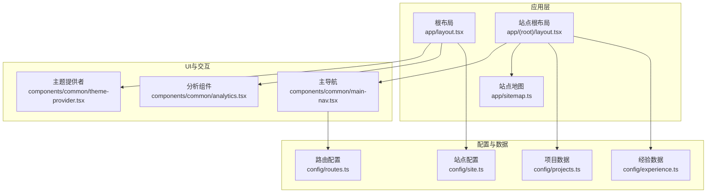
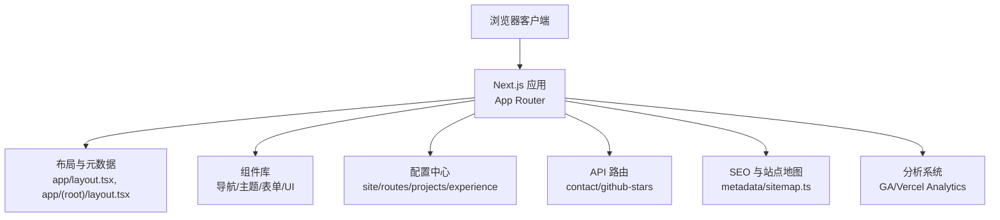
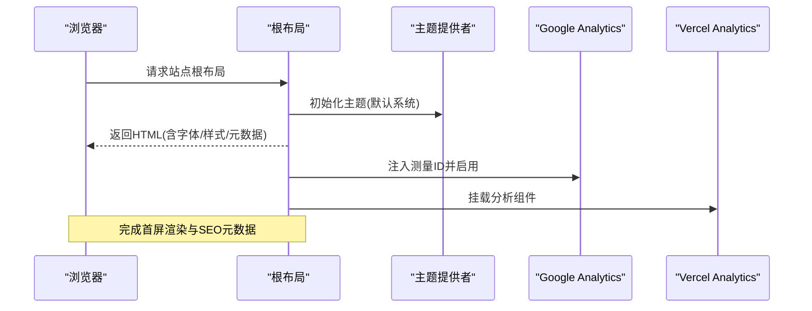
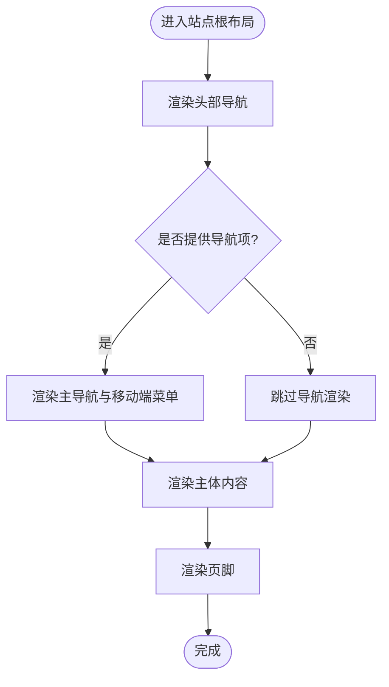
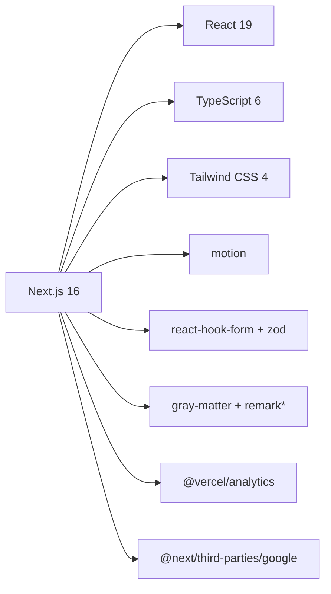

# 项目概述

<cite>
**本文引用的文件**
- [package.json](file://package.json)
- [README.md](file://README.md)
- [next.config.js](file://next.config.js)
- [app/layout.tsx](file://app/layout.tsx)
- [app/(root)/layout.tsx](file://app/(root)/layout.tsx)
- [components/common/theme-provider.tsx](file://components/common/theme-provider.tsx)
- [components/common/main-nav.tsx](file://components/common/main-nav.tsx)
- [config/site.ts](file://config/site.ts)
- [config/routes.ts](file://config/routes.ts)
- [config/projects.ts](file://config/projects.ts)
- [config/experience.ts](file://config/experience.ts)
- [app/sitemap.ts](file://app/sitemap.ts)
- [components/common/analytics.tsx](file://components/common/analytics.tsx)
- [tsconfig.json](file://tsconfig.json)
</cite>

## 目录
1. [简介](#简介)
2. [项目结构](#项目结构)
3. [核心组件](#核心组件)
4. [架构总览](#架构总览)
5. [详细组件分析](#详细组件分析)
6. [依赖分析](#依赖分析)
7. [性能与SEO优化](#性能与seo优化)
8. [快速开始指南](#快速开始指南)
9. [故障排查](#故障排查)
10. [结论](#结论)

## 简介
本项目是一个现代化的响应式个人作品集网站模板，专为开发者、设计师和专业人士打造。它基于 Next.js 16、React 19、TypeScript 和 Tailwind CSS 构建，强调 SEO 友好、多主题切换、动画体验与高性能表现。项目提供经验时间线、项目展示、技能展示、博客、贡献记录、联系表单等模块，支持深色/浅色/复古/赛博朋克/极光/合成波/纸张等多种主题，并内置 Google Analytics 与 Vercel Analytics 集成，便于追踪与分析。

该模板适合希望快速搭建高质量个人品牌站点的开发者，既对初学者友好，又为有经验的工程师提供了足够的扩展空间与技术深度。

## 项目结构
项目采用 Next.js App Router 的目录组织方式，按功能域划分页面与组件：
- app：路由与布局（根布局、站点根布局、API 路由、站点地图与清单）
- components：可复用 UI 与业务组件（导航、主题、表单、卡片、模态等）
- config：站点配置与数据源（站点信息、路由、项目、经验、技能、社交链接等）
- content/blogs：Markdown 博客内容
- hooks：自定义 Hooks
- providers：全局 Provider（动画、模态）
- public：静态资源
- lib：工具函数与博客解析逻辑

图表来源
- [app/layout.tsx:1-145](file://app/layout.tsx#L1-L145)
- [app/(root)/layout.tsx:1-33](file://app/(root)/layout.tsx#L1-L33)
- [app/sitemap.ts:1-72](file://app/sitemap.ts#L1-L72)
- [components/common/theme-provider.tsx:1-8](file://components/common/theme-provider.tsx#L1-L8)
- [components/common/main-nav.tsx:1-105](file://components/common/main-nav.tsx#L1-L105)
- [config/site.ts:1-41](file://config/site.ts#L1-L41)
- [config/routes.ts:1-29](file://config/routes.ts#L1-L29)
- [config/projects.ts:1-596](file://config/projects.ts#L1-L596)
- [config/experience.ts:1-93](file://config/experience.ts#L1-L93)

章节来源
- [app/layout.tsx:1-145](file://app/layout.tsx#L1-L145)
- [app/(root)/layout.tsx:1-33](file://app/(root)/layout.tsx#L1-L33)
- [config/site.ts:1-41](file://config/site.ts#L1-L41)
- [config/routes.ts:1-29](file://config/routes.ts#L1-L29)

## 核心组件
- 根布局与元数据：集中管理站点标题、描述、关键词、Open Graph/Twitter 卡片、图标、manifest、robots、Google 验证与 Google Analytics 注入。
- 站点根布局：统一头部导航、页脚、主体区域，集成 GitHub Star 徽章与主题切换按钮。
- 主题提供者：基于 next-themes 提供多主题能力（light/dark/retro/cyberpunk/paper/aurora/synthwave）。
- 主导航：响应式导航栏，支持移动端菜单、当前路由高亮与动效。
- 站点地图：动态生成主要页面与博客文章的 sitemap，提升搜索引擎收录效率。
- 分析组件：集成 Vercel Analytics，配合根布局中的 Google Analytics 实现双通道分析。

章节来源
- [app/layout.tsx:30-145](file://app/layout.tsx#L30-L145)
- [app/(root)/layout.tsx:1-33](file://app/(root)/layout.tsx#L1-L33)
- [components/common/theme-provider.tsx:1-8](file://components/common/theme-provider.tsx#L1-L8)
- [components/common/main-nav.tsx:1-105](file://components/common/main-nav.tsx#L1-L105)
- [app/sitemap.ts:1-72](file://app/sitemap.ts#L1-L72)
- [components/common/analytics.tsx:1-8](file://components/common/analytics.tsx#L1-L8)

## 架构总览
整体架构遵循“配置驱动 + 组件化 + 服务端渲染”的现代前端工程模式：
- 配置层：site、routes、projects、experience 等集中管理内容与路由，便于维护与扩展。
- 视图层：Next.js App Router 页面与布局组合，结合 shadcn/ui 与 Tailwind 构建一致 UI。
- 交互层：motion 动画、状态管理（如 Zustand）、表单校验（Zod + react-hook-form）。
- 服务层：Next.js API 路由处理联系表单与外部数据（如 GitHub Stars），并通过 headers 配置跨域策略。
- 分析与监控：Google Analytics 与 Vercel Analytics 并行接入，便于性能与用户行为分析。

图表来源
- [app/layout.tsx:1-145](file://app/layout.tsx#L1-L145)
- [app/(root)/layout.tsx:1-33](file://app/(root)/layout.tsx#L1-L33)
- [app/sitemap.ts:1-72](file://app/sitemap.ts#L1-L72)
- [components/common/analytics.tsx:1-8](file://components/common/analytics.tsx#L1-L8)
- [next.config.js:1-25](file://next.config.js#L1-L25)

## 详细组件分析

### 根布局与元数据
- 职责：定义站点语言、字体、主题、全局样式、SEO 元数据、图标与 manifest、robots 控制、Google 验证、Google Analytics 注入。
- 关键点：
  - 使用 siteConfig 统一管理站点名称、描述、关键词、OG 图片、作者信息等。
  - 通过 next/font 加载 Inter 字体，并使用本地 CalSans 作为标题字体变量。
  - 在 body 中挂载 ThemeProvider、Toaster、ModalProvider、Analytics 与第三方脚本。
  - 强制要求设置 NEXT_PUBLIC_GOOGLE_MEASUREMENT_ID，否则启动时报错，确保分析可用。

图表来源
- [app/layout.tsx:30-145](file://app/layout.tsx#L30-L145)
- [components/common/theme-provider.tsx:1-8](file://components/common/theme-provider.tsx#L1-L8)
- [components/common/analytics.tsx:1-8](file://components/common/analytics.tsx#L1-L8)

章节来源
- [app/layout.tsx:30-145](file://app/layout.tsx#L30-L145)
- [config/site.ts:1-41](file://config/site.ts#L1-L41)

### 站点根布局与导航
- 职责：提供统一的头部导航、GitHub Star 徽章、主题切换按钮、页脚与主体容器。
- 关键点：
  - 使用 routesConfig.mainNav 渲染主导航项，支持禁用与当前段高亮。
  - 响应式设计：桌面端显示完整导航，移动端提供折叠菜单。
  - 集成 motion 动画，提升交互体验。

图表来源
- [app/(root)/layout.tsx:1-33](file://app/(root)/layout.tsx#L1-L33)
- [components/common/main-nav.tsx:1-105](file://components/common/main-nav.tsx#L1-L105)
- [config/routes.ts:1-29](file://config/routes.ts#L1-L29)

章节来源
- [app/(root)/layout.tsx:1-33](file://app/(root)/layout.tsx#L1-L33)
- [components/common/main-nav.tsx:1-105](file://components/common/main-nav.tsx#L1-L105)
- [config/routes.ts:1-29](file://config/routes.ts#L1-L29)

### 主题提供者
- 职责：封装 next-themes，提供多主题切换能力。
- 关键点：
  - 支持 light/dark/retro/cyberpunk/paper/aurora/synthwave 主题。
  - 通过 attribute="class" 将主题类名应用到 DOM，便于 Tailwind 主题变量生效。

章节来源
- [components/common/theme-provider.tsx:1-8](file://components/common/theme-provider.tsx#L1-L8)
- [app/layout.tsx:115-128](file://app/layout.tsx#L115-L128)

### 站点地图与SEO
- 职责：生成站点地图，包含主页与子页面以及博客文章，提升搜索引擎收录与索引质量。
- 关键点：
  - 动态读取博客元数据，为每篇文章生成独立条目。
  - 设置 changeFrequency 与 priority，帮助搜索引擎理解更新频率与重要性。

章节来源
- [app/sitemap.ts:1-72](file://app/sitemap.ts#L1-L72)

### 分析系统
- 职责：集成 Vercel Analytics 与 Google Analytics，提供用户行为与性能指标。
- 关键点：
  - 根布局注入 Google Analytics，要求配置测量 ID。
  - 站点内挂载 Vercel Analytics 组件，简化埋点。

章节来源
- [components/common/analytics.tsx:1-8](file://components/common/analytics.tsx#L1-L8)
- [app/layout.tsx:100-145](file://app/layout.tsx#L100-L145)

## 依赖分析
- 框架与运行时：Next.js 16、React 19、TypeScript 6。
- UI 与样式：Tailwind CSS 4、shadcn/ui（基于 Radix UI）、class-variance-authority、clsx、tailwind-merge。
- 动画：motion（Framer Motion）。
- 表单与校验：react-hook-form、zod 4。
- 内容处理：gray-matter、remark、remark-gfm、remark-html（用于 Markdown 博客解析）。
- 分析：@vercel/analytics、@next/third-parties/google。
- 其他：zustand（状态管理）、lucide-react（图标）、postcss。

图表来源
- [package.json:11-57](file://package.json#L11-L57)

章节来源
- [package.json:11-57](file://package.json#L11-L57)
- [tsconfig.json:1-43](file://tsconfig.json#L1-L43)

## 性能与SEO优化
- 性能：
  - 使用 Next.js 16 与 Turbopack 加速开发构建。
  - 合理拆分组件与懒加载，减少首屏体积。
  - 使用 motion 进行轻量级动画，避免过度重排。
  - 通过 next/font 与本地字体变量优化字体加载。
- SEO：
  - 根布局集中设置 metadata（title、description、keywords、authors、openGraph、twitter、icons、manifest、alternates、robots、verification）。
  - 站点地图动态生成，覆盖主要页面与博客文章。
  - robots 允许抓取与索引，并为 GoogleBot 设置预览与片段限制。
- 可访问性与响应式：
  - 使用语义化 HTML 与 Tailwind 响应式类，适配多设备。
  - 主题切换与无障碍友好的颜色对比度。

章节来源
- [app/layout.tsx:30-97](file://app/layout.tsx#L30-L97)
- [app/sitemap.ts:1-72](file://app/sitemap.ts#L1-L72)
- [next.config.js:1-25](file://next.config.js#L1-L25)

## 快速开始指南
- 环境要求：Node.js（推荐最新稳定版）、包管理器（npm/yarn/pnpm）。
- 安装步骤：
  1. 克隆仓库到本地。
  2. 复制 .env.copy 为 .env 并填写必要的环境变量（特别是 NEXT_PUBLIC_GOOGLE_MEASUREMENT_ID）。
  3. 安装依赖（npm install / yarn install / pnpm install）。
  4. 启动开发服务器（npm run dev / yarn dev / pnpm dev）。
  5. 打开 http://localhost:3000 查看站点。
- 基本使用：
  - 修改 config/site.ts 以更新站点信息与社交链接。
  - 在 config/projects.ts 与 config/experience.ts 中添加或编辑项目与经历。
  - 在 content/blogs 下新增 Markdown 文章，自动纳入站点地图。
  - 如需对接后端服务，可在 app/api 下新增路由。

章节来源
- [README.md:44-77](file://README.md#L44-L77)
- [config/site.ts:1-41](file://config/site.ts#L1-L41)
- [config/projects.ts:1-596](file://config/projects.ts#L1-L596)
- [config/experience.ts:1-93](file://config/experience.ts#L1-L93)
- [app/sitemap.ts:61-70](file://app/sitemap.ts#L61-L70)

## 故障排查
- 缺少 Google Analytics ID：根布局会抛出错误，需确保已设置 NEXT_PUBLIC_GOOGLE_MEASUREMENT_ID。
- 跨域问题：若使用外部 API，可通过 next.config.js 的 headers 配置 CORS 策略。
- 主题不生效：确认 ThemeProvider 已正确包裹应用，且 theme 列表包含所需主题。
- 导航异常：检查 config/routes.ts 是否正确配置 mainNav，并确保路由路径与页面匹配。
- 博客未收录：确认 content/blogs 下的 Markdown 文件存在且被 lib/blogs 正确解析，sitemap 会动态生成对应条目。

章节来源
- [app/layout.tsx:100-103](file://app/layout.tsx#L100-L103)
- [next.config.js:3-21](file://next.config.js#L3-L21)
- [components/common/theme-provider.tsx:1-8](file://components/common/theme-provider.tsx#L1-L8)
- [config/routes.ts:1-29](file://config/routes.ts#L1-L29)
- [app/sitemap.ts:61-70](file://app/sitemap.ts#L61-L70)

## 结论
本模板以现代技术栈为基础，提供开箱即用的个人作品集解决方案。其清晰的配置驱动架构、完善的 SEO 与性能优化、丰富的主题与动画体验，使其成为开发者快速搭建高质量个人站点的理想选择。无论是初学者还是经验丰富的工程师，都能在此基础上高效定制与扩展，满足多样化的展示与业务需求。