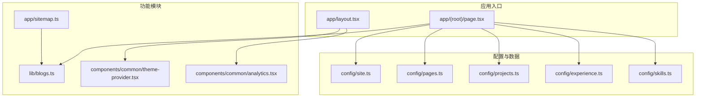
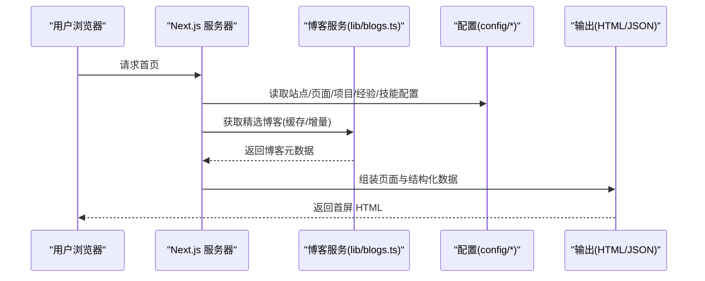
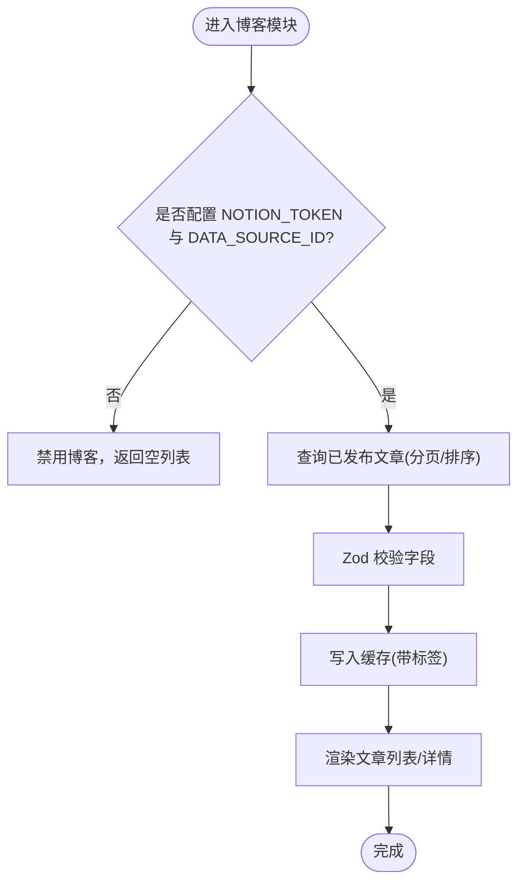
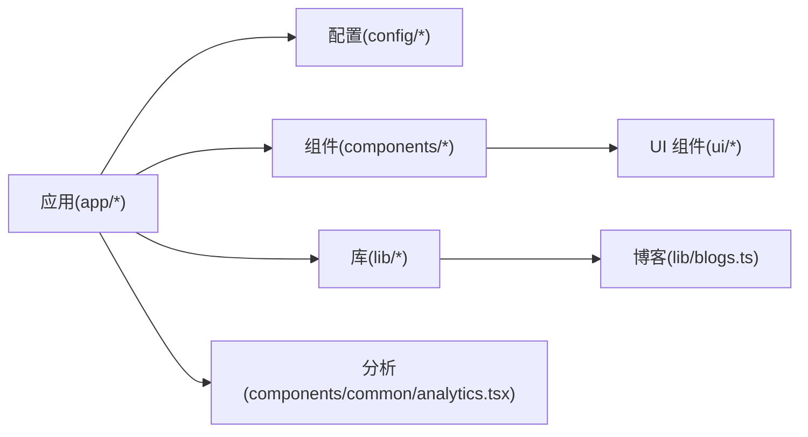

# 项目概述

<cite>
**本文引用的文件**
- [README.md](file://README.md)
- [package.json](file://package.json)
- [next.config.js](file://next.config.js)
- [app/layout.tsx](file://app/layout.tsx)
- [app/(root)/page.tsx](file://app/(root)/page.tsx)
- [config/site.ts](file://config/site.ts)
- [config/pages.ts](file://config/pages.ts)
- [config/projects.ts](file://config/projects.ts)
- [config/experience.ts](file://config/experience.ts)
- [config/skills.ts](file://config/skills.ts)
- [components/common/theme-provider.tsx](file://components/common/theme-provider.tsx)
- [components/common/analytics.tsx](file://components/common/analytics.tsx)
- [lib/blogs.ts](file://lib/blogs.ts)
- [app/sitemap.ts](file://app/sitemap.ts)
</cite>

## 目录
1. [简介](#简介)
2. [项目结构](#项目结构)
3. [核心组件](#核心组件)
4. [架构总览](#架构总览)
5. [详细组件分析](#详细组件分析)
6. [依赖分析](#依赖分析)
7. [性能与SEO优化](#性能与seo优化)
8. [快速开始指南](#快速开始指南)
9. [故障排查](#故障排查)
10. [结论](#结论)

## 简介
这是一个现代化的、响应式的个人作品集网站模板，专为开发者、设计师和专业人士打造。项目基于 Next.js App Router 构建，采用 TypeScript、React、Tailwind CSS 与 shadcn/ui，提供多主题支持、完善的 SEO 元数据、结构化数据、博客系统（Notion 驱动）、联系表单与分析集成，并具备优秀的性能表现与可访问性。

该模板适合用于展示个人技能、项目经历、开源贡献与技术博客，帮助你在求职、合作与品牌传播中更高效地呈现自己。

## 项目结构
项目采用 Next.js App Router 的目录式路由组织方式，按“功能域 + 共享层”进行分层：
- app：页面路由、站点级布局、API 路由、站点地图与清单
- components：UI 组件与业务组件，细分为通用组件、各模块组件与基础 UI
- config：站点信息、页面配置、项目/经验/技能等数据集中管理
- lib：工具函数、博客数据获取与处理逻辑
- providers：全局状态与上下文提供者（如模态框、动画）
- public：静态资源（图片、图标、robots.txt 等）
- hooks：自定义 Hook
- content：本地 Markdown 内容（可选）

图表来源
- [app/layout.tsx:1-131](file://app/layout.tsx#L1-L131)
- [app/(root)/page.tsx:1-354](file://app/(root)/page.tsx#L1-L354)
- [config/site.ts:1-39](file://config/site.ts#L1-L39)
- [config/pages.ts:1-81](file://config/pages.ts#L1-L81)
- [config/projects.ts:1-422](file://config/projects.ts#L1-L422)
- [config/experience.ts:1-69](file://config/experience.ts#L1-L69)
- [config/skills.ts:1-154](file://config/skills.ts#L1-L154)
- [lib/blogs.ts:1-550](file://lib/blogs.ts#L1-L550)
- [components/common/theme-provider.tsx:1-11](file://components/common/theme-provider.tsx#L1-L11)
- [components/common/analytics.tsx:1-8](file://components/common/analytics.tsx#L1-L8)
- [app/sitemap.ts:1-72](file://app/sitemap.ts#L1-L72)

章节来源
- [README.md:1-208](file://README.md#L1-L208)
- [package.json:1-68](file://package.json#L1-L68)

## 核心组件
- 站点根布局与元数据：在根布局中统一注入站点标题、描述、关键词、Open Graph/Twitter Card、图标、manifest、robots 与 Google 验证等 SEO 元信息，并挂载主题提供者与分析脚本。
- 首页聚合页：加载精选项目、工作经历、开源贡献、技能、博客与联系方式，渲染结构化数据（Person、SoftwareApplication），并提供导航入口。
- 主题系统：通过 next-themes 提供多主题切换（Light、Dark、Retro、Cyberpunk、Paper、Aurora、Synthwave），并支持跟随系统主题。
- 博客系统：基于 Notion API 拉取已发布文章，使用 Zod 校验字段，结合缓存与 Webhook 刷新机制，生成文章列表与详情。
- 站点地图：动态生成主站页面与博客文章的 sitemap，提升搜索引擎收录效率。
- 分析集成：内置 Vercel Analytics，并在根布局中可选接入 Google Analytics。

章节来源
- [app/layout.tsx:18-85](file://app/layout.tsx#L18-L85)
- [app/(root)/page.tsx:28-77](file://app/(root)/page.tsx#L28-L77)
- [components/common/theme-provider.tsx:1-11](file://components/common/theme-provider.tsx#L1-L11)
- [lib/blogs.ts:92-131](file://lib/blogs.ts#L92-L131)
- [app/sitemap.ts:6-70](file://app/sitemap.ts#L6-L70)
- [components/common/analytics.tsx:1-8](file://components/common/analytics.tsx#L1-L8)

## 架构总览
整体采用“服务端优先”的渲染策略：
- 服务端渲染（SSR）与静态生成（SSG）结合，首屏内容快速呈现
- 数据源集中在 config 与 lib 层，便于维护与扩展
- 通过 Next.js Route Handler 暴露 API（如联系表单、GitHub Stars 接口）
- 使用客户端组件按需加载交互能力（如主题切换、动效）

图表来源
- [app/(root)/page.tsx:36-77](file://app/(root)/page.tsx#L36-L77)
- [lib/blogs.ts:404-420](file://lib/blogs.ts#L404-L420)
- [config/site.ts:1-39](file://config/site.ts#L1-L39)
- [config/projects.ts:66-161](file://config/projects.ts#L66-L161)
- [config/experience.ts:17-69](file://config/experience.ts#L17-L69)
- [config/skills.ts:10-154](file://config/skills.ts#L10-L154)

## 详细组件分析

### 站点根布局与 SEO
- 统一设置 metadataBase、title、description、keywords、作者、创建者
- 配置 Open Graph 与 Twitter Card 图像与文案
- 设置 favicon、apple-touch-icon、manifest 与 canonical
- robots 允许索引与抓取，GoogleBot 开启大图预览与大片段
- 在根布局中挂载 ThemeProvider、Analytics、ModalProvider，并注入第三方聊天小部件脚本
- 条件注入 Google Analytics（需环境变量）

章节来源
- [app/layout.tsx:18-85](file://app/layout.tsx#L18-L85)
- [app/layout.tsx:87-131](file://app/layout.tsx#L87-L131)

### 首页聚合与结构化数据
- 加载精选项目、工作经历、开源贡献、技能、博客与联系方式
- 注入 Person 与 SoftwareApplication 结构化数据，利于搜索引擎理解
- 使用动画组件与响应式布局，提升用户体验与可访问性

章节来源
- [app/(root)/page.tsx:28-77](file://app/(root)/page.tsx#L28-L77)
- [app/(root)/page.tsx:143-351](file://app/(root)/page.tsx#L143-L351)

### 主题系统
- 通过 next-themes 提供多主题切换，默认跟随系统主题
- 支持 Light、Dark、Retro、Cyberpunk、Paper、Aurora、Synthwave 等多套主题
- 以客户端组件形式包裹应用，确保主题切换无闪烁

章节来源
- [components/common/theme-provider.tsx:1-11](file://components/common/theme-provider.tsx#L1-L11)
- [app/layout.tsx:100-117](file://app/layout.tsx#L100-L117)

### 博客系统（Notion 驱动）
- 从 Notion Data Source 查询已发布文章，严格校验字段（Zod）
- 使用 unstable_cache 对文章列表与文章内容进行缓存，支持按时间或标签刷新
- 支持 Webhook 触发缓存失效，实现近实时更新
- 将 Markdown 转换为安全 HTML，估算阅读时长，生成 slug 与标签
- 首页展示精选文章，独立路由展示全文

图表来源
- [lib/blogs.ts:92-131](file://lib/blogs.ts#L92-L131)
- [lib/blogs.ts:337-420](file://lib/blogs.ts#L337-L420)
- [lib/blogs.ts:422-536](file://lib/blogs.ts#L422-L536)

章节来源
- [lib/blogs.ts:1-550](file://lib/blogs.ts#L1-L550)

### 站点地图
- 动态生成主站页面与博客文章的 sitemap
- 为每个博客文章设置 lastModified 与优先级，提升收录质量

章节来源
- [app/sitemap.ts:1-72](file://app/sitemap.ts#L1-L72)

### 分析与监控
- 内置 Vercel Analytics，轻量且隐私友好
- 可选接入 Google Analytics（通过环境变量控制）

章节来源
- [components/common/analytics.tsx:1-8](file://components/common/analytics.tsx#L1-L8)
- [app/layout.tsx:87-131](file://app/layout.tsx#L87-L131)

## 依赖分析
- 框架与语言：Next.js 16、React 19、TypeScript 6
- UI 与样式：Tailwind CSS 4、shadcn/ui、Motion（动画）
- 表单与校验：react-hook-form、zod
- 内容源：@notionhq/client（博客）
- 分析：@vercel/analytics、@next/third-parties/google
- 其他：zustand（状态）、rehype/remark（Markdown 处理）、lucide-react（图标）

图表来源
- [package.json:13-49](file://package.json#L13-L49)
- [app/layout.tsx:1-131](file://app/layout.tsx#L1-L131)
- [lib/blogs.ts:1-550](file://lib/blogs.ts#L1-L550)

章节来源
- [package.json:1-68](file://package.json#L1-L68)

## 性能与SEO优化
- 性能
  - 首屏 SSR/SSG 结合，减少白屏时间
  - 图片与媒体资源按需加载与优化
  - 使用 Motion 提供轻量动效，避免过度重排
  - 博客内容缓存与增量刷新，降低外部 API 压力
- SEO
  - 完整的 meta 与 OG/Twitter 卡片
  - JSON-LD 结构化数据（Person、SoftwareApplication、BlogPosting、BreadcrumbList）
  - robots 与 sitemap 自动生成
  - canonical 与规范化 URL
  - 中文内容与本地化设置（zh_CN）

章节来源
- [app/layout.tsx:18-85](file://app/layout.tsx#L18-L85)
- [app/(root)/page.tsx:28-77](file://app/(root)/page.tsx#L28-L77)
- [app/sitemap.ts:6-70](file://app/sitemap.ts#L6-L70)
- [lib/blogs.ts:404-420](file://lib/blogs.ts#L404-L420)

## 快速开始指南
- 克隆仓库并安装依赖
- 复制环境变量模板并填写必要配置（如 Notion Token、Data Source ID、分析 ID 等）
- 启动开发服务器，打开本地地址查看效果
- 如需启用博客，按 README 中的说明配置 Notion 数据库与 Webhook
- 部署推荐平台：Vercel

章节来源
- [README.md:46-73](file://README.md#L46-L73)
- [README.md:74-133](file://README.md#L74-L133)
- [package.json:6-12](file://package.json#L6-L12)

## 故障排查
- 博客未显示
  - 检查是否配置了 NOTION_TOKEN 与 NOTION_DATA_SOURCE_ID
  - 确认 Notion 数据源的 Status 包含 Published 选项
  - 查看控制台警告与错误日志，确认属性类型与必填字段
- 博客更新不及时
  - 调整 NOTION_BLOG_REVALIDATE_SECONDS 缓存刷新间隔
  - 配置 Webhook 并保存验证令牌，触发缓存失效
- 主题切换异常
  - 确保 ThemeProvider 正确包裹应用
  - 检查客户端组件的使用位置与 hydration 警告
- 分析未生效
  - 检查环境变量是否正确注入
  - 确认浏览器控制台无拦截或 CSP 限制

章节来源
- [lib/blogs.ts:92-131](file://lib/blogs.ts#L92-L131)
- [lib/blogs.ts:287-335](file://lib/blogs.ts#L287-L335)
- [lib/blogs.ts:404-420](file://lib/blogs.ts#L404-L420)
- [app/layout.tsx:87-131](file://app/layout.tsx#L87-L131)

## 结论
该项目提供了一个完整、可扩展的个人作品集解决方案，覆盖内容展示、技术栈呈现、博客写作与发布、SEO 优化与性能调优。通过集中化的配置与模块化组件设计，用户可以快速定制并上线自己的专业网站。无论是求职者、自由职业者还是企业工程师，都能借助此模板高效建立个人品牌与技术影响力。